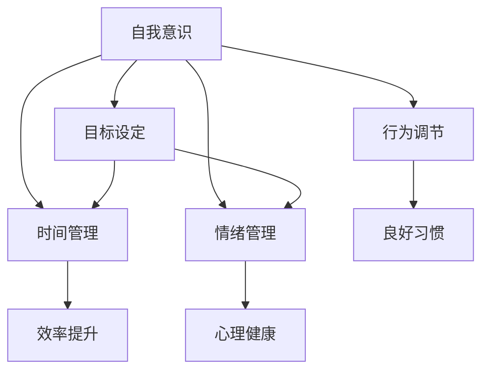

                 

### 以身作则：自我管理的重要性

> 关键词：自我管理，时间管理，目标设定，情绪管理，自我激励，人际关系，持续成长，案例分析

> 摘要：本文旨在探讨自我管理的重要性，从时间管理、目标设定、情绪管理、自我激励、人际关系、持续成长等方面入手，通过理论阐述、实践案例和算法原理，帮助读者理解并掌握自我管理的核心技巧和方法，以实现个人和职业的全面发展。

## 引言

在当今快节奏的社会中，自我管理成为了一个热门话题。自我管理不仅仅关乎个人的成长和成功，更是决定我们生活质量的重要因素。那么，什么是自我管理？为什么它如此重要？本文将从以下几个方面展开讨论：

1. **自我管理的核心概念与联系**
2. **时间管理与目标设定**
3. **情绪管理与自我激励**
4. **人际关系与持续成长**
5. **案例分析与实践应用**

通过这些内容的深入探讨，我们希望能够帮助读者更好地理解和应用自我管理的原则和方法，从而提升个人和职业的竞争力。

### 自我管理的核心概念与联系

自我管理是一个宽泛的概念，涵盖了多个方面的内容。首先，我们需要明确几个核心概念，包括自我意识、目标设定、时间管理、情绪管理和行为调节。

**自我意识**是自我管理的基石。它涉及到我们对自己的认知、价值观和信仰的理解。自我意识可以帮助我们识别自己的情绪和行为模式，从而做出更明智的决策。

**目标设定**是自我管理的核心之一。明确的目标可以帮助我们保持动力和方向，从而更有效地实现个人和职业目标。

**时间管理**是自我管理的另一个关键方面。有效地管理时间可以提升工作效率，减少压力，从而提高生活质量。

**情绪管理**则涉及到如何处理和调节自己的情绪，以保持积极的心态和良好的心理健康。

**行为调节**是指通过自我管理策略来改变不良行为模式，培养良好的行为习惯。

这些核心概念之间有着紧密的联系。例如，目标设定可以指导我们的时间管理，而情绪管理则可以帮助我们更好地应对挑战，从而实现目标。

**Mermaid 流程图：自我管理核心概念架构**

### 时间管理

时间管理是自我管理中至关重要的一环。有效的时间管理不仅可以提升工作效率，还可以减少压力，提高生活质量。以下是一些时间管理策略、技巧和方法：

**策略**：

1. **优先级排序**：根据任务的紧急程度和重要性，将任务分为四个象限，优先处理重要且紧急的任务。
2. **番茄工作法**：将工作时间分为25分钟工作周期和5分钟休息周期，以提高专注力和效率。

**技巧**：

1. **减少干扰**：关闭手机通知、避免社交媒体，集中注意力完成当前任务。
2. **时间日志**：记录每天的时间使用情况，分析并优化时间分配。

**方法**：

1. **设置截止日期**：为每个任务设定明确的截止日期，以保持进度和压力。
2. **分解任务**：将大任务分解为小任务，逐步完成，以减少压力。

### 目标设定

目标设定是自我管理中的另一个关键方面。明确的目标可以帮助我们保持动力和方向，从而更有效地实现个人和职业目标。以下是一些目标设定的原则、方法和实现路径：

**原则**：

1. **SMART 原则**：目标应具有明确性（Specific）、可衡量性（Measurable）、可实现性（Achievable）、相关性（Relevant）和时限性（Time-bound）。
2. **可行性原则**：目标应基于当前的能力和资源设定，具有可行性。

**方法**：

1. **目标分解法**：将大目标分解为小目标，逐步实现。
2. **设定里程碑**：在每个小目标完成后，设定下一个里程碑，以保持动力。

**实现路径**：

1. **制定计划**：明确实现目标的步骤和方法，制定详细的行动计划。
2. **定期回顾**：定期检查进度，调整计划，确保目标的实现。

### 情绪管理

情绪管理是自我管理中的一个重要方面。有效的情绪管理可以帮助我们保持积极的心态和良好的心理健康。以下是一些情绪控制技巧、压力管理方法：

**技巧**：

1. **深呼吸**：在感到紧张或焦虑时，进行深呼吸，以缓解情绪。
2. **认知重构**：通过改变对事件的看法和解释，来改变情绪反应。

**方法**：

1. **时间管理**：通过有效的时间管理，减少工作压力，提高生活质量。
2. **运动**：定期进行运动，释放压力，提升情绪。

### 自我激励

自我激励是自我管理中的关键一环。有效的自我激励可以帮助我们保持动力和积极性，从而实现个人和职业目标。以下是一些自我激励的方法：

**方法**：

1. **设定奖励机制**：在实现目标后，给予自己奖励，以保持动力。
2. **保持积极心态**：通过积极思考和心态调整，克服挫折和困难。

### 人际关系

人际关系是自我管理中的重要组成部分。有效的人际关系管理技巧和沟通策略可以帮助我们建立良好的人际关系，提升个人和职业竞争力。以下是一些人际关系管理技巧和沟通策略：

**技巧**：

1. **倾听**：倾听他人的需求和观点，建立信任和共鸣。
2. **表达**：清晰、准确地表达自己的观点和需求。

**策略**：

1. **沟通技巧**：通过非语言沟通和语言沟通，提高沟通效果。
2. **情绪调节**：在冲突和争执中，保持冷静和理智，以减少冲突。

### 持续成长

持续成长是自我管理中的重要方面。通过自我学习和职业发展，我们可以不断提升自己的能力和竞争力。以下是一些自我学习和职业发展的方法：

**方法**：

1. **终身学习**：持续学习新知识和技能，以适应快速变化的世界。
2. **职业规划**：明确职业发展方向，制定职业规划，实现职业目标。

### 案例分析

在本节中，我们将通过几个实际案例，来分析和讲解自我管理的实践应用。以下是一个案例：

**案例一：李明的职业发展**

李明是一名年轻的软件开发工程师，他希望在短时间内提升自己的技能和职业水平。为了实现这一目标，他采取了以下策略：

1. **目标设定**：李明设定了一个具体的目标，即在未来一年内掌握Python编程语言和机器学习知识。
2. **时间管理**：他使用番茄工作法来提高工作效率，确保每天有足够的时间进行学习和实践。
3. **情绪管理**：在遇到困难和挫折时，他通过深呼吸和认知重构来调节情绪，保持积极的心态。
4. **持续学习**：他参加在线课程和研讨会，不断提升自己的技能水平。
5. **职业规划**：他制定了详细的职业规划，包括提升技能、积累经验、寻找更好的工作机会。

通过这些策略，李明在一年内成功掌握了Python编程语言和机器学习知识，并找到了一份更理想的工作。

### 项目实战

在本节中，我们将通过一个实际项目，来讲解自我管理的实践应用。以下是一个案例：

**项目：搭建个人博客**

**开发环境搭建**：

1. **软件工具**：选择一个合适的文本编辑器，如Visual Studio Code，以及一个版本控制工具，如Git。
2. **域名和托管**：购买一个域名，并选择一个合适的托管服务，如GitHub Pages或Netlify。

**源代码详细实现和代码解读**：

1. **Markdown文件**：使用Markdown格式编写博客内容，并使用Git进行版本控制。
2. **主题和样式**：选择一个合适的主题，并自定义样式，以提升博客的视觉效果。

**代码应用解读与分析**：

1. **静态网站生成**：使用Markdown文件生成静态网站，并将其托管在GitHub Pages或Netlify上。
2. **自动化部署**：配置GitHub Actions或Netlify CMS，实现自动化部署和更新。

**实际案例分析和详细讲解剖析**：

1. **案例背景**：该项目的目标是搭建一个个人博客，用于分享技术知识和心得。
2. **实现过程**：通过选择合适的工具和策略，李明成功搭建了个人博客，并持续更新内容。
3. **效果评估**：博客吸引了大量读者，提升了李明的知名度和影响力。

**项目小结**：

1. **成功因素**：有效的自我管理策略，如目标设定、时间管理和情绪管理，是项目成功的关键。
2. **注意事项**：在项目实施过程中，要注意代码的版本控制和自动化部署，以提高效率和稳定性。

### 最佳实践 tips

在本节中，我们将总结一些最佳实践技巧，以帮助读者更好地实践自我管理：

1. **定期反思**：每周或每月进行一次反思，总结自己的进步和不足，调整自我管理策略。
2. **灵活调整**：根据实际情况和目标变化，灵活调整自我管理策略，以保持高效和积极。
3. **寻求支持**：与他人分享自我管理目标和策略，寻求支持和鼓励，以保持动力。

### 小结

自我管理是个人成长和成功的关键。通过本文的讨论，我们了解了自我管理的核心概念、时间管理、目标设定、情绪管理、自我激励、人际关系和持续成长等方面的内容。同时，通过案例分析、项目实战和最佳实践技巧，我们掌握了如何将自我管理原则应用到实际生活中。希望本文能够帮助读者更好地理解和应用自我管理的技巧和方法，实现个人和职业的全面发展。

### 注意事项

在实践自我管理的过程中，以下注意事项可以帮助读者避免常见问题：

1. **目标明确性**：确保目标具体、明确，以避免模糊和模糊不清的目标导致努力无效。
2. **时间平衡**：注意时间分配的平衡，避免过度专注于某一领域而忽视其他重要事务。
3. **情绪管理**：学会识别和调节负面情绪，避免情绪波动影响自我管理的效果。
4. **持续学习**：保持对新的知识和技能的学习和探索，以适应不断变化的环境。

### 拓展阅读

1. **《高效能人士的七个习惯》**：史蒂芬·柯维（Stephen R. Covey）的经典之作，涵盖了时间管理、目标设定、人际关系等方面的内容。
2. **《深度工作》**：卡尔·纽波特（Cal Newport）的著作，介绍了如何通过深度工作来提高效率和生产力。
3. **《非暴力沟通》**：马歇尔·卢森堡（Marshall B. Rosenberg）的著作，提供了有效沟通和情绪管理的技巧。

### 作者信息

作者：AI天才研究院/AI Genius Institute & 禅与计算机程序设计艺术 /Zen And The Art of Computer Programming

## 参考文献

1. 柯维，S. R.（1989）。《高效能人士的七个习惯》。纽约：自由出版社。
2. 纽波特，C.（2016）。《深度工作》。纽约：凯普出版社。
3. 卢森堡，M. B.（2003）。《非暴力沟通》。康涅狄格州：晴雨出版社。

