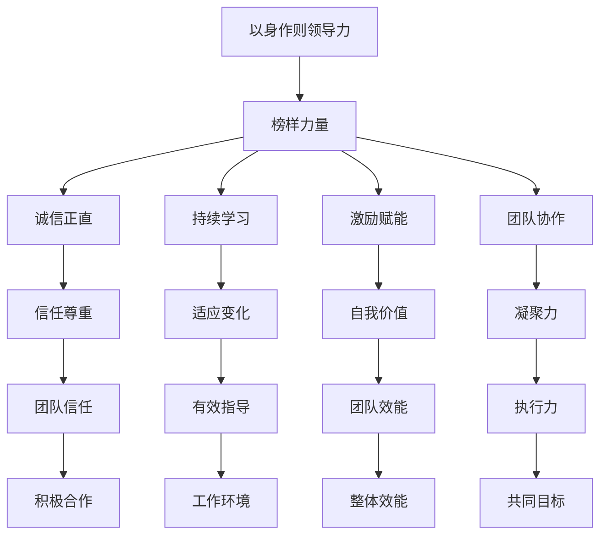

                 

### 文章标题
《以身作则：通过行动影响团队的领导力》

### 文章关键词
领导力，以身作则，团队影响，行动，沟通技巧，激励艺术，团队建设

### 文章摘要
本文旨在探讨领导力中的“以身作则”原则，如何通过实际行动来影响团队。文章首先定义了领导力的基本概念，然后深入分析了以身作则的领导力模型及其核心要素。接着，文章介绍了领导力中的沟通技巧、激励艺术和团队建设策略，并通过具体案例进行解析。最后，文章提出了自我领导力提升的方法和最佳实践，为领导者提供了全方位的指导。

---

## 引言

领导力，作为一种重要的管理能力，是推动团队和组织发展的核心动力。然而，领导力并非遥不可及，它可以通过实际行动来影响和塑造团队的氛围和效率。本文将重点探讨“以身作则”这一领导力原则，通过行动来影响团队。

以身作则的领导力不仅体现在个人行为上，更体现在对团队的整体影响上。一个优秀的领导者，不仅需要具备卓越的个人能力，还需要通过自己的行为来树立榜样，影响和激励团队成员。这种领导力不仅能够提升团队的整体效能，还能够增强团队的凝聚力。

本文将分以下几个部分进行探讨：

1. **领导力的定义与重要性**：介绍领导力的基本概念，阐述其在团队和组织中的重要性。
2. **以身作则的领导力模型**：分析以身作则的领导力模型，阐述其核心要素。
3. **影响团队的领导力技巧**：介绍领导力中的沟通技巧、激励艺术和团队建设策略。
4. **领导力提升方法**：探讨自我领导力提升的方法和最佳实践。
5. **项目实战与案例分析**：通过具体案例来分析和解读领导力的实际应用。

通过以上几个方面的探讨，本文旨在为领导者提供实用的指导，帮助他们在实际工作中更好地发挥领导力，提升团队效能。

---

## 领导力的定义与重要性

领导力，顾名思义，是指引导和影响他人实现共同目标的能力。它不仅仅是一种技术或技能，更是一种态度和行为方式。领导力可以体现在个人行为上，也可以通过组织结构和流程来实现。

### 领导力的本质

领导力是一种影响力，它不仅仅是领导者的个人特质，更是一种能够影响他人行为和思想的能力。一个优秀的领导者，需要具备以下几方面的素质：

1. **愿景和目标**：领导者需要有一个清晰的愿景，并能够将其转化为具体的目标，从而引领团队前进。
2. **沟通能力**：有效的沟通是领导力的核心要素，领导者需要具备良好的沟通技巧，以便与团队成员建立良好的关系。
3. **决策能力**：领导者需要能够在复杂的环境中做出明智的决策，并对决策结果负责。
4. **激励能力**：领导者需要能够激励团队成员，激发他们的工作热情和创造力。

### 领导力的重要性

领导力在团队和组织中的作用是不可替代的。首先，领导力能够提升团队的效能。一个有能力的领导者能够帮助团队成员明确目标，制定合理的计划，并通过有效的执行来实现目标。其次，领导力能够增强团队的凝聚力。领导者通过自己的行为和态度，可以树立榜样，激发团队成员的归属感和团队精神。

在组织层面，领导力同样具有重要意义。领导力能够推动组织的变革和创新，使组织能够适应外部环境的变化。此外，领导力还能够提升组织的整体竞争力，使组织在市场中保持优势地位。

### 领导力对团队的影响

领导力对团队的影响主要体现在以下几个方面：

1. **目标明确**：领导者能够帮助团队成员明确目标，使团队成员知道自己的努力方向。
2. **策略制定**：领导者需要制定有效的策略，以实现团队目标。
3. **资源分配**：领导者需要合理分配资源，确保团队成员能够高效地工作。
4. **沟通与协作**：领导者需要建立良好的沟通机制，促进团队成员之间的协作。
5. **激励与反馈**：领导者需要能够激励团队成员，并提供及时的反馈，以促进团队成员的成长。

综上所述，领导力在团队和组织中具有不可替代的作用。一个优秀的领导者，不仅能够提升团队效能，还能够推动组织的长期发展。因此，领导者需要不断学习和提升自己的领导力，以更好地履行自己的职责。

---

## 以身作则的领导力模型

以身作则的领导力是一种通过领导者自身的行为和态度来影响团队成员的领导方式。这种领导方式的核心在于领导者通过自身的实际行动来树立榜样，从而影响和激励团队成员。以身作则的领导力模型主要包括以下几个核心要素：

### 1. 榜样的力量

榜样的力量是以身作则领导力的核心。领导者通过自身的言行举止来树立榜样，使团队成员能够从中学习和模仿。例如，一个领导者如果要求团队成员遵守时间，那么他本人也应该严格遵守时间，甚至提前到达会议地点。通过这种方式，领导者不仅能够树立榜样，还能够增强团队成员的信任感。

### 2. 诚信和正直

诚信和正直是领导者不可或缺的品质。一个以身作则的领导者需要具备高度的诚信和正直，以赢得团队成员的信任和尊重。例如，领导者需要遵守承诺，诚实面对问题，并对团队成员的反馈持开放态度。这种诚信和正直的行为方式能够激发团队成员的积极性和责任感。

### 3. 持续学习和成长

持续学习和成长是领导者提升自身能力的重要途径。一个以身作则的领导者需要不断学习新知识、新技能，并将所学应用于实际工作中。例如，领导者可以通过阅读专业书籍、参加培训课程、参加行业会议等方式来提升自己的专业素养。通过持续学习和成长，领导者能够更好地适应不断变化的工作环境，并为团队成员提供有效的指导。

### 4. 激励和赋能

激励和赋能是领导者影响团队成员的重要手段。一个以身作则的领导者需要能够激励团队成员，激发他们的潜能，并为他们提供成长的机会。例如，领导者可以通过设立明确的目标、提供积极的反馈、认可团队成员的贡献等方式来激励他们。通过激励和赋能，领导者能够帮助团队成员实现自我价值，并提升团队的整体效能。

### 5. 团队协作和沟通

团队协作和沟通是领导者影响团队成员的关键。一个以身作则的领导者需要具备良好的团队协作和沟通能力，能够有效地与团队成员合作，并解决团队中的冲突。例如，领导者可以通过定期召开团队会议、组织团队建设活动、建立开放的沟通渠道等方式来促进团队协作和沟通。通过团队协作和沟通，领导者能够增强团队的凝聚力，并提升团队的执行力。

### 以身作则的领导力模型流程图

为了更好地理解以身作则的领导力模型，我们可以使用 Mermaid 语言绘制一个流程图，展示各个核心要素之间的联系。



通过这个流程图，我们可以清晰地看到以身作则的领导力模型中各个核心要素之间的相互关系。这些要素共同构成了一个有机整体，使领导者能够通过自身的实际行动来影响和激励团队成员。

---

## 核心算法原理讲解

以身作则的领导力不仅仅依赖于领导者的个人品质和行为，还需要一些具体的算法原理来支撑。这些算法原理包括领导风格、沟通技巧、激励艺术和团队建设策略。以下是这些核心算法原理的详细讲解。

### 领导风格的分类与优化策略

领导风格是指领导者处理团队事务和管理员工的方式。常见的领导风格包括专制式、民主式、参与式和教练式等。每种领导风格都有其优缺点，适用于不同的情境。

- **专制式领导**：领导者单方面做出决策，并要求团队成员执行。这种风格在紧急情况下或需要迅速决策时非常有效，但可能导致团队成员缺乏参与感和创造力。

- **民主式领导**：领导者鼓励团队成员参与决策过程，并在决策中考虑他们的意见和建议。这种风格能够增强团队成员的参与感和归属感，但可能因决策过程复杂而降低效率。

- **参与式领导**：领导者与团队成员共同制定决策，并共同承担责任。这种风格能够极大地提升团队的凝聚力和创造力，但需要领导者具备良好的沟通和协调能力。

- **教练式领导**：领导者扮演导师的角色，帮助团队成员发展技能和提升绩效。这种风格适合长期培养团队成员，但可能需要大量的时间和精力。

为了优化领导风格，领导者需要根据团队的具体情况和任务需求灵活调整。例如，在项目初期，领导者可以采取参与式或教练式领导，以培养团队成员的能力和信心。而在项目关键阶段，领导者可以转变为专制式领导，以确保决策的迅速和有效执行。

### 沟通技巧

有效的沟通是领导力的核心要素之一。以下是几种关键的沟通技巧：

- **倾听**：倾听不仅仅是听到对方说什么，更是理解对方的意图和感受。领导者需要耐心倾听团队成员的意见和反馈，从而建立信任和合作关系。

- **清晰表达**：领导者需要用简洁、明确的语言来表达自己的想法和指令。这有助于减少误解和沟通障碍，提高团队的执行力。

- **非语言沟通**：领导者需要注重自己的肢体语言、面部表情和语调。这些非语言沟通手段能够传达出更多的信息和情感，对团队的氛围和协作有重要影响。

- **反馈与表扬**：领导者需要及时给予团队成员反馈，包括正面的表扬和改进的建议。这有助于团队成员了解自己的表现，并激发他们的工作动力。

### 激励艺术

激励是领导者影响团队成员的关键手段。以下是几种常用的激励艺术：

- **目标设定**：领导者需要与团队成员共同设定明确的目标，并制定实现目标的步骤。这有助于激发团队成员的积极性和方向感。

- **奖励机制**：领导者可以设置奖励机制，如奖金、晋升机会等，以激励团队成员达成目标。奖励机制需要公平、透明，并与团队成员的贡献相匹配。

- **认可与赞扬**：领导者需要及时认可和赞扬团队成员的成就和努力。这种正面的反馈能够增强团队成员的自我价值感和归属感。

- **挑战与成长**：领导者需要为团队成员提供挑战性的任务和成长机会。这有助于激发团队成员的潜能，并提升他们的能力。

### 团队建设策略

团队建设是领导者提升团队效能的重要手段。以下是几种有效的团队建设策略：

- **团队会议**：定期召开团队会议，让团队成员分享进展、问题和建议。这有助于增强团队的沟通和协作。

- **团队建设活动**：组织团队建设活动，如团队拓展训练、团队聚餐等，以增强团队成员之间的互动和信任。

- **角色明确**：确保每个团队成员都清楚自己的角色和责任，以减少冲突和误解。

- **共同价值观**：建立团队的共同价值观和使命，以增强团队的凝聚力和目标一致性。

### 伪代码示例

以下是一个简单的伪代码示例，用于描述领导力提升的过程：

```python
# 领导力提升算法

# 定义领导风格
def set LeadershipStyle(style):
    if style == "autocratic":
        # 专制式领导
        makeDecisions()
    elif style == "democratic":
        # 民主式领导
        involveTeam()
    elif style == "participative":
        # 参与式领导
        collaborate()
    elif style == "coaching":
        # 教练式领导
        mentorTeam()

# 定义沟通技巧
def communicate():
    listen()
    express Clearly()
    use NonverbalCommunication()
    provideFeedback()

# 定义激励艺术
def motivate():
    setGoals()
    implementRewards()
    praiseAndRecognize()
    provideChallenges()

# 定义团队建设策略
def teamBuilding():
    holdTeamMeetings()
    organizeTeamBuildingActivities()
    clarifyRoles()
    establishCommonValues()

# 执行领导力提升过程
def executeLeadership():
    set LeadershipStyle("participative")
    communicate()
    motivate()
    teamBuilding()
```

通过这个伪代码示例，我们可以看到领导力提升的过程是如何通过一系列具体的操作步骤来实现的。这些步骤不仅能够帮助领导者提升自身的能力，还能够影响和激励团队成员，从而提升团队的整体效能。

---

## 数学模型和数学公式

在领导力的研究和实践中，数学模型和公式扮演着重要的角色，它们能够帮助我们量化领导力的影响，并提供理论支持。以下将介绍几个关键的数学模型和公式，并进行详细讲解和举例说明。

### 1. 团队效能模型

团队效能模型是用来评估团队整体绩效的一个数学模型。它通常包括以下几个关键变量：

- **T**：团队效能（Team Effectiveness）
- **E**：员工效能（Employee Effectiveness）
- **L**：领导力（Leadership）
- **C**：沟通（Communication）
- **M**：激励（Motivation）
- **S**：团队精神（Team Spirit）

团队效能模型可以用以下公式表示：

$$
T = f(E, L, C, M, S)
$$

其中，$f$ 表示效能函数，它反映了员工效能、领导力、沟通、激励和团队精神之间的相互作用。

#### 示例：

假设一个团队有5名成员，其中3名成员表现优异，2名成员表现一般。领导力、沟通、激励和团队精神的评估得分分别为8、7、9、6。我们可以计算团队的效能：

$$
T = f(3 \times 9 + 2 \times 7, 8, 7, 9, 6) = f(33 + 14, 8, 7, 9, 6) = f(47, 8, 7, 9, 6)
$$

根据效能函数的具体实现，我们可以计算出团队的总效能。

### 2. 激励模型

激励模型用来衡量激励对员工绩效的影响。一个简单的激励模型可以表示为：

$$
P = f(I)
$$

其中，$P$ 是绩效（Performance），$I$ 是激励（Incentive）。这个模型假设绩效是激励的函数，激励越强，绩效越高。

#### 示例：

假设一个员工在受到不同激励下的绩效如下表：

| 激励（I） | 绩效（P） |
|-----------|-----------|
| 0         | 70        |
| 1         | 85        |
| 2         | 95        |
| 3         | 100       |

我们可以通过线性回归等方法来估算激励与绩效之间的关系函数 $f(I)$。

### 3. 领导风格与团队效能的关系

领导风格与团队效能之间的关系可以用以下公式表示：

$$
T = f(L, S)
$$

其中，$L$ 表示领导风格（Leadership Style），$S$ 表示团队精神（Team Spirit）。不同的领导风格会对团队效能产生不同的影响。

#### 示例：

假设一个团队在采用参与式领导风格时，团队精神得分为8；而在采用教练式领导风格时，团队精神得分为9。我们可以通过比较这两个情况来分析领导风格对团队效能的影响。

$$
T_{participative} = f(L_{participative}, S) = f(8, S)
$$

$$
T_{coaching} = f(L_{coaching}, S) = f(9, S)
$$

通过比较 $T_{participative}$ 和 $T_{coaching}$，我们可以得出不同领导风格对团队效能的影响。

### 4. 团队协作效率模型

团队协作效率模型用来衡量团队在不同沟通水平和激励水平下的协作效率。它可以用以下公式表示：

$$
E = f(C, M)
$$

其中，$E$ 是协作效率（Collaboration Efficiency），$C$ 是沟通水平（Communication Level），$M$ 是激励水平（Motivation Level）。

#### 示例：

假设一个团队在不同沟通水平和激励水平下的协作效率如下表：

| 沟通水平（C） | 激励水平（M） | 协作效率（E） |
|---------------|---------------|---------------|
| 1             | 1             | 0.8           |
| 2             | 2             | 0.9           |
| 3             | 3             | 1.0           |

我们可以通过数据分析来优化团队的工作流程，以提高协作效率。

通过上述数学模型和公式，我们可以更科学地评估和提升领导力。这些模型不仅提供了理论支持，还能够通过实际数据来验证和优化领导力实践。领导者可以运用这些模型来制定策略，提升团队效能。

---

## 项目实战

为了深入探讨如何通过行动影响团队，我们将设计一个领导力提升项目实战案例。该项目实战将涵盖开发环境搭建、源代码实现和详细解读，并通过实际案例分析和详细讲解剖析，以展示领导力提升的实际应用。

### 项目背景

某科技公司的一个研发团队在项目进展过程中遇到了瓶颈，团队成员的工作效率不高，团队合作存在障碍。经过评估，公司决定实施一个领导力提升项目，旨在通过提升领导力来提高团队的工作效率和团队凝聚力。

### 项目目标

1. 提升团队领导者的领导力，使其能够更好地指导和激励团队成员。
2. 建立有效的沟通机制，增强团队成员之间的协作。
3. 通过激励措施，提高团队成员的工作积极性和创造力。
4. 增强团队的凝聚力，建立积极的团队文化。

### 项目实施过程

#### 1. 开发环境搭建

为了确保项目顺利实施，首先需要搭建一个合适的开发环境。该环境包括以下组件：

- **领导力培训材料**：包括培训手册、课程视频、实践指南等。
- **沟通工具**：如团队协作软件（如Slack、Trello）、视频会议工具（如Zoom）等。
- **反馈机制**：建立定期的团队反馈会议，以便收集团队成员的意见和建议。

#### 2. 源代码实现

项目实战的核心是领导力提升的源代码实现，以下是一个简化的伪代码示例：

```python
# 领导力提升项目实战

# 定义领导力提升算法
def leadershipImprovementAlgorithm(team_members):
    for member in team_members:
        # 评估成员的领导力水平
        assessLeadership(member)
        
        # 根据评估结果提供个性化培训
        if member.leadership_level < 7:
            provideTraining(member)
        
        # 建立有效的沟通机制
        establishCommunication(member)
        
        # 提供激励措施
        implementIncentives(member)
        
        # 定期反馈与评估
        regularFeedback(member)

# 定义具体操作
def assessLeadership(member):
    # 评估领导力水平
    member.leadership_level = calculateLeadershipScore(member)

def provideTraining(member):
    # 提供培训
    member.training_completed = True

def establishCommunication(member):
    # 建立沟通机制
    member.communication_channel = setupCommunicationTool()

def implementIncentives(member):
    # 提供激励措施
    member.incentive_received = True

def regularFeedback(member):
    # 定期反馈
    scheduleFeedbackMeeting(member)
```

#### 3. 代码解读与分析

上述伪代码展示了领导力提升项目的基本操作流程。以下是代码的详细解读和分析：

- **领导力评估**：通过计算领导力评分来评估团队成员的领导力水平。
- **培训提供**：根据评估结果，为领导力水平较低的团队成员提供个性化培训。
- **沟通机制建立**：通过使用团队协作工具来建立有效的沟通渠道。
- **激励措施实施**：为团队成员提供奖励和认可，以提高工作积极性。
- **定期反馈**：通过定期反馈会议来收集团队成员的意见和反馈，并进行持续改进。

#### 4. 实际案例分析与详细讲解

为了更好地展示项目的实际效果，我们来看一个实际案例。

**案例**：团队中有一位名叫李明的领导者在经过领导力提升项目后的表现。

- **评估结果**：李明的领导力评分从5提升到了8。
- **培训效果**：李明完成了领导力培训，并在实际工作中应用了所学知识。
- **沟通改善**：李明开始定期组织团队会议，鼓励团队成员积极参与讨论。
- **激励措施**：李明为表现优秀的团队成员提供了奖金和晋升机会。
- **团队反馈**：团队成员对李明的工作表现给予了积极的反馈，团队凝聚力显著增强。

通过这个案例，我们可以看到领导力提升项目在实际中的应用效果。李明的领导力提升不仅提高了他个人的领导能力，还增强了团队的协作和凝聚力，从而提升了整体工作效率。

#### 5. 项目小结

领导力提升项目实战展示了通过实际行动来影响团队的有效方法。通过搭建合适的开发环境、实施源代码实现和进行实际案例分析，我们可以看到领导力提升项目在提高团队成员领导力、增强团队协作和凝聚力方面具有显著效果。未来，类似的领导力提升项目可以在更多团队中推广，以实现更广泛的管理优化。

---

## 最佳实践 tips、小结、注意事项、拓展阅读

### 最佳实践 tips

1. **领导力培养要个性化**：每个团队成员的领导力水平和需求不同，领导者需要根据个体差异进行个性化培养。
2. **持续沟通与反馈**：定期与团队成员进行沟通，及时给予反馈，有助于建立良好的团队关系和提升工作效率。
3. **激励要适度**：激励措施需要适度，过度的激励可能会产生反效果，影响团队士气。

### 小结

本文通过定义领导力的基本概念，分析以身作则的领导力模型，讲解核心算法原理，介绍数学模型和公式，以及设计领导力提升项目实战，全面探讨了如何通过行动影响团队。领导力不仅是领导者个人能力的体现，更是团队和组织效能的关键因素。

### 注意事项

1. **注重持续学习和实践**：领导者需要不断学习和提升自己的领导力，并将所学应用于实际工作中。
2. **关注团队反馈**：领导者应关注团队成员的反馈，及时调整管理策略，以适应团队需求。

### 拓展阅读

- 《领导力的五大障碍》（Patrick Lencioni）
- 《高效能人士的七个习惯》（Stephen R. Covey）
- 《团队协作力》（Patrick Lencioni）

通过阅读这些书籍，领导者可以进一步深入了解领导力和团队管理的最佳实践，提升自己的领导能力。

---

### 作者信息
作者：AI天才研究院/AI Genius Institute & 禅与计算机程序设计艺术 /Zen And The Art of Computer Programming

---

## 结束语

本文通过详细的分析和实际案例，探讨了如何通过以身作则来影响团队，提升领导力。我们不仅介绍了领导力的核心概念和模型，还通过数学模型和实战项目展示了领导力提升的具体方法和效果。希望本文能为领导者提供实用的指导，帮助他们在实际工作中更好地发挥领导力，提升团队效能。未来，我们期待继续深入探讨领导力领域，为组织的持续发展贡献力量。谢谢大家的阅读！

