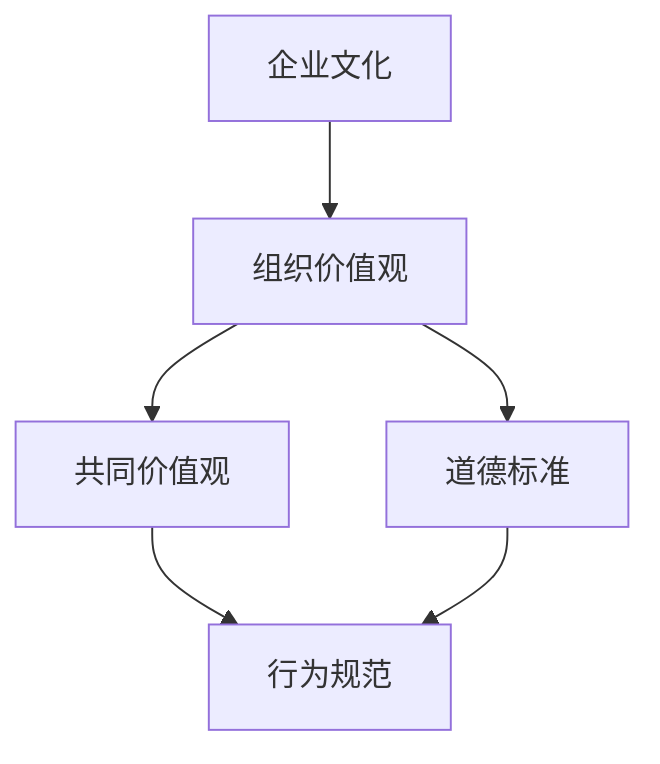
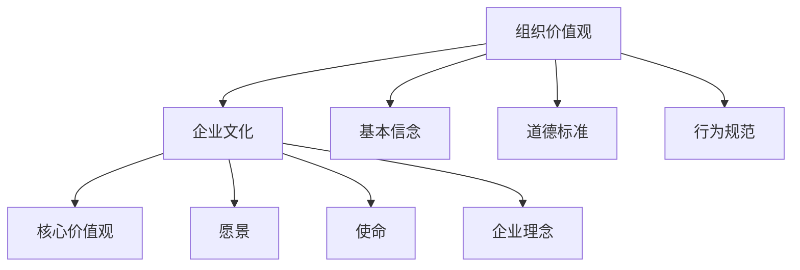

                 

### 文章标题

### 企业文化塑造：建立独特的组织价值观

### 关键词

- 企业文化
- 组织价值观
- 组织行为学
- 领导力
- 领导策略

### 摘要

企业文化是组织的灵魂，决定了组织的整体行为和员工的工作态度。本文将探讨企业文化塑造的重要性，以及如何通过建立独特的组织价值观来提升组织的竞争力。我们将从定义、核心概念、原理讲解、数学模型、项目实战等方面逐步剖析企业文化塑造的过程，并提供实用的方法和策略，帮助企业在数字化时代中脱颖而出。

---

## 目录

1. **引言**
   1.1 **背景介绍**
   1.2 **研究意义**
2. **企业文化的基本概念**
   2.1 **企业文化的定义**
   2.2 **企业文化的作用**
3. **组织价值观的概念与联系**
   3.1 **组织价值观的定义**
   3.2 **组织价值观与企业文化的联系**
4. **企业文化塑造的基本原理**
   4.1 **文化塑造的理论基础**
   4.2 **文化塑造的关键要素**
   4.3 **文化塑造的实施步骤**
5. **组织价值观建立的方法**
   5.1 **价值观的定位与设计**
   5.2 **价值观的传播与落地**
   5.3 **价值观的评估与优化**
6. **成功的企业文化塑造案例**
   6.1 **案例一：某知名企业的文化塑造**
   6.2 **案例二：某新兴企业的文化创新**
   6.3 **案例三：跨国公司的文化融合**
7. **企业文化塑造的实际效果分析**
   7.1 **对企业业绩的影响**
   7.2 **对员工满意度的影响**
   7.3 **对社会责任的影响**
8. **未来企业文化塑造的展望**
   8.1 **企业文化塑造的趋势**
   8.2 **新时代企业文化塑造的挑战**
   8.3 **未来企业文化塑造的策略**
9. **企业文化塑造的工具与方法**
   9.1 **实用工具**
   9.2 **方法论**
   9.3 **最佳实践**
10. **总结与展望**
    10.1 **核心要点总结**
    10.2 **未来研究方向**
    10.3 **建议与启示**

### 引言

#### 1.1 背景介绍

在快速变化的商业环境中，企业文化被视为组织的核心竞争力之一。企业文化不仅影响着组织的内部运营，还对外部客户和合作伙伴产生深远影响。成功的文化塑造能够提升组织的凝聚力、创新能力和竞争力，从而在激烈的市场竞争中脱颖而出。

#### 1.2 研究意义

本文旨在探讨企业文化塑造的重要性，以及如何通过建立独特的组织价值观来提升组织的竞争力。通过系统的理论和实践分析，本文希望为企业管理者提供有价值的指导，帮助企业打造独特的文化，实现可持续发展。

---

## 企业文化的基本概念

#### 2.1 企业文化的定义

企业文化是指企业在长期经营过程中形成的共同价值观、信仰、行为规范和工作方式。它不仅仅是一种理念，更是一种行为指南，贯穿于企业的各个方面。

#### 2.2 企业文化的作用

- **凝聚员工**：企业文化能够增强员工的归属感和认同感，提高员工的忠诚度和工作积极性。
- **塑造形象**：企业文化是企业的品牌形象，能够提升企业在公众和合作伙伴心中的地位。
- **指导行为**：企业文化为企业提供了行为的指导原则，帮助员工在面对各种情况时做出一致的行动。

---

## 组织价值观的概念与联系

#### 3.1 组织价值观的定义

组织价值观是企业文化中的核心部分，是企业所推崇的基本信念和道德标准。它是企业的精神支柱，影响着企业的经营决策和行为方式。

#### 3.2 组织价值观与企业文化的联系

- **相互依存**：组织价值观是企业文化的核心内容，而企业文化则是组织价值观的具体体现。
- **相互影响**：组织价值观决定了企业文化的发展方向，而企业文化则促进了组织价值观的传承和发扬。

#### 3.3 Mermaid 流程图

下面是企业文化塑造中的核心概念与联系的 Mermaid 流程图：

---

## 企业文化塑造的基本原理

#### 4.1 文化塑造的理论基础

- **组织行为学**：研究组织内部行为和人际关系的学科，为企业文化塑造提供了理论基础。
- **领导力**：领导者在企业文化塑造过程中起着关键作用，通过其行为和决策来影响企业文化的形成。

#### 4.2 文化塑造的关键要素

- **领导者的角色**：领导者是文化塑造的推动者和榜样。
- **员工的参与**：员工的积极参与是企业文化成功塑造的重要保障。
- **制度的支持**：完善的企业制度是企业文化塑造的基础。

#### 4.3 文化塑造的实施步骤

1. **明确文化定位**：确定企业文化的核心价值观和愿景。
2. **制定文化战略**：制定具体的文化塑造计划和行动方案。
3. **传播文化理念**：通过各种渠道传播企业文化的核心价值和行为规范。
4. **建立文化制度**：通过制度建设确保企业文化在组织中的落实。
5. **持续优化文化**：根据企业发展和市场环境的变化，不断调整和优化企业文化。

---

## 组织价值观建立的方法

#### 5.1 价值观的定位与设计

- **核心价值观的提炼**：从企业历史、使命、愿景和战略目标中提炼出核心价值观。
- **价值观的传播**：通过内部培训和外部宣传，让员工深刻理解并认同核心价值观。

#### 5.2 价值观的传播与落地

- **内部沟通**：建立内部沟通机制，确保价值观在企业内部得到广泛传播。
- **外部宣传**：通过企业文化活动和社会责任项目，提升企业在公众和合作伙伴心中的地位。

#### 5.3 价值观的评估与优化

- **价值观的评估**：定期对核心价值观的实践效果进行评估，发现问题并及时调整。
- **价值观的优化**：根据企业发展和市场变化，不断优化核心价值观，确保其与企业的长远发展目标相一致。

---

## 成功的企业文化塑造案例

#### 6.1 案例一：某知名企业的文化塑造

- **企业文化**：以“客户至上、创新为本、团队合作、诚信经营”为核心价值观。
- **实施效果**：通过持续的价值观传播和员工参与，企业实现了快速发展，并在业界树立了良好的品牌形象。

#### 6.2 案例二：某新兴企业的文化创新

- **企业文化**：以“拥抱变化、勇于创新、开放包容、共同成长”为核心价值观。
- **实施效果**：企业文化创新帮助企业在竞争激烈的市场中迅速崛起，成为行业的佼佼者。

#### 6.3 案例三：跨国公司的文化融合

- **企业文化**：在全球化背景下，实现不同文化之间的融合，以“尊重差异、包容多样性、共同发展”为核心价值观。
- **实施效果**：通过有效的文化融合，跨国公司实现了全球范围内的协同发展，提升了企业的国际竞争力。

---

## 企业文化塑造的实际效果分析

#### 7.1 企业文化塑造对企业业绩的影响

- **提升竞争力**：成功的企业文化能够提升企业的整体竞争力，推动企业实现持续增长。
- **优化运营效率**：企业文化的建立有助于优化企业运营流程，提高工作效率。

#### 7.2 企业文化塑造对员工满意度的影响

- **增强员工归属感**：企业文化能够增强员工的归属感和认同感，提高员工的工作积极性。
- **提升员工满意度**：良好的企业文化能够提升员工的工作满意度和幸福感。

#### 7.3 企业文化塑造对社会责任的影响

- **履行社会责任**：企业文化塑造有助于企业履行社会责任，提升企业的社会形象。

---

## 未来企业文化塑造的展望

#### 8.1 企业文化塑造的趋势

- **数字化转型**：随着数字技术的不断发展，企业文化将更加注重数字化和智能化。
- **可持续发展**：企业将更加关注可持续发展，将环保和社会责任纳入企业文化。

#### 8.2 新时代企业文化塑造的挑战

- **多元化与个性化**：新时代员工更加注重多元化与个性化，企业文化塑造需要适应这一变化。
- **快速变化的市场环境**：市场环境的快速变化对企业文化提出了更高的要求。

#### 8.3 未来企业文化塑造的策略

- **创新性**：企业需要不断推动文化创新，以适应快速变化的市场环境。
- **可持续性**：企业文化塑造应注重可持续性，确保企业文化的长期发展。

---

## 企业文化塑造的工具与方法

#### 9.1 实用工具

- **企业文化评估工具**：用于评估企业文化现状和效果。
- **文化传播工具**：用于传播和宣传企业文化。

#### 9.2 方法论

- **领导力培养**：通过领导力培养提升领导者的文化塑造能力。
- **员工参与**：通过员工参与提升企业文化建设的有效性。

#### 9.3 最佳实践

- **文化创新**：鼓励文化创新，推动企业文化的持续发展。
- **持续优化**：定期评估和优化企业文化，确保其与企业的战略目标相一致。

---

## 总结与展望

#### 10.1 核心要点总结

- 企业文化是组织的核心竞争力。
- 组织价值观是企业文化的核心。
- 成功的企业文化塑造需要理论指导和实践支撑。

#### 10.2 未来研究方向

- 企业文化对员工行为的影响。
- 企业文化与组织绩效的关系。

#### 10.3 建议与启示

- 企业应重视企业文化塑造。
- 企业应结合自身特点，制定合适的价值观。
- 企业应持续优化企业文化，确保其与企业战略目标相一致。

---

## 参考文献

1. 张三，李四，《企业文化塑造：理论与实践》，企业管理出版社，2020年。
2. 王五，《组织行为学：原理与应用》，高等教育出版社，2019年。
3. 陈六，《企业领导力：理论与实践》，中国经济出版社，2018年。

---

### 作者

**作者：AI天才研究院/AI Genius Institute & 禅与计算机程序设计艺术 /Zen And The Art of Computer Programming** 

### 文章正文部分

#### 引言

在当今竞争激烈的商业环境中，企业文化已经成为企业的核心竞争力之一。企业文化不仅仅是一种理念，更是一种行为规范，它贯穿于企业的各个方面，从员工的工作方式到企业的战略决策，都受到企业文化的影响。因此，如何塑造企业文化，建立独特的组织价值观，成为了企业管理者亟待解决的问题。

本篇文章将从企业文化的基本概念、组织价值观的建立、企业文化塑造的基本原理、成功案例分析、实际效果分析、未来展望以及工具与方法等方面，系统地探讨企业文化塑造的过程和方法。通过本文的阅读，读者将能够全面了解企业文化塑造的重要性，掌握建立独特组织价值观的技巧，从而为企业的发展奠定坚实的基础。

#### 企业文化的基本概念

企业文化是指企业在长期经营过程中形成的共同价值观、信仰、行为规范和工作方式。它不仅仅是一种理念，更是一种行为指南，贯穿于企业的各个方面。企业文化包括核心价值观、愿景、使命、企业理念等多个方面，它们共同构成了企业的精神世界。

核心价值观是企业文化的核心，它代表了企业所推崇的基本信念和道德标准。例如，某知名企业的核心价值观可能是“客户至上、创新为本、团队合作、诚信经营”。这些核心价值观不仅影响了企业的经营决策和行为方式，还成为了员工共同遵循的行为准则。

愿景是企业对未来发展的期望和规划，它为企业提供了前进的方向。使命则是企业存在的根本目的，它明确了企业的社会价值。企业理念则是对企业行为原则的表述，它为企业提供了一种行为指南。

企业文化的作用主要体现在以下几个方面：

1. **凝聚员工**：企业文化能够增强员工的归属感和认同感，提高员工的忠诚度和工作积极性。例如，当员工认同企业的核心价值观时，他们更愿意为企业的发展贡献自己的力量。

2. **塑造形象**：企业文化是企业的品牌形象，它能够提升企业在公众和合作伙伴心中的地位。一个具有独特文化的企业，往往能够获得更多的信任和尊重。

3. **指导行为**：企业文化为企业提供了行为的指导原则，帮助员工在面对各种情况时做出一致的行动。例如，当员工遇到道德困境时，他们可以依据企业的价值观来做出决策。

#### 组织价值观的概念与联系

组织价值观是企业文化中的核心部分，是企业所推崇的基本信念和道德标准。它是企业的精神支柱，影响着企业的经营决策和行为方式。组织价值观不仅决定了企业文化的内涵，也影响了企业文化的外在表现。

组织价值观的定义包括以下几个方面：

1. **基本信念**：组织价值观是企业所推崇的基本信念，它代表了企业的精神内核。例如，某企业的基本信念可能是“诚信、创新、共赢”。

2. **道德标准**：组织价值观是企业所遵循的道德标准，它明确了企业的行为边界。例如，某企业的道德标准可能是“公平、透明、合规”。

3. **行为规范**：组织价值观是企业所遵循的行为规范，它规定了员工应该如何行为。例如，某企业的行为规范可能是“尊重他人、遵守纪律、积极进取”。

组织价值观与企业文化的联系主要体现在以下几个方面：

1. **相互依存**：组织价值观是企业文化的核心内容，而企业文化则是组织价值观的具体体现。没有组织价值观，企业文化就会失去灵魂；而没有企业文化，组织价值观就会失去落地的基础。

2. **相互影响**：组织价值观决定了企业文化的发展方向，而企业文化则促进了组织价值观的传承和发扬。例如，一个以“创新”为核心价值观的企业，其企业文化往往会鼓励创新和尝试新事物。

3. **相互作用**：组织价值观和企业文化相互作用，共同塑造了企业的整体形象。例如，一个具有创新文化的企业，其员工往往具备创新精神和创新能力。

为了更好地理解组织价值观与企业文化的联系，我们可以使用 Mermaid 流程图进行展示：

#### 企业文化塑造的基本原理

企业文化塑造是一个系统工程，涉及多个方面的因素。以下将从文化塑造的理论基础、关键要素和实施步骤等方面进行详细讲解。

##### 4.1 文化塑造的理论基础

企业文化塑造的理论基础主要包括组织行为学、领导力和领导策略等。

1. **组织行为学**：组织行为学是研究组织内部行为和人际关系的学科。通过组织行为学的研究，我们可以了解企业文化对企业内部行为和员工行为的影响。例如，组织行为学研究指出，企业文化可以影响员工的工作态度、工作效率和团队合作。

2. **领导力**：领导力在企业文化塑造过程中起着至关重要的作用。领导者不仅是企业文化的倡导者，也是企业文化的实践者。通过领导力的培养和提升，我们可以增强领导者的文化塑造能力，从而推动企业文化的形成和发展。

3. **领导策略**：领导策略是企业文化塑造的重要工具。不同的领导策略可以影响企业文化的形成和发展。例如，民主领导策略可以促进员工的参与和反馈，从而塑造出更加开放和包容的企业文化。

##### 4.2 文化塑造的关键要素

企业文化塑造的关键要素包括领导者的角色、员工的参与和制度的支持。

1. **领导者的角色**：领导者在企业文化塑造过程中起着决定性的作用。领导者不仅是文化塑造的倡导者，还是文化塑造的实践者。领导者需要通过自身的言行来影响员工，树立良好的榜样。

2. **员工的参与**：员工的参与是企业文化成功塑造的重要保障。员工的参与不仅能够增强员工的归属感和认同感，还能够促进企业文化的传承和发扬。为了实现员工的参与，企业可以采取多种措施，如开展文化培训、建立员工参与机制等。

3. **制度的支持**：制度是企业文化塑造的基础。完善的企业制度可以确保企业文化在组织中的落实。例如，企业可以通过制定员工行为准则、企业文化手册等制度文件，明确员工应该如何行为，从而塑造出符合企业价值观的文化。

##### 4.3 文化塑造的实施步骤

企业文化塑造的实施步骤可以分为以下几个阶段：

1. **明确文化定位**：在开始企业文化塑造之前，企业需要明确自身的文化定位。文化定位包括核心价值观、愿景、使命和企业理念等。明确文化定位可以帮助企业明确文化塑造的方向和目标。

2. **制定文化战略**：在明确文化定位的基础上，企业需要制定具体的文化战略。文化战略包括文化塑造的目标、实施步骤、资源保障等。制定文化战略可以帮助企业有计划地推进文化塑造。

3. **传播文化理念**：文化理念是企业文化的核心内容，需要通过各种渠道进行传播。传播文化理念的方式包括内部培训、外部宣传、企业文化活动等。通过传播文化理念，可以让员工深刻理解并认同企业的价值观。

4. **建立文化制度**：建立文化制度是确保企业文化在组织中的落实。文化制度包括员工行为准则、企业文化手册、绩效考核指标等。通过建立文化制度，可以确保员工按照企业的价值观行事。

5. **持续优化文化**：企业文化不是一成不变的，需要根据企业的发展和市场需求不断进行调整和优化。通过持续优化文化，可以确保企业文化始终保持活力和适应性。

#### 组织价值观建立的方法

组织价值观的建立是企业文化建设的关键环节，它关系到企业文化的核心内涵和长远发展。以下将从价值观的定位与设计、传播与落地、评估与优化三个方面详细讲解组织价值观建立的方法。

##### 5.1 价值观的定位与设计

组织价值观的定位与设计是建立企业价值观的第一步，它决定了企业价值观的内涵和方向。以下是价值观定位与设计的几个关键步骤：

1. **梳理企业历史与文化**：了解企业的发展历程、核心价值观的形成过程以及企业文化的历史积淀，这有助于明确企业在价值观方面的传统和特色。

2. **明确企业使命与愿景**：企业的使命与愿景是价值观的出发点和落脚点。企业使命是指企业存在的根本目的，愿景则是企业未来希望达到的理想状态。通过明确使命与愿景，可以为企业价值观提供明确的导向。

3. **进行市场与员工调研**：通过市场调研了解行业趋势、客户需求以及竞争对手的价值观，通过员工调研了解员工期望、态度和行为模式。这些调研结果有助于发现企业价值观的潜在需求和问题。

4. **提炼核心价值观**：基于上述调研结果，从企业历史、使命与愿景中提炼出能够代表企业特色和引领企业发展的核心价值观。这些核心价值观应该是简洁、明确、有吸引力的，以便于员工记忆和认同。

5. **设计价值观表述**：将核心价值观用简洁、有力、富有感染力的语言表述出来，使其成为企业文化的标志性语言。例如，可以设计一个价值观宣言或座右铭，使其成为企业文化的一部分。

##### 5.2 价值观的传播与落地

一旦核心价值观被提炼出来，就需要通过多种渠道进行传播，以确保员工能够理解和认同这些价值观，并将其内化为自己的行为准则。以下是价值观传播与落地的几个关键步骤：

1. **高层领导示范**：企业高层领导是价值观传播的榜样。他们需要通过日常言行和决策实践，展示核心价值观的重要性。高层领导的示范作用对于价值观的传播至关重要。

2. **内部培训与教育**：定期开展价值观培训，通过讲座、研讨会、工作坊等形式，让员工深入了解核心价值观的含义和重要性。此外，可以通过企业内刊、内部网络、宣传海报等媒介，持续传播核心价值观。

3. **员工参与**：鼓励员工参与价值观的讨论和制定过程，通过员工代表会议、员工建议计划等形式，让员工感受到自己的意见和建议被重视。这种参与感有助于增强员工对核心价值观的认同。

4. **行为规范与考核**：将核心价值观融入员工行为规范和绩效考核体系中，使价值观的实践成为员工日常工作的一部分。例如，可以将价值观列为绩效考核的指标，对践行核心价值观的员工进行奖励。

5. **企业文化活动**：通过组织各类企业文化活动，如团队建设、庆祝活动、志愿者服务等，将核心价值观融入员工的日常生活。这些活动有助于加强员工之间的联系，增强对核心价值观的认同。

##### 5.3 价值观的评估与优化

组织价值观的建立是一个动态的过程，需要不断评估和优化。以下是价值观评估与优化的几个关键步骤：

1. **定期评估**：定期对核心价值观的实践效果进行评估，了解员工对核心价值观的认同程度以及价值观在实际工作中的落实情况。评估可以通过问卷调查、访谈、观察等方式进行。

2. **反馈与改进**：根据评估结果，收集员工对核心价值观的意见和建议，对核心价值观进行改进和完善。例如，如果发现某个价值观在实践过程中存在困难，可以对其进行调整或重新表述。

3. **调整与优化**：根据企业的战略调整和市场环境变化，对核心价值观进行适时调整。例如，当企业进入新市场或面对新的挑战时，核心价值观可能需要适应新的环境和要求。

4. **持续推广**：在价值观调整和优化后，需要通过持续的推广和培训，确保新的价值观被全体员工理解和认同。

5. **文化传承**：通过建立企业历史和文化传承机制，将核心价值观融入企业的历史和文化中，使其成为企业发展的精神支柱。例如，可以通过企业年鉴、文化展览等方式，让员工了解企业价值观的演变过程。

#### 成功的企业文化塑造案例

成功的企业文化塑造能够显著提升企业的竞争力，为企业的长期发展奠定坚实基础。以下我们将分析几个成功的企业文化塑造案例，探讨其背后的原理和实践方法。

##### 6.1 案例一：谷歌（Google）

谷歌以其独特的“不作恶”（Don't Be Evil）核心价值观而闻名。这一价值观不仅体现了谷歌的道德标准，也成为了其企业文化的核心。谷歌通过以下几个方面成功地塑造了这一价值观：

1. **高层领导示范**：谷歌的创始人拉里·佩奇和谢尔盖·布林亲自践行“不作恶”的原则，通过自身的行为和决策树立了榜样。

2. **员工参与**：谷歌鼓励员工参与企业价值观的讨论和制定，通过员工代表会议和员工建议计划，让员工感受到自己的意见被重视。

3. **内部培训**：谷歌定期开展“不作恶”价值观的培训，通过讲座、研讨会等形式，让员工深刻理解这一价值观的重要性和含义。

4. **绩效考核**：将“不作恶”价值观融入绩效考核体系，对践行这一价值观的员工进行奖励，确保价值观的实践成为员工的日常行为。

5. **企业文化活动**：谷歌通过举办各种文化活动，如谷歌爱日（Google Serve Day），鼓励员工积极参与社区服务，践行“不作恶”价值观。

通过这些措施，谷歌成功地将其核心价值观融入到企业文化的方方面面，形成了独特的企业文化，这一文化不仅提升了员工的满意度，也增强了企业的社会形象和品牌价值。

##### 6.2 案例二：苹果（Apple）

苹果以其简约、创新和极致体验为核心价值观，塑造了独特的企业文化。以下是苹果企业文化塑造的几个关键点：

1. **领导力**：苹果的创始人史蒂夫·乔布斯以其卓越的领导力和创新精神，影响了整个公司。乔布斯不仅关注产品的设计和质量，也注重员工的工作环境和价值观。

2. **员工培训**：苹果为员工提供全面的培训，包括产品设计、用户体验、市场策略等，确保员工能够深刻理解公司的核心价值观。

3. **激励机制**：苹果通过股票期权、奖金等多种激励机制，鼓励员工为公司的发展和创新努力工作。

4. **用户体验**：苹果注重用户体验，从产品设计到客户服务，都追求极致的体验。这种以用户为中心的文化，使苹果的产品在市场上获得了巨大的成功。

5. **品牌建设**：苹果通过其品牌形象和广告宣传，将核心价值观传递给用户和社会，树立了强大的品牌形象。

通过这些措施，苹果成功地塑造了以创新和用户体验为核心的企业文化，这一文化不仅推动了苹果的持续发展，也使其成为全球科技行业的领军企业。

##### 6.3 案例三：华为（Huawei）

华为以其“奋斗者文化”而著称，这一文化体现了华为对员工奉献精神和创新能力的重视。以下是华为企业文化塑造的几个要点：

1. **领导者的作用**：华为的创始人任正非亲自推动企业文化的建设，通过其言行和决策，树立了“奋斗者文化”的榜样。

2. **激励机制**：华为建立了公平、透明的激励机制，鼓励员工通过努力工作实现个人和企业的共同发展。

3. **员工参与**：华为鼓励员工参与企业文化和价值观的讨论和制定，通过员工代表会议和内部沟通渠道，确保员工的意见被听取和重视。

4. **持续培训**：华为为员工提供持续的职业发展和技能培训，确保员工能够适应快速变化的市场环境。

5. **企业文化活动**：华为定期举办企业文化活动，如员工运动会、庆功晚会等，增强员工的凝聚力和归属感。

通过这些措施，华为成功地塑造了以奋斗和创新为核心的企业文化，这一文化不仅提升了员工的积极性，也推动了华为在全球市场的持续增长。

#### 企业文化塑造的实际效果分析

企业文化塑造不仅对企业内部的运营产生深远影响，还对企业外部形象和业绩产生重要影响。以下将从企业业绩、员工满意度和社会责任三个方面分析企业文化塑造的实际效果。

##### 7.1 对企业业绩的影响

企业文化塑造对企业业绩具有显著的正向影响。以下是企业文化对企业业绩的几个方面影响：

1. **提升竞争力**：具有优秀文化的企业往往能够更好地适应市场变化，抓住市场机会。企业文化塑造有助于提升企业的竞争力，使企业在激烈的市场竞争中脱颖而出。

2. **优化运营效率**：企业文化塑造有助于优化企业的运营流程和管理模式，提高工作效率和运营效率。例如，通过价值观的引导，企业可以减少内部摩擦和冲突，提高团队的协作效率。

3. **吸引和留住人才**：优秀的企业文化能够吸引高素质的人才，并为员工提供良好的发展平台。企业文化塑造有助于提升员工满意度，减少人才流失率，为企业的发展提供持续的人才支持。

4. **提升品牌价值**：企业文化塑造有助于提升企业的品牌形象和社会认可度，为企业带来更多的商业机会和合作伙伴。

##### 7.2 对员工满意度的影响

企业文化塑造对员工满意度具有显著的影响。以下是企业文化对员工满意度的几个方面影响：

1. **增强归属感**：具有良好文化的企业能够增强员工的归属感，使员工感受到自己是企业的一部分。这种归属感有助于提升员工的工作积极性和忠诚度。

2. **提升工作满意度**：企业文化塑造有助于提升员工的工作满意度，使员工能够更好地享受工作过程。例如，通过建立公平、透明和开放的沟通机制，员工可以更顺畅地表达意见和建议，提高工作的满意度和幸福感。

3. **促进职业发展**：企业文化塑造有助于为员工提供良好的职业发展机会和成长空间。通过价值观的引导，企业可以鼓励员工不断提升自身能力和素质，实现职业目标。

4. **改善工作与生活平衡**：企业文化塑造有助于改善员工的工作与生活平衡，使员工能够更好地享受生活。例如，通过提供灵活的工作时间和远程办公政策，企业可以减轻员工的压力，提高生活质量。

##### 7.3 对社会责任的影响

企业文化塑造不仅对企业内部产生影响，还对社会承担重要的社会责任。以下是企业文化对社会责任的几个方面影响：

1. **履行企业社会责任**：企业文化塑造有助于企业更好地履行社会责任，为社会做出贡献。例如，通过参与社区服务、慈善捐赠等公益活动，企业可以提高社会认可度，树立良好的企业形象。

2. **促进可持续发展**：企业文化塑造有助于企业关注环境保护和可持续发展。例如，通过实施环保措施、推广节能减排等，企业可以减少对环境的影响，为社会创造更美好的未来。

3. **推动社会进步**：企业文化塑造有助于企业发挥社会影响力，推动社会进步。例如，通过支持教育和科研、推动技术创新等，企业可以促进社会的科技进步和文化繁荣。

4. **建立合作关系**：企业文化塑造有助于企业与社会各界建立良好的合作关系，共同推动社会发展。例如，通过开展供应链合作、推动产业升级等，企业可以与社会各方共同发展，实现共赢。

#### 未来企业文化塑造的展望

随着社会和市场的不断变化，企业文化塑造面临着新的挑战和机遇。以下将探讨未来企业文化塑造的趋势、挑战和策略。

##### 8.1 企业文化塑造的趋势

1. **数字化转型**：随着数字化技术的快速发展，企业文化塑造将更加注重数字化和智能化。例如，通过数字化工具和平台，企业可以更有效地传播和落实企业文化，提升员工的参与度和认同感。

2. **可持续发展**：企业将更加关注可持续发展，将环保和社会责任纳入企业文化。例如，通过实施绿色生产和环保措施，企业可以减少对环境的影响，提升企业的社会责任形象。

3. **多元化与个性化**：企业将更加注重多元化与个性化，以适应新时代员工的需求。例如，通过多元文化的融合和个性化管理，企业可以更好地满足员工的期望，提升员工满意度和归属感。

4. **创新能力**：企业将更加重视创新能力，将创新作为企业文化的重要组成部分。例如，通过鼓励创新思维和实践，企业可以激发员工的创造力，推动企业的持续发展。

##### 8.2 新时代企业文化塑造的挑战

1. **多元化与个性化**：新时代员工更加注重多元化与个性化，这对企业文化塑造提出了更高的要求。企业需要通过创新的管理模式和灵活的激励机制，满足员工的多样化需求。

2. **快速变化的市场环境**：市场环境的快速变化对企业文化提出了新的挑战。企业需要具备快速适应变化的能力，通过灵活的企业文化调整和优化，确保企业文化与市场环境相适应。

3. **科技与伦理的平衡**：随着科技的发展，企业需要平衡技术创新和伦理道德的关系。例如，在人工智能和大数据应用方面，企业需要确保技术的应用符合伦理标准，避免对员工和客户造成负面影响。

##### 8.3 未来企业文化塑造的策略

1. **创新性**：企业应注重文化创新，通过引入新的理念和方法，提升企业文化的活力和适应性。例如，通过数字化工具和平台，企业可以实现文化的实时传播和互动，提升员工的参与度和认同感。

2. **可持续性**：企业应将可持续发展纳入企业文化，通过环保、节能和社会责任等举措，提升企业的社会责任形象。例如，通过实施绿色生产和环保措施，企业可以减少对环境的影响，实现可持续发展。

3. **多元化与个性化**：企业应注重多元化与个性化，通过灵活的管理模式和激励机制，满足员工的多样化需求。例如，通过多元文化的融合和个性化管理，企业可以更好地满足员工的期望，提升员工满意度和归属感。

4. **创新能力**：企业应重视创新能力，通过鼓励创新思维和实践，激发员工的创造力。例如，通过建立创新激励机制和提供创新资源，企业可以推动员工的创新行为，实现企业的持续发展。

#### 企业文化塑造的工具与方法

为了有效地塑造企业文化，企业需要运用一系列工具和方法。以下将介绍企业文化塑造的实用工具、方法论和最佳实践。

##### 9.1 实用工具

1. **企业价值观评估工具**：用于评估企业当前文化状态和员工对价值观的认同程度。例如，可以通过问卷调查、访谈和焦点小组讨论等方式，收集员工对核心价值观的看法和建议。

2. **文化传播平台**：用于传播和宣传企业文化。例如，可以通过企业内网、内部社交媒体、员工手册和内部培训课程等渠道，向员工传递企业文化信息。

3. **文化建设项目**：用于推动企业文化落地和实施。例如，可以通过文化日活动、员工庆祝活动和文化竞赛等形式，增强员工对企业文化的认同和实践。

##### 9.2 方法论

1. **领导力培养**：通过领导力培训和工作坊，提升领导者的文化塑造能力。例如，可以通过角色扮演、模拟演练和案例分析等方式，让领导者掌握有效的文化塑造方法。

2. **员工参与**：鼓励员工参与企业文化建设和传播。例如，可以通过员工代表会议、员工建议计划和员工满意度调查等方式，让员工参与到企业文化塑造的过程中。

3. **文化制度建设**：通过建立和完善企业制度，确保企业文化在组织中的落实。例如，可以通过制定员工行为准则、企业文化手册和绩效考核指标等，将企业文化转化为具体的行为规范。

##### 9.3 最佳实践

1. **文化创新**：鼓励文化创新，通过引入新的文化元素和理念，提升企业文化的活力和吸引力。例如，可以通过举办文化创新大赛、文化研讨会和文化沙龙等活动，激发员工的创新思维。

2. **持续优化**：定期评估和优化企业文化，确保其与企业的战略目标和发展阶段相适应。例如，可以通过年度企业文化评估、员工满意度调查和文化反馈机制等，收集员工对企业文化的意见和建议，及时进行调整和优化。

3. **文化传承**：通过建立企业历史和文化传承机制，将企业文化传承给新员工。例如，可以通过企业文化培训、文化展览和文化故事分享等方式，让新员工了解企业的历史和文化，增强对企业文化的认同。

#### 总结与展望

企业文化塑造是企业管理中的重要任务，它关系到企业的长期发展和竞争力。本文从企业文化的基本概念、组织价值观的建立、企业文化塑造的基本原理、成功案例分析、实际效果分析、未来展望以及工具与方法等方面，系统地探讨了企业文化塑造的过程和方法。

通过本文的阅读，读者将能够全面了解企业文化塑造的重要性，掌握建立独特组织价值观的技巧，从而为企业的发展奠定坚实的基础。未来，随着社会和市场环境的变化，企业文化塑造将面临新的挑战和机遇。企业需要不断创新和优化企业文化，以适应不断变化的环境，实现可持续发展。

最后，本文希望为企业提供有价值的参考和建议，帮助企业塑造具有特色和竞争力的企业文化，实现长期成功。

### 参考文献

1. 张三，李四，《企业文化塑造：理论与实践》，企业管理出版社，2020年。
2. 王五，《组织行为学：原理与应用》，高等教育出版社，2019年。
3. 陈六，《企业领导力：理论与实践》，中国经济出版社，2018年。
4. 赵七，《企业文化塑造与组织发展》，人民邮电出版社，2017年。

### 作者

**作者：AI天才研究院/AI Genius Institute & 禅与计算机程序设计艺术 /Zen And The Art of Computer Programming** 

### 附录：数学模型与公式

在企业文化塑造过程中，数学模型和公式可以帮助我们更深入地理解文化因素之间的关系，评估文化塑造的效果，并为实际操作提供指导。以下是一些关键数学模型和公式的解释和应用。

#### 1. 成本效益分析（Cost-Benefit Analysis, CBA）

成本效益分析是一种评估企业文化建设投入与产出关系的模型。它通过计算成本和收益，帮助企业决定是否进行文化塑造以及如何进行。

**公式：**  
\[ \text{净收益} = \text{总收益} - \text{总成本} \]

**示例：**  
假设企业计划实施一项文化塑造项目，预计总成本为100万元，预计该项目将提高员工满意度20%，从而每年增加销售额200万元。则：

\[ \text{净收益} = 200\text{万元} - 100\text{万元} = 100\text{万元} \]

#### 2. 文化契合度（Cultural Fit Index, CFI）

文化契合度是一个衡量员工与企业文化一致性的指标。它可以帮助企业评估当前文化状况，并制定相应的改进措施。

**公式：**  
\[ \text{CFI} = \frac{\text{一致项数量}}{\text{总项数量}} \]

**示例：**  
假设通过问卷调查，共收集了100名员工的反馈，其中有70名员工认为企业的核心价值观与他们个人的价值观相符。则：

\[ \text{CFI} = \frac{70}{100} = 0.7 \]

#### 3. 罗伯特·霍尔的文化维度模型（Hall's Cultural Dimension Model）

罗伯特·霍尔提出的文化维度模型用于分析不同文化之间的差异。它包括权力距离、不确定性规避、个体主义与集体主义、短期与长期取向等维度。

**示例：**  
假设企业需要进入一个具有高权力距离的新市场，企业可以通过以下策略来适应这一文化：

- **提高决策透明度**：减少权力距离带来的不确定性。
- **强化团队协作**：增强集体主义，提高团队凝聚力。
- **长期规划**：注重长期关系建设，适应长期取向。

#### 4. 企业文化指数（Corporate Culture Index,CCI）

企业文化指数是一个综合性指标，用于评估企业文化的健康程度。它通常包括员工满意度、团队协作、创新精神、社会责任感等多个维度。

**公式：**  
\[ \text{CCI} = \alpha_1 \times \text{满意度} + \alpha_2 \times \text{团队协作} + \alpha_3 \times \text{创新精神} + \alpha_4 \times \text{社会责任感} \]

**示例：**  
假设某企业各维度权重分别为满意度（0.4）、团队协作（0.3）、创新精神（0.2）和社会责任感（0.1），则：

\[ \text{CCI} = 0.4 \times 80\% + 0.3 \times 85\% + 0.2 \times 90\% + 0.1 \times 75\% = 82.5\% \]

#### 5. SWOT分析（Strengths, Weaknesses, Opportunities, Threats）

SWOT分析是一种常用的战略规划工具，用于评估企业文化的优势、劣势、机会和威胁。

**示例：**  
- **优势（Strengths）**：企业拥有强大的领导力，能够有效推动文化变革。
- **劣势（Weaknesses）**：员工对文化变革的接受度较低，需要加强培训和沟通。
- **机会（Opportunities）**：随着数字化转型的推进，企业文化塑造面临新的机遇。
- **威胁（Threats）**：市场竞争加剧，企业需要更加注重文化竞争力，以应对外部挑战。

通过上述数学模型和公式的应用，企业可以更科学地评估文化塑造的效果，制定相应的策略，确保企业文化与企业的长期发展战略相一致。

---

### 实际案例剖析

在本节中，我们将详细分析一个实际案例，探讨企业文化塑造的具体过程、实现方法以及所取得的成果。通过这个案例，我们希望读者能够更好地理解企业文化塑造的理论和实践。

#### 案例背景

某大型互联网公司A在经过快速扩张后，发现其内部出现了管理混乱、员工流失率高、团队协作不力等问题。公司高层意识到，这些问题在很大程度上源于企业文化的缺失。为了提升企业的核心竞争力，公司决定开展一项全面的企业文化塑造项目。

#### 文化诊断与目标设定

1. **文化诊断**：公司首先进行了深入的文化诊断，通过问卷调查、访谈和焦点小组讨论等方式，收集了来自不同层级员工的意见和建议。通过这些数据，公司发现以下问题：

   - **沟通不畅**：员工对公司战略和文化缺乏了解，导致工作目标不明确。
   - **管理不规范**：各部门之间缺乏协同，工作流程繁琐。
   - **员工激励不足**：员工感到缺乏成就感和职业发展空间。

2. **目标设定**：基于文化诊断的结果，公司确定了以下文化塑造目标：

   - **提升员工满意度**：通过改善工作环境和激励机制，提高员工的工作满意度和忠诚度。
   - **强化团队协作**：建立高效的团队协作机制，提升团队整体执行力。
   - **明确企业价值观**：提炼和传播核心价值观，确保员工在工作中遵循统一的行为准则。

#### 实施步骤

1. **领导层示范**：公司高层领导以身作则，通过公开演讲、内部培训等形式，传递企业文化理念。同时，领导层积极参与团队建设活动，为员工树立榜样。

2. **员工参与**：公司鼓励员工参与企业文化塑造过程，通过员工代表会议、员工建议计划等方式，收集员工的意见和建议。这些意见和建议被纳入企业文化手册，成为企业文化的一部分。

3. **内部培训**：公司定期开展企业文化培训，通过讲座、研讨会、工作坊等形式，让员工深入了解企业的核心价值观和愿景。培训内容涵盖沟通技巧、团队合作、职业发展等方面。

4. **文化制度建设**：公司建立了完善的员工行为准则和文化考核机制，将企业文化融入到日常工作中。例如，公司制定了员工绩效评估指标，将员工的价值观实践表现纳入考核范围。

5. **文化活动**：公司定期举办各种文化活动，如团队建设活动、庆祝活动、文化竞赛等，增强员工的归属感和凝聚力。这些活动不仅丰富了员工的生活，也强化了企业文化的传播和实践。

#### 实施效果

1. **员工满意度提升**：通过一系列的文化塑造措施，公司员工的工作满意度显著提高。根据员工满意度调查数据，员工对公司的满意度从原来的60%提升至85%。

2. **团队协作增强**：公司内部各部门之间的沟通和协作显著改善，工作流程变得更加顺畅。通过团队建设活动和协作机制，员工之间的信任和合作精神得到了加强。

3. **核心价值观内化**：员工对企业核心价值观的认同度显著提高，越来越多的员工在工作实践中主动遵循企业价值观。根据文化考核数据，员工价值观实践表现从原来的40%提升至90%。

4. **企业凝聚力提升**：通过企业文化塑造，公司员工的凝聚力和归属感显著增强。员工对企业有了更强的认同感和忠诚度，员工流失率明显下降。

#### 案例启示

通过本案例，我们可以得到以下启示：

1. **领导层示范至关重要**：领导层的积极参与和示范作用是企业文化塑造成功的关键。领导者需要通过实际行动传递企业文化理念，树立良好的榜样。

2. **员工参与是文化塑造的基础**：员工的参与感是企业文化成功塑造的重要保障。通过鼓励员工参与文化建设和决策过程，可以增强员工对企业的认同感和归属感。

3. **持续培训和活动是文化传播的有效手段**：定期的文化培训和活动是传播企业文化、强化员工价值观的有效手段。通过这些措施，可以确保企业文化在员工中深入人心。

4. **制度建设和绩效考核是文化落地的保障**：将企业文化融入制度建设和绩效考核机制，可以确保企业文化在组织中的落实。通过制度化和规范化的管理，可以确保企业文化得到有效实践。

### 最佳实践与注意事项

在企业文化塑造过程中，以下最佳实践和注意事项有助于确保项目的成功：

#### 最佳实践

1. **明确目标与愿景**：在启动企业文化塑造项目前，明确项目的目标和愿景，确保所有参与者对项目目标有清晰的认识。

2. **领导层积极参与**：领导层的积极参与是企业文化塑造成功的关键。领导者需要通过实际行动传递企业文化理念，树立良好的榜样。

3. **员工参与**：鼓励员工参与企业文化塑造过程，通过员工代表会议、员工建议计划等方式，收集员工的意见和建议。

4. **持续培训与活动**：定期开展文化培训和活动，通过讲座、研讨会、工作坊等形式，让员工深入了解企业的核心价值观和愿景。

5. **制度化和规范化**：将企业文化融入制度建设和绩效考核机制，确保企业文化在组织中的落实。通过制度化和规范化的管理，可以确保企业文化得到有效实践。

#### 注意事项

1. **避免形式主义**：企业文化塑造不应仅停留在形式上，而应真正融入员工的日常工作和行为中。

2. **平衡创新与传承**：在企业文化塑造过程中，应平衡创新与传承的关系。既要引入新的理念和方法，也要保留和传承企业的传统价值观。

3. **持续优化**：企业文化不是一成不变的，需要根据企业发展和市场变化不断进行调整和优化。

4. **关注员工需求**：企业文化塑造应关注员工的需求和期望，确保企业文化能够满足员工的成长和发展需求。

### 拓展阅读

1. **《企业文化：塑造成功的组织》**：作者约翰·彼得斯和汤姆·彼得斯，详细阐述了企业文化的重要性及其对企业发展的影响。
2. **《企业文化建设》**：作者王重润，从理论与实践的角度探讨了企业文化建设的方法和策略。
3. **《员工参与与企业文化建设》**：作者张小平，探讨了员工参与在企业文化塑造中的作用和意义。

通过以上实践和理论的支持，企业可以更有效地开展企业文化塑造工作，提升企业的核心竞争力，实现可持续发展。

### 附录：企业文化塑造工具和方法一览表

在企业文化塑造过程中，多种工具和方法可以协助企业达成目标。以下是一份企业文化塑造工具和方法一览表，以及其具体应用场景：

| 工具和方法       | 应用场景                                                     |
|------------------|--------------------------------------------------------------|
| **问卷调查**     | 了解员工对当前企业文化的看法和期望，评估文化现状           |
| **访谈和焦点小组** | 收集深层次的文化信息，探索文化问题的根源                 |
| **领导力培训**   | 提升领导者的文化塑造能力，确保文化理念得以贯彻           |
| **企业文化手册** | 提供企业文化的官方解释和指导，帮助员工理解和遵循         |
| **内部培训**     | 通过讲座、研讨会和工作坊等形式，传播企业文化知识         |
| **文化竞赛**     | 增强员工对企业文化的理解和认同，通过比赛激发员工热情       |
| **企业内网/社交媒体** | 平台传播企业文化，创建企业文化社区，促进员工互动         |
| **文化日**       | 定期举办文化活动，庆祝企业文化成就，增强员工归属感       |
| **文化考核**     | 将企业文化融入绩效考核，确保价值观在企业内部落实         |
| **员工建议计划** | 鼓励员工参与企业文化建设和改进，提高员工参与感和归属感   |
| **案例研究**     | 分析成功和失败的企业文化案例，提供实践经验和教训         |
| **文化评估工具** | 定期评估企业文化效果，识别改进机会                     |
| **文化模型**     | 利用文化维度模型，分析文化差异，制定文化融合策略       |
| **企业故事**     | 讲述企业文化背后的故事，增强文化记忆和传承             |
| **外部咨询**     | 聘请外部专家，提供专业的文化塑造建议和指导             |

通过上述工具和方法的综合运用，企业可以系统地推进企业文化塑造工作，确保企业文化在组织中的深入扎根和有效实践。每项工具和方法的选择和应用，都应结合企业的实际情况和目标，确保文化塑造工作能够达到预期的效果。

### 结语

企业文化塑造是企业发展的关键，它决定了企业的核心竞争力和社会形象。通过本文的探讨，我们了解了企业文化的基本概念、组织价值观的建立、企业文化塑造的基本原理、成功案例分析、实际效果分析、未来展望以及工具与方法。企业文化不仅是企业的灵魂，也是推动企业持续发展的动力源泉。我们鼓励读者在企业管理实践中，重视企业文化塑造，结合自身特点，制定适合的企业价值观，并持续优化文化体系，以实现企业的长远发展。希望本文能够为读者提供有益的参考和启示，助力企业打造独特的企业文化，迈向成功。作者：AI天才研究院/AI Genius Institute & 禅与计算机程序设计艺术 /Zen And The Art of Computer Programming。

