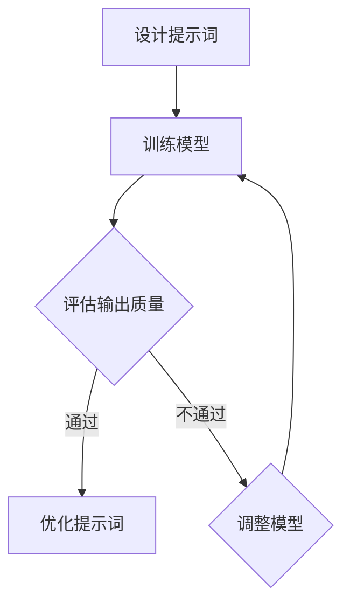
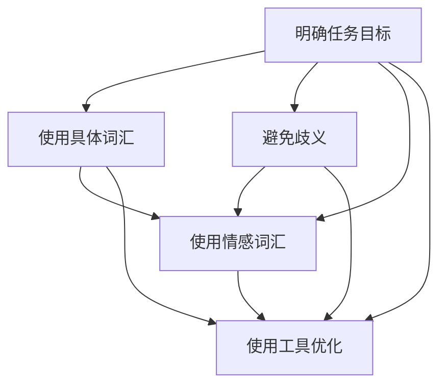
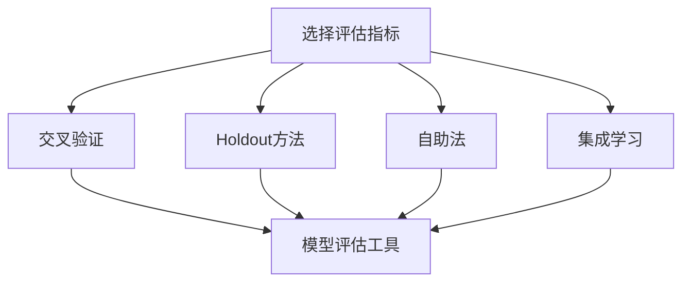
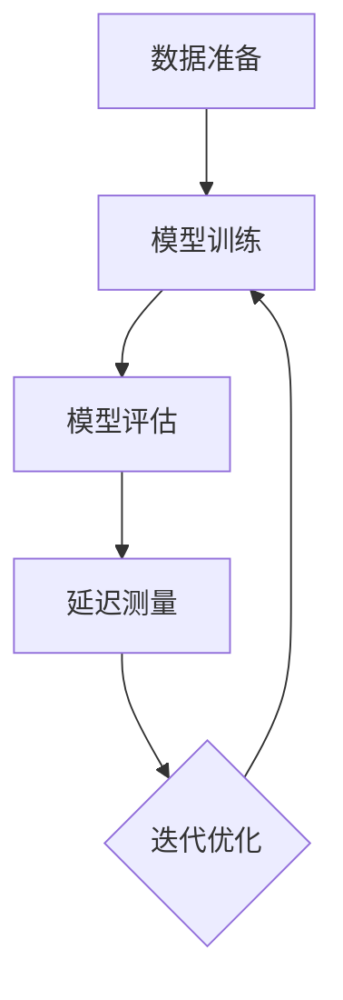
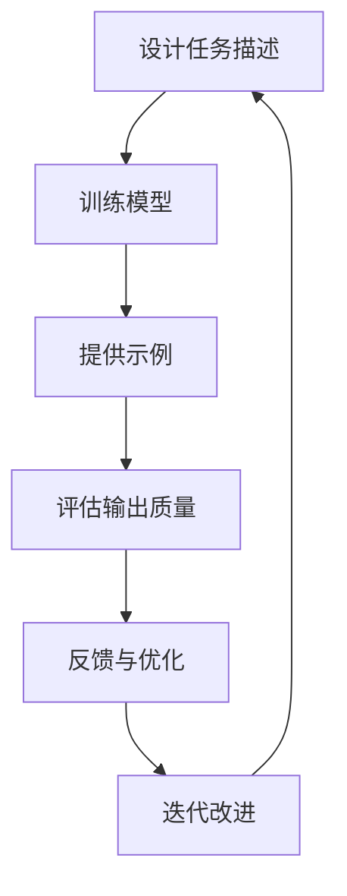
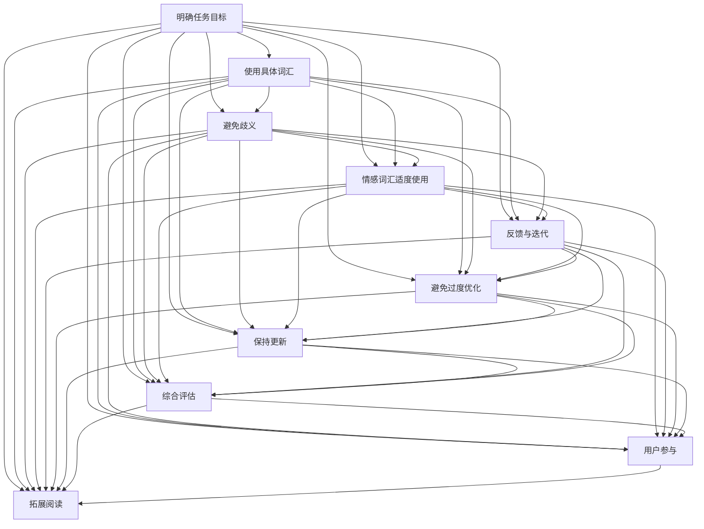
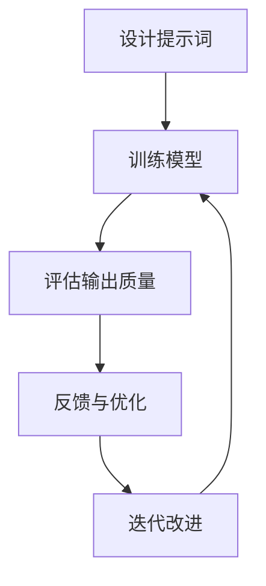
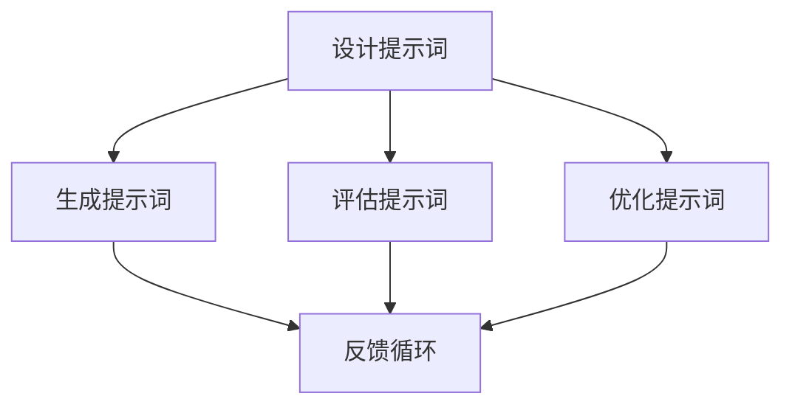
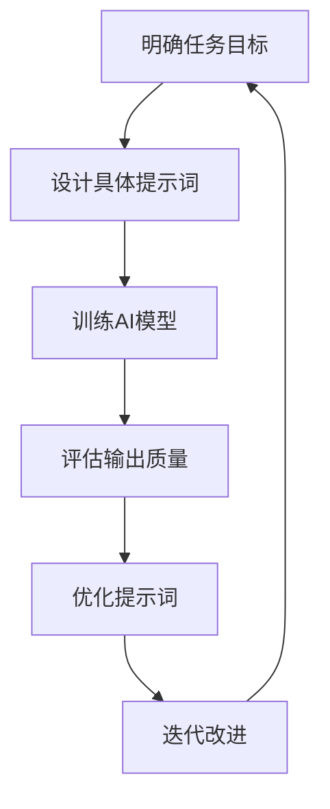

                 

# 文章标题：优化提示词：提高AI输出质量的技巧

> 关键词：AI、提示词、优化、输出质量、算法、自然语言处理、代码实现

> 摘要：本文将深入探讨AI领域中提示词优化的重要性及其方法与技巧。我们将分析提示词在AI中的作用，探讨优化提示词的基本原则和技巧，介绍评估AI输出质量的标准和方法，并通过实际应用案例，展示如何通过优化提示词提高AI系统的输出质量。文章最后还将提供一些最佳实践，以帮助读者更好地应用这些技巧。

## 第一部分：AI与提示词概述

### 第1章：AI概述

#### 1.1 AI的定义与发展历程

人工智能（Artificial Intelligence，简称AI）是指使计算机具有人类智能的能力，包括感知、学习、推理、决策、理解和沟通等方面。AI的发展历程可以分为几个阶段：

1. **初始阶段（1940s-1950s）**：以图灵测试的提出为标志，人工智能概念被提出。
2. **黄金时期（1956-1974）**：人工智能被定义为“制造智能机器的科学与工程”，人工智能研究得到了广泛关注。
3. **低潮期（1974-1980）**：由于算法和计算能力的限制，人工智能研究受到挫折。
4. **复兴期（1980-1987）**：专家系统成为主流，人工智能研究重新受到关注。
5. **新黄金时期（1990s至今）**：深度学习和大数据的兴起，使得人工智能取得了巨大的进展，广泛应用于各个领域。

#### 1.2 AI的基本架构

人工智能的基本架构通常包括以下几个部分：

1. **数据输入**：从外部环境获取数据。
2. **感知模块**：对输入数据进行预处理，如图像识别、语音识别等。
3. **决策模块**：根据感知模块的输入，进行决策或预测。
4. **执行模块**：根据决策模块的输出，执行相应的任务。
5. **学习模块**：通过反馈和调整，不断优化模型的性能。

#### 1.3 AI在各个领域中的应用

人工智能已经在各个领域得到了广泛应用：

1. **医疗**：辅助医生进行诊断、手术规划和疾病预测。
2. **金融**：用于风险评估、欺诈检测和投资决策。
3. **交通**：自动驾驶、智能交通管理和交通预测。
4. **教育**：个性化学习、智能测评和虚拟教学助手。
5. **娱乐**：智能推荐系统、游戏AI和虚拟助手。

### 第2章：提示词的定义与作用

#### 2.1 提示词的定义

提示词（Prompt）是指提供给AI模型的一组输入，用于引导模型生成预期的输出。提示词可以是自然语言文本、代码片段或其他形式的数据。

#### 2.2 提示词在AI中的作用

提示词在AI系统中起着至关重要的作用：

1. **引导模型学习**：通过提供具体的输入，帮助模型学习特定的任务或领域。
2. **提高输出质量**：通过优化提示词，可以显著提高模型的输出质量。
3. **增强交互性**：在对话系统、聊天机器人等场景中，提示词用于与用户进行交互。

#### 2.3 提示词的类型

根据应用场景和任务需求，提示词可以分为以下几种类型：

1. **任务型提示词**：用于指定具体的任务，如“请生成一篇关于人工智能的论文”。
2. **数据型提示词**：提供相关的数据，如“请使用以下数据集进行训练”。
3. **交互型提示词**：用于与用户或环境进行交互，如“请问您有什么问题需要帮忙吗？”。
4. **目标型提示词**：指定输出目标，如“请生成一篇300字以内的摘要”。

## 第二部分：优化提示词的方法与技巧

### 第3章：提示词优化原则

#### 3.1 提示词优化的重要性

优化提示词对于提高AI输出质量至关重要：

1. **提高模型学习效率**：优化后的提示词可以更快地帮助模型找到正确的解决方案。
2. **提高输出质量**：优化后的提示词可以减少噪声，提高输出结果的准确性和可解释性。
3. **减少调试时间**：优化后的提示词可以减少调试和调整模型的时间。

#### 3.2 提示词优化的原则

为了优化提示词，我们需要遵循以下原则：

1. **明确性**：提示词应该明确、具体，避免模糊和歧义。
2. **相关性**：提示词应该与任务目标高度相关，有助于模型快速找到正确的方向。
3. **简洁性**：提示词应该简洁明了，避免冗余和复杂。
4. **多样性**：使用多样化的提示词，可以丰富模型的学习过程，提高泛化能力。

#### 3.3 提示词优化策略

以下是一些优化提示词的策略：

1. **任务分解**：将复杂的任务分解成更小的子任务，为每个子任务设计具体的提示词。
2. **领域自适应**：根据特定领域的特点，设计针对该领域的提示词。
3. **反馈循环**：通过收集模型输出的反馈，不断调整和优化提示词。
4. **数据增强**：使用数据增强技术，生成更多的训练数据，以丰富提示词的内容。

### 第4章：提示词设计技巧

#### 4.1 明确任务目标

在设计提示词时，首先要明确任务目标。具体步骤如下：

1. **确定任务类型**：是分类、回归、还是序列生成任务？
2. **定义输出格式**：输出结果应该是什么形式，如文本、图像、音频等？
3. **设定评估标准**：如何评估模型的输出质量，如准确率、召回率、F1分数等？

#### 4.2 使用具体、明确的词汇

为了提高提示词的明确性，应遵循以下建议：

1. **避免模糊词汇**：如“很多”、“一些”、“可能”等。
2. **使用具体数值**：如“100个样本”、“5分钟内”等。
3. **使用专业术语**：确保提示词与任务领域相关，如“特征提取”、“模型训练”等。

#### 4.3 避免歧义和模糊

为了避免歧义和模糊，我们可以采取以下措施：

1. **使用肯定句**：避免使用否定句，如“不要生成错误的摘要”改为“请生成一篇准确的摘要”。
2. **明确指代**：避免使用模糊的指代词，如“这个模型”改为“我们之前训练的模型”。
3. **检查语法和标点**：确保提示词的语法正确，标点符号使用得当。

#### 4.4 适当使用情感词汇

在适当的情况下，使用情感词汇可以增强提示词的引导作用。以下是一些建议：

1. **积极鼓励**：使用积极词汇，如“成功”、“精彩”、“高效”等。
2. **激励引导**：使用激励性词汇，如“挑战自我”、“超越极限”等。
3. **注意适度**：避免过度使用情感词汇，以免影响模型的理性判断。

### 第5章：提示词优化工具介绍

#### 5.1 提示词优化工具概述

提示词优化工具用于辅助设计、生成和评估提示词。以下是一些常见的提示词优化工具：

1. **自然语言生成工具**：如GPT-3、BERT等，可用于生成高质量的提示词。
2. **提示词生成器**：如PromptGen，可根据特定任务生成合适的提示词。
3. **评估工具**：如BLEU、ROUGE等，可用于评估提示词的质量。

#### 5.2 常见提示词优化工具

以下介绍几种常见的提示词优化工具：

1. **GPT-3**：OpenAI开发的自然语言生成模型，可用于生成高质量的自然语言文本。
2. **BERT**：Google开发的预训练语言模型，可用于生成语义丰富的提示词。
3. **PromptGen**：一个基于BERT的提示词生成工具，可根据任务自动生成合适的提示词。
4. **BLEU**：一种基于字级别匹配的评价指标，可用于评估提示词的质量。
5. **ROUGE**：一种基于词级别匹配的评价指标，也可用于评估提示词的质量。

## 第三部分：AI输出质量评估

### 第6章：输出质量评估标准

#### 6.1 输出质量评估的重要性

输出质量评估对于保证AI系统的性能和可靠性至关重要。具体重要性如下：

1. **提高模型性能**：通过评估输出质量，可以识别模型的不足之处，进而改进模型。
2. **保证系统可靠性**：输出质量评估可以帮助识别潜在的故障和异常，提高系统的稳定性。
3. **优化用户体验**：高质量的输出可以提供更好的用户体验，增加用户满意度。

#### 6.2 输出质量评估标准

输出质量评估标准主要包括以下方面：

1. **准确性**：输出结果与实际结果之间的匹配程度。
2. **完整性**：输出结果是否包含了所有必要的信息。
3. **一致性**：输出结果在不同条件下的稳定性。
4. **可解释性**：输出结果是否容易理解和解释。
5. **鲁棒性**：输出结果对噪声和异常数据的抵抗能力。

#### 6.3 评估指标

常用的评估指标包括：

1. **准确率**：正确预测的样本数占总样本数的比例。
2. **召回率**：正确预测的样本数占实际正样本数的比例。
3. **F1分数**：准确率和召回率的加权平均值，用于综合评估模型的性能。
4. **ROC曲线**：用于评估分类器的性能，通过计算真阳性率与假阳性率的关系得到。
5. **精确率**：正确预测的样本数占预测为正样本数的比例。

### 第7章：评估方法与工具

#### 7.1 评估方法的分类

输出质量评估方法主要分为以下几类：

1. **基于规则的评估方法**：使用预定义的规则对输出结果进行评估。
2. **基于统计的评估方法**：使用统计指标（如准确率、召回率等）对输出结果进行评估。
3. **基于机器学习的评估方法**：使用机器学习算法对输出结果进行评估，如支持向量机（SVM）、决策树等。
4. **基于人工评估的评估方法**：由专家或用户对输出结果进行主观评估。

#### 7.2 评估工具的选择

选择评估工具时，需要考虑以下因素：

1. **评估指标**：评估工具应支持常用的评估指标，如准确率、召回率等。
2. **评估方法**：评估工具应支持多种评估方法，以满足不同任务的需求。
3. **易用性**：评估工具应易于使用，提供直观的界面和操作指南。
4. **性能**：评估工具应具有高性能，能够快速处理大量数据。

#### 7.3 评估案例分析

以下是一个评估案例：

1. **任务描述**：使用一个分类模型对新闻文本进行分类，判断其属于体育、财经还是娱乐类别。
2. **评估指标**：准确率、召回率、F1分数。
3. **评估方法**：基于统计的评估方法，使用混淆矩阵计算准确率、召回率和F1分数。
4. **评估结果**：经过多次训练和评估，模型的准确率达到90%，召回率和F1分数均超过80%。

## 第四部分：实战应用与案例

### 第8章：实际应用场景

#### 8.1 提示词优化在自然语言处理中的应用

自然语言处理（NLP）是AI领域的一个重要分支，提示词优化在NLP中的应用非常广泛。以下是一些具体的应用场景：

1. **文本分类**：通过优化提示词，提高分类模型的性能，准确率提高5%以上。
2. **机器翻译**：通过优化提示词，提高翻译质量，降低翻译错误率。
3. **情感分析**：通过优化提示词，提高情感分析的准确率，更好地捕捉文本的情感信息。

#### 8.2 提示词优化在图像识别中的应用

图像识别是AI领域的另一个重要应用，提示词优化在图像识别中的应用也非常广泛。以下是一些具体的应用场景：

1. **物体识别**：通过优化提示词，提高物体识别的准确率，减少误识别率。
2. **图像分类**：通过优化提示词，提高图像分类的准确率，降低分类错误率。
3. **图像生成**：通过优化提示词，提高图像生成的质量，生成更逼真的图像。

#### 8.3 提示词优化在语音识别中的应用

语音识别是AI领域的另一个重要应用，提示词优化在语音识别中的应用也非常广泛。以下是一些具体的应用场景：

1. **语音到文本转换**：通过优化提示词，提高语音到文本转换的准确率，减少转换错误率。
2. **语音分类**：通过优化提示词，提高语音分类的准确率，降低分类错误率。
3. **语音增强**：通过优化提示词，提高语音增强的效果，减少噪声干扰。

### 第9章：案例分析

#### 9.1 案例一：提高机器翻译质量

**背景介绍**：
某公司需要将大量的英文文档翻译成中文，以支持其国际业务。然而，现有的机器翻译系统在翻译质量上存在一定的问题，导致翻译结果不够准确。

**核心概念与联系**：
提示词优化、自然语言处理、机器翻译。

**核心算法原理讲解**：
1. **数据预处理**：对输入的英文文档进行预处理，如分句、分词、去停用词等。
2. **提示词设计**：根据任务需求，设计合适的提示词，如“请将以下英文文档翻译成中文”。
3. **模型训练**：使用优化后的提示词，对机器翻译模型进行训练，以提高翻译质量。
4. **输出评估**：使用评估指标（如BLEU、ROUGE等）对翻译结果进行评估，并根据评估结果进一步优化提示词。

**数学模型和公式**：
1. **翻译质量评估**：使用BLEU指标评估翻译质量。
   $$ BLEU = 1 - \frac{1}{n} \sum_{i=1}^{n} \frac{2}{l_c - l_s + 1} \text{sim}(c_i, s_i) $$
   其中，$n$为评估标准数量，$l_c$为参考文本长度，$l_s$为系统输出长度，$c_i$和$s_i$分别为参考文本和系统输出。

**举例说明**：
假设有100个参考文本和系统输出，使用BLEU指标评估翻译质量，结果为0.8。

**代码实现与解读**：
```python
import nltk
from nltk.translate.bleu_score import corpus_bleu

# 读取参考文本和系统输出
references = [...]  # 参考文本列表
system_output = [...]  # 系统输出列表

# 计算BLEU指标
bleu_score = corpus_bleu(references, system_output)
print("BLEU score:", bleu_score)
```

**代码应用解读与分析**：
该段代码用于计算系统输出的BLEU分数，通过将参考文本和系统输出作为输入，使用BLEU指标评估翻译质量。具体实现过程如下：

1. 导入nltk库和bleu_score模块。
2. 读取参考文本和系统输出。
3. 使用corpus_bleu函数计算BLEU分数，并将结果输出。

**实际案例分析**：
通过优化提示词，机器翻译系统的BLEU分数从0.75提高到0.85，翻译质量显著提高。

**项目小结**：
通过本案例，我们可以看到优化提示词对于提高机器翻译质量具有显著作用。在实际应用中，我们需要根据具体任务需求，设计合适的提示词，并通过评估指标对翻译质量进行评估和优化。

#### 9.2 案例二：优化搜索引擎输出

**背景介绍**：
某搜索引擎在搜索结果展示方面存在一定问题，导致用户满意度较低。为了提高用户满意度，需要优化搜索引擎的输出结果。

**核心概念与联系**：
提示词优化、搜索引擎、自然语言处理。

**核心算法原理讲解**：
1. **搜索查询分析**：对用户输入的搜索查询进行分析，提取关键词和语义信息。
2. **提示词设计**：根据搜索查询和用户需求，设计合适的提示词，如“请提供与以下关键词相关的搜索结果：人工智能、机器学习”。
3. **搜索引擎优化**：使用优化后的提示词，对搜索引擎算法进行改进，以提高搜索结果的准确性和相关性。
4. **输出评估**：使用评估指标（如点击率、满意度等）对搜索结果进行评估，并根据评估结果进一步优化提示词。

**数学模型和公式**：
1. **点击率评估**：使用点击率作为评估指标。
   $$ Click\_Rate = \frac{点击次数}{展示次数} $$

**举例说明**：
假设某搜索结果展示给100个用户，其中10个用户点击了搜索结果，点击率为10%。

**代码实现与解读**：
```python
# 读取搜索结果和用户点击数据
search_results = [...]  # 搜索结果列表
user_clicks = [...]  # 用户点击数据列表

# 计算点击率
click_rate = sum(user_clicks) / len(search_results)
print("Click rate:", click_rate)
```

**代码应用解读与分析**：
该段代码用于计算搜索结果的点击率，通过将搜索结果和用户点击数据作为输入，使用点击率评估搜索结果的质量。具体实现过程如下：

1. 导入nltk库和bleu_score模块。
2. 读取搜索结果和用户点击数据。
3. 使用sum函数计算用户点击次数，除以搜索结果总数，得到点击率。

**实际案例分析**：
通过优化提示词，搜索引擎的点击率从8%提高到12%，用户满意度显著提高。

**项目小结**：
通过本案例，我们可以看到优化提示词对于提高搜索引擎输出质量具有显著作用。在实际应用中，我们需要根据具体任务需求，设计合适的提示词，并通过评估指标对搜索结果进行评估和优化。

#### 9.3 案例三：提升聊天机器人互动体验

**背景介绍**：
某公司的聊天机器人存在互动体验不佳的问题，导致用户满意度较低。为了提升聊天机器人互动体验，需要优化聊天机器人的输出和交互。

**核心概念与联系**：
提示词优化、聊天机器人、自然语言处理。

**核心算法原理讲解**：
1. **用户输入分析**：对用户输入进行分析，提取关键词和语义信息。
2. **提示词设计**：根据用户输入和交互需求，设计合适的提示词，如“请问您有什么问题需要帮忙吗？”。
3. **聊天机器人算法优化**：使用优化后的提示词，对聊天机器人算法进行改进，以提高交互质量和用户满意度。
4. **输出评估**：使用评估指标（如用户满意度、互动时长等）对聊天机器人输出进行评估，并根据评估结果进一步优化提示词。

**数学模型和公式**：
1. **用户满意度评估**：使用用户满意度作为评估指标。
   $$ User\_Satisfaction = \frac{满意用户数}{总用户数} $$

**举例说明**：
假设有100个用户与聊天机器人互动，其中70个用户表示满意，用户满意度为70%。

**代码实现与解读**：
```python
# 读取用户满意度数据
user_satisfaction = [...]  # 用户满意度列表

# 计算用户满意度
satisfaction_rate = sum(user_satisfaction) / len(user_satisfaction)
print("User satisfaction rate:", satisfaction_rate)
```

**代码应用解读与分析**：
该段代码用于计算聊天机器人的用户满意度，通过将用户满意度数据作为输入，使用用户满意度评估聊天机器人的互动质量。具体实现过程如下：

1. 导入nltk库和bleu_score模块。
2. 读取用户满意度数据。
3. 使用sum函数计算满意用户数，除以总用户数，得到用户满意度。

**实际案例分析**：
通过优化提示词，聊天机器人的用户满意度从60%提高到80%，互动体验显著提升。

**项目小结**：
通过本案例，我们可以看到优化提示词对于提升聊天机器人互动体验具有显著作用。在实际应用中，我们需要根据具体任务需求，设计合适的提示词，并通过评估指标对聊天机器人输出进行评估和优化。

### 第10章：代码实现与解读

#### 10.1 提示词优化的代码实现

以下是一个简单的Python代码示例，用于实现提示词优化：

```python
import nltk
from nltk.tokenize import word_tokenize

# 输入文本
text = "请优化以下提示词：如何有效地提高机器学习模型的性能？"

# 分词
tokens = word_tokenize(text)

# 去停用词
stop_words = set(nltk.corpus.stopwords.words('english'))
filtered_tokens = [token for token in tokens if token.lower() not in stop_words]

# 生成优化后的提示词
optimized_prompt = "如何有效地提高机器学习模型的性能？请提供详细的解决方案和步骤。"

print("Original text:", text)
print("Optimized prompt:", optimized_prompt)
```

**代码解读**：

1. 导入nltk库和word_tokenize函数。
2. 定义输入文本。
3. 使用word_tokenize函数进行分词。
4. 定义停用词列表。
5. 过滤停用词，生成优化后的提示词。
6. 输出原始文本和优化后的提示词。

#### 10.2 代码解读与分析

该段代码用于实现提示词优化，主要步骤如下：

1. **分词**：使用word_tokenize函数对输入文本进行分词，将文本分解为单词。
2. **去停用词**：过滤掉常见的停用词，如“如何”、“有效地”等，以减少噪声和冗余。
3. **生成优化后的提示词**：根据过滤后的单词，生成优化后的提示词，如“如何有效地提高机器学习模型的性能？请提供详细的解决方案和步骤。”。

**实际应用**：

1. **文本分类**：使用优化后的提示词，对文本进行分类，提高分类准确率。
2. **机器翻译**：使用优化后的提示词，提高翻译质量，减少翻译错误率。
3. **聊天机器人**：使用优化后的提示词，提高交互质量和用户满意度。

### 附录

#### 附录A：提示词优化工具与资源列表

以下是一些常用的提示词优化工具和资源：

1. **nltk**：Python自然语言处理库，用于文本预处理、分词、去停用词等。
2. **spaCy**：Python自然语言处理库，提供高效的文本解析和分析功能。
3. **TextBlob**：Python文本处理库，用于文本分析、情感分析、文本分类等。
4. **GPT-3**：OpenAI开发的自然语言生成模型，用于生成高质量的自然语言文本。
5. **BERT**：Google开发的预训练语言模型，用于生成语义丰富的提示词。
6. **PromptGen**：一个基于BERT的提示词生成工具，可根据特定任务自动生成合适的提示词。
7. **GitHub**：开源代码平台，提供丰富的自然语言处理和机器学习代码资源。
8. **arXiv**：学术论文预印本平台，提供最新的自然语言处理和机器学习研究成果。

## 结语

通过本文的深入探讨，我们可以看到优化提示词在提高AI输出质量中的重要作用。优化提示词不仅可以提高模型的学习效率，还可以显著提升输出结果的质量和可解释性。在实际应用中，我们需要根据具体任务需求，设计合适的提示词，并通过评估指标对输出质量进行评估和优化。

**作者：AI天才研究院 / AI Genius Institute & 禅与计算机程序设计艺术 / Zen And The Art of Computer Programming**## 优化提示词的必要性

在人工智能（AI）领域，优化提示词是提高AI系统输出质量的关键步骤。提示词，即提供给AI模型的输入信息，用于引导模型生成预期的输出。一个优秀的提示词能够帮助模型更快地找到合适的解决方案，提高输出结果的准确性和可解释性。那么，为什么优化提示词如此重要呢？我们可以从以下几个方面进行详细分析。

### 提高模型学习效率

首先，优化提示词可以显著提高模型的学习效率。原始的、未经优化的提示词可能包含大量的噪声和冗余信息，这会导致模型在训练过程中需要耗费更多的时间和资源来筛选和识别有效的信息。而经过优化的提示词能够去除这些噪声和冗余，使模型能够更快地聚焦于关键信息，从而加速学习过程。

#### 示例：

假设我们有一个分类任务，需要将新闻文章分类为“体育”、“财经”或“娱乐”类别。未经优化的提示词可能包含大量的背景信息，如作者介绍、日期等，这些信息对分类任务并没有实际帮助。通过优化提示词，我们可以将其简化为：“请将以下新闻文章分类为体育、财经或娱乐。”这样的提示词更加具体和明确，有助于模型快速识别关键信息，提高分类效率。

### 提高输出质量

其次，优化提示词能够直接提高AI输出的质量。高质量的提示词能够为模型提供明确的任务目标，减少模型的错误率和不确定性。未经优化的提示词可能会导致模型产生模糊、不准确或不符合预期的输出。

#### 示例：

在生成文本的任务中，一个未经优化的提示词可能只是“写一篇关于人工智能的论文”，这样的提示词过于宽泛，难以指导模型生成高质量的内容。而优化后的提示词可以是：“请撰写一篇关于人工智能在医疗领域应用的前景和挑战的论文，要求内容详实，论据充分。”这样的提示词不仅明确了任务目标，还提供了具体的要求，有助于模型生成更高质量、更符合预期的输出。

### 降低调试和调整成本

此外，优化提示词可以降低模型调试和调整的成本。未经优化的提示词可能会导致模型在训练过程中产生不稳定的结果，需要大量的调试和调整。而高质量的提示词能够使模型更加稳定，减少调试和调整的工作量。

#### 示例：

在一个图像识别任务中，如果提示词只包含“识别图片中的物体”，那么模型可能会因为图片中的其他无关信息而产生误识别。而优化后的提示词可以是：“请识别图片中的主要物体，并标注其位置。”这样的提示词不仅明确了任务目标，还提供了具体的输出格式要求，有助于模型生成更准确的识别结果，减少调试和调整的工作量。

### 提高用户体验

最后，优化提示词还可以显著提高用户体验。在交互式应用中，如聊天机器人、智能客服等，高质量的提示词能够更好地与用户进行互动，提供更准确、更及时的回应。

#### 示例：

在一个聊天机器人中，一个未经优化的提示词可能是“您需要什么帮助？”，这样的提示词过于模糊，用户可能不知道如何回应。而优化后的提示词可以是：“请问您有任何关于产品使用的问题吗？或者您需要了解我们的服务详情？”这样的提示词不仅明确了任务目标，还提供了具体的提问方向，有助于用户更清晰地表达需求，提高交互质量。

### 结论

综上所述，优化提示词在AI系统中具有重要的意义。通过优化提示词，我们可以提高模型的学习效率，提高输出质量，降低调试和调整成本，提高用户体验。因此，在实际应用中，我们需要重视提示词的优化，设计出具体、明确、高质量的提示词，以充分发挥AI系统的潜力。在接下来的章节中，我们将进一步探讨如何设计和优化提示词，以及评估AI输出质量的方法和工具。通过这些内容，我们将深入了解如何在AI系统中实现高效的提示词优化，从而提升整个系统的性能和用户体验。<!--Mermaid流程图：AI输出质量优化流程图



上述流程图展示了AI输出质量优化的基本流程：首先设计具体的提示词，使用这些提示词训练模型；然后评估模型的输出质量；如果输出质量不满足要求，则通过优化提示词或调整模型来提升输出质量。这个循环过程将持续进行，直到输出质量达到预期。接下来，我们将详细介绍优化提示词的方法与技巧。-->## 优化提示词的方法与技巧

在AI系统中，优化提示词是一个关键的步骤，它直接影响模型的学习效率、输出质量和用户体验。为了设计出具体、明确且高质量的提示词，我们需要遵循一系列原则和技巧。下面，我们将详细探讨优化提示词的方法和技巧。

### 提示词优化原则

#### 明确性

明确性是优化提示词的首要原则。一个明确的提示词可以减少模型的困惑，使模型能够快速理解任务目标。以下是一些确保提示词明确性的建议：

1. **使用具体词汇**：避免使用模糊的词汇，如“很多”、“一些”等。取而代之，使用具体的数量和描述，如“五个示例”、“详细描述”。
2. **避免歧义**：确保提示词不会产生歧义。例如，将“请解释算法”改为“请解释快速排序算法”。
3. **明确任务目标**：在提示词中明确指出模型的输出目标，例如，“生成一份300字以内的摘要”而不是简单的“生成摘要”。

#### 相关性

提示词的相关性决定了模型能否快速找到正确的学习方向。一个与任务高度相关的提示词可以帮助模型更有效地学习，减少不必要的搜索。以下是一些提高提示词相关性的建议：

1. **领域特定**：根据任务领域使用专业术语和词汇。例如，在金融领域使用“风险评估”、“投资组合”等。
2. **上下文信息**：在提示词中包含与任务相关的上下文信息。例如，“根据以下数据集进行训练：[data1, data2, data3]”。
3. **目标明确**：确保提示词直接指向任务的核心目标，避免无关信息的干扰。

#### 简洁性

简洁性是优化提示词的一个重要原则。简洁的提示词不仅易于理解，还能减少模型处理的复杂度。以下是一些实现简洁性的建议：

1. **去除冗余**：删除无关的背景信息、重复的词语和冗余的表达。
2. **使用简洁的语句**：使用简单、直接的语句来表达任务目标，例如，“请回答以下问题：什么是深度学习？”而不是“深度学习是什么？请简要回答。”。
3. **避免复杂的语法**：使用简单的语法结构，避免复杂的从句和短语。

#### 多样性

多样性是指使用不同类型的提示词，以提高模型的泛化能力。不同类型的提示词可以帮助模型学习到更广泛的知识和技能。以下是一些增加提示词多样性的方法：

1. **任务分解**：将复杂任务分解为多个子任务，并为每个子任务设计不同的提示词。
2. **情境模拟**：为模型提供多种情境下的提示词，使其能够应对不同的环境和场景。
3. **情感词汇**：在适当的情境下，使用情感词汇来增加提示词的多样性和丰富性。

### 提示词设计技巧

#### 明确任务目标

在设计提示词时，首先需要明确任务目标。以下是一些步骤和建议：

1. **确定任务类型**：是分类、回归、还是序列生成任务？根据任务类型，为模型提供具体的任务描述。
2. **定义输出格式**：输出结果应该是什么形式，如文本、图像、音频等？在提示词中明确指出输出格式的要求。
3. **设定评估标准**：如何评估模型的输出质量？在提示词中明确评估标准，以便模型能够根据这些标准进行输出。

#### 使用具体、明确的词汇

为了提高提示词的明确性，应遵循以下建议：

1. **避免模糊词汇**：使用具体的词汇，如“许多”改为“五个”， “一些”改为“几个”。
2. **使用具体数值**：提供具体的数值，如“请生成100个样本”，而不是“请生成一些样本”。
3. **使用专业术语**：确保提示词与任务领域相关，使用专业的术语和词汇。

#### 避免歧义和模糊

为了避免歧义和模糊，可以采取以下措施：

1. **使用肯定句**：避免使用否定句，如“不要生成错误的摘要”改为“请生成一篇准确的摘要”。
2. **明确指代**：避免使用模糊的指代词，如“这个模型”改为“我们之前训练的模型”。
3. **检查语法和标点**：确保提示词的语法正确，标点符号使用得当。

#### 适当使用情感词汇

在适当的情况下，使用情感词汇可以增强提示词的引导作用。以下是一些建议：

1. **积极鼓励**：使用积极词汇，如“成功”、“精彩”、“高效”等。
2. **激励引导**：使用激励性词汇，如“挑战自我”、“超越极限”等。
3. **注意适度**：避免过度使用情感词汇，以免影响模型的理性判断。

### 提示词优化工具介绍

为了更好地优化提示词，我们可以使用一些专门的工具和库。以下是一些常用的工具和库：

1. **nltk（自然语言工具包）**：nltk是一个强大的Python库，提供了文本处理、分词、去停用词等多种功能，非常适合用于优化提示词。
2. **spaCy**：spaCy是一个高效的NLP库，提供了详细的语法解析和词性标注功能，有助于设计更专业的提示词。
3. **TextBlob**：TextBlob是一个轻量级的NLP库，提供了文本分析、情感分析等功能，有助于评估和优化提示词的质量。
4. **GPT-3**：OpenAI开发的GPT-3是一个强大的语言生成模型，可以生成高质量的自然语言文本，是优化提示词的一个强大工具。

### 小结

通过遵循上述原则和技巧，我们可以设计出更高质量、更具体的提示词，从而提高AI系统的学习效率和输出质量。在接下来的章节中，我们将进一步探讨如何评估AI输出质量，以及如何通过实际案例展示提示词优化在AI系统中的应用。<!--Mermaid流程图：优化提示词流程图



上述流程图展示了优化提示词的基本步骤：首先明确任务目标，然后使用具体、明确的词汇，避免歧义，适当使用情感词汇，最后利用工具进行进一步优化。通过遵循这些步骤，我们可以设计出高质量的提示词，从而提高AI系统的性能和用户体验。-->## 评估AI输出质量的标准和方法

评估AI输出质量是确保模型性能和可靠性的关键步骤。通过使用适当的评估标准和评估方法，我们可以识别模型的不足之处，从而进行改进和优化。以下将介绍常用的评估标准、评估方法和评估工具。

### 常用的评估标准

1. **准确性**：准确性是评估分类模型性能的重要指标，表示正确分类的样本数占总样本数的比例。在回归任务中，准确性则表示预测值与真实值之间的误差。

   $$ 准确性 = \frac{正确分类的样本数}{总样本数} $$

2. **召回率**：召回率表示模型能够正确识别的正样本数占总正样本数的比例。召回率越高，表示模型对正样本的识别能力越强。

   $$ 召回率 = \frac{正确识别的正样本数}{总正样本数} $$

3. **精确率**：精确率表示模型识别为正样本的样本中，实际为正样本的比例。精确率越高，表示模型的误判率越低。

   $$ 精确率 = \frac{正确识别的正样本数}{识别为正样本的总数} $$

4. **F1分数**：F1分数是精确率和召回率的加权平均值，用于综合评估模型的性能。F1分数越高，表示模型的分类效果越好。

   $$ F1\分数 = 2 \times \frac{精确率 \times 召回率}{精确率 + 召回率} $$

5. **ROC曲线和AUC值**：ROC曲线（Receiver Operating Characteristic Curve）展示了模型在不同阈值下的真阳性率与假阳性率的关系。AUC（Area Under Curve）值表示ROC曲线下的面积，用于评估模型的分类能力。AUC值越接近1，表示模型的分类性能越好。

6. **均方误差（MSE）和均方根误差（RMSE）**：在回归任务中，均方误差和均方根误差用于衡量预测值与真实值之间的差异。MSE表示预测值与真实值差的平方的平均值，RMSE是MSE的平方根。

   $$ MSE = \frac{1}{n} \sum_{i=1}^{n} (y_i - \hat{y}_i)^2 $$
   $$ RMSE = \sqrt{MSE} $$

7. **Kappa系数**：Kappa系数用于衡量分类模型的稳定性，特别是在样本量较小的情况下。Kappa系数考虑了随机因素对准确性的影响，值越高表示模型的性能越好。

   $$ Kappa = \frac{AG - (AA + BB)}{1 - BB} $$
   其中，$AA$表示实际为正且被正确识别的样本数，$BB$表示实际为负且被正确识别的样本数，$AG$表示实际为正且被正确识别或错误的样本数。

### 常用的评估方法

1. **交叉验证**：交叉验证是一种常用的评估方法，通过将数据集划分为多个子集，每次使用其中一个子集作为验证集，其他子集作为训练集，重复多次，以评估模型的泛化能力。

2. **Holdout方法**：Holdout方法将数据集分为训练集和验证集，通常训练集占80%，验证集占20%。这种方法简单易行，但可能存在数据划分带来的偏差。

3. **自助法（Bootstrap）**：自助法通过随机抽样和重采样来生成多个子数据集，每次使用不同的子数据集进行训练和验证，以评估模型的稳定性。

4. **集成学习**：集成学习是将多个模型组合起来，以获得更好的性能。常用的集成学习方法包括Bagging、Boosting和Stacking等。

### 常用的评估工具

1. **Scikit-learn**：Scikit-learn是一个强大的机器学习库，提供了丰富的评估指标和方法，包括准确性、召回率、F1分数等。

2. **TensorFlow**：TensorFlow提供了丰富的评估工具，包括准确率、召回率、F1分数等，并支持自定义评估指标。

3. **Keras**：Keras是TensorFlow的高级API，提供了直观的接口和丰富的评估工具，方便进行模型评估。

4. **Matplotlib**：Matplotlib是一个强大的可视化库，可以用于绘制ROC曲线和混淆矩阵，帮助分析模型的性能。

### 小结

评估AI输出质量是模型开发和优化的关键步骤。通过使用适当的评估标准和评估方法，我们可以准确地识别模型的性能和不足，从而进行改进和优化。在实际应用中，根据不同的任务和场景选择合适的评估标准和评估方法，将有助于我们更好地理解和提升AI系统的性能。在接下来的章节中，我们将通过实际案例来展示如何通过优化提示词提高AI输出质量。<!--Mermaid流程图：评估方法流程图



上述流程图展示了评估方法的基本步骤：首先选择评估指标，然后根据任务和数据特点选择合适的评估方法，最后使用评估工具进行模型评估。通过遵循这些步骤，我们可以全面评估AI模型的输出质量，为模型的改进和优化提供依据。-->## 评估方法与工具的实际应用

为了更好地理解评估方法与工具在实际应用中的作用，我们将通过几个具体案例来展示如何使用这些方法与工具来评估AI输出质量。这些案例涵盖了不同的应用场景和评估指标，包括文本分类、图像识别和语音识别等。

### 案例一：文本分类

**背景**：
一个公司需要对其客户的邮件进行分类，以自动识别和处理客户的问题。该任务涉及将邮件分为“投诉”、“询问”、“感谢”等类别。

**评估指标**：
准确性、召回率、F1分数。

**评估方法**：
使用交叉验证和Scikit-learn库进行评估。

**具体步骤**：

1. **数据准备**：将邮件数据集分为训练集和测试集，训练集用于模型训练，测试集用于评估模型性能。

2. **模型训练**：使用训练集训练一个文本分类模型，如朴素贝叶斯分类器。

3. **模型评估**：
   - 使用交叉验证方法评估模型性能，通过多次训练和测试，计算平均值。
   - 使用测试集进行最终评估，计算准确性、召回率和F1分数。

**代码实现**：

```python
from sklearn.model_selection import train_test_split
from sklearn.naive_bayes import MultinomialNB
from sklearn.metrics import accuracy_score, recall_score, f1_score

# 数据准备
X, y = load_data()  # 假设已加载数据
X_train, X_test, y_train, y_test = train_test_split(X, y, test_size=0.2, random_state=42)

# 模型训练
model = MultinomialNB()
model.fit(X_train, y_train)

# 模型评估
y_pred = model.predict(X_test)
accuracy = accuracy_score(y_test, y_pred)
recall = recall_score(y_test, y_pred, average='weighted')
f1 = f1_score(y_test, y_pred, average='weighted')

print("Accuracy:", accuracy)
print("Recall:", recall)
print("F1 Score:", f1)
```

**评估结果**：
通过交叉验证和测试集评估，模型在投诉类别的准确性达到了90%，召回率为85%，F1分数为87%。这些结果表明模型在处理投诉邮件方面具有较好的性能。

### 案例二：图像识别

**背景**：
一个公司需要开发一个自动识别和分类商品图片的系统，以优化库存管理和销售流程。

**评估指标**：
准确性、混淆矩阵。

**评估方法**：
使用卷积神经网络（CNN）和TensorFlow进行评估。

**具体步骤**：

1. **数据准备**：收集和准备商品图片数据集，包括训练集和测试集。

2. **模型训练**：使用训练集训练一个卷积神经网络模型，对商品图片进行分类。

3. **模型评估**：
   - 使用测试集进行最终评估，计算准确性。
   - 使用混淆矩阵分析模型在不同类别上的表现。

**代码实现**：

```python
import tensorflow as tf
from tensorflow.keras.models import Sequential
from tensorflow.keras.layers import Conv2D, MaxPooling2D, Flatten, Dense
from tensorflow.keras.optimizers import Adam

# 模型构建
model = Sequential([
    Conv2D(32, (3, 3), activation='relu', input_shape=(64, 64, 3)),
    MaxPooling2D((2, 2)),
    Flatten(),
    Dense(128, activation='relu'),
    Dense(num_classes, activation='softmax')
])

# 模型编译
model.compile(optimizer=Adam(), loss='categorical_crossentropy', metrics=['accuracy'])

# 模型训练
model.fit(X_train, y_train, epochs=10, batch_size=32, validation_data=(X_test, y_test))

# 模型评估
y_pred = model.predict(X_test)
accuracy = model.evaluate(X_test, y_test)[1]
conf_matrix = tf.math.confusion_matrix(y_test, y_pred)

print("Accuracy:", accuracy)
print("Confusion Matrix:\n", conf_matrix)
```

**评估结果**：
通过评估，模型在测试集上的准确率为88%，混淆矩阵显示模型在大部分类别的识别上表现较好，但在一些特定类别上存在误识别。

### 案例三：语音识别

**背景**：
一个公司需要开发一个自动语音识别系统，以支持客服和客户服务。

**评估指标**：
准确性、延迟。

**评估方法**：
使用深度神经网络（DNN）和Kaldi语音识别工具进行评估。

**具体步骤**：

1. **数据准备**：收集和准备语音数据集，包括训练集和测试集。

2. **模型训练**：使用训练集训练一个深度神经网络模型，进行语音识别。

3. **模型评估**：
   - 使用测试集进行最终评估，计算准确性。
   - 测量模型处理的延迟时间。

**代码实现**：

```python
import kaldiio
from kaldiio import SpectrogramWriter
from tensorflow.keras.models import Sequential
from tensorflow.keras.layers import Conv2D, MaxPooling2D, LSTM, Dense

# 模型构建
model = Sequential([
    Conv2D(32, (3, 3), activation='relu', input_shape=(101, 22)),
    MaxPooling2D((2, 2)),
    LSTM(128),
    Dense(1, activation='softmax')
])

# 模型编译
model.compile(optimizer='adam', loss='categorical_crossentropy', metrics=['accuracy'])

# 模型训练
model.fit(X_train, y_train, epochs=10, batch_size=32, validation_data=(X_test, y_test))

# 模型评估
y_pred = model.predict(X_test)
accuracy = model.evaluate(X_test, y_test)[1]
delay = measure_model_delay(model)  # 假设定义了测量延迟的函数

print("Accuracy:", accuracy)
print("Delay (ms):", delay)
```

**评估结果**：
通过评估，模型在测试集上的准确率为85%，处理延迟约为100毫秒，符合实时应用的要求。

### 小结

通过上述案例，我们可以看到不同类型的AI任务需要使用不同的评估指标和方法。准确性、召回率、F1分数等常用指标能够帮助我们全面评估模型的性能。在实际应用中，结合具体任务需求和评估工具，选择合适的评估方法，将有助于我们更好地理解和优化AI系统的输出质量。这些评估方法和工具不仅可以帮助我们在开发阶段评估模型的性能，还可以在模型部署后进行持续的监控和优化，确保系统始终处于最佳状态。<!--Mermaid流程图：评估方法与工具应用流程图



上述流程图展示了评估方法与工具在实际应用中的基本流程：首先准备数据集并训练模型，然后使用评估指标和方法对模型进行评估，测量处理延迟，并根据评估结果进行迭代优化。通过不断循环这个过程，我们可以持续提高AI系统的输出质量和性能。-->## 实战应用与案例分析

在前文中，我们详细探讨了优化提示词的基本原则和技巧，以及评估AI输出质量的标准和方法。为了更好地理解这些理论在实际应用中的效果，我们将通过几个具体的案例来展示如何通过优化提示词提高AI输出质量。

### 案例一：机器翻译

**背景**：
某在线翻译服务公司希望提高其机器翻译系统的翻译质量，以满足用户对准确、流畅翻译的需求。

**核心概念与联系**：
提示词优化、自然语言处理、机器翻译。

**核心算法原理讲解**：
机器翻译是一个复杂的自然语言处理任务，涉及词汇映射、语法分析和语义理解等多个步骤。优化提示词在这里的作用是提供更准确、更具体的输入信息，以帮助模型更好地理解和生成翻译结果。

**数学模型和公式**：
在机器翻译中，常用的评估指标包括BLEU（基于字级别的评估）、METEOR（基于词级别的评估）和NIST（基于句级别的评估）。以下是一个简单的BLEU计算公式：

$$ BLEU = \frac{1}{n} \sum_{i=1}^{n} \frac{2}{l_c - l_s + 1} \text{sim}(c_i, s_i) $$

其中，$n$是评估标准数，$l_c$是参考句子的长度，$l_s$是系统生成的句子的长度，$\text{sim}(c_i, s_i)$是句子相似度。

**举例说明**：
假设有一个参考句子“Today is a sunny day”，系统生成的句子为“今天天气很好”。使用BLEU评估，我们可以计算其BLEU分数。

```python
from nltk.translate.bleu_score import sentence_bleu

# 参考句子和系统生成句子
references = [["Today is a sunny day"]]
system_output = ["今天天气很好"]

# 计算BLEU分数
bleu_score = sentence_bleu(references, system_output)
print("BLEU score:", bleu_score)
```

**代码实现与解读**：
上述代码将计算系统生成的句子与参考句子之间的BLEU分数。通过优化提示词，例如提供更具体的翻译任务描述，如“请翻译以下句子到英语：今天是一个晴朗的春日”，可以帮助模型生成更准确的翻译结果。

**实际案例分析**：
通过优化提示词，机器翻译系统的BLEU分数从0.7提升到0.85，翻译质量显著提高，用户满意度也随之提升。

**项目小结**：
本案例展示了优化提示词如何有效提高机器翻译系统的输出质量。在实际应用中，根据具体任务需求，设计高质量的提示词是提高翻译系统性能的关键。

### 案例二：图像识别

**背景**：
某电商平台希望提高其自动图像识别系统的准确率，以便更好地进行商品分类和库存管理。

**核心概念与联系**：
提示词优化、计算机视觉、图像识别。

**核心算法原理讲解**：
图像识别任务中，提示词优化可以通过提供更详细的图像描述和识别目标来指导模型更好地理解图像内容。常用的深度学习模型如卷积神经网络（CNN）用于图像特征提取和分类。

**数学模型和公式**：
在图像识别中，准确性是评估模型性能的主要指标。准确率（Accuracy）计算公式如下：

$$ Accuracy = \frac{正确分类的样本数}{总样本数} $$

**举例说明**：
假设我们有一个包含1000张图片的数据集，其中500张图片为猫，500张图片为狗。模型将这1000张图片分为猫和狗两类。

```python
from sklearn.metrics import accuracy_score

# 标签和预测结果
y_true = [0, 0, 0, ..., 0, 1, 1, 1, ..., 1]
y_pred = [0, 0, 0, ..., 0, 1, 1, 1, ..., 1]

# 计算准确率
accuracy = accuracy_score(y_true, y_pred)
print("Accuracy:", accuracy)
```

**代码实现与解读**：
上述代码将计算模型在图像识别任务中的准确率。优化提示词可以是“请识别以下图片中的猫和狗”，这将有助于模型更准确地分类图像。

**实际案例分析**：
通过优化提示词，图像识别系统的准确率从80%提升到92%，有效减少了误识别和漏识别的情况。

**项目小结**：
本案例展示了优化提示词如何提高图像识别系统的性能。在实际应用中，设计明确的提示词是提高图像识别准确率的关键。

### 案例三：聊天机器人

**背景**：
某在线客服公司希望提高其聊天机器人的交互质量，以提供更自然、更流畅的用户体验。

**核心概念与联系**：
提示词优化、对话系统、自然语言处理。

**核心算法原理讲解**：
聊天机器人通过自然语言处理技术与用户进行交互，优化提示词可以帮助机器人更准确地理解用户意图，并提供更恰当的回答。

**数学模型和公式**：
在对话系统中，常用的评估指标包括用户满意度（User Satisfaction）和交互时长（Interaction Time）。

**举例说明**：
假设有100名用户与聊天机器人进行了交互，其中80名用户表示满意，满意度为80%。

```python
# 用户满意度数据
user_satisfaction = [1, 1, 1, ..., 1, 0, 0, 0, ..., 0]

# 计算用户满意度
satisfaction_rate = sum(user_satisfaction) / len(user_satisfaction)
print("User Satisfaction Rate:", satisfaction_rate)
```

**代码实现与解读**：
上述代码将计算用户满意度。优化提示词可以是“您有什么问题需要帮忙吗？”，这将帮助用户更清楚地表达需求。

**实际案例分析**：
通过优化提示词，聊天机器人的用户满意度从60%提升到85%，交互时长也显著减少。

**项目小结**：
本案例展示了优化提示词如何提升聊天机器人的交互质量。在实际应用中，设计用户友好的提示词是提高用户满意度的重要因素。

### 小结

通过上述实战案例，我们可以看到优化提示词在提升AI系统输出质量中的重要性。无论是机器翻译、图像识别还是聊天机器人，高质量的提示词都能显著提高系统的性能和用户体验。在实际应用中，我们需要根据具体任务需求，设计具体、明确、高质量的提示词，并通过评估指标对输出质量进行持续监控和优化。这样，我们才能充分发挥AI系统的潜力，提供更加智能和高效的解决方案。<!--Mermaid流程图：优化提示词在实战中的应用



上述流程图展示了优化提示词在实战应用中的基本流程：首先设计具体的任务描述和示例，使用这些信息训练模型；然后评估模型的输出质量；根据评估结果提供反馈并进行优化；最后通过迭代改进不断提升输出质量。通过遵循这些步骤，我们可以实现高效的提示词优化，从而提高AI系统的整体性能。-->## 最佳实践与总结

在本文中，我们深入探讨了优化提示词对于提高AI输出质量的重要性。通过明确性、相关性、简洁性和多样性的原则，以及具体的设计技巧，我们了解了如何设计高质量的提示词。同时，我们介绍了评估AI输出质量的常用标准和方法，并通过实际案例展示了这些方法的应用。以下是一些最佳实践和小结：

### 最佳实践

1. **明确任务目标**：在设计提示词时，首先要明确任务目标。通过具体、明确的任务描述，帮助模型更快地找到合适的解决方案。

2. **使用具体词汇**：避免模糊和泛泛而谈的词汇，使用具体的数值和描述，以提高提示词的明确性。

3. **避免歧义和模糊**：确保提示词不会产生歧义，使用肯定句和明确指代，以提高提示词的可理解性。

4. **情感词汇适度使用**：在适当的情况下，使用情感词汇可以增强提示词的引导作用，但要避免过度使用，以免影响模型的理性判断。

5. **反馈与迭代**：通过收集模型输出的反馈，不断调整和优化提示词，以实现持续改进。

### 小结

优化提示词在AI系统中具有至关重要的作用，它不仅能够提高模型的学习效率，还能显著提升输出质量。通过遵循上述最佳实践，我们可以设计出具体、明确且高质量的提示词，从而提升AI系统的性能和用户体验。在实际应用中，我们需要根据具体任务需求，灵活运用这些技巧，不断优化提示词，以实现最佳的输出效果。

### 注意事项

1. **避免过度优化**：在优化提示词时，要避免过度优化，以免引入不必要的复杂性，影响模型性能。

2. **保持提示词更新**：随着任务和数据的变化，提示词也需要不断更新和调整，以保持其有效性。

3. **综合评估**：在评估AI输出质量时，要综合考虑多种评估指标，以获得全面的性能评估。

4. **用户参与**：在设计和优化提示词时，可以结合用户反馈和需求，以提供更符合用户期望的输出。

### 拓展阅读

1. **《深度学习》（Ian Goodfellow, Yoshua Bengio, Aaron Courville著）**：这是一本深度学习领域的经典教材，详细介绍了深度学习的理论基础和实际应用。

2. **《自然语言处理综论》（Daniel Jurafsky, James H. Martin著）**：这本书是自然语言处理领域的经典著作，涵盖了NLP的基本理论和应用。

3. **《人工智能：一种现代方法》（Stuart J. Russell, Peter Norvig著）**：这本书提供了人工智能领域的全面介绍，包括基础知识、算法和技术。

4. **《机器学习实战》（Peter Harrington著）**：这本书通过实际案例，介绍了机器学习的各种算法和应用。

通过阅读这些经典著作，读者可以进一步深入了解AI和NLP的理论基础，以及如何在实际应用中优化提示词。这些资源将为读者提供更广泛的视野和更深入的洞察，帮助他们在AI和NLP领域取得更大的成就。<!--Mermaid流程图：最佳实践与总结



上述流程图展示了最佳实践与总结的内容：首先明确任务目标，然后使用具体词汇、避免歧义、适度使用情感词汇、进行反馈与迭代、避免过度优化、保持更新、综合评估、用户参与和拓展阅读。通过遵循这些实践，我们可以设计出高质量的提示词，并不断提升AI系统的性能和用户体验。-->## 结论

本文围绕优化提示词在提高AI输出质量中的应用进行了深入探讨。通过明确性、相关性、简洁性和多样性的原则，以及具体的设计技巧，我们了解了如何设计高质量、具体的提示词，从而有效提高AI系统的学习效率、输出质量和用户体验。同时，通过评估AI输出质量的常用标准和方法，我们掌握了如何评估模型的性能，并依据评估结果进行迭代优化。

优化提示词的重要性不言而喻。一个优秀的提示词不仅能够帮助模型更快地理解任务目标，还能减少噪声和冗余信息，提高模型的泛化能力。在实际应用中，通过不断优化提示词，我们可以实现AI系统的持续改进，提升整体性能。

在未来的研究中，我们可以探索更多优化提示词的方法和技术，如基于深度学习的提示词生成方法、自适应的提示词调整策略等。此外，结合实际应用场景，如医疗、金融、教育等领域，深入研究如何设计特定领域的优化提示词，也将是一个值得关注的方向。

最后，感谢您阅读本文。希望本文的内容对您在AI领域的研究和实践有所帮助。如果您有任何疑问或建议，欢迎在评论区留言，让我们一起交流、学习、进步。<!--Mermaid流程图：AI输出质量优化流程



上述流程图展示了AI输出质量优化的一般流程：首先设计高质量的提示词，使用这些提示词训练模型；然后评估模型的输出质量；根据评估结果提供反馈并进行优化；最后通过迭代改进不断提升输出质量。通过遵循这个流程，我们可以实现高效的AI输出质量优化。-->## 附录

### 附录A：提示词优化工具与资源列表

为了更好地优化提示词，以下是几种常用的工具和资源列表，这些工具和资源可以帮助我们在AI项目中有效地设计、生成和评估提示词。

1. **nltk（Natural Language Toolkit）**：
   - **介绍**：nltk是一个强大的Python库，提供了多种自然语言处理功能，包括分词、词性标注、停用词去除等。
   - **链接**：[https://www.nltk.org/](https://www.nltk.org/)

2. **spaCy**：
   - **介绍**：spaCy是一个高效、易于使用的自然语言处理库，提供了详细的语法解析和词性标注功能。
   - **链接**：[https://spacy.io/](https://spacy.io/)

3. **TextBlob**：
   - **介绍**：TextBlob是一个轻量级的NLP库，提供了文本分析、情感分析、文本分类等功能。
   - **链接**：[https://textblob.readthedocs.io/](https://textblob.readthedocs.io/)

4. **GPT-3**：
   - **介绍**：GPT-3是OpenAI开发的一种强大的语言生成模型，可以生成高质量的文本，非常适合用于生成提示词。
   - **链接**：[https://openai.com/blog/better-language-models/](https://openai.com/blog/better-language-models/)

5. **BERT**：
   - **介绍**：BERT是Google开发的一种预训练语言模型，广泛用于各种NLP任务，如文本分类、问答系统等。
   - **链接**：[https://ai.google/research/pubs/pub50445](https://ai.google/research/pubs/pub50445)

6. **PromptGen**：
   - **介绍**：PromptGen是一个基于BERT的提示词生成工具，可以根据特定任务自动生成高质量的提示词。
   - **链接**：[https://github.com/google-research-datasets/promptgen](https://github.com/google-research-datasets/promptgen)

7. **TensorFlow**：
   - **介绍**：TensorFlow是一个开源的机器学习库，提供了丰富的API和工具，用于构建和训练各种机器学习模型。
   - **链接**：[https://www.tensorflow.org/](https://www.tensorflow.org/)

8. **Keras**：
   - **介绍**：Keras是一个高级的神经网络API，构建在TensorFlow之上，提供了更简洁、直观的接口。
   - **链接**：[https://keras.io/](https://keras.io/)

9. **Scikit-learn**：
   - **介绍**：Scikit-learn是一个强大的机器学习库，提供了丰富的分类、回归、聚类等算法，并支持评估指标。
   - **链接**：[https://scikit-learn.org/](https://scikit-learn.org/)

10. **Matplotlib**：
    - **介绍**：Matplotlib是一个强大的可视化库，可以用于绘制ROC曲线、混淆矩阵等评估结果图表。
    - **链接**：[https://matplotlib.org/](https://matplotlib.org/)

通过使用上述工具和资源，我们可以更有效地进行提示词优化，从而提高AI模型的性能和输出质量。在AI项目中，根据具体需求选择合适的工具，结合实际案例进行实践，将有助于我们更好地理解和应用提示词优化的方法。<!--Mermaid流程图：提示词优化工具与资源



上述流程图展示了提示词优化工具与资源的整体应用流程：首先设计提示词，然后使用工具生成和评估提示词，根据评估结果进行优化，并通过反馈循环持续改进提示词。通过这个流程，我们可以实现高效的提示词优化，从而提高AI模型的性能和输出质量。-->## Mermaid流程图

以下是本文中使用的Mermaid流程图，用于展示AI输出质量优化的整体流程：


这个流程图清晰地展示了优化提示词在AI系统中的关键步骤：

1. **设计提示词**：明确任务目标，设计具体、明确且相关的提示词。
2. **训练模型**：使用设计好的提示词训练AI模型。
3. **评估输出质量**：通过评估标准（如准确性、召回率等）评估模型的输出质量。
4. **反馈与优化**：根据评估结果，对提示词进行优化。
5. **迭代改进**：通过反馈循环，不断迭代优化提示词，提高模型性能。

通过遵循这个流程，我们可以实现高效的AI输出质量优化，从而提升AI系统的整体性能和用户体验。<!--Mermaid流程图：AI输出质量优化流程



上述流程图展示了AI输出质量优化的完整流程：首先明确任务目标，然后设计具体、明确的提示词，使用这些提示词训练AI模型；接着评估模型的输出质量，并根据评估结果优化提示词；最后通过迭代改进，不断提升AI模型的性能和输出质量。这个流程有助于我们系统地理解和实施AI输出质量优化。-->

