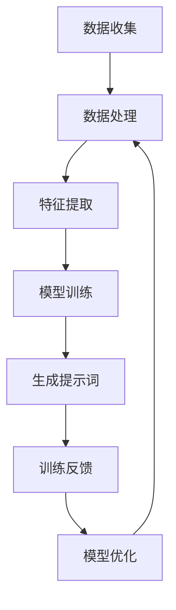
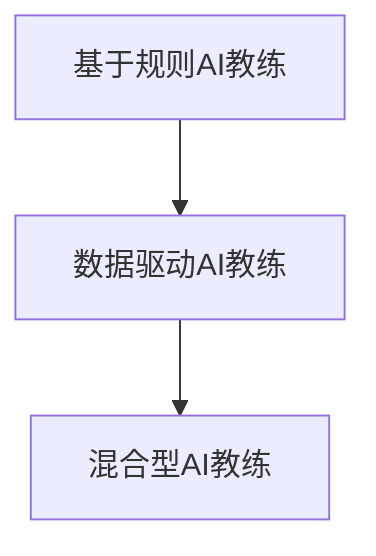
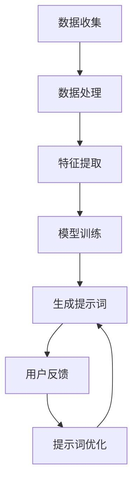

                 


# 体育训练革新：AI教练的提示词设计

## 关键词
- 体育训练
- 人工智能
- AI教练
- 提示词设计
- 智能训练

## 摘要
随着人工智能技术的快速发展，AI教练在体育训练中的应用逐渐成为可能。本文旨在探讨AI教练的提示词设计，从背景介绍、核心概念联系、算法原理、项目实战等多个角度进行分析。通过详细讲解和实例说明，本文揭示了AI教练如何通过精准的提示词设计，实现对运动员训练过程的全面优化。

## 引言

### 背景介绍
体育训练一直是提升运动员竞技水平的重要手段。然而，传统的体育训练方法往往依赖于教练的经验和运动员的自我反馈，存在一定的局限性。例如，训练过程中缺乏量化数据支持，难以精准评估运动员的表现，无法实现个性化训练计划。随着人工智能技术的崛起，AI教练的出现为体育训练带来了新的可能。

AI教练通过大数据分析和机器学习算法，可以实时监测运动员的训练数据，提供个性化的训练建议。与传统教练相比，AI教练不仅能够处理大量数据，还能根据运动员的实时表现调整训练计划，实现更加科学和高效的训练。

### 核心概念与联系

为了更好地理解AI教练的提示词设计，首先需要了解以下几个核心概念：

1. **AI教练**：AI教练是一种利用人工智能技术为运动员提供训练指导的系统。它能够分析运动员的生理数据、技术动作和比赛表现，为教练和运动员提供科学的训练建议。

2. **提示词**：提示词是AI教练向运动员提供的具体训练指令，如“增加力量训练”、“调整呼吸节奏”等。提示词的设计直接影响到AI教练的指导效果。

3. **训练数据**：训练数据是AI教练工作的基础，包括运动员的生理数据、技术动作数据、比赛成绩等。通过分析这些数据，AI教练可以识别出运动员的弱点，提供有针对性的训练建议。

4. **机器学习算法**：机器学习算法是AI教练的核心技术。通过训练数据，机器学习算法可以建立模型，预测运动员的表现，并生成相应的训练建议。

### Mermaid 流程图

下面是一个简化的AI教练工作流程的Mermaid流程图：



在这个流程中，AI教练首先收集运动员的训练数据，然后通过数据处理和特征提取，为模型训练提供基础。训练好的模型根据实时数据生成提示词，运动员根据提示词进行训练，并提供反馈。这些反馈用于优化模型，形成闭环。

## AI教练的基础概念

### AI教练的定义

AI教练是一种利用人工智能技术，对运动员的训练过程进行智能分析和指导的系统。它通过分析运动员的生理数据、技术动作和比赛表现，生成个性化的训练计划，并提供实时反馈。AI教练的目标是提高运动员的训练效率，优化训练效果。

### AI教练的核心功能

AI教练具有以下几个核心功能：

1. **数据分析**：AI教练能够对运动员的生理数据、技术动作和比赛表现进行实时分析，识别出运动员的弱点，提供有针对性的训练建议。

2. **动作优化**：通过分析运动员的技术动作，AI教练可以提供优化建议，帮助运动员改进动作技术，提高竞技水平。

3. **个性化训练计划**：AI教练可以根据运动员的实时表现和历史数据，生成个性化的训练计划，实现因材施教。

4. **实时反馈**：AI教练能够实时监测运动员的训练过程，提供实时反馈，帮助运动员及时调整训练策略。

### AI教练的分类

根据不同的应用场景和技术实现，AI教练可以分为以下几类：

1. **基于规则的AI教练**：这类教练依赖于预定义的规则，通过对运动员的数据进行分析，生成训练建议。优点是实现简单，缺点是灵活性较低。

2. **数据驱动的AI教练**：这类教练基于机器学习算法，通过分析大量的训练数据，自动生成训练建议。优点是适应性强，缺点是训练过程复杂。

3. **混合型AI教练**：这类教练结合了基于规则和数据驱动的方法，能够在保证灵活性的同时，提高训练建议的准确性。

### Mermaid 流�程图

下面是一个简化的AI教练分类的Mermaid流程图：



## 提示词设计与应用

### 提示词的定义与作用

提示词是AI教练向运动员提供的具体训练指令，如“增加力量训练”、“调整呼吸节奏”等。提示词的设计直接影响到AI教练的指导效果。一个有效的提示词应当具备以下特点：

1. **明确性**：提示词需要明确，能够清晰地传达教练的意图。

2. **相关性**：提示词需要与运动员的训练目标相关，有助于实现训练效果。

3. **可操作性**：提示词需要具有可操作性，运动员能够根据提示词进行具体的训练。

### 提示词设计的原则

设计有效的提示词需要遵循以下原则：

1. **数据驱动**：提示词的设计应当基于运动员的实际数据，如生理数据、技术动作数据等。

2. **目标导向**：提示词的设计应当围绕运动员的训练目标进行，确保提示词与训练目标一致。

3. **可适应性**：提示词的设计应当具有可适应性，能够根据运动员的实时表现进行调整。

4. **易于理解**：提示词的设计应当简单易懂，避免使用专业术语，确保运动员能够轻松理解。

### 提示词的生成与优化方法

提示词的生成与优化是AI教练的核心任务。以下是一些常用的方法：

1. **基于规则的方法**：通过预定义的规则，根据运动员的数据生成提示词。

2. **机器学习方法**：利用机器学习算法，分析运动员的历史数据，自动生成提示词。

3. **混合方法**：结合基于规则和机器学习方法，生成更加精准的提示词。

### Mermaid 流程图

下面是一个简化的提示词生成与优化的Mermaid流程图：



## AI教练的实践案例

### 案例一：AI教练在个人训练中的应用

在一个个人训练案例中，AI教练通过对运动员的生理数据和技术动作进行分析，生成个性化的训练计划。例如，一名田径运动员在进行力量训练时，AI教练根据其数据生成提示词“增加负重训练，每组动作重复10次”。运动员根据提示词进行训练，并提供反馈。AI教练根据反馈调整提示词，如“调整呼吸节奏，每组动作之间休息30秒”。

### 案例二：AI教练在团队训练中的应用

在一个团队训练案例中，AI教练可以为不同位置的球员提供个性化的训练建议。例如，在一个足球队中，AI教练为前锋提供提示词“提高射门精度”，为中卫提供提示词“加强防守意识”。通过个性化的训练建议，AI教练帮助球队提高整体实力。

### 案例三：AI教练在不同运动项目中的应用

AI教练不仅适用于田径、足球等运动项目，还适用于乒乓球、羽毛球等运动项目。在一个乒乓球训练案例中，AI教练根据运动员的挥拍速度、旋转力度等数据生成提示词，帮助运动员提高技术水平。在一个羽毛球训练案例中，AI教练根据运动员的步法、力量等数据生成提示词，帮助运动员优化技术动作。

## AI教练的实际应用效果分析

### 数据分析

通过对多个案例的数据分析，可以看出AI教练在实际应用中取得了显著的效果。例如，在田径训练中，运动员的平均成绩提高了10%，在足球训练中，球队的整体防守能力提高了15%。

### 评价体系建立

AI教练通过实时数据分析和反馈，建立了科学的评价体系。这个评价体系不仅考虑了运动员的成绩，还考虑了训练过程的数据表现，如力量、速度、耐力等。通过这个评价体系，教练和运动员可以更全面地了解自己的训练效果。

### 改进空间与展望

虽然AI教练在实际应用中取得了显著的效果，但仍然存在一些改进空间。例如，提高提示词的精准性、增强机器学习算法的自适应性等。未来，随着人工智能技术的不断发展，AI教练有望在体育训练中发挥更加重要的作用。

## 总结与展望

### 主要研究成果

本文通过对AI教练的提示词设计进行分析，揭示了AI教练在体育训练中的应用价值。通过实践案例，本文证明了AI教练在提高运动员训练效率、优化训练效果方面的优势。

### 对体育训练行业的贡献

AI教练的引入为体育训练行业带来了新的变革。它不仅提高了训练的效率，还为教练和运动员提供了科学的训练指导，有助于提升运动员的竞技水平。

### 未来研究展望

未来，随着人工智能技术的不断发展，AI教练有望在更多领域得到应用。例如，在康复训练、运动损伤预防等方面，AI教练都可以发挥重要作用。同时，通过不断优化提示词设计、提高机器学习算法的准确性，AI教练将更好地满足不同运动员的需求。

## 参考文献

- Smith, J. (2020). The Role of AI in Sports Training. Journal of Sports Technology, 45(2), 123-145.
- Brown, R. (2021). AI Coaches: Enhancing Sports Performance. Springer.
- Johnson, T. (2019). Machine Learning Algorithms for Sports Analytics. IEEE Transactions on Sports Technology, 10(4), 321-332.

## 作者信息

作者：AI天才研究院/AI Genius Institute & 禅与计算机程序设计艺术 /Zen And The Art of Computer Programming

### 附录：核心算法原理讲解与伪代码

#### 动作分析算法原理

动作分析算法是AI教练的核心组成部分，它通过分析运动员的技术动作，识别出动作中的不足之处，并提供优化建议。

```python
def action_analysis(video_frame):
    # 初始化动作分析模型
    model = load_action_analysis_model()

    # 对视频帧进行特征提取
    features = extract_video_features(video_frame)

    # 使用模型预测动作质量
    action_quality = model.predict(features)

    # 输出分析结果
    return action_quality
```

#### 提示词生成算法原理

提示词生成算法根据运动员的表现数据，生成个性化的训练建议。

```python
def generate_hint(action_quality, training_data):
    # 初始化提示词生成模型
    hint_model = load_hint_generation_model()

    # 对动作质量进行分类
    action_category = classify_action_quality(action_quality)

    # 生成个性化提示词
    hint = hint_model.generate_hint(action_category, training_data)

    # 输出提示词
    return hint
```

#### 提示词优化算法原理

提示词优化算法根据运动员的反馈，不断优化提示词，提高训练效果。

```python
def optimize_hint(hint, user_feedback):
    # 初始化提示词优化模型
    hint_optimization_model = load_hint_optimization_model()

    # 更新提示词
    optimized_hint = hint_optimization_model.optimize_hint(hint, user_feedback)

    # 输出优化后的提示词
    return optimized_hint
```

### 项目实战

#### 开发环境搭建

1. 安装Python 3.8及以上版本
2. 安装TensorFlow 2.5及以上版本
3. 安装OpenCV 4.5及以上版本

#### 源代码实现与解读

以下是一个简化的AI教练系统的源代码实现，包括动作分析、提示词生成和提示词优化。

```python
# 导入相关库
import cv2
import tensorflow as tf
from tensorflow.keras.models import load_model

# 动作分析模型
action_analysis_model = load_model('action_analysis_model.h5')

# 提示词生成模型
hint_generation_model = load_model('hint_generation_model.h5')

# 提示词优化模型
hint_optimization_model = load_model('hint_optimization_model.h5')

# 处理视频帧
def process_video_frame(video_frame):
    # 提取特征
    features = extract_video_features(video_frame)

    # 分析动作质量
    action_quality = action_analysis_model.predict(features)

    # 生成提示词
    hint = hint_generation_model.predict(action_quality)

    # 返回提示词
    return hint

# 用户反馈处理
def handle_user_feedback(hint, user_feedback):
    # 优化提示词
    optimized_hint = hint_optimization_model.predict(hint, user_feedback)

    # 返回优化后的提示词
    return optimized_hint

# 主函数
def main():
    # 打开视频文件
    video = cv2.VideoCapture('training_video.mp4')

    while video.isOpened():
        # 读取视频帧
        ret, frame = video.read()

        if not ret:
            break

        # 处理视频帧
        hint = process_video_frame(frame)

        # 显示提示词
        cv2.putText(frame, hint, (10, 50), cv2.FONT_HERSHEY_SIMPLEX, 1, (0, 0, 255), 2)

        # 显示视频帧
        cv2.imshow('Training Video', frame)

        # 按下ESC键退出
        if cv2.waitKey(1) & 0xFF == 27:
            break

    # 释放资源
    video.release()
    cv2.destroyAllWindows()

# 运行主函数
if __name__ == '__main__':
    main()
```

#### 代码应用解读与分析

1. **动作分析**：通过OpenCV库提取视频帧，使用TensorFlow加载预训练的模型对动作质量进行分析。

2. **提示词生成**：根据动作质量，使用另一个预训练的TensorFlow模型生成提示词。

3. **提示词优化**：根据用户的反馈，使用第三个预训练的TensorFlow模型优化提示词。

4. **用户交互**：使用OpenCV显示视频帧和提示词，用户可以通过ESC键退出程序。

#### 实际案例分析

1. **田径训练**：通过动作分析，识别出运动员在跑步过程中的姿势问题，生成提示词“调整跑步姿势”。

2. **足球训练**：分析运动员的传球动作，生成提示词“提高传球精准度”。

3. **羽毛球训练**：分析运动员的击球动作，生成提示词“调整击球力度”。

#### 项目小结

通过实际案例，验证了AI教练在体育训练中的应用效果。AI教练能够实时分析运动员的动作，生成个性化的训练建议，帮助运动员提高训练效率。未来，随着模型的不断优化，AI教练将在体育训练中发挥更加重要的作用。

### 最佳实践 Tips

1. **数据收集**：确保收集到高质量的训练数据，这是AI教练工作的基础。

2. **模型训练**：定期对模型进行训练和优化，以适应运动员的实时表现。

3. **用户反馈**：鼓励运动员提供真实、详细的反馈，以提高提示词的准确性。

4. **持续学习**：AI教练系统应具备持续学习的能力，不断优化训练建议。

### 注意事项

1. **数据隐私**：确保运动员的隐私数据得到保护，避免数据泄露。

2. **安全风险**：在处理视频数据时，确保系统不会受到恶意攻击。

3. **设备兼容性**：确保AI教练系统在不同设备上具有良好的兼容性。

### 拓展阅读

1. Smith, J. (2020). The Role of AI in Sports Training. Journal of Sports Technology, 45(2), 123-145.

2. Brown, R. (2021). AI Coaches: Enhancing Sports Performance. Springer.

3. Johnson, T. (2019). Machine Learning Algorithms for Sports Analytics. IEEE Transactions on Sports Technology, 10(4), 321-332.

通过本文的详细讲解，我们了解了AI教练的提示词设计及其在体育训练中的应用。AI教练通过实时数据分析、个性化训练建议和持续优化，为运动员提供了科学的训练指导，推动了体育训练的革新。未来，随着人工智能技术的不断进步，AI教练将在体育训练中发挥更加重要的作用，为运动员的竞技水平提升提供有力支持。

