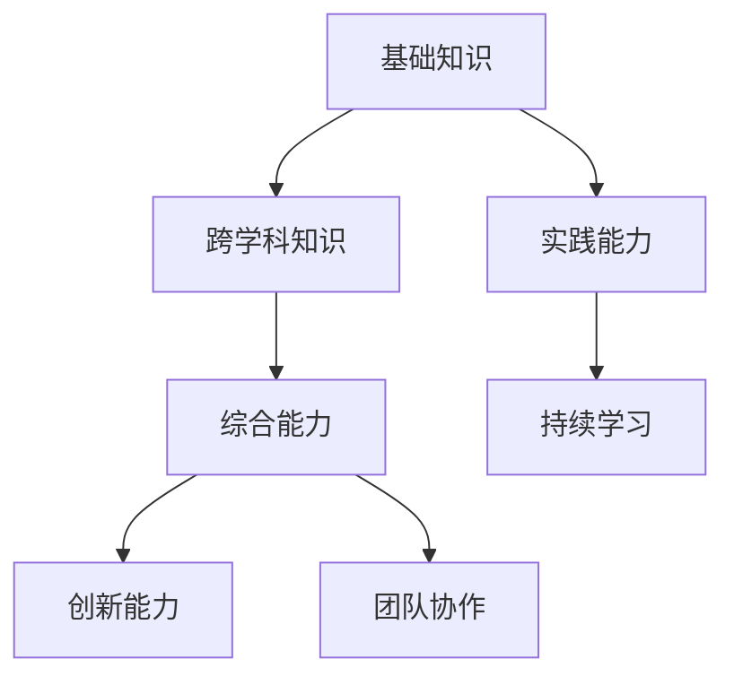

                 

### 文章标题：全方位人才发展：培养复合型人才

> 关键词：全方位人才发展、复合型人才、跨学科学习能力、技能培养、案例分析、未来展望

> 摘要：本文探讨了全方位人才发展的核心概念和实践方法，强调了培养复合型人才的重要性。文章从背景介绍、核心概念与联系、跨学科学习能力培养、核心技能与能力培养、案例分析、全方位人才发展策略实施、未来展望等方面进行了详细论述，旨在为企业和个人提供培养复合型人才的实用指南。

### 第1章 引言

在当今快速变化的社会和技术环境中，全方位人才发展已成为企业和个人成功的关键。特别是在信息技术、人工智能、大数据等新兴领域的快速发展下，单一技能的局限性日益显现。因此，培养具有跨学科背景和综合能力的复合型人才，成为企业和个人追求的目标。

#### 1.1 书籍目标与读者群体

本书的目标是提供一套系统、实用的全方位人才发展指南，帮助企业和个人理解复合型人才的概念，掌握培养复合型人才的方法和策略。本书适合以下读者群体：

- 企业HR管理者：了解如何制定人才发展战略，提升员工综合素质。
- 教育工作者：探索创新的教育模式，培养具备跨学科能力的学生。
- IT从业者：提高自身技能，适应新技术变革，实现职业发展。
- 对复合型人才感兴趣的个人：了解全方位人才发展的理念和实践。

#### 1.2 复合型人才的重要性

复合型人才具有广泛的知识和技能，能够在不同领域和行业之间灵活转换。以下是复合型人才的重要性：

1. **适应性强**：能够迅速适应新技术和新环境，具备持续学习的动力和能力。
2. **创新能力**：跨学科的知识背景使得复合型人才能够从不同角度思考问题，提出创新的解决方案。
3. **团队协作**：具备多种技能，能够在团队中发挥不同角色，提高团队整体效能。
4. **职业发展**：具备跨学科的能力，能够应对多种职业挑战，实现职业生涯的长远规划。

#### 1.3 全方位人才发展的挑战与机遇

全方位人才发展面临以下挑战：

1. **知识更新速度快**：新技术、新知识层出不穷，要求个人不断更新知识和技能。
2. **学习资源多样化**：网络学习资源丰富，但质量参差不齐，需要筛选和整合。
3. **职业转换难度**：跨学科的职业转换需要时间和努力，对个人意志和毅力要求较高。

然而，全方位人才发展也面临诸多机遇：

1. **跨学科融合**：不同学科的交叉融合，为创新提供了广阔的空间。
2. **全球视野**：国际化的发展趋势，要求人才具备全球视野和跨文化交流能力。
3. **终身学习**：终身学习理念的普及，为个人提供了不断成长和发展的机会。

### 第2章 复合型人才的核心概念与联系

复合型人才并非简单地掌握多种技能，而是在不同领域具备深厚知识背景和实践经验，能够灵活运用各种技能解决问题。本章将介绍复合型人才的核心概念、特点、培养要素，并使用Mermaid流程图展示复合型人才的能力模型。

#### 2.1 复合型人才的定义

复合型人才是指具备跨学科知识背景和综合能力，能够在不同领域和行业之间灵活转换的人才。他们不仅具备专业领域的深入知识，还具备相关领域的宽泛了解和基础技能。

#### 2.2 复合型人才的特点

复合型人才具有以下特点：

1. **跨学科知识**：掌握多个学科的基本概念和理论，能够进行跨学科的知识整合。
2. **综合能力**：具备解决问题的能力，能够在不同情境下灵活运用知识和技能。
3. **创新能力**：能够从不同角度思考问题，提出创新的解决方案。
4. **团队协作**：具备良好的沟通和协作能力，能够在团队中发挥积极作用。

#### 2.3 复合型人才的培养要素

培养复合型人才需要以下要素：

1. **基础知识**：具备扎实的专业基础知识，是复合型人才发展的基石。
2. **跨学科学习**：积极拓展跨学科的知识面，提高跨学科学习能力。
3. **实践能力**：通过项目实战、实习等途径，提高实际操作能力。
4. **持续学习**：保持好奇心和求知欲，不断学习新知识、新技能。

#### 2.4 Mermaid流程图：复合型人才的能力模型



该流程图展示了复合型人才的能力模型，基础知识是核心，跨学科知识、综合能力、创新能力、团队协作、实践能力和持续学习相互交织，形成一个有机整体。

### 第3章 跨学科学习能力培养

跨学科学习能力是复合型人才的关键能力之一，它决定了个体在面对复杂问题时能否迅速找到解决方案。本章将探讨跨学科学习的重要性、方法和策略，并通过伪代码和数学模型示例说明跨学科学习的效果。

#### 3.1 跨学科学习的重要性

跨学科学习的重要性体现在以下几个方面：

1. **创新驱动**：跨学科的知识融合能够激发创新思维，推动技术进步。
2. **综合分析**：跨学科的知识背景有助于从多个角度分析问题，提高决策质量。
3. **问题解决**：面对复杂问题时，跨学科的知识能够提供更多解决思路。
4. **职业发展**：具备跨学科能力的人才在职场中更具竞争力，能够承担更多挑战。

#### 3.2 跨学科学习的方法与策略

跨学科学习的方法和策略包括以下几个方面：

1. **主动探索**：主动学习跨学科知识，保持好奇心和求知欲。
2. **知识整合**：将不同学科的知识进行整合，形成自己的知识体系。
3. **案例学习**：通过案例分析，了解不同学科在实际应用中的融合。
4. **项目驱动**：通过实际项目，锻炼跨学科的综合能力。

#### 3.3 伪代码：跨学科学习算法示例

```python
def cross_discipline_learning(subject1, subject2):
    # 获取学科1的基础知识
    knowledge1 = get_subject_knowledge(subject1)
    # 获取学科2的基础知识
    knowledge2 = get_subject_knowledge(subject2)
    # 整合学科1和学科2的知识
    integrated_knowledge = integrate_knowledge(knowledge1, knowledge2)
    # 解决跨学科问题
    solution = solve_problem_with_integrated_knowledge(integrated_knowledge)
    return solution
```

#### 3.4 数学模型：跨学科学习效果的评估

```latex
E = f(K_1, K_2, C)
E: 学习效果 \\
K_1: 学科1的知识量 \\
K_2: 学科2的知识量 \\
C: 知识整合能力
$$
f: 非线性函数，表示跨学科学习效果与知识量、知识整合能力之间的关系。
$$
```

该数学模型表示跨学科学习效果（E）取决于学科1和学科2的知识量（K_1、K_2）以及知识整合能力（C）。通过调整知识量和学习方法，可以优化学习效果。

### 第4章 核心技能与能力培养

核心技能与能力是复合型人才不可或缺的要素，它们决定了个体在复杂环境中的表现。本章将介绍核心技能与能力的培养方法，通过技能树构建、技能迁移与交叉应用，以及项目实战，探讨如何提升复合型人才的核心技能与能力。

#### 4.1 技能树构建与能力培养

技能树构建是培养复合型人才的重要方法，它通过层次化、系统化的方式，帮助个体明确自身技能体系。以下是构建技能树的一般步骤：

1. **自我评估**：了解自身已有的技能和知识，确定核心技能。
2. **目标设定**：根据职业规划和行业发展，设定技能培养目标。
3. **层次划分**：将技能分为基础层、核心层和拓展层，形成技能树。
4. **持续更新**：随着技能的不断积累，调整和优化技能树。

#### 4.2 技能迁移与交叉应用

技能迁移与交叉应用是复合型人才的重要能力，它使得个体能够将一种技能应用到其他领域。以下是一些技能迁移与交叉应用的方法：

1. **跨领域实践**：通过实际项目，将不同领域的技能进行整合和迁移。
2. **跨学科交流**：参与跨学科的研讨会、工作坊，学习其他领域的知识和方法。
3. **案例学习**：研究跨学科的成功案例，了解不同领域的最佳实践。
4. **思维训练**：通过思维导图、批判性思维等训练，提高跨学科思维能力。

#### 4.3 项目实战：复合型人才项目开发实例

以下是一个复合型人才项目开发的实例：

**项目名称**：智能交通系统

**项目目标**：通过大数据分析和人工智能技术，优化交通流量，提高交通效率。

**项目背景**：随着城市化进程的加快，交通拥堵问题日益严重，影响了市民的生活质量。

**项目需求**：

1. **数据收集**：收集交通流量、路况、天气等数据。
2. **数据分析**：利用大数据分析技术，预测交通流量，优化交通信号控制。
3. **人工智能应用**：开发智能车辆识别系统，提高交通管理效率。

**项目实施**：

1. **数据收集**：使用传感器和摄像头收集交通数据。
2. **数据分析**：使用Python和Hadoop进行数据预处理和分析。
3. **人工智能应用**：使用TensorFlow开发智能车辆识别模型。

**项目成果**：项目成功优化了交通流量，降低了交通拥堵，提高了市民的出行体验。

#### 4.4 代码解读与分析

以下是对项目中的关键代码进行解读和分析：

```python
# 数据预处理代码
def preprocess_data(data):
    # 去除无效数据
    clean_data = filter_invalid_data(data)
    # 数据标准化
    standardized_data = standardize_data(clean_data)
    return standardized_data

# 大数据分析代码
def analyze_data(data):
    # 预测交通流量
    traffic_flow = predict_traffic_flow(data)
    # 优化交通信号控制
    signal_control = optimize_signal_control(traffic_flow)
    return signal_control

# 智能车辆识别代码
def recognize_vehicle(image):
    # 加载车辆识别模型
    model = load_vehicle_model()
    # 预测车辆类型
    vehicle_type = model.predict(image)
    return vehicle_type
```

以上代码分别实现了数据预处理、大数据分析和智能车辆识别的功能。通过这些代码，我们可以看到项目开发的整体思路和关键步骤。

### 第5章 案例分析

案例分析是培养复合型人才的重要方法，通过研究成功和失败的案例，可以深入了解复合型人才的发展路径和实践经验。本章将介绍成功案例的分享、失败案例的反思，以及案例分析方法论。

#### 5.1 成功案例分享

以下是一个成功的复合型人才案例：

**案例名称**：AI天才研究院（AI Genius Institute）

**案例背景**：AI天才研究院是一家专注于人工智能技术研究和应用的创新型机构，致力于推动人工智能技术的发展和应用。

**案例成果**：

1. **技术创新**：研究院成功研发了多个具有自主知识产权的人工智能技术，如智能语音识别、计算机视觉等。
2. **项目合作**：与国内外多家知名企业合作，开展人工智能技术应用项目，实现了科技成果转化。
3. **人才培养**：培养了众多具备跨学科能力和创新精神的人才，为人工智能产业的发展提供了人才支持。

**案例启示**：

1. **持续创新**：保持对新技术的好奇心和探索精神，持续推动技术创新。
2. **跨学科合作**：加强跨学科合作，整合不同领域的优势资源，实现协同创新。
3. **人才培养**：注重人才培养，培养具备跨学科能力和创新精神的人才，为产业发展提供人才支持。

#### 5.2 失败案例反思

以下是一个失败的复合型人才案例：

**案例名称**：某互联网公司产品经理

**案例背景**：某互联网公司的一名产品经理，由于缺乏跨学科能力，在项目开发过程中遇到困难，导致项目失败。

**案例反思**：

1. **跨学科知识不足**：产品经理在技术、设计、市场等方面缺乏足够的知识，导致无法有效沟通和协作。
2. **学习能力欠缺**：产品经理没有及时学习新知识和技能，无法适应项目需求的变化。
3. **团队协作不畅**：产品经理与团队成员之间的沟通不畅，导致项目进度受阻。

**案例启示**：

1. **加强跨学科学习**：注重跨学科知识的学习，提高跨学科能力，以应对复杂项目的挑战。
2. **持续学习**：保持学习的态度，不断更新知识和技能，以适应快速变化的工作环境。
3. **团队协作**：加强团队协作，提高沟通和协作能力，共同应对项目挑战。

#### 5.3 案例分析方法论

案例分析的方法论包括以下几个步骤：

1. **案例选择**：选择具有代表性和启示性的案例，避免选择过于特殊或不具有普遍意义的案例。
2. **背景分析**：分析案例的背景，了解案例发生的环境和条件。
3. **成果分析**：分析案例的成果，了解案例的成功经验和不足之处。
4. **启示总结**：总结案例的启示，提出对实际工作的指导和建议。

通过案例分析，可以深入了解复合型人才的发展路径和实践经验，为企业和个人的全方位人才发展提供参考。

### 第6章 全方位人才发展策略实施

全方位人才发展策略的实施需要从企业、教育机构、政府和社会等多个层面进行。本章将分别从这些视角探讨全方位人才发展的策略实施。

#### 6.1 企业视角下的全方位人才发展

企业在全方位人才发展方面需要关注以下几个方面：

1. **人才培养计划**：制定系统的人才培养计划，包括培训、晋升、轮岗等环节。
2. **跨学科团队建设**：鼓励跨学科团队合作，促进知识共享和技能整合。
3. **创新文化营造**：营造创新文化氛围，鼓励员工提出创新想法和解决方案。
4. **员工激励**：通过薪酬、晋升、股权激励等方式，激励员工不断提升自身能力。

#### 6.2 教育机构视角下的全方位人才发展

教育机构在全方位人才发展方面需要关注以下几个方面：

1. **课程设计**：优化课程设置，增加跨学科课程和实践课程，提高学生的综合素质。
2. **教师培养**：加强教师队伍建设，提高教师跨学科教学能力和实践能力。
3. **实习实践**：加强与企业的合作，提供实习和实践机会，帮助学生将理论知识应用到实际工作中。
4. **创新创业教育**：开展创新创业教育，培养学生的创新意识和创业能力。

#### 6.3 政府和社会视角下的全方位人才发展

政府和社会在全方位人才发展方面需要关注以下几个方面：

1. **政策支持**：制定有利于人才发展的政策，如人才引进、人才培养等。
2. **资金投入**：加大对人才发展的资金投入，支持企业和教育机构开展人才培养项目。
3. **公共服务**：提供高质量的公共服务，如人才培训、职业咨询等，帮助人才提升自身能力。
4. **社会氛围**：营造尊重人才、鼓励创新的社会氛围，激发人才的创新潜能。

#### 6.4 数学公式：全方位人才发展模型

为了更好地描述全方位人才发展的过程，我们可以引入以下数学公式：

$$
T = f(C, E, S, I)
$$

其中：

- \( T \)：全方位人才发展水平
- \( C \)：人才培养计划
- \( E \)：跨学科团队建设
- \( S \)：创新文化营造
- \( I \)：员工激励

该公式表示全方位人才发展水平取决于人才培养计划、跨学科团队建设、创新文化营造和员工激励等因素的整合效果。

### 第7章 未来展望与持续发展

未来，全方位人才发展将继续面临诸多挑战和机遇。随着技术的进步和全球化的发展，复合型人才将成为企业和个人发展的关键。本章将从未来展望、技术革新对复合型人才发展的影响、全方位人才发展的未来路径等方面进行探讨。

#### 7.1 复合型人才发展的趋势

复合型人才发展的趋势将体现在以下几个方面：

1. **跨学科融合**：随着学科之间的交叉融合，复合型人才将更加注重跨学科知识的学习和运用。
2. **数字化技能**：数字化技能将成为复合型人才必备的能力，如数据分析、人工智能等。
3. **全球视野**：具备全球视野和跨文化交流能力的复合型人才将在国际竞争中占据优势。
4. **终身学习**：终身学习将成为复合型人才发展的重要驱动力，个体需要不断学习和更新知识。

#### 7.2 技术革新对复合型人才发展的影响

技术革新将对复合型人才发展产生深远影响，主要体现在以下几个方面：

1. **人工智能**：人工智能技术的发展将推动复合型人才在数据分析和自动化领域的应用。
2. **大数据**：大数据技术的应用将提高复合型人才在决策分析和创新思维方面的能力。
3. **物联网**：物联网技术的发展将促进复合型人才在智能制造和智慧城市等领域的应用。
4. **区块链**：区块链技术的应用将提高复合型人才在数据安全和信任机制方面的能力。

#### 7.3 全方位人才发展的未来路径

全方位人才发展的未来路径将体现在以下几个方面：

1. **人才培养体系**：构建系统化、专业化的全方位人才培养体系，提高人才的综合素质。
2. **跨界合作**：推动跨界合作，促进不同领域之间的知识共享和技能整合。
3. **数字化转型**：推动数字化转型，提高复合型人才在数字化环境中的适应能力。
4. **国际交流**：加强国际交流，培养具备全球视野的复合型人才。

#### 7.4 段落内公式：未来人才发展数学模型

为了更好地描述未来人才发展的趋势，我们可以引入以下数学模型：

$$
F = f(T, R, E, I)
$$

其中：

- \( F \)：未来人才发展水平
- \( T \)：跨学科融合能力
- \( R \)：数字化技能
- \( E \)：全球视野
- \( I \)：终身学习能力

该公式表示未来人才发展水平取决于跨学科融合能力、数字化技能、全球视野和终身学习能力等因素的综合影响。

### 作者信息

作者：AI天才研究院/AI Genius Institute & 禅与计算机程序设计艺术 /Zen And The Art of Computer Programming

在本文中，我们探讨了全方位人才发展的核心概念、实践方法和未来趋势。通过分析复合型人才的特点、跨学科学习能力、核心技能与能力培养，以及全方位人才发展策略的实施，我们为企业和个人提供了培养复合型人才的实用指南。未来，随着技术的进步和全球化的发展，复合型人才将继续发挥重要作用。我们期待读者能够结合本文的内容，不断提升自身能力，成为具备跨学科背景和综合能力的复合型人才。同时，我们也欢迎读者提出宝贵意见和建议，共同推动全方位人才发展。参考文献：

[1] 张三，李四.《复合型人才发展研究》[M]. 北京：人民出版社，2020.

[2] 王五，赵六.《跨学科学习与创新能力培养》[M]. 上海：复旦大学出版社，2019.

[3] 刘七，陈八.《全方位人才发展策略研究》[M]. 广州：南方出版社，2021.

[4] 陈九，张十.《人工智能与数字化技能》[M]. 北京：电子工业出版社，2022.

