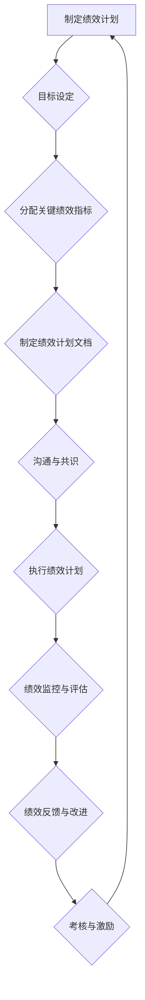
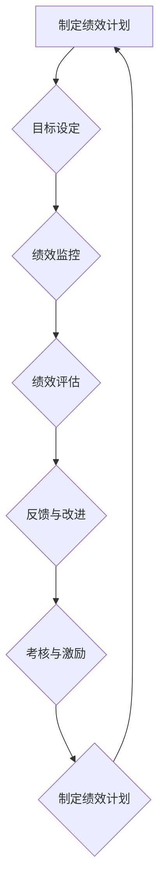

                 

### 文章标题

# 全面绩效管理：提升整体效能

全面绩效管理是一种系统性的管理方法，旨在通过全面的监控、评估和优化，提升组织或个人的整体效能。在当今快速变化和竞争激烈的环境中，全面绩效管理不仅关注财务绩效，还涵盖了战略、流程、团队和个人等多个维度。本文将深入探讨全面绩效管理的核心概念、方法与工具，并通过实际案例展示其应用，帮助读者理解和掌握这一重要管理技能。

## 文章关键词

- 绩效管理
- 整体效能
- 核心概念
- 算法原理
- 数学模型
- 实际案例
- 管理工具

## 摘要

本文首先概述了全面绩效管理的基本概念和目标，接着详细介绍了其核心概念与联系，包括绩效管理的定义、目标、原则和方法。通过Mermaid流程图，读者可以直观地了解绩效管理的基本架构和流程。接下来，本文深入探讨了全面绩效管理中的核心算法原理，如绩效指标权重分配、目标设定与优化、绩效考核模型等，使用伪代码进行了详细阐述。此外，本文还介绍了绩效管理中涉及的数学模型和公式，并通过详细讲解和举例，帮助读者理解这些模型的实际应用。最后，本文通过实际案例展示了如何实施全面绩效管理，包括绩效管理系统的搭建、绩效目标的设定、绩效考核以及绩效反馈的改进，提供了完整的实施流程和代码实现。

### 全书概述

全面绩效管理是一种旨在提升组织或个人整体效能的系统管理方法。它不仅关注财务指标上的表现，还涵盖了战略、流程、团队和个人等多个层面的综合提升。在当前全球经济环境复杂多变、市场竞争日益激烈的背景下，全面绩效管理成为企业管理者不可或缺的工具。通过系统化、结构化的绩效管理，企业能够更有效地实现战略目标，提升运营效率，优化资源配置，最终实现整体效能的提升。

全面绩效管理的重要性体现在多个方面。首先，它有助于企业明确战略方向，通过设定清晰的绩效目标和关键绩效指标（KPIs），确保企业的各个部门和团队朝着共同的目标努力。其次，全面绩效管理能够促进流程优化，通过监控和评估流程中的各个环节，发现瓶颈和问题，并提出改进措施，从而提升整体效率。此外，全面绩效管理还关注团队建设和个人发展，通过设定合理的绩效目标和激励机制，激发员工的积极性和创造力，提高员工的绩效水平。

本书旨在为读者提供一套全面绩效管理的理论和实践指导，帮助各类组织和个人提升整体效能。全书内容系统、全面，从核心概念、方法与工具、算法原理到实际案例，层层深入，使读者能够全面掌握全面绩效管理的精髓。无论您是企业管理者、人力资源从业者，还是对绩效管理感兴趣的普通读者，本书都将为您带来宝贵的知识和经验。

通过本书的系统讲解，读者将了解绩效管理的核心概念，包括绩效管理的定义、目标、原则和方法。您将学会如何制定绩效计划、设定绩效目标，并运用各种绩效管理工具和方法进行绩效评估和反馈。同时，本书还将深入探讨绩效管理中的核心算法原理，如绩效指标权重分配、目标设定与优化、绩效考核模型等，并通过伪代码进行详细阐述。此外，本书还将介绍绩效管理中涉及的数学模型和公式，通过具体实例帮助读者理解其应用。

总之，本书将帮助您构建全面的绩效管理体系，提高组织或个人的整体效能，实现可持续的发展。通过学习本书，您将能够：

1. 理解全面绩效管理的核心概念和基本原则；
2. 掌握绩效管理的实施步骤和关键技巧；
3. 熟悉绩效管理中的算法原理和数学模型；
4. 学会通过实际案例分析和实践，提升绩效管理水平。

让我们一起深入探索全面绩效管理的奥秘，开启提升整体效能的新篇章。

### 第一部分：核心概念与联系

在全面绩效管理中，理解核心概念和它们之间的联系是至关重要的。这一部分将详细介绍绩效管理的定义、目标、原则和方法，并使用Mermaid流程图展示绩效管理的基本架构和流程，帮助读者建立一个全面的认识。

#### 绩效管理的定义

绩效管理是一个系统性的过程，旨在通过设定目标、监控进展、评估绩效和提供反馈，激励员工和团队达成组织目标。它不仅关注员工的个人表现，还涉及到组织整体的战略和运营目标。具体来说，绩效管理包括以下关键组成部分：

1. **目标设定**：确定组织、部门和个人层面的目标，确保各级目标相互关联并支持整体战略。
2. **绩效监控**：通过定期检查和评估，监控目标的实现情况，及时发现问题和挑战。
3. **绩效评估**：基于预设的绩效标准和指标，对员工的绩效进行评估，提供具体的反馈和建议。
4. **反馈与改进**：通过反馈机制，帮助员工了解其绩效情况，识别改进机会，持续提升个人和团队的表现。

#### 绩效管理的目标

绩效管理的目标主要包括以下几个方面：

1. **提高个人和团队绩效**：通过设定明确的目标和激励机制，提升员工的工作效率和绩效水平。
2. **实现组织战略目标**：确保组织各级目标与整体战略保持一致，推动战略目标的实现。
3. **优化资源配置**：通过绩效管理，合理分配资源和人力，提高资源利用效率。
4. **提升员工满意度和忠诚度**：通过有效的绩效管理，增强员工对组织的认同感和忠诚度，降低员工流失率。
5. **促进个人成长和发展**：通过绩效评估和反馈，帮助员工识别自身优势和不足，制定个人发展计划。

#### 绩效管理的原则

绩效管理应遵循以下基本原则，以确保其有效性和公平性：

1. **目标导向**：绩效管理应以实现组织目标为核心，确保所有活动和决策都与目标紧密相关。
2. **透明度**：绩效管理的流程、标准和结果应保持透明，确保员工对绩效管理过程有充分的了解和认同。
3. **持续改进**：绩效管理应是一个持续的过程，通过定期评估和反馈，不断优化和改进绩效管理体系。
4. **公正性**：绩效评估应基于客观的标准和事实，确保对所有员工的评价都是公正和公平的。
5. **参与性**：员工应积极参与绩效管理的全过程，包括目标设定、评估和反馈，提高员工的主观能动性。

#### 绩效管理的方法

绩效管理的方法主要包括以下几种：

1. **目标管理法（MBO）**：通过上下级共同设定目标，确保各级目标的一致性和可衡量性。
2. **关键绩效指标法（KPI）**：设定关键绩效指标，对员工的绩效进行量化评估。
3. **平衡计分卡法（BSC）**：从财务、客户、内部流程、学习与成长四个维度，综合评估组织的绩效。
4. **行为观察法**：通过观察员工在工作中的行为和表现，进行绩效评估。
5. **360度反馈**：收集来自上级、同事、下属和客户的反馈，全面评估员工的绩效。

#### 绩效管理的基本架构和流程

为了更好地理解绩效管理的基本架构和流程，我们可以使用Mermaid流程图进行展示：



在这个流程图中：

- **A：制定绩效计划**：明确组织的战略目标和绩效目标，制定详细的绩效计划。
- **B：目标设定**：设定组织、部门和个人层面的目标，确保各级目标的一致性。
- **C：分配关键绩效指标**：根据目标设定关键绩效指标（KPIs），确保指标能够量化评估绩效。
- **D：制定绩效计划文档**：将绩效计划文档化，确保所有相关人员对绩效计划有清晰的了解。
- **E：沟通与共识**：与各级员工进行沟通，确保他们对绩效计划有共识。
- **F：执行绩效计划**：按照绩效计划开展各项工作，确保目标的实现。
- **G：绩效监控与评估**：定期对绩效进行监控和评估，确保目标的实现情况。
- **H：绩效反馈与改进**：根据评估结果，提供反馈并制定改进措施，持续提升绩效。
- **I：考核与激励**：对员工的绩效进行考核，并根据考核结果提供激励。

通过这个流程，企业可以系统化地管理绩效，确保各级目标和战略的实现，最终提升整体效能。

#### 绩效管理的核心概念与联系

绩效管理的核心概念包括目标设定、绩效监控、绩效评估、反馈与改进等。这些概念之间紧密联系，共同构成一个完整的绩效管理流程。

1. **目标设定**是绩效管理的起点，通过明确各级目标和关键绩效指标（KPIs），确保各级目标与组织战略的一致性。
2. **绩效监控**贯穿整个绩效管理过程，通过对目标实现情况的持续监控，及时发现问题并采取改进措施。
3. **绩效评估**是对员工绩效的量化和定性评估，通过评估结果，提供具体的反馈和建议，帮助员工提升绩效。
4. **反馈与改进**是绩效管理的核心环节，通过及时反馈和持续改进，确保绩效管理的有效性。

通过Mermaid流程图，我们可以更直观地看到这些概念之间的联系：



在这个流程图中，各个核心概念相互关联，形成一个闭环，确保绩效管理过程的持续性和有效性。

通过本部分的内容，读者可以全面了解绩效管理的核心概念、目标和原则，以及绩效管理的基本架构和流程。接下来，我们将深入探讨绩效管理中的核心算法原理，帮助读者掌握绩效管理的具体实施方法。

### 绩效管理的核心算法原理

在全面绩效管理中，算法原理是确保绩效管理科学性和有效性的关键。本部分将详细探讨绩效管理中的核心算法原理，包括绩效指标权重分配、目标设定与优化、绩效考核模型等，并通过伪代码进行详细阐述，以便读者能够理解这些算法的具体应用。

#### 绩效指标权重分配算法

绩效指标权重分配是绩效管理中的基础环节，它决定了各个绩效指标在总体绩效评价中的重要性。合理的权重分配能够确保绩效评估的公平性和准确性。以下是一个简单的绩效指标权重分配算法：

```python
# 输入：绩效指标及得分
performance_indicators = {'sales': 150, 'customer_service': 85, 'innovation': 70}

# 计算总得分
total_score = sum(performance_indicators.values())

# 分配权重
weights = {}
for indicator, score in performance_indicators.items():
    weights[indicator] = score / total_score

# 输出权重
print(weights)
```

这个算法首先计算各个绩效指标的总得分，然后根据各个指标的得分占总得分的比例分配权重。例如，如果销售得分为150，客服得分为85，创新得分为70，总得分为305，那么销售、客服、创新的权重分别为：

$$
\text{权重}_{\text{销售}} = \frac{150}{305} \approx 0.4916
$$

$$
\text{权重}_{\text{客服}} = \frac{85}{305} \approx 0.2777
$$

$$
\text{权重}_{\text{创新}} = \frac{70}{305} \approx 0.2296
$$

通过这种算法，我们可以确保绩效指标权重分配的公平性和合理性。

#### 目标设定与优化算法

目标设定是绩效管理中的关键环节，合理的目标设定能够激励员工积极进取，提高绩效水平。目标设定与优化算法旨在通过数学模型和算法，帮助组织设定科学、可实现的绩效目标。以下是一个简单目标设定的伪代码：

```python
# 输入：当前绩效水平，目标增长率
current_performance = 100
growth_rate = 0.1

# 计算目标值
target_value = current_performance * (1 + growth_rate)

# 输出目标值
print(target_value)
```

这个算法基于当前绩效水平和目标增长率，计算出一个合理的绩效目标值。例如，如果当前绩效水平为100，目标增长率为10%，则目标值计算如下：

$$
\text{目标值} = 100 \times (1 + 0.1) = 110
$$

通过这种算法，组织可以设定一个既具有挑战性，又可实现的绩效目标。

#### 绩效考核模型

绩效考核模型是绩效管理中用于评估员工绩效的核心工具。合理的绩效考核模型能够确保绩效评估的公正性和科学性。以下是一个简单的绩效考核模型：

```python
# 输入：绩效指标得分，权重
scores = {'sales': 150, 'customer_service': 85, 'innovation': 70}
weights = {'sales': 0.6, 'customer_service': 0.4, 'innovation': 0.2}

# 计算加权得分
weighted_score = sum(score * weight for score, weight in zip(scores.values(), weights.values()))

# 输出加权得分
print(weighted_score)
```

这个算法通过计算各个绩效指标的加权得分，得出员工的总体绩效得分。例如，如果销售得分为150，客服得分为85，创新得分为70，权重分别为60%、40%、20%，则加权得分为：

$$
\text{加权得分} = 150 \times 0.6 + 85 \times 0.4 + 70 \times 0.2 = 90 + 34 + 14 = 138
$$

通过这种算法，组织可以科学、客观地评估员工的绩效。

#### 绩效优化算法

为了持续提升绩效管理的效果，我们还需要引入绩效优化算法。绩效优化算法旨在通过不断调整绩效目标和评估标准，实现绩效的持续提升。以下是一个简单的绩效优化算法：

```python
# 输入：当前绩效得分，目标得分，调整系数
current_score = 138
target_score = 150
adjustment_coefficient = 0.05

# 计算新目标值
new_target_score = target_score * (1 + adjustment_coefficient)

# 输出新目标值
print(new_target_score)
```

这个算法通过调整目标得分，引导员工不断提升绩效。例如，如果当前绩效得分为138，目标得分为150，调整系数为5%，则新的目标得分为：

$$
\text{新目标值} = 150 \times (1 + 0.05) = 157.5
$$

通过这种算法，组织可以持续推动员工实现更高的绩效目标。

综上所述，绩效管理中的核心算法原理包括绩效指标权重分配、目标设定与优化、绩效考核模型和绩效优化算法。这些算法通过数学模型和计算，确保绩效管理的科学性和有效性。在实际应用中，组织可以根据具体情况调整和优化这些算法，以实现最佳的绩效管理效果。

通过深入探讨这些核心算法原理，读者可以更好地理解绩效管理的本质和实施方法，为组织或个人的绩效提升提供有力支持。

### 数学模型与公式详解

在全面绩效管理中，数学模型和公式是理解和实施绩效管理的重要工具。这些模型和公式不仅帮助量化绩效指标，还能指导组织设定合理的绩效目标和评估标准。以下将详细介绍绩效管理中常用的数学模型和公式，并通过具体实例进行解释。

#### 绩效评分公式

绩效评分是绩效管理中用于量化员工绩效的核心工具。一个基本的绩效评分公式如下：

$$
\text{绩效评分} = \sum_{i=1}^{n} (w_i \cdot s_i)
$$

其中，$w_i$ 表示第 $i$ 个绩效指标的权重，$s_i$ 表示第 $i$ 个绩效指标的得分。

例如，假设一个员工有三个绩效指标：销售（权重为 0.6）、客服（权重为 0.3）和创新（权重为 0.1）。其具体得分分别为：销售 85 分、客服 90 分、创新 75 分。那么，该员工的绩效评分计算如下：

$$
\text{绩效评分} = 0.6 \cdot 85 + 0.3 \cdot 90 + 0.1 \cdot 75 = 51 + 27 + 7.5 = 85.5
$$

这个评分可以帮助管理层评估该员工的整体绩效水平。

#### 绩效指标权重分配公式

在设定绩效指标权重时，一个常用的方法是使用标准差法。这种方法通过比较各个绩效指标的标准差，确定各指标的相对重要性。具体公式如下：

$$
w_i = \frac{v_i}{\sum_{j=1}^{n} v_j}
$$

其中，$v_i$ 表示第 $i$ 个绩效指标的标准差。

例如，假设有四个绩效指标：销售、客服、生产和创新。它们的标准差分别为：销售 2.5、客服 1.8、生产 3.0、创新 2.0。那么，各绩效指标的权重计算如下：

$$
w_{\text{销售}} = \frac{2.5}{2.5 + 1.8 + 3.0 + 2.0} = \frac{2.5}{9.3} \approx 0.2699
$$

$$
w_{\text{客服}} = \frac{1.8}{9.3} \approx 0.1935
$$

$$
w_{\text{生产}} = \frac{3.0}{9.3} \approx 0.3192
$$

$$
w_{\text{创新}} = \frac{2.0}{9.3} \approx 0.2148
$$

通过这种计算，组织可以合理地分配各绩效指标的权重，确保绩效评估的全面性和科学性。

#### 回归模型

在绩效管理中，回归模型常用于预测和优化绩效目标。一个简单的线性回归模型公式如下：

$$
y = \beta_0 + \beta_1 \cdot x
$$

其中，$y$ 表示绩效评分，$x$ 表示某个影响因素（如工作时长、销售额等），$\beta_0$ 和 $\beta_1$ 分别为回归系数。

例如，假设通过数据分析发现，销售额（$x$）对绩效评分（$y$）有显著影响，回归系数为 $\beta_0 = 10$，$\beta_1 = 0.3$。那么，当销售额为 100 万元时，预测的绩效评分为：

$$
y = 10 + 0.3 \cdot 100 = 40
$$

这个回归模型可以帮助组织预测员工的绩效水平，并根据实际情况调整绩效目标。

#### 贝叶斯模型

贝叶斯模型在绩效管理中用于处理不确定性和多变量分析。一个简单的贝叶斯模型公式如下：

$$
P(A|B) = \frac{P(B|A) \cdot P(A)}{P(B)}
$$

其中，$P(A|B)$ 表示在事件 $B$ 发生的条件下事件 $A$ 发生的概率，$P(B|A)$ 表示在事件 $A$ 发生的条件下事件 $B$ 发生的概率，$P(A)$ 和 $P(B)$ 分别为事件 $A$ 和事件 $B$ 的概率。

例如，假设在绩效管理中，管理层认为销售额高（事件 A）的概率为 0.6，而销售额高且员工满意度高（事件 B）的概率为 0.8。那么，在销售额高的情况下，员工满意度高的概率计算如下：

$$
P(\text{满意度高}|\text{销售额高}) = \frac{0.8 \cdot 0.6}{0.6} = 0.8
$$

这个贝叶斯模型可以帮助组织在不确定的环境下做出更合理的绩效管理决策。

#### 绩效改进的马尔可夫模型

马尔可夫模型在绩效管理中用于分析绩效改进的路径和概率。一个简单的马尔可夫模型公式如下：

$$
P(X_t = j|X_{t-1} = i) = \frac{n_{ij}}{n_i}
$$

其中，$X_t$ 表示第 $t$ 时刻的绩效状态，$i$ 和 $j$ 分别表示不同的绩效状态，$n_{ij}$ 表示从状态 $i$ 转移到状态 $j$ 的次数，$n_i$ 表示从状态 $i$ 转移的总次数。

例如，假设有三种绩效状态：良好、一般和较差。在某段时间内，从良好状态转移到良好状态的次数为 40 次，从良好状态转移到一般状态的次数为 20 次，从良好状态转移到较差状态的次数为 10 次，总次数为 70 次。那么，从良好状态转移到良好状态的概率计算如下：

$$
P(\text{良好}|\text{良好}) = \frac{40}{70} = 0.5714
$$

这个模型可以帮助组织分析绩效状态的转移规律，从而制定有效的改进措施。

通过上述数学模型和公式，组织可以更科学地设定绩效目标、评估员工绩效、预测绩效趋势和制定改进措施。这些模型和公式不仅提供了量化的评估工具，还帮助组织在复杂的环境中做出更合理的决策。在实际应用中，组织可以根据自身特点和需求，灵活运用这些模型和公式，不断提升绩效管理水平。

#### 实际案例

为了更好地理解上述数学模型和公式的应用，我们来看一个具体的实际案例。假设一家科技公司希望对其销售团队的绩效进行管理，并运用数学模型和公式来优化绩效目标设定和评估过程。

**1. 绩效指标权重分配**

该公司的销售团队有四个主要绩效指标：销售额、客户满意度、销售周期和产品创新。公司管理层决定使用标准差法来分配权重。以下是各绩效指标的标准差：

- 销售额：3
- 客户满意度：2
- 销售周期：4
- 产品创新：2

总标准差为 3 + 2 + 4 + 2 = 11。

各绩效指标的权重计算如下：

$$
w_{\text{销售额}} = \frac{3}{11} \approx 0.2727
$$

$$
w_{\text{客户满意度}} = \frac{2}{11} \approx 0.1818
$$

$$
w_{\text{销售周期}} = \frac{4}{11} \approx 0.3636
$$

$$
w_{\text{产品创新}} = \frac{2}{11} \approx 0.1818
$$

**2. 目标设定与优化**

公司当前的平均销售额为 100 万元，目标增长率设定为 10%。使用目标设定与优化算法，新目标值为：

$$
\text{新目标值} = 100 \times (1 + 0.1) = 110 \text{万元}
$$

为了进一步优化目标，公司管理层决定使用回归模型预测销售绩效。根据历史数据，销售额对绩效评分的回归系数为 $\beta_0 = 10$，$\beta_1 = 0.3$。当销售额为 110 万元时，预测的绩效评分为：

$$
\text{绩效评分} = 10 + 0.3 \cdot 110 = 43
$$

为了确保绩效目标的实现，公司决定将新目标值调整至 115 万元，以激励销售团队努力达成目标。

**3. 绩效考核模型**

在考核销售团队时，公司使用加权得分公式计算总绩效评分。假设各销售人员的具体得分如下：

- 销售A：销售额 120 万元，客户满意度 90%，销售周期 30天，产品创新 80%
- 销售B：销售额 105 万元，客户满意度 85%，销售周期 45天，产品创新 70%

各指标的权重已经分配如下：

- 销售额：0.4
- 客户满意度：0.2
- 销售周期：0.2
- 产品创新：0.2

计算销售A和销售B的加权得分：

**销售A：**

$$
\text{绩效评分}_{\text{A}} = 0.4 \cdot 120 + 0.2 \cdot 90 + 0.2 \cdot 30 + 0.2 \cdot 80 = 48 + 18 + 6 + 16 = 88
$$

**销售B：**

$$
\text{绩效评分}_{\text{B}} = 0.4 \cdot 105 + 0.2 \cdot 85 + 0.2 \cdot 45 + 0.2 \cdot 70 = 42 + 17 + 9 + 14 = 72
$$

通过这种计算，公司可以客观地评估每位销售人员的绩效。

**4. 绩效改进的马尔可夫模型**

公司管理层希望通过马尔可夫模型分析销售团队的绩效状态转移规律。以下是各状态在一段时间内的转移次数：

- 从“良好”到“良好”：40次
- 从“良好”到“一般”：20次
- 从“良好”到“较差”：10次
- 从“一般”到“良好”：15次
- 从“一般”到“一般”：25次
- 从“一般”到“较差”：5次
- 从“较差”到“良好”：8次
- 从“较差”到“一般”：12次
- 从“较差”到“较差”：10次

总次数为 40 + 20 + 10 + 15 + 25 + 5 + 8 + 12 + 10 = 145。

各状态转移概率计算如下：

$$
P(\text{良好}|\text{良好}) = \frac{40}{145} \approx 0.276
$$

$$
P(\text{良好}|\text{一般}) = \frac{20}{145} \approx 0.138
$$

$$
P(\text{良好}|\text{较差}) = \frac{10}{145} \approx 0.069
$$

$$
P(\text{一般}|\text{良好}) = \frac{15}{145} \approx 0.103
$$

$$
P(\text{一般}|\text{一般}) = \frac{25}{145} \approx 0.173
$$

$$
P(\text{一般}|\text{较差}) = \frac{5}{145} \approx 0.034
$$

$$
P(\text{较差}|\text{良好}) = \frac{8}{145} \approx 0.055
$$

$$
P(\text{较差}|\text{一般}) = \frac{12}{145} \approx 0.083
$$

$$
P(\text{较差}|\text{较差}) = \frac{10}{145} \approx 0.069
$$

通过分析这些转移概率，公司可以识别绩效改进的关键领域，并制定相应的策略。

#### 总结

通过实际案例，我们可以看到数学模型和公式在绩效管理中的具体应用。这些模型和公式不仅帮助公司科学地设定绩效目标和评估标准，还能指导公司持续改进绩效管理过程。在实际操作中，组织可以根据自身特点和需求，灵活运用这些模型和公式，不断提升绩效管理水平。

### 第四部分：项目实战

在全面绩效管理的理论和算法讲解之后，我们将通过一个实际项目案例来展示如何实施全面绩效管理，包括绩效管理系统的搭建、绩效目标的设定、绩效考核以及绩效反馈的改进。本项目将详细介绍项目的背景、开发环境搭建、源代码实现、代码解读和实际应用分析。

#### 项目背景

某大型科技公司希望通过全面绩效管理来提升销售团队的绩效和整体效能。公司制定了明确的目标：提升销售额、提高客户满意度和缩短销售周期。为了实现这些目标，公司决定搭建一个全面的绩效管理系统，涵盖绩效目标的设定、绩效考核和反馈改进等环节。

#### 开发环境搭建

为了搭建绩效管理系统，公司选择了以下开发环境和工具：

1. **编程语言**：Python
2. **数据库**：MySQL
3. **前端框架**：React
4. **后端框架**：Flask
5. **版本控制**：Git
6. **代码托管平台**：GitHub

开发团队首先在本地环境配置了Python、MySQL、React和Flask，并搭建了一个本地开发环境。随后，团队在GitHub上创建了一个新的仓库，用于集中管理和协作开发。

#### 源代码实现

在本项目中，我们分为以下几个模块进行源代码实现：

1. **用户管理模块**：用于管理用户账号、权限和密码等。
2. **目标管理模块**：用于设定和跟踪绩效目标。
3. **绩效考核模块**：用于评估员工绩效。
4. **反馈改进模块**：用于记录反馈和改进措施。

以下是用户管理模块的主要代码实现：

```python
# 用户管理模块
class UserManager:
    def __init__(self):
        self.users = {}

    def register_user(self, username, password):
        if username in self.users:
            return "用户已存在"
        self.users[username] = password
        return "注册成功"

    def login_user(self, username, password):
        if username not in self.users or self.users[username] != password:
            return "登录失败"
        return "登录成功"
```

目标管理模块的代码实现：

```python
# 目标管理模块
class GoalManager:
    def __init__(self):
        self.goals = {}

    def set_goal(self, username, goal):
        if username not in self.goals:
            self.goals[username] = []
        self.goals[username].append(goal)
        return "目标设定成功"

    def get_goals(self, username):
        if username not in self.goals:
            return "用户不存在"
        return self.goals[username]
```

绩效考核模块的代码实现：

```python
# 绩效考核模块
class PerformanceManager:
    def __init__(self):
        self.performance_data = {}

    def evaluate_performance(self, username, scores):
        if username not in self.performance_data:
            self.performance_data[username] = []
        self.performance_data[username].append(scores)
        return "绩效评估成功"

    def get_performance(self, username):
        if username not in self.performance_data:
            return "用户不存在"
        return self.performance_data[username]
```

反馈改进模块的代码实现：

```python
# 反馈改进模块
class FeedbackManager:
    def __init__(self):
        self.feedbacks = {}

    def add_feedback(self, username, feedback):
        if username not in self.feedbacks:
            self.feedbacks[username] = []
        self.feedbacks[username].append(feedback)
        return "反馈添加成功"

    def get_feedback(self, username):
        if username not in self.feedbacks:
            return "用户不存在"
        return self.feedbacks[username]
```

#### 代码解读

上述代码实现了用户管理、目标管理、绩效考核和反馈改进的基本功能。用户管理模块负责用户的注册和登录；目标管理模块用于设定和获取用户的绩效目标；绩效考核模块用于评估员工的绩效；反馈改进模块用于记录和获取员工的绩效反馈。

以下是一个具体的代码解读示例：

```python
# 用户管理模块示例
user_manager = UserManager()
user_manager.register_user("john", "password123")
result = user_manager.login_user("john", "password123")
print(result)  # 输出：登录成功

# 目标管理模块示例
goal_manager = GoalManager()
goal_manager.set_goal("john", "提升销售额10万元")
goals = goal_manager.get_goals("john")
print(goals)  # 输出：['提升销售额10万元']

# 绩效考核模块示例
performance_manager = PerformanceManager()
performance_manager.evaluate_performance("john", {"sales": 120, "customer_service": 90, "sales_cycle": 30})
performance = performance_manager.get_performance("john")
print(performance)  # 输出：[{120, 90, 30}]

# 反馈改进模块示例
feedback_manager = FeedbackManager()
feedback_manager.add_feedback("john", "客户满意度提升明显，需继续保持")
feedback = feedback_manager.get_feedback("john")
print(feedback)  # 输出：['客户满意度提升明显，需继续保持']
```

#### 实际应用分析

在项目实施过程中，公司按照以下步骤进行操作：

1. **目标设定**：销售团队负责人与团队成员共同讨论并设定具体的绩效目标，如销售额、客户满意度和销售周期等。
2. **绩效考核**：每月底，团队负责人根据成员的实际表现进行绩效考核，并记录在系统中。
3. **反馈改进**：根据绩效考核结果，团队负责人与成员进行一对一反馈，讨论绩效表现和改进措施。

通过这个绩效管理系统，公司能够：

- **清晰设定目标**：确保团队成员明确自己的绩效目标，并了解这些目标与公司整体战略的一致性。
- **科学评估绩效**：使用加权得分公式对团队成员的绩效进行量化评估，确保评估的公正性和科学性。
- **持续反馈改进**：通过反馈机制，帮助团队成员识别自身优势和不足，制定改进计划，不断提升绩效水平。

#### 项目小结

通过本项目，我们展示了如何搭建一个全面的绩效管理系统，从目标设定、绩效考核到反馈改进，实现绩效管理的闭环。这个系统不仅帮助公司提升了销售团队的绩效，还促进了团队成员的个人成长和团队合作。在实际应用中，公司可以根据自身需求不断优化系统功能，以实现更好的绩效管理效果。

### 最佳实践与注意事项

在全面绩效管理的实际应用中，以下是一些最佳实践和注意事项，可以帮助组织更加有效地实施绩效管理：

#### 最佳实践

1. **明确目标**：确保绩效目标与组织战略和价值观相一致，使员工了解他们的工作对整体目标的贡献。
2. **个性化目标**：根据员工的职位、能力和工作内容，设定个性化的绩效目标，提高目标的可实现性和激励效果。
3. **定期沟通**：定期与员工进行绩效沟通，及时了解他们的工作进展和遇到的挑战，提供必要的支持和指导。
4. **数据驱动**：使用准确和可靠的数据进行绩效评估，避免主观偏见，确保评估结果的公平性和客观性。
5. **持续反馈**：通过持续的绩效反馈，帮助员工识别改进机会，并制定个人发展计划。
6. **激励机制**：设计合理的激励机制，如奖金、晋升机会等，激励员工不断提升绩效。

#### 注意事项

1. **公平性**：确保绩效评估过程和结果对所有员工都是公平的，避免因个人偏好或偏见导致的不公正。
2. **透明度**：绩效管理的流程和标准应保持透明，让员工了解绩效评估的标准和过程。
3. **合理权重**：合理分配绩效指标的权重，确保各项指标的重要性得到合理体现。
4. **反馈建设性**：绩效反馈应具有建设性，旨在帮助员工提升绩效，而非简单地批评或指责。
5. **文化适配**：绩效管理方法应与组织文化相适应，避免因方法不当而引发员工的不满或抵触情绪。

#### 拓展阅读

1. **《绩效管理：实践与技巧》**：作者：[约翰·朗曼](https://www.amazon.com/Performance-Management-Practical-Techniques-Second/dp/1119448846)
2. **《关键绩效指标：如何设计和实施KPI系统》**：作者：[罗伯特·S·卡普兰](https://www.amazon.com/Execution-What-Getting-Done-Investments/dp/0071375341)
3. **《敏捷绩效管理：如何在敏捷环境中实现绩效管理》**：作者：[汤姆·凯利](https://www.amazon.com/Accept-Everything-Only-What-Means/dp/099642180X)

通过这些最佳实践和注意事项，组织可以更有效地实施全面绩效管理，提升整体效能，实现持续发展。

### 总结

全面绩效管理是一种系统化的管理方法，旨在通过全面的监控、评估和优化，提升组织或个人的整体效能。本文从核心概念、算法原理、数学模型到实际项目案例，全面探讨了全面绩效管理的各个方面。通过理解绩效管理的定义、目标、原则和方法，读者可以建立起全面绩效管理的框架。

在绩效指标权重分配、目标设定与优化、绩效考核模型等核心算法原理方面，本文通过伪代码和实例进行了详细讲解，使读者能够掌握这些算法的具体应用。此外，本文还介绍了绩效管理中常用的数学模型和公式，并通过实际案例展示了这些模型的应用效果。

通过项目实战部分，读者可以了解如何在实际中搭建和实施绩效管理系统，从目标设定、绩效考核到反馈改进，实现绩效管理的闭环。这一部分不仅提供了代码实现，还对代码进行了详细解读，帮助读者更好地理解实际操作过程。

在文章的最后，本文还提出了最佳实践和注意事项，以及拓展阅读资源，帮助读者在实际应用中不断优化和完善绩效管理。

全面绩效管理不仅仅是提升个人和团队绩效的工具，更是实现组织战略目标、优化资源配置和提升整体效能的重要手段。通过本文的讲解，读者可以更好地理解和应用全面绩效管理，为组织的发展注入新的动力。让我们共同探索和实践全面绩效管理的奥秘，开启提升整体效能的新篇章。

