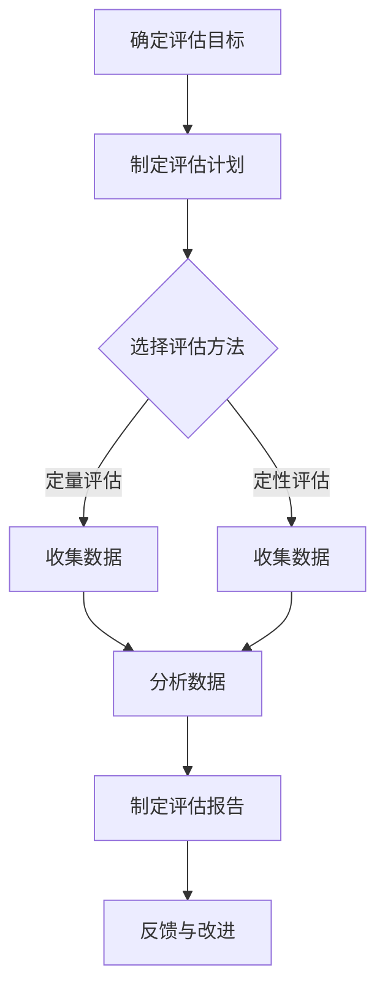

                 


### 设计的文章目录大纲：

#### # 公正的绩效评估：客观评价团队

##### > 关键词：绩效评估、客观评价、团队、公正性、评估标准、实践案例

##### > 摘要：本文将探讨如何进行公正的绩效评估，以客观评价团队成员的表现。我们将分析绩效评估的背景与理论基础，阐述公正评估的重要性。接下来，我们将详细介绍绩效评估的实施流程，包括目标确定、方法选择、过程管理以及反馈与改进。同时，我们将通过实际案例，展示如何构建和执行有效的绩效评估体系。最后，我们将讨论绩效评估面临的挑战，并提出相应的应对策略。通过本文的探讨，希望能够为企业在绩效评估方面提供一些实用的指导和建议。

---

#### 第一部分：绩效评估的背景与理论基础

##### ### 1.1 绩效评估的重要性

##### > **1.1.1 绩效评估的起源与发展**

- **起源**：绩效评估的概念最早可以追溯到20世纪初期。泰勒（Frederick Taylor）的科学管理理论提出了通过工作分析和时间研究来评估员工的工作效率。随着企业管理的不断发展，绩效评估逐渐成为一种重要的管理工具。

- **发展**：20世纪50年代，行为科学运动推动了绩效评估的发展。管理者开始关注员工的行为和态度，而不仅仅是工作成果。随后，目标管理理论（Management by Objectives, MBO）的出现，使得绩效评估更加注重目标和结果的达成。

##### **1.1.2 绩效评估在企业中的应用**

- **人力资源决策**：绩效评估是企业进行员工选拔、晋升、培训和薪酬管理的重要依据。通过评估员工的工作表现，企业能够更准确地识别员工的潜力和问题，从而做出更加科学的人力资源决策。

- **管理沟通**：绩效评估是企业管理层与员工之间沟通的重要渠道。通过评估结果的反馈，管理层可以与员工共同探讨工作改进的方向，增强双方的信任和合作。

- **团队建设**：公正的绩效评估能够激励团队成员努力工作，提高团队的凝聚力和绩效。通过评估，团队中的优秀成员能够得到认可和奖励，激发其他成员的竞争意识和积极性。

### **1.2 绩效评估的理论基础**

##### **1.2.1 目标管理理论**

- **基本概念**：目标管理理论认为，通过设定明确的目标，员工能够更好地理解自己的工作职责，提高工作效率。绩效评估的目标是衡量员工目标的实现程度。

- **关键要素**：目标管理理论强调目标的明确性、挑战性和可实现性。评估时，需要关注员工是否按照既定的目标进行了努力，是否达成了预期的结果。

##### **1.2.2 过程导向理论**

- **基本概念**：过程导向理论认为，绩效评估不仅要关注结果，还要关注达成结果的过程。这一理论强调员工的工作态度、工作方法和团队合作。

- **关键要素**：过程导向理论关注员工在工作中的行为表现，包括时间管理、资源利用、解决问题和创新能力等。评估时，需要综合考虑员工在过程中的表现，而不仅仅是结果。

##### **1.2.3 结果导向理论**

- **基本概念**：结果导向理论认为，绩效评估的核心是衡量员工的工作成果。这一理论强调员工的产出和贡献，认为绩效是员工能力的直接体现。

- **关键要素**：结果导向理论强调绩效的量化性，通过具体的指标和数据来衡量员工的工作成果。评估时，需要关注员工在绩效指标上的表现，以及目标的达成情况。

### **1.3 公正的绩效评估标准**

##### **1.3.1 客观性标准**

- **基本概念**：客观性标准要求绩效评估结果基于事实和数据，避免主观臆断。客观性是公正评估的基础。

- **关键要素**：客观性标准强调评估数据的准确性和可靠性。评估时，需要收集和分析客观的绩效数据，避免主观判断和偏见。

##### **1.3.2 公平性标准**

- **基本概念**：公平性标准要求绩效评估对所有员工一视同仁，不偏袒任何一方。公平性是建立信任和团队和谐的重要保障。

- **关键要素**：公平性标准强调评估过程的透明度和公正性。评估时，需要确保评估标准的公平性和一致性，避免偏袒和歧视。

##### **1.3.3 可比性标准**

- **基本概念**：可比性标准要求绩效评估结果具有可比性，便于比较不同员工之间的表现。可比性是优化绩效评估体系的重要指标。

- **关键要素**：可比性标准强调评估指标的统一性和标准化。评估时，需要确保评估指标在不同员工之间具有可比性，以便更准确地衡量员工的工作表现。

#### 第二部分：绩效评估的实施与流程

##### **2.1 绩效评估的目标确定**

##### **2.1.1 明确评估目标**

- **基本概念**：明确评估目标是绩效评估的首要步骤。评估目标决定了评估的重点和方向。

- **关键要素**：明确评估目标需要考虑组织的战略目标和业务需求。评估目标应具体、可衡量，并且具有挑战性。

##### **2.1.2 确定关键绩效指标**

- **基本概念**：关键绩效指标（Key Performance Indicators, KPI）是衡量工作成果的重要工具。

- **关键要素**：确定关键绩效指标需要基于评估目标和业务需求，选择能够反映员工工作绩效的核心指标。这些指标应具有可量化性和可控性。

##### **2.2 绩效评估的方法与工具**

##### **2.2.1 自评与他评**

- **基本概念**：自评是他评是绩效评估的两种主要方法。自评强调员工的自我反思和自我提升，他评则依赖于上级或同事的评价。

- **关键要素**：自评与他评的平衡是确保评估公正性的关键。评估时，需要综合考虑自评和他评的结果，避免偏颇。

##### **2.2.2 定量评估与定性评估**

- **基本概念**：定量评估是基于数据和分析的评估方法，定性评估则侧重于主观感受和描述。

- **关键要素**：定量评估与定性评估的结合能够提供更全面的绩效评估结果。评估时，需要根据具体情况选择合适的评估方法。

##### **2.2.3 360度评估**

- **基本概念**：360度评估是一种多维度评估方法，包括员工自评、上级评价、同事评价和下属评价。

- **关键要素**：360度评估能够提供全方位的反馈，有助于全面了解员工的工作表现。评估时，需要确保评估过程的公正和透明。

##### **2.3 绩效评估的过程管理**

##### **2.3.1 制定评估计划**

- **基本概念**：制定评估计划是确保绩效评估顺利实施的关键步骤。

- **关键要素**：评估计划应包括评估目标、评估方法、评估时间表和评估参与者等。评估计划应具有可行性和灵活性。

##### **2.3.2 收集评估数据**

- **基本概念**：收集评估数据是绩效评估的核心步骤。评估数据的准确性和完整性直接影响评估结果。

- **关键要素**：收集评估数据需要选择合适的数据收集方法，如问卷、访谈、观察等。评估数据应具有代表性和可靠性。

##### **2.3.3 分析评估结果**

- **基本概念**：分析评估结果是绩效评估的重要环节。分析结果能够为员工提供具体的反馈，为组织提供决策依据。

- **关键要素**：分析评估结果需要采用科学的方法和工具，如统计分析、趋势分析等。分析结果应具有针对性和实用性。

##### **2.3.4 反馈与改进**

- **基本概念**：反馈与改进是绩效评估的最终目的。通过反馈，员工能够了解自己的工作表现，组织能够发现存在的问题并加以改进。

- **关键要素**：反馈与改进需要建立有效的沟通渠道和机制，确保反馈的及时性和有效性。改进措施应具体、可行，并能够促进员工的成长和发展。

#### 第三部分：公正的绩效评估实践案例

##### **3.1 案例一：某互联网公司的绩效评估实践**

##### **3.1.1 企业背景**

- **企业简介**：某互联网公司是一家专注于移动互联网业务的高科技公司。公司员工规模超过1000人，业务涵盖了社交、电商、游戏等多个领域。

- **业务特点**：互联网公司的业务发展迅速，员工的工作方式多样，创新和团队协作至关重要。

##### **3.1.2 绩效评估体系的构建**

- **评估目标**：公司希望通过绩效评估激发员工的积极性，提高团队的整体绩效，同时为员工的职业发展提供指导。

- **评估方法**：公司采用了360度评估方法，包括员工自评、上级评价、同事评价和下属评价。同时，公司还使用了关键绩效指标（KPI）进行定量评估。

##### **3.1.3 绩效评估的执行过程**

- **评估计划**：公司每年进行两次绩效评估，分别在上半年和下半年。每次评估前，公司会制定详细的评估计划，明确评估目标、方法和时间表。

- **数据收集**：评估过程中，公司使用了在线问卷、访谈和观察等多种方式收集评估数据。评估数据包括员工的工作成果、行为表现和工作态度等。

- **数据分析**：公司对收集到的评估数据进行了统计分析，包括平均值、标准差和相关性分析等。通过数据分析，公司能够全面了解员工的工作表现。

##### **3.1.4 绩效评估的成效分析**

- **员工满意度**：通过绩效评估，员工的满意度得到了显著提升。员工表示，评估结果为他们提供了明确的反馈，有助于他们了解自己的优势和不足。

- **团队绩效**：绩效评估促进了团队协作和创新能力。公司整体绩效指标（如销售额、客户满意度等）持续提升。

- **职业发展**：绩效评估为员工的职业发展提供了指导。通过评估结果，员工能够明确自己的职业发展方向，并得到相应的培训和指导。

##### **3.2 案例二：某制造企业的绩效评估实践**

##### **3.2.1 企业背景**

- **企业简介**：某制造企业是一家大型制造业公司，拥有员工约5000人。公司主要从事机械设备的制造和销售。

- **业务特点**：制造企业的业务流程复杂，生产效率和质量控制至关重要。

##### **3.2.2 绩效评估体系的构建**

- **评估目标**：公司希望通过绩效评估提高员工的生产效率和工作质量，同时提升企业的整体竞争力。

- **评估方法**：公司采用了过程导向理论，主要关注员工的工作过程和结果。评估方法包括定量评估和定性评估相结合。

##### **3.2.3 绩效评估的执行过程**

- **评估计划**：公司每年进行一次绩效评估，评估前会制定详细的计划，包括评估目标、方法和时间安排。

- **数据收集**：评估过程中，公司使用了生产数据统计、员工行为记录和客户反馈等多种方式收集评估数据。

- **数据分析**：公司对收集到的评估数据进行了详细分析，包括生产效率指标、产品质量指标和工作态度指标等。

##### **3.2.4 绩效评估的成效分析**

- **生产效率**：通过绩效评估，员工的生产效率得到了显著提高。公司整体的生产效率指标持续提升。

- **产品质量**：绩效评估提高了员工对产品质量的重视程度。公司产品质量指标得到显著改善，客户满意度提升。

- **团队合作**：绩效评估促进了团队合作和协作。员工在评估过程中能够更好地理解自己的工作职责和团队目标，提高了团队的整体绩效。

#### 第四部分：绩效评估的挑战与应对策略

##### **4.1 绩效评估中的常见问题**

##### **4.1.1 主观性偏差**

- **问题描述**：绩效评估过程中，评估者可能会受到个人偏见和主观判断的影响，导致评估结果不准确。

- **原因分析**：主观性偏差可能源于评估者的个人偏好、对员工的了解不足或评估标准的模糊性。

- **解决方案**：为了减少主观性偏差，可以采用多维度评估方法，如360度评估，确保评估结果更全面和客观。同时，明确评估标准和流程，提高评估者的培训水平。

##### **4.1.2 欺诈行为**

- **问题描述**：绩效评估过程中，员工可能会采取不正当手段来获取更好的评估结果，如虚报数据、勾结评估者等。

- **原因分析**：欺诈行为可能源于评估结果与员工利益密切相关，如奖金、晋升等。此外，评估过程的透明度和公正性不足也可能导致欺诈行为。

- **解决方案**：建立严格的评估制度和监督机制，加强对评估过程的监督和审计。同时，提高员工的法律意识和道德素质，增强对欺诈行为的威慑力。

##### **4.1.3 沟通障碍**

- **问题描述**：绩效评估过程中，评估者与员工之间的沟通不畅，可能导致评估结果不准确或员工无法接受评估结果。

- **原因分析**：沟通障碍可能源于评估者的沟通技巧不足、员工对评估过程的不理解或评估结果反馈不及时。

- **解决方案**：加强评估者和员工之间的沟通，确保评估过程的透明和公开。提供培训，提高评估者的沟通技巧，同时鼓励员工积极参与评估过程。

##### **4.2 应对策略**

##### **4.2.1 提高评估者的能力**

- **策略描述**：为了提高评估者的能力，可以采取以下措施：

  - 加强评估者的培训和指导，提高他们的评估技能和知识水平。

  - 定期对评估者进行评估，评估他们的评估能力和效果。

  - 建立评估者的评价体系，激励他们不断提升评估能力。

##### **4.2.2 建立完善的评估体系**

- **策略描述**：建立完善的评估体系是确保绩效评估公正和有效的重要保障。可以采取以下措施：

  - 制定明确的评估标准和流程，确保评估过程的规范和透明。

  - 设计科学合理的评估指标体系，确保评估结果的可比性和准确性。

  - 建立评估结果的反馈机制，及时向员工提供评估结果，并给予相应的指导和帮助。

##### **4.2.3 加强绩效反馈与沟通**

- **策略描述**：加强绩效反馈与沟通是确保绩效评估结果得到有效应用的关键。可以采取以下措施：

  - 建立定期的绩效反馈会议，评估者与员工面对面交流，讨论评估结果和改进措施。

  - 提供个性化的绩效改进建议，帮助员工制定个人发展计划。

  - 建立有效的沟通渠道，鼓励员工提出问题和建议，促进双方的沟通和理解。

#### 第五部分：未来展望

##### **5.1 绩效评估的发展趋势**

##### **5.1.1 技术驱动**

- **趋势描述**：随着人工智能和大数据技术的发展，绩效评估正在向技术驱动的方向发展。通过分析大数据和机器学习算法，绩效评估能够更精确地识别员工的绩效表现和潜力。

- **影响分析**：技术驱动将提高绩效评估的准确性和效率，减少人为干预，确保评估结果的公正性。同时，技术驱动也将推动绩效评估体系的智能化和自动化。

##### **5.1.2 人本化**

- **趋势描述**：人本化是绩效评估的发展方向之一。绩效评估不再仅仅关注工作成果和效率，更加注重员工的工作体验和幸福感。

- **影响分析**：人本化将提高员工的满意度和忠诚度，增强团队的凝聚力和创造力。同时，人本化也将推动绩效评估从单一指标向多元维度发展。

##### **5.1.3 数据驱动**

- **趋势描述**：数据驱动是当前绩效评估的重要趋势。通过收集和分析大量的绩效数据，绩效评估能够更全面地了解员工的工作表现。

- **影响分析**：数据驱动将提高绩效评估的客观性和科学性，减少主观判断和偏见。同时，数据驱动也将促进绩效评估的数据化和量化，提高评估的准确性和可操作性。

##### **5.2 绩效评估的未来方向**

##### **5.2.1 智能化**

- **方向描述**：智能化是绩效评估的未来方向之一。通过引入人工智能和机器学习技术，绩效评估能够实现自动化和智能化，提高评估的效率和准确性。

- **影响分析**：智能化将改变绩效评估的传统模式，使评估过程更加高效和灵活。同时，智能化也将推动绩效评估的数据化和智能化，提高评估的科学性和可靠性。

##### **5.2.2 个性化**

- **方向描述**：个性化是绩效评估的未来方向之一。绩效评估将更加关注员工的个性化需求和特点，为员工提供更加个性化的评估和反馈。

- **影响分析**：个性化将提高员工的满意度和参与度，增强员工的积极性和创造力。同时，个性化也将推动绩效评估的多样化和灵活性，提高评估的有效性和针对性。

##### **5.2.3 系统化**

- **方向描述**：系统化是绩效评估的未来方向之一。绩效评估将更加注重系统性和综合性，实现绩效评估与组织战略、人力资源管理的深度融合。

- **影响分析**：系统化将提高绩效评估的全面性和系统性，确保评估结果与组织目标和人力资源管理策略相一致。同时，系统化也将推动绩效评估的规范化和发展。

### 附录

##### **附录一：绩效评估相关文献推荐**

- **泰勒，《科学管理原理》**
- **德鲁克，《管理的实践》**
- **彼得·德鲁克，《目标管理》**
- **罗伯特·凯尔，《绩效评估与员工激励》**
- **约翰·瑞丁，《评估与反馈的艺术》**

##### **附录二：绩效评估工具与资源推荐**

- **绩效评估工具**：
  - **KPI数据库**
  - **绩效评估模板**
  - **360度评估工具**
- **在线资源**：
  - **绩效评估在线课程**
  - **绩效评估论坛**
  - **绩效评估专家博客**

##### **附录三：绩效评估案例参考书目**

- **《互联网公司的绩效管理实践》**
- **《制造业绩效评估案例分析》**
- **《绩效评估与组织发展》**
- **《绩效管理实战》**

# 绩效评估流程 Mermaid 流程图



# 绩效评估算法原理伪代码

```python
# 绩效评估算法原理伪代码

# 输入：员工绩效数据，评估标准
# 输出：绩效评估结果

function performance_evaluation(performance_data, evaluation_standards):
    # 初始化绩效评估结果
    evaluation_results = []

    # 遍历每个员工的数据
    for employee_data in performance_data:
        # 计算员工绩效得分
        score = 0
        for key, value in employee_data.items():
            if key in evaluation_standards:
                score += evaluation_standards[key] * value

        # 添加绩效评估结果
        evaluation_results.append(score)

    # 返回绩效评估结果
    return evaluation_results
```

# 绩效评估数学模型讲解

#### **1. 数学模型基本概念**

- **绩效评估模型**：绩效评估模型是用来衡量员工工作绩效的数学模型。它通过设定评估指标、权重和计算方法，对员工的工作表现进行量化评估。

- **关键绩效指标（KPI）**：KPI是绩效评估模型中的核心指标，用于衡量员工在工作中的关键绩效。KPI应具有可量化性、可操作性和重要性。

- **权重分配**：权重分配是绩效评估模型中的重要环节，它决定了每个KPI在总体绩效中的重要性。权重的设定应基于业务需求和员工职责。

#### **2. 数学模型构建**

- **假设条件**：假设有n个员工，每个员工有m个关键绩效指标（KPI），评估标准为W={w1, w2, ..., wm}，其中wi表示第i个KPI的权重。员工i的绩效数据为Di={di1, di2, ..., dim}，其中di j表示员工i在第j个KPI上的得分。

- **绩效得分计算**：绩效得分（Si）可以通过以下公式计算：

  $$ S_i = \sum_{j=1}^{m} w_j \cdot d_{ij} $$

  其中，$w_j$表示第j个KPI的权重，$d_{ij}$表示员工i在第j个KPI上的得分。

- **总绩效排名**：根据绩效得分，可以计算每个员工的绩效排名，公式如下：

  $$ R_i = \sum_{j=1}^{m} w_j \cdot d_{ij} $$

  其中，$R_i$表示员工i的总绩效得分。

#### **3. 数学公式与解释**

- **权重分配公式**：权重分配可以通过业务需求分析确定，通常使用以下公式：

  $$ w_j = \frac{P_j}{\sum_{k=1}^{m} P_k} $$

  其中，$P_j$表示第j个KPI的重要程度。

- **绩效得分公式**：绩效得分可以通过以下公式计算：

  $$ S_i = \sum_{j=1}^{m} w_j \cdot d_{ij} $$

  其中，$S_i$表示员工i的总绩效得分，$w_j$表示第j个KPI的权重，$d_{ij}$表示员工i在第j个KPI上的得分。

- **总绩效排名公式**：总绩效排名可以通过以下公式计算：

  $$ R_i = \sum_{j=1}^{m} w_j \cdot d_{ij} $$

  其中，$R_i$表示员工i的总绩效得分，$w_j$表示第j个KPI的权重，$d_{ij}$表示员工i在第j个KPI上的得分。

#### **4. 举例说明**

假设有3个员工，每个员工有3个关键绩效指标（KPI）。评估标准为权重分配如下：

$$ W = \{0.3, 0.3, 0.4\} $$

员工1的绩效数据为：

$$ D_1 = \{8, 7, 9\} $$

员工2的绩效数据为：

$$ D_2 = \{7, 8, 8\} $$

员工3的绩效数据为：

$$ D_3 = \{9, 9, 7\} $$

根据上述数据和权重，可以计算每个员工的绩效得分和总绩效排名：

- **员工1**：

  $$ S_1 = 0.3 \cdot 8 + 0.3 \cdot 7 + 0.4 \cdot 9 = 7.7 $$

  $$ R_1 = 7.7 $$

- **员工2**：

  $$ S_2 = 0.3 \cdot 7 + 0.3 \cdot 8 + 0.4 \cdot 8 = 7.8 $$

  $$ R_2 = 7.8 $$

- **员工3**：

  $$ S_3 = 0.3 \cdot 9 + 0.3 \cdot 9 + 0.4 \cdot 7 = 8.1 $$

  $$ R_3 = 8.1 $$

根据绩效得分，可以得出员工的绩效排名：

1. 员工3（8.1分）
2. 员工2（7.8分）
3. 员工1（7.7分）

通过上述举例，我们可以看到绩效评估模型如何通过数学公式和权重分配，对员工的工作表现进行量化评估和排名。

### 总结

绩效评估是企业管理的重要工具，通过公正的绩效评估，企业能够更好地激励员工，提高团队绩效。本文从绩效评估的背景与理论基础、实施与流程、实践案例、挑战与应对策略以及未来展望等方面，系统地探讨了绩效评估的理论和实践。同时，通过数学模型和伪代码，我们详细讲解了绩效评估的计算方法和过程。希望本文能为企业在绩效评估方面提供一些有价值的参考和建议。在实际应用中，企业应根据自身特点和需求，灵活调整评估模型和流程，以实现公正、客观和有效的绩效评估。

