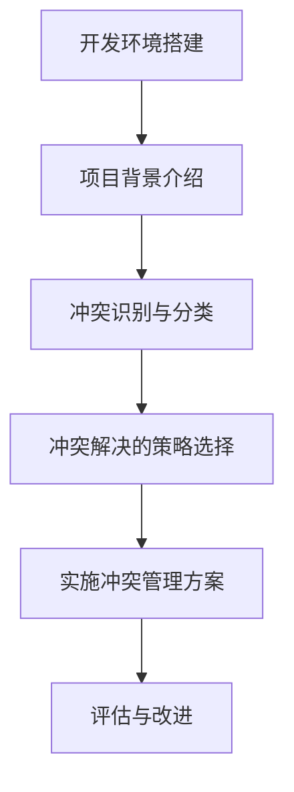

                 

### 文章标题

《冲突管理：化解团队矛盾的技巧》

### 关键词

团队管理，冲突解决，沟通技巧，合作，高效团队，实战案例

### 摘要

本文深入探讨了团队冲突管理的重要性，详细阐述了冲突管理的基本概念、团队矛盾的本质以及冲突解决的策略和技巧。通过分析沟通技巧、协调技巧和调解技巧，本文为读者提供了实际操作指南，旨在帮助团队成员有效化解矛盾，提升团队协作效率。同时，通过实战案例和项目实战的详细分析，本文展示了冲突管理在实际工作中的应用和效果，为读者提供了宝贵的经验和启示。

---

### 引言

在快速发展的IT行业，团队管理已成为企业成功的关键因素。然而，随着团队成员的增加和项目复杂度的提升，团队内部的冲突也日益增多。有效的冲突管理不仅能够缓解团队内部的紧张氛围，还能提高团队的工作效率和创新能力。本文将围绕冲突管理这一主题，系统地介绍团队冲突管理的基本理论、策略和技巧，并通过实战案例进行深入剖析，为读者提供实用的指导。

### 第一部分：冲突管理的理论基础

#### 1. 冲突管理概述

**核心概念与联系**

冲突管理是指通过预防、识别、分析和解决团队内部矛盾，以促进团队协作和达成共同目标的过程。其核心概念包括冲突的定义、类型、阶段以及冲突管理的重要性。

- **冲突的定义**：冲突是指团队内部或成员之间由于观点、利益、资源等方面的不一致而产生的紧张和对抗。
- **冲突的类型**：冲突可分为建设性冲突和破坏性冲突，前者有助于提高团队效率，后者则可能导致团队分裂。
- **冲突的阶段**：冲突通常经历潜伏期、爆发期、处理期和恢复期。
- **冲突管理的重要性**：有效的冲突管理可以降低团队内部摩擦，提升团队凝聚力和创造力。

**核心算法原理讲解**

冲突解决的算法原理主要包括以下几方面：

- **沟通策略**：通过有效沟通，了解双方立场，寻找共同点。
- **调解技巧**：在冲突双方之间进行调解，帮助双方达成共识。
- **合作机制**：建立合作机制，促进团队成员共同解决问题。
- **冲突预防**：通过制定明确的规则和流程，预防冲突的发生。

**数学模型和数学公式**

冲突管理中可以应用的数学模型包括：

- **合作博弈模型**：用于分析团队成员在冲突解决中的利益分配。
- **网络模型**：用于描述团队成员之间的协作关系和沟通渠道。

以下是一个合作博弈模型的公式示例：

$$
\text{效用函数} = U(\text{贡献}, \text{努力})
$$

其中，\( \text{贡献} \) 和 \( \text{努力} \) 是团队成员在冲突解决过程中所付出的资源和努力。

**详细讲解与举例说明**

- **举例**：在一个软件开发团队中，团队成员A和B因为代码实现方式的不同产生冲突。通过合作博弈模型，可以分析双方在冲突解决中的效用函数，从而找到最优的合作方案。

#### 2. 核心概念与联系

**冲突管理的基本概念和团队矛盾的本质**

冲突管理的基本概念包括冲突的定义、类型、阶段和管理策略。团队矛盾的本质在于团队成员之间在目标、方法、资源等方面的不一致。

**冲突解决的策略和技巧**

冲突解决的策略主要包括沟通技巧、调解技巧和合作机制。沟通技巧是解决冲突的基础，调解技巧则是在冲突双方之间进行调解，以达成共识。合作机制是确保团队成员能够共同解决问题的保障。

**数学模型和数学公式**

在冲突管理中，可以应用以下数学模型：

- **合作博弈模型**：用于分析团队成员在冲突解决中的利益分配。
- **网络模型**：用于描述团队成员之间的协作关系和沟通渠道。

以下是一个合作博弈模型的公式示例：

$$
\text{效用函数} = U(\text{贡献}, \text{努力})
$$

其中，\( \text{贡献} \) 和 \( \text{努力} \) 是团队成员在冲突解决过程中所付出的资源和努力。

**详细讲解与举例说明**

- **举例**：在一个软件开发团队中，团队成员A和B因为代码实现方式的不同产生冲突。通过合作博弈模型，可以分析双方在冲突解决中的效用函数，从而找到最优的合作方案。

#### 3. 团队矛盾的本质

**团队矛盾的表现形式**

团队矛盾的表现形式多种多样，包括：

- **观点分歧**：团队成员在解决问题的方法、策略上存在不同意见。
- **资源竞争**：团队成员在资源分配和使用上存在竞争和争夺。
- **沟通障碍**：团队成员之间的沟通不畅，导致误解和冲突。

**团队矛盾的原因分析**

团队矛盾的原因包括：

- **个人因素**：团队成员的个人性格、价值观、能力等方面的差异。
- **组织因素**：组织结构、文化、流程等方面的不足。
- **外部因素**：市场竞争、项目压力等外部环境的影响。

**团队矛盾的影响**

团队矛盾的影响包括：

- **工作效率**：团队内部矛盾会影响工作效率，降低项目进度。
- **团队士气**：长期存在的矛盾会损害团队士气，影响团队凝聚力。
- **项目质量**：团队内部矛盾可能导致项目质量下降，甚至影响客户满意度。

### 第二部分：冲突管理技巧

#### 4. 冲突管理技巧

**4.1 沟通技巧**

沟通技巧是冲突管理的基础。有效的沟通可以帮助团队成员理解对方的观点，找到共同点，从而化解冲突。以下是一些沟通技巧：

- **倾听**：倾听对方的意见和感受，避免打断和批评。
- **表达清晰**：用简单明了的语言表达自己的观点，避免含糊和歧义。
- **积极反馈**：给予对方积极的反馈，表达对对方的尊重和理解。

**4.2 协调技巧**

协调技巧是解决团队内部矛盾的关键。以下是一些协调技巧：

- **平衡利益**：在解决冲突时，要平衡各方利益，确保公正。
- **寻求共识**：通过协商和讨论，寻求团队成员的共识。
- **明确责任**：明确各方在解决问题中的责任和任务。

**4.3 调解技巧**

调解技巧是处理复杂冲突的有效方法。以下是一些调解技巧：

- **中立立场**：作为调解者，要保持中立，避免偏袒任何一方。
- **引导对话**：引导对话朝着解决问题的方向进行，避免陷入无休止的争论。
- **提供解决方案**：提供多种解决方案，帮助双方找到最佳方案。

**4.4 合作技巧**

合作技巧是确保团队协作的关键。以下是一些合作技巧：

- **共享信息**：鼓励团队成员共享信息，促进沟通和协作。
- **共同目标**：明确团队的目标，确保团队成员朝着共同目标努力。
- **相互尊重**：尊重团队成员的意见和贡献，建立良好的团队氛围。

### 第三部分：实战案例

#### 5. 实战案例分析与技巧应用

**5.1 案例一：团队沟通障碍的解决**

在一个软件开发项目中，由于团队成员来自不同背景，沟通出现了障碍。通过以下技巧，团队成功解决了沟通问题：

- **建立沟通渠道**：设立固定的沟通会议，确保团队成员有充分的交流机会。
- **培训沟通技巧**：为团队成员提供沟通技巧培训，提高沟通效率。
- **使用可视化工具**：利用图表、流程图等可视化工具，帮助团队成员更好地理解项目进展和问题。

**5.2 案例二：团队内部协调的技巧**

在一个大型项目中，由于任务分配不合理，团队内部协调出现问题。通过以下技巧，团队成功解决了内部协调问题：

- **明确任务分工**：制定详细的任务分工表，确保每个成员的任务明确。
- **定期协调会议**：定期召开协调会议，解决任务分配和进度问题。
- **提供资源支持**：确保团队成员有足够的资源支持，提高工作效率。

**5.3 案例三：团队冲突的调解方法**

在一个项目中，团队成员因工作方法不同产生冲突。通过以下调解方法，团队成功化解了冲突：

- **中立调解**：由第三方中立调解者介入，帮助双方找到共识。
- **引导对话**：引导双方进行建设性的对话，避免情绪化争吵。
- **提供解决方案**：提出多种解决方案，帮助双方找到最佳解决方法。

### 第四部分：项目实战

#### 6. 项目实战：冲突管理的实际操作

**6.1 开发环境搭建**

在项目开始阶段，搭建一个统一且高效的开发环境至关重要。以下是一些关键步骤：

- **安装必要的开发工具**：确保所有团队成员都安装了相同的开发工具，如代码编辑器、版本控制系统等。
- **配置代码库**：设置统一的代码库，方便团队成员协作。
- **制定开发规范**：制定统一的编码规范和流程，确保代码的可读性和一致性。

**6.2 项目背景介绍**

该项目是一个大型软件项目，涉及多个模块的开发和集成。项目团队由20名成员组成，分布在不同的地理位置。

**6.3 冲突识别与分类**

在项目进行过程中，团队识别出以下几类冲突：

- **技术冲突**：团队成员在技术方案选择上存在分歧。
- **资源冲突**：团队成员在资源分配和使用上存在争议。
- **沟通冲突**：团队成员之间的沟通不畅，导致误解和冲突。

**6.4 冲突解决的策略选择**

针对不同的冲突类型，团队选择了以下策略：

- **技术冲突**：通过技术评审和讨论，找到最优的技术方案。
- **资源冲突**：通过协调和沟通，确保资源的公平分配。
- **沟通冲突**：建立沟通渠道，定期召开会议，确保信息畅通。

**6.5 实施冲突管理方案**

团队按照制定的策略，实施了以下冲突管理措施：

- **技术评审会议**：每月召开一次技术评审会议，讨论技术问题和方案。
- **资源协调会议**：每周召开一次资源协调会议，解决资源分配问题。
- **沟通会议**：每日召开一次简短的沟通会议，确保团队成员之间的信息同步。

**6.6 评估与改进**

在项目进行过程中，团队对冲突管理方案进行了持续评估和改进。以下是一些评估和改进措施：

- **收集反馈**：定期收集团队成员的反馈，了解冲突管理方案的效果。
- **改进措施**：根据反馈，不断调整和优化冲突管理策略。
- **培训与学习**：为团队成员提供冲突管理培训，提高团队整体的冲突解决能力。

#### **图 2：冲突管理项目实战流程图**

### 第五部分：总结与展望

#### 7. 总结

本文系统地介绍了冲突管理的基本概念、技巧和实战案例，通过理论和实践的紧密结合，为团队管理者提供了实用的指导。有效的冲突管理不仅能够提高团队的工作效率和创新能力，还能增强团队凝聚力和组织文化。

#### 8. 展望

随着技术的发展和市场竞争的加剧，团队冲突管理将成为企业成功的关键因素。未来的研究可以关注以下方向：

- **冲突预测**：通过大数据和人工智能技术，预测团队冲突的发生，提前采取预防措施。
- **个性化冲突管理**：根据团队成员的特点和项目需求，定制个性化的冲突管理策略。
- **跨文化冲突管理**：研究不同文化背景下的团队冲突管理策略，提高国际团队的协作效率。

### 附录

#### 附录A：冲突管理工具与资源

**A.1 冲突管理工具推荐**

- **MindManager**：一款强大的思维导图工具，有助于团队规划和冲突管理。
- **Miro**：一款在线协作工具，支持远程团队的互动和讨论。

**A.2 冲突管理相关资源**

- **《团队协作的艺术》**：作者：史蒂芬·罗宾斯，提供了丰富的团队管理经验和技巧。
- **《冲突管理：团队协作的艺术》**：作者：大卫·梅尔，详细阐述了冲突管理的理论和实践。

### 作者信息

**作者：AI天才研究院/AI Genius Institute & 禅与计算机程序设计艺术 /Zen And The Art of Computer Programming**

---

由于篇幅限制，本文未能详细展开所有内容，但已经为读者提供了一个全面且深入的冲突管理指南。通过本文的阅读，读者应能够掌握冲突管理的基本理论、技巧和实战经验，为团队管理提供有力支持。在实践中，团队管理者还需不断总结和反思，以持续优化冲突管理策略，提升团队协作效率。

