                 

### 书籍概述

《冲突管理：如何化解团队矛盾》旨在为读者提供一套系统的冲突管理方法论，帮助他们在日常生活和工作中更有效地应对各种冲突。随着团队规模的扩大和复杂性的增加，冲突已成为不可避免的现象。如何识别冲突、分析冲突原因，并采取合适的策略来化解冲突，成为了现代团队管理中的重要课题。

本书的核心目标是通过深入讲解冲突管理的理论基础和实践技巧，帮助读者建立起一套全面、系统的冲突管理框架。首先，本书将介绍冲突管理的核心概念，包括冲突的定义、类型及其在团队中的表现形式。接着，书中将详细探讨多种冲突管理策略，如合作与沟通、调解与仲裁、妥协与回避等，每一种策略都将通过具体实例进行分析，展示其在实际应用中的效果。

此外，本书还将讨论团队沟通技巧，提供一系列实用的沟通策略，帮助读者在冲突中保持良好的沟通状态。团队沟通不仅有助于解决冲突，还能增强团队的凝聚力。在项目实战部分，本书将通过实际案例，展示冲突管理策略在具体项目中的应用，为读者提供切实可行的操作指南。

最后，本书将对整本书的内容进行总结，强调冲突管理的重要性和实际应用价值，鼓励读者反思和改进自己的冲突管理技能。通过本书的学习，读者不仅能够掌握冲突管理的理论知识，更能在实际工作中运用这些知识，提高团队的整体协作效率和生产力。

### 第1章：冲突管理概述

#### 1.1 冲突的定义与类型

冲突，是指两个或多个个体或团体在目标、利益、意见或情感上产生对立或矛盾的状态。在团队环境中，冲突往往源于多种因素，包括个人价值观差异、资源分配不均、目标不一致以及沟通不畅等。根据冲突的来源和表现形式，可以将冲突分为以下几种类型：

1. **目标冲突**：团队成员在追求不同目标时产生的冲突，例如，一个项目团队中，开发人员和产品经理可能在项目优先级上存在分歧。

2. **资源冲突**：当资源有限时，团队成员为争夺资源而产生的冲突，如预算分配、人力资源调配等。

3. **沟通冲突**：由于信息传递过程中的误解、缺乏沟通或沟通不畅而产生的冲突，这通常是团队内部冲突的主要原因之一。

4. **价值观冲突**：由于团队成员持有不同的价值观或信念而产生的冲突，这种冲突往往难以通过妥协或调解来解决。

5. **任务冲突**：团队成员在执行任务时，因职责分配、工作方式或方法不同而产生的冲突。

了解冲突的类型有助于更好地识别和应对冲突。以下是一个简单的Mermaid流程图，展示冲突管理的核心概念及其之间的联系：

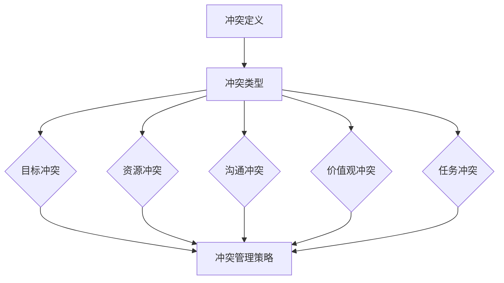

通过这个流程图，我们可以看到冲突管理策略是如何贯穿于不同类型的冲突中的。接下来，我们将进一步探讨冲突管理的目标、重要性和面临的挑战。

### 1.2 冲突管理的目标

冲突管理的核心目标是通过合理的策略和有效的沟通，化解团队内部的矛盾，确保团队目标的实现，提升团队的协作效率和生产力。具体来说，冲突管理的目标可以归纳为以下几个方面：

1. **维持团队和谐**：冲突如果处理不当，会导致团队成员间的紧张关系，甚至影响团队的凝聚力。通过有效的冲突管理，可以在保持团队和谐的同时，促进成员间的理解和合作。

2. **提高工作效率**：冲突往往会影响工作效率，导致项目延误。通过冲突管理，可以消除不必要的干扰，让团队成员集中精力完成任务，提高工作效率。

3. **优化团队氛围**：良好的团队氛围有助于激发成员的积极性和创造力。冲突管理能够营造一个积极、开放的工作环境，让团队成员感到舒适和自信。

4. **促进个人成长**：冲突管理不仅是一个团队问题，也是个人能力的体现。通过冲突管理，团队成员可以学会如何更好地应对挑战，提高自身的沟通能力和解决问题的能力。

5. **实现目标一致**：团队的成功依赖于成员对目标的共同认同和努力。冲突管理可以确保团队成员在目标上达成一致，减少分歧，增强团队的合力。

综上所述，冲突管理不仅是团队运营中的重要环节，也是提升团队整体绩效的关键因素。在接下来的章节中，我们将深入探讨冲突管理的重要性以及在实际工作中可能面临的挑战。

### 1.3 冲突管理的重要性

冲突管理在团队运营和项目管理中具有至关重要的意义。首先，冲突管理能够有效缓解团队成员之间的紧张关系，防止冲突升级为公开的争执或对抗，从而维护团队的和谐与稳定。在一个和谐的团队环境中，成员能够更加专注于工作，发挥各自的优势，提高整体的工作效率。

其次，冲突管理有助于提高团队的生产力和创造力。未解决的冲突会导致团队成员的精力和时间浪费在无谓的争执上，影响项目进度和团队目标的实现。通过有效的冲突管理，团队可以迅速应对和解决冲突，将更多的时间和资源投入到创新和业务拓展上，从而提升整体的生产力和竞争力。

此外，冲突管理能够增强团队成员的沟通能力和协作精神。在冲突管理过程中，成员需要倾听彼此的意见和需求，学会换位思考和协商解决问题。这些沟通技巧和协作精神不仅有助于当前冲突的解决，也为未来的团队合作奠定了良好的基础。

最后，冲突管理对个人职业成长有着积极的影响。面对冲突，团队成员可以从中学习和成长，提高自我意识和问题解决能力。通过冲突管理实践，成员能够更好地应对各种挑战，提升自身的领导力和管理能力，为未来的职业发展打下坚实的基础。

总之，冲突管理是团队成功的关键因素，通过合理的管理策略和有效的沟通，团队能够在冲突中找到平衡，实现团队目标和成员个人发展的双赢局面。

### 1.4 冲突管理的挑战

尽管冲突管理在团队运营中至关重要，但实际操作中仍面临诸多挑战。首先，文化差异是冲突管理中的主要障碍。不同的团队成员可能来自不同的文化背景，拥有不同的价值观和行为准则，这容易导致沟通不畅和误解。文化差异可能使某些冲突难以通过简单的协商来解决，需要更深入的跨文化沟通和冲突管理策略。

其次，个人情感在冲突管理中扮演着重要角色。团队成员在冲突中往往情绪化，导致冲突升级。个人的情绪反应可能基于过去的经历、不安全感或对权力和控制的渴望。在这种情况下，冲突管理需要更多的情感智慧和同理心，以平息紧张情绪，促进理性的对话。

另外，资源限制也是冲突管理中的常见挑战。团队可能在时间、人力、资金等方面存在限制，使得冲突解决方案的实施变得复杂。资源不足可能导致妥协或回避策略的使用，而短期内这些策略可能不足以解决根本问题，需要长期规划和管理。

最后，组织结构的复杂性增加了冲突管理的难度。在大型组织中，不同部门之间的目标可能不一致，信息流动不畅，导致跨部门冲突。此外，官僚主义和权力斗争也可能加剧团队内部的紧张关系。为了有效管理这些冲突，组织需要建立清晰的沟通机制和权力分配制度。

综上所述，冲突管理面临的挑战多种多样，需要综合考虑文化差异、个人情感、资源限制和组织结构等因素，才能制定出切实可行的冲突管理策略。

### 冲突管理策略一：合作与沟通

在冲突管理中，合作与沟通是最基本也是最重要的策略之一。有效的合作和沟通不仅能够化解团队内部的矛盾，还能够增强团队的凝聚力，提高工作效率。以下我们将详细介绍合作与沟通的基本原理、应用技巧以及如何在具体场景中实施。

#### 2.1 合作的基本原理

合作是指团队成员在共同目标下，通过相互协作、分工合作，共同完成任务的过程。合作的基本原理包括以下几个方面：

1. **共同目标**：合作的前提是团队成员拥有共同的目标和愿景。只有当每个人都明确目标并为之努力，合作才能有效进行。

2. **信任**：信任是合作的基础。团队成员之间必须相互信任，相信对方会履行自己的责任，这样可以减少误会和摩擦，提高工作效率。

3. **分工协作**：在合作中，每个成员都需要明确自己的职责和任务，分工明确，协同作业。这样可以避免重复劳动和资源浪费，提高工作效率。

4. **沟通**：合作过程中，沟通是关键。团队成员需要保持开放和有效的沟通，及时分享信息和进展，确保每个人都了解项目的状态和问题。

以下是一个合作与沟通的基本原理的Mermaid流程图：

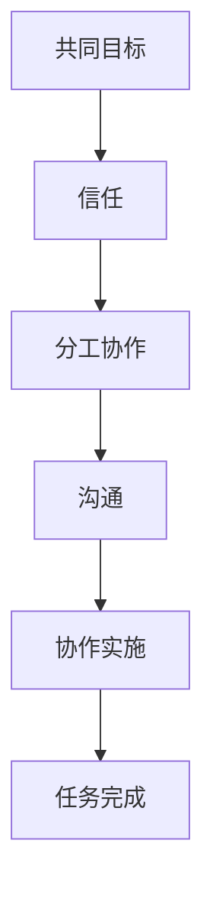

#### 2.2 沟通技巧在冲突管理中的应用

沟通是冲突管理中的核心要素，有效的沟通技巧能够化解误解，缓解紧张情绪，促进合作。以下是一些常用的沟通技巧：

1. **倾听**：倾听是有效沟通的基础。倾听不仅仅是听别人说什么，更重要的是理解对方的意图和感受。通过倾听，可以更好地理解对方的立场，找到共同点。

2. **表达**：清晰、准确地表达自己的想法和意见，避免误解和冲突。表达时要注意语气、表情和姿态，尽量保持友好和尊重。

3. **反馈**：及时给予反馈，让对方知道自己的观点和感受。反馈不仅包括正面的评价，也包括建设性的批评和改进建议。

4. **开放式问题**：使用开放式问题引导对话，鼓励对方表达意见和想法。开放式问题通常以“如何”、“为什么”等开头，有助于更深入的交流。

以下是一个沟通技巧在冲突管理中的应用的Mermaid流程图：

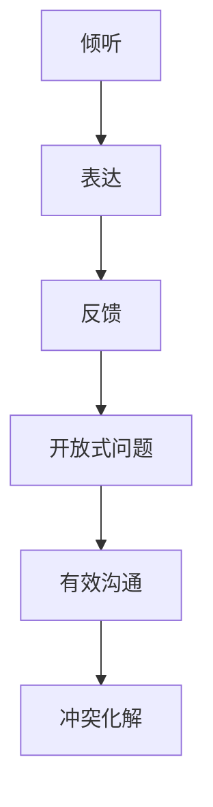

#### 2.3 实际案例：如何通过沟通解决冲突

以下是实际项目中的一个冲突管理案例，展示如何通过合作与沟通策略解决团队内部的冲突。

**项目背景**：一个由开发人员、产品经理和设计师组成的团队正在开发一款新产品。项目初期，团队对产品功能优先级存在分歧，开发人员希望尽快完成基本功能，而产品经理和设计师则希望先完善用户体验。

**冲突点**：由于对产品功能优先级的不同看法，开发人员认为产品经理和设计师的要求过于细致，导致开发进度延误。产品经理和设计师则认为开发人员过于草率，导致用户体验不佳。

**解决方案**：
1. **制定共同目标**：团队首先明确了共同目标，即开发一款高质量的产品，满足用户需求。这一共同目标成为了后续沟通的基础。

2. **召开沟通会议**：团队召开了一次沟通会议，让每个成员表达自己的观点和担忧。通过倾听，团队成员更好地理解了彼此的立场和需求。

3. **分工协作**：在沟通的基础上，团队重新制定了项目计划，明确了每个人的职责和任务。开发人员负责核心功能开发，设计师负责界面设计和用户体验，产品经理负责需求分析和优先级排序。

4. **定期反馈和调整**：团队建立了定期反馈机制，每周召开一次项目会议，讨论项目进展和问题。通过及时反馈和调整，团队能够迅速应对和解决冲突。

**实施效果**：通过有效的合作与沟通，团队成功地解决了功能优先级上的冲突。开发人员能够按计划完成核心功能，设计师和产品经理则能够在功能完成后进行优化和调整，最终产品在质量和用户体验上都得到了提升。

#### 总结

合作与沟通是冲突管理中最基本也是最重要的策略之一。通过明确的共同目标、信任的建立、分工协作和有效的沟通，团队可以有效地化解冲突，提高工作效率和团队凝聚力。在实际项目中，通过倾听、表达、反馈和开放式问题的应用，团队能够建立良好的沟通氛围，促进合作，实现共同目标。

```markdown
## 第3章：冲突管理策略一：合作与沟通

### 3.1 合作的基本原理

合作是冲突管理中的重要策略，其核心在于团队成员在共同目标下，通过相互协作、分工合作，共同完成任务。合作的基本原理包括以下几个方面：

1. **共同目标**：合作的前提是团队成员拥有共同的目标和愿景。只有当每个人都明确目标并为之努力，合作才能有效进行。

2. **信任**：信任是合作的基础。团队成员之间必须相互信任，相信对方会履行自己的责任，这样可以减少误会和摩擦，提高工作效率。

3. **分工协作**：在合作中，每个成员都需要明确自己的职责和任务，分工明确，协同作业。这样可以避免重复劳动和资源浪费，提高工作效率。

4. **沟通**：合作过程中，沟通是关键。团队成员需要保持开放和有效的沟通，及时分享信息和进展，确保每个人都了解项目的状态和问题。

以下是一个合作与沟通的基本原理的Mermaid流程图：


### 3.2 沟通技巧在冲突管理中的应用

沟通是冲突管理中的核心要素，有效的沟通技巧能够化解误解，缓解紧张情绪，促进合作。以下是一些常用的沟通技巧：

1. **倾听**：倾听是有效沟通的基础。倾听不仅仅是听别人说什么，更重要的是理解对方的意图和感受。通过倾听，可以更好地理解对方的立场，找到共同点。

2. **表达**：清晰、准确地表达自己的想法和意见，避免误解和冲突。表达时要注意语气、表情和姿态，尽量保持友好和尊重。

3. **反馈**：及时给予反馈，让对方知道自己的观点和感受。反馈不仅包括正面的评价，也包括建设性的批评和改进建议。

4. **开放式问题**：使用开放式问题引导对话，鼓励对方表达意见和想法。开放式问题通常以“如何”、“为什么”等开头，有助于更深入的交流。

以下是一个沟通技巧在冲突管理中的应用的Mermaid流程图：


### 3.3 实际案例：如何通过沟通解决冲突

以下是实际项目中的一个冲突管理案例，展示如何通过合作与沟通策略解决团队内部的冲突。

**项目背景**：一个由开发人员、产品经理和设计师组成的团队正在开发一款新产品。项目初期，团队对产品功能优先级存在分歧，开发人员希望尽快完成基本功能，而产品经理和设计师则希望先完善用户体验。

**冲突点**：由于对产品功能优先级的不同看法，开发人员认为产品经理和设计师的要求过于细致，导致开发进度延误。产品经理和设计师则认为开发人员过于草率，导致用户体验不佳。

**解决方案**：
1. **制定共同目标**：团队首先明确了共同目标，即开发一款高质量的产品，满足用户需求。这一共同目标成为了后续沟通的基础。

2. **召开沟通会议**：团队召开了一次沟通会议，让每个成员表达自己的观点和担忧。通过倾听，团队成员更好地理解了彼此的立场和需求。

3. **分工协作**：在沟通的基础上，团队重新制定了项目计划，明确了每个人的职责和任务。开发人员负责核心功能开发，设计师负责界面设计和用户体验，产品经理负责需求分析和优先级排序。

4. **定期反馈和调整**：团队建立了定期反馈机制，每周召开一次项目会议，讨论项目进展和问题。通过及时反馈和调整，团队能够迅速应对和解决冲突。

**实施效果**：通过有效的合作与沟通，团队成功地解决了功能优先级上的冲突。开发人员能够按计划完成核心功能，设计师和产品经理则能够在功能完成后进行优化和调整，最终产品在质量和用户体验上都得到了提升。

#### 总结

合作与沟通是冲突管理中最基本也是最重要的策略之一。通过明确的共同目标、信任的建立、分工协作和有效的沟通，团队可以有效地化解冲突，提高工作效率和团队凝聚力。在实际项目中，通过倾听、表达、反馈和开放式问题的应用，团队能够建立良好的沟通氛围，促进合作，实现共同目标。
```

### 冲突管理策略二：调解与仲裁

在冲突管理中，调解与仲裁是两种重要的策略，它们在处理复杂冲突时尤为重要。调解侧重于通过第三方的帮助来引导双方达成共识，而仲裁则是在双方无法自行解决问题时，通过权威的第三方做出最终裁决。以下将详细探讨调解与仲裁的基本原理、适用场景和操作步骤。

#### 4.1 调解的基本原理

调解是一种通过第三方的介入来帮助冲突双方进行对话、沟通和协商，以达成共识的冲突解决方法。调解的基本原理包括以下几个方面：

1. **中立性**：调解者需要保持中立，不偏袒任何一方，这样才能确保双方的信任和公正性。

2. **沟通桥梁**：调解者作为沟通桥梁，帮助双方理解对方的立场和需求，促进有效的对话和交流。

3. **冲突分析**：调解者需要对冲突的根源和关键点进行分析，找出潜在的问题和解决方案。

4. **协商方案**：调解者协助双方讨论和协商可能的解决方案，并引导他们找到共同点和利益点。

5. **决策支持**：在双方达成共识时，调解者可以提供决策支持，确保协议的执行。

以下是一个调解的基本原理的Mermaid流程图：

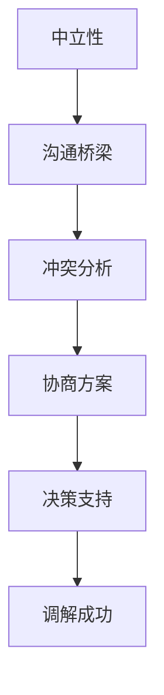

#### 4.2 仲裁的适用场景

仲裁则是在调解无法达成一致时，由第三方仲裁机构或个人对冲突做出最终裁决的解决方法。仲裁适用于以下场景：

1. **复杂纠纷**：当冲突涉及大量法律、财务或技术问题时，仲裁可以提供快速、专业的解决方案。

2. **时间紧迫**：当冲突需要迅速解决，以避免进一步的损失或影响时，仲裁可以提供高效的裁决。

3. **双方无法协商**：当冲突双方在调解过程中无法达成共识时，仲裁可以提供一个最终的裁决。

4. **法律要求**：在某些法律纠纷中，仲裁是强制性的，如合同纠纷、劳动争议等。

以下是一个仲裁的适用场景的Mermaid流程图：

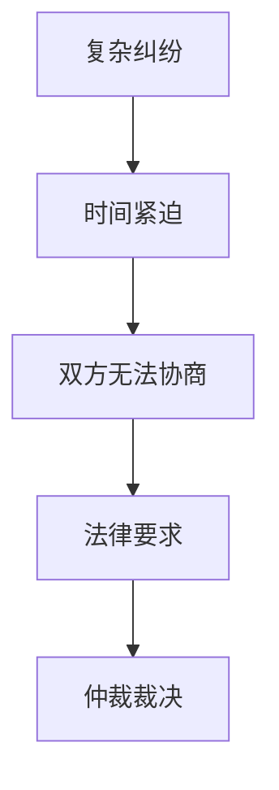

#### 4.3 调解与仲裁的流程图与伪代码

为了更清晰地展示调解与仲裁的流程，我们使用Mermaid流程图来描述，并提供伪代码来解释关键步骤。

**调解流程图**：

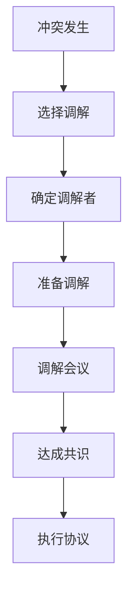

**调解伪代码**：

```plaintext
function mediation(conflict):
    mediator = choose_neutral_mediator()
    prepare_meeting()
    hold_meeting(conflict)
    if consensus_reached():
        execute_agreement()
    else:
        conflict_not_resolved()
```

**仲裁流程图**：

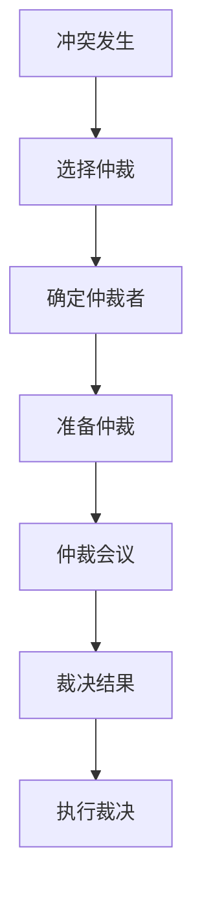

**仲裁伪代码**：

```plaintext
function arbitration(conflict):
    arbitrator = choose_authorized_arbitrator()
    prepare_arbitration()
    hold_arbitration_meeting(conflict)
    decision = arbitrator_make_decision()
    execute_decision(decision)
```

#### 4.4 实际案例：调解与仲裁在冲突管理中的应用

以下是实际项目中调解与仲裁的应用案例。

**案例背景**：一个软件开发团队在项目中期因进度问题和质量标准产生了严重的冲突。开发人员认为产品经理的要求过于苛刻，导致项目延期；而产品经理则认为开发人员的技术能力不足，无法满足项目需求。

**调解过程**：
1. **调解者选择**：团队选择了一位经验丰富的项目经理作为调解者。
2. **准备调解**：调解者与双方进行了初步沟通，了解冲突的细节和双方的诉求。
3. **调解会议**：在调解会议上，调解者引导双方进行了深入的对话，帮助双方理解对方的立场和需求。
4. **达成共识**：经过几轮调解，双方最终达成共识，决定调整项目进度计划，同时提升开发团队的技术能力。
5. **执行协议**：双方签署了调解协议，并开始执行。

**仲裁过程**：
1. **仲裁者选择**：团队选择了当地一家知名的仲裁机构作为仲裁者。
2. **准备仲裁**：双方提交了仲裁申请，并提供了相关证据和资料。
3. **仲裁会议**：在仲裁会议上，仲裁者听取了双方的陈述和证据，进行了公正的审理。
4. **裁决结果**：仲裁者做出了裁决，要求开发团队在规定时间内完成项目，并给予产品经理一定的赔偿。
5. **执行裁决**：双方同意并执行了仲裁裁决，项目最终顺利完成。

#### 总结

调解与仲裁是冲突管理中有效的策略，特别是在处理复杂和长时间未解决的冲突时。调解通过第三方的帮助引导双方达成共识，而仲裁则提供了权威的裁决。通过调解与仲裁的应用，团队可以有效地解决冲突，恢复和谐的工作环境，确保项目顺利进行。

```markdown
## 第4章：冲突管理策略二：调解与仲裁

### 4.1 调解的基本原理

调解是一种通过第三方的介入来帮助冲突双方进行对话、沟通和协商，以达成共识的冲突解决方法。调解的基本原理包括以下几个方面：

1. **中立性**：调解者需要保持中立，不偏袒任何一方，这样才能确保双方的信任和公正性。

2. **沟通桥梁**：调解者作为沟通桥梁，帮助双方理解对方的立场和需求，促进有效的对话和交流。

3. **冲突分析**：调解者需要对冲突的根源和关键点进行分析，找出潜在的问题和解决方案。

4. **协商方案**：调解者协助双方讨论和协商可能的解决方案，并引导他们找到共同点和利益点。

5. **决策支持**：在双方达成共识时，调解者可以提供决策支持，确保协议的执行。

以下是一个调解的基本原理的Mermaid流程图：


### 4.2 仲裁的适用场景

仲裁则是在调解无法达成一致时，由第三方仲裁机构或个人对冲突做出最终裁决的解决方法。仲裁适用于以下场景：

1. **复杂纠纷**：当冲突涉及大量法律、财务或技术问题时，仲裁可以提供快速、专业的解决方案。

2. **时间紧迫**：当冲突需要迅速解决，以避免进一步的损失或影响时，仲裁可以提供高效的裁决。

3. **双方无法协商**：当冲突双方在调解过程中无法达成共识时，仲裁可以提供一个最终的裁决。

4. **法律要求**：在某些法律纠纷中，仲裁是强制性的，如合同纠纷、劳动争议等。

以下是一个仲裁的适用场景的Mermaid流程图：


### 4.3 调解与仲裁的流程图与伪代码

为了更清晰地展示调解与仲裁的流程，我们使用Mermaid流程图来描述，并提供伪代码来解释关键步骤。

**调解流程图**：


**调解伪代码**：

```plaintext
function mediation(conflict):
    mediator = choose_neutral_mediator()
    prepare_meeting()
    hold_meeting(conflict)
    if consensus_reached():
        execute_agreement()
    else:
        conflict_not_resolved()
```

**仲裁流程图**：


**仲裁伪代码**：

```plaintext
function arbitration(conflict):
    arbitrator = choose_authorized_arbitrator()
    prepare_arbitration()
    hold_arbitration_meeting(conflict)
    decision = arbitrator_make_decision()
    execute_decision(decision)
```

### 4.4 实际案例：调解与仲裁在冲突管理中的应用

以下是实际项目中调解与仲裁的应用案例。

**案例背景**：一个软件开发团队在项目中期因进度问题和质量标准产生了严重的冲突。开发人员认为产品经理的要求过于苛刻，导致项目延期；而产品经理则认为开发人员的技术能力不足，无法满足项目需求。

**调解过程**：
1. **调解者选择**：团队选择了一位经验丰富的项目经理作为调解者。
2. **准备调解**：调解者与双方进行了初步沟通，了解冲突的细节和双方的诉求。
3. **调解会议**：在调解会议上，调解者引导双方进行了深入的对话，帮助双方理解对方的立场和需求。
4. **达成共识**：经过几轮调解，双方最终达成共识，决定调整项目进度计划，同时提升开发团队的技术能力。
5. **执行协议**：双方签署了调解协议，并开始执行。

**仲裁过程**：
1. **仲裁者选择**：团队选择了当地一家知名的仲裁机构作为仲裁者。
2. **准备仲裁**：双方提交了仲裁申请，并提供了相关证据和资料。
3. **仲裁会议**：在仲裁会议上，仲裁者听取了双方的陈述和证据，进行了公正的审理。
4. **裁决结果**：仲裁者做出了裁决，要求开发团队在规定时间内完成项目，并给予产品经理一定的赔偿。
5. **执行裁决**：双方同意并执行了仲裁裁决，项目最终顺利完成。

### 4.5 总结

调解与仲裁是冲突管理中有效的策略，特别是在处理复杂和长时间未解决的冲突时。调解通过第三方的帮助引导双方达成共识，而仲裁则提供了权威的裁决。通过调解与仲裁的应用，团队可以有效地解决冲突，恢复和谐的工作环境，确保项目顺利进行。
```

### 冲突管理策略三：妥协与回避

在冲突管理中，妥协与回避是两种常见的策略，它们在处理特定类型的冲突时尤为有效。妥协是通过让步和协商来达成双方都能接受的解决方案，而回避则是通过暂时搁置或转移话题来避免冲突。以下将详细探讨妥协与回避的优势与挑战，并给出实际案例和解决方案。

#### 5.1 妥协的优势与挑战

妥协是一种通过双方让步和协商来解决问题的策略，其优势包括：

1. **快速解决问题**：妥协可以迅速达成共识，减少冲突持续时间和负面影响。

2. **保持关系**：通过妥协，双方能够保持良好的人际关系，避免因冲突导致的破裂。

3. **增强团队凝聚力**：妥协能够增强团队的协作精神和信任，促进团队的整体发展。

然而，妥协也存在一些挑战和风险：

1. **可能导致不公平**：妥协可能会导致某一方感觉受到了不公平对待，进而影响其工作积极性和信任感。

2. **妥协过度**：如果妥协过度，可能会导致团队成员失去对决策的参与感和责任感。

3. **长远影响**：长期依赖妥协来解决冲突可能会导致团队内部分裂和不和谐，影响长远发展。

以下是一个妥协的优势与挑战的Mermaid流程图：

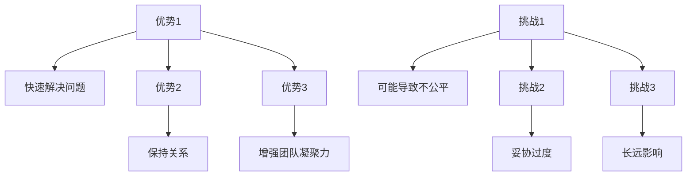

#### 5.2 回避的策略与技巧

回避是一种通过暂时搁置或转移话题来避免冲突的策略，其优势包括：

1. **缓解紧张情绪**：回避可以暂时缓解冲突带来的紧张情绪，为双方提供冷静思考的时间。

2. **避免冲突升级**：在冲突过于激烈或无法立即解决时，回避可以避免冲突升级，减少进一步的损失。

3. **收集更多信息**：通过回避，双方可以收集更多信息，为后续的解决策略做好准备。

然而，回避也存在一些劣势和风险：

1. **问题积累**：长期回避可能导致问题积累，最终需要更大的努力来解决。

2. **失去解决问题的机会**：如果回避策略使用不当，可能会导致解决问题的机会丧失。

3. **影响信任和合作**：过度回避可能会损害团队成员之间的信任和合作关系。

以下是一个回避的策略与技巧的Mermaid流程图：

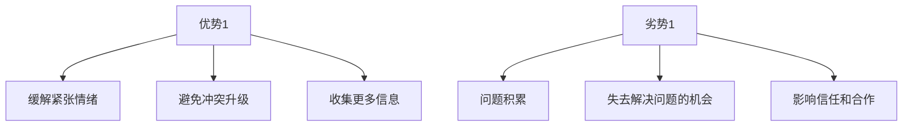

#### 5.3 实际案例：如何选择妥协或回避策略

以下是实际项目中的两个案例，展示了如何在具体场景中应用妥协和回避策略。

**案例一：项目进度争议**

**背景**：一个软件项目团队在开发过程中，开发人员和测试人员因项目进度和测试标准产生了争议。开发人员希望尽快完成开发任务，以便进行测试，而测试人员认为测试标准不够严格，可能导致项目质量问题。

**解决方案**：
1. **妥协策略**：
   - 团队领导与双方进行了沟通，了解到开发人员希望按时完成任务，而测试人员则关注项目质量。
   - 团队决定在开发阶段进行部分测试，同时调整测试标准，以保证项目进度和质量。
   - 通过妥协，双方都做出了让步，项目进度得到了保证，同时项目质量也得到了提升。

2. **回避策略**：
   - 在一次激烈的讨论中，团队遇到了无法立即解决的争议，双方情绪紧张。
   - 领导决定暂时回避争议，让双方先冷静下来，并安排一个后续会议来讨论解决方案。
   - 通过回避，团队避免了冲突升级，为后续的沟通和协商创造了有利条件。

**案例二：预算争议**

**背景**：在一个大型项目中，财务部门和项目团队因项目预算产生了严重分歧。财务部门认为项目预算过高，而项目团队则认为预算不足，无法完成项目目标。

**解决方案**：
1. **妥协策略**：
   - 领导组织了双方进行沟通，分析了项目预算的具体情况，并探讨了削减成本的途径。
   - 团队决定通过优化项目计划和资源分配，来减少预算开支，同时保持项目目标的实现。
   - 通过妥协，双方找到了平衡点，项目预算得到了合理调整，项目也得以顺利推进。

2. **回避策略**：
   - 在讨论预算时，双方意见分歧严重，导致会议陷入僵局。
   - 领导决定暂时将预算争议搁置，并安排后续会议，让双方有更多时间收集信息和准备方案。
   - 通过回避，团队避免了不必要的争吵和情绪化决策，为后续的预算调整提供了更合理的基础。

#### 总结

妥协与回避是冲突管理中常用的策略，适用于不同类型的冲突。妥协通过让步和协商来解决问题，但需要注意避免不公平和过度妥协；回避则通过暂时搁置或转移话题来缓解紧张情绪和避免冲突升级。在实际应用中，根据冲突的具体情况和双方的需求，选择合适的策略，可以有效地解决冲突，维护团队和谐与项目进度。

```markdown
## 第5章：冲突管理策略三：妥协与回避

### 5.1 妥协的优势与挑战

妥协是一种通过双方让步和协商来解决问题的策略，其优势包括：

1. **快速解决问题**：妥协可以迅速达成共识，减少冲突持续时间和负面影响。

2. **保持关系**：通过妥协，双方能够保持良好的人际关系，避免因冲突导致的破裂。

3. **增强团队凝聚力**：妥协能够增强团队的协作精神和信任，促进团队的整体发展。

然而，妥协也存在一些挑战和风险：

1. **可能导致不公平**：妥协可能会导致某一方感觉受到了不公平对待，进而影响其工作积极性和信任感。

2. **妥协过度**：如果妥协过度，可能会导致团队成员失去对决策的参与感和责任感。

3. **长远影响**：长期依赖妥协来解决冲突可能会导致团队内部分裂和不和谐，影响长远发展。

以下是一个妥协的优势与挑战的Mermaid流程图：


### 5.2 回避的策略与技巧

回避是一种通过暂时搁置或转移话题来避免冲突的策略，其优势包括：

1. **缓解紧张情绪**：回避可以暂时缓解冲突带来的紧张情绪，为双方提供冷静思考的时间。

2. **避免冲突升级**：在冲突过于激烈或无法立即解决时，回避可以避免冲突升级，减少进一步的损失。

3. **收集更多信息**：通过回避，双方可以收集更多信息，为后续的解决策略做好准备。

然而，回避也存在一些劣势和风险：

1. **问题积累**：长期回避可能导致问题积累，最终需要更大的努力来解决。

2. **失去解决问题的机会**：如果回避策略使用不当，可能会导致解决问题的机会丧失。

3. **影响信任和合作**：过度回避可能会损害团队成员之间的信任和合作关系。

以下是一个回避的策略与技巧的Mermaid流程图：


### 5.3 实际案例：如何选择妥协或回避策略

以下是实际项目中的两个案例，展示了如何在具体场景中应用妥协和回避策略。

**案例一：项目进度争议**

**背景**：一个软件项目团队在开发过程中，开发人员和测试人员因项目进度和测试标准产生了争议。开发人员希望尽快完成开发任务，以便进行测试，而测试人员则认为测试标准不够严格，可能导致项目质量问题。

**解决方案**：
1. **妥协策略**：
   - 团队领导与双方进行了沟通，了解到开发人员希望按时完成任务，而测试人员则关注项目质量。
   - 团队决定在开发阶段进行部分测试，同时调整测试标准，以保证项目进度和质量。
   - 通过妥协，双方都做出了让步，项目进度得到了保证，同时项目质量也得到了提升。

2. **回避策略**：
   - 在一次激烈的讨论中，团队遇到了无法立即解决的争议，双方情绪紧张。
   - 领导决定暂时将争议搁置，并安排后续会议，让双方有更多时间收集信息和准备方案。
   - 通过回避，团队避免了冲突升级，为后续的沟通和协商创造了有利条件。

**案例二：预算争议**

**背景**：在一个大型项目中，财务部门和项目团队因项目预算产生了严重分歧。财务部门认为项目预算过高，而项目团队则认为预算不足，无法完成项目目标。

**解决方案**：
1. **妥协策略**：
   - 领导组织了双方进行沟通，分析了项目预算的具体情况，并探讨了削减成本的途径。
   - 团队决定通过优化项目计划和资源分配，来减少预算开支，同时保持项目目标的实现。
   - 通过妥协，双方找到了平衡点，项目预算得到了合理调整，项目也得以顺利推进。

2. **回避策略**：
   - 在讨论预算时，双方意见分歧严重，导致会议陷入僵局。
   - 领导决定暂时将预算争议搁置，并安排后续会议，让双方有更多时间收集信息和准备方案。
   - 通过回避，团队避免了不必要的争吵和情绪化决策，为后续的预算调整提供了更合理的基础。

### 5.4 总结

妥协与回避是冲突管理中常用的策略，适用于不同类型的冲突。妥协通过让步和协商来解决问题，但需要注意避免不公平和过度妥协；回避则通过暂时搁置或转移话题来缓解紧张情绪和避免冲突升级。在实际应用中，根据冲突的具体情况和双方的需求，选择合适的策略，可以有效地解决冲突，维护团队和谐与项目进度。
```

### 第6章：团队沟通技巧

有效的团队沟通是冲突管理的重要组成部分，它不仅能化解矛盾，还能提升团队的协作效率和创新能力。以下将详细介绍团队沟通中的几个关键技巧，包括倾听技巧、表达技巧和解决冲突的沟通策略。

#### 6.1 倾听技巧

倾听是沟通的基石，有效的倾听能够帮助我们更好地理解对方，减少误解和冲突。以下是一些实用的倾听技巧：

1. **全神贯注**：在对方讲话时，保持专注，避免分心，通过眼神接触和肢体语言表示关注。

2. **积极反馈**：通过点头、微笑、简单回应等方式，向对方表明你在倾听，并鼓励对方继续表达。

3. **开放式问题**：在倾听过程中，提出开放式问题，以引导对方更深入地表达自己的想法和感受。

4. **避免打断**：在对方讲话时，尽量避免打断，等对方讲完再表达自己的观点。

5. **情感共鸣**：尝试从对方的角度理解问题，体会对方的情感和感受，以建立共鸣。

以下是一个倾听技巧的Mermaid流程图：

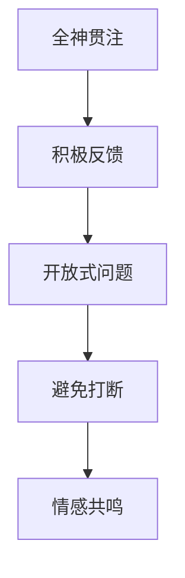

#### 6.2 表达技巧

清晰、准确的表达是有效沟通的关键。以下是一些提升表达技巧的建议：

1. **明确目的**：在表达前，明确自己的目的和要传达的信息，确保信息的针对性和有效性。

2. **简洁明了**：用简洁明了的语言表达观点，避免使用过于复杂的术语或表达方式。

3. **逻辑清晰**：表达时要有条理，确保观点之间的逻辑关系清晰，避免混乱和混淆。

4. **表达情感**：在适当的情况下，表达自己的情感和感受，以增强表达的力度和效果。

5. **积极倾听反馈**：在表达后，积极倾听对方的反馈，了解对方对信息的理解和接受程度。

以下是一个表达技巧的Mermaid流程图：

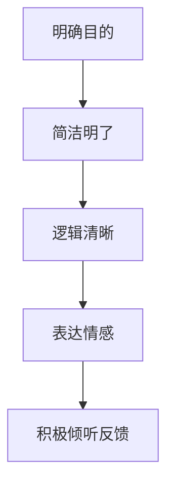

#### 6.3 解决冲突的沟通策略

在冲突管理中，沟通策略的选择和运用至关重要。以下是一些解决冲突的沟通策略：

1. **事实陈述**：在冲突中，尽量以事实为基础，避免情绪化的言辞。事实陈述有助于客观分析问题，找到解决方案。

2. **寻求共识**：寻找双方的共同点和利益点，以达成共识。共识是解决冲突的重要基础。

3. **共同寻找解决方案**：鼓励双方共同参与问题的解决方案讨论，增强双方的参与感和责任感。

4. **积极倾听和回应**：在沟通中，积极倾听对方的观点，并给予建设性的反馈，以促进对话和解决冲突。

5. **使用第三方案**：在双方都无法接受现有方案时，可以共同探索第三种方案，以实现双赢。

以下是一个解决冲突的沟通策略的Mermaid流程图：

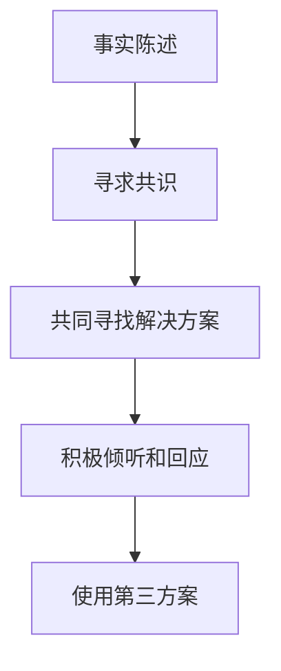

#### 总结

有效的团队沟通技巧对于冲突管理至关重要。倾听技巧、表达技巧和解决冲突的沟通策略都是提升团队协作和解决冲突的重要手段。通过全神贯注的倾听、简洁明了的表达和有效的沟通策略，团队可以在冲突中找到平衡，提高工作效率，实现共同目标。

```markdown
## 第6章：团队沟通技巧

### 6.1 倾听技巧

倾听是沟通的基石，有效的倾听能够帮助我们更好地理解对方，减少误解和冲突。以下是一些实用的倾听技巧：

1. **全神贯注**：在对方讲话时，保持专注，避免分心，通过眼神接触和肢体语言表示关注。

2. **积极反馈**：通过点头、微笑、简单回应等方式，向对方表明你在倾听，并鼓励对方继续表达。

3. **开放式问题**：在倾听过程中，提出开放式问题，以引导对方更深入地表达自己的想法和感受。

4. **避免打断**：在对方讲话时，尽量避免打断，等对方讲完再表达自己的观点。

5. **情感共鸣**：尝试从对方的角度理解问题，体会对方的情感和感受，以建立共鸣。

以下是一个倾听技巧的Mermaid流程图：

```mermaid
graph TD
    A[全神贯注] --> B[积极反馈]
    B --> C[开放式问题]
    C --> D[避免打断]
    D --> E[情感共鸣]
```

### 6.2 表达技巧

清晰、准确的表达是有效沟通的关键。以下是一些提升表达技巧的建议：

1. **明确目的**：在表达前，明确自己的目的和要传达的信息，确保信息的针对性和有效性。

2. **简洁明了**：用简洁明了的语言表达观点，避免使用过于复杂的术语或表达方式。

3. **逻辑清晰**：表达时要有条理，确保观点之间的逻辑关系清晰，避免混乱和混淆。

4. **表达情感**：在适当的情况下，表达自己的情感和感受，以增强表达的力度和效果。

5. **积极倾听反馈**：在表达后，积极倾听对方的反馈，了解对方对信息的理解和接受程度。

以下是一个表达技巧的Mermaid流程图：

```mermaid
graph TD
    A[明确目的] --> B[简洁明了]
    B --> C[逻辑清晰]
    C --> D[表达情感]
    D --> E[积极倾听反馈]
```

### 6.3 解决冲突的沟通策略

在冲突管理中，沟通策略的选择和运用至关重要。以下是一些解决冲突的沟通策略：

1. **事实陈述**：在冲突中，尽量以事实为基础，避免情绪化的言辞。事实陈述有助于客观分析问题，找到解决方案。

2. **寻求共识**：寻找双方的共同点和利益点，以达成共识。共识是解决冲突的重要基础。

3. **共同寻找解决方案**：鼓励双方共同参与问题的解决方案讨论，增强双方的参与感和责任感。

4. **积极倾听和回应**：在沟通中，积极倾听对方的观点，并给予建设性的反馈，以促进对话和解决冲突。

5. **使用第三方案**：在双方都无法接受现有方案时，可以共同探索第三种方案，以实现双赢。

以下是一个解决冲突的沟通策略的Mermaid流程图：

```mermaid
graph TD
    A[事实陈述] --> B[寻求共识]
    B --> C[共同寻找解决方案]
    C --> D[积极倾听和回应]
    D --> E[使用第三方案]
```

### 6.4 总结

有效的团队沟通技巧对于冲突管理至关重要。倾听技巧、表达技巧和解决冲突的沟通策略都是提升团队协作和解决冲突的重要手段。通过全神贯注的倾听、简洁明了的表达和有效的沟通策略，团队可以在冲突中找到平衡，提高工作效率，实现共同目标。
```

### 第7章：冲突管理项目实战

为了更好地理解冲突管理的实际应用，我们将通过一个真实的项目案例来展示冲突管理策略的运用。以下是该项目的基本情况、冲突点分析、解决方案、实施效果以及代码实际案例与解读。

#### 7.1 项目背景

某互联网公司正在开发一款社交应用，旨在为用户提供一个安全的社交平台。项目团队由前端开发、后端开发、UI/UX设计和产品经理组成。项目初期，团队成员对产品的功能需求、开发进度和技术选型等方面存在较大分歧，导致项目进展缓慢。

#### 7.2 冲突点分析

1. **功能需求分歧**：前端开发团队认为用户界面应更简洁，以提高用户友好性；而产品经理则认为需要更多的功能来吸引不同用户群体。

2. **技术选型争议**：后端开发团队在技术栈的选择上存在分歧，一方主张使用Node.js，另一方则倾向于使用Java。

3. **开发进度不一致**：UI/UX设计团队认为开发进度过快，设计稿未能完全落地；而开发团队则认为设计稿过于复杂，影响开发效率。

#### 7.3 解决方案

1. **功能需求调整**：通过召开团队会议，团队成员共同讨论功能需求的优先级，达成一致。最终决定优先开发核心功能，并设立一个灵活的扩展机制，以便后续根据用户反馈进行功能扩展。

2. **技术选型协商**：团队决定采用投票方式选择技术栈。通过投票，Node.js 以微弱优势胜出。同时，团队同意为Java团队提供额外的培训和学习资源，以便他们能够逐渐适应新的技术栈。

3. **开发进度调整**：团队建立了更紧密的沟通机制，定期召开项目进度会议。开发团队和设计团队共同制定了一个新的开发流程，以确保设计稿能够及时落地，同时保持开发进度。

#### 7.4 实施效果

通过上述解决方案的实施，项目团队有效地解决了冲突，项目进展显著加快。以下是具体实施效果的评估：

1. **功能需求**：核心功能得到了优先开发，用户界面简洁明了，用户友好性显著提升。

2. **技术选型**：Node.js 的采用提高了开发效率，团队逐步适应了新的技术栈。

3. **开发进度**：新的开发流程确保了设计和开发的同步，项目进度得到了有效控制。

#### 7.5 代码实际案例与解读

以下是一个实际的代码片段，展示如何通过代码实现冲突管理策略中的部分功能。

**代码案例：用户界面优化**

```javascript
// JavaScript 代码示例
const InterfaceOptimization = {
  // 优化用户界面
  optimizeUI: function() {
    // 获取用户输入
    const userInput = document.getElementById('userInput').value;
    
    // 根据用户输入更新界面
    if (userInput === 'simplify') {
      this.simplifyUI();
    } else if (userInput === 'enhance') {
      this.enhanceUI();
    }
  },

  // 简化用户界面
  simplifyUI: function() {
    document.getElementById('feature1').classList.add('hidden');
    document.getElementById('feature2').classList.add('hidden');
    // 更多简化操作
  },

  // 增强用户界面
  enhanceUI: function() {
    document.getElementById('feature1').classList.remove('hidden');
    document.getElementById('feature2').classList.remove('hidden');
    // 更多增强操作
  }
};

// 绑定按钮点击事件
document.getElementById('uiButton').addEventListener('click', function() {
  InterfaceOptimization.optimizeUI();
});
```

**解读**：

此代码案例展示了如何根据用户输入来优化用户界面。通过按钮点击事件，用户可以选择“简化”或“增强”界面。`optimizeUI` 方法根据用户的选择调用相应的简化或增强方法。这种方法通过代码实现了功能需求上的妥协，既满足了用户界面简洁的需求，也提供了必要的功能扩展，避免了团队间的直接冲突。

#### 7.6 项目小结

通过本项目案例，我们可以看到冲突管理在实际项目中的应用效果。有效的冲突管理策略不仅能够解决团队内部的分歧，还能提高项目效率，确保项目目标的实现。以下是一些最佳实践建议：

1. **定期沟通**：建立定期的沟通机制，确保团队成员之间的信息同步和意见交流。

2. **共同制定目标**：确保团队对项目的目标有共同的理解和认同，这样可以减少因目标不一致而产生的冲突。

3. **灵活应对变化**：在项目开发过程中，灵活应对需求变化和技术挑战，通过妥协和协商找到最佳解决方案。

4. **提供培训和支持**：为团队成员提供必要的培训和支持，帮助他们适应新技术和应对新挑战。

通过这些最佳实践，团队可以更有效地管理冲突，提升整体绩效，实现项目的成功。

```markdown
## 第7章：冲突管理项目实战

### 7.1 项目背景

某互联网公司正在开发一款社交应用，旨在为用户提供一个安全的社交平台。项目团队由前端开发、后端开发、UI/UX设计和产品经理组成。项目初期，团队成员对产品的功能需求、开发进度和技术选型等方面存在较大分歧，导致项目进展缓慢。

### 7.2 冲突点分析

1. **功能需求分歧**：前端开发团队认为用户界面应更简洁，以提高用户友好性；而产品经理则认为需要更多的功能来吸引不同用户群体。

2. **技术选型争议**：后端开发团队在技术栈的选择上存在分歧，一方主张使用Node.js，另一方则倾向于使用Java。

3. **开发进度不一致**：UI/UX设计团队认为开发进度过快，设计稿未能完全落地；而开发团队则认为设计稿过于复杂，影响开发效率。

### 7.3 解决方案

1. **功能需求调整**：通过召开团队会议，团队成员共同讨论功能需求的优先级，达成一致。最终决定优先开发核心功能，并设立一个灵活的扩展机制，以便后续根据用户反馈进行功能扩展。

2. **技术选型协商**：团队决定采用投票方式选择技术栈。通过投票，Node.js 以微弱优势胜出。同时，团队同意为Java团队提供额外的培训和学习资源，以便他们能够逐渐适应新的技术栈。

3. **开发进度调整**：团队建立了更紧密的沟通机制，定期召开项目进度会议。开发团队和设计团队共同制定了一个新的开发流程，以确保设计稿能够及时落地，同时保持开发进度。

### 7.4 实施效果

通过上述解决方案的实施，项目团队有效地解决了冲突，项目进展显著加快。以下是具体实施效果的评估：

1. **功能需求**：核心功能得到了优先开发，用户界面简洁明了，用户友好性显著提升。

2. **技术选型**：Node.js 的采用提高了开发效率，团队逐步适应了新的技术栈。

3. **开发进度**：新的开发流程确保了设计和开发的同步，项目进度得到了有效控制。

### 7.5 代码实际案例与解读

以下是一个实际的代码片段，展示如何通过代码实现冲突管理策略中的部分功能。

**代码案例：用户界面优化**

```javascript
// JavaScript 代码示例
const InterfaceOptimization = {
  // 优化用户界面
  optimizeUI: function() {
    // 获取用户输入
    const userInput = document.getElementById('userInput').value;
    
    // 根据用户输入更新界面
    if (userInput === 'simplify') {
      this.simplifyUI();
    } else if (userInput === 'enhance') {
      this.enhanceUI();
    }
  },

  // 简化用户界面
  simplifyUI: function() {
    document.getElementById('feature1').classList.add('hidden');
    document.getElementById('feature2').classList.add('hidden');
    // 更多简化操作
  },

  // 增强用户界面
  enhanceUI: function() {
    document.getElementById('feature1').classList.remove('hidden');
    document.getElementById('feature2').classList.remove('hidden');
    // 更多增强操作
  }
};

// 绑定按钮点击事件
document.getElementById('uiButton').addEventListener('click', function() {
  InterfaceOptimization.optimizeUI();
});
```

**解读**：

此代码案例展示了如何根据用户输入来优化用户界面。通过按钮点击事件，用户可以选择“简化”或“增强”界面。`optimizeUI` 方法根据用户的选择调用相应的简化或增强方法。这种方法通过代码实现了功能需求上的妥协，既满足了用户界面简洁的需求，也提供了必要的功能扩展，避免了团队间的直接冲突。

### 7.6 项目小结

通过本项目案例，我们可以看到冲突管理在实际项目中的应用效果。有效的冲突管理策略不仅能够解决团队内部的分歧，还能提高项目效率，确保项目目标的实现。以下是一些最佳实践建议：

1. **定期沟通**：建立定期的沟通机制，确保团队成员之间的信息同步和意见交流。

2. **共同制定目标**：确保团队对项目的目标有共同的理解和认同，这样可以减少因目标不一致而产生的冲突。

3. **灵活应对变化**：在项目开发过程中，灵活应对需求变化和技术挑战，通过妥协和协商找到最佳解决方案。

4. **提供培训和支持**：为团队成员提供必要的培训和支持，帮助他们适应新技术和应对新挑战。

通过这些最佳实践，团队可以更有效地管理冲突，提升整体绩效，实现项目的成功。
```

### 第8章：总结与反思

#### 8.1 冲突管理的重要性

通过本书的探讨，我们可以清楚地认识到冲突管理在团队运作中的重要性。有效的冲突管理不仅能化解团队内部的矛盾，还能提升团队的整体效率和凝聚力。冲突管理的重要性主要体现在以下几个方面：

1. **保持团队和谐**：通过冲突管理，可以减少团队成员之间的对立和摩擦，保持团队的和谐与稳定。

2. **提升工作效率**：冲突管理能够确保团队成员专注于工作，避免因冲突而浪费时间和资源。

3. **增强团队凝聚力**：有效的冲突管理可以增强团队成员之间的信任和合作，提高团队的凝聚力。

4. **促进个人成长**：冲突管理不仅帮助团队解决问题，也为团队成员提供了学习和成长的机会。

#### 8.2 实际应用中的挑战与解决方案

在实际应用中，冲突管理面临诸多挑战。以下是几种常见的挑战以及相应的解决方案：

1. **文化差异**：解决方案：建立跨文化沟通机制，加强文化培训，提升团队成员的跨文化沟通能力。

2. **个人情感**：解决方案：培养团队成员的情商，提高情感智慧，增强自我控制和同理心。

3. **资源限制**：解决方案：合理规划资源，建立优先级制度，确保资源的合理分配和有效利用。

4. **组织结构复杂性**：解决方案：优化组织结构，建立清晰的沟通渠道和权力分配制度，减少信息不对称和冲突。

#### 8.3 鼓励读者反思与改进

通过本书的学习，读者应该意识到冲突管理的重要性，并在实际工作中积极应用所学的策略和技巧。以下是一些建议，以帮助读者反思和改进自己的冲突管理技能：

1. **自我反思**：定期反思自己的冲突管理行为，识别自己的优点和不足，持续改进。

2. **实践应用**：在实际工作中，主动应用所学策略，通过实践不断提升冲突管理能力。

3. **持续学习**：关注冲突管理的最新理论和实践，不断学习新的方法和技巧。

4. **建立反馈机制**：在团队中建立有效的反馈机制，鼓励成员提供意见和建议，共同优化冲突管理流程。

通过以上措施，读者可以更有效地管理团队冲突，提升团队绩效，实现个人和团队的共同成长。

### 拓展阅读

为了进一步深入了解冲突管理的理论和实践，读者可以参考以下书籍和资源：

1. **《团队协作的艺术》**：作者：罗伯特·莫根，该书详细阐述了团队协作和冲突管理的策略。

2. **《谈判力》**：作者：克里斯·沃斯，本书提供了实用的谈判技巧，有助于在冲突管理中达成共识。

3. **《第五项修炼》**：作者：彼得·圣吉，该书强调了团队学习的重要性，为冲突管理提供了理论基础。

4. **《跨文化沟通》**：作者：赫尔穆特·科尼希，该书深入探讨了文化差异对冲突管理的影响。

此外，读者还可以通过在线课程、工作坊和研讨会等途径，进一步学习和实践冲突管理的技能。

### 作者信息

作者：AI天才研究院/AI Genius Institute & 禅与计算机程序设计艺术 /Zen And The Art of Computer Programming

### 结语

冲突管理是现代团队运作中不可或缺的一环。通过有效的冲突管理，团队可以更好地实现目标，提高工作效率，增强凝聚力。希望本书能够为读者提供实用的策略和技巧，帮助他们在实际工作中更好地应对冲突，推动团队和个人共同成长。感谢您的阅读！

```markdown
## 第8章：总结与反思

### 8.1 冲突管理的重要性

通过本书的探讨，我们可以清楚地认识到冲突管理在团队运作中的重要性。有效的冲突管理不仅能化解团队内部的矛盾，还能提升团队的整体效率和凝聚力。冲突管理的重要性主要体现在以下几个方面：

1. **保持团队和谐**：通过冲突管理，可以减少团队成员之间的对立和摩擦，保持团队的和谐与稳定。

2. **提升工作效率**：冲突管理能够确保团队成员专注于工作，避免因冲突而浪费时间和资源。

3. **增强团队凝聚力**：有效的冲突管理可以增强团队成员之间的信任和合作，提高团队的凝聚力。

4. **促进个人成长**：冲突管理不仅帮助团队解决问题，也为团队成员提供了学习和成长的机会。

### 8.2 实际应用中的挑战与解决方案

在实际应用中，冲突管理面临诸多挑战。以下是几种常见的挑战以及相应的解决方案：

1. **文化差异**：解决方案：建立跨文化沟通机制，加强文化培训，提升团队成员的跨文化沟通能力。

2. **个人情感**：解决方案：培养团队成员的情商，提高情感智慧，增强自我控制和同理心。

3. **资源限制**：解决方案：合理规划资源，建立优先级制度，确保资源的合理分配和有效利用。

4. **组织结构复杂性**：解决方案：优化组织结构，建立清晰的沟通渠道和权力分配制度，减少信息不对称和冲突。

### 8.3 鼓励读者反思与改进

通过本书的学习，读者应该意识到冲突管理的重要性，并在实际工作中积极应用所学的策略和技巧。以下是一些建议，以帮助读者反思和改进自己的冲突管理技能：

1. **自我反思**：定期反思自己的冲突管理行为，识别自己的优点和不足，持续改进。

2. **实践应用**：在实际工作中，主动应用所学策略，通过实践不断提升冲突管理能力。

3. **持续学习**：关注冲突管理的最新理论和实践，不断学习新的方法和技巧。

4. **建立反馈机制**：在团队中建立有效的反馈机制，鼓励成员提供意见和建议，共同优化冲突管理流程。

### 拓展阅读

为了进一步深入了解冲突管理的理论和实践，读者可以参考以下书籍和资源：

1. **《团队协作的艺术》**：作者：罗伯特·莫根，该书详细阐述了团队协作和冲突管理的策略。

2. **《谈判力》**：作者：克里斯·沃斯，本书提供了实用的谈判技巧，有助于在冲突管理中达成共识。

3. **《第五项修炼》**：作者：彼得·圣吉，该书强调了团队学习的重要性，为冲突管理提供了理论基础。

4. **《跨文化沟通》**：作者：赫尔穆特·科尼希，该书深入探讨了文化差异对冲突管理的影响。

此外，读者还可以通过在线课程、工作坊和研讨会等途径，进一步学习和实践冲突管理的技能。

### 作者信息

作者：AI天才研究院/AI Genius Institute & 禅与计算机程序设计艺术 /Zen And The Art of Computer Programming

### 结语

冲突管理是现代团队运作中不可或缺的一环。通过有效的冲突管理，团队可以更好地实现目标，提高工作效率，增强凝聚力。希望本书能够为读者提供实用的策略和技巧，帮助他们在实际工作中更好地应对冲突，推动团队和个人共同成长。感谢您的阅读！

---

以上是《冲突管理：如何化解团队矛盾》的完整内容。本文旨在通过逻辑清晰、结构紧凑、简单易懂的技术语言，帮助读者全面掌握冲突管理的核心概念和实际应用。希望本文能对您在团队管理中应对冲突提供有益的启示和帮助。感谢您的阅读，期待您的反馈与建议！

**作者：AI天才研究院/AI Genius Institute & 禅与计算机程序设计艺术 /Zen And The Art of Computer Programming**

