                 


## 冲突解决：化解团队矛盾的技巧

### 关键词
- 冲突解决
- 团队管理
- 沟通技巧
- 冲突类型
- 领导者角色

### 摘要
本文旨在探讨团队冲突的解决技巧，从冲突根源、沟通机制、团队建设、领导者角色等多个方面进行分析，并提出具体的解决策略和案例。通过本文的阅读，读者将能够掌握化解团队矛盾的方法，提升团队协作效率。

## 第1章：冲突解决的基石

### 1.1 冲突的根源分析

#### 1.1.1 个人因素

个人因素是冲突产生的根源之一。个人的性格、价值观和背景等因素都会对团队中的互动产生影响。例如，一个高度自信的人可能会在团队中表现出过于强势的态度，导致其他成员产生反感。为了分析个人因素对冲突的影响，我们可以使用Mermaid流程图来展示个人因素与冲突之间的关系。

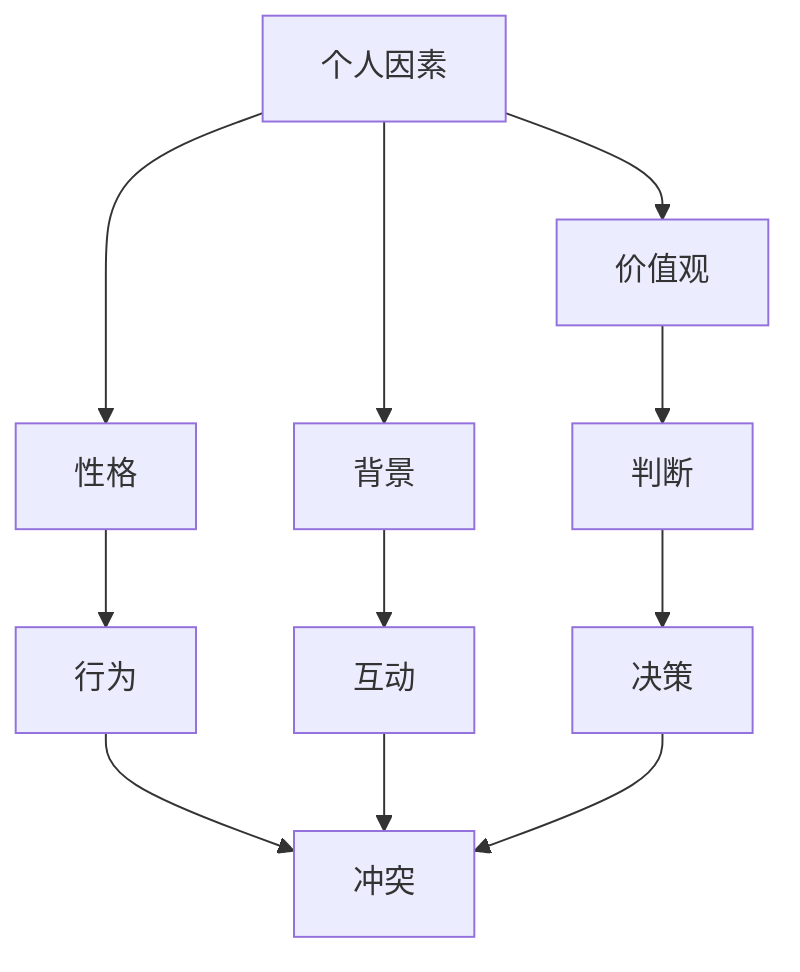

在分析个人因素时，可以通过心理学测试和问卷调查等方法来识别和量化这些因素。以下是一个简单的伪代码，用于分析个人因素：

```python
# 分析个人因素
def analyze_personality(personal_data):
    # 获取个人数据
    personality = personal_data['personality']
    values = personal_data['values']
    background = personal_data['background']
    
    # 分析个人因素
    if personality == 'high_confidence':
        behavior = 'domineering'
    else:
        behavior = 'cooperative'
    
    if values == 'achievement-oriented':
        judgment = 'rational'
    else:
        judgment = 'emotional'
    
    if background == 'different_culture':
        interaction = 'challenging'
    else:
        interaction = 'smooth'
    
    return {
        'behavior': behavior,
        'judgment': judgment,
        'interaction': interaction
    }

# 示例数据
personal_data = {
    'personality': 'high_confidence',
    'values': 'achievement-oriented',
    'background': 'different_culture'
}

# 执行分析
result = analyze_personality(personal_data)
print(result)
```

#### 1.1.2 团队文化

团队文化是团队内部的共同价值观和行为准则，对团队成员的互动和冲突有着重要影响。团队文化可以分为以下几种类型：

1. **竞争型文化**：鼓励个人竞争，强调个人成就。
2. **合作型文化**：强调团队合作，鼓励成员互相支持。
3. **权力型文化**：强调领导者的权威，成员服从领导。
4. **学习型文化**：鼓励成员不断学习和创新，重视知识分享。

使用聚类分析可以识别团队文化的不同类型。以下是一个简单的聚类分析伪代码：

```python
# 聚类分析团队文化
from sklearn.cluster import KMeans

def cluster_culture(team_data):
    # 获取团队数据
    data = team_data['data']
    
    # 分割特征和标签
    X = data.drop('culture_type', axis=1)
    y = data['culture_type']
    
    # 使用KMeans进行聚类
    kmeans = KMeans(n_clusters=4, random_state=0).fit(X)
    culture_types = kmeans.labels_
    
    return culture_types

# 示例数据
team_data = {
    'data': [
        {'achievement': 90, 'cooperation': 70, 'authority': 30, 'learning': 60},
        {'achievement': 80, 'cooperation': 80, 'authority': 40, 'learning': 70},
        {'achievement': 70, 'cooperation': 60, 'authority': 50, 'learning': 50},
        {'achievement': 60, 'cooperation': 50, 'authority': 60, 'learning': 40},
        {'achievement': 50, 'cooperation': 40, 'authority': 70, 'learning': 30},
    ]
}

# 执行聚类分析
culture_types = cluster_culture(team_data)
print(culture_types)
```

#### 1.1.3 沟通障碍

沟通障碍是冲突产生的另一个重要原因。沟通障碍可以分为语言障碍、文化差异等类型。以下是一个简单的数学模型，用于分析沟通障碍的影响。

假设有两个团队，A和B，它们之间存在语言障碍。我们可以使用以下公式来计算沟通效率：

$$
\text{Efficiency} = \frac{\text{Common Language Understanding}}{\text{Total Communication Time}}
$$

其中，Common Language Understanding 表示团队成员在共同语言下理解信息的比例，Total Communication Time 表示总通信时间。

以下是一个简单的Python示例，用于计算沟通效率：

```python
import numpy as np

def calculate_efficiency(common_understanding, total_time):
    efficiency = common_understanding / total_time
    return efficiency

# 示例数据
common_understanding = 0.8
total_time = 10

# 计算沟通效率
efficiency = calculate_efficiency(common_understanding, total_time)
print("Communication Efficiency:", efficiency)
```

### 1.2 冲突管理的基础知识

冲突管理是团队中一个重要的环节，它包括冲突的类型、目标和关键步骤。以下是对这些概念的分析。

#### 1.2.1 冲突的类型

冲突可以分为以下几种类型：

1. **功能冲突**：团队内部因为任务分配、责任划分等原因产生的冲突。
2. **情感冲突**：团队成员因为个人情感、价值观等原因产生的冲突。
3. **结构性冲突**：团队结构、流程等不合理导致的冲突。

以下是一个Mermaid流程图，展示了冲突类型的相互关系：

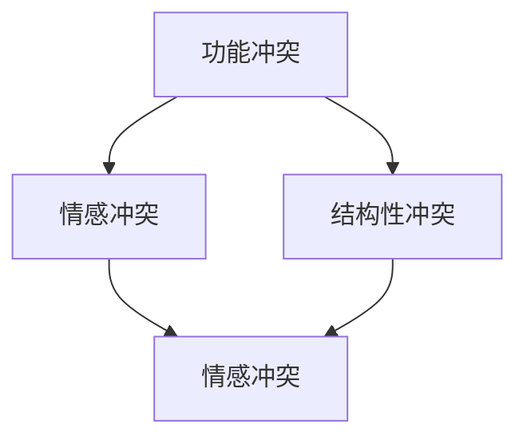

#### 1.2.2 冲突管理的目标

冲突管理的目标是减少冲突的负面影响，提高团队的协作效率。具体目标包括：

1. **解决冲突**：找到冲突的原因，提出解决方案。
2. **预防冲突**：通过团队建设、沟通技巧等方式，减少冲突的发生。
3. **转化冲突**：将冲突转化为团队的动力，激发创新和改进。

以下是一个Mermaid流程图，展示了冲突管理的目标之间的关系：

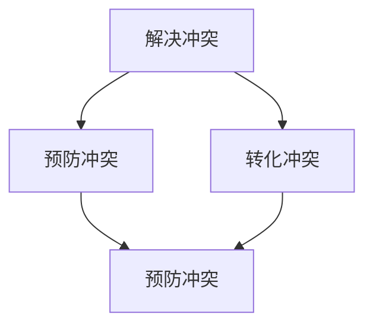

#### 1.2.3 冲突管理的关键步骤

冲突管理包括以下几个关键步骤：

1. **识别冲突**：发现团队中的冲突迹象，如成员之间的争吵、情绪波动等。
2. **分析冲突**：了解冲突的原因，包括个人因素、团队文化和沟通障碍等。
3. **解决冲突**：提出解决方案，包括调整团队结构、改进沟通机制等。
4. **评估效果**：对冲突解决的效果进行评估，持续改进冲突管理策略。

以下是一个Mermaid流程图，展示了冲突管理的关键步骤：

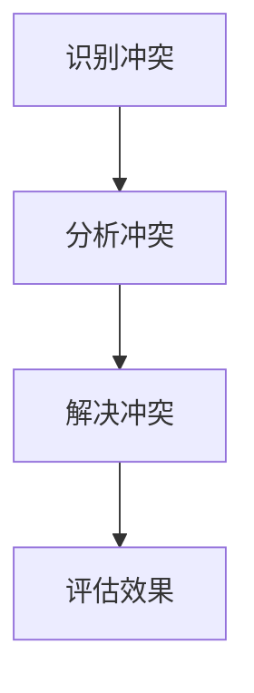

## 第2章：建立有效的沟通机制

### 2.1 沟通技巧提升

有效的沟通是解决团队冲突的关键。以下是一些提升沟通技巧的方法：

#### 2.1.1 倾听的艺术

倾听是沟通的重要组成部分。以下是一些倾听的技巧：

1. **全神贯注**：在对方讲话时，保持专注，避免分心。
2. **肢体语言**：通过点头、微笑等肢体语言，表达关注和理解。
3. **积极回应**：通过提问、复述等方式，表明你在倾听。

以下是一个Mermaid流程图，展示了倾听的技巧：

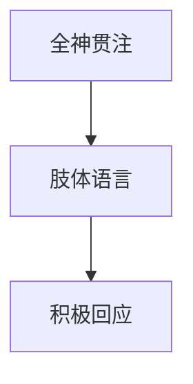

#### 2.1.2 表达清晰的技巧

清晰的表达可以避免误解和冲突。以下是一些表达清晰的技巧：

1. **明确目标**：在沟通前，明确沟通的目标和要点。
2. **简洁表达**：用简单的语言表达复杂的信息，避免使用专业术语。
3. **避免假设**：在表达时，明确表达自己的观点和假设，避免对方误解。

以下是一个Mermaid流程图，展示了表达清晰的技巧：

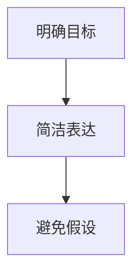

#### 2.1.3 提升反馈质量

反馈是沟通的重要组成部分。以下是一些提升反馈质量的方法：

1. **具体而明确**：在提供反馈时，具体说明优点和需要改进的地方。
2. **及时反馈**：在问题发生时，及时提供反馈，避免拖延。
3. **建设性反馈**：提供建设性的建议，帮助对方改进。

以下是一个Mermaid流程图，展示了提升反馈质量的方法：

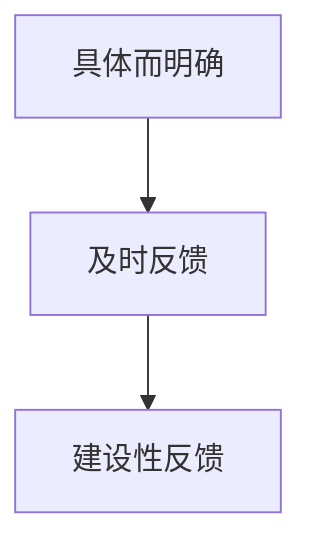

### 2.2 消除沟通障碍

沟通障碍是团队冲突的一个重要原因。以下是一些消除沟通障碍的方法：

#### 2.2.1 语言障碍

语言障碍可以通过以下方法消除：

1. **共同语言**：在团队中确定一种共同语言，避免语言障碍。
2. **翻译支持**：在需要时，提供翻译支持，确保沟通顺畅。
3. **语言培训**：为团队成员提供语言培训，提高语言能力。

以下是一个Mermaid流程图，展示了消除语言障碍的方法：

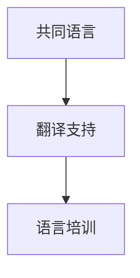

#### 2.2.2 非语言沟通

非语言沟通在团队沟通中也非常重要。以下是一些提高非语言沟通效果的方法：

1. **肢体语言**：通过肢体语言表达情感和态度，增强沟通效果。
2. **面部表情**：保持真诚的面部表情，表达情感和态度。
3. **环境布局**：创造一个舒适的沟通环境，减少干扰。

以下是一个Mermaid流程图，展示了提高非语言沟通效果的方法：

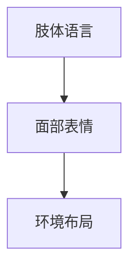

#### 2.2.3 跨文化沟通

跨文化沟通是团队沟通中的一个重要方面。以下是一些提高跨文化沟通效果的方法：

1. **文化培训**：为团队成员提供跨文化培训，提高对其他文化的理解和尊重。
2. **开放心态**：保持开放的心态，尊重和理解其他文化的差异。
3. **沟通策略**：使用适当的沟通策略，如使用故事、比喻等，来提高跨文化沟通的效果。

以下是一个Mermaid流程图，展示了提高跨文化沟通效果的方法：

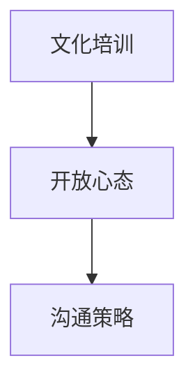

## 第3章：团队建设策略

### 3.1 建立共同目标

共同目标是团队协作的基础。以下是如何建立共同目标的方法：

#### 3.1.1 目标设定的原则

在设定目标时，应遵循以下原则：

1. **明确性**：目标应明确、具体，避免模糊不清。
2. **可衡量性**：目标应可衡量，以便跟踪进展。
3. **可实现性**：目标应具有挑战性，但也要确保可实现。
4. **相关性**：目标应与团队的使命和愿景相关。

以下是一个Mermaid流程图，展示了目标设定的原则：

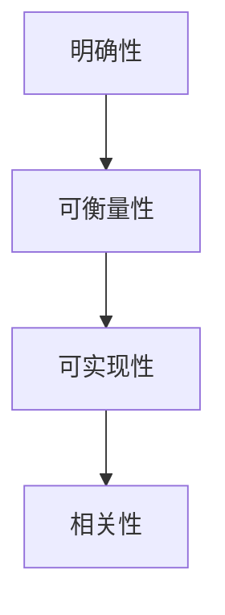

#### 3.1.2 如何引导团队共同设定目标

以下步骤可以引导团队共同设定目标：

1. **团队讨论**：组织团队讨论，让每个成员表达自己的目标和想法。
2. **目标筛选**：根据团队讨论的结果，筛选出最重要的目标。
3. **目标分解**：将大目标分解为可操作的小目标，确保每个成员都有明确的责任。
4. **目标确认**：确保所有成员都同意设定的目标，并明确各自的责任。

以下是一个Mermaid流程图，展示了引导团队共同设定目标的步骤：

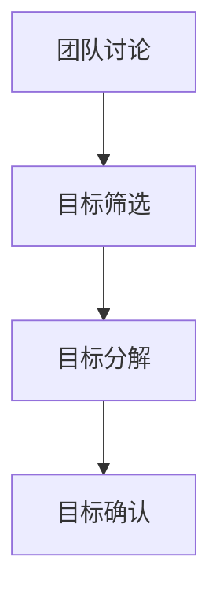

#### 3.1.3 目标追踪与调整

在目标设定后，应定期追踪目标的进展，并根据情况进行调整。以下是一些方法：

1. **定期会议**：定期召开团队会议，讨论目标的进展和遇到的问题。
2. **进度报告**：要求团队成员定期提交进度报告，确保所有人都了解进展。
3. **灵活调整**：根据目标的进展和外部环境的变化，灵活调整目标。

以下是一个Mermaid流程图，展示了目标追踪与调整的方法：

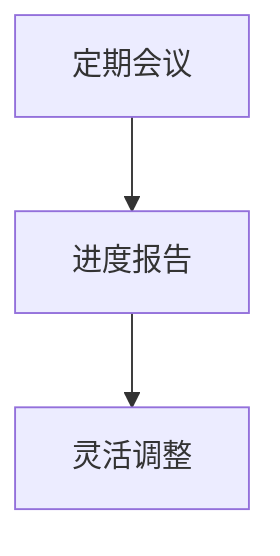

### 3.2 提升团队协作

#### 3.2.1 团队角色与职责分配

团队角色与职责分配是提升团队协作的重要环节。以下是一些方法：

1. **角色识别**：识别每个团队成员的角色，确保每个角色都有明确的职责。
2. **职责分配**：根据团队成员的能力和兴趣，合理分配职责。
3. **角色确认**：确保所有团队成员都清楚自己的角色和职责。

以下是一个Mermaid流程图，展示了团队角色与职责分配的方法：

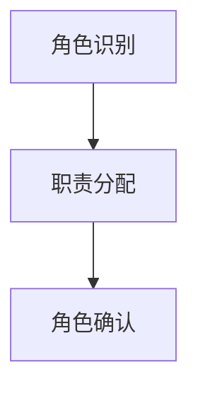

#### 3.2.2 团队角色冲突解决

在团队协作过程中，角色冲突可能会发生。以下是一些解决方法：

1. **沟通**：通过沟通，了解冲突的原因和各方观点。
2. **协商**：各方协商，寻找共同点和解决方案。
3. **调解**：如果冲突无法自行解决，可寻求第三方调解。

以下是一个Mermaid流程图，展示了团队角色冲突解决的方法：

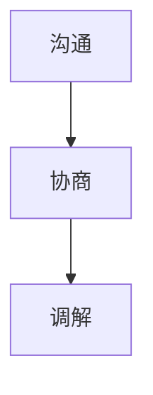

#### 3.2.3 促进团队合作的策略

以下是一些促进团队合作的策略：

1. **共同目标**：确保团队成员都有共同的目标，激发团队合作的动力。
2. **信任建设**：通过团队活动和培训，增强团队成员之间的信任。
3. **知识共享**：鼓励团队成员分享知识和经验，提高团队整体能力。
4. **正面反馈**：对团队成员的成就和贡献给予正面反馈，增强团队凝聚力。

以下是一个Mermaid流程图，展示了促进团队合作的方法：

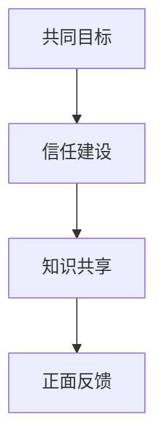

## 第4章：冲突解决方法与实践

### 4.1 冲突解决的策略

解决团队冲突需要采取一系列策略。以下是一些常见的冲突解决策略：

#### 4.1.1 避免冲突

避免冲突是最简单的策略，但并非总是可行。以下是一些避免冲突的方法：

1. **提前沟通**：在冲突发生前，提前沟通，避免误解和冲突。
2. **明确界限**：明确团队中的职责和界限，避免因职责不清而产生的冲突。
3. **避免敏感话题**：在团队沟通中，尽量避免讨论敏感话题。

以下是一个Mermaid流程图，展示了避免冲突的方法：

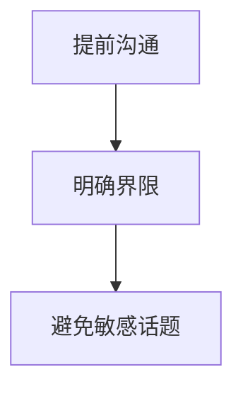

#### 4.1.2 接受冲突

有时，冲突是无法避免的。在这种情况下，接受冲突并寻求解决方案是必要的。以下是一些接受冲突的方法：

1. **保持冷静**：在冲突发生时，保持冷静，避免情绪化。
2. **倾听各方观点**：倾听冲突各方的观点，了解问题的全貌。
3. **寻求共识**：在理解各方观点后，寻求共识，找到解决方案。

以下是一个Mermaid流程图，展示了接受冲突的方法：

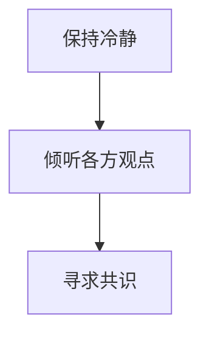

#### 4.1.3 解决冲突

解决冲突是冲突管理的核心。以下是一些解决冲突的方法：

1. **直接对话**：直接与冲突方对话，解决问题。
2. **第三方调解**：如果直接对话无法解决问题，可寻求第三方调解。
3. **妥协和协商**：在无法达成一致时，通过妥协和协商找到解决方案。

以下是一个Mermaid流程图，展示了解决冲突的方法：

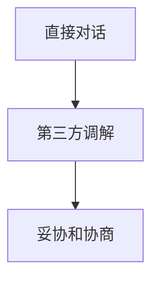

#### 4.1.4 转化冲突为动力

冲突并不总是负面的，有时可以转化为团队的动力。以下是一些转化冲突为动力的方法：

1. **反思和改进**：通过冲突，反思团队的工作流程和策略，进行改进。
2. **创新和探索**：在冲突中，鼓励团队成员创新和探索新的解决方案。
3. **增强团队凝聚力**：通过解决冲突，增强团队成员之间的凝聚力。

以下是一个Mermaid流程图，展示了转化冲突为动力的方法：

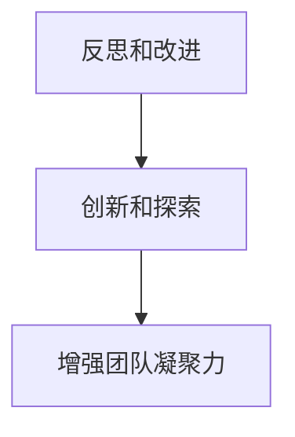

### 4.2 案例分析

#### 4.2.1 团队内部的冲突案例

以下是一个团队内部冲突的案例分析：

**案例背景**：一家软件开发公司的团队在项目开发过程中发生了冲突。

**冲突原因**：团队成员在任务分配和责任划分上存在分歧，部分成员认为任务分配不公平，导致工作负担不均。

**解决方案**：

1. **直接对话**：团队成员进行直接对话，表达各自的看法和担忧。
2. **第三方调解**：邀请项目经理作为第三方调解人，帮助双方找到共同点。
3. **调整任务分配**：根据团队成员的能力和兴趣，重新分配任务，确保工作负担公平。

**案例结果**：通过直接对话和第三方调解，团队成员达成了共识，任务分配得到了调整，冲突得到解决，团队协作效率提高。

#### 4.2.2 团队与上级的冲突案例

以下是一个团队与上级冲突的案例分析：

**案例背景**：一家公司的团队在项目推进过程中，与上级产生了冲突。

**冲突原因**：团队成员认为上级在项目进度和资源分配上存在不合理之处，导致项目进展受阻。

**解决方案**：

1. **倾听上级观点**：团队成员主动倾听上级的观点和担忧，了解上级的决策依据。
2. **寻求共识**：与上级沟通，寻求共识，找到双方都能接受的解决方案。
3. **调整项目计划**：根据上级的反馈，调整项目计划，确保项目能够顺利进行。

**案例结果**：通过沟通和协商，团队成员与上级达成了共识，项目计划得到了调整，冲突得到解决，项目进展顺利。

#### 4.2.3 跨部门的冲突案例

以下是一个跨部门冲突的案例分析：

**案例背景**：一家公司的不同部门在项目合作过程中发生了冲突。

**冲突原因**：各部门在项目目标和资源分配上存在分歧，导致项目进展受阻。

**解决方案**：

1. **明确项目目标**：组织跨部门会议，明确项目的目标和各方的责任。
2. **沟通与协作**：建立跨部门沟通机制，确保各部门之间的信息畅通。
3. **资源协调**：根据项目需要，协调各部门的资源，确保项目能够顺利进行。

**案例结果**：通过明确项目目标和建立沟通机制，各部门之间的协作得到改善，冲突得到解决，项目进展顺利。

## 第5章：领导者角色在冲突解决中的关键作用

### 5.1 领导者的冲突管理能力

领导者是团队中冲突管理的核心人物。以下是一些领导者冲突管理能力的要点：

#### 5.1.1 领导者的冲突管理责任

领导者的冲突管理责任包括：

1. **识别冲突**：及时发现团队中的冲突迹象，了解冲突的原因。
2. **解决冲突**：采取措施解决团队中的冲突，确保团队的和谐与稳定。
3. **预防冲突**：通过团队建设和管理，预防冲突的发生。

以下是一个Mermaid流程图，展示了领导者的冲突管理责任：

```mermaid
graph TD
    A[识别冲突] --> B[解决冲突]
    B --> C[预防冲突]
```

#### 5.1.2 领导者如何识别冲突

领导者识别冲突的方法包括：

1. **观察**：通过观察团队成员的行为和互动，了解冲突的迹象。
2. **倾听**：倾听团队成员的意见和反馈，了解冲突的原因。
3. **调查**：对冲突进行深入调查，了解冲突的具体情况。

以下是一个Mermaid流程图，展示了领导者如何识别冲突：

```mermaid
graph TD
    A[观察] --> B[倾听]
    B --> C[调查]
```

#### 5.1.3 领导者如何应对冲突

领导者应对冲突的方法包括：

1. **直接对话**：与冲突方进行直接对话，解决问题。
2. **第三方调解**：在冲突无法自行解决时，寻求第三方调解。
3. **建立共识**：通过沟通和协商，建立共识，找到解决方案。

以下是一个Mermaid流程图，展示了领导者如何应对冲突：

```mermaid
graph TD
    A[直接对话] --> B[第三方调解]
    B --> C[建立共识]
```

### 5.2 培养团队成员的冲突解决能力

领导者不仅需要自己具备冲突管理能力，还需要培养团队成员的冲突解决能力。以下是一些方法：

#### 5.2.1 提升团队成员的沟通技巧

提升团队成员的沟通技巧包括：

1. **培训**：为团队成员提供沟通技巧培训，提高沟通能力。
2. **实践**：鼓励团队成员在项目中实践沟通技巧，提高沟通效果。
3. **反馈**：对团队成员的沟通效果进行反馈，帮助他们改进。

以下是一个Mermaid流程图，展示了提升团队成员沟通技巧的方法：

```mermaid
graph TD
    A[培训] --> B[实践]
    B --> C[反馈]
```

#### 5.2.2 建立冲突解决的培训计划

建立冲突解决的培训计划包括：

1. **培训内容**：制定冲突解决的培训内容，包括沟通技巧、冲突管理策略等。
2. **培训方式**：选择合适的培训方式，如线上课程、工作坊等。
3. **培训评估**：对培训效果进行评估，确保培训目标的实现。

以下是一个Mermaid流程图，展示了建立冲突解决的培训计划：

```mermaid
graph TD
    A[培训内容] --> B[培训方式]
    B --> C[培训评估]
```

#### 5.2.3 创造一个开放的氛围

创造一个开放的氛围是培养团队成员冲突解决能力的重要条件。以下是一些方法：

1. **鼓励反馈**：鼓励团队成员提出意见和建议，创造一个开放的沟通环境。
2. **透明管理**：在团队管理中保持透明，让团队成员了解团队的情况和决策过程。
3. **冲突解决机制**：建立冲突解决机制，让团队成员在面对冲突时知道如何处理。

以下是一个Mermaid流程图，展示了创造一个开放的氛围的方法：

```mermaid
graph TD
    A[鼓励反馈] --> B[透明管理]
    B --> C[冲突解决机制]
```

## 第6章：团队外部冲突处理

### 6.1 客户关系管理

团队外部冲突的一个重要方面是与客户的冲突管理。以下是如何管理客户关系，解决客户冲突的方法：

#### 6.1.1 客户冲突的类型

客户冲突可以分为以下几种类型：

1. **需求冲突**：客户的需求与团队提供的产品或服务存在分歧。
2. **服务冲突**：客户对团队提供的服务质量不满意。
3. **信任冲突**：客户对团队的能力和诚信产生怀疑。

以下是一个Mermaid流程图，展示了客户冲突的类型：

```mermaid
graph TD
    A[需求冲突] --> B[服务冲突]
    B --> C[信任冲突]
```

#### 6.1.2 客户冲突的解决策略

以下是一些解决客户冲突的策略：

1. **倾听**：倾听客户的需求和抱怨，了解客户的具体问题。
2. **协商**：与客户协商，寻找双方都能接受的解决方案。
3. **补偿**：在必要时，提供补偿，如退款、优惠等，以解决客户的抱怨。

以下是一个Mermaid流程图，展示了客户冲突的解决策略：

```mermaid
graph TD
    A[倾听] --> B[协商]
    B --> C[补偿]
```

#### 6.1.3 建立良好的客户关系

建立良好的客户关系是减少客户冲突的重要手段。以下是一些建立良好客户关系的方法：

1. **定期沟通**：定期与客户沟通，了解客户的需求和意见。
2. **个性化服务**：根据客户的需求，提供个性化的服务。
3. **信任建设**：通过诚信和专业，建立客户的信任。

以下是一个Mermaid流程图，展示了建立良好客户关系的方法：

```mermaid
graph TD
    A[定期沟通] --> B[个性化服务]
    B --> C[信任建设]
```

### 6.2 与供应商的合作与冲突

与供应商的合作和冲突管理是团队外部冲突的另一个重要方面。以下是如何与供应商合作，解决供应商冲突的方法：

#### 6.2.1 供应商冲突的常见原因

供应商冲突的常见原因包括：

1. **质量冲突**：供应商提供的产品或服务质量不符合要求。
2. **交货冲突**：供应商未能按时交货。
3. **价格冲突**：供应商的价格与团队的预期不符。

以下是一个Mermaid流程图，展示了供应商冲突的常见原因：

```mermaid
graph TD
    A[质量冲突] --> B[交货冲突]
    B --> C[价格冲突]
```

#### 6.2.2 供应商冲突的解决方法

以下是一些解决供应商冲突的方法：

1. **协商**：与供应商协商，寻找双方都能接受的解决方案。
2. **沟通**：加强与供应商的沟通，确保信息的畅通。
3. **合同管理**：通过合同管理，明确双方的责任和义务。

以下是一个Mermaid流程图，展示了供应商冲突的解决方法：

```mermaid
graph TD
    A[协商] --> B[沟通]
    B --> C[合同管理]
```

#### 6.2.3 建立长期合作伙伴关系

建立长期合作伙伴关系是减少供应商冲突的重要手段。以下是一些建立长期合作伙伴关系的方法：

1. **信任建设**：通过诚信和合作，建立供应商的信任。
2. **合作共赢**：与供应商建立共赢的合作模式，确保双方都能获得利益。
3. **持续改进**：与供应商一起持续改进产品质量和服务水平。

以下是一个Mermaid流程图，展示了建立长期合作伙伴关系的方法：

```mermaid
graph TD
    A[信任建设] --> B[合作共赢]
    B --> C[持续改进]
```

## 第7章：持续改进与成长

### 7.1 反思与评估

持续改进是团队发展的重要一环。以下是如何进行反思与评估的方法：

#### 7.1.1 冲突解决效果评估

对冲突解决效果进行评估是确保改进措施有效性的关键。以下是一些评估方法：

1. **反馈机制**：建立反馈机制，收集团队成员对冲突解决效果的反馈。
2. **数据统计**：通过数据统计，分析冲突解决前后团队的表现和效率。
3. **员工满意度调查**：进行员工满意度调查，了解团队成员对冲突解决的满意度和建议。

以下是一个Mermaid流程图，展示了冲突解决效果评估的方法：

```mermaid
graph TD
    A[反馈机制] --> B[数据统计]
    B --> C[员工满意度调查]
```

#### 7.1.2 反思冲突解决的不足

反思冲突解决的不足是持续改进的基础。以下是一些反思的方法：

1. **团队讨论**：定期召开团队讨论会议，反思冲突解决的不足。
2. **自我评估**：团队成员进行自我评估，找出自身的不足。
3. **第三方评估**：邀请第三方对冲突解决过程进行评估，提供外部视角。

以下是一个Mermaid流程图，展示了反思冲突解决的不足的方法：

```mermaid
graph TD
    A[团队讨论] --> B[自我评估]
    B --> C[第三方评估]
```

#### 7.1.3 提出改进措施

在反思的基础上，提出改进措施是持续改进的关键。以下是一些提出改进措施的方法：

1. **制定计划**：根据反思结果，制定具体的改进计划。
2. **责任分配**：明确改进措施的责任人，确保改进措施的执行。
3. **跟踪执行**：对改进措施进行跟踪，确保其得到有效执行。

以下是一个Mermaid流程图，展示了提出改进措施的方法：

```mermaid
graph TD
    A[制定计划] --> B[责任分配]
    B --> C[跟踪执行]
```

### 7.2 个人成长与团队发展

个人成长和团队发展是团队持续改进的重要组成部分。以下是一些促进个人成长和团队发展的方法：

#### 7.2.1 个人技能提升

个人技能提升是个人成长的关键。以下是一些方法：

1. **培训**：参加专业培训，提高个人技能。
2. **学习**：阅读专业书籍，学习新知识。
3. **实践**：在实际工作中，运用所学知识，提高个人技能。

以下是一个Mermaid流程图，展示了个人技能提升的方法：

```mermaid
graph TD
    A[培训] --> B[学习]
    B --> C[实践]
```

#### 7.2.2 团队建设与持续改进

团队建设与持续改进是团队发展的关键。以下是一些团队建设的方法：

1. **团队活动**：组织团队活动，增强团队凝聚力。
2. **知识共享**：建立知识共享平台，促进团队成员之间的知识交流。
3. **反馈机制**：建立反馈机制，及时了解团队建设的情况和改进方向。

以下是一个Mermaid流程图，展示了团队建设的方法：

```mermaid
graph TD
    A[团队活动] --> B[知识共享]
    B --> C[反馈机制]
```

#### 7.2.3 培养团队的应变能力

培养团队的应变能力是团队发展的重要方面。以下是一些方法：

1. **模拟演练**：组织模拟演练，提高团队的应对能力。
2. **经验分享**：鼓励团队成员分享经验，提高团队的应对能力。
3. **灵活调整**：在面对突发情况时，灵活调整计划和策略。

以下是一个Mermaid流程图，展示了培养团队的应变能力的方法：

```mermaid
graph TD
    A[模拟演练] --> B[经验分享]
    B --> C[灵活调整]
```

## 结语

本文从冲突解决的基石、沟通机制、团队建设、领导者角色、团队外部冲突处理以及持续改进与成长等多个方面，详细探讨了团队冲突的解决技巧。通过本文的阅读，读者可以掌握化解团队矛盾的方法，提升团队协作效率。在实际工作中，团队管理者应灵活运用这些技巧，创造一个和谐、高效的团队环境。

### 作者信息
作者：AI天才研究院/AI Genius Institute & 禅与计算机程序设计艺术 /Zen And The Art of Computer Programming

