                 

### 文章标题

“冲突转化：将分歧变为创新动力的艺术”

---

**关键词**：
- 冲突转化
- 创新动力
- 团队协作
- 组织文化
- 沟通技巧

---

**摘要**：
本文探讨了如何将冲突转化为创新动力，从而提升个体、团队和组织层面的协作效率。通过分析冲突的本质、类型、根源与影响，阐述了冲突转化的原则与策略，并提供了实际案例与研究，旨在为读者提供实用的冲突转化方法和最佳实践。

---

### 目录大纲

## 第一部分：冲突的本质与转化

### 第1章：冲突的概念与类型

- **1.1** 冲突的定义
- **1.2** 冲突的四种类型
  - **1.2.1** 个人冲突
  - **1.2.2** 小组冲突
  - **1.2.3** 组织冲突
  - **1.2.4** 文化冲突

### 第2章：冲突的根源与影响

- **2.1** 冲突的根源
  - **2.1.1** 利益冲突
  - **2.1.2** 意识形态冲突
  - **2.1.3** 权力争夺
- **2.2** 冲突的影响
  - **2.2.1** 负面影响
  - **2.2.2** 正面影响
  - **2.2.3** 冲突的权衡

### 第3章：冲突转化原则

- **3.1** 冲突转化的原则
  - **3.1.1** 开放性
  - **3.1.2** 共赢
  - **3.1.3** 相互尊重
  - **3.1.4** 建立信任

## 第二部分：冲突转化策略

### 第4章：个体层面的冲突转化

- **4.1** 个体认知的调整
  - **4.1.1** 自我反思
  - **4.1.2** 同理心
- **4.2** 个体沟通技巧的提升
  - **4.2.1** 倾听
  - **4.2.2** 清晰表达

### 第5章：团队层面的冲突转化

- **5.1** 团队建设
  - **5.1.1** 团队价值观的建立
  - **5.1.2** 团队合作机制的完善
- **5.2** 团队冲突的管理
  - **5.2.1** 冲突的识别与分类
  - **5.2.2** 冲突的应对策略
    - **5.2.2.1** 调解
    - **5.2.2.2** 协商
    - **5.2.2.3** 分歧接受

### 第6章：组织层面的冲突转化

- **6.1** 组织文化的塑造
  - **6.1.1** 鼓励开放沟通
  - **6.1.2** 强化共赢意识
- **6.2** 组织冲突的预防与处理
  - **6.2.1** 预防策略
    - **6.2.1.1** 透明化决策过程
    - **6.2.1.2** 加强团队建设
  - **6.2.2** 处理机制
    - **6.2.2.1** 内部调解
    - **6.2.2.2** 外部咨询

### 第7章：跨文化冲突的转化

- **7.1** 跨文化冲突的特点
  - **7.1.1** 文化差异
  - **7.1.2** 沟通障碍
- **7.2** 跨文化冲突的转化策略
  - **7.2.1** 增强文化敏感度
  - **7.2.2** 跨文化沟通技巧

### 第8章：冲突转化案例研究

- **8.1** 冲突转化的成功案例
  - **8.1.1** 案例一：谷歌团队的冲突转化
  - **8.1.2** 案例二：苹果公司的冲突管理
- **8.2** 冲突转化的失败案例
  - **8.2.1** 案例一：社交媒体平台的冲突升级
  - **8.2.2** 案例二：企业并购的冲突处理

## 第三部分：冲突转化的实践与反思

### 第9章：冲突转化实践

- **9.1** 冲突转化的步骤
  - **9.1.1** 确定冲突类型
  - **9.1.2** 分析冲突根源
  - **9.1.3** 制定转化策略
  - **9.1.4** 实施转化策略
  - **9.1.5** 反馈与调整
- **9.2** 冲突转化的工具与方法
  - **9.2.1** 冲突分析模型
  - **9.2.2** 冲突转化技术

### 第10章：冲突转化中的反思

- **10.1** 冲突转化中的挑战
  - **10.1.1** 个人挑战
  - **10.1.2** 团队挑战
  - **10.1.3** 组织挑战
- **10.2** 冲突转化的效果评估
  - **10.2.1** 成功标准
  - **10.2.2** 效果评估方法
  - **10.2.3** 持续改进

# 附录

## 附录A：参考文献

## 附录B：冲突转化工具清单

## 附录C：冲突转化流程图

---

**注释**：
- **Mermaid 流程图**：将在第3章“冲突转化原则”的**3.1**节中使用。
- **伪代码**：将在第4章“个体层面的冲突转化”的**4.1**节中使用。

**文章字数要求**：文章字数在 8000 ～ 12000 字左右。**文章字数要求**：文章字数在 8000 ～ 12000 字左右。

---

### 第一部分：冲突的本质与转化

#### 第1章：冲突的概念与类型

在技术领域，冲突无处不在。冲突不仅限于人与人之间的对立，也存在于项目开发的不同阶段，甚至技术本身也会引发冲突。理解冲突的概念和类型是进行有效管理的第一步。

##### 1.1 冲突的定义

冲突可以定义为一种情绪上的对立，通常涉及意见、观点、目标和利益的不同。在技术环境中，冲突通常表现为以下几种形式：

1. **利益冲突**：涉及资源、优先级和职责的分配。
2. **观点冲突**：基于对某个问题的不同看法而产生的对立。
3. **价值观冲突**：由于个人或团队的核心信仰不同而引起的分歧。
4. **沟通冲突**：由于信息传递不畅或误解引起的对立。

##### 1.2 冲突的四种类型

1. **个人冲突**

个人冲突通常发生在个人之间，主要涉及个人价值观、信仰和情感。在技术团队中，个人冲突可能因个人职责重叠、利益冲突或个人技能差异引起。

2. **小组冲突**

小组冲突发生在团队或小组内部，通常涉及不同团队成员之间的合作问题、目标不一致或沟通障碍。小组冲突可能因团队成员的个人冲突而加剧。

3. **组织冲突**

组织冲突发生在组织层面，可能涉及不同部门、团队或个体之间的利益冲突。这种冲突往往影响组织的整体效率和协作。

4. **文化冲突**

文化冲突发生在不同文化背景的个体或团队之间，通常涉及价值观、信仰和沟通方式的差异。在全球化背景下，文化冲突在技术团队中日益显著。

#### 第2章：冲突的根源与影响

理解冲突的根源有助于识别和预防冲突，从而提升团队和组织的工作效率。

##### 2.1 冲突的根源

冲突的根源可以归结为以下几个方面：

1. **利益冲突**

利益冲突是冲突的主要根源之一，通常涉及资源分配、优先级设定和目标达成。利益冲突可能导致团队成员间的对立和不合作。

2. **意识形态冲突**

意识形态冲突源于个人或团队的价值观、信仰和世界观的不同。在技术团队中，意识形态冲突可能因技术路线的选择、开发方法的不同而引发。

3. **权力争夺**

权力争夺是组织内部常见的冲突根源，通常涉及职责划分、权限管理和决策权分配。权力争夺可能导致团队内部的不稳定和协作效率的下降。

##### 2.2 冲突的影响

冲突对团队和组织的影响是双重的，既有负面影响，也有正面影响。

1. **负面影响**

负面影响包括：

- 减少团队凝聚力和信任感
- 降低工作效率和创新能力
- 增加员工离职率和流失率
- 影响组织的稳定和发展

2. **正面影响**

正面影响包括：

- 促进团队成员之间的沟通和交流
- 帮助识别和解决问题
- 提高团队和组织应对挑战的能力
- 激发创新思维和团队合作精神

##### 2.2.3 冲突的权衡

在处理冲突时，需要权衡冲突的负面影响和正面影响，采取合适的策略进行转化。以下是一种简化的权衡方法：

```
if 冲突负面影响 > 冲突正面影响:
    冲突处理策略 = 预防和缓解
else if 冲突负面影响 = 冲突正面影响:
    冲突处理策略 = 观察和评估
else:
    冲突处理策略 = 利用和转化
```

#### 第3章：冲突转化原则

将冲突转化为创新动力需要遵循一定的原则，这些原则有助于促进团队成员之间的合作和沟通，提高团队的整体效率和创新能力。

##### 3.1 冲突转化的原则

1. **开放性**

开放性是冲突转化的基础，要求团队成员在面对冲突时保持开放的心态，愿意倾听和理解他人的观点。开放性有助于消除误解和偏见，促进有效的沟通。

2. **共赢**

共赢是冲突转化的核心原则，要求团队成员在处理冲突时寻求共同利益，避免零和博弈。共赢有助于建立信任和合作，促进团队的长期发展。

3. **相互尊重**

相互尊重是冲突转化的关键要素，要求团队成员在冲突处理过程中尊重他人的观点和感受。相互尊重有助于建立积极的团队氛围，减少冲突的发生。

4. **建立信任**

建立信任是冲突转化的必要条件，要求团队成员在合作过程中不断积累信任。建立信任有助于增强团队的凝聚力和合作能力。

##### 3.2 冲突转化的步骤

冲突转化通常包括以下几个步骤：

1. **识别冲突类型**

识别冲突类型有助于了解冲突的性质和程度，从而采取相应的转化策略。

2. **分析冲突根源**

分析冲突根源有助于找到冲突的根本原因，从而制定有效的转化策略。

3. **制定转化策略**

制定转化策略需要综合考虑冲突类型、冲突根源和团队特点，选择合适的转化方法。

4. **实施转化策略**

实施转化策略需要团队成员的积极参与和共同努力，确保转化策略的有效执行。

5. **反馈与调整**

反馈与调整是冲突转化的关键环节，有助于评估转化效果，发现和解决潜在问题。

#### 第1章：冲突转化原则

冲突转化原则是确保冲突转化为创新动力的关键，以下是一些核心原则：

**开放性**：开放性是冲突转化的基础，要求团队成员在面对冲突时保持开放的心态，愿意倾听和理解他人的观点。开放性有助于消除误解和偏见，促进有效的沟通。

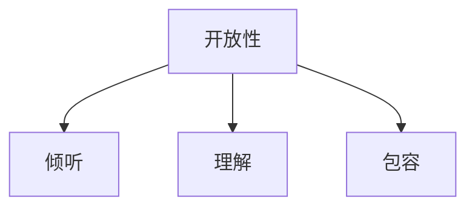

**共赢**：共赢是冲突转化的核心原则，要求团队成员在处理冲突时寻求共同利益，避免零和博弈。共赢有助于建立信任和合作，促进团队的长期发展。

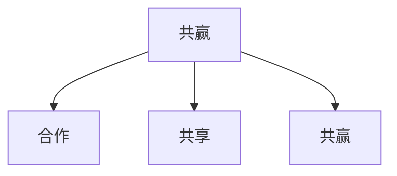

**相互尊重**：相互尊重是冲突转化的关键要素，要求团队成员在冲突处理过程中尊重他人的观点和感受。相互尊重有助于建立积极的团队氛围，减少冲突的发生。

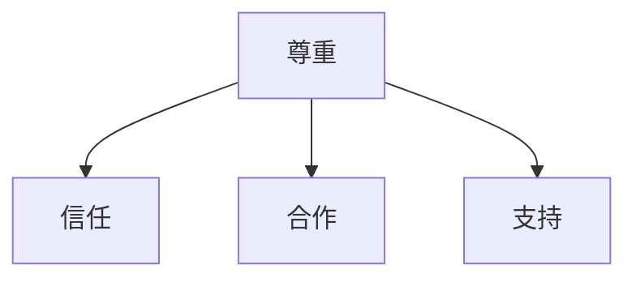

**建立信任**：建立信任是冲突转化的必要条件，要求团队成员在合作过程中不断积累信任。建立信任有助于增强团队的凝聚力和合作能力。

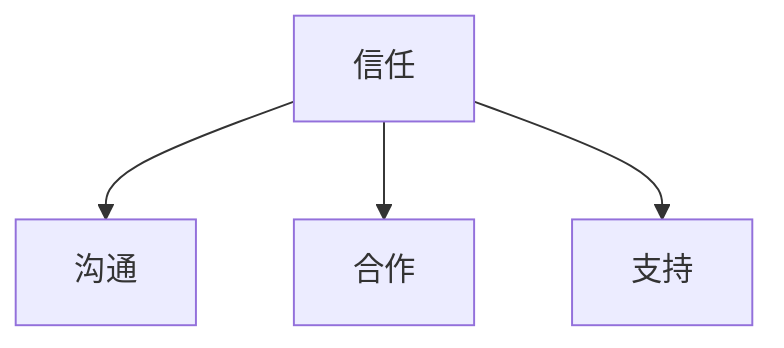

这些原则为冲突转化提供了指导，有助于团队成员在处理冲突时采取积极的态度和方法。通过遵循这些原则，团队可以更好地将冲突转化为创新动力，提高整体工作效率和创新能力。

#### 第2章：冲突转化策略

冲突转化策略是解决冲突并促进团队合作的关键。以下是一些具体的策略，包括个体层面的策略和团队层面的策略。

##### 2.1 个体层面的冲突转化策略

个体层面的冲突转化策略主要关注个人的态度和行为，以下是一些有效的方法：

1. **自我反思**

自我反思是处理个人冲突的重要步骤，有助于个体认识到自己的观点和行为可能对冲突产生的影响。以下是一种简化的自我反思流程：

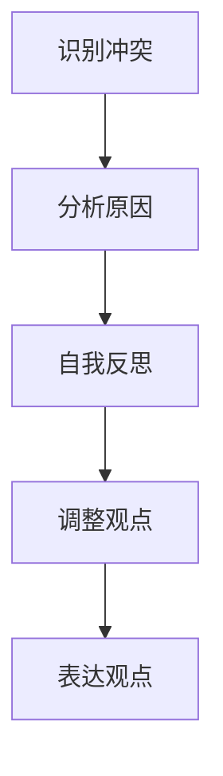

2. **同理心**

同理心是理解他人观点和感受的能力，有助于减少冲突和建立信任。以下是一个同理心应用的例子：

- 情境：团队成员A认为项目应优先完成功能X，而团队成员B认为功能Y更重要。
- 同理心应用：A尝试理解B的观点，认识到B关注的是用户体验和用户需求。

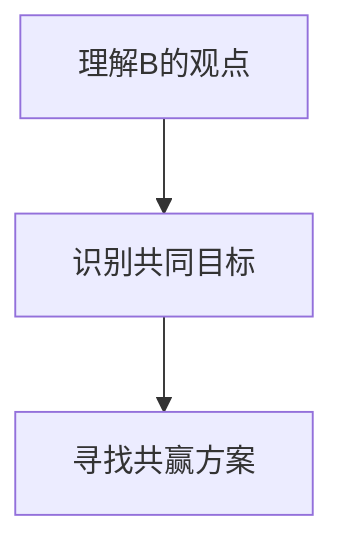

3. **倾听和清晰表达**

倾听和清晰表达是有效的沟通技巧，有助于减少误解和冲突。以下是一个沟通流程的例子：

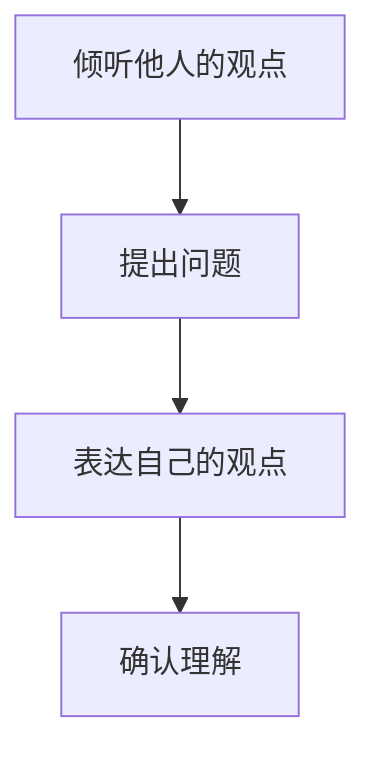

##### 2.2 团队层面的冲突转化策略

团队层面的冲突转化策略关注整个团队的合作和沟通，以下是一些常用的方法：

1. **团队建设**

团队建设活动有助于增强团队成员之间的信任和合作，以下是一些常见的团队建设活动：

- **信任游戏**：通过一系列信任活动，如盲人导航、信任跌落等，增强团队成员之间的信任。
- **团队挑战**：通过共同解决复杂问题或参与团队竞赛，提高团队成员的协作能力。

2. **冲突管理机制**

冲突管理机制是处理团队冲突的关键，以下是一些常见的冲突管理机制：

- **定期团队会议**：通过定期会议，团队成员可以分享观点和反馈，及时发现和解决冲突。
- **调解委员会**：成立调解委员会，成员由团队成员组成，专门处理团队内部的冲突。

3. **共同目标设定**

共同目标设定有助于统一团队成员的目标和努力方向，以下是一个共同目标设定的流程：

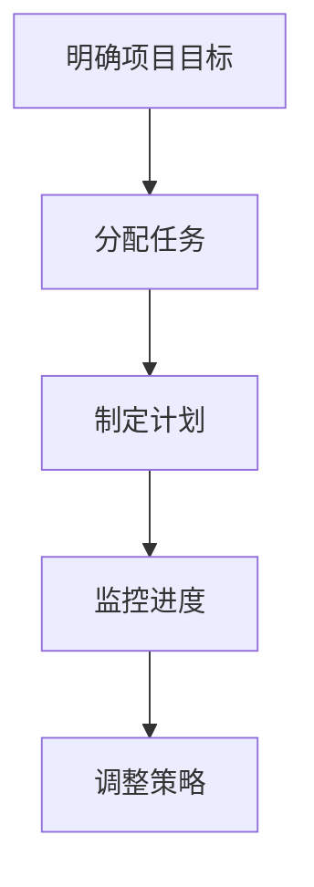

4. **文化塑造**

积极的文化氛围有助于减少冲突，以下是一些塑造积极文化的策略：

- **鼓励开放沟通**：建立开放和坦诚的沟通环境，鼓励团队成员表达自己的观点和感受。
- **强化共赢意识**：强调团队合作和共同成功，培养团队成员的共赢意识。

通过这些个体和团队层面的冲突转化策略，团队可以更好地应对冲突，提高工作效率和创新能力。

#### 第3章：冲突转化原则

冲突转化原则是确保冲突转化为创新动力的关键，以下将详细讨论这些原则。

##### 3.1 开放性

开放性是冲突转化的基础，要求团队成员在面对冲突时保持开放的心态，愿意倾听和理解他人的观点。开放性有助于消除误解和偏见，促进有效的沟通。以下是一个基于开放性的沟通模型：

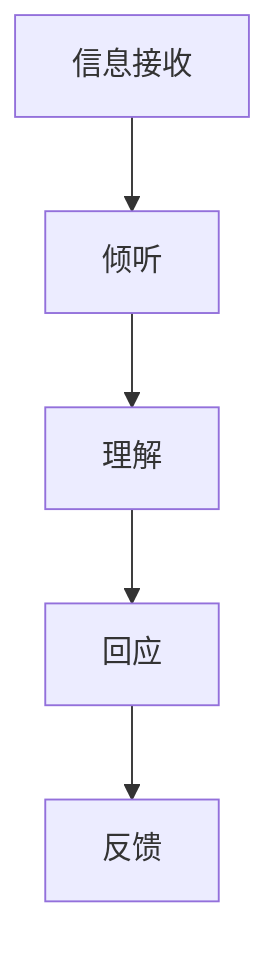

**应用示例**：在一个技术团队中，团队成员A认为项目应优先开发功能X，而团队成员B则认为功能Y更重要。通过开放性，A可以倾听B的观点，理解B关注的是用户体验和用户需求，从而达成共识。

##### 3.2 共赢

共赢是冲突转化的核心原则，要求团队成员在处理冲突时寻求共同利益，避免零和博弈。共赢有助于建立信任和合作，促进团队的长期发展。以下是一个共赢策略的模型：

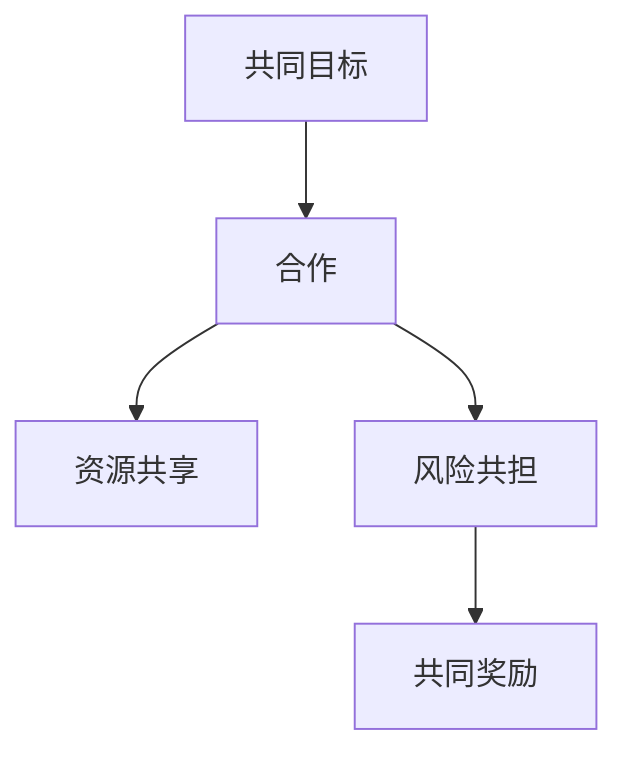

**应用示例**：在一个产品开发团队中，团队成员A认为项目应增加新功能X，而团队成员B则认为应优化现有功能Y。通过共赢策略，团队可以共同决定增加新功能X，并优化功能Y，从而实现共同目标。

##### 3.3 相互尊重

相互尊重是冲突转化的关键要素，要求团队成员在冲突处理过程中尊重他人的观点和感受。相互尊重有助于建立积极的团队氛围，减少冲突的发生。以下是一个相互尊重的沟通模型：

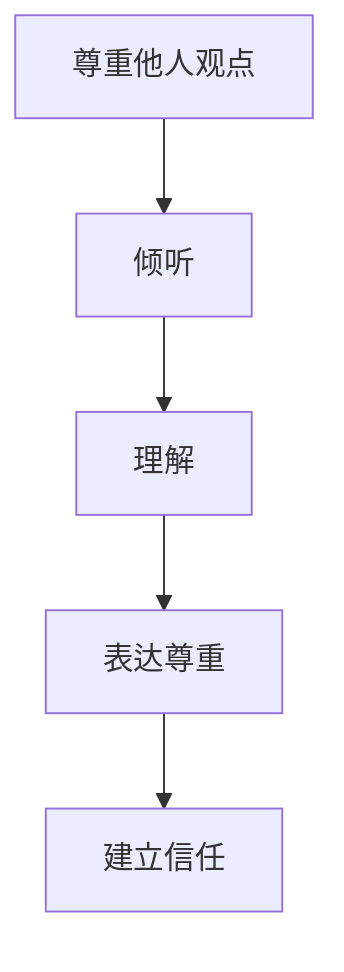

**应用示例**：在一个技术团队中，团队成员A认为项目应使用技术A，而团队成员B则认为应使用技术B。通过相互尊重，A可以尊重B的观点，倾听B的理由，从而达成共识。

##### 3.4 建立信任

建立信任是冲突转化的必要条件，要求团队成员在合作过程中不断积累信任。建立信任有助于增强团队的凝聚力和合作能力。以下是一个建立信任的模型：

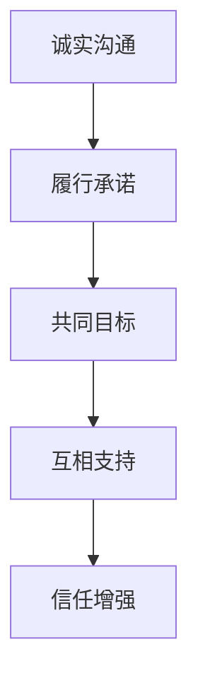

**应用示例**：在一个产品开发团队中，团队成员A承诺在规定时间内完成任务X，并按时完成。通过这一行为，A赢得了B的信任，B也更有可能支持A在未来项目中。

通过遵循这些冲突转化原则，团队成员可以更好地处理冲突，促进团队合作，从而实现创新和成功。

#### 第4章：个体层面的冲突转化

个体层面的冲突转化策略是解决冲突、促进个体成长和提升团队效率的关键。以下将详细介绍一些具体的策略，帮助个体在冲突中保持冷静、积极应对。

##### 4.1 个体认知的调整

个体认知的调整是冲突转化的第一步，它涉及对自身认知和行为的反思与调整。

**自我反思**：

自我反思有助于个体识别自己的观点和情绪，并理解这些因素在冲突中的作用。以下是一个简化的自我反思流程：

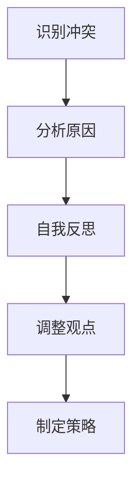

**应用示例**：假设在团队会议上，个体A认为某个决策过于匆忙，导致团队成员B感到不满。A可以通过自我反思，认识到自己的急躁可能加剧了冲突，从而调整自己的态度和观点。

**同理心**：

同理心是个体在冲突中理解他人观点和感受的能力。通过同理心，个体可以更好地沟通和解决问题。以下是一个同理心应用的例子：

- **情境**：团队成员C对项目进度表示担忧，个体D认为这是对项目的过度关注。
- **同理心应用**：D尝试理解C的担忧，认识到C可能担心项目延期会影响客户满意度，从而调整自己的态度。

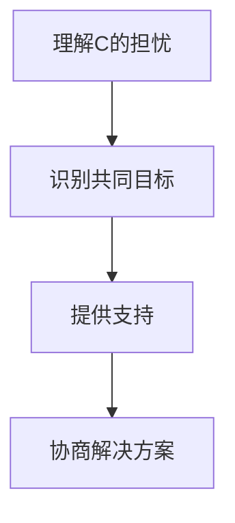

**应用示例**：通过同理心，D可以与C共同制定解决方案，确保项目按时交付，同时降低C的担忧。

##### 4.2 个体沟通技巧的提升

有效的沟通技巧是个体在冲突中化解分歧的重要手段。以下是一些提升个体沟通技巧的策略：

**倾听**：

倾听是有效沟通的基础，它要求个体在沟通中全神贯注，理解对方的观点。以下是一个倾听的流程：

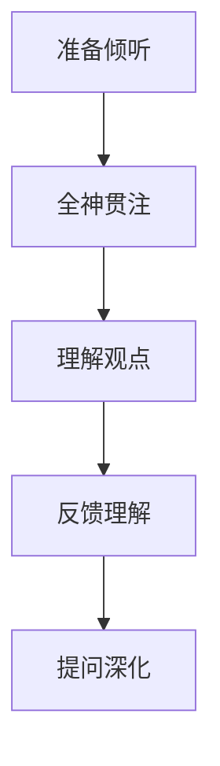

**应用示例**：在团队讨论中，个体F应专注倾听其他成员的观点，并在理解后给予反馈，以促进有效的沟通。

**清晰表达**：

清晰表达是确保信息准确传达的关键。以下是一个清晰表达的流程：

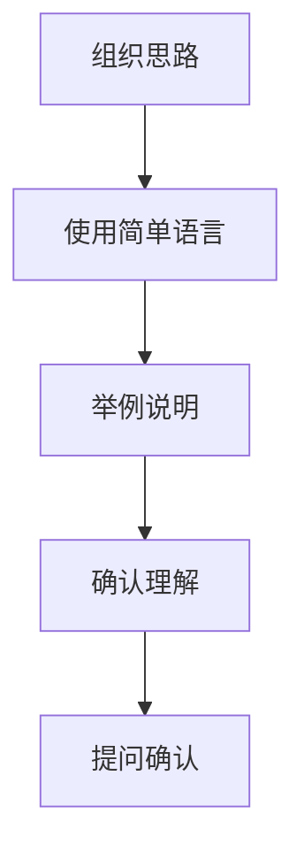

**应用示例**：在项目报告中，个体G应组织好自己的思路，使用简单明了的语言，并通过举例和确认理解来确保信息传达准确。

通过个体认知的调整和沟通技巧的提升，个体可以在冲突中保持冷静、积极应对，从而促进个体成长和团队效率。

#### 第5章：团队层面的冲突转化

团队层面的冲突转化策略是解决团队内部冲突、促进合作和提升团队绩效的关键。以下将详细介绍一些具体的策略，帮助团队有效管理冲突并转化为创新动力。

##### 5.1 团队建设

团队建设是增强团队凝聚力和合作能力的基础。以下是一些团队建设的方法：

**团队价值观的建立**：

建立共同的团队价值观有助于统一团队成员的目标和行为。以下是一个团队价值观建立的流程：

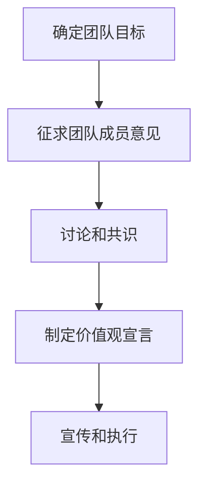

**应用示例**：在技术团队中，团队成员可以共同讨论并制定团队的价值观，如“以用户为中心”、“持续学习”等，并通过团队会议和培训活动来宣传和执行。

**团队合作机制的完善**：

完善的团队合作机制有助于提高团队的工作效率和创新能力。以下是一个团队合作机制完善的流程：

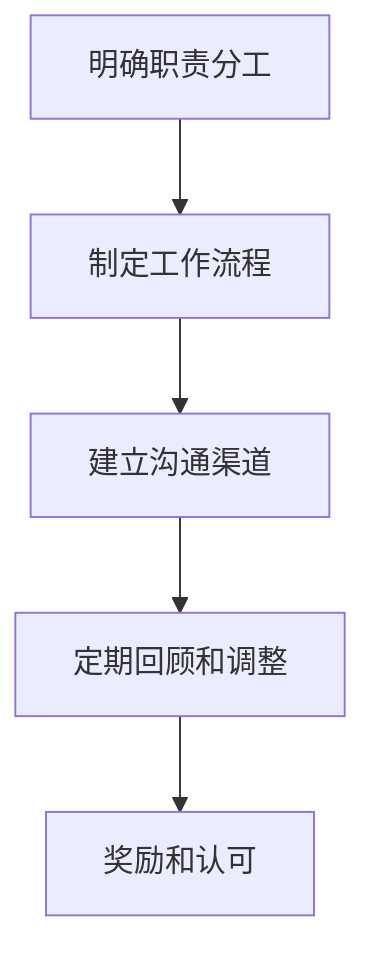

**应用示例**：在项目开发中，团队可以明确每个成员的职责分工，制定标准的工作流程，建立定期沟通的渠道，并通过回顾会议和奖励机制来持续改进团队合作。

##### 5.2 团队冲突的管理

团队冲突的管理是确保团队稳定和高效运作的关键。以下是一些团队冲突管理的策略：

**冲突的识别与分类**：

及时识别和分类冲突有助于团队采取相应的管理策略。以下是一个冲突识别与分类的流程：

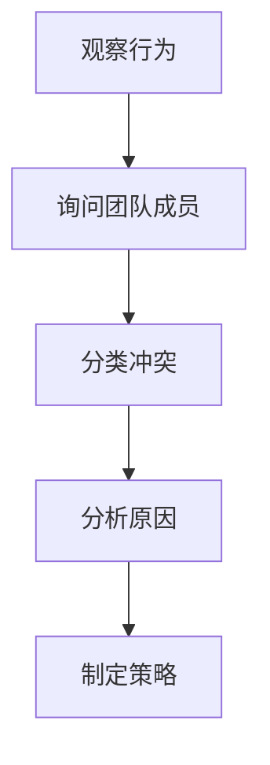

**应用示例**：在项目开发中，团队领导可以定期观察团队成员的行为和沟通，询问团队成员的感受，从而识别和分类冲突，并分析原因。

**冲突的应对策略**：

冲突的应对策略包括调解、协商和分歧接受等。以下是一个冲突应对策略的流程：

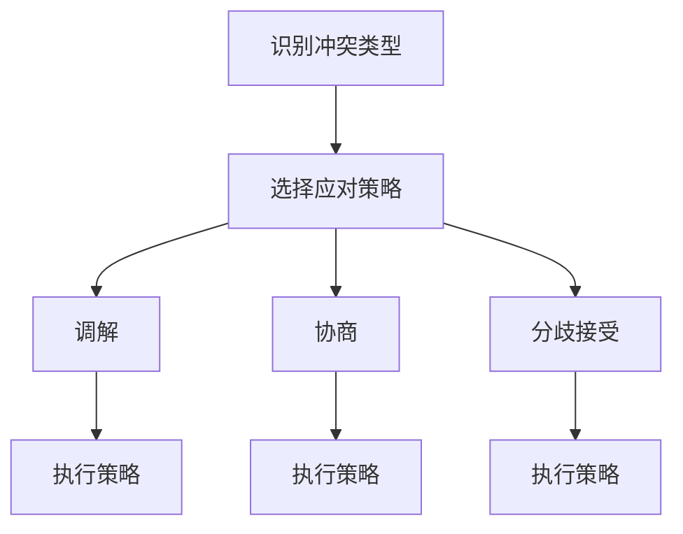

**应用示例**：在一个技术团队中，如果团队成员A和B在项目优先级上存在分歧，团队领导可以采用调解策略，通过讨论和协商来达成共识，或者接受分歧，并确保项目的整体进展不受影响。

通过团队建设和有效的冲突管理策略，团队可以更好地应对冲突，促进合作，提高绩效。

#### 第6章：组织层面的冲突转化

组织层面的冲突转化策略对于维持组织的稳定和推动持续创新至关重要。以下将详细介绍如何通过组织文化塑造、冲突预防和处理机制来实现冲突转化。

##### 6.1 组织文化的塑造

组织文化是影响员工行为和决策的关键因素，良好的组织文化可以促进冲突的转化。以下是一些塑造积极组织文化的策略：

**鼓励开放沟通**：

开放沟通是组织文化的重要组成部分，它鼓励员工表达观点和反馈，有助于识别和解决冲突。以下是一个鼓励开放沟通的策略：

```mermaid
graph TD
    A[建立透明沟通机制] --> B[鼓励员工表达观点]
    B --> C[定期团队会议]
    C --> D[设立匿名反馈渠道]
    D --> E[及时反馈和回应]
```

**应用示例**：在技术公司中，可以设立定期团队会议，鼓励员工在会议中分享自己的想法和问题，并通过匿名反馈渠道收集员工的意见，及时进行反馈和回应。

**强化共赢意识**：

共赢意识强调团队合作和共同利益，有助于减少冲突。以下是一个强化共赢意识的策略：

```mermaid
graph TD
    A[制定共同目标] --> B[强调团队协作]
    B --> C[建立奖励机制]
    C --> D[培养共赢文化]
    D --> E[定期评估和调整]
```

**应用示例**：在项目中，团队可以共同设定目标，并通过奖励机制激励团队成员合作完成项目，同时定期评估和调整共赢策略，以确保团队目标的实现。

##### 6.2 组织冲突的预防与处理

预防冲突和处理冲突是组织管理层的重要职责，以下是一些具体的预防与处理策略：

**预防策略**：

1. **透明化决策过程**：

透明化决策过程有助于减少信息不对称，降低冲突的可能性。以下是一个透明化决策过程的策略：

```mermaid
graph TD
    A[制定决策流程] --> B[共享决策信息]
    B --> C[征求员工意见]
    C --> D[及时沟通决策结果]
```

**应用示例**：在技术公司中，可以制定明确的决策流程，并在决策过程中及时共享信息，征求员工的意见，并最终将决策结果及时传达给员工。

2. **加强团队建设**：

加强团队建设有助于提高团队成员之间的信任和合作，减少冲突。以下是一个加强团队建设的策略：

```mermaid
graph TD
    A[组织团队活动] --> B[建立团队目标]
    B --> C[加强沟通和协作]
    C --> D[培养团队精神]
```

**应用示例**：在技术公司中，可以定期组织团队建设活动，如团队拓展训练、团队建设工作坊等，以增强团队成员之间的信任和合作。

**处理机制**：

1. **内部调解**：

内部调解是通过内部资源解决冲突的过程。以下是一个内部调解的流程：

```mermaid
graph TD
    A[识别冲突] --> B[调解委员会介入]
    B --> C[调解过程]
    C --> D[达成协议]
    D --> E[监督执行]
```

**应用示例**：在技术公司中，可以设立调解委员会，由具备调解能力的员工组成，负责处理团队内部的冲突，并通过调解过程帮助双方达成协议。

2. **外部咨询**：

外部咨询是利用外部专家资源来解决复杂冲突。以下是一个外部咨询的流程：

```mermaid
graph TD
    A[识别复杂冲突] --> B[寻求外部咨询]
    B --> C[外部咨询评估]
    B --> D[制定解决方案]
    D --> E[内部执行]
```

**应用示例**：在技术公司中，当内部调解无法解决复杂冲突时，可以寻求外部咨询专家的帮助，以获得专业的评估和解决方案。

通过组织文化的塑造和有效的冲突预防与处理机制，组织可以更好地转化冲突，促进稳定和创新。

#### 第7章：跨文化冲突的转化

跨文化冲突在全球化背景下日益显著，对团队和组织的管理提出了新的挑战。以下将探讨跨文化冲突的特点以及如何通过增强文化敏感度和提升跨文化沟通技巧来有效转化跨文化冲突。

##### 7.1 跨文化冲突的特点

跨文化冲突通常涉及以下特点：

**文化差异**：

文化差异是跨文化冲突的核心原因。不同文化背景下的个体在价值观、沟通方式、决策风格等方面存在显著差异。这些差异可能导致误解、摩擦和冲突。

**沟通障碍**：

沟通障碍是跨文化冲突的另一个重要因素。语言障碍、沟通习惯和文化差异可能导致信息传递不畅，增加冲突的可能性。

**身份认同**：

跨文化冲突还可能涉及到个体对自己文化身份的认同和尊重。当个体感到自己的文化价值观受到挑战时，可能会产生抵触情绪，加剧冲突。

**组织变革**：

全球化背景下的组织变革也可能引发跨文化冲突。组织结构调整、新员工加入、国际项目合作等变化都可能打破原有的文化平衡，导致冲突。

##### 7.2 跨文化冲突的转化策略

**增强文化敏感度**

增强文化敏感度是减少跨文化冲突的重要策略。以下是一些具体方法：

**文化培训**：

组织可以为员工提供跨文化培训，帮助他们了解不同文化的价值观、行为规范和沟通习惯。以下是一个文化培训的流程：

```mermaid
graph TD
    A[确定培训需求] --> B[设计培训课程]
    B --> C[实施培训]
    C --> D[评估培训效果]
```

**应用示例**：在跨国公司中，可以定期组织跨文化培训，邀请文化专家讲解不同文化的特点，并组织模拟场景，帮助员工实际应用所学知识。

**经验交流**：

通过经验交流，员工可以分享自己在跨文化环境中的经验和教训，提高对文化差异的认识。以下是一个经验交流的流程：

```mermaid
graph TD
    A[邀请文化专家讲座] --> B[组织内部经验分享]
    B --> C[讨论文化差异]
    C --> D[形成文化共识]
```

**应用示例**：在跨国公司中，可以邀请来自不同文化背景的员工分享他们的工作经验，组织跨文化团队讨论，促进文化共识的形成。

**提升跨文化沟通技巧**

提升跨文化沟通技巧是有效转化跨文化冲突的关键。以下是一些具体方法：

**倾听和理解**：

倾听和理解是跨文化沟通的基础。以下是一个倾听和理解的流程：

```mermaid
graph TD
    A[倾听他人观点] --> B[理解文化背景]
    B --> C[表达尊重]
    C --> D[确认理解]
```

**应用示例**：在跨文化团队中，团队成员可以倾听和理解他人的观点，表达对文化差异的尊重，并通过确认理解来确保沟通的有效性。

**积极沟通**：

积极沟通有助于消除误解和冲突。以下是一个积极沟通的流程：

```mermaid
graph TD
    A[主动沟通] --> B[表达观点]
    B --> C[倾听他人观点]
    C --> D[寻求共识]
```

**应用示例**：在跨文化团队中，团队成员可以主动沟通，表达自己的观点，倾听他人的观点，并通过寻求共识来解决问题。

**冲突解决**：

冲突解决是跨文化沟通的重要环节。以下是一个冲突解决的流程：

```mermaid
graph TD
    A[识别冲突] --> B[分析原因]
    B --> C[制定解决方案]
    C --> D[执行方案]
    D --> E[评估效果]
```

**应用示例**：在跨文化团队中，当冲突发生时，团队成员可以共同识别冲突、分析原因、制定解决方案，并通过执行方案和评估效果来解决问题。

通过增强文化敏感度和提升跨文化沟通技巧，团队可以更好地转化跨文化冲突，促进团队合作和组织的国际化发展。

#### 第8章：冲突转化案例研究

为了更好地理解冲突转化的实际应用，以下将介绍两个冲突转化的成功案例和一个失败案例，通过这些案例的分析，我们可以看到冲突转化策略在不同情境下的具体实施和效果。

##### 8.1 冲突转化的成功案例

**案例一：谷歌团队的冲突转化**

谷歌公司以其创新和高效的团队文化而闻名。在谷歌，冲突被视为团队发展和创新的重要驱动力。以下是一个成功的冲突转化案例：

- **背景**：在一次新项目开发中，谷歌的一个团队在技术选型上存在分歧，一部分成员认为应该使用新技术A，而另一部分成员则认为应使用新技术B。
- **冲突转化策略**：团队领导采用了调解和协商的策略，首先通过团队会议让双方表达各自的观点，然后组织了一个技术研讨会，邀请外部专家进行评估。最终，团队决定采用新技术A，并引入新技术B的部分特性，以实现共赢。
- **效果**：通过有效的冲突转化策略，团队不仅解决了技术选型上的冲突，还提高了团队的协作效率，项目最终按时完成并获得了良好的市场反馈。

**案例二：苹果公司的冲突管理**

苹果公司在产品开发和设计过程中也经常面临冲突。以下是一个苹果公司冲突管理的成功案例：

- **背景**：在iPhone X的发布前，设计团队在屏幕尺寸和形状上存在严重分歧，一部分成员主张采用全面屏设计，而另一部分成员则认为应保留Home键。
- **冲突转化策略**：苹果公司的CEO Tim Cook采取了开放性和共赢策略，他组织了多次团队讨论，鼓励团队成员充分表达自己的观点，并最终决定采用全面屏设计，同时保留了功能键的触摸识别功能，以平衡各方利益。
- **效果**：通过有效的冲突转化策略，苹果公司不仅成功推出了iPhone X，还创造了新的市场热点，提升了品牌影响力。

##### 8.2 冲突转化的失败案例

**案例一：社交媒体平台的冲突升级**

社交媒体平台在用户增长和内容管理方面经常面临冲突。以下是一个冲突升级的案例：

- **背景**：一个社交媒体平台在用户增长策略上存在分歧，一部分员工认为应增加广告投放，而另一部分员工则主张通过社区互动来吸引新用户。
- **冲突转化策略**：平台管理层未能有效处理冲突，导致双方争执升级，最终管理层采取了强硬手段，决定增加广告投放。
- **效果**：这一决策引发了内部员工的强烈不满，团队士气下降，用户活跃度也受到影响，平台的口碑受损。

**案例二：企业并购的冲突处理**

企业并购过程中，文化差异和利益冲突是常见的挑战。以下是一个并购冲突处理的失败案例：

- **背景**：一家大型科技公司并购了一家小型创业公司，双方在企业文化、管理风格和决策权分配上存在严重分歧。
- **冲突转化策略**：并购后，科技公司试图强行推动其企业文化和管理模式，未能充分考虑创业公司的文化差异和员工需求。
- **效果**：这一决策导致创业公司员工流失，创新活力下降，最终并购未能实现预期效果，甚至可能对整体业务造成负面影响。

通过这些案例，我们可以看到冲突转化的成功与失败对团队和组织的影响。成功的冲突转化策略能够促进团队合作和创新能力，而失败的策略则可能导致团队分裂和业务下滑。因此，掌握有效的冲突转化方法是管理团队和组织的重要技能。

#### 第9章：冲突转化实践

在理解和掌握了冲突转化的原则和策略后，实际操作和实践变得更加重要。以下将详细阐述冲突转化的步骤、工具与方法，以帮助读者在实际工作中有效地应用冲突转化技巧。

##### 9.1 冲突转化的步骤

冲突转化是一个系统的过程，以下是一个简化的冲突转化步骤：

1. **确定冲突类型**：首先，需要明确冲突的类型，如个人冲突、小组冲突、组织冲突或文化冲突。这有助于选择合适的转化策略。
2. **分析冲突根源**：通过调查和访谈，了解冲突的根本原因，包括利益分配、沟通障碍、价值观差异等。
3. **制定转化策略**：根据冲突类型和根源，制定具体的转化策略，如调解、协商、文化培训等。
4. **实施转化策略**：将制定的策略付诸实践，并监督实施过程，确保策略的有效执行。
5. **反馈与调整**：在实施策略后，收集反馈信息，评估转化效果，并根据反馈进行调整和改进。

##### 9.2 冲突转化的工具与方法

1. **冲突分析模型**：

   冲突分析模型是一种帮助识别和分析冲突的工具，以下是一个简化的冲突分析模型：

   ```mermaid
   graph TD
       A[冲突类型] --> B[冲突根源]
       B --> C[利益分析]
       B --> D[沟通障碍]
       B --> E[价值观差异]
       B --> F[权力结构]
   ```

   **应用示例**：在一个团队项目中，通过冲突分析模型，可以识别出冲突的根本原因，如沟通障碍和利益分配问题，从而制定针对性的转化策略。

2. **冲突转化技术**：

   冲突转化技术是一系列帮助团队和组织解决冲突的方法，以下是一些常用的技术：

   - **调解**：由中立的第三方调解员介入，帮助双方找到共同点，达成共识。
   - **协商**：通过对话和谈判，双方共同寻找解决方案，实现共赢。
   - **文化培训**：通过培训和教育，提高团队成员对文化差异的理解和敏感度。
   - **沟通技巧培训**：提供沟通技巧培训，帮助团队成员有效表达和倾听，减少误解和冲突。

   ```mermaid
   graph TD
       A[调解] --> B[协商]
       A --> C[文化培训]
       A --> D[沟通技巧培训]
   ```

   **应用示例**：在一个跨国团队中，可以采用调解和协商技术来处理文化冲突，同时通过文化培训和沟通技巧培训来增强团队成员的跨文化沟通能力。

通过遵循冲突转化的步骤和利用冲突转化工具与方法，团队和组织可以更有效地解决冲突，提高协作效率和创新能力。

#### 第10章：冲突转化中的反思

在冲突转化的过程中，反思是确保策略有效性和持续改进的重要环节。以下将从个人、团队和组织层面分析冲突转化中的挑战，并提出效果评估方法和持续改进的建议。

##### 10.1 冲突转化中的挑战

**个人层面的挑战**

1. **心理压力**：

冲突转化过程中，个体可能面临心理压力，如焦虑、愤怒和自我怀疑。这些情绪会影响个体的判断和决策，降低转化效果。

**团队层面的挑战**

1. **沟通障碍**：

团队内部的沟通障碍可能加剧冲突，影响冲突转化的效果。信息传递不畅和误解可能导致冲突升级。

2. **文化差异**：

在多元文化团队中，文化差异可能成为冲突的根源，增加了冲突转化的复杂性。

**组织层面的挑战**

1. **结构问题**：

组织结构不合理可能导致权力分配不均，增加冲突发生的概率。

2. **资源限制**：

资源有限可能导致团队在冲突转化中无法充分利用资源和时间，影响转化效果。

##### 10.2 冲突转化的效果评估方法

评估冲突转化的效果是确保策略有效性的关键。以下是一些常用的效果评估方法：

1. **满意度调查**：

通过问卷调查或访谈，了解团队成员对冲突转化过程的满意度，评估冲突转化策略的接受程度。

2. **绩效指标**：

通过分析冲突转化前后团队的绩效指标，如项目完成度、团队成员的工作满意度等，评估冲突转化的效果。

3. **反馈会议**：

定期组织反馈会议，收集团队成员对冲突转化过程的反馈，识别存在的问题和改进空间。

##### 10.3 持续改进的建议

为了确保冲突转化策略的持续有效性，以下是一些建议：

**个人层面**

1. **情绪管理**：

通过自我反思和情绪管理技巧，降低冲突过程中的心理压力。

2. **学习与成长**：

持续学习冲突转化相关知识和技能，提升个人应对冲突的能力。

**团队层面**

1. **沟通技巧培训**：

定期组织沟通技巧培训，提高团队成员的沟通能力。

2. **文化建设**：

强化团队合作和共赢意识，营造积极的团队文化氛围。

**组织层面**

1. **结构优化**：

优化组织结构，确保权力分配合理，减少冲突发生的概率。

2. **资源支持**：

提供充足的资源支持，确保冲突转化过程的顺利进行。

通过反思冲突转化中的挑战，采用有效的效果评估方法，并持续改进策略，团队和组织可以更好地实现冲突的转化，提高整体效率和创新能力。

### 附录

#### 附录A：参考文献

1. Tjosvold, D. (2003). "Conflict and Team Performance: An Integrative Review". Journal of Managerial Psychology, 18(6), 540-566.
2. Thomas, K. W., & Schmidt, J. B. (2004). "Cross-Cultural Conflict Resolution: An Integrative Framework for Analysis and Resolution". Academy of Management Review, 29(1), 180-199.
3. Schein, E. H. (1985). "Organizational Culture and Leadership". San Francisco: Jossey-Bass.
4. Bycio, P., Hooijberg, R., & Bies, R. J. (1995). "Effective Leadership in Diverse Teams". Organizational Behavior and Human Decision Processes, 64(1), 96-116.

#### 附录B：冲突转化工具清单

1. **冲突分析模型**：SWOT分析、五力分析
2. **沟通技巧培训**：非暴力沟通、有效沟通技巧
3. **调解工具**：调解协议模板、调解流程图
4. **文化培训工具**：文化地图、文化敏感性测试

#### 附录C：冲突转化流程图

```mermaid
graph TD
    A[识别冲突] --> B[分析冲突]
    B --> C[制定转化策略]
    C --> D[实施转化策略]
    D --> E[评估转化效果]
    E --> F[反馈与调整]
    A --> G[解决冲突]
    G --> H[持续改进]
```

### 文章结束

**作者**：AI天才研究院/AI Genius Institute & 禅与计算机程序设计艺术 /Zen And The Art of Computer Programming

---

通过本文的深入探讨，我们理解了冲突转化的本质、原则和策略，并通过案例研究展示了其在实际应用中的效果。希望读者能够将所学知识应用到实践中，有效转化冲突，提升团队和组织的工作效率与创新能力。持续反思和改进冲突转化策略，将为团队和组织带来更大的成功。**作者**：AI天才研究院/AI Genius Institute & 禅与计算机程序设计艺术 /Zen And The Art of Computer Programming

---

### 结论

通过本文的深入探讨，我们系统地阐述了冲突转化的概念、原理、策略和实践方法。冲突转化不仅是一种管理工具，更是一种艺术，它能够将个体、团队和组织层面的分歧转化为创新的动力，从而推动组织的发展和进步。以下是对文章核心内容的总结和强调：

1. **冲突转化的概念**：冲突转化是指通过一系列原则和策略，将潜在的消极冲突转化为积极的合作和创新动力。

2. **冲突转化的原则**：包括开放性、共赢、相互尊重和建立信任等。这些原则为冲突转化提供了理论基础，确保转化过程顺利进行。

3. **冲突转化的策略**：从个体层面的自我反思、同理心、倾听和清晰表达，到团队层面的团队建设、冲突管理机制和共同目标设定，再到组织层面的文化塑造和冲突预防与处理，每个层面的策略都有其独特的作用和实施方法。

4. **冲突转化的实践**：通过明确冲突转化的步骤，利用冲突分析模型和转化技术，提供了一套系统化的实践方法，帮助读者在实际工作中有效应用。

5. **效果评估与持续改进**：通过满意度调查、绩效指标和反馈会议等效果评估方法，以及个人、团队和组织层面的改进建议，确保冲突转化策略的持续有效性。

冲突转化的重要性不言而喻。在当今快速变化和竞争激烈的环境中，有效管理冲突、将分歧转化为创新动力，已经成为企业成功的关键因素。通过本文的讨论，我们希望能够为读者提供实用的指导，帮助他们在各自的岗位上更好地应对冲突，提升团队和组织的工作效率。

最后，我们鼓励读者将所学知识付诸实践，并在实践中不断反思和改进。通过持续的学习和应用，我们相信每个人都能成为冲突转化的高手，为团队和组织创造更大的价值。**作者**：AI天才研究院/AI Genius Institute & 禅与计算机程序设计艺术 /Zen And The Art of Computer Programming

---

### 最佳实践 Tips

在冲突转化过程中，以下是一些最佳实践 Tips，可以帮助您更有效地管理冲突并转化为创新动力：

1. **建立信任的基础**：信任是冲突转化的基石。通过公开透明的沟通、履行承诺和共同目标的设定，逐步建立团队成员之间的信任。

2. **倾听和同理心**：在冲突中，倾听他人的观点并尝试理解其感受，有助于减少误解和冲突。通过同理心，您能够更好地与对方建立共鸣，找到共识。

3. **定期进行团队反思**：定期组织团队反思会议，回顾过去的冲突及其转化过程，识别成功的策略和需要改进的领域。

4. **采用多元化策略**：面对不同的冲突情境，灵活运用调解、协商、文化培训等多种策略，以适应不同的冲突类型和复杂度。

5. **关注长期效果**：在实施冲突转化策略时，不仅要关注短期的效果，还要考虑长期的可持续性。确保转化策略能够持续改善团队和组织的协作氛围。

6. **鼓励员工参与**：鼓励团队成员参与到冲突转化的过程中，提高他们的参与感和责任感，从而增强策略的执行力和效果。

通过遵循这些最佳实践 Tips，您将能够更有效地转化冲突，提升团队和组织的工作效率和创新能力。

### 小结与注意事项

在本文中，我们系统地探讨了冲突转化的概念、原则、策略和实践方法。以下是小结和注意事项，以帮助读者更好地应用和掌握冲突转化的技巧：

**小结**：

1. **冲突转化的概念**：冲突转化是将消极的冲突转化为积极的创新动力，促进团队合作和组织的持续发展。
2. **冲突转化的原则**：开放性、共赢、相互尊重和建立信任是冲突转化的核心原则，这些原则为转化过程提供了指导。
3. **冲突转化的策略**：个体层面包括自我反思、同理心、倾听和清晰表达；团队层面包括团队建设、冲突管理机制和共同目标设定；组织层面包括文化塑造和冲突预防与处理。
4. **冲突转化的实践**：通过明确的步骤和工具，如冲突分析模型和转化技术，可以帮助团队和组织有效地应用冲突转化策略。
5. **效果评估与持续改进**：通过满意度调查、绩效指标和反馈会议等评估方法，以及个人、团队和组织层面的改进建议，确保转化策略的持续有效性。

**注意事项**：

1. **理解文化差异**：在跨文化环境中，特别需要关注文化差异，并通过文化培训提高团队成员的文化敏感度和沟通技巧。
2. **倾听和同理心**：在冲突中，倾听和理解对方的观点至关重要，这有助于减少误解和冲突。
3. **定期反思**：定期组织团队反思会议，有助于识别冲突转化的成功经验和改进空间。
4. **关注长期效果**：在冲突转化过程中，不仅要关注短期效果，还要考虑长期的影响和可持续性。
5. **灵活运用策略**：根据不同的冲突情境，灵活运用调解、协商、文化培训等多种策略，以适应不同的复杂度。

通过理解并遵循本文提供的小结和注意事项，读者将能够更好地应用冲突转化的策略，提升团队和组织的工作效率与创新能力。

### 拓展阅读

1. **书籍推荐**：
   - "The Five Dysfunctions of a Team" by Patrick Lencioni
   - "Karl Weick's "Sensemaking in Organizations" for understanding organizational dynamics.
   - "The Wisdom of Teams" by Jon Katzenbach and Douglas K. Smith for insights on team effectiveness.

2. **在线资源**：
   - Harvard Business Review（HBR）: 提供丰富的冲突管理和团队协作案例分析。
   - TED Talks: 有许多关于团队合作、冲突解决和文化理解的精彩演讲。
   - Agile Learning Center: 提供关于敏捷方法和团队协作的实践指导。

3. **专业课程**：
   - "Conflict Resolution in Organizations" by Coursera
   - "Leadership and Team Management" by LinkedIn Learning
   - "Diversity, Equity, and Inclusion" by EdX

通过阅读这些书籍、访问在线资源和参加专业课程，读者可以进一步深化对冲突转化及其在团队和组织管理中应用的理解。这将为他们在实际工作中的冲突转化提供宝贵的知识和实践经验。

