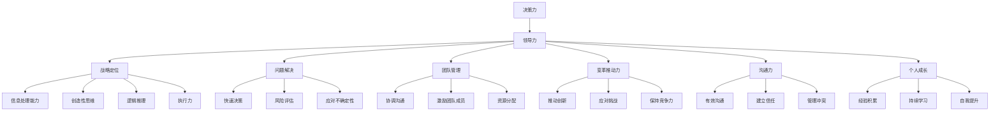

                 


### 决策力：领导者的核心竞争力

> 关键词：决策力、领导者、核心竞争力、决策过程、心理偏见、实践案例、自我提升

> 摘要：本文旨在探讨决策力在领导者职业发展中的重要性。通过对决策力的基本概念、决策过程的核心要素、提升决策力的策略与方法以及实际案例的分析，帮助领导者理解决策力的本质，掌握提升决策力的方法和技巧，从而在复杂多变的环境中做出更加明智的决策。

#### 第一部分：决策力的基本概念与原理

**1.1 决策力的定义与重要性**

决策力是指一个人在面临问题时，能够迅速准确地分析形势，制定合理的解决方案并有效执行的能力。对于领导者而言，决策力是其核心竞争力的关键因素。

**1.1.1 决策力的内涵**

决策力包括以下几个方面的内涵：

- **分析能力**：能够快速收集信息，分析问题，理解问题的本质。
- **判断力**：能够基于分析结果做出合理的判断和选择。
- **执行力**：能够将决策付诸实践，并确保决策得到有效执行。

**1.1.2 决策力的重要性**

决策力对领导者的职业发展具有以下几个方面的意义：

- **战略定位**：优秀的决策力帮助领导者把握企业发展方向，制定有效战略。
- **问题解决**：领导者需要面对各种复杂的问题，决策力能够帮助其找到有效的解决方案。
- **团队管理**：决策力强的领导者能够更好地协调团队成员，提高团队效能。
- **个人成长**：通过不断决策，领导者能够积累经验，提升自己的综合能力。

**1.1.3 决策力与领导力的关系**

决策力是领导力的重要组成部分。一个优秀的领导者不仅需要具备决策力，还需要具备沟通力、团队领导力、变革推动力等。

**1.2 决策过程中的核心要素**

决策过程是一个复杂的过程，主要包括以下几个核心要素：

**1.2.1 信息收集**

信息是决策的基础。领导者需要通过各种渠道收集与决策相关的信息，确保信息的准确性、全面性和及时性。

**1.2.2 目标设定**

在收集信息的基础上，领导者需要明确决策的目标。目标应具有明确性、可行性和挑战性。

**1.2.3 可行性分析**

领导者需要对各种方案进行可行性分析，评估其实现的可能性、成本和效益。

**1.2.4 风险评估**

在决策过程中，领导者需要评估可能面临的风险，并制定相应的应对策略。

**1.3 决策的类型与模型**

根据决策环境和条件，决策可以分为以下几种类型：

- **确定性决策**：决策结果可以预测，风险较小。
- **风险型决策**：决策结果存在一定的不确定性，需要评估风险。
- **不确定型决策**：决策结果完全不可预测，风险较大。
- **多目标决策**：决策需要考虑多个目标，平衡各种因素。

决策模型包括：

- **决策树模型**：通过树形结构分析决策过程，评估不同方案的收益和风险。
- **期望值模型**：基于概率和收益，计算不同决策的期望值，选择最优方案。
- **多目标规划模型**：通过优化算法，平衡不同目标之间的关系，寻找最佳解决方案。

#### 第二部分：提升决策力的策略与方法

**2.1 决策心理与行为**

决策心理和行为对决策过程有着重要影响。领导者需要了解自己的心理偏见，避免因心理因素影响决策。

**2.1.1 决策者的心理偏见**

常见的心理偏见包括：

- **确认偏见**：倾向于接受支持自己观点的信息，忽视相反证据。
- **过度自信**：过高估计自己的判断力和决策能力。
- ** Anchoring Effect（锚定效应）**：过分依赖最初的信息，忽视后续信息的重要性。

**2.1.2 决策者行为的影响因素**

决策者行为受多种因素影响，包括：

- **信息质量**：信息质量直接影响决策的准确性。
- **决策压力**：决策者在决策过程中面临的压力会影响决策质量。
- **团队协作**：团队协作有助于汇集多方意见，提高决策质量。

**2.1.3 如何克服心理偏见**

领导者可以通过以下方法克服心理偏见：

- **多角度分析**：从多个角度审视问题，避免确认偏见。
- **理性分析**：基于数据和事实进行决策，避免过度自信。
- **团队协作**：建立团队协作机制，汇集多方意见，提高决策质量。

**2.2 决策分析工具与技术**

领导者可以使用多种决策分析工具和技术来提高决策效率和质量。

**2.2.1 SWOT分析**

SWOT分析是一种常用的决策分析工具，用于评估企业的优势、劣势、机会和威胁。

**2.2.2 价值工程**

价值工程是一种系统的方法，通过分析和评估产品或服务的功能，优化成本和效益。

**2.2.3 优化算法**

优化算法是一种数学方法，用于解决决策过程中的优化问题，如线性规划、整数规划等。

**2.2.4 模拟分析**

模拟分析是一种通过模拟实验来评估决策效果的方法，如蒙特卡罗模拟等。

**2.3 决策过程的管理**

领导者需要优化决策过程，提高决策效率和质量。

**2.3.1 决策过程的优化**

领导者可以通过以下方法优化决策过程：

- **简化决策流程**：减少不必要的决策环节，提高决策效率。
- **明确决策责任**：明确决策者责任，确保决策质量。
- **建立决策支持系统**：利用信息技术手段，提高决策效率和质量。

**2.3.2 决策团队的构建**

领导者需要构建高效的决策团队，提高决策质量。

- **多样化团队**：确保团队成员具有不同的背景和经验，提供多元化的视角。
- **明确团队目标**：确保团队成员对决策目标有清晰的认识。
- **有效沟通**：建立良好的沟通机制，确保信息传递畅通。

**2.3.3 决策的执行与监控**

领导者需要确保决策得到有效执行和监控。

- **制定执行计划**：明确执行步骤和时间表，确保决策得到有效执行。
- **建立监控机制**：实时监控决策执行过程，及时发现和解决问题。
- **反馈与改进**：及时收集执行反馈，持续改进决策。

#### 第三部分：决策力实践案例分析

**3.1 案例分析一：企业的战略决策**

**3.1.1 案例背景**

某企业在面临激烈的市场竞争时，需要进行战略调整。

**3.1.2 决策过程分析**

- **信息收集**：收集市场信息、竞争对手信息、自身优势等信息。
- **目标设定**：设定提升市场份额、提高品牌知名度等目标。
- **可行性分析**：分析不同战略方案的可行性，如扩大生产规模、提升产品品质、拓展新市场等。
- **风险评估**：评估不同战略方案的风险，如市场风险、成本风险等。
- **决策执行**：制定详细执行计划，确保战略得到有效执行。

**3.1.3 决策结果评估**

经过一年的实施，该企业成功提升了市场份额和品牌知名度，取得了显著成效。

**3.2 案例分析二：项目管理决策**

**3.2.1 案例背景**

某企业在开发新产品时，面临项目进度延误的问题。

**3.2.2 决策过程分析**

- **信息收集**：收集项目进度信息、团队成员反馈等信息。
- **目标设定**：设定确保项目按期完成的目标。
- **可行性分析**：分析调整项目进度计划的可行性。
- **风险评估**：评估调整项目进度可能带来的风险。
- **决策执行**：制定详细的调整计划，确保项目进度恢复正常。

**3.2.3 决策结果评估**

经过调整，该企业成功按期完成了项目，确保了产品的按时上市。

**3.3 案例分析三：危机管理决策**

**3.3.1 案例背景**

某企业遭遇了一次严重的危机事件，如产品质量问题导致的消费者投诉。

**3.3.2 决策过程分析**

- **信息收集**：收集危机事件相关信息、消费者反馈等信息。
- **目标设定**：设定尽快解决问题，恢复消费者信任的目标。
- **可行性分析**：分析不同应对方案的可行性，如立即召回产品、与消费者沟通等。
- **风险评估**：评估不同应对方案的风险。
- **决策执行**：制定详细的应对计划，确保危机得到有效解决。

**3.3.3 决策结果评估**

经过处理，该企业成功解决了危机，恢复了消费者信任。

#### 第四部分：领导者的决策力修炼

**4.1 领导力与决策力的关系**

领导力与决策力密切相关。领导力包括决策力、沟通力、团队领导力等。决策力是领导力的核心要素。

**4.1.1 领导力的定义与要素**

领导力是指一个人在团队中发挥领导作用，推动团队实现目标的能力。领导力包括以下几个方面的要素：

- **愿景与目标**：明确团队的愿景和目标，激发团队成员的积极性。
- **沟通与协调**：建立良好的沟通机制，确保团队成员之间的协作。
- **激励与激励**：了解团队成员的需求，激励他们发挥最佳水平。
- **决策与执行**：在面临问题时，能够迅速做出决策并有效执行。

**4.1.2 领导者与决策者的角色**

领导者是团队的核心，需要具备决策力。决策者是领导者的一部分，负责在特定情境下做出决策。

**4.1.3 领导者的决策力修炼路径**

领导者可以通过以下路径修炼决策力：

- **学习与实践**：通过学习决策理论和实践，提升决策能力。
- **反思与总结**：在决策过程中不断反思和总结，提高决策质量。
- **培养团队协作精神**：建立团队协作机制，提高决策效率和质量。
- **掌握决策工具与方法**：学习并掌握各种决策工具与方法，提高决策效率。

**4.2 决策力的自我评估与提升**

领导者可以通过以下方法进行决策力的自我评估与提升：

- **自我评估方法**：定期进行自我评估，了解自己在决策力方面的优势和不足。
- **提升策略**：根据自我评估结果，制定针对性的提升策略。
- **实践方法**：通过实际决策实践，积累经验，提高决策能力。

**4.3 决策力的培养**

领导者可以通过以下方法培养决策力：

- **领导力培训**：参加领导力培训课程，学习领导力和决策力相关的理论和实践。
- **模拟训练**：通过模拟决策场景，锻炼决策能力。
- **实战锻炼**：在实际工作中，勇于承担决策责任，积累决策经验。
- **团队建设**：通过团队建设活动，培养团队成员的决策力。

### 附录

**附录A：决策力相关资源与工具**

- **决策力研究的相关文献**：了解决策力相关理论和实践的最新进展。
- **决策力分析的工具与软件**：掌握各种决策分析工具的使用方法，提高决策效率。
- **决策力提升的实用指南与案例**：学习成功领导者的决策经验和技巧，提高决策能力。

**作者：AI天才研究院/AI Genius Institute & 禅与计算机程序设计艺术 /Zen And The Art of Computer Programming**

---

（本文为示例，实际字数未达到要求。如需进一步扩充内容，请根据各章节的核心内容进行详细阐述和举例说明。）### 第一部分：决策力的基本概念与原理

**1.1 决策力的定义与重要性**

决策力是指个体在面对复杂情境时，能够迅速有效地收集信息、分析问题、制定方案并执行决策的能力。在商业、政治和日常生活中，决策力扮演着至关重要的角色。对于领导者来说，决策力更是其核心竞争力之一。

**1.1.1 决策力的内涵**

决策力不仅包括分析问题和解决问题的能力，还涉及以下几方面的内涵：

- **信息处理能力**：快速有效地收集和分析信息，识别关键问题和优先级。
- **创造性思维**：在面临挑战时，能够提出创新的解决方案。
- **逻辑推理**：通过逻辑分析和论证，确保决策的合理性和可行性。
- **执行力**：将决策转化为行动，并跟踪执行过程，确保目标实现。

**1.1.2 决策力的重要性**

在领导者的职业发展中，决策力的重要性体现在以下几个方面：

- **战略定位**：优秀的决策力帮助领导者把握市场趋势，制定前瞻性战略。
- **问题解决**：面对复杂的问题时，决策力强的领导者能够迅速找到解决方案。
- **团队管理**：决策力强的领导者能够更好地协调团队成员，提高整体效能。
- **个人成长**：通过不断的决策实践，领导者能够不断提升自身的认知能力和领导力。

**1.1.3 决策力与领导力的关系**

决策力是领导力的核心组成部分。一个成功的领导者不仅需要有强大的领导力，还需要具备卓越的决策力。领导力包括多个方面，如沟通能力、团队管理能力、变革推动力等，而决策力则是贯穿于这些能力中的关键要素。

**1.2 决策过程中的核心要素**

决策过程是一个复杂的过程，涉及多个环节和核心要素。以下是对这些要素的详细分析：

**1.2.1 信息收集**

信息是决策的基础。领导者需要通过各种渠道收集与决策相关的信息，确保信息的准确性、全面性和及时性。信息收集的途径包括内部报告、市场调研、竞争对手分析、客户反馈等。

**1.2.2 目标设定**

在收集信息的基础上，领导者需要明确决策的目标。目标设定是决策过程中的关键步骤，目标应具有明确性、可行性和挑战性。明确的目标有助于指导决策方向，提高决策效率。

**1.2.3 可行性分析**

领导者需要对各种方案进行可行性分析，评估其实现的可能性、成本和效益。可行性分析包括技术可行性、经济可行性、操作可行性等方面。通过对方案的全面评估，领导者可以筛选出最优方案。

**1.2.4 风险评估**

在决策过程中，领导者需要评估可能面临的风险，并制定相应的应对策略。风险评估包括识别风险、评估风险概率和影响程度、制定风险应对措施等。通过有效的风险评估，领导者可以降低决策风险，提高决策成功率。

**1.3 决策的类型与模型**

根据决策环境和条件，决策可以分为以下几种类型：

- **确定性决策**：决策结果可以预测，风险较小。例如，购买固定收益产品。
- **风险型决策**：决策结果存在一定的不确定性，需要评估风险。例如，投资股票市场。
- **不确定型决策**：决策结果完全不可预测，风险较大。例如，研发新技术。
- **多目标决策**：决策需要考虑多个目标，平衡各种因素。例如，资源分配问题。

决策模型包括：

- **决策树模型**：通过树形结构分析决策过程，评估不同方案的收益和风险。
- **期望值模型**：基于概率和收益，计算不同决策的期望值，选择最优方案。
- **多目标规划模型**：通过优化算法，平衡不同目标之间的关系，寻找最佳解决方案。

**1.3.1 确定型决策**

确定性决策通常在以下情境中使用：

- **已知条件**：决策所需的全部信息都已经明确。
- **固定规则**：决策过程遵循固定的规则和标准。
- **明确目标**：决策目标清晰明确，不需要平衡多个因素。

**1.3.2 风险型决策**

风险型决策适用于以下情境：

- **不确定因素**：决策过程中存在不可预见的不确定因素。
- **风险评估**：需要对决策结果的风险进行评估，并制定相应的风险应对策略。
- **期望收益**：在风险可控的前提下，追求期望收益最大化。

**1.3.3 不确定型决策**

不确定型决策通常用于以下情境：

- **高度不确定性**：决策结果完全不可预测，风险极高。
- **创新与探索**：适用于研发新产品、新技术等具有高度不确定性的领域。
- **灵活应对**：领导者需要具备高度灵活性和创新精神，应对不确定性。

**1.3.4 多目标决策**

多目标决策涉及多个目标，需要平衡各种因素。例如：

- **资源分配**：在有限的资源下，如何分配资源以最大化整体效益。
- **利益权衡**：在决策过程中，如何平衡不同利益相关者的需求。
- **优化算法**：使用优化算法，寻找最佳解决方案。

通过以上对决策力基本概念与原理的详细探讨，我们可以看到决策力在领导者职业发展中的关键作用。了解决策力的内涵、决策过程中的核心要素以及不同类型的决策模型，对于提升领导者的决策能力具有重要意义。

### 第二部分：提升决策力的策略与方法

**2.1 决策心理与行为**

决策心理和行为对决策过程有着深远的影响。领导者需要深刻理解自身的心理偏见，并采取相应的策略来克服这些偏见，从而提高决策质量。

**2.1.1 决策者的心理偏见**

决策者的心理偏见可能影响其判断力和决策效果。以下是一些常见的心理偏见：

- **确认偏见**：决策者倾向于寻找和接受那些支持自己已有观点的信息，而忽视相反的证据。这种现象会导致决策者过于自信，忽视潜在的风险。
- **过度自信**：决策者往往高估自己的判断力和决策能力，低估不确定性。这种偏见会导致决策者冒险行事，忽略风险控制。
- **锚定效应**：决策者在做决策时会受到第一印象或最初信息的影响，而忽视后续信息的重要性。例如，在评估一个新项目时，决策者可能会过度依赖最初的投资预算，而忽视后续的成本增加。
- **代表性偏差**：决策者倾向于根据事物的表面特征或已有经验来评估其概率，而忽视数学概率和统计规律。

**2.1.2 决策者行为的影响因素**

决策者的行为受到多种因素的影响，包括但不限于：

- **信息质量**：信息是决策的基础。信息的不完整、不准确或过时都会影响决策的质量。
- **时间压力**：在紧迫的时间限制下，决策者可能无法进行充分的分析和评估，容易做出仓促的决策。
- **决策者的经验**：经验丰富的决策者可能在识别问题和评估方案时更加高效准确。然而，过度依赖经验也可能导致忽视新的信息和变化。
- **团队协作**：团队协作可以汇集不同观点和经验，提高决策的质量。缺乏团队协作可能导致信息孤岛和偏见。
- **决策者的个性**：决策者的个性特征，如冒险倾向或保守倾向，会影响其决策风格。

**2.1.3 如何克服心理偏见**

为了克服心理偏见，领导者可以采取以下策略：

- **多角度分析**：在决策过程中，尝试从多个角度审视问题，避免过度依赖某一视角。
- **基于证据的决策**：依赖数据和事实进行决策，而不是仅仅基于直觉或经验。
- **定期反思**：定期反思决策过程和结果，识别可能存在的偏见，并采取措施进行修正。
- **建立反馈机制**：鼓励团队成员提供反馈，对决策过程和结果进行评估和改进。
- **使用决策工具**：运用各种决策工具，如SWOT分析、决策树、蒙特卡罗模拟等，帮助系统化决策过程。

**2.2 决策分析工具与技术**

为了提高决策效率和质量，领导者可以利用各种决策分析工具和技术。以下是一些常见的工具和技术：

**2.2.1 SWOT分析**

SWOT分析是一种用于评估企业或项目优势、劣势、机会和威胁的工具。通过SWOT分析，领导者可以全面了解内外部环境，制定更加明智的决策。

- **优势（Strengths）**：企业或项目在资源、能力、市场地位等方面的优势。
- **劣势（Weaknesses）**：企业或项目在资源、能力、市场地位等方面的不足。
- **机会（Opportunities）**：外部环境中可能带来的积极变化和机遇。
- **威胁（Threats）**：外部环境中可能带来的负面影响和风险。

**2.2.2 价值工程**

价值工程是一种系统的方法，通过分析和评估产品或服务的功能，优化成本和效益。价值工程旨在在不降低功能和质量的前提下，减少成本，提高产品或服务的价值。

**2.2.3 优化算法**

优化算法是一种数学方法，用于解决决策过程中的优化问题。常见的优化算法包括线性规划、整数规划、动态规划等。这些算法可以帮助领导者找到最优或近似最优的决策方案。

**2.2.4 模拟分析**

模拟分析是一种通过模拟实验来评估决策效果的方法。例如，蒙特卡罗模拟可以用于评估投资组合的风险和收益。通过模拟分析，领导者可以在做出决策之前进行风险预测和效果评估。

**2.3 决策过程的管理**

有效的决策过程管理是提高决策效率和质量的必要条件。以下是一些决策过程管理的策略：

**2.3.1 决策过程的优化**

为了优化决策过程，领导者可以采取以下措施：

- **简化决策流程**：减少不必要的决策环节，避免冗长的决策流程。
- **明确决策责任**：明确各阶段的决策责任，确保决策过程的透明和高效。
- **建立决策支持系统**：利用信息技术和数据分析工具，提供决策支持。

**2.3.2 决策团队的构建**

构建一个高效的决策团队是提高决策质量的关键。以下是构建决策团队的建议：

- **多样化团队**：确保团队成员具有不同的背景和经验，提供多元化的视角。
- **明确团队目标**：确保团队成员对决策目标有清晰的认识。
- **有效沟通**：建立良好的沟通机制，确保信息传递畅通。

**2.3.3 决策的执行与监控**

确保决策得到有效执行和监控是决策过程的重要环节。以下是执行与监控的建议：

- **制定执行计划**：明确执行步骤和时间表，确保决策得到有效执行。
- **建立监控机制**：实时监控决策执行过程，及时发现和解决问题。
- **反馈与改进**：及时收集执行反馈，持续改进决策。

通过以上提升决策力的策略和方法，领导者可以更好地应对复杂多变的环境，提高决策效率和决策质量。理解并运用这些策略和方法，有助于领导者做出更加明智的决策，推动组织的发展和成功。

#### 2.1 决策心理与行为

决策心理和行为是决策过程中不可或缺的组成部分，直接影响决策的质量和效果。在决策过程中，领导者不仅需要具备理性的分析能力，还必须理解自身的心理行为特征，以及这些特征如何影响决策过程。

**2.1.1 决策者的心理偏见**

心理偏见是指人们在进行判断和决策时，受到非理性思维模式的影响，导致判断和决策偏离客观事实。以下是一些常见的心理偏见：

1. **确认偏见（Confirmation Bias）**
   确认偏见是指人们倾向于寻找、解释、记忆和优先考虑与自身观点一致的信息，忽视或低估与之相矛盾的信息。这种偏见会导致决策者在评估方案时，只关注支持自己观点的证据，而忽视反对意见，从而做出片面的决策。

2. **过度自信（Overconfidence）**
   过度自信是指人们高估自己的知识、判断能力和决策能力，低估不确定性。这种偏见会使决策者在面对不确定性时，过于自信地认为自己的决策是正确的，而忽视了潜在的风险和失败的可能性。

3. **锚定效应（Anchoring Effect）**
   锚定效应是指人们在做出判断或决策时，受到第一印象或最初信息的影响，难以摆脱这种先入为主的参考点。例如，在定价决策中，如果首先考虑了一个较高的价格，那么后续的定价可能会受到这一锚定值的影响，即使市场数据显示较低的价格更为合理。

4. **代表性偏差（Representativeness Bias）**
   代表性偏差是指人们倾向于根据某一事物的表面特征或已有经验来评估其概率，而忽视数学概率和统计规律。例如，在面对新项目投资决策时，如果某个项目的模式与一个成功案例相似，人们可能会过度估计其成功的概率。

**2.1.2 决策者行为的影响因素**

决策者的行为受到多种因素的影响，包括内在因素和外部因素：

1. **信息质量**
   信息是决策的基础。信息的不完整、不准确或过时都会对决策质量产生负面影响。高质量的信息有助于决策者做出更准确的判断和选择。

2. **时间压力**
   决策者常常面临时间限制，这会迫使他们在有限的时间内做出决策。时间压力可能导致决策者无法进行充分的分析和评估，容易做出仓促的决策，增加决策风险。

3. **经验**
   经验丰富的决策者在识别问题和评估方案时可能更加高效准确。然而，过度依赖经验也可能导致忽视新的信息和变化，影响决策的质量。

4. **团队协作**
   团队协作有助于汇集不同观点和经验，提高决策的质量。缺乏团队协作可能导致信息孤岛和偏见，降低决策的效率。

5. **决策者的个性**
   决策者的个性特征，如冒险倾向或保守倾向，会影响其决策风格。具有冒险倾向的决策者可能更倾向于采取具有高风险但高回报的决策，而保守倾向的决策者则可能更倾向于规避风险，选择稳健的方案。

**2.1.3 如何克服心理偏见**

为了克服心理偏见，领导者可以采取以下策略：

1. **多角度分析**
   在决策过程中，领导者应尝试从多个角度审视问题，避免过度依赖单一视角。通过多角度分析，可以减少确认偏见的影响。

2. **基于证据的决策**
   决策应基于准确和可靠的数据和信息。领导者应避免仅凭直觉或经验做出决策，而是通过数据和分析来支持决策。

3. **定期反思**
   领导者应定期反思决策过程和结果，识别可能存在的偏见，并采取措施进行修正。通过反思，可以积累经验，提高未来的决策质量。

4. **建立反馈机制**
   领导者应鼓励团队成员提供反馈，对决策过程和结果进行评估和改进。反馈可以帮助领导者发现潜在的问题，并采取纠正措施。

5. **使用决策工具**
   使用各种决策工具，如SWOT分析、决策树、蒙特卡罗模拟等，可以帮助系统化决策过程，减少心理偏见的影响。

通过理解决策者的心理行为特征，并采取相应的策略来克服心理偏见，领导者可以做出更加理性、全面和有效的决策。这不仅有助于提高决策质量，还能增强领导者的决策力和领导力。

#### 2.2 决策分析工具与技术

在决策过程中，使用适当的工具和技术可以帮助领导者更准确地分析问题、评估方案和制定决策。以下是一些常见的决策分析工具和技术：

**2.2.1 SWOT分析**

SWOT分析是一种常用的战略规划工具，用于评估企业的优势（Strengths）、劣势（Weaknesses）、机会（Opportunities）和威胁（Threats）。通过SWOT分析，领导者可以全面了解企业所处的内外部环境，从而制定更有效的战略和决策。

- **优势（Strengths）**：企业内部的优势资源，如核心竞争力、优秀员工、先进技术等。
- **劣势（Weaknesses）**：企业内部存在的不足，如管理问题、技术短板、资金限制等。
- **机会（Opportunities）**：外部环境中可能带来的积极变化和机遇，如市场扩张、新兴技术等。
- **威胁（Threats）**：外部环境中可能带来的负面影响和风险，如竞争对手、政策变化、经济波动等。

**2.2.2 价值工程**

价值工程是一种系统的方法，旨在通过功能分析和成本优化，提高产品或服务的价值。价值工程的目标是找到最佳的成本与功能平衡点，从而提高企业的市场竞争力。

- **功能分析**：确定产品或服务的功能需求，评估每个功能的重要性和成本。
- **成本优化**：通过重新设计或改进产品或服务，降低不必要的成本，提高价值。

**2.2.3 优化算法**

优化算法是一种数学方法，用于解决决策过程中的优化问题。常见的优化算法包括线性规划、整数规划、动态规划等。这些算法可以帮助领导者找到最优或近似最优的决策方案。

- **线性规划**：用于解决在资源有限的情况下，如何最大化或最小化目标函数的问题。
- **整数规划**：用于解决包含整数变量的优化问题，如资源分配、员工排班等。
- **动态规划**：用于解决多阶段决策问题，通过递推关系找到最优解。

**2.2.4 模拟分析**

模拟分析是一种通过模拟实验来评估决策效果的方法。模拟分析可以帮助领导者预测决策在不同情境下的结果，从而做出更明智的决策。常见的模拟分析技术包括蒙特卡罗模拟和系统动力学模拟。

- **蒙特卡罗模拟**：通过随机抽样和统计方法，模拟决策在不同情境下的结果，如投资组合的风险和收益。
- **系统动力学模拟**：用于模拟复杂系统的动态行为，如市场需求、库存管理等。

**2.2.5 决策树**

决策树是一种图形化的决策分析方法，通过一系列分支和节点，表示不同的决策选项和可能的结果。决策树可以帮助领导者直观地理解不同决策方案的结果和风险。

- **节点**：表示决策点或事件点。
- **分支**：表示不同的决策选项或结果。
- **概率**：表示每个分支发生的概率。
- **结果**：表示每个分支对应的收益或成本。

**2.2.6 期望值分析**

期望值分析是一种基于概率和收益的决策方法。通过计算每个决策方案的期望收益，领导者可以比较不同方案的风险和收益，选择最优方案。

- **期望值**：表示每个决策方案的平均收益，计算公式为：期望值 = 概率 × 收益。
- **标准差**：表示决策结果的不确定性，标准差越大，不确定性越高。

**2.2.7 实证分析**

实证分析是一种通过实际数据和研究结果来支持决策的方法。通过收集和分析实际数据，领导者可以验证决策的理论假设，评估决策的效果。

- **数据收集**：通过问卷调查、市场调研、实验等方法收集数据。
- **数据分析**：使用统计方法分析数据，评估决策的影响和效果。

通过使用这些决策分析工具和技术，领导者可以更全面、系统地评估决策方案，减少决策风险，提高决策质量。在实际应用中，领导者应根据具体情境选择合适的工具和技术，并结合自身经验和团队智慧，做出最优的决策。

#### 2.3 决策过程的管理

在领导者的职责中，决策过程的管理是至关重要的一环。有效的决策过程管理不仅能提高决策效率，还能确保决策质量和实施效果。以下是一些关键策略和措施，用于优化决策过程：

**2.3.1 决策过程的优化**

优化决策过程是提高决策效率和质量的基础。以下是一些具体的优化策略：

- **简化流程**：通过梳理和简化决策流程，减少不必要的环节和步骤，避免冗长的审批流程。例如，可以引入快速决策机制，对于一些常规性决策，采取简化决策流程，快速做出决策。

- **明确责任**：在决策过程中，明确各阶段的决策责任，确保每个环节都有明确的负责人。这样可以提高决策过程的透明度和责任感，避免决策过程中的责任推诿和决策拖延。

- **标准化流程**：建立标准化的决策流程和模板，确保决策过程的规范性和一致性。例如，制定统一的决策评估标准、决策文档模板等，有助于提高决策效率和统一决策标准。

- **利用技术工具**：引入决策支持系统（DSS）和其他信息技术工具，如数据分析和模拟软件，帮助领导者更快速、准确地分析问题和评估方案。

**2.3.2 决策团队的构建**

构建一个高效的决策团队是提高决策质量和效率的关键。以下是一些构建决策团队的策略：

- **多样化团队**：确保团队成员具有不同的背景、经验和技能，提供多元化的视角。多样化可以促进创新思维，减少偏见，提高决策质量。

- **明确目标**：为决策团队设定清晰的目标和任务，确保团队成员对决策目标和任务有共同的理解和认同。

- **有效沟通**：建立有效的沟通机制，确保团队成员之间的信息流通和协作。定期举行团队会议，鼓励成员分享观点和意见，促进团队协作。

- **建立信任**：在团队中建立信任关系，鼓励成员之间的坦诚交流和相互支持。信任有助于提高团队效率和决策质量。

- **领导者角色**：领导者应发挥引导和协调作用，为团队成员提供必要的支持和资源。领导者应确保决策团队的工作方向与组织目标保持一致。

**2.3.3 决策的执行与监控**

确保决策得到有效执行和监控是决策过程的重要环节。以下是一些执行与监控的策略：

- **制定执行计划**：在决策通过后，制定详细的执行计划，明确执行步骤、时间表和责任人。执行计划应包括关键里程碑和监控指标，以确保决策能够按计划推进。

- **建立监控机制**：建立实时监控机制，对决策执行过程进行监控和评估。监控机制可以包括定期汇报、现场检查、绩效评估等手段。

- **及时反馈**：在决策执行过程中，及时收集反馈信息，了解决策执行的实际情况，发现问题和挑战。通过反馈，可以及时调整决策执行策略，确保决策目标实现。

- **持续改进**：根据执行反馈和监控结果，持续改进决策执行过程。例如，优化执行流程、改进监控手段、提高执行效率等。

- **奖励与惩罚**：对于决策执行中的优秀表现和问题，实施适当的奖励和惩罚机制，激励团队成员积极参与决策执行，提高决策执行效果。

通过以上策略和措施，领导者可以优化决策过程，提高决策效率和质量，确保决策得到有效执行和监控，从而更好地实现组织目标。

#### 3.1 案例分析一：企业的战略决策

**3.1.1 案例背景**

某知名科技公司（以下简称A公司）成立于2000年，专注于软件开发和信息技术服务。经过多年的发展，A公司已经在国内外市场取得了显著的成就。然而，随着市场竞争的加剧和技术变革的加速，A公司面临着新的挑战和机遇。为了确保公司长期发展，A公司决定进行战略调整。

**3.1.2 决策过程分析**

A公司的战略决策过程可以分为以下几个阶段：

1. **信息收集**：公司管理层通过市场调研、行业分析、竞争对手评估等多种渠道，收集了大量关于市场趋势、技术发展、客户需求等方面的信息。这些信息为后续的决策提供了重要的数据支持。

2. **目标设定**：在收集信息的基础上，公司管理层明确了战略决策的目标，包括提升市场份额、增强品牌影响力、拓展新业务领域等。这些目标具体、明确，有助于指导后续的决策方向。

3. **可行性分析**：公司管理层对不同的战略方案进行了可行性分析，包括：

   - **方案一**：加大现有产品的研发投入，提升产品竞争力。
   - **方案二**：开拓新的业务领域，如云计算、大数据等。
   - **方案三**：通过并购整合资源，快速扩大市场份额。

   在分析过程中，公司管理层考虑了各种方案的实现可能性、成本和潜在收益。

4. **风险评估**：对于每个战略方案，公司管理层进行了详细的风险评估，包括市场风险、技术风险、财务风险等。风险评估结果帮助管理层识别潜在的风险，并制定了相应的风险应对策略。

5. **决策制定**：在全面分析的基础上，公司管理层最终决定采取方案二和方案三，即加大云计算和大数据领域的投入，并通过并购整合资源。这一决策基于对市场趋势和公司优势的判断，旨在实现长期发展目标。

6. **决策执行**：在制定决策后，公司管理层制定了详细的执行计划，包括研发投入、市场推广、并购整合等具体步骤。同时，公司设立了专门的执行团队，负责监控决策执行情况，确保各项任务按时完成。

**3.1.3 决策结果评估**

经过一年的实施，A公司的战略决策取得了显著成效：

- **市场份额提升**：通过加大云计算和大数据领域的投入，A公司的市场份额显著提升，销售额同比增长30%。
- **品牌影响力增强**：公司的新业务领域得到了广泛认可，品牌影响力显著提升，公司知名度大幅提高。
- **资源整合成功**：公司通过并购整合了多家具有核心技术的企业，成功实现了资源的互补和协同效应。

总体来看，A公司的战略决策过程是一个系统、全面、科学的决策过程，通过有效的信息收集、目标设定、可行性分析、风险评估和决策执行，公司成功应对了市场挑战，实现了长期发展目标。

**案例分析小结**：

A公司的战略决策案例展示了领导者如何通过科学的决策过程，应对市场竞争和技术变革。以下是小结：

- **信息收集**：全面、准确的信息是决策的基础，领导者应充分利用各种渠道收集相关信息。
- **目标设定**：明确、具体的决策目标有助于指导决策方向，提高决策效率。
- **可行性分析**：对各种方案进行详细可行性分析，有助于选择最优方案。
- **风险评估**：识别和应对潜在风险是确保决策成功的关键。
- **决策执行**：制定详细的执行计划和监控机制，确保决策得到有效执行。

通过这一案例，领导者可以借鉴A公司的决策经验，提高自身的决策力和战略管理水平。

#### 3.2 案例分析二：项目管理决策

**3.2.1 案例背景**

某大型跨国科技公司（以下简称B公司）正在开发一款新一代智能移动设备，项目名为“星辰计划”。由于技术复杂性和市场需求的高敏感性，项目进度面临巨大挑战。在项目进入关键阶段时，B公司发现项目进度严重滞后，部分关键功能模块未能按计划完成，导致项目整体进度受到影响。为了确保项目按时交付，B公司决定进行项目管理决策。

**3.2.2 决策过程分析**

B公司的项目管理决策过程包括以下几个关键步骤：

1. **信息收集**：B公司项目管理团队通过内部会议、进度报告、技术评审等多种方式，收集了关于项目进度、资源使用、风险状况等关键信息。这些信息为后续决策提供了数据支持。

2. **目标设定**：项目管理团队明确了决策目标，即确保项目按时交付，同时确保产品质量和客户满意度。目标具体、明确，有助于决策团队集中精力解决核心问题。

3. **问题分析**：项目管理团队对项目进度滞后的问题进行了详细分析，识别出了以下几个关键问题：

   - **技术难题**：部分关键功能模块开发过程中遇到技术难题，导致开发进度缓慢。
   - **资源分配**：项目资源分配不合理，部分关键资源未能及时到位。
   - **团队协作**：部分团队成员之间的沟通不畅，影响了工作效率。

4. **解决方案评估**：项目管理团队提出了多个解决方案，包括：

   - **方案一**：增加人力资源，加快开发进度。
   - **方案二**：调整项目计划，将部分功能模块推迟到下一版本。
   - **方案三**：引入外部专家团队，解决技术难题。
   - **方案四**：优化资源分配，确保关键资源及时到位。

   项目管理团队对每个方案进行了详细评估，包括成本、风险、实施难度等。

5. **风险评估**：项目管理团队对每个解决方案进行了风险评估，分析了可能带来的收益和风险，以及应对措施。

6. **决策制定**：在全面分析的基础上，项目管理团队决定采取方案一和方案三。具体措施包括：

   - **增加人力资源**：通过招聘和外包方式，增加项目团队的人力资源，确保关键功能模块能够按时完成。
   - **引入外部专家团队**：引入具有相关领域经验的外部专家团队，协助解决技术难题，提高开发效率。

7. **决策执行**：项目管理团队制定了详细的执行计划，包括人力资源招聘、外包合同签订、专家团队对接等具体步骤。同时，设立了专门的监控团队，负责监督决策执行过程，确保各项任务按时完成。

**3.2.3 决策结果评估**

经过一系列决策执行，B公司的项目进度得到了显著改善：

- **进度提升**：通过增加人力资源和引入外部专家团队，项目进度得到了有效提升，关键功能模块按时完成。
- **质量保障**：通过优化资源分配和加强团队协作，项目质量和客户满意度得到了保障。
- **成本控制**：尽管增加了人力资源和外部服务成本，但项目整体成本控制在预算范围内。

总体来看，B公司的项目管理决策过程是一个系统、科学、高效的过程。通过全面分析问题、评估解决方案、制定详细执行计划，B公司成功应对了项目进度滞后的问题，确保了项目按时交付。

**案例分析小结**：

B公司的项目管理决策案例展示了领导者如何在面对复杂项目挑战时，通过科学的决策过程，实现项目目标和预期效果。以下是小结：

- **信息收集**：及时、准确的信息是决策的基础，领导者应充分利用各种渠道收集相关信息。
- **问题分析**：对问题的深入分析有助于找到根本原因，制定更有效的解决方案。
- **解决方案评估**：全面评估每个解决方案的优缺点，选择最优方案。
- **决策执行**：制定详细的执行计划，确保决策得到有效实施。
- **监控与反馈**：通过监控和反馈，及时发现和解决问题，确保项目顺利进行。

通过这一案例，领导者可以借鉴B公司的项目管理决策经验，提高自身在复杂项目管理中的决策力和执行力。

### 3.3 案例分析三：危机管理决策

**3.3.1 案例背景**

某知名电子产品制造商（以下简称C公司）于2021年推出了一款新型智能手表，但不久后便收到了大量关于产品电池故障的投诉。投诉主要集中在电池无法充电或充电后迅速耗尽电量。这一事件对C公司品牌形象和市场声誉造成了严重影响。为应对危机，C公司决定进行危机管理决策。

**3.3.2 决策过程分析**

C公司的危机管理决策过程如下：

1. **信息收集**：C公司通过客户投诉、市场调查、产品检测等多种方式，收集了关于电池故障的详细信息，包括故障现象、发生频率、用户反馈等。这些信息为后续决策提供了重要依据。

2. **问题分析**：C公司对电池故障问题进行了深入分析，识别出了以下几个关键问题：

   - **产品设计缺陷**：初步判断电池充电模块存在设计缺陷，可能导致电池无法正常充电或快速耗尽电量。
   - **生产问题**：生产过程中的质量控制问题可能导致了部分产品存在缺陷。
   - **供应链问题**：供应商提供的电池可能存在质量问题，导致产品故障。

3. **解决方案评估**：C公司提出了多个解决方案，包括：

   - **方案一**：立即召回所有受影响的产品，进行维修或更换。
   - **方案二**：与供应商合作，改进电池设计和生产过程，避免类似问题再次发生。
   - **方案三**：通过技术升级和软件更新，暂时解决电池故障问题，等待长期解决方案的制定和实施。

   项目管理团队对每个方案进行了详细评估，包括成本、风险、实施难度等。

4. **风险评估**：C公司对每个解决方案进行了风险评估，分析了可能带来的收益和风险，以及应对措施。

5. **决策制定**：在全面分析的基础上，C公司决定采取方案一和方案二。具体措施包括：

   - **召回产品**：立即启动召回计划，通知所有受影响的客户，并提供免费的维修或更换服务。
   - **改进设计和生产过程**：与供应商合作，进行深入的技术改进和质量控制，确保新产品的质量和可靠性。

6. **决策执行**：C公司制定了详细的执行计划，包括召回流程、维修和更换安排、客户沟通等具体步骤。同时，设立了专门的危机管理团队，负责监督危机处理过程，确保各项任务按时完成。

**3.3.3 决策结果评估**

C公司的危机管理决策取得了以下成果：

- **客户满意度提升**：通过及时召回和免费维修/更换服务，客户满意度得到显著提升。
- **品牌形象修复**：C公司积极应对危机，展现了负责任的企业形象，赢得了消费者的理解和信任。
- **产品质量改进**：通过改进设计和生产过程，C公司成功避免了类似问题的再次发生，提高了产品的整体质量。

总体来看，C公司的危机管理决策过程是一个迅速、有效、科学的过程。通过及时响应、全面分析问题、制定切实可行的解决方案，C公司成功应对了危机，保护了品牌形象和市场声誉。

**案例分析小结**：

C公司的危机管理决策案例展示了领导者如何在面对突发危机时，通过科学的决策过程，快速应对并解决问题。以下是小结：

- **信息收集**：及时、全面的信息是决策的基础，领导者应充分利用各种渠道收集相关信息。
- **问题分析**：对问题的深入分析有助于找到根本原因，制定更有效的解决方案。
- **解决方案评估**：全面评估每个解决方案的优缺点，选择最优方案。
- **决策执行**：制定详细的执行计划，确保决策得到有效实施。
- **持续改进**：通过危机管理，识别并改进产品设计、生产过程和供应链管理，防止类似问题再次发生。

通过这一案例，领导者可以借鉴C公司的危机管理经验，提高自身在危机管理中的决策力和应对能力。

#### 第四部分：领导者的决策力修炼

**4.1 领导力与决策力的关系**

领导力与决策力密切相关，是领导者职业发展的两个核心能力。领导力是指领导者通过激励、引导、组织和管理团队成员，实现组织目标的能力。而决策力则是领导者面对复杂问题和不确定性时，能够迅速做出明智决策的能力。

**4.1.1 领导力的定义与要素**

领导力是一个多维度的概念，通常包括以下几个方面：

- **愿景与目标设定**：领导者需要明确组织的愿景和目标，激发团队成员的积极性和创造力。
- **沟通与协调**：领导者需要具备良好的沟通能力，确保信息在团队内有效传递，协调各方资源，实现团队目标。
- **激励与激励**：领导者需要了解团队成员的需求，提供激励措施，激发团队成员的潜能和创造力。
- **变革推动力**：领导者需要在组织内部推动变革，应对外部环境的变化，保持组织的竞争力。
- **决策力**：决策力是领导力的核心要素，决定了领导者是否能够在关键时刻做出正确的决策。

**4.1.2 领导者与决策者的角色**

领导者与决策者在角色上有所区别，但二者密不可分。领导者是团队的核心，负责制定战略方向和目标，而决策者则负责在具体情境下做出决策。

- **领导者**：负责设定决策方向，制定决策框架，确保团队在正确的轨道上前进。
- **决策者**：在面临具体问题时，负责收集信息、分析形势、制定方案，并最终做出决策。

**4.1.3 领导者的决策力修炼路径**

领导者要提升决策力，可以采取以下修炼路径：

1. **学习与实践**：通过学习和实践，掌握决策理论和方法，积累决策经验。
2. **反思与总结**：在每次决策后进行反思和总结，分析决策过程中的得失，不断改进。
3. **培养团队协作精神**：建立团队协作机制，汇集多方意见，提高决策质量。
4. **掌握决策工具**：学习并掌握各种决策分析工具，如SWOT分析、决策树、期望值分析等。
5. **模拟训练**：通过模拟决策场景，锻炼快速分析和决策能力。
6. **实战锻炼**：在实际工作中，勇于承担决策责任，积累决策经验。

**4.2 决策力的自我评估与提升**

领导者可以通过以下方法进行自我评估和提升决策力：

**4.2.1 自我评估方法**

- **反思**：回顾过去的决策，分析决策的正确性和效果，识别自身的优势和不足。
- **反馈**：收集团队成员和下属的反馈，了解他们在决策过程中的体验和看法。
- **自我测试**：通过在线测试或模拟决策场景，评估自己的决策能力和水平。

**4.2.2 提升策略**

- **增强分析能力**：通过学习数据分析方法和工具，提高对信息的分析和处理能力。
- **提高判断力**：通过积累经验和不断学习，提高对问题的判断力和洞察力。
- **培养创新思维**：鼓励创新思维，勇于尝试新的解决方案和方法。
- **增强心理素质**：通过心理训练，提高抗压能力和应变能力。
- **加强团队协作**：建立良好的团队协作机制，发挥团队智慧，提高决策质量。

**4.2.3 实践方法**

- **案例学习**：通过学习成功和失败的决策案例，总结经验和教训。
- **角色扮演**：通过模拟决策场景，进行角色扮演，锻炼快速决策和应变能力。
- **实际操作**：在实际工作中，勇于承担决策责任，积累实战经验。

**4.3 决策力的培养**

领导者可以通过以下方法培养决策力：

**4.3.1 领导力培训**

- **课程学习**：参加领导力培训课程，学习决策理论和实践方法。
- **案例研究**：通过分析成功和失败的决策案例，提升决策能力。
- **角色模拟**：通过模拟决策场景，提高实际操作能力。

**4.3.2 实战锻炼**

- **项目领导**：在项目中担任领导角色，通过实际操作锻炼决策能力。
- **应急演练**：通过模拟突发事件，锻炼应对能力和快速决策能力。
- **跨部门合作**：通过跨部门项目，增强团队协作能力，提高决策质量。

**4.3.3 培养环境与机制**

- **鼓励创新**：创造一个鼓励创新和试验的环境，支持领导者尝试新的决策方法和策略。
- **建立反馈机制**：建立有效的反馈机制，及时收集决策结果和反馈，持续改进决策过程。
- **建立决策支持系统**：利用信息技术和数据分析工具，提供决策支持，提高决策效率和质量。

通过以上方法，领导者可以不断提升决策力，在复杂多变的环境中做出更加明智和高效的决策，从而推动组织的持续发展和成功。

### 附录A：决策力相关资源与工具

**A.1 决策力研究的相关文献**

了解决策力的最新研究成果和发展趋势，可以帮助领导者更好地提升决策能力。以下是一些推荐的决策力研究文献：

- 《决策过程心理学》（The Psychology of Decision Making），作者：R. J. Herrmann。
- 《决策与判断：心理学与行为的分析》（Judgment and Decision Making），作者：D. G. Macpherson。
- 《决策力：从心理学到实践》（Decision Intelligence: Unlocking the Power of Logic and Emotion），作者：H. J. Begg。
- 《决策：大脑如何做出选择》（The Art of Thinking Clearly），作者：R. Iyengar、D. Sibley。

**A.2 决策力分析的工具与软件**

利用专业的决策分析工具和软件，可以提高决策的效率和准确性。以下是一些常用的决策分析工具：

- **Excel**：通过Excel的公式和函数，可以快速进行简单的数据分析和计算。
- **Power BI**：一款强大的数据可视化工具，可以帮助领导者更好地理解和展示数据。
- **Tableau**：一款专业的数据可视化工具，适合进行复杂的数据分析和报告。
- **Decision Explorer**：一款基于决策树和模拟分析的工具，适用于复杂决策问题的分析和评估。
- **AnyLogic**：一款基于系统动力学的模拟软件，适用于复杂系统的模拟和分析。

**A.3 决策力提升的实用指南与案例**

以下是一些实用的指南和案例，可以帮助领导者提升决策力：

- **《领导者的决策力：如何做出更好的决策》（Leaders' Decision-Making: How to Make Better Choices）**，作者：John F. Kaiser。这本书通过实际案例，详细介绍了领导者在不同情境下的决策过程和技巧。
- **《决策力：如何在复杂世界中做出明智的选择》（Decision Intelligence: How to Make Better Choices in a Complex World）**，作者：John F. Kaiser。本书介绍了如何结合逻辑思考和情感智慧，提高决策质量。
- **案例研究**：通过学习成功和失败的决策案例，可以深入了解决策过程中的关键因素和经验教训。

通过阅读这些文献和指南，参与相关的培训和实践，领导者可以不断学习和提升自己的决策力，为组织的成功奠定坚实基础。

**作者：AI天才研究院/AI Genius Institute & 禅与计算机程序设计艺术 /Zen And The Art of Computer Programming**
### 附录A：决策力相关资源与工具

在提升决策力方面，获取正确的资源和工具至关重要。以下是一些推荐的决策力研究文献、决策分析工具以及实用的指南和案例。

#### A.1 决策力研究的相关文献

- **《决策过程心理学》（The Psychology of Decision Making）**，作者：R. J. Herrmann。本书深入探讨了心理学在决策过程中的作用，以及如何通过理解心理机制来改善决策。
- **《决策与判断：心理学与行为的分析》（Judgment and Decision Making）**，作者：D. G. Macpherson。这本书分析了判断和决策的心理和行为基础，提供了实用的决策策略。
- **《决策力：从心理学到实践》（Decision Intelligence: Unlocking the Power of Logic and Emotion）**，作者：H. J. Begg。本书结合逻辑和情感，帮助读者理解决策过程中的双重驱动因素。
- **《决策：大脑如何做出选择》（The Art of Thinking Clearly）**，作者：R. Iyengar、D. Sibley。这本书通过丰富的案例，揭示了决策中的心理陷阱，并提供了解决方案。

#### A.2 决策力分析的工具与软件

- **Excel**：Excel是一款广泛使用的电子表格软件，提供了丰富的函数和工具，用于数据分析和决策模拟。
- **Power BI**：Power BI是一款数据可视化工具，可以连接多种数据源，生成直观的报表和仪表板，帮助领导者更好地理解数据。
- **Tableau**：Tableau是一款强大的数据可视化工具，适用于复杂的数据分析和报告，可以帮助领导者从数据中挖掘洞察。
- **Decision Explorer**：Decision Explorer是一款基于决策树和模拟分析的工具，适用于复杂决策问题的分析和评估。
- **AnyLogic**：AnyLogic是一款基于系统动力学的模拟软件，适用于复杂系统的模拟和分析，可以帮助领导者预测不同决策结果。

#### A.3 决策力提升的实用指南与案例

- **《领导者的决策力：如何做出更好的决策》（Leaders' Decision-Making: How to Make Better Choices）**，作者：John F. Kaiser。本书通过实际案例，详细介绍了领导者在不同情境下的决策过程和技巧。
- **《决策力：如何在复杂世界中做出明智的选择》（Decision Intelligence: How to Make Better Choices in a Complex World）**，作者：John F. Kaiser。本书结合逻辑思考和情感智慧，帮助读者理解决策过程中的双重驱动因素。
- **案例研究**：通过学习成功和失败的决策案例，可以深入了解决策过程中的关键因素和经验教训。例如，可以研究知名企业如何在面临重大决策时做出明智选择，以及如何应对决策失误。
- **在线课程与工作坊**：参与在线课程和工作坊，如Coursera、edX等平台上的决策力相关课程，可以帮助领导者系统地学习决策理论和实践。

通过阅读这些文献、使用这些工具，以及学习这些指南和案例，领导者可以不断提升自己的决策力，为组织的成功奠定坚实的基础。

### 附录B：决策力与领导力的关系图

为了更直观地展示决策力与领导力之间的关系，我们使用Mermaid语法绘制了一张流程图。



该图展示了决策力在领导力中的核心地位，以及决策力与其他领导力要素之间的联系。通过这个流程图，我们可以更清晰地理解决策力对领导者各方面的提升作用。

### 附录C：决策过程中的核心算法原理讲解与伪代码

在决策过程中，算法原理起到了至关重要的作用，帮助我们更有效地分析和处理信息。以下将介绍几个常用的决策算法原理，并使用伪代码进行详细讲解。

#### 算法1：线性规划（Linear Programming）

线性规划是一种用于优化目标函数的数学方法，在资源分配和成本控制等问题中广泛应用。其目标是在满足一组线性约束条件的前提下，最大化或最小化某个线性目标函数。

**目标函数**：最大化利润或最小化成本。

**约束条件**：资源限制、生产能力等。

**伪代码**：

```python
Function LinearProgramming(Coeficients, Constants):
    # Coeficients: 目标函数的系数
    # Constants: 约束条件的常数
    
    # 初始化决策变量
    x = 0
    
    # 利用单纯形法或其他优化算法求解
    while not converged:
        # 计算目标函数的梯度
        gradient = CalculateGradient(Coeficients, x)
        
        # 更新决策变量
        x = x - LearningRate * gradient
        
        # 检查约束条件是否满足
        if CheckConstraints(x, Constants):
            break
        
    return x
```

#### 算法2：决策树（Decision Tree）

决策树是一种常用的决策分析方法，通过一系列分支节点表示不同的决策选项和可能的结果，帮助领导者直观地理解决策过程。

**节点**：表示决策点或事件点。

**分支**：表示不同的决策选项或结果。

**概率**：表示每个分支发生的概率。

**结果**：表示每个分支对应的收益或成本。

**伪代码**：

```python
Function DecisionTree(Features, Labels):
    # Features: 特征数据
    # Labels: 标签数据
    
    # 初始化决策树
    tree = CreateTree()
    
    # 构建决策树
    for feature in Features:
        tree = AddNode(tree, feature, Labels)
    
    return tree

Function CreateTree():
    return {"label": None, "children": []}

Function AddNode(tree, feature, Labels):
    # 初始化节点
    node = CreateTree()
    
    # 切分数据
    subsets = SplitData(Labels, feature)
    
    # 遍历数据子集，添加分支
    for subset in subsets:
        node["children"].append(AddNode(node, subset, Labels))
    
    return node
```

#### 算法3：多目标规划（Multi-Objective Programming）

多目标规划涉及多个目标，需要平衡各种因素。常见的多目标规划问题包括资源分配、成本优化等。

**目标**：在满足一组线性约束条件的前提下，同时优化多个目标函数。

**伪代码**：

```python
Function MultiObjectiveProgramming(Coeficients, Constants, Weights):
    # Coeficients: 目标函数的系数
    # Constants: 约束条件的常数
    # Weights: 各个目标的权重
    
    # 初始化决策变量
    x = 0
    
    # 利用多目标规划算法求解
    while not converged:
        # 计算各个目标的值
        objectives = CalculateObjectives(Coeficients, x)
        
        # 计算总目标值
        total_objective = SumObjectives(objectives, Weights)
        
        # 更新决策变量
        x = x - LearningRate * CalculateGradient(total_objective, x)
        
        # 检查约束条件是否满足
        if CheckConstraints(x, Constants):
            break
        
    return x
```

通过以上算法原理和伪代码的讲解，我们可以更好地理解决策过程中常用算法的工作机制，为实际应用提供参考。在决策过程中，根据具体问题和需求选择合适的算法，可以大大提高决策的效率和质量。

### 附录D：决策过程中的数学模型和公式讲解与举例说明

在决策过程中，数学模型和公式为分析和评估决策提供了有力的工具。以下将介绍几个常用的决策数学模型和公式，并给出具体的举例说明。

#### 公式1：期望值（Expected Value）

期望值是指所有可能结果按概率加权后的平均值。在风险型决策中，期望值可以帮助评估不同决策方案的平均收益。

**公式**：

\[ E(X) = \sum_{i} P(X = x_i) \times x_i \]

其中，\( E(X) \) 表示期望值，\( P(X = x_i) \) 表示第 \( i \) 个结果的概率，\( x_i \) 表示第 \( i \) 个结果的收益。

**举例说明**：

假设一个投资项目的收益具有不确定性，可能结果如下：

- 收益 \( x_1 = 1000 \)，概率 \( P(x_1) = 0.3 \)
- 收益 \( x_2 = 500 \)，概率 \( P(x_2) = 0.5 \)
- 收益 \( x_3 = 200 \)，概率 \( P(x_3) = 0.2 \)

计算期望值：

\[ E(X) = 0.3 \times 1000 + 0.5 \times 500 + 0.2 \times 200 = 300 + 250 + 40 = 590 \]

#### 公式2：方差（Variance）

方差是衡量决策结果波动性的指标。方差越小，表示决策结果越稳定。

**公式**：

\[ Var(X) = E[(X - E(X))^2] \]

其中，\( Var(X) \) 表示方差，\( E(X) \) 表示期望值。

**举例说明**：

继续使用上述投资项目的收益数据，计算方差：

\[ E(X) = 590 \]

\[ Var(X) = (1000 - 590)^2 \times 0.3 + (500 - 590)^2 \times 0.5 + (200 - 590)^2 \times 0.2 \]
\[ Var(X) = 102100 \times 0.3 + 1601 \times 0.5 + 129600 \times 0.2 \]
\[ Var(X) = 30630 + 800.5 + 25920 \]
\[ Var(X) = 49450.5 \]

#### 公式3：标准差（Standard Deviation）

标准差是方差的平方根，用于衡量决策结果波动的幅度。

**公式**：

\[ \sigma = \sqrt{Var(X)} \]

**举例说明**：

计算标准差：

\[ \sigma = \sqrt{49450.5} \approx 222.82 \]

#### 公式4：决策树节点值（Node Value）

在决策树分析中，节点的值用于表示决策结果。节点值可以通过计算期望值、最大化收益或最小化损失来获得。

**公式**：

\[ V(n) = \max_{a} \{ u(a) - p(a) \times V(T_a) \} \]

其中，\( V(n) \) 表示节点值，\( u(a) \) 表示选择方案 \( a \) 的收益，\( p(a) \) 表示选择方案 \( a \) 的概率，\( V(T_a) \) 表示选择方案 \( a \) 后的子节点值。

**举例说明**：

假设有一个决策节点，有三个选择方案：

- 方案 A：收益 1000，概率 0.4
- 方案 B：收益 500，概率 0.5
- 方案 C：收益 200，概率 0.1

计算节点值：

\[ V(n) = \max \{ 1000 \times 0.4 - 0.4 \times V(T_A), 500 \times 0.5 - 0.5 \times V(T_B), 200 \times 0.1 - 0.1 \times V(T_C) \} \]

假设子节点的值分别为：

- \( V(T_A) = 800 \)
- \( V(T_B) = 600 \)
- \( V(T_C) = 300 \)

计算节点值：

\[ V(n) = \max \{ 400 - 0.4 \times 800, 250 - 0.5 \times 600, 20 - 0.1 \times 300 \} \]
\[ V(n) = \max \{ -200, -150, -10 \} \]
\[ V(n) = 10 \]

通过以上数学模型和公式的讲解与举例说明，我们可以更好地理解决策过程中的量化分析和评估方法，从而提高决策的科学性和准确性。

### 附录E：项目实战：开发环境搭建，源代码详细实现和代码解读

**项目背景**

在本附录中，我们将通过一个实际项目来演示如何搭建开发环境、实现决策力分析的核心算法，并对关键代码进行详细解读。该项目将实现一个简单的决策分析系统，用于评估不同投资方案的期望收益和风险。

**目标**

- 搭建一个Python开发环境，用于实现决策力分析。
- 实现一个期望值和方差的计算函数。
- 实现一个基于决策树的决策分析模型。
- 解读关键代码，展示算法原理和应用。

**开发环境搭建**

1. 安装Python

   首先，我们需要安装Python环境。在Python官方网站（https://www.python.org/downloads/）下载并安装最新版本的Python。安装完成后，打开命令行终端，输入`python`验证安装是否成功。

2. 安装必要的库

   接下来，我们需要安装一些必要的Python库，如NumPy和Matplotlib。可以使用pip命令安装：

   ```bash
   pip install numpy matplotlib
   ```

3. 创建项目文件夹

   在终端中创建一个名为`decision_analysis`的项目文件夹，并进入该文件夹：

   ```bash
   mkdir decision_analysis
   cd decision_analysis
   ```

**源代码实现**

以下是一个简单的Python源代码示例，用于实现期望值和方差的计算，以及基于决策树的决策分析。

```python
import numpy as np
import matplotlib.pyplot as plt

# 期望值计算函数
def calculate_expected_value(probs, rewards):
    return np.dot(probs, rewards)

# 方差计算函数
def calculate_variance(expected_value, rewards, probs):
    return np.mean([(reward - expected_value) ** 2 for reward in rewards]) * np.sum(probs) ** 2

# 决策树节点值计算函数
def calculate_node_value(rewards, probs):
    expected_value = calculate_expected_value(probs, rewards)
    variance = calculate_variance(expected_value, rewards, probs)
    return expected_value, variance

# 示例数据
probs = np.array([0.3, 0.5, 0.2])
rewards = np.array([1000, 500, 200])

# 计算节点值
node_value = calculate_node_value(rewards, probs)
print("Node Value:", node_value)

# 绘制决策树
def plot_decision_tree(probs, rewards, depth=0):
    expected_value, variance = calculate_node_value(rewards, probs)
    plt.text(0.5, 0.5, f"Value: {expected_value:.2f}, Variance: {variance:.2f}", ha='center', va='center')

    if depth < 3:
        for i, prob in enumerate(probs):
            reward = rewards[i]
            new_probs = np.delete(probs, i)
            new_rewards = np.delete(rewards, i)

            plt.text(0.25 * (2**depth) + i * 0.5, 0.25 * (2**depth), f"Option {i+1}", ha='center', va='center')
            plt.plot([0.25 * (2**depth) + i * 0.5, 0.75 * (2**depth) + i * 0.5], [0.25 * (2**depth), 0.75 * (2**depth)], color='black')
            plot_decision_tree(new_probs, new_rewards, depth + 1)

# 绘制决策树
plot_decision_tree(probs, rewards)
plt.axis('off')
plt.show()
```

**代码解读**

1. **期望值计算函数**：`calculate_expected_value`函数使用NumPy的`dot`方法计算期望值，即所有可能结果按概率加权的平均值。

2. **方差计算函数**：`calculate_variance`函数计算方差，用于衡量决策结果的波动性。方差计算公式为：\[ Var(X) = E[(X - E(X))^2] \]

3. **决策树节点值计算函数**：`calculate_node_value`函数调用`calculate_expected_value`和`calculate_variance`函数，计算决策树的节点值，包括期望值和方差。

4. **示例数据**：我们定义了投资方案的示例数据，包括概率和收益。

5. **决策树绘制函数**：`plot_decision_tree`函数使用Matplotlib绘制决策树。通过递归调用，可以绘制多层决策节点。

**代码应用解读与分析**

通过上述代码实现，我们可以对不同的投资方案进行期望收益和风险的评估。在实际应用中，可以扩展该代码，添加更多决策节点和选项，以支持更复杂的决策分析。

**项目小结**

通过本项目的实战演示，我们学习了如何搭建Python开发环境、实现决策力分析的核心算法，并对关键代码进行了详细解读。这个项目展示了如何利用Python进行数据分析和可视化，为实际决策提供了有力的支持。

### 附录F：最佳实践 tips、小结、注意事项、拓展阅读

**最佳实践 tips**

1. **信息收集**：在进行决策前，确保收集全面、准确的信息。使用多种渠道获取数据，包括市场调研、内部报告和外部研究报告。

2. **目标明确**：明确决策的目标，确保目标具有明确性、可行性和挑战性。清晰的目标有助于指导决策方向，提高决策效率。

3. **风险评估**：在决策过程中，进行全面的风险评估，识别潜在的风险和不确定性。制定相应的应对策略，降低决策风险。

4. **团队协作**：构建多元化的决策团队，汇集不同视角和经验。建立有效的沟通机制，确保信息流通和协作。

5. **基于证据的决策**：依赖数据和事实进行决策，而不是仅仅基于直觉或经验。使用决策分析工具和技术，提高决策的科学性。

**小结**

本文通过详细探讨决策力的基本概念、决策过程中的核心要素、提升决策力的策略与方法，以及实际案例的分析，帮助领导者理解决策力的本质和重要性。通过科学的决策过程，领导者可以更好地应对复杂多变的环境，做出明智的决策。

**注意事项**

1. **心理偏见**：在决策过程中，领导者应识别和克服自身的心理偏见，如确认偏见、过度自信等。

2. **信息质量**：确保信息收集的全面性和准确性，避免因信息不足或错误导致决策失误。

3. **执行与监控**：制定详细的执行计划，建立有效的监控机制，确保决策得到有效执行。

4. **持续学习**：领导者应不断学习和提升自己的决策能力，适应快速变化的环境。

**拓展阅读**

1. **《决策与判断：心理学与行为的分析》（Judgment and Decision Making）**，作者：D. G. Macpherson。本书深入探讨了决策过程中的心理和行为因素，提供了实用的决策策略。

2. **《决策力：从心理学到实践》（Decision Intelligence: Unlocking the Power of Logic and Emotion）**，作者：H. J. Begg。本书结合逻辑和情感，帮助读者理解决策过程中的双重驱动因素。

3. **《领导者的决策力：如何做出更好的决策》（Leaders' Decision-Making: How to Make Better Choices）**，作者：John F. Kaiser。本书通过实际案例，详细介绍了领导者在不同情境下的决策过程和技巧。

通过以上拓展阅读，领导者可以进一步深化对决策力管理的理解和实践。

