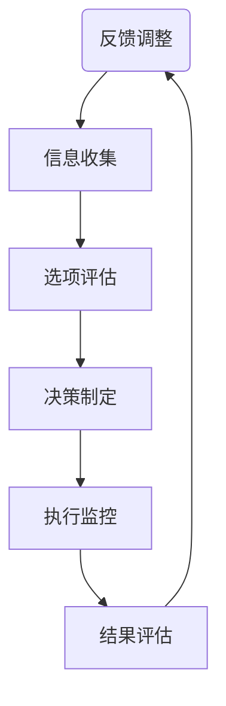
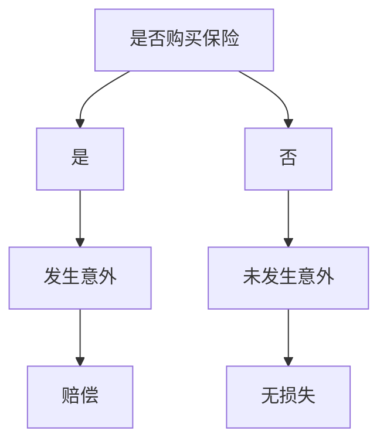

                 


### 决策框架：在不确定性中做出明智选择

#### 关键词
- 决策框架
- 不确定性
- 明智选择
- 决策理论
- 应对策略

#### 摘要
本文旨在探讨在不确定性环境中构建和运用决策框架的重要性。我们将从背景介绍入手，详细解析决策框架的核心概念及其相互关系，通过基础理论和应用方法的阐述，帮助读者理解如何在实际场景中运用决策框架做出明智选择。随后，我们将通过案例分析展示决策框架的实践应用，并对未来决策框架的发展趋势进行展望。

### 目录大纲

1. **引言**
    1.1 决策框架的重要性
    1.2 不确定性的挑战
    1.3 明智选择的必要性

2. **核心概念与联系**
    2.1 决策框架概述
    2.2 决策理论的基本概念
    2.3 决策过程的构成要素

3. **基础理论**
    3.1 决策模型
    3.2 期望效用理论
    3.3 不确定性下的决策方法

4. **应用方法**
    4.1 风险评估与概率分析
    4.2 决策树法
    4.3 仿真模拟与蒙特卡罗方法

5. **案例分析**
    5.1 商业决策案例分析
    5.2 个人财务规划案例分析
    5.3 项目管理案例分析

6. **总结与展望**
    6.1 决策框架的未来发展
    6.2 最佳实践与注意事项
    6.3 拓展阅读

### 1. 引言

在当今复杂多变的社会环境中，决策已经成为个人和企业在面对不确定性时必不可少的技能。无论是商业决策、个人理财规划，还是项目管理，都需要在不确定的环境中做出明智的选择。然而，不确定性带来了巨大的挑战，使得传统的决策方法难以应对。因此，构建一个有效的决策框架，成为在不确定性中做出明智选择的关键。

#### 1.1 决策框架的重要性

决策框架是一种系统化的思维方式，它帮助我们理解和处理复杂问题，从而在不确定性中找到最佳解决方案。一个有效的决策框架应该包括以下几个关键要素：

1. **问题定义**：明确决策的目标和范围，确保决策过程中不偏离主题。
2. **信息收集**：收集和分析与决策相关的信息，包括数据、事实和观点。
3. **选项评估**：分析不同的决策选项，评估其优缺点和潜在风险。
4. **决策制定**：基于分析结果，选择最优或次优的决策方案。
5. **执行监控**：执行决策并监控结果，评估决策的有效性，以便进行必要的调整。

决策框架的重要性体现在以下几个方面：

- **系统化处理**：通过决策框架，我们可以将复杂问题分解为可管理的部分，从而更有效地进行分析和解决。
- **减少偏见**：决策框架可以帮助我们避免因个人情绪、偏见或其他非理性因素影响决策过程。
- **提高决策质量**：通过系统化的分析和评估，决策框架能够帮助我们做出更加明智的选择，减少失误和风险。

#### 1.2 不确定性的挑战

在不确定性环境中，决策的难度显著增加。不确定性可能来自于多种因素，包括：

- **环境变化**：市场的动态变化、技术的快速迭代、政策的不确定性等，都可能影响决策的有效性。
- **信息不完备**：在许多情况下，我们无法获得所有与决策相关的信息，这可能导致决策基于不完全信息。
- **决策延迟**：在不确定性较高的情况下，决策可能需要更长的时间，而延迟可能带来机会成本或损失。
- **决策者的心理因素**：面对不确定性，决策者可能会出现焦虑、恐惧等心理反应，影响决策的理性程度。

#### 1.3 明智选择的必要性

在不确定性的环境中，做出明智选择至关重要。明智选择不仅能够最大化收益，还能够最小化风险。以下是明智选择的一些关键要素：

- **全面分析**：在做出决策之前，我们需要收集和分析尽可能多的相关信息，确保决策基于充分的了解。
- **风险评估**：评估不同决策选项的风险和潜在影响，以便在出现问题时能够及时应对。
- **灵活性**：在不确定性较高的情况下，我们需要具备灵活调整决策方案的能力，以适应环境变化。
- **团队合作**：借助团队的力量，可以集合不同的观点和知识，提高决策的质量。

### 2. 核心概念与联系

在构建决策框架时，理解其核心概念及其相互关系至关重要。以下我们将介绍决策框架的核心概念，并通过Mermaid流程图展示它们之间的关系。

#### 2.1 决策框架概述

决策框架的核心概念包括：

1. **问题定义**：明确决策目标和范围。
2. **信息收集**：收集和分析相关数据和信息。
3. **选项评估**：分析不同决策选项的优缺点。
4. **决策制定**：选择最优或次优的决策方案。
5. **执行监控**：执行决策并监控结果。

以下是决策框架的Mermaid流程图表示：



#### 2.2 决策理论的基本概念

决策理论是构建决策框架的基础。以下介绍几个关键概念：

- **理性决策**：基于充分信息和逻辑分析，选择最优决策方案。
- **有限理性决策**：在信息不完备和有限认知能力下，做出合理但不一定是最佳的决策。
- **贝叶斯决策**：基于概率和效用理论，选择预期效用最大的决策方案。

#### 2.3 决策过程的构成要素

决策过程可以细分为以下几个阶段：

1. **问题识别**：识别决策问题，明确需要解决的问题。
2. **目标设定**：设定决策目标，确定需要达成的结果。
3. **方案生成**：生成可供选择的决策方案。
4. **方案评估**：评估不同方案的优缺点。
5. **方案选择**：选择最佳或次优的决策方案。
6. **方案实施**：执行决策方案并监控结果。
7. **结果评估**：评估决策结果，进行反馈和调整。

### 3. 基础理论

在决策框架中，基础理论是理解和应用决策方法的关键。以下我们将介绍决策模型、期望效用理论和不确定性下的决策方法。

#### 3.1 决策模型

决策模型是用于分析和解决决策问题的数学工具。以下介绍几种常见的决策模型：

- **确定型决策模型**：适用于决策结果可以明确预测的情况。
- **风险型决策模型**：适用于存在不确定性的情况，如决策树模型。
- **不确定性决策模型**：适用于完全不确定的情况，如贝叶斯决策模型。

#### 3.2 期望效用理论

期望效用理论是一种基于概率和效用的决策模型。其核心思想是在不确定的情况下，选择具有最大预期效用的决策方案。期望效用计算公式如下：

\[ EU = \sum_{i=1}^{n} p_i \cdot u_i \]

其中，\( p_i \) 表示方案 \( i \) 发生的概率，\( u_i \) 表示方案 \( i \) 的效用值。

#### 3.3 不确定性下的决策方法

在不确定性环境中，我们需要采用一些特殊的方法来应对决策挑战。以下介绍几种常用的方法：

- **风险评估**：通过分析不同决策选项的风险，评估其可能的结果和损失。
- **决策树法**：通过构建决策树，将决策过程分解为一系列的分支和节点，以便更清晰地分析决策路径。
- **仿真模拟**：通过模拟不同的决策场景，评估不同决策方案的结果和风险。
- **蒙特卡罗方法**：通过随机模拟，估计决策结果的概率分布和预期效用。

#### 3.4 伪代码与数学模型

以下是一个简单的决策树模型的伪代码示例，用于选择最佳行动方案：

```pseudo
function DecisionTree(actions, probabilities, utilities):
    best_action = None
    best_utility = -infinity

    for action in actions:
        utility = 0
        for state in states:
            probability = probabilities[state][action]
            u = utilities[state]
            utility += probability * u

        if utility > best_utility:
            best_utility = utility
            best_action = action

    return best_action
```

数学模型方面，我们可以使用以下公式来表示期望效用：

\[ EU = \sum_{i=1}^{n} p_i \cdot u_i \]

其中，\( p_i \) 为状态 \( i \) 的概率，\( u_i \) 为状态 \( i \) 的效用值。

### 4. 应用方法

在了解了决策框架的基础理论和核心概念后，我们需要将其应用到实际场景中。以下将介绍几种常见的应用方法，包括风险评估、决策树法和仿真模拟等。

#### 4.1 风险评估与概率分析

在决策过程中，风险评估是一个至关重要的环节。通过评估不同决策选项的风险，我们可以更好地理解可能的结果和损失，从而做出更明智的选择。

- **定性风险评估**：通过专家评估或历史数据，对风险进行定性分析。
- **定量风险评估**：通过概率分析和数学模型，对风险进行定量分析。

以下是一个简单的定性风险评估示例：

| 决策选项 | 风险评估 |
| --- | --- |
| 选项A | 低 |
| 选项B | 中 |
| 选项C | 高 |

在定量风险评估中，我们可以使用概率分布来描述风险，如正态分布、泊松分布等。以下是一个正态分布的示例：

```latex
$$X \sim N(\mu, \sigma^2)$$

$$P(X \leq x) = \int_{-\infty}^{x} \frac{1}{\sqrt{2\pi\sigma^2}} e^{-\frac{(x-\mu)^2}{2\sigma^2}} dx$$
```

#### 4.2 决策树法

决策树是一种常用的决策分析方法，它将决策过程分解为一系列的选择和结果，以便更清晰地分析决策路径。以下是一个简单的决策树示例：



在这个例子中，我们首先决定是否购买保险。如果选择购买，接下来评估是否发生意外。如果发生意外，则申请赔偿；如果没有发生意外，则无损失。如果选择不购买保险，则无论是否发生意外，都没有赔偿。

#### 4.3 仿真模拟与蒙特卡罗方法

仿真模拟是一种通过模拟不同场景，评估决策方案结果和风险的方法。蒙特卡罗方法是一种基于随机模拟的仿真模拟技术，常用于估计决策结果的概率分布和预期效用。

以下是一个简单的蒙特卡罗模拟示例：

```python
import random

def monte_carlo_simulation(actions, probabilities, utilities, trials):
    results = []

    for _ in range(trials):
        state = random.choices(states, weights=probabilities)[0]
        utility = utilities[state]
        results.append(utility)

    return results

actions = ['A', 'B', 'C']
probabilities = [0.3, 0.5, 0.2]
utilities = [10, 5, -5]

trials = 1000
results = monte_carlo_simulation(actions, probabilities, utilities, trials)

print(f"Expected Utility: {sum(results) / trials}")
```

在这个示例中，我们使用蒙特卡罗方法模拟了1000次试验，评估不同决策方案的预期效用。最终，我们计算出平均预期效用，以帮助决策。

### 5. 案例分析

为了更好地理解决策框架的实际应用，以下我们将通过三个案例展示决策框架在商业决策、个人财务规划和项目管理中的运用。

#### 5.1 商业决策案例分析

假设一家初创公司需要决定是否投资一个新的产品线。以下是决策框架的应用过程：

1. **问题定义**：明确投资新产品的目标和预期收益。
2. **信息收集**：收集与新产品线相关的市场数据、竞争对手信息和潜在客户需求。
3. **选项评估**：分析不同投资方案的优缺点，如投资金额、预期利润和风险。
4. **决策制定**：选择具有最高预期收益和最低风险的投资方案。
5. **执行监控**：执行投资决策，并定期评估产品线的运营情况和收益。

通过决策框架的应用，这家初创公司能够系统地分析投资新产品的决策，从而做出更加明智的选择。

#### 5.2 个人财务规划案例分析

个人财务规划也是一个复杂的决策过程。以下是一个个人财务规划的案例：

1. **问题定义**：明确个人财务目标，如退休规划、购房计划等。
2. **信息收集**：收集与财务目标相关的信息，如收入、支出、储蓄和投资。
3. **选项评估**：分析不同的储蓄和投资方案，如定期存款、股票投资和基金投资。
4. **决策制定**：选择最适合个人财务目标的储蓄和投资方案。
5. **执行监控**：定期评估财务状况，调整储蓄和投资策略。

通过决策框架的应用，个人能够更好地规划自己的财务，确保财务目标的实现。

#### 5.3 项目管理案例分析

项目管理是一个复杂的过程，涉及多个阶段和多个参与者。以下是一个项目管理案例：

1. **问题定义**：明确项目的目标和交付物。
2. **信息收集**：收集与项目相关的信息，如项目范围、时间表和资源需求。
3. **选项评估**：分析不同的项目管理方案，如敏捷开发、瀑布模型和迭代开发。
4. **决策制定**：选择最适合项目特点的管理方案。
5. **执行监控**：执行项目计划，并监控项目进度和资源使用。

通过决策框架的应用，项目经理能够更好地应对项目中的不确定性，确保项目顺利完成。

### 6. 总结与展望

通过本文的探讨，我们可以看到决策框架在应对不确定性中的重要性。决策框架不仅帮助我们系统地分析问题，明确决策目标，评估不同决策选项，还能提高决策的灵活性和有效性。

#### 6.1 决策框架的未来发展

随着人工智能和大数据技术的发展，决策框架有望进一步改进和优化。以下是未来决策框架发展的几个方向：

- **智能化决策支持**：利用人工智能技术，如机器学习和深度学习，为决策者提供更准确的预测和推荐。
- **自动化决策流程**：通过自动化工具和算法，简化决策过程，提高决策效率。
- **定制化决策框架**：根据不同领域和决策者的特点，设计定制化的决策框架，提高决策的相关性和实用性。

#### 6.2 最佳实践与注意事项

在应用决策框架时，以下是一些最佳实践和注意事项：

- **明确决策目标**：确保决策目标明确、具体，以便更好地评估决策选项。
- **全面收集信息**：在决策过程中，全面收集和分析相关信息，以避免因信息不全导致的决策失误。
- **定期评估与调整**：定期评估决策结果，并根据实际情况调整决策方案，以适应环境变化。
- **保持灵活性**：在不确定性较高的环境中，保持决策方案的灵活性，以应对突发情况。

#### 6.3 拓展阅读

为了深入了解决策框架的原理和应用，以下推荐一些拓展阅读资源：

- **《决策分析：决策理论与应用》**：详细介绍了决策理论的基础知识，以及决策分析在实际应用中的运用。
- **《决策与判断：心理学视角》**：从心理学角度探讨决策过程中的心理因素，以及如何减少偏见和提升决策质量。
- **《决策模型与算法：应用指南》**：介绍了多种决策模型和算法，以及如何在实际场景中应用。

### 作者信息

- **作者：AI天才研究院/AI Genius Institute & 禅与计算机程序设计艺术 /Zen And The Art of Computer Programming**

---

本文旨在为读者提供一个全面的决策框架概述，帮助大家在不确定的环境中做出明智选择。通过理解决策框架的核心概念、基础理论和应用方法，我们可以更好地应对复杂问题，提高决策质量。希望本文能够对您的决策实践有所启发和帮助。

