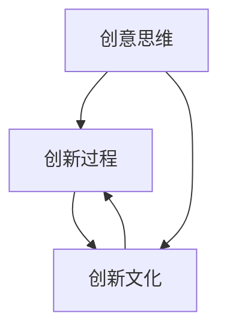
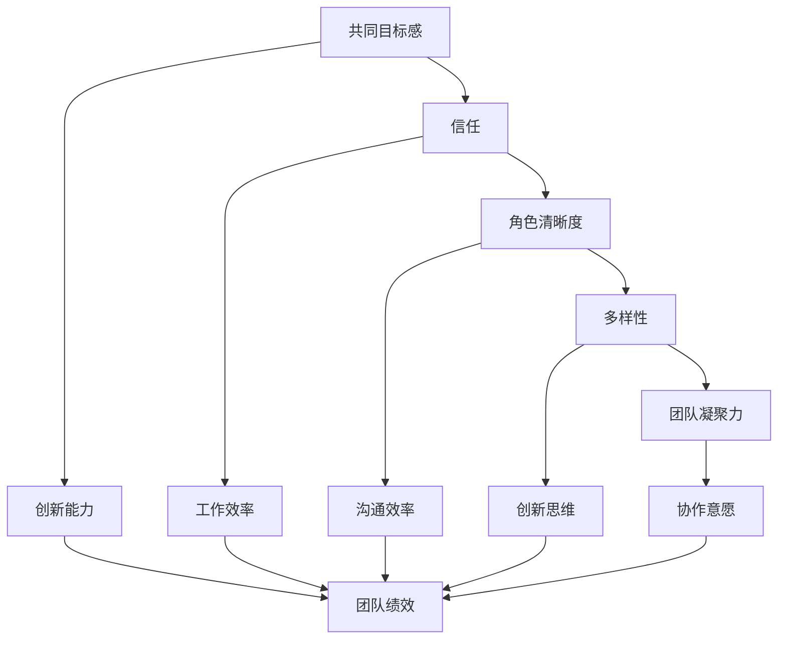

                 

### 文章标题

《创新型组织氛围：激发创意的环境营造》

### 文章关键词

- 创新型组织
- 创意激发
- 工作环境设计
- 员工激励
- 领导力
- 持续创新

### 文章摘要

本文旨在探讨如何构建一个具有高度创新活力的组织氛围。通过对创新型组织的核心概念、工作环境设计、员工激励与培养、领导力与团队氛围构建等方面的深入分析，本文提出了构建创新型组织氛围的策略和方法。同时，通过国内外成功案例的剖析，总结了创新组织的共同特点和成功经验，为组织管理者提供了有益的参考。

## 引言

在当今这个快速变化和高度竞争的商业环境中，创新型组织成为企业成功的关键因素。创新型组织不仅能够迅速响应市场变化，还能够持续推出创新产品和服务，从而保持竞争优势。然而，构建一个能够激发员工创意和创新的组织氛围并非易事。本篇文章将探讨如何通过设计一个有利的组织环境，来激发员工的创意和创新潜力。

### 创意与创新的重要性

创意与创新是现代社会发展的核心驱动力。创意指的是创造新颖的想法、概念或解决方案，而创新则是将创意转化为实际成果的过程。一个具有创新能力的组织，能够持续地为市场带来新颖的解决方案，从而在竞争中脱颖而出。以下是创意与创新的重要性概述：

1. **提高竞争力**：创新可以帮助企业在市场中获得差异化竞争优势，从而吸引更多客户。
2. **增加收入**：通过创新，企业可以推出更具吸引力的产品或服务，从而提高销售额和利润率。
3. **提升员工满意度**：一个鼓励创意和创新的组织环境，能够激发员工的创造力和工作热情，提高员工满意度和忠诚度。
4. **促进可持续发展**：创新有助于企业发现新的业务模式和增长机会，从而实现可持续发展。

### 创新型组织的现状与挑战

虽然创新型组织的重要性不言而喻，但许多企业在实际运作中仍然面临诸多挑战。以下是一些常见的现状和挑战：

1. **传统组织文化的束缚**：许多企业的组织文化过于僵化，不利于创新思维的流动和实施。
2. **资源不足**：创新需要大量的人力、财力和时间投入，许多企业在资源有限的情况下难以进行有效的创新。
3. **员工激励问题**：缺乏有效的激励机制，员工创新的积极性和创造力难以得到充分激发。
4. **领导力不足**：许多领导者缺乏激发团队创新的能力和意识，导致创新项目难以成功实施。

### 本书的目的

本书旨在解决上述挑战，提供构建创新型组织氛围的理论和实践指导。通过深入分析创新型组织的核心概念、工作环境设计、员工激励与培养、领导力与团队氛围构建等方面的内容，本书将帮助组织管理者构建一个具有高度创新活力的组织环境。

## 创新型组织的核心概念

创新型组织是指能够持续地产生创新思维、创新产品和服务的组织。创新型组织的核心概念包括创意思维、创新过程和创新文化。下面我们将逐一探讨这些核心概念及其相互关系。

### 创意思维

创意思维是指通过创造性的思考方式，产生新颖想法和概念的能力。它是创新型组织的基石，决定了组织的创新能力。创意思维可以通过多种方法激发，包括：

1. **头脑风暴**：通过集体讨论，激发团队成员的创新思维。
2. **思维导图**：将创意以图示形式展示，帮助团队成员更清晰地理解和探索创意。
3. **反转思维**：从相反的角度思考问题，产生意想不到的创新解决方案。

### 创新过程

创新过程是将创意转化为实际成果的过程。它通常包括以下几个阶段：

1. **创意生成**：通过各种方法收集和产生创意。
2. **筛选和评估**：对创意进行筛选和评估，确定哪些创意具有实际可行性。
3. **概念开发**：将选定的创意进一步发展成具体的概念。
4. **原型制作**：制作原型，测试和验证概念的实际效果。
5. **产品化**：将验证成功的概念转化为实际产品或服务。

### 创新文化

创新文化是指组织内部对创新的认同、鼓励和支持。创新文化是创新型组织的灵魂，它决定了组织的创新氛围和创新活力。创新文化的关键要素包括：

1. **鼓励冒险和失败**：在创新过程中，冒险和失败是不可避免的。一个健康的创新文化应该鼓励员工敢于尝试，即使失败也受到肯定。
2. **跨部门合作**：创新往往需要跨部门的协作。一个良好的创新文化应该促进不同部门之间的沟通和合作。
3. **持续学习和成长**：创新文化鼓励员工持续学习和成长，不断提升个人和团队的创新能力。
4. **透明和开放**：创新文化应该倡导透明和开放，让员工的创意和创新成果得到广泛认可和分享。

### 核心概念之间的关系架构

创意思维、创新过程和创新文化是创新型组织的核心概念，它们之间存在紧密的相互关系。创意思维是创新过程的基础，决定了创新的质量和方向；创新过程将创意转化为实际成果，是创新文化实现的途径；创新文化则为创意思维和创新过程提供支持和保障，形成一个良性循环。

为了更好地理解这些核心概念之间的关系，我们可以使用Mermaid流程图来表示：

通过这个流程图，我们可以清晰地看到创意思维、创新过程和创新文化之间的相互作用和依赖关系。创意思维是驱动创新的核心动力，创新过程是实现创意的具体路径，而创新文化则是保障和创新过程持续发展的基础。

总之，创新型组织的核心概念是构建一个具有高度创新活力的组织氛围的基础。通过深入理解和实践这些核心概念，组织可以有效地激发员工的创意和创新潜力，实现持续创新和成功。

## 激发创意的工作环境设计

一个激发创意的工作环境是创新型组织的重要基础。通过合理的设计和布局，工作环境可以极大地提升员工的创造力，促进团队合作，并提高整体工作效率。以下将探讨激发创意的工作环境设计的关键要素。

### 空间布局与设计

空间布局是工作环境设计的重要组成部分，它直接影响到员工的舒适度和工作效率。以下是几种常见的空间布局及其优缺点：

#### 开放式办公空间

**优势：**
1. **促进沟通与合作**：开放式办公空间能够打破传统的隔间，促进员工之间的交流和互动。
2. **提升员工参与感**：开放式办公空间使员工更容易参与团队活动，提高员工的归属感和参与感。
3. **节省成本**：开放式办公空间节省了隔断和私人空间的建设成本。

**挑战：**
1. **隐私保护问题**：开放式办公空间可能导致员工在处理敏感或需要专注的工作时受到干扰。
2. **噪音干扰**：开放的环境可能会带来较大的噪音，影响员工的工作集中度。

#### 私密空间设置

**优势：**
1. **隐私保护**：私密空间为员工提供了处理敏感信息和需要专注工作时的私人空间。
2. **提高工作效率**：在私密空间中，员工可以更加专注地工作，提高工作效率。

**挑战：**
1. **资源分配不均**：私密空间可能不足以满足所有员工的需求，导致部分员工无法获得充足的隐私保护。
2. **增加成本**：建设私密空间需要额外的资金投入。

#### 创意工作区

**优势：**
1. **激发创意**：创意工作区通常设计独特，提供多样化的工作环境，有助于激发员工的创造力。
2. **灵活性**：创意工作区可以根据不同项目和工作需求灵活调整，满足多样化的工作需求。

**挑战：**
1. **设计成本高**：创意工作区的设计和建设成本较高，需要一定的资金支持。
2. **维护难度大**：创意工作区的设计复杂，维护和保养难度较大。

### 技术支持与工具

现代工作环境离不开技术的支持，合适的工具和基础设施能够极大地提升工作效率和创意。以下是几个关键要素：

#### 创意工具的选用

**优势：**
1. **丰富创意表达**：创意工具如思维导图软件、虚拟白板等能够帮助员工更直观地表达和交流创意。
2. **提升协作效率**：通过在线协作工具，团队成员可以实时共享和编辑创意，提高协作效率。

**挑战：**
1. **学习和适应成本**：员工需要时间学习和适应新的创意工具。
2. **数据安全性问题**：在线协作工具可能带来数据泄露的风险。

#### 技术基础设施的建设

**优势：**
1. **提升网络速度**：高速网络环境能够提升员工在处理大数据和进行在线协作时的效率。
2. **稳定的数据存储**：稳定的数据存储系统确保员工的数据安全和便捷访问。

**挑战：**
1. **建设和维护成本**：建设和维护高质量的技术基础设施需要大量资金投入。
2. **技术更新压力**：技术基础设施需要定期更新，以适应不断变化的技术需求。

#### 云计算与大数据的支持

**优势：**
1. **资源灵活配置**：云计算使得组织可以灵活配置计算资源，满足不同项目的需求。
2. **数据分析和挖掘**：大数据技术可以帮助组织从海量数据中挖掘有价值的信息，为创新提供数据支持。

**挑战：**
1. **数据安全与隐私问题**：云计算和数据存储带来了数据安全和隐私保护的新挑战。
2. **技术依赖性**：过度依赖云计算和大数据技术可能会增加组织的风险。

通过合理设计和布局工作环境，选用合适的创意工具和基础设施，组织可以创造一个有利于激发员工创意和创新的工作氛围。同时，组织需要不断关注技术发展的趋势，及时更新和优化技术基础设施，以支持持续的创新和发展。

### 空间布局案例分析

为了更好地理解空间布局与设计对员工创意和创新的影响，我们来看两个实际案例。

#### 案例一：谷歌的“弹性工作空间”

谷歌公司以其创新的工作环境而闻名，其中一个关键设计是“弹性工作空间”。这种空间设计提供了多种工作区域，包括开放式工作台、私密办公室、休息区和会议室等。员工可以根据自己的工作需求和状态选择合适的工作区域。这种设计不仅满足了员工对隐私和专注度的需求，还促进了员工之间的交流与合作。

**优点：**
- 增加了员工的灵活性和自主性。
- 提高了工作满意度。
- 促进了团队协作和创新。

**挑战：**
- 管理复杂，需要确保不同区域都能满足员工需求。
- 高端设计导致建设和维护成本较高。

#### 案例二：腾讯的“联合办公空间”

腾讯公司也在其办公空间设计中采用了多种布局，包括开放式空间、私密办公室和联合办公空间。联合办公空间允许来自不同部门和项目的员工共同工作，促进了跨部门合作和知识共享。此外，这些空间还配备了最新的技术和工具，如虚拟现实设备、3D打印机和人工智能工具等。

**优点：**
- 提供了多样化的工作环境，满足不同员工的需求。
- 促进跨部门合作，激发创新思维。
- 提高了资源利用效率。

**挑战：**
- 空间共享可能导致隐私保护问题。
- 需要更多管理和协调工作。

通过以上案例分析，我们可以看到，合理的工作空间布局设计对激发员工创意和创新具有显著影响。组织需要根据自身特点和员工需求，设计出最适合的工作环境，以支持持续创新。

## 员工激励与创新能力培养

在构建创新型组织的过程中，如何激励员工和创新能力的培养是关键问题。有效的激励措施和培训方法不仅能够提升员工的积极性，还能促进团队整体创新能力的提升。以下将探讨激励理论在创新型组织中的应用、培训与发展策略以及内部创新竞赛与项目。

### 激励理论在创新型组织中的应用

激励是激发员工动机和行为的过程，通过激励措施，组织可以鼓励员工积极参与创新活动。以下是几种常见的激励理论及其在创新型组织中的应用：

#### 马斯洛需求层次理论

**理论要点：** 马斯洛需求层次理论认为，人的需求从低到高分为五个层次：生理需求、安全需求、社交需求、尊重需求和自我实现需求。

**应用：** 在创新型组织中，管理者可以通过满足员工的低层次需求（如提供良好的工作环境和福利）来确保员工的基本满意度。同时，通过提供机会和资源，鼓励员工追求高层次需求（如参与创新项目和获得职业发展），从而激发员工的内在动机和创新热情。

#### 班杜拉的自我决定理论

**理论要点：** 班杜拉的自我决定理论强调个体在实现目标时的自主性和内在动机。自我决定包括认知、情感和行动的自主性。

**应用：** 在创新型组织中，管理者可以通过赋予员工更多的自主权，让他们自主选择创新项目和目标，从而提高员工的内在动机和创新活力。同时，通过提供反馈和认可，增强员工的自我效能感，使他们更有信心实现创新目标。

#### 奖励与认可机制

**理论要点：** 奖励与认可机制通过物质奖励、精神奖励和公开认可，激发员工的积极性和创造力。

**应用：** 在创新型组织中，管理者可以设立创新奖励计划，对在创新项目中表现突出的员工给予物质奖励（如奖金、股票期权）和精神奖励（如荣誉称号、公开表彰）。此外，通过在团队会议和公司内部网站上展示员工的创新成果，增强员工的荣誉感和成就感。

### 培训与发展

培训与发展是提升员工创新能力和技能的重要途径。以下是一些有效的培训与发展策略：

#### 创新能力提升的培训方法

**1. 创意思维培训：** 通过训练员工的创意思维技巧，如头脑风暴、思维导图、反转思维等，提升员工的创新能力。

**2. 创新工具培训：** 为员工提供使用创新工具（如设计软件、编程工具等）的培训，使他们能够更有效地开展创新工作。

**3. 创新案例研究：** 分析国内外成功企业的创新案例，帮助员工了解成功的创新路径和策略。

#### 跨部门交流与合作

**1. 交叉培训：** 通过跨部门的培训，让员工了解其他部门的工作内容和需求，促进跨部门协作和创新。

**2. 内部讲座和研讨会：** 组织内部讲座和研讨会，邀请外部专家和内部优秀员工分享创新经验和见解。

**3. 项目合作：** 通过设立跨部门项目，让员工在项目中协作，共同解决复杂问题，提升创新能力。

#### 内部创新竞赛与项目

内部创新竞赛和项目是激发员工创新热情和能力的有效手段。以下是一些实施策略：

**1. 创新竞赛：** 设立内部创新竞赛，鼓励员工提出创新项目，并进行展示和评选。通过竞赛，可以激发员工的创新潜力，选拔出优秀创新项目。

**2. 创新项目资助：** 为入选的创新项目提供资金和资源支持，帮助项目团队实现创新目标。

**3. 项目跟踪和评估：** 建立项目跟踪和评估机制，对创新项目的进展和成果进行监控和评价，确保项目顺利进行并取得实际效果。

通过有效的激励措施和培训方法，创新型组织可以激发员工的创新潜力，提升整体创新能力，实现持续创新和成功。

### 案例分析

为了更好地理解员工激励与创新能力培养的实际效果，以下我们将通过两个实际案例来分析：

#### 案例一：微软的创新奖励计划

微软公司设立了多项创新奖励计划，包括“创新者奖”和“杰出技术贡献奖”。每年，微软会根据员工的创新项目成果和贡献进行评选，获奖者将获得丰厚的奖金和公开表彰。这一举措不仅激励了员工积极参与创新项目，还提高了员工的工作满意度和忠诚度。

**优点：**
- 明确的激励机制，提高了员工创新积极性。
- 公开表彰，增强了员工的荣誉感和归属感。
- 有助于选拔和培养优秀的创新人才。

**挑战：**
- 管理成本高，需要投入大量时间和资源进行评选和奖励。
- 需要确保奖励的公平性和透明性，避免出现争议。

#### 案例二：亚马逊的内部创新项目

亚马逊公司每年都会设立多个内部创新项目，鼓励员工提出创新想法并进行实践。亚马逊为这些项目提供了资金、技术和资源支持，并设立了项目导师制度，帮助项目团队解决技术和管理上的难题。通过这些举措，亚马逊不仅激发了员工的创新潜力，还推出了一系列创新产品和服务，增强了公司的市场竞争力。

**优点：**
- 提供了充足的资源支持，保证了创新项目的顺利进行。
- 项目导师制度，提升了项目团队的技术和管理能力。
- 创新项目的实际成果显著，提升了公司的整体创新能力。

**挑战：**
- 项目管理和协调难度大，需要确保项目进度和质量。
- 需要平衡创新项目的数量和质量，避免资源浪费。

通过以上案例分析，我们可以看到，有效的员工激励与创新能力培养策略不仅能够激发员工的创新潜力，提升组织整体创新能力，还能为组织带来实际的经济效益和市场竞争力。

## 领导力与团队氛围构建

在创新型组织中，领导力与团队氛围构建是激发员工创意和创新的关键因素。有效的领导力不仅能够为团队提供明确的指引和支持，还能够营造一个积极向上的团队氛围，从而促进创新活动的开展。以下将探讨领导者的角色与责任、如何激发团队创意以及如何处理团队冲突。

### 领导者的角色与责任

在创新型组织中，领导者扮演着至关重要的角色。领导者不仅是团队的目标设定者和资源提供者，更是员工创新思维和能力的激发者。以下是领导者应具备的角色和责任：

1. **愿景和目标的设定**：领导者需要为团队设定清晰的目标和愿景，明确创新的方向和目标，使团队成员有共同的目标和方向感。

2. **资源提供者**：领导者需要为团队提供充足的资源，包括资金、技术和人员支持，确保创新项目的顺利进行。

3. **激励和认可**：领导者需要通过激励和认可，激发员工的创新热情和积极性，使员工在创新过程中感受到成就和认可。

4. **冲突解决者**：领导者需要具备解决团队内部冲突的能力，确保团队氛围和谐，为创新提供良好的环境。

5. **知识分享者**：领导者需要鼓励团队成员之间的知识共享和交流，促进团队整体创新能力的提升。

### 如何激发团队创意

激发团队创意是领导者的核心任务之一。以下是一些有效的策略：

1. **营造开放和包容的氛围**：领导者需要营造一个开放和包容的团队氛围，鼓励员工提出不同的意见和想法。通过倾听和尊重员工的意见，领导者可以激发员工的创造力和创新思维。

2. **提供挑战性的任务**：领导者可以赋予团队具有挑战性的任务，激发员工的创造力和解决问题的能力。通过设定高难度但可行的目标，领导者可以推动团队不断突破自己的舒适区。

3. **鼓励跨部门合作**：跨部门合作可以促进不同领域知识的融合，激发新的创意。领导者可以通过设立跨部门项目或组织团队交流，促进跨部门之间的合作和知识共享。

4. **提供学习和发展机会**：领导者可以鼓励员工参加培训和学习活动，提升他们的技能和知识水平。通过不断学习和成长，员工可以更加自信地提出创新想法和解决方案。

5. **建立创新奖励机制**：领导者可以设立创新奖励机制，对在创新项目中表现突出的员工进行奖励和表彰。通过物质和精神奖励，领导者可以激发员工的创新热情和积极性。

### 如何处理团队冲突

在团队中，冲突是不可避免的。有效的领导者需要具备处理团队冲突的能力，确保团队氛围和谐，为创新提供良好的环境。以下是一些处理团队冲突的策略：

1. **倾听和理解**：领导者需要耐心倾听团队成员的意见和想法，理解他们的立场和需求。通过有效沟通，领导者可以消除误解和矛盾。

2. **中立和公正**：领导者需要保持中立和公正，不偏袒任何一方。在处理冲突时，领导者需要客观分析事实，确保决策的公平性。

3. **寻求共识**：领导者可以通过讨论和协商，寻求团队成员之间的共识。通过共同寻找解决问题的方法，领导者可以促进团队的团结和合作。

4. **建立沟通机制**：领导者可以建立有效的沟通机制，确保团队成员之间的信息流畅和透明。通过定期的团队会议和沟通活动，领导者可以及时发现和解决冲突。

5. **提供支持**：领导者需要为团队成员提供支持和帮助，确保他们在处理冲突时能够得到必要的资源和支持。通过提供心理辅导和咨询服务，领导者可以帮助员工缓解压力和焦虑。

通过有效的领导力和团队氛围构建，创新型组织可以激发员工的创意和创新潜力，实现持续创新和成功。

### 团队合作的心理学基础

团队合作在创新型组织中至关重要，而理解其背后的心理学基础有助于领导者更有效地管理和激励团队成员。以下是团队合作中几个关键心理因素及其对团队氛围和创新的影响：

1. **共同目标感**：共同目标感是指团队成员对团队目标和使命的认同和投入。研究表明，当团队成员感到他们的工作与团队目标紧密相连时，他们更有可能表现出高水平的协作和创新行为。**实证研究**显示，共同目标感可以显著提高团队的绩效和创造力。

2. **信任**：信任是团队合作的核心，它指的是团队成员对彼此能力和诚信的信心。一个信任度高的团队，成员之间更愿意分享信息、知识和资源，从而促进创新和协作。**心理学研究**表明，信任可以减少团队内部的摩擦和冲突，提高团队的整体效率和创新能力。

3. **角色清晰度**：角色清晰度是指团队成员对各自职责和角色的明确理解。当一个团队的角色清晰时，成员知道自己的任务和期望，这有助于减少模糊性和混淆，从而提高工作效率和创新能力。**行为学研究**表明，角色清晰度可以显著降低团队内部的沟通成本，提高团队绩效。

4. **多样性**：多样性指的是团队成员在背景、经验和技能上的差异。一个多样化的团队可以带来不同的视角和观点，从而激发更多的创意和创新。**心理学研究**表明，多样性可以促进创新思维和问题解决能力，但同时也可能带来沟通和合作的挑战。

5. **团队凝聚力**：团队凝聚力是指团队成员之间的相互吸引和归属感。高凝聚力的团队往往更愿意为团队目标共同努力，这有助于推动创新和协作。**社会心理学研究**表明，团队凝聚力可以增强团队成员的协作意愿，提高团队的整体绩效和创新能力。

为了更好地理解这些心理学因素如何影响团队合作和创新能力，我们可以通过以下Mermaid流程图来展示其关系：

通过这个流程图，我们可以清晰地看到共同目标感、信任、角色清晰度、多样性和团队凝聚力这些关键心理因素如何相互作用，共同影响团队的工作效率、创新能力和团队绩效。

### 团队氛围的测量与改进

团队氛围的测量是评估和改进团队表现的重要环节。以下是一些常用的测量方法和改进策略：

#### 测量方法

1. **问卷调查**：通过设计专业的问卷调查，收集团队成员对团队氛围的感知和评价。问卷调查可以涵盖多个维度，如共同目标感、信任、角色清晰度、多样性和团队凝聚力等。

2. **访谈和焦点小组**：通过访谈和焦点小组讨论，深入了解团队成员对团队氛围的具体感受和看法。这种方法有助于获取更多细节和深度信息。

3. **绩效评估**：通过团队绩效评估，分析团队在任务完成、创新和协作方面的表现，从而间接反映团队氛围的质量。

#### 改进策略

1. **提高共同目标感**：通过明确团队目标和使命，确保团队成员对团队目标有清晰的认识。可以通过定期的团队会议、目标设定活动和共享成功案例来强化共同目标感。

2. **建立信任机制**：通过加强团队沟通和协作，建立透明和开放的工作环境，促进团队成员之间的信任。例如，设立团队沟通平台、定期组织团队建设活动等。

3. **明确角色和职责**：确保每个团队成员都清楚自己的角色和职责，减少模糊性和混淆。可以通过角色描述、职责分配和团队会议等方式明确角色。

4. **促进多样性**：鼓励团队成员展示自己的多样性和不同的观点，通过跨部门项目和团队多样化培训来促进多样性。多样性培训可以帮助团队成员更好地理解和尊重彼此的差异。

5. **提升团队凝聚力**：通过团队建设活动、团队奖励和认可机制来提升团队凝聚力。定期组织团队活动，如团队建设训练、团队聚餐和团队旅行，可以增强团队成员之间的联系和归属感。

通过有效的测量和改进策略，组织可以不断提升团队氛围，为创新和协作提供良好的支持。

### 团队协作工具与方法

在创新型组织中，团队协作工具和方法的有效使用对于提高团队工作效率和创新能力至关重要。以下将介绍几种常用的团队协作工具和方法，以及如何通过这些工具和方法促进团队协作和创新能力。

#### 团队协作工具

1. **即时通讯工具**：如Slack、Microsoft Teams和WhatsApp等。这些工具能够实时交流，快速传递信息和任务，提高沟通效率。

2. **项目管理工具**：如Trello、Asana和JIRA等。这些工具可以帮助团队管理任务、跟踪项目进度和分配资源，确保项目按时完成。

3. **文档协作工具**：如Google Docs、Microsoft Office 365和Notion等。这些工具支持多人实时编辑文档，促进知识共享和协作。

4. **虚拟会议工具**：如Zoom、Microsoft Teams和Webex等。这些工具支持远程团队成员的实时沟通和协作，方便进行在线会议和讨论。

#### 团队协作方法

1. **头脑风暴**：头脑风暴是一种有效的创意激发方法，通过集体讨论和自由表达，团队成员可以产生大量的创意和想法。为了确保头脑风暴的有效性，可以采用以下步骤：
   - **明确目标**：确保所有参与者都清楚头脑风暴的目标和范围。
   - **自由表达**：鼓励每个团队成员自由表达自己的想法，无论这些想法是否可行。
   - **记录和分类**：将所有的创意记录下来，并进行分类和筛选，以确定哪些创意最具潜力和价值。

2. **团队建设活动**：团队建设活动有助于增强团队成员之间的信任和凝聚力，促进协作。以下是一些有效的团队建设活动：
   - **户外拓展**：如团队徒步、攀岩和野餐等，这些活动可以增强团队成员之间的沟通和信任。
   - **室内游戏**：如团队桌游、团队竞赛和模拟游戏等，这些活动可以增强团队成员的协作和解决问题的能力。
   - **团队培训**：通过专业培训，提高团队成员的技能和知识，从而增强团队的整体能力。

3. **敏捷开发方法**：敏捷开发是一种以人为核心、迭代和增量的软件开发方法，它强调团队协作和持续交付价值。以下是一些敏捷开发的关键方法：
   - **每日站会**：每日站会是一种简短的团队会议，团队成员可以分享工作进展、遇到的问题和计划，从而提高团队的沟通和协作。
   - **迭代开发**：通过将项目分为多个迭代周期，团队可以不断交付功能完整的软件版本，并根据用户反馈进行优化。
   - **持续集成与持续部署**：通过持续集成和持续部署，团队可以快速发现和解决代码中的错误，提高软件质量和开发效率。

#### 通过协作工具和方法促进团队协作和创新能力

1. **工具集成**：通过集成不同的协作工具，如项目管理工具、文档协作工具和虚拟会议工具，团队可以更高效地协调工作，提高协作效率。

2. **流程优化**：通过分析和优化团队的工作流程，消除冗余和低效环节，提高团队的工作效率。

3. **知识共享**：通过协作工具，如文档协作工具和虚拟会议工具，团队可以实时共享知识和信息，促进团队成员之间的学习和成长。

4. **反馈与改进**：通过定期的团队会议和评估，收集团队成员的反馈和意见，不断改进团队协作方法和工具，以适应不断变化的工作需求。

通过使用合适的团队协作工具和方法，创新型组织可以增强团队协作和创新能力，从而实现持续创新和成功。

### 创新型组织的成功案例

为了更深入地理解如何构建一个创新型组织氛围，我们可以通过分析国内外创新型组织的成功案例，探讨它们的核心特点和成功经验。以下将列举几个著名的创新型组织，并分析其独特的组织文化、领导力策略和创新能力。

#### 案例一：谷歌

谷歌（Google）作为全球最具创新力的科技公司之一，其成功离不开其独特的组织文化和领导力策略。

**核心特点：**
1. **开放和包容的文化**：谷歌的创始人拉里·佩奇和谢尔盖·布林提倡开放和包容的文化，鼓励员工自由表达观点和创新想法。
2. **员工福利和成长机会**：谷歌为员工提供了丰富的福利，如免费餐饮、健身设施和心理健康支持，同时提供了大量的培训和发展机会。
3. **创新实验和风险管理**：谷歌允许员工花费20%的工作时间进行个人感兴趣的项目，这一举措催生了多项创新产品，如Gmail和Google News。

**领导力策略：**
- **以身作则**：谷歌的领导者通过实际行动展示其对创新和员工的重视，营造了一个鼓励冒险和实验的环境。
- **扁平化结构**：谷歌采用扁平化的组织结构，减少了层级，提高了决策效率，使员工更容易接近高层领导。

**创新能力：**
- **持续投资研发**：谷歌在研发上的持续高投入，使其能够不断推出革命性的产品和服务。
- **跨部门合作**：谷歌鼓励不同部门之间的合作，通过内部创新竞赛和项目，促进跨领域的创新和协作。

#### 案例二：特斯拉

特斯拉（Tesla）以其颠覆性的电动汽车和能源解决方案而闻名，其创新文化和管理策略为其带来了巨大的成功。

**核心特点：**
1. **创新驱动的价值观**：特斯拉的创始人埃隆·马斯克强调创新和可持续性，将创新视为公司核心价值观之一。
2. **高速决策和执行力**：特斯拉采用敏捷开发方法和快速决策流程，使其能够迅速响应市场变化和客户需求。
3. **高度自主的团队**：特斯拉鼓励团队自主决策和实验，赋予员工更大的自主权和责任感。

**领导力策略：**
- **领导者作为激励者**：马斯克通过愿景激励和绩效激励，激发员工的创新热情和动力。
- **透明和开放的沟通**：特斯拉倡导透明和开放的沟通文化，鼓励员工分享意见和建议。

**创新能力：**
- **技术领先**：特斯拉在电动汽车和能源储存技术上的持续投入，使其在行业中保持领先地位。
- **用户体验至上**：特斯拉注重用户体验，通过创新的设计和功能，不断提升客户满意度。

#### 案例三：微软

微软（Microsoft）作为全球最大的软件公司之一，其成功的创新策略和变革过程值得借鉴。

**核心特点：**
1. **持续投资研发**：微软每年在研发上的投入超过百亿美元，持续推动技术进步和创新。
2. **开放的技术生态系统**：微软通过开放API和开发工具，促进了开发者社区的参与和创新。
3. **灵活的工作环境**：微软为员工提供了灵活的工作安排，如远程工作和弹性工作时间，提高了员工的工作效率和创造力。

**领导力策略：**
- **领导者的变革精神**：微软的领导者如比尔·盖茨和萨提亚·纳德拉，都积极推动变革，鼓励创新思维和勇于尝试。
- **跨部门协作**：微软通过设立跨部门项目和创新团队，促进了不同领域的合作和知识共享。

**创新能力：**
- **产品迭代**：微软通过不断的产品迭代和更新，保持其在软件领域的领先地位。
- **技术创新**：微软在人工智能、云计算和量子计算等领域进行了大量投资，推动了技术的创新和突破。

#### 案例四：阿里巴巴

阿里巴巴（Alibaba）作为中国最成功的互联网公司之一，其创新文化和领导力策略在全球范围内都受到关注。

**核心特点：**
1. **文化驱动**：阿里巴巴强调“客户第一、员工第二、股东第三”的核心价值观，注重培养员工的归属感和使命感。
2. **开放创新平台**：阿里巴巴通过设立“创新基金”和“淘宝大学”等平台，支持员工和合作伙伴的创新。
3. **敏捷组织结构**：阿里巴巴采用敏捷组织结构，通过跨部门项目和快速决策流程，提高组织的灵活性和响应速度。

**领导力策略：**
- **领导者愿景引导**：阿里巴巴的领导者如马云，通过明确的愿景和使命，引导员工追求卓越和创新。
- **员工参与**：阿里巴巴鼓励员工参与公司战略和决策，增强员工的参与感和责任感。

**创新能力：**
- **业务模式创新**：阿里巴巴通过创新的业务模式，如电子商务、云计算和数字支付，成功拓展了市场份额。
- **技术创新**：阿里巴巴在云计算、大数据和人工智能等领域进行了大量投资，推动了技术的创新和突破。

通过以上案例分析，我们可以看到，创新型组织的成功并非偶然，它们都有明确的愿景和使命，注重培养创新文化，采用灵活的组织结构和管理策略，并持续投资于研发和技术创新。这些成功经验为其他组织提供了宝贵的参考和启示。

### 案例分析的核心要素

在探讨创新型组织的成功案例时，我们需要深入分析这些案例中的核心要素，了解它们如何构建和维持创新文化。以下是几个关键要素及其重要性：

1. **领导者的愿景和领导力**：领导者的愿景和领导风格是创新型组织成功的关键。领导者的远见和决心能够激发员工的创新热情和投入，为团队提供明确的方向和目标。例如，谷歌的拉里·佩奇和谢尔盖·布林通过鼓励开放和包容的文化，推动了谷歌的持续创新。

2. **创新文化的培育**：创新文化是一个组织能否成功实现创新的重要保障。创新文化强调对冒险和失败的包容，鼓励员工自由表达观点和尝试新方法。例如，特斯拉的埃隆·马斯克通过倡导创新驱动的价值观，营造了一个高度创新的环境。

3. **灵活的组织结构**：创新型组织通常采用灵活的组织结构，减少层级，提高决策效率。这种结构有助于促进跨部门的合作和知识共享，从而激发创新思维。例如，微软的扁平化结构和跨部门项目，使得员工能够更自由地协作和创新。

4. **持续的投资和创新机制**：持续的投资和创新机制是确保组织能够持续创新的保障。通过持续的研发投入和创新激励，组织可以不断推出新的产品和服务。例如，阿里巴巴通过设立创新基金和开放创新平台，支持员工的创新项目。

5. **员工的积极参与和培训**：员工的积极参与和持续培训是提升创新能力的必要条件。通过提供培训和发展机会，组织可以提升员工的技能和知识水平，激发他们的创新潜力。例如，谷歌和微软都为员工提供了丰富的培训和发展机会，从而培养了大量的创新人才。

通过分析这些成功案例的核心要素，我们可以看到，创新型组织的成功并非偶然，而是基于一系列系统性和持续性的努力。这些要素为其他组织提供了宝贵的参考，帮助他们构建和维持一个具有高度创新活力的组织环境。

### 案例的启示与借鉴

通过分析谷歌、特斯拉、微软和阿里巴巴等成功案例，我们可以得出一些关键启示，这些启示对于构建和创新型组织具有重要借鉴意义。

1. **领导者的角色**：领导者需要具备远见和决心，通过明确的愿景和目标引导团队。领导者的领导风格应鼓励冒险和包容失败，为员工提供必要的支持和资源，激发他们的创新潜力。

2. **创新文化的培育**：创新文化是创新型组织的核心。组织应倡导开放和包容的氛围，鼓励员工自由表达观点和尝试新方法。通过建立明确的价值观和行为规范，组织可以塑造一个有利于创新的文化环境。

3. **灵活的组织结构**：灵活的组织结构能够提高决策效率，促进跨部门合作和知识共享。通过减少层级，组织可以更快速地响应市场变化，推动创新项目的发展。

4. **持续的投资和创新机制**：持续的投资和创新机制是确保组织能够持续创新的保障。组织应设立专门的研发预算和创新基金，支持员工的创新项目。通过建立完善的创新流程和机制，组织可以确保创新活动的系统性和持续性。

5. **员工的积极参与和培训**：员工的积极参与和持续培训是提升创新能力的必要条件。组织应提供丰富的培训和发展机会，提升员工的技能和知识水平。同时，通过激励和认可机制，组织可以激发员工的创新热情和积极性。

通过借鉴这些成功案例的经验，组织可以更好地构建和创新型组织氛围，实现持续创新和成功。

### 组织变革与持续创新

在快速变化的商业环境中，组织变革与持续创新是确保企业竞争力和生存的关键。组织变革不仅是应对外部挑战的策略，更是推动内部创新和发展的动力。以下将探讨组织变革的驱动因素、变革过程与策略，以及领导力在变革中的挑战与应对方法。

#### 组织变革的驱动因素

组织变革的驱动因素多种多样，主要包括以下方面：

1. **市场变化**：市场需求的不断变化迫使企业调整战略和业务模式。例如，技术的迅速发展和消费者偏好的变化，都可能要求企业进行变革以适应新的市场环境。

2. **竞争压力**：竞争对手的不断创新和业务模式改进，要求企业提高自身竞争力，通过变革来保持领先地位。

3. **技术进步**：新技术的出现和普及，为企业提供了新的业务机会和发展方向。企业需要通过变革来充分利用这些技术，提升效率和创新能力。

4. **内部管理问题**：内部管理问题如流程繁琐、组织僵化、员工士气低落等，也促使企业进行变革，以提升运营效率和员工满意度。

5. **法律法规**：法律法规的变化可能对企业运营产生重大影响，要求企业进行合规性变革。

#### 变革过程与策略

组织变革通常包括以下几个阶段：

1. **计划阶段**：
   - **明确目标**：确定变革的目标和范围，明确变革的预期效果。
   - **评估现状**：分析当前的组织结构、文化、流程等，找出需要改进的地方。
   - **制定方案**：设计变革的具体方案，包括变革的时间表、步骤、资源和人员分配等。

2. **准备阶段**：
   - **动员和沟通**：通过内部会议、培训等方式，动员员工参与变革，并解释变革的必要性和目标。
   - **建立团队**：组建变革团队，明确团队成员的职责和任务。
   - **制定变革策略**：确定变革的具体策略，包括如何处理变革中的阻力和挑战。

3. **实施阶段**：
   - **试点测试**：在局部范围内进行试点测试，验证变革方案的可行性。
   - **逐步实施**：根据试点测试的结果，逐步推进变革，确保变革过程的平稳过渡。
   - **监控和调整**：实时监控变革的进展，根据实际情况进行调整，确保变革目标的实现。

4. **评估和总结阶段**：
   - **评估效果**：对变革的效果进行评估，包括变革目标的达成情况、员工满意度、业务绩效等。
   - **总结经验**：总结变革过程中的经验和教训，为未来的变革提供参考。

#### 领导力在变革中的挑战与应对方法

在组织变革过程中，领导力扮演着至关重要的角色。以下是领导者在变革中可能面临的挑战以及应对方法：

1. **领导力挑战**：
   - **变革阻力**：员工可能对变革持有抵触情绪，甚至出现抗拒行为。
   - **领导风格不适应**：传统的领导风格可能不适应变革环境，需要领导者转变领导风格。
   - **沟通不畅**：变革过程中需要大量的沟通和协调，领导者需要确保信息传递的准确性和及时性。

2. **应对方法**：
   - **建立信任**：通过透明和开放的沟通，建立员工对领导者的信任，减少变革阻力。
   - **领导风格转变**：领导者需要从命令式转向参与式和赋能式领导，鼓励员工参与变革过程，提升他们的参与感和责任感。
   - **激励与认可**：通过设立激励机制和认可机制，激励员工积极参与变革，并对变革过程中的优秀表现进行表彰。

通过有效的组织变革与持续创新，企业可以适应外部环境的变化，保持竞争优势，实现可持续发展。

### 持续创新的组织机制

持续创新是创新型组织的核心竞争力，而建立有效的组织机制是实现持续创新的关键。以下将探讨创新流程的设计、创新资源的配置以及创新文化的培育。

#### 创新流程的设计

一个有效的创新流程能够系统地引导和管理创新活动，确保创新项目的顺利进行。以下是创新流程设计的关键步骤：

1. **创意生成**：
   - **创意征集**：通过内部员工建议、客户反馈、市场调研等方式，广泛征集创意。
   - **筛选评估**：对征集到的创意进行筛选和评估，确定具有实际可行性的创意。

2. **概念开发**：
   - **创意验证**：对选定的创意进行验证，通过实验、用户测试等方式，确定其可行性和市场潜力。
   - **概念设计**：基于验证结果，进一步开发创意的概念，明确产品的功能、技术和市场策略。

3. **原型制作**：
   - **快速原型**：制作快速原型，进行初步测试和验证，收集用户反馈。
   - **优化调整**：根据用户反馈，对原型进行优化和调整，确保其满足用户需求。

4. **产品化**：
   - **商业计划**：制定详细的商业计划，包括市场推广、运营策略和成本预算。
   - **大规模生产**：在原型验证成功后，进行大规模生产和市场推广。

5. **市场反馈**：
   - **用户反馈**：持续收集用户反馈，评估产品的市场表现和用户满意度。
   - **持续改进**：根据用户反馈和市场数据，不断优化产品和服务，确保其持续满足用户需求。

#### 创新资源的配置

创新资源的有效配置是确保创新项目顺利推进的重要保障。以下是创新资源配置的关键要素：

1. **资金投入**：为创新项目提供充足的资金支持，确保项目在研发和推广阶段有足够的资源。

2. **人力支持**：组建专业的创新团队，包括研发人员、市场人员、设计人员和项目管理人员等，确保每个项目都有专业人才的支持。

3. **技术资源**：提供先进的技术设备和软件工具，支持创新团队进行技术研发和原型制作。

4. **知识共享**：建立知识共享平台，鼓励团队成员分享经验和知识，提升团队整体创新能力。

5. **外部合作**：通过合作伙伴关系，获取外部资源和技术支持，拓宽创新项目的视野和资源。

#### 创新文化的培育

创新文化是持续创新的重要土壤，以下是培育创新文化的关键措施：

1. **鼓励冒险和失败**：在组织内部营造一个鼓励冒险和包容失败的氛围，让员工敢于尝试新的想法和方法。

2. **跨部门合作**：促进不同部门之间的合作和知识共享，打破部门壁垒，提升整体创新效率。

3. **持续学习和成长**：鼓励员工不断学习和提升自身技能，提供培训和发展机会，提升团队的整体创新能力。

4. **透明和开放**：建立透明和开放的工作环境，让员工的创意和创新成果得到广泛认可和分享。

5. **激励机制**：通过设立创新奖励和认可机制，激励员工积极参与创新项目，提升创新热情。

通过设计有效的创新流程、配置充足的创新资源以及培育积极的创新文化，组织可以构建一个具有高度创新活力的环境，实现持续创新和成功。

### 结论

创新型组织氛围的构建是推动企业持续创新和成功的关键。通过设计激发创意的工作环境、实施有效的员工激励与培训策略、培养卓越的领导力和构建积极的团队氛围，组织可以有效地激发员工的创新潜力。此外，通过学习和借鉴成功企业的创新经验，组织可以不断优化和创新自己的管理模式和流程。未来，随着技术的不断进步和市场的变化，构建和创新型组织氛围将面临新的挑战和机遇。组织应持续关注技术创新和管理实践，保持灵活和敏捷，以适应快速变化的环境，实现持续创新和领先地位。

### 作者信息

作者：AI天才研究院/AI Genius Institute & 禅与计算机程序设计艺术 /Zen And The Art of Computer Programming

