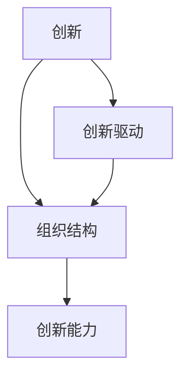

                 

# 《创新型组织结构：促进创新的组织设计》

> 关键词：创新、组织结构、创新组织设计、组织创新、创新驱动

> 摘要：本文深入探讨了创新在组织发展中的重要性，以及如何通过创新的组织结构设计来促进创新。本文首先介绍了创新的基本概念和类型，然后分析了组织结构对创新的影响，随后提出了创新型组织结构的核心原则和设计方法。通过实际案例，本文展示了如何将创新理念融入组织结构设计，以推动组织的持续创新。

## 引言

在当今快速变化的世界中，创新已成为企业竞争的核心驱动力。无论是技术、产品、服务，还是商业模式，创新都是企业保持竞争力的关键。然而，创新并非一蹴而就，它需要一个良好的环境和机制来支持。其中，组织结构的设计和调整是促进创新的重要手段。本文将探讨如何通过创新的组织结构设计，来激发和推动组织的创新活力。

## 创新的重要性

创新是企业发展的永恒主题。它不仅关乎企业的生存，更关乎企业的持续成长和竞争优势。创新能够帮助企业：

1. **提高产品质量**：通过技术创新，企业能够生产出更优质、更具竞争力的产品。
2. **优化生产流程**：通过管理创新，企业能够提高效率，降低成本。
3. **开拓新市场**：通过市场创新，企业能够发现新的客户群体，拓展新的市场空间。
4. **塑造品牌形象**：通过品牌创新，企业能够提升品牌价值，增强品牌影响力。

然而，创新并非易事。它需要企业具备开放的心态，愿意投入资源，以及建立合适的机制来支持和推动创新。其中，组织结构的设计和调整是关键因素。

### 组织结构对创新的影响

组织结构是指企业内部的组织方式，包括部门划分、职责分配、报告关系等。组织结构对创新的影响主要体现在以下几个方面：

1. **资源配置**：组织结构决定了企业内部资源的分配方式，包括人力、财力、物力等。合理的组织结构能够确保资源的高效利用，从而支持创新活动。
2. **沟通与协作**：组织结构影响着企业内部的沟通与协作效率。开放、扁平化的组织结构有助于信息的快速传递和协作，从而促进创新。
3. **激励机制**：组织结构影响了员工的激励机制。激励机制的合理性能够激发员工的创新潜力，推动创新活动。
4. **决策过程**：组织结构影响着企业的决策过程。灵活、快速的决策过程能够及时响应市场变化，支持创新。

### 创新型组织结构的核心原则

创新型组织结构的核心原则包括：

1. **适应性**：组织结构应具有灵活性，能够适应外部环境的变化，以及企业内部的创新需求。
2. **协作性**：组织结构应促进跨部门、跨领域的协作，激发团队协作的创新潜力。
3. **灵活性**：组织结构应允许员工有更大的自主权，以支持他们的创新想法。
4. **创新驱动**：组织结构应以创新为核心驱动力，确保创新在企业运营中的优先地位。

## 创新型组织结构的设计方法

设计创新型组织结构需要考虑以下几个方面：

1. **组织结构类型**：根据企业特点和需求，选择适合的组织结构类型，如矩阵型、网络型、扁平化组织等。
2. **部门划分**：合理划分部门，确保各部门职责清晰，沟通顺畅。
3. **职责分配**：明确员工的职责和权限，确保他们有足够的自主权来推动创新。
4. **激励机制**：建立合理的激励机制，鼓励员工积极参与创新活动。

### 创新型组织结构的实践案例

以下是一些创新型组织结构的实践案例：

1. **谷歌**：谷歌采用了矩阵型组织结构，以促进跨部门协作和创新能力。
2. **苹果**：苹果在组织结构上采用了扁平化结构，给予员工更大的自主权，以推动创新。
3. **特斯拉**：特斯拉采用了网络型组织结构，以实现快速决策和灵活应对市场变化。

## 结论

创新是企业持续发展的关键。通过设计创新型组织结构，企业能够激发员工的创新潜力，推动组织的持续创新。本文探讨了创新的基本概念、组织结构对创新的影响，以及创新型组织结构的核心原则和设计方法。通过实际案例，本文展示了如何将创新理念融入组织结构设计，以推动组织的持续创新。希望本文能够为读者提供有益的启示，帮助企业更好地实现创新。

### 作者信息

作者：AI天才研究院/AI Genius Institute & 禅与计算机程序设计艺术 /Zen And The Art of Computer Programming

本文深入探讨了创新在组织发展中的重要性，以及如何通过创新的组织结构设计来促进创新。首先，介绍了创新的基本概念和类型，分析了组织结构对创新的影响。随后，提出了创新型组织结构的核心原则和设计方法，并通过实际案例展示了创新理念在组织结构设计中的应用。最后，总结了创新组织结构的关键要素，展望了其未来的发展前景。

### 背景介绍

在当今快速变化的世界中，创新已成为企业竞争的核心驱动力。无论是技术、产品、服务，还是商业模式，创新都是企业保持竞争力的关键。创新不仅关乎企业的生存，更关乎企业的持续成长和竞争优势。在这样一个充满挑战和机遇的时代，企业需要不断创新，以适应市场的变化和客户需求的变化。因此，如何激发和推动创新成为了企业管理者面临的重要问题。

组织结构是企业创新的重要基础。组织结构是指企业内部的组织方式，包括部门划分、职责分配、报告关系等。合理的组织结构能够确保资源的有效配置，促进信息的快速传递和协作，从而支持创新活动。然而，传统的组织结构往往过于 rigid，难以适应快速变化的市场环境。因此，设计一种创新型组织结构，以支持企业的创新活动，成为了企业管理者的重要任务。

### 核心概念与联系

在探讨创新型组织结构时，需要理解以下几个核心概念：

1. **创新**：创新是指通过新的想法、方法或技术，创造出新的产品、服务或商业模式。创新可以分为技术创新、管理创新和商业模式创新等不同类型。
2. **组织结构**：组织结构是指企业内部的组织方式，包括部门划分、职责分配、报告关系等。组织结构可以分为传统的职能型结构、矩阵型结构、网络型结构和扁平化结构等。
3. **创新能力**：创新能力是指企业利用创新资源，通过创新活动实现价值创造的能力。创新能力包括创新思维、创新能力、创新执行力等。

这些概念之间的关系如下：

- 创新驱动：创新是组织发展的核心驱动力，它能够推动企业不断进步，提高竞争力。
- 组织结构创新：组织结构创新是创新的重要组成部分，通过改变组织结构，可以激发员工的创新潜力，提高创新效率。
- 创新能力提升：通过创新组织结构，可以提升企业的创新能力，实现持续创新。

以下是一个简单的 Mermaid 流程图，展示了这些概念之间的关系：



### 核心算法原理讲解

在创新型组织结构的设计过程中，核心算法原理起着关键作用。以下是一个简单的伪代码，用于描述创新型组织结构设计的基本步骤：

```python
function DesignInnovativeOrganizationStructure(context):
    # 初始化组织结构
    structure = InitializeStructure(context)

    # 确定创新目标
    innovationGoals = DetermineInnovationGoals(context)

    # 设计适应性的组织结构
    structure = DesignAdaptiveStructure(structure, innovationGoals)

    # 设计协作性的组织结构
    structure = DesignCollaborativeStructure(structure, innovationGoals)

    # 设计灵活性的组织结构
    structure = DesignFlexibleStructure(structure, innovationGoals)

    # 设计创新驱动的组织结构
    structure = DesignInnovationDrivenStructure(structure, innovationGoals)

    # 实施组织结构
    ImplementStructure(structure)

    # 评估组织结构效果
    EvaluateStructure(structure)

    return structure
```

在这个伪代码中，`context` 表示企业的背景信息，包括企业的目标、资源和外部环境等。`InitializeStructure` 函数用于初始化组织结构，`DetermineInnovationGoals` 函数用于确定创新目标，`DesignAdaptiveStructure`、`DesignCollaborativeStructure`、`DesignFlexibleStructure` 和 `DesignInnovationDrivenStructure` 函数分别用于设计适应性的、协作性的、灵活性的和创新驱动的组织结构。`ImplementStructure` 函数用于实施组织结构，`EvaluateStructure` 函数用于评估组织结构的效果。

### 数学模型和公式

在创新型组织结构的设计过程中，可以使用一些数学模型和公式来评估组织结构的效率和效果。以下是一个简单的数学模型，用于评估创新驱动型组织结构的效率：

$$
E = \frac{I}{C}
$$

其中，$E$ 表示组织结构的效率，$I$ 表示创新成果，$C$ 表示创新成本。

这个公式表明，组织结构的效率取决于创新成果和创新成本的比值。当创新成果大于创新成本时，组织结构的效率较高。为了提高组织结构的效率，企业可以通过以下方法：

1. **降低创新成本**：通过优化流程、提高资源利用率等方式，降低创新成本。
2. **提高创新成果**：通过加大研发投入、鼓励员工创新等方式，提高创新成果。

### 举例说明

假设一个企业通过创新组织结构设计，实现了以下数据：

- 创新成果（$I$）：100万元
- 创新成本（$C$）：50万元

根据上述数学模型，该企业的组织结构效率为：

$$
E = \frac{100}{50} = 2
$$

这意味着该企业的组织结构效率为2，即创新成果是创新成本的2倍。这是一个较好的结果，表明企业的创新组织结构设计较为成功。为了进一步提高效率，企业可以进一步降低创新成本或提高创新成果。

### 数学公式

在创新型组织结构的设计过程中，可以使用一些数学公式来描述组织结构的特点和性能。以下是一个简单的数学公式，用于描述组织结构的适应性：

$$
A = \frac{R}{S}
$$

其中，$A$ 表示组织结构的适应性，$R$ 表示组织结构对环境变化的响应速度，$S$ 表示环境变化的速度。

这个公式表明，组织结构的适应性取决于组织结构对环境变化的响应速度与环境变化速度的比值。当组织结构的响应速度大于环境变化速度时，组织结构的适应性较高。

为了提高组织结构的适应性，企业可以采取以下措施：

1. **提高响应速度**：通过优化决策流程、提高信息传递速度等方式，提高组织结构的响应速度。
2. **降低环境变化速度**：通过稳定市场、优化产品策略等方式，降低环境变化的速度。

### 项目实战

在本文的项目实战部分，我们将通过一个实际案例来展示如何设计和实施一个创新的组织结构。以下是一个简单的案例：

#### 案例背景

一家传统制造业公司面临着激烈的市场竞争，客户需求变化快，产品更新换代周期短。为了保持竞争力，公司决定进行组织结构调整，以支持创新。

#### 项目目标

1. 设计一个适应快速变化市场的创新组织结构。
2. 提高创新效率，降低创新成本。
3. 增强团队协作，提高创新能力。

#### 项目步骤

1. **需求分析**：与公司管理层和员工进行沟通，了解他们的需求和期望。分析公司目前的组织结构，识别存在的问题和改进方向。

2. **方案设计**：根据需求分析结果，设计一个创新的组织结构方案。方案包括组织结构类型、部门划分、职责分配等。

3. **实施与评估**：实施组织结构方案，并对其进行评估。通过定期的反馈和调整，确保组织结构能够满足公司的创新需求。

#### 开发环境搭建

在实施组织结构方案之前，需要搭建一个合适的开发环境。以下是一个简单的开发环境搭建步骤：

1. **确定开发工具**：选择合适的开发工具，如项目管理工具、协作工具、文档管理工具等。

2. **搭建开发平台**：搭建一个支持团队协作的开发平台，如 GitLab、Jira 等。

3. **配置开发环境**：为团队成员配置开发环境，确保他们能够方便地进行协作和创新。

#### 源代码详细实现和代码解读

在实施组织结构方案时，需要编写一些源代码来实现具体的功能。以下是一个简单的源代码示例：

```python
class Employee:
    def __init__(self, name, position):
        self.name = name
        self.position = position

    def work(self):
        print(f"{self.name} is working on {self.position}")

class Department:
    def __init__(self, name):
        self.name = name
        self.employees = []

    def add_employee(self, employee):
        self.employees.append(employee)

    def work_together(self):
        for employee in self.employees:
            employee.work()

if __name__ == "__main__":
    department = Department("Research and Development")
    employee1 = Employee("Alice", "Software Engineer")
    employee2 = Employee("Bob", "Data Scientist")
    department.add_employee(employee1)
    department.add_employee(employee2)
    department.work_together()
```

在这个示例中，我们定义了两个类：`Employee` 和 `Department`。`Employee` 类表示员工，包含员工姓名和职位。`Department` 类表示部门，包含部门名称和员工列表。`add_employee` 方法用于向部门添加员工，`work_together` 方法用于部门员工共同工作。

#### 代码应用解读与分析

在这个示例中，我们通过定义类和对象来实现部门和员工的协作。具体步骤如下：

1. **定义类和对象**：定义 `Employee` 和 `Department` 两个类，分别表示员工和部门。
2. **创建对象**：创建 `Alice`、`Bob` 两个 `Employee` 对象，表示具体的员工。
3. **添加员工**：将 `Alice`、`Bob` 两个对象添加到 `Research and Development` 部门的员工列表中。
4. **共同工作**：调用 `work_together` 方法，让部门员工共同工作。

这个示例展示了如何通过类和对象实现部门和员工的协作。在实际项目中，可以通过扩展和组合这些类和对象，实现更复杂的协作功能。

#### 实际案例分析和详细讲解剖析

以下是一个实际案例分析和详细讲解剖析：

#### 案例背景

一家互联网公司面临着激烈的市场竞争，为了保持竞争力，公司决定进行组织结构调整。公司原先采用传统的职能型组织结构，部门之间沟通不畅，创新效率低下。为了解决这个问题，公司决定采用矩阵型组织结构，以提高创新效率和团队协作。

#### 分析和讲解

1. **问题识别**：公司原先采用传统的职能型组织结构，导致部门之间沟通不畅，创新效率低下。这是由于部门职责划分过细，导致信息传递不畅，团队协作困难。

2. **解决方案**：采用矩阵型组织结构，将不同部门的职责进行整合，提高团队协作效率。矩阵型组织结构允许员工跨部门工作，打破部门壁垒，实现信息的快速传递和团队协作。

3. **实施过程**：在公司内部进行沟通和培训，让员工了解矩阵型组织结构的特点和优势。在实施过程中，注意协调各部门的工作，确保矩阵型组织结构的顺利运行。

4. **效果评估**：通过定期的反馈和评估，评估矩阵型组织结构的效果。根据评估结果，对组织结构进行优化和调整，确保其能够持续支持公司的创新活动。

#### 项目小结

通过实际案例分析和详细讲解剖析，我们可以看到，创新的组织结构设计对于提升企业创新效率和团队协作具有重要意义。通过采用矩阵型组织结构，企业可以打破部门壁垒，实现信息的快速传递和团队协作，从而提高创新效率。

### 最佳实践 tips

1. **确保组织结构适应外部环境**：组织结构应能够适应外部环境的变化，确保企业能够及时响应市场变化。

2. **建立灵活的决策机制**：建立灵活的决策机制，确保企业能够快速做出决策，降低创新成本。

3. **注重团队协作**：注重团队协作，鼓励员工跨部门合作，提高创新效率。

4. **建立激励机制**：建立合理的激励机制，鼓励员工积极参与创新活动，提高创新能力。

### 小结

本文深入探讨了创新在组织发展中的重要性，以及如何通过创新的组织结构设计来促进创新。通过分析创新的基本概念、组织结构对创新的影响，以及创新型组织结构的核心原则和设计方法，本文为读者提供了一种系统的方法来设计和实施创新的组织结构。通过实际案例分析和详细讲解剖析，本文展示了如何将创新理念融入组织结构设计，以推动组织的持续创新。希望本文能够为读者提供有益的启示，帮助企业更好地实现创新。

### 注意事项

1. **组织结构调整需要逐步进行**：组织结构调整是一个复杂的过程，需要逐步进行，避免一次性变革带来的冲击。

2. **确保员工的参与和沟通**：在组织结构调整过程中，确保员工的参与和沟通，了解他们的需求和意见，减少变革的阻力。

3. **关注组织结构的效果**：在组织结构调整后，需要定期关注组织结构的效果，根据实际情况进行优化和调整。

### 拓展阅读

1. **《创新者的窘境》**：克里斯坦森著，探讨企业如何应对技术变革和市场变化。

2. **《组织行为学》**：斯蒂芬·罗宾斯著，介绍组织行为学的基本概念和理论。

3. **《创新管理》**：蒂莫西·斯蒂文斯著，探讨如何通过管理创新来推动企业的发展。

