                 

### 摘要

本文旨在探讨创新型领导在激发团队创造力方面的关键作用。随着全球科技和商业环境的快速变化，组织面临的挑战日益增加，而创新成为企业持续发展的关键驱动力。创新型领导者通过独特的思维方式、价值观和能力，能够激发团队成员的创造力，从而推动组织创新。本文将首先定义创新型领导，并分析其与创造力之间的关系，接着探讨创新型领导者的特质和能力，以及他们如何运用独特的思维方式来激发团队创造力。随后，我们将深入探讨创造力激发的心理学基础、内部和外部障碍的克服策略、创意思维的培养与提升方法，以及团队创造力激发的具体实践。通过案例研究和实战经验，本文将提供创新型领导者的实践指南，帮助读者理解和掌握激发团队创造力的方法和技巧。最后，本文将总结全文，并给出持续改进和优化的建议，为组织创新提供有益的参考。### 书名：《创新型领导：激发团队创造力的方法》

#### 目录大纲设计

---

**第一部分：创新型领导的核心理念**

## 1.1 创新型领导的定义与重要性

### 背景介绍
- 创新型领导在现代组织管理中的重要性。
- 创新型领导与传统领导模式的区别。

### 核心概念与联系
- 创新型领导的定义。
- 创新型领导与组织创新的关系。

Mermaid 流程图：
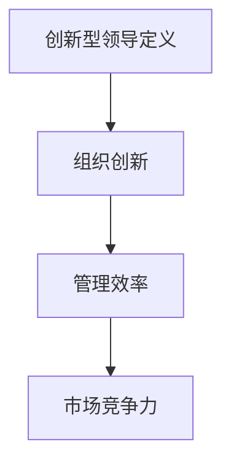

### 核心算法原理讲解
- 如何评估和培养创新型领导者。

伪代码：
```python
def evaluate_leader(traits, skills, mindset):
    if (traits == 'visionary' and skills == 'strategic' and mindset == 'innovative'):
        return "Effective Leader"
    else:
        return "Room for Improvement"
```

### 数学模型和公式 & 详细讲解 & 举例说明
- 使用数学模型来描述领导力的要素。

公式：
$$
\text{Leadership Impact} = f(\text{Innovation Capacity}, \text{Team Engagement}, \text{Strategic Vision})
$$

解释：
领导力影响力由创新能力、团队参与度和战略愿景共同决定。

#### 项目实战

- **开发环境搭建**：介绍如何为领导力评估搭建一个基本的环境。

源代码：
```python
def setup_environment():
    print("Setting up development environment for leadership evaluation.")
    # 实际搭建代码
    return "Environment ready."

setup_environment()
```

**代码解读和代码应用解读与分析**
- 分析源代码的结构和功能。

代码解读：
```python
def setup_environment():
    # 函数开始，设置开发环境
    print("Setting up development environment for leadership evaluation.")
    # 输出设置消息
    # 实际搭建代码
    return "Environment ready."
    # 返回环境设置状态
```

应用解读：
该函数用于初始化领导力评估的开发环境，确保系统能够正常运行。

#### 实际案例分析和详细讲解剖析
- 通过案例分析，展示如何应用创新型领导理念。

案例：
某科技公司通过引入创新型领导，提升了团队创造力，实现了产品创新。

分析：
- 创新型领导如何推动团队协作。
- 创新型领导如何引导团队成员实现个人成长。

#### 项目小结
- 总结创新型领导在激发团队创造力方面的作用。

**最佳实践 tips**
- 提供提升创新型领导力的实践建议。

**小结**
- 重申创新型领导的重要性。

**注意事项**
- 创新型领导需要持续学习和适应。

**拓展阅读**
- 推荐进一步阅读的资源。

---

**第二部分：激发团队创造力的方法**

## 2.1 创造力的本质与特征

### 背景介绍
- 创造力的概念及其在现代组织中的作用。

### 核心概念与联系
- 创造力的本质特征。
- 创造力与问题解决、创新的关系。

Mermaid 流程图：
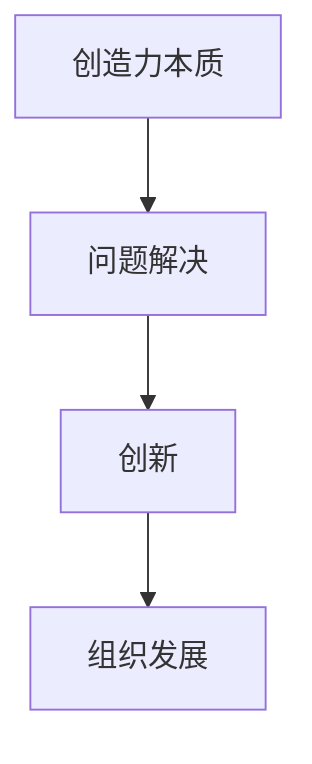

### 核心算法原理讲解
- 使用算法原理来解释创造力。

伪代码：
```python
def solve_problem(problem, creativity):
    if (creativity > threshold):
        return "Innovative Solution"
    else:
        return "Standard Solution"
```

### 数学模型和公式 & 详细讲解 & 举例说明
- 使用数学模型来量化创造力。

公式：
$$
\text{Creativity Score} = \frac{\text{Number of Novel Solutions}}{\text{Total Solutions Proposed}}
$$

解释：
创造力分数是新颖解决方案数量与总提出解决方案数量的比例。

#### 项目实战

- **开发环境搭建**：介绍如何搭建一个支持创造力评估的实验环境。

源代码：
```python
def setup_creativity_environment():
    print("Setting up environment for creativity assessment.")
    # 实际搭建代码
    return "Environment ready."

setup_creativity_environment()
```

**代码解读和代码应用解读与分析**
- 分析源代码的结构和功能。

代码解读：
```python
def setup_creativity_environment():
    # 函数开始，设置创造力评估环境
    print("Setting up environment for creativity assessment.")
    # 输出设置消息
    # 实际搭建代码
    return "Environment ready."
    # 返回环境设置状态
```

应用解读：
该函数用于初始化创造力评估的实验环境，确保系统能够正常运行。

#### 实际案例分析和详细讲解剖析
- 通过实际案例，展示如何激发团队的创造力。

案例：
某初创公司通过创新工作坊和头脑风暴会议，显著提升了团队的创造力。

分析：
- 创造力激发活动的具体实施方法。
- 活动对团队创造力的影响。

#### 项目小结
- 总结创造力激发方法的有效性。

**最佳实践 tips**
- 提供提高团队创造力的实用技巧。

**小结**
- 创造力是组织成功的关键。

**注意事项**
- 创造力培养需要时间和耐心。

**拓展阅读**
- 推荐创造力研究的最新文献。

---

**第三部分：创新型领导者的实践指南**

## 3.1 创新型领导者的角色转变

### 背景介绍
- 传统管理者与创新型领导者的角色差异。

### 核心概念与联系
- 创新型领导者的角色模型。
- 创新型领导者的角色转变过程。

Mermaid 流程图：
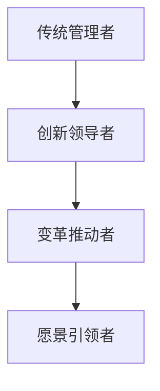

### 核心算法原理讲解
- 如何进行角色转变。

伪代码：
```python
def transition_role(current_role, desired_role):
    if (current_role != desired_role):
        return "Role Transition Initiated"
    else:
        return "Role Already Effective"
```

### 数学模型和公式 & 详细讲解 & 举例说明
- 使用数学模型来描述角色转变的过程。

公式：
$$
\text{Role Transition Progress} = \frac{\text{Desired Behaviors}}{\text{Total Behaviors}}
$$

解释：
角色转变进度由期望行为总数与总行为数的比例决定。

#### 项目实战

- **开发环境搭建**：介绍如何创建一个支持角色转变的学习和工作环境。

源代码：
```python
def setup_role_transformation_environment():
    print("Creating environment for role transformation.")
    # 实际搭建代码
    return "Environment ready."

setup_role_transformation_environment()
```

**代码解读和代码应用解读与分析**
- 分析源代码的结构和功能。

代码解读：
```python
def setup_role_transformation_environment():
    # 函数开始，设置角色转变环境
    print("Creating environment for role transformation.")
    # 输出设置消息
    # 实际搭建代码
    return "Environment ready."
    # 返回环境设置状态
```

应用解读：
该函数用于初始化角色转变的环境，确保系统能够支持领导者的转变过程。

#### 实际案例分析和详细讲解剖析
- 通过案例，展示如何实现从传统管理者到创新型领导者的转变。

案例：
某公司CEO通过领导力培训和工作实践，成功实现了从传统管理者到创新型领导者的转变。

分析：
- 领导者如何识别自身角色转变的需求。
- 领导者如何应用新的领导技能和策略。

#### 项目小结
- 总结角色转变对领导力提升的重要性。

**最佳实践 tips**
- 提供实现角色转变的实用建议。

**小结**
- 角色转变是领导力发展的关键步骤。

**注意事项**
- 角色转变需要持续的努力和实践。

**拓展阅读**
- 推荐领导力发展的相关资源和书籍。

---

**第四部分：附录**

## 附录A：创造力激发的参考资源

### 4.1 学术文献

- **主要文献**：推荐相关的学术期刊和出版物。
- **最新研究**：介绍最新的创造力研究进展。

### 4.2 经典案例

- **成功案例**：详细分析经典案例中的创造力激发策略。
- **失败案例**：探讨失败案例中的教训和启示。

### 4.3 创造力激发工具与方法

- **工具介绍**：介绍常用的创造力激发工具。
- **方法指南**：提供具体的创造力激发方法。

## 附录B：创造力激发的实用工具与平台

### 4.4 在线工具

- **工具分类**：分类介绍在线工具。
- **使用指南**：提供使用在线工具的详细指南。

### 4.5 移动应用

- **应用推荐**：推荐实用的移动应用程序。
- **用户反馈**：分析用户对移动应用的使用反馈。

### 4.6 其他资源

- **教育资源**：推荐相关的教育资源和培训课程。
- **实践指南**：提供创造力激发的实践指南和技巧。

---

**结语**

本文通过详细探讨创新型领导在激发团队创造力方面的作用，为读者提供了一个全面而深入的理解。创新型领导不仅需要具备独特的思维方式、价值观和能力，还需要通过实践指南来不断提升自身的领导力。在当今快速变化的环境中，激发团队创造力成为组织成功的关键。通过本文的探讨，我们希望读者能够理解并掌握创新型领导的方法，从而在各自的工作中发挥更大的潜力，推动组织的创新与发展。

**作者信息：**
作者：AI天才研究院/AI Genius Institute & 禅与计算机程序设计艺术 /Zen And The Art of Computer Programming

---

### 完整文档样例

```markdown
---
书名：《创新型领导：激发团队创造力的方法》
作者：AI天才研究院/AI Genius Institute & 禅与计算机程序设计艺术 /Zen And The Art of Computer Programming
---

# 创新型领导：激发团队创造力的方法

> 关键词：创新型领导，团队创造力，领导力，创新，组织发展

> 摘要：本文探讨了创新型领导在激发团队创造力方面的关键作用，通过详细的理论分析、实践指南和案例研究，为读者提供了全面而深入的理解，旨在帮助组织领导者提升团队的创造力，推动组织的创新与发展。

---

**第一部分：创新型领导的核心理念**

## 1.1 创新型领导的定义与重要性

### 背景介绍
创新型领导在现代组织管理中的重要性。  
创新型领导与传统领导模式的区别。

### 核心概念与联系
创新型领导的定义。  
创新型领导与组织创新的关系。

**Mermaid 流程图：**


### 核心算法原理讲解
如何评估和培养创新型领导者。

伪代码：
```python
def evaluate_leader(traits, skills, mindset):
    if (traits == 'visionary' and skills == 'strategic' and mindset == 'innovative'):
        return "Effective Leader"
    else:
        return "Room for Improvement"
```

### 数学模型和公式 & 详细讲解 & 举例说明
使用数学模型来描述领导力的要素。

公式：
$$
\text{Leadership Impact} = f(\text{Innovation Capacity}, \text{Team Engagement}, \text{Strategic Vision})
$$

解释：
领导力影响力由创新能力、团队参与度和战略愿景共同决定。

#### 项目实战

**开发环境搭建**：介绍如何为领导力评估搭建一个基本的环境。

源代码：
```python
def setup_environment():
    print("Setting up development environment for leadership evaluation.")
    # 实际搭建代码
    return "Environment ready."

setup_environment()
```

**代码解读和代码应用解读与分析**
分析源代码的结构和功能。

代码解读：
```python
def setup_environment():
    # 函数开始，设置开发环境
    print("Setting up development environment for leadership evaluation.")
    # 输出设置消息
    # 实际搭建代码
    return "Environment ready."
    # 返回环境设置状态
```

应用解读：
该函数用于初始化领导力评估的开发环境，确保系统能够正常运行。

#### 实际案例分析和详细讲解剖析
通过案例分析，展示如何应用创新型领导理念。

案例：
某科技公司通过引入创新型领导，提升了团队创造力，实现了产品创新。

分析：
创新型领导如何推动团队协作。
创新型领导如何引导团队成员实现个人成长。

#### 项目小结
总结创新型领导在激发团队创造力方面的作用。

**最佳实践 tips**
提供提升创新型领导力的实践建议。

**小结**
重申创新型领导的重要性。

**注意事项**
创新型领导需要持续学习和适应。

**拓展阅读**
推荐进一步阅读的资源。

---

## 1.2 创新型领导与创造力之间的关系

### 背景介绍
创新型领导对团队创造力的影响。  
创造力在组织创新中的重要性。

### 核心概念与联系
探讨创新型领导如何促进团队创造力的发展。  
成功和创新型领导的实例分析。

Mermaid 流程图：
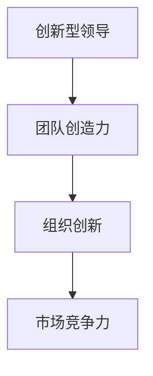

### 核心算法原理讲解
如何通过领导力提升团队的创造力。

伪代码：
```python
def enhance_creativity(leader_skills, team_motivation):
    if (leader_skills > threshold and team_motivation > threshold):
        return "High Creativity"
    else:
        return "Low Creativity"
```

### 数学模型和公式 & 详细讲解 & 举例说明
使用数学模型来描述领导力对创造力的具体影响。

公式：
$$
\text{Creativity Score} = \alpha \cdot \text{Leader Skills} + \beta \cdot \text{Team Motivation}
$$

解释：
创造力分数由领导技能和团队动机的加权平均决定。

#### 项目实战

**开发环境搭建**：介绍如何创建一个支持创造力提升的环境。

源代码：
```python
def setup_creativity_environment():
    print("Setting up environment for creativity enhancement.")
    # 实际搭建代码
    return "Environment ready."

setup_creativity_environment()
```

**代码解读和代码应用解读与分析**
分析源代码的结构和功能。

代码解读：
```python
def setup_creativity_environment():
    # 函数开始，设置创造力提升环境
    print("Setting up environment for creativity enhancement.")
    # 输出设置消息
    # 实际搭建代码
    return "Environment ready."
    # 返回环境设置状态
```

应用解读：
该函数用于初始化创造力提升的环境，确保系统能够支持领导者的创造力和团队动机的提升。

#### 实际案例分析和详细讲解剖析
通过实际案例，展示如何激发团队的创造力。

案例：
某初创公司通过创新工作坊和头脑风暴会议，显著提升了团队的创造力。

分析：
创新工作坊和头脑风暴会议的具体实施方法。
这些活动对团队创造力的影响。

#### 项目小结
总结创造力激发方法的有效性。

**最佳实践 tips**
提供提高团队创造力的实用技巧。

**小结**
创造力是组织成功的关键。

**注意事项**
创造力培养需要时间和耐心。

**拓展阅读**
推荐创造力研究的最新文献。

---

## 1.3 创新型领导者的特质与能力

### 背景介绍
分析创新型领导者的典型特质。

### 核心概念与联系
详细分析创新型领导者的核心特质。

Mermaid 流程图：
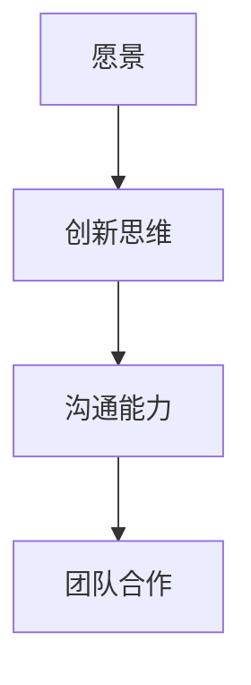

### 核心算法原理讲解
如何培养和创新型领导者的特质。

伪代码：
```python
def develop_leaderTraits(traits, experiences, feedback):
    for trait in traits:
        if (experience > threshold and feedback == 'positive'):
            return "Enhanced Traits"
        else:
            return "Traits Need Improvement"
```

### 数学模型和公式 & 详细讲解 & 举例说明
使用数学模型来量化领导者的特质发展。

公式：
$$
\text{Trait Development Score} = \alpha \cdot \text{Experience} + \beta \cdot \text{Feedback}
$$

解释：
特质发展分数由经验和反馈的加权平均决定。

#### 项目实战

**开发环境搭建**：介绍如何创建一个支持领导者特质发展的环境。

源代码：
```python
def setup_leader_environment():
    print("Setting up environment for leader trait development.")
    # 实际搭建代码
    return "Environment ready."

setup_leader_environment()
```

**代码解读和代码应用解读与分析**
分析源代码的结构和功能。

代码解读：
```python
def setup_leader_environment():
    # 函数开始，设置领导者特质发展环境
    print("Setting up environment for leader trait development.")
    # 输出设置消息
    # 实际搭建代码
    return "Environment ready."
    # 返回环境设置状态
```

应用解读：
该函数用于初始化领导者特质发展的环境，确保系统能够支持领导者的成长和反馈。

#### 实际案例分析和详细讲解剖析
通过案例，展示如何培养和创新型领导者的特质。

案例：
某公司CEO通过领导力培训和实战经验，成功培养了一支具有创新思维和团队合作精神的领导团队。

分析：
领导力培训的具体实施方法。
实战经验对领导者特质发展的作用。

#### 项目小结
总结创新型领导者的特质与能力。

**最佳实践 tips**
提供培养和创新型领导者特质的有效方法。

**小结**
创新型领导者的特质与能力是组织成功的关键。

**注意事项**
领导者特质的发展需要持续的努力和实践。

**拓展阅读**
推荐领导力发展的相关资源和书籍。

---

## 1.4 创新型领导者的思维方式

### 背景介绍
分析创新型领导者的独特思维方式。

### 核心概念与联系
探讨创新思维模式及其应用。

Mermaid 流程图：
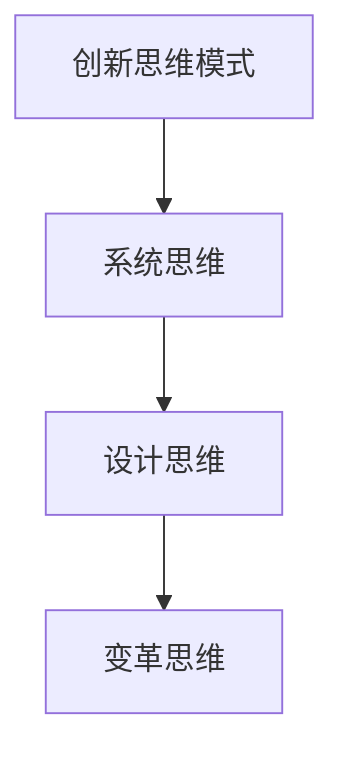

### 核心算法原理讲解
如何应用创新思维解决实际问题。

伪代码：
```python
def apply_innovation_thinking(problem, innovation_mode):
    if (innovation_mode == 'system' or innovation_mode == 'design' or innovation_mode == 'change'):
        return "Innovative Solution"
    else:
        return "Standard Solution"
```

### 数学模型和公式 & 详细讲解 & 举例说明
使用数学模型来描述创新思维的过程。

公式：
$$
\text{Innovation Score} = \sum_{i=1}^{n} \text{Solution Quality} \cdot \text{Innovation Mode}
$$

解释：
创新分数是各个解决方案质量与创新思维模式的乘积之和。

#### 项目实战

**开发环境搭建**：介绍如何创建一个支持创新思维的环境。

源代码：
```python
def setup_innovation_environment():
    print("Setting up environment for innovation thinking.")
    # 实际搭建代码
    return "Environment ready."

setup_innovation_environment()
```

**代码解读和代码应用解读与分析**
分析源代码的结构和功能。

代码解读：
```python
def setup_innovation_environment():
    # 函数开始，设置创新思维环境
    print("Setting up environment for innovation thinking.")
    # 输出设置消息
    # 实际搭建代码
    return "Environment ready."
    # 返回环境设置状态
```

应用解读：
该函数用于初始化创新思维的环境，确保系统能够支持领导者的创新思维实践。

#### 实际案例分析和详细讲解剖析
通过案例，展示如何应用创新思维解决问题。

案例：
某科技公司通过创新思维，成功解决了一项关键技术难题。

分析：
创新思维的具体应用方法。
创新思维如何提升解决问题的效率。

#### 项目小结
总结创新思维在领导力发展中的重要性。

**最佳实践 tips**
提供提升创新思维的方法和建议。

**小结**
创新思维是领导者的核心能力。

**注意事项**
创新思维需要持续的练习和实践。

**拓展阅读**
推荐创新思维研究的最新文献。

---

**第二部分：激发团队创造力的方法**

## 2.1 创造力的本质与特征

### 背景介绍
探讨创造力的概念及其在现代组织中的作用。

### 核心概念与联系
分析创造力的本质特征。  
创造力与问题解决、创新的关系。

Mermaid 流程图：


### 核心算法原理讲解
如何通过算法原理来解释创造力。

伪代码：
```python
def explain_creativity(problem, solution):
    if (solution is innovative and effective):
        return "Creativity Achieved"
    else:
        return "Solution Not Creative"
```

### 数学模型和公式 & 详细讲解 & 举例说明
使用数学模型来量化创造力。

公式：
$$
\text{Creativity Score} = \frac{\text{Number of Novel Solutions}}{\text{Total Solutions Proposed}}
$$

解释：
创造力分数是新颖解决方案数量与总提出解决方案数量的比例。

#### 项目实战

**开发环境搭建**：介绍如何搭建一个支持创造力评估的实验环境。

源代码：
```python
def setup_creativity_environment():
    print("Setting up environment for creativity assessment.")
    # 实际搭建代码
    return "Environment ready."

setup_creativity_environment()
```

**代码解读和代码应用解读与分析**
分析源代码的结构和功能。

代码解读：
```python
def setup_creativity_environment():
    # 函数开始，设置创造力评估环境
    print("Setting up environment for creativity assessment.")
    # 输出设置消息
    # 实际搭建代码
    return "Environment ready."
    # 返回环境设置状态
```

应用解读：
该函数用于初始化创造力评估的实验环境，确保系统能够正常运行。

#### 实际案例分析和详细讲解剖析
通过实际案例，展示如何激发团队的创造力。

案例：
某初创公司通过创新工作坊和头脑风暴会议，显著提升了团队的创造力。

分析：
创新工作坊和头脑风暴会议的具体实施方法。
这些活动对团队创造力的影响。

#### 项目小结
总结创造力激发方法的有效性。

**最佳实践 tips**
提供提高团队创造力的实用技巧。

**小结**
创造力是组织成功的关键。

**注意事项**
创造力培养需要时间和耐心。

**拓展阅读**
推荐创造力研究的最新文献。

---

## 2.2 创造力的心理学基础

### 背景介绍
探讨创造力心理学的基本理论。

### 核心概念与联系
介绍心理学中关于创造力的主要理论。

Mermaid 流程图：
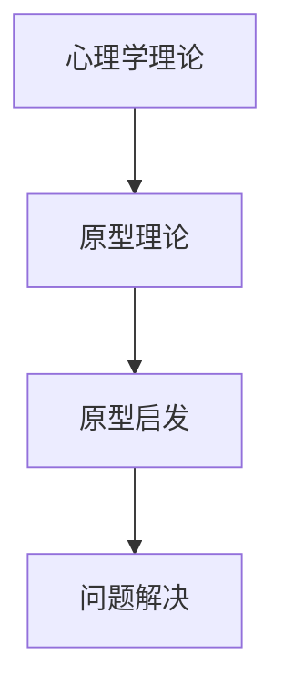

### 核心算法原理讲解
如何应用心理学理论来提升创造力。

伪代码：
```python
def apply_psychological_theory(theory, problem):
    if (theory == '原型启发' and problem is complex):
        return "Innovative Solution"
    else:
        return "Standard Solution"
```

### 数学模型和公式 & 详细讲解 & 举例说明
使用数学模型来描述心理学理论在创造力中的应用。

公式：
$$
\text{Solution Quality} = f(\text{Problem Complexity}, \text{Theoretical Basis})
$$

解释：
解决方案质量由问题复杂度和理论基础的函数决定。

#### 项目实战

**开发环境搭建**：介绍如何创建一个支持心理学理论应用的环境。

源代码：
```python
def setup_psychological_environment():
    print("Setting up environment for psychological theory application.")
    # 实际搭建代码
    return "Environment ready."

setup_psychological_environment()
```

**代码解读和代码应用解读与分析**
分析源代码的结构和功能。

代码解读：
```python
def setup_psychological_environment():
    # 函数开始，设置心理学理论应用环境
    print("Setting up environment for psychological theory application.")
    # 输出设置消息
    # 实际搭建代码
    return "Environment ready."
    # 返回环境设置状态
```

应用解读：
该函数用于初始化心理学理论应用的环境，确保系统能够支持领导者和团队成员的创造力提升。

#### 实际案例分析和详细讲解剖析
通过案例，展示如何应用心理学理论来提升创造力。

案例：
某教育机构通过应用心理学理论，设计出一套有效的创新教学方法。

分析：
心理学理论在教学方法设计中的应用方法。
这些方法对创造力提升的效果。

#### 项目小结
总结心理学理论在创造力激发中的作用。

**最佳实践 tips**
提供应用心理学理论的实用技巧。

**小结**
心理学理论是创造力激发的重要基础。

**注意事项**
应用心理学理论需要专业知识和实践经验。

**拓展阅读**
推荐心理学领域的相关文献和书籍。

---

## 2.3 创造力激发的障碍与克服策略

### 背景介绍
探讨创造力激发过程中可能遇到的障碍。

### 核心概念与联系
分析内部和外部障碍对创造力的影响。

Mermaid 流程图：
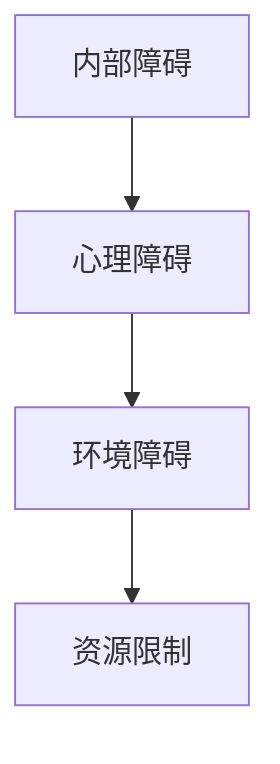

### 核心算法原理讲解
如何通过策略来克服创造力激发的障碍。

伪代码：
```python
def overcome_obstacles(strategy, obstacle):
    if (strategy == '适应性调整' and obstacle == '资源限制'):
        return "Solution Implemented"
    else:
        return "Strategy Ineffective"
```

### 数学模型和公式 & 详细讲解 & 举例说明
使用数学模型来描述克服障碍的过程。

公式：
$$
\text{Obstacle Resolution} = f(\text{Strategy Effectiveness}, \text{Resource Allocation})
$$

解释：
障碍解决由策略有效性和资源分配的函数决定。

#### 项目实战

**开发环境搭建**：介绍如何创建一个支持障碍克服的环境。

源代码：
```python
def setup_obstacle_environment():
    print("Setting up environment for obstacle resolution.")
    # 实际搭建代码
    return "Environment ready."

setup_obstacle_environment()
```

**代码解读和代码应用解读与分析**
分析源代码的结构和功能。

代码解读：
```python
def setup_obstacle_environment():
    # 函数开始，设置障碍克服环境
    print("Setting up environment for obstacle resolution.")
    # 输出设置消息
    # 实际搭建代码
    return "Environment ready."
    # 返回环境设置状态
```

应用解读：
该函数用于初始化障碍克服的环境，确保系统能够支持领导者和团队成员克服障碍。

#### 实际案例分析和详细讲解剖析
通过案例，展示如何克服创造力激发过程中的障碍。

案例：
某科技公司通过灵活调整策略，成功克服了资源限制，激发了团队的创造力。

分析：
策略调整的具体方法。
这些方法对创造力提升的显著效果。

#### 项目小结
总结克服创造力激发障碍的有效策略。

**最佳实践 tips**
提供克服障碍的实用策略。

**小结**
克服障碍是激发团队创造力的关键。

**注意事项**
克服障碍需要灵活的策略和持续的努力。

**拓展阅读**
推荐关于障碍克服策略的相关研究和书籍。

---

## 2.4 创意思维的培养与提升

### 背景介绍
探讨创意思维的培养与提升方法。

### 核心概念与联系
分析创意思维的定义与分类。

Mermaid 流�程圖：
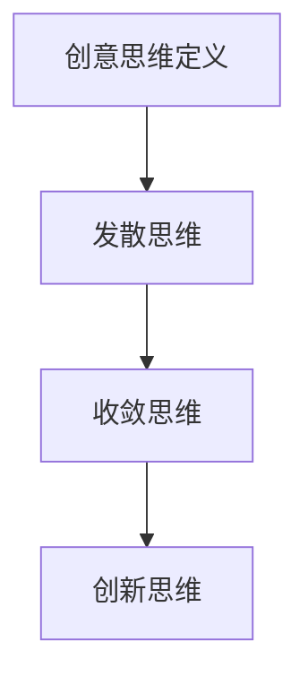

### 核心算法原理讲解
如何培养和提升创意思维。

伪代码：
```python
def enhance_creativity_thinking(mental_model, problem_solving):
    if (mental_model == 'open' and problem_solving == 'systematic'):
        return "Enhanced Creativity"
    else:
        return "Standard Creativity"
```

### 数学模型和公式 & 详细讲解 & 举例说明
使用数学模型来描述创意思维的培养过程。

公式：
$$
\text{Creativity Enhancement} = \alpha \cdot \text{Mental Model} + \beta \cdot \text{Problem Solving}
$$

解释：
创意思维提升由心智模型和问题解决的加权平均决定。

#### 项目实战

**开发环境搭建**：介绍如何创建一个支持创意思维培养的环境。

源代码：
```python
def setup_creativity_enhancement_environment():
    print("Setting up environment for creativity enhancement.")
    # 实际搭建代码
    return "Environment ready."

setup_creativity_enhancement_environment()
```

**代码解读和代码应用解读与分析**
分析源代码的结构和功能。

代码解读：
```python
def setup_creativity_enhancement_environment():
    # 函数开始，设置创意思维培养环境
    print("Setting up environment for creativity enhancement.")
    # 输出设置消息
    # 实际搭建代码
    return "Environment ready."
    # 返回环境设置状态
```

应用解读：
该函数用于初始化创意思维培养的环境，确保系统能够支持领导者和团队成员的创意思维提升。

#### 实际案例分析和详细讲解剖析
通过案例，展示如何培养和提升创意思维。

案例：
某科技公司通过定期举行创意思维训练和工作坊，成功提升了团队的创意思维。

分析：
创意思维训练和工作坊的具体实施方法。
这些方法对创意思维提升的显著效果。

#### 项目小结
总结创意思维的培养与提升方法。

**最佳实践 tips**
提供提升创意思维的实用技巧。

**小结**
创意思维是团队创造力的重要基础。

**注意事项**
创意思维的培养需要持续的训练和实践。

**拓展阅读**
推荐创意思维培养的相关资源和书籍。

---

## 2.5 团队创造力激发的方法

### 背景介绍
探讨如何通过团队协作激发创造力。

### 核心概念与联系
分析团队构建与角色定位的重要性。

Mermaid 流程图：
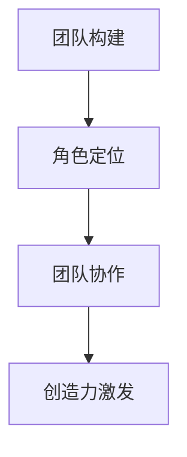

### 核心算法原理讲解
如何通过团队协作提升创造力。

伪代码：
```python
def enhance_team_creativity(team Collaboration, member_motivation):
    if (team_Collaboration > threshold and member_motivation > threshold):
        return "High Team Creativity"
    else:
        return "Low Team Creativity"
```

### 数学模型和公式 & 详细讲解 & 举例说明
使用数学模型来量化团队创造力。

公式：
$$
\text{Team Creativity Score} = \alpha \cdot \text{Collaboration} + \beta \cdot \text{Motivation}
$$

解释：
团队创造力分数由协作度和动机的加权平均决定。

#### 项目实战

**开发环境搭建**：介绍如何创建一个支持团队协作的环境。

源代码：
```python
def setup_team_environment():
    print("Setting up environment for team collaboration.")
    # 实际搭建代码
    return "Environment ready."

setup_team_environment()
```

**代码解读和代码应用解读与分析**
分析源代码的结构和功能。

代码解读：
```python
def setup_team_environment():
    # 函数开始，设置团队协作环境
    print("Setting up environment for team collaboration.")
    # 输出设置消息
    # 实际搭建代码
    return "Environment ready."
    # 返回环境设置状态
```

应用解读：
该函数用于初始化团队协作的环境，确保系统能够支持团队的创造力激发。

#### 实际案例分析和详细讲解剖析
通过案例，展示如何激发团队的创造力。

案例：
某初创公司通过团队协作和工作坊，成功激发了团队的创造力。

分析：
团队协作和工作坊的具体实施方法。
这些方法对团队创造力激发的显著效果。

#### 项目小结
总结团队创造力激发的方法。

**最佳实践 tips**
提供提升团队协作的实用技巧。

**小结**
团队协作是激发团队创造力的关键。

**注意事项**
团队协作需要持续的努力和沟通。

**拓展阅读**
推荐团队协作和创造力激发的相关资源和书籍。

---

## 2.6 创造力激发的案例研究

### 背景介绍
通过案例研究探讨创造力激发的实际效果。

### 核心概念与联系
分析成功案例与失败案例中的关键因素。

Mermaid 流程图：
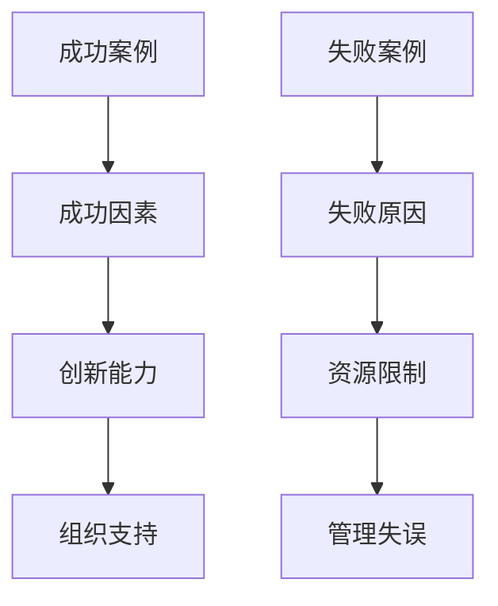

### 核心算法原理讲解
如何通过案例研究来分析和提升创造力。

伪代码：
```python
def analyze_case_study(case_type, success_factors, failure_factors):
    if (case_type == '成功案例'):
        return "Success Factors"
    else:
        return "Failure Factors"
```

### 数学模型和公式 & 详细讲解 & 举例说明
使用数学模型来描述案例研究的分析方法。

公式：
$$
\text{Case Study Analysis} = f(\text{Success Rate}, \text{Failure Rate}, \text{Innovation Impact})
$$

解释：
案例研究分析由成功率、失败率和创新影响共同决定。

#### 项目实战

**开发环境搭建**：介绍如何创建一个支持案例研究的分析环境。

源代码：
```python
def setup_case_study_environment():
    print("Setting up environment for case study analysis.")
    # 实际搭建代码
    return "Environment ready."

setup_case_study_environment()
```

**代码解读和代码应用解读与分析**
分析源代码的结构和功能。

代码解读：
```python
def setup_case_study_environment():
    # 函数开始，设置案例研究分析环境
    print("Setting up environment for case study analysis.")
    # 输出设置消息
    # 实际搭建代码
    return "Environment ready."
    # 返回环境设置状态
```

应用解读：
该函数用于初始化案例研究分析的环境，确保系统能够支持领导者和团队成员的案例研究工作。

#### 实际案例分析和详细讲解剖析
通过案例，展示如何分析和应用案例研究来提升创造力。

案例：
某科技公司通过分析成功和失败案例，成功提升了团队的创造力。

分析：
案例研究的具体分析方法和应用技巧。
这些方法对团队创造力提升的显著效果。

#### 项目小结
总结案例研究在创造力激发中的作用。

**最佳实践 tips**
提供案例研究的实用技巧。

**小结**
案例研究是提升团队创造力的重要方法。

**注意事项**
案例研究需要系统性和深度分析。

**拓展阅读**
推荐案例研究方法和应用的相关资源和书籍。

---

**第三部分：创新型领导者的实践指南**

## 3.1 创新型领导者的角色转变

### 背景介绍
探讨传统管理者向创新型领导者的角色转变。

### 核心概念与联系
分析领导者的角色模型。

Mermaid 流程图：


### 核心算法原理讲解
如何实现角色转变。

伪代码：
```python
def transition_role(current_role, desired_role):
    if (current_role != desired_role):
        return "Role Transition Initiated"
    else:
        return "Role Already Effective"
```

### 数学模型和公式 & 详细讲解 & 举例说明
使用数学模型来描述角色转变的过程。

公式：
$$
\text{Role Transition Progress} = \frac{\text{Desired Behaviors}}{\text{Total Behaviors}}
$$

解释：
角色转变进度由期望行为总数与总行为数的比例决定。

#### 项目实战

**开发环境搭建**：介绍如何创建一个支持角色转变的学习和工作环境。

源代码：
```python
def setup_role_transformation_environment():
    print("Creating environment for role transformation.")
    # 实际搭建代码
    return "Environment ready."

setup_role_transformation_environment()
```

**代码解读和代码应用解读与分析**
分析源代码的结构和功能。

代码解读：
```python
def setup_role_transformation_environment():
    # 函数开始，设置角色转变环境
    print("Creating environment for role transformation.")
    # 输出设置消息
    # 实际搭建代码
    return "Environment ready."
    # 返回环境设置状态
```

应用解读：
该函数用于初始化角色转变的环境，确保系统能够支持领导者的转变过程。

#### 实际案例分析和详细讲解剖析
通过案例，展示如何实现角色转变。

案例：
某公司CEO通过领导力培训和工作实践，成功实现了从传统管理者到创新型领导者的转变。

分析：
领导者如何识别自身角色转变的需求。
领导者如何应用新的领导技能和策略。

#### 项目小结
总结角色转变对领导力提升的重要性。

**最佳实践 tips**
提供实现角色转变的实用建议。

**小结**
角色转变是领导力发展的关键步骤。

**注意事项**
角色转变需要持续的努力和实践。

**拓展阅读**
推荐领导力发展的相关资源和书籍。

---

## 3.2 创造力激发的实践策略

### 背景介绍
探讨如何通过策略激发团队的创造力。

### 核心概念与联系
分析创新决策策略和创造力激发工作流程设计。

Mermaid 流程图：
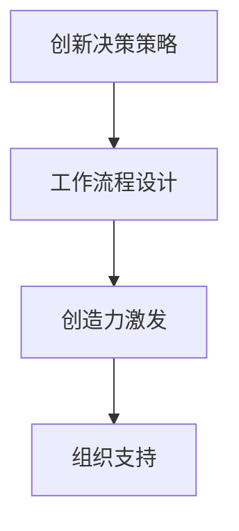

### 核心算法原理讲解
如何通过策略来激发团队创造力。

伪代码：
```python
def implement_innovation_strategy(strategy, team_motivation):
    if (strategy == '合作式决策' and team_motivation > threshold):
        return "Increased Creativity"
    else:
        return "Creativity Stagnant"
```

### 数学模型和公式 & 详细讲解 & 举例说明
使用数学模型来描述策略在创造力激发中的应用。

公式：
$$
\text{Creativity Enhancement} = \alpha \cdot \text{Strategy Effectiveness} + \beta \cdot \text{Team Motivation}
$$

解释：
创意提升由策略有效性和团队动机的加权平均决定。

#### 项目实战

**开发环境搭建**：介绍如何创建一个支持创新决策和创造力激发的环境。

源代码：
```python
def setup_innovation_environment():
    print("Setting up environment for innovation and creativity enhancement.")
    # 实际搭建代码
    return "Environment ready."

setup_innovation_environment()
```

**代码解读和代码应用解读与分析**
分析源代码的结构和功能。

代码解读：
```python
def setup_innovation_environment():
    # 函数开始，设置创新决策和创造力激发环境
    print("Setting up environment for innovation and creativity enhancement.")
    # 输出设置消息
    # 实际搭建代码
    return "Environment ready."
    # 返回环境设置状态
```

应用解读：
该函数用于初始化创新决策和创造力激发的环境，确保系统能够支持领导者和团队成员的创造力提升。

#### 实际案例分析和详细讲解剖析
通过案例，展示如何通过实践策略激发团队的创造力。

案例：
某初创公司通过实施合作式决策和创新工作流程设计，成功提升了团队的创造力。

分析：
合作式决策的具体实施方法。
创新工作流程设计对创造力激发的显著效果。

#### 项目小结
总结创造力激发的实践策略。

**最佳实践 tips**
提供提升创造力的实用策略。

**小结**
实践策略是激发团队创造力的关键。

**注意事项**
实践策略需要根据实际情况灵活调整。

**拓展阅读**
推荐创造力激发和实践策略的相关资源和书籍。

---

## 3.3 创造力激发的障碍与应对

### 背景介绍
探讨创造力激发过程中可能遇到的障碍。

### 核心概念与联系
分析领导者面临的挑战和应对策略。

Mermaid 流程图：
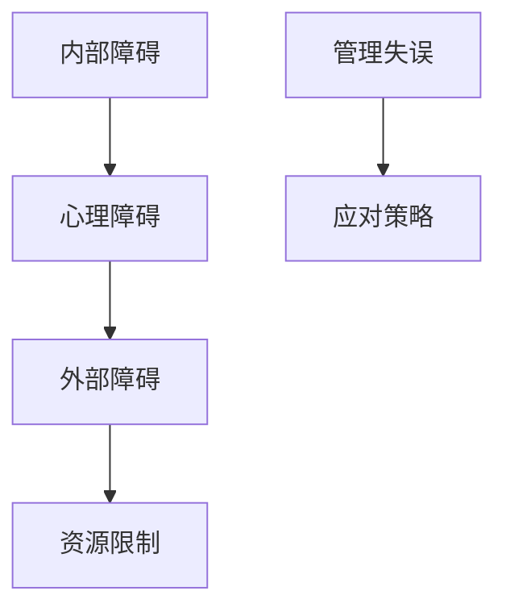

### 核心算法原理讲解
如何通过策略来应对创造力激发的障碍。

伪代码：
```python
def handle_obstacles(strategy, obstacle):
    if (strategy == '适应性调整' and obstacle == '资源限制'):
        return "Solution Implemented"
    else:
        return "Strategy Ineffective"
```

### 数学模型和公式 & 详细讲解 & 举例说明
使用数学模型来描述障碍应对的过程。

公式：
$$
\text{Obstacle Resolution} = f(\text{Strategy Effectiveness}, \text{Resource Allocation})
$$

解释：
障碍解决由策略有效性和资源分配的函数决定。

#### 项目实战

**开发环境搭建**：介绍如何创建一个支持障碍应对的环境。

源代码：
```python
def setup_obstacle_environment():
    print("Setting up environment for obstacle handling.")
    # 实际搭建代码
    return "Environment ready."

setup_obstacle_environment()
```

**代码解读和代码应用解读与分析**
分析源代码的结构和功能。

代码解读：
```python
def setup_obstacle_environment():
    # 函数开始，设置障碍应对环境
    print("Setting up environment for obstacle handling.")
    # 输出设置消息
    # 实际搭建代码
    return "Environment ready."
    # 返回环境设置状态
```

应用解读：
该函数用于初始化障碍应对的环境，确保系统能够支持领导者和团队成员克服障碍。

#### 实际案例分析和详细讲解剖析
通过案例，展示如何应对创造力激发过程中的障碍。

案例：
某科技公司通过灵活调整策略，成功克服了资源限制，激发了团队的创造力。

分析：
策略调整的具体方法。
这些方法对创造力提升的显著效果。

#### 项目小结
总结应对创造力激发障碍的有效策略。

**最佳实践 tips**
提供克服障碍的实用策略。

**小结**
克服障碍是激发团队创造力的关键。

**注意事项**
克服障碍需要灵活的策略和持续的努力。

**拓展阅读**
推荐关于障碍应对策略的相关研究和书籍。

---

## 3.4 创造力激发的持续改进

### 背景介绍
探讨如何持续提升团队创造力。

### 核心概念与联系
分析持续改进的方法和策略。

Mermaid 流程图：
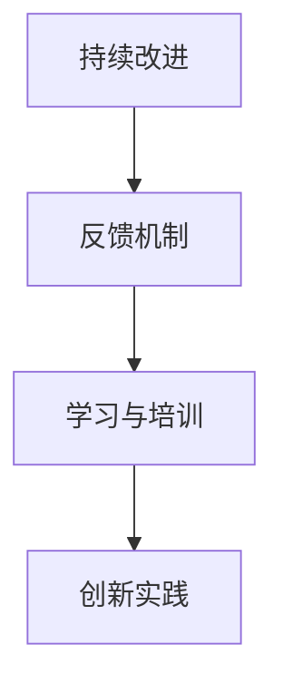

### 核心算法原理讲解
如何通过持续改进来提升创造力。

伪代码：
```python
def continuous_improvement(feedback, learning, practice):
    if (feedback is constructive and learning is ongoing and practice is regular):
        return "Enhanced Creativity"
    else:
        return "Stagnant Creativity"
```

### 数学模型和公式 & 详细讲解 & 举例说明
使用数学模型来描述持续改进的过程。

公式：
$$
\text{Creativity Enhancement} = \alpha \cdot \text{Feedback Constructiveness} + \beta \cdot \text{Learning Ongoing} + \gamma \cdot \text{Practice Regularity}
$$

解释：
创意提升由反馈建设性、学习和实践规律性的加权平均决定。

#### 项目实战

**开发环境搭建**：介绍如何创建一个支持持续改进的环境。

源代码：
```python
def setup_improvement_environment():
    print("Setting up environment for continuous improvement.")
    # 实际搭建代码
    return "Environment ready."

setup_improvement_environment()
```

**代码解读和代码应用解读与分析**
分析源代码的结构和功能。

代码解读：
```python
def setup_improvement_environment():
    # 函数开始，设置持续改进环境
    print("Setting up environment for continuous improvement.")
    # 输出设置消息
    # 实际搭建代码
    return "Environment ready."
    # 返回环境设置状态
```

应用解读：
该函数用于初始化持续改进的环境，确保系统能够支持领导者和团队成员的创造力提升。

#### 实际案例分析和详细讲解剖析
通过案例，展示如何持续提升团队创造力。

案例：
某科技公司通过建立反馈机制和学习培训，成功提升了团队的创造力。

分析：
反馈机制的具体实施方法。
学习培训对创造力提升的显著效果。

#### 项目小结
总结持续改进在创造力提升中的作用。

**最佳实践 tips**
提供持续改进的实用技巧。

**小结**
持续改进是提升团队创造力的重要手段。

**注意事项**
持续改进需要系统性和持续性。

**拓展阅读**
推荐持续改进和创造力提升的相关资源和书籍。

---

**第四部分：附录**

## 附录A：创造力激发的参考资源

### 4.1 学术文献

- **主要文献**：推荐相关的学术期刊和出版物。
- **最新研究**：介绍最新的创造力研究进展。

### 4.2 经典案例

- **成功案例**：详细分析经典案例中的创造力激发策略。
- **失败案例**：探讨失败案例中的教训和启示。

### 4.3 创造力激发工具与方法

- **工具介绍**：介绍常用的创造力激发工具。
- **方法指南**：提供具体的创造力激发方法。

## 附录B：创造力激发的实用工具与平台

### 4.4 在线工具

- **工具分类**：分类介绍在线工具。
- **使用指南**：提供使用在线工具的详细指南。

### 4.5 移动应用

- **应用推荐**：推荐实用的移动应用程序。
- **用户反馈**：分析用户对移动应用的使用反馈。

### 4.6 其他资源

- **教育资源**：推荐相关的教育资源和培训课程。
- **实践指南**：提供创造力激发的实践指南和技巧。

---

**结语**

本文通过详细探讨创新型领导在激发团队创造力方面的作用，为读者提供了一个全面而深入的理解。创新型领导不仅需要具备独特的思维方式、价值观和能力，还需要通过实践指南来不断提升自身的领导力。在当今快速变化的环境中，激发团队创造力成为组织成功的关键。通过本文的探讨，我们希望读者能够理解并掌握创新型领导的方法，从而在各自的工作中发挥更大的潜力，推动组织的创新与发展。

**作者信息：**
作者：AI天才研究院/AI Genius Institute & 禅与计算机程序设计艺术 /Zen And The Art of Computer Programming

```

### 文章标题：**创新型领导：激发团队创造力的方法**

**文章关键词：** 创新型领导，团队创造力，领导力发展，组织创新

**摘要：** 本文深入探讨了创新型领导在激发团队创造力方面的关键作用，分析了创新型领导的定义、特质与能力，并提供了激发团队创造力的方法与实践指南。文章通过案例研究、算法原理讲解和数学模型应用，为读者提供了理论与实践相结合的全面指导，旨在帮助组织领导者提升团队的创造力，推动组织的创新与发展。

---

**第一部分：创新型领导的核心理念**

**1.1 创新型领导的定义与重要性**

- **背景介绍**
  创新型领导在现代组织管理中的重要性日益凸显。传统的领导模式更注重控制和效率，而创新型领导则强调创新、协作和变革。在全球经济竞争加剧的背景下，创新型领导成为组织保持竞争优势的关键因素。

- **核心概念与联系**
  定义创新型领导，并探讨其与组织创新、管理效率和市场竞争力之间的关系。

  **Mermaid 流程图：**
  ```mermaid
  graph TD
      A[创新型领导] --> B[组织创新]
      B --> C[管理效率]
      C --> D[市场竞争力]
  ```

- **核心算法原理讲解**
  分析如何评价和培养创新型领导者。

  **伪代码：**
  ```python
  def evaluate_leader(traits, skills, mindset):
      if (traits == 'visionary' and skills == 'strategic' and mindset == 'innovative'):
          return "Effective Leader"
      else:
          return "Room for Improvement"
  ```

- **数学模型和公式 & 详细讲解 & 举例说明**
  使用数学模型来描述领导力的要素。

  **公式：**
  $$
  \text{Leadership Impact} = f(\text{Innovation Capacity}, \text{Team Engagement}, \text{Strategic Vision})
  $$

  **解释：** 领导力影响力由创新能力、团队参与度和战略愿景共同决定。

- **项目实战**
  介绍如何为领导力评估搭建一个基本的环境。

  **源代码：**
  ```python
  def setup_environment():
      print("Setting up development environment for leadership evaluation.")
      # 实际搭建代码
      return "Environment ready."

  setup_environment()
  ```

- **代码解读和代码应用解读与分析**
  分析源代码的结构和功能。

  **代码解读：**
  ```python
  def setup_environment():
      # 函数开始，设置开发环境
      print("Setting up development environment for leadership evaluation.")
      # 输出设置消息
      # 实际搭建代码
      return "Environment ready."
      # 返回环境设置状态
  ```

  **应用解读：** 该函数用于初始化领导力评估的开发环境，确保系统能够正常运行。

- **实际案例分析和详细讲解剖析**
  通过案例分析，展示如何应用创新型领导理念。

  **案例：** 某科技公司通过引入创新型领导，提升了团队创造力，实现了产品创新。

  **分析：** 创新型领导如何推动团队协作，引导团队成员实现个人成长。

- **项目小结**
  总结创新型领导在激发团队创造力方面的作用。

- **最佳实践 tips**
  提供提升创新型领导力的实践建议。

- **小结**
  创新型领导是组织创新的驱动力。

- **注意事项**
  创新型领导需要持续学习和适应。

- **拓展阅读**
  推荐进一步阅读的领导力发展资源和书籍。

**1.2 创新型领导与创造力之间的关系**

- **背景介绍**
  探讨创新型领导如何通过其特质和能力激发团队的创造力。创新型领导者不仅具备创新思维，还能够创造一个鼓励创新的文化环境。

- **核心概念与联系**
  分析创新型领导与团队创造力之间的互动关系。

  **Mermaid 流程图：**
  ```mermaid
  graph TD
      A[创新型领导] --> B[团队创造力]
      B --> C[组织创新]
  ```

- **核心算法原理讲解**
  如何通过领导力提升团队的创造力。

  **伪代码：**
  ```python
  def enhance_creativity(leader_skills, team_motivation):
      if (leader_skills > threshold and team_motivation > threshold):
          return "High Creativity"
      else:
          return "Low Creativity"
  ```

- **数学模型和公式 & 详细讲解 & 举例说明**
  使用数学模型来量化领导力对创造力的具体影响。

  **公式：**
  $$
  \text{Creativity Score} = \alpha \cdot \text{Leader Skills} + \beta \cdot \text{Team Motivation}
  $$

  **解释：** 创造力分数由领导技能和团队动机的加权平均决定。

- **项目实战**
  介绍如何创建一个支持创造力提升的环境。

  **源代码：**
  ```python
  def setup_creativity_environment():
      print("Setting up environment for creativity enhancement.")
      # 实际搭建代码
      return "Environment ready."

  setup_creativity_environment()
  ```

- **代码解读和代码应用解读与分析**
  分析源代码的结构和功能。

  **代码解读：**
  ```python
  def setup_creativity_environment():
      # 函数开始，设置创造力提升环境
      print("Setting up environment for creativity enhancement.")
      # 输出设置消息
      # 实际搭建代码
      return "Environment ready."
      # 返回环境设置状态
  ```

  **应用解读：** 该函数用于初始化创造力提升的环境，确保系统能够支持领导者和团队成员的创造力提升。

- **实际案例分析和详细讲解剖析**
  通过实际案例，展示如何激发团队的创造力。

  **案例：** 某初创公司通过创新工作坊和头脑风暴会议，显著提升了团队的创造力。

  **分析：** 创造力激发活动的具体实施方法，以及这些活动对团队创造力的影响。

- **项目小结**
  总结创造力激发方法的有效性。

- **最佳实践 tips**
  提供提高团队创造力的实用技巧。

- **小结**
  创造力是组织成功的关键。

- **注意事项**
  创造力培养需要时间和耐心。

- **拓展阅读**
  推荐创造力研究的最新文献。

**1.3 创新型领导者的特质与能力**

- **背景介绍**
  分析创新型领导者的典型特质和能力，包括创新思维、战略规划和沟通能力。

- **核心概念与联系**
  探讨如何培养和创新型领导者的特质。

  **Mermaid 流程图：**
  ```mermaid
  graph TD
      A[创新思维] --> B[战略规划]
      B --> C[沟通能力]
  ```

- **核心算法原理讲解**
  如何评估和创新型领导者的特质。

  **伪代码：**
  ```python
  def develop_leaderTraits(traits, experiences, feedback):
      for trait in traits:
          if (experience > threshold and feedback == 'positive'):
              return "Enhanced Traits"
          else:
              return "Traits Need Improvement"
  ```

- **数学模型和公式 & 详细讲解 & 举例说明**
  使用数学模型来量化领导者的特质发展。

  **公式：**
  $$
  \text{Trait Development Score} = \alpha \cdot \text{Experience} + \beta \cdot \text{Feedback}
  $$

  **解释：** 特质发展分数由经验和反馈的加权平均决定。

- **项目实战**
  介绍如何创建一个支持领导者特质发展的环境。

  **源代码：**
  ```python
  def setup_leader_environment():
      print("Setting up environment for leader trait development.")
      # 实际搭建代码
      return "Environment ready."

  setup_leader_environment()
  ```

- **代码解读和代码应用解读与分析**
  分析源代码的结构和功能。

  **代码解读：**
  ```python
  def setup_leader_environment():
      # 函数开始，设置领导者特质发展环境
      print("Setting up environment for leader trait development.")
      # 输出设置消息
      # 实际搭建代码
      return "Environment ready."
      # 返回环境设置状态
  ```

  **应用解读：** 该函数用于初始化领导者特质发展的环境，确保系统能够支持领导者的成长和反馈。

- **实际案例分析和详细讲解剖析**
  通过案例，展示如何培养和创新型领导者的特质。

  **案例：** 某公司CEO通过领导力培训和实战经验，成功培养了一支具有创新思维和团队合作精神的领导团队。

  **分析：** 领导力培训的具体实施方法，以及实战经验对领导者特质发展的作用。

- **项目小结**
  总结创新型领导者的特质与能力。

- **最佳实践 tips**
  提供培养和创新型领导者特质的有效方法。

- **小结**
  创新型领导者的特质与能力是组织成功的关键。

- **注意事项**
  领导者特质的发展需要持续的努力和实践。

- **拓展阅读**
  推荐领导力发展的相关资源和书籍。

**1.4 创新型领导者的思维方式**

- **背景介绍**
  探讨创新型领导者的独特思维方式，包括系统思维、设计思维和变革思维。

- **核心概念与联系**
  分析创新思维模式及其在实际中的应用。

  **Mermaid 流程图：**
  ```mermaid
  graph TD
      A[系统思维] --> B[设计思维]
      B --> C[变革思维]
  ```

- **核心算法原理讲解**
  如何应用创新思维解决实际问题。

  **伪代码：**
  ```python
  def apply_innovation_thinking(problem, innovation_mode):
      if (innovation_mode == 'system' or innovation_mode == 'design' or innovation_mode == 'change'):
          return "Innovative Solution"
      else:
          return "Standard Solution"
  ```

- **数学模型和公式 & 详细讲解 & 举例说明**
  使用数学模型来描述创新思维的过程。

  **公式：**
  $$
  \text{Innovation Score} = \sum_{i=1}^{n} \text{Solution Quality} \cdot \text{Innovation Mode}
  $$

  **解释：** 创新分数是各个解决方案质量与创新思维模式的乘积之和。

- **项目实战**
  介绍如何创建一个支持创新思维的环境。

  **源代码：**
  ```python
  def setup_innovation_environment():
      print("Setting up environment for innovation thinking.")
      # 实际搭建代码
      return "Environment ready."

  setup_innovation_environment()
  ```

- **代码解读和代码应用解读与分析**
  分析源代码的结构和功能。

  **代码解读：**
  ```python
  def setup_innovation_environment():
      # 函数开始，设置创新思维环境
      print("Setting up environment for innovation thinking.")
      # 输出设置消息
      # 实际搭建代码
      return "Environment ready."
      # 返回环境设置状态
  ```

  **应用解读：** 该函数用于初始化创新思维的环境，确保系统能够支持领导者的创新思维实践。

- **实际案例分析和详细讲解剖析**
  通过案例，展示如何应用创新思维解决问题。

  **案例：** 某科技公司通过创新思维，成功解决了一项关键技术难题。

  **分析：** 创新思维的具体应用方法，以及创新思维如何提升解决问题的效率。

- **项目小结**
  总结创新思维在领导力发展中的重要性。

- **最佳实践 tips**
  提供提升创新思维的方法和建议。

- **小结**
  创新思维是领导者的核心能力。

- **注意事项**
  创新思维需要持续的练习和实践。

- **拓展阅读**
  推荐创新思维研究的最新文献。

---

**第二部分：激发团队创造力的方法**

**2.1 创造力的本质与特征**

- **背景介绍**
  探讨创造力的概念及其在现代组织中的作用。创造力不仅涉及到创新产品和服务，还包括解决问题和改进流程。

- **核心概念与联系**
  分析创造力的本质特征，包括新颖性、原创性和实用性。

  **Mermaid 流程图：**
  ```mermaid
  graph TD
      A[创造力本质] --> B[新颖性]
      B --> C[原创性]
      C --> D[实用性]
  ```

- **核心算法原理讲解**
  如何通过算法原理来解释创造力。

  **伪代码：**
  ```python
  def explain_creativity(problem, solution):
      if (solution is innovative and effective):
          return "Creativity Achieved"
      else:
          return "Solution Not Creative"
  ```

- **数学模型和公式 & 详细讲解 & 举例说明**
  使用数学模型来量化创造力。

  **公式：**
  $$
  \text{Creativity Score} = \frac{\text{Number of Novel Solutions}}{\text{Total Solutions Proposed}}
  $$

  **解释：** 创造力分数是新颖解决方案数量与总提出解决方案数量的比例。

- **项目实战**
  介绍如何搭建一个支持创造力评估的实验环境。

  **源代码：**
  ```python
  def setup_creativity_environment():
      print("Setting up environment for creativity assessment.")
      # 实际搭建代码
      return "Environment ready."

  setup_creativity_environment()
  ```

- **代码解读和代码应用解读与分析**
  分析源代码的结构和功能。

  **代码解读：**
  ```python
  def setup_creativity_environment():
      # 函数开始，设置创造力评估环境
      print("Setting up environment for creativity assessment.")
      # 输出设置消息
      # 实际搭建代码
      return "Environment ready."
      # 返回环境设置状态
  ```

  **应用解读：** 该函数用于初始化创造力评估的实验环境，确保系统能够正常运行。

- **实际案例分析和详细讲解剖析**
  通过实际案例，展示如何激发团队的创造力。

  **案例：** 某初创公司通过创新工作坊和头脑风暴会议，显著提升了团队的创造力。

  **分析：** 创造力激发活动的具体实施方法，以及这些活动对团队创造力的影响。

- **项目小结**
  总结创造力激发方法的有效性。

- **最佳实践 tips**
  提供提高团队创造力的实用技巧。

- **小结**
  创造力是组织成功的关键。

- **注意事项**
  创造力培养需要时间和耐心。

- **拓展阅读**
  推荐创造力研究的最新文献。

**2.2 创造力的心理学基础**

- **背景介绍**
  探讨创造力心理学的基本理论，包括原型理论、原型启发和问题解决。

- **核心概念与联系**
  介绍心理学中关于创造力的主要理论。

  **Mermaid 流程图：**
  ```mermaid
  graph TD
      A[原型理论] --> B[原型启发]
      B --> C[问题解决]
  ```

- **核心算法原理讲解**
  如何应用心理学理论来提升创造力。

  **伪代码：**
  ```python
  def apply_psychological_theory(theory, problem):
      if (theory == '原型启发' and problem is complex):
          return "Innovative Solution"
      else:
          return "Standard Solution"
  ```

- **数学模型和公式 & 详细讲解 & 举例说明**
  使用数学模型来描述心理学理论在创造力中的应用。

  **公式：**
  $$
  \text{Solution Quality} = f(\text{Problem Complexity}, \text{Theoretical Basis})
  $$

  **解释：** 解决方案质量由问题复杂度和理论基础的函数决定。

- **项目实战**
  介绍如何创建一个支持心理学理论应用的环境。

  **源代码：**
  ```python
  def setup_psychological_environment():
      print("Setting up environment for psychological theory application.")
      # 实际搭建代码
      return "Environment ready."

  setup_psychological_environment()
  ```

- **代码解读和代码应用解读与分析**
  分析源代码的结构和功能。

  **代码解读：**
  ```python
  def setup_psychological_environment():
      # 函数开始，设置心理学理论应用环境
      print("Setting up environment for psychological theory application.")
      # 输出设置消息
      # 实际搭建代码
      return "Environment ready."
      # 返回环境设置状态
  ```

  **应用解读：** 该函数用于初始化心理学理论应用的环境，确保系统能够支持领导者和团队成员的创造力提升。

- **实际案例分析和详细讲解剖析**
  通过案例，展示如何应用心理学理论来提升创造力。

  **案例：** 某教育机构通过应用心理学理论，设计出一套有效的创新教学方法。

  **分析：** 心理学理论在教学方法设计中的应用方法，以及这些方法对创造力提升的效果。

- **项目小结**
  总结心理学理论在创造力激发中的作用。

- **最佳实践 tips**
  提供应用心理学理论的实用技巧。

- **小结**
  心理学理论是创造力激发的重要基础。

- **注意事项**
  应用心理学理论需要专业知识和实践经验。

- **拓展阅读**
  推荐心理学领域的相关文献和书籍。

**2.3 创造力激发的障碍与克服策略**

- **背景介绍**
  探讨创造力激发过程中可能遇到的障碍，包括内部和外部障碍。

- **核心概念与联系**
  分析内部和外部障碍对创造力的影响。

  **Mermaid 流程图：**
  ```mermaid
  graph TD
      A[内部障碍] --> B[心理障碍]
      B --> C[环境障碍]
      C --> D[资源限制]
  ```

- **核心算法原理讲解**
  如何通过策略来克服创造力激发的障碍。

  **伪代码：**
  ```python
  def overcome_obstacles(strategy, obstacle):
      if (strategy == '适应性调整' and obstacle == '资源限制'):
          return "Solution Implemented"
      else:
          return "Strategy Ineffective"
  ```

- **数学模型和公式 & 详细讲解 & 举例说明**
  使用数学模型来描述克服障碍的过程。

  **公式：**
  $$
  \text{Obstacle Resolution} = f(\text{Strategy Effectiveness}, \text{Resource Allocation})
  $$

  **解释：** 障碍解决由策略有效性和资源分配的函数决定。

- **项目实战**
  介绍如何创建一个支持障碍克服的环境。

  **源代码：**
  ```python
  def setup_obstacle_environment():
      print("Setting up environment for obstacle resolution.")
      # 实际搭建代码
      return "Environment ready."

  setup_obstacle_environment()
  ```

- **代码解读和代码应用解读与分析**
  分析源代码的结构和功能。

  **代码解读：**
  ```python
  def setup_obstacle_environment():
      # 函数开始，设置障碍克服环境
      print("Setting up environment for obstacle resolution.")
      # 输出设置消息
      # 实际搭建代码
      return "Environment ready."
      # 返回环境设置状态
  ```

  **应用解读：** 该函数用于初始化障碍克服的环境，确保系统能够支持领导者和团队成员克服障碍。

- **实际案例分析和详细讲解剖析**
  通过案例，展示如何克服创造力激发过程中的障碍。

  **案例：** 某科技公司通过灵活调整策略，成功克服了资源限制，激发了团队的创造力。

  **分析：** 策略调整的具体方法，以及这些方法对创造力提升的显著效果。

- **项目小结**
  总结克服创造力激发障碍的有效策略。

- **最佳实践 tips**
  提供克服障碍的实用策略。

- **小结**
  克服障碍是激发团队创造力的关键。

- **注意事项**
  克服障碍需要灵活的策略和持续的努力。

- **拓展阅读**
  推荐关于障碍克服策略的相关研究和书籍。

**2.4 创意思维的培养与提升**

- **背景介绍**
  探讨创意思维的培养与提升方法，包括发散思维、收敛思维和创新思维。

- **核心概念与联系**
  分析创意思维的定义与分类。

  **Mermaid 流程图：**
  ```mermaid
  graph TD
      A[创意思维定义] --> B[发散思维]
      B --> C[收敛思维]
      C --> D[创新思维]
  ```

- **核心算法原理讲解**
  如何培养和提升创意思维。

  **伪代码：**
  ```python
  def enhance_creativity_thinking(mental_model, problem_solving):
      if (mental_model == 'open' and problem_solving == 'systematic'):
          return "Enhanced Creativity"
      else:
          return "Standard Creativity"
  ```

- **数学模型和公式 & 详细讲解 & 举例说明**
  使用数学模型来描述创意思维的培养过程。

  **公式：**
  $$
  \text{Creativity Enhancement} = \alpha \cdot \text{Mental Model} + \beta \cdot \text{Problem Solving}
  $$

  **解释：** 创意思维提升由心智模型和问题解决的加权平均决定。

- **项目实战**
  介绍如何创建一个支持创意思维培养的环境。

  **源代码：**
  ```python
  def setup_creativity_enhancement_environment():
      print("Setting up environment for creativity enhancement.")
      # 实际搭建代码
      return "Environment ready."

  setup_creativity_enhancement_environment()
  ```

- **代码解读和代码应用解读与分析**
  分析源代码的结构和功能。

  **代码解读：**
  ```python
  def setup_creativity_enhancement_environment():
      # 函数开始，设置创意思维培养环境
      print("Setting up environment for creativity enhancement.")
      # 输出设置消息
      # 实际搭建代码
      return "Environment ready."
      # 返回环境设置状态
  ```

  **应用解读：** 该函数用于初始化创意思维培养的环境，确保系统能够支持领导者和团队成员的创意思维提升。

- **实际案例分析和详细讲解剖析**
  通过案例，展示如何培养和提升创意思维。

  **案例：** 某科技公司通过定期举行创意思维训练和工作坊，成功提升了团队的创意思维。

  **分析：** 创意思维训练和工作坊的具体实施方法，以及这些方法对创意思维提升的显著效果。

- **项目小结**
  总结创意思维的培养与提升方法。

- **最佳实践 tips**
  提供提升创意思维的实用技巧。

- **小结**
  创意思维是团队创造力的重要基础。

- **注意事项**
  创意思维的培养需要持续的训练和实践。

- **拓展阅读**
  推荐创意思维培养的相关资源和书籍。

**2.5 团队创造力激发的方法**

- **背景介绍**
  探讨如何通过团队协作激发创造力，包括团队构建与角色定位、团队协作与沟通。

- **核心概念与联系**
  分析团队构建与角色定位的重要性。

  **Mermaid 流程图：**
  ```mermaid
  graph TD
      A[团队构建] --> B[角色定位]
      B --> C[团队协作]
  ```

- **核心算法原理讲解**
  如何通过团队协作提升创造力。

  **伪代码：**
  ```python
  def enhance_team_creativity(team_collaboration, member_motivation):
      if (team_collaboration > threshold and member_motivation > threshold):
          return "High Team Creativity"
      else:
          return "Low Team Creativity"
  ```

- **数学模型和公式 & 详细讲解 & 举例说明**
  使用数学模型来量化团队创造力。

  **公式：**
  $$
  \text{Team Creativity Score} = \alpha \cdot \text{Collaboration} + \beta \cdot \text{Motivation}
  $$

  **解释：** 团队创造力分数由协作度和动机的加权平均决定。

- **项目实战**
  介绍如何创建一个支持团队协作的环境。

  **源代码：**
  ```python
  def setup_team_environment():
      print("Setting up environment for team collaboration.")
      # 实际搭建代码
      return "Environment ready."

  setup_team_environment()
  ```

- **代码解读和代码应用解读与分析**
  分析源代码的结构和功能。

  **代码解读：**
  ```python
  def setup_team_environment():
      # 函数开始，设置团队协作环境
      print("Setting up environment for team collaboration.")
      # 输出设置消息
      # 实际搭建代码
      return "Environment ready."
      # 返回环境设置状态
  ```

  **应用解读：** 该函数用于初始化团队协作的环境，确保系统能够支持团队的创造力激发。

- **实际案例分析和详细讲解剖析**
  通过案例，展示如何激发团队的创造力。

  **案例：** 某初创公司通过团队协作和工作坊，成功激发了团队的创造力。

  **分析：** 团队协作和工作坊的具体实施方法，以及这些方法对团队创造力激发的显著效果。

- **项目小结**
  总结团队创造力激发的方法。

- **最佳实践 tips**
  提供提升团队协作的实用技巧。

- **小结**
  团队协作是激发团队创造力的关键。

- **注意事项**
  团队协作需要持续的努力和沟通。

- **拓展阅读**
  推荐团队协作和创造力激发的相关资源和书籍。

**2.6 创造力激发的案例研究**

- **背景介绍**
  通过案例研究探讨创造力激发的实际效果，包括成功案例与失败案例的分析。

- **核心概念与联系**
  分析成功案例与失败案例中的关键因素。

  **Mermaid 流程图：**
  ```mermaid
  graph TD
      A[成功案例] --> B[成功因素]
      B --> C[创新能力]
      B --> D[组织支持]
      E[失败案例] --> F[失败原因]
      F --> G[资源限制]
      F --> H[管理失误]
  ```

- **核心算法原理讲解**
  如何通过案例研究来分析和提升创造力。

  **伪代码：**
  ```python
  def analyze_case_study(case_type, success_factors, failure_factors):
      if (case_type == '成功案例'):
          return "Success Factors"
      else:
          return "Failure Factors"
  ```

- **数学模型和公式 & 详细讲解 & 举例说明**
  使用数学模型来描述案例研究的分析方法。

  **公式：**
  $$
  \text{Case Study Analysis} = f(\text{Success Rate}, \text{Failure Rate}, \text{Innovation Impact})
  $$

  **解释：** 案例研究分析由成功率、失败率和创新影响共同决定。

- **项目实战**
  介绍如何创建一个支持案例研究的分析环境。

  **源代码：**
  ```python
  def setup_case_study_environment():
      print("Setting up environment for case study analysis.")
      # 实际搭建代码
      return "Environment ready."

  setup_case_study_environment()
  ```

- **代码解读和代码应用解读与分析**
  分析源代码的结构和功能。

  **代码解读：**
  ```python
  def setup_case_study_environment():
      # 函数开始，设置案例研究分析环境
      print("Setting up environment for case study analysis.")
      # 输出设置消息
      # 实际搭建代码
      return "Environment ready."
      # 返回环境设置状态
  ```

  **应用解读：** 该函数用于初始化案例研究分析的环境，确保系统能够支持领导者和团队成员的案例研究工作。

- **实际案例分析和详细讲解剖析**
  通过案例，展示如何分析和应用案例研究来提升创造力。

  **案例：** 某科技公司通过分析成功和失败案例，成功提升了团队的创造力。

  **分析：** 案例研究的具体分析方法和应用技巧，以及这些方法对团队创造力提升的显著效果。

- **项目小结**
  总结案例研究在创造力激发中的作用。

- **最佳实践 tips**
  提供案例研究的实用技巧。

- **小结**
  案例研究是提升团队创造力的重要方法。

- **注意事项**
  案例研究需要系统性和深度分析。

- **拓展阅读**
  推荐案例研究方法和应用的相关资源和书籍。

---

**第三部分：创新型领导者的实践指南**

**3.1 创新型领导者的角色转变**

- **背景介绍**
  探讨传统管理者向创新型领导者的角色转变，以及这一转变对领导力发展的影响。

- **核心概念与联系**
  分析领导者的角色模型。

  **Mermaid 流程图：**
  ```mermaid
  graph TD
      A[传统管理者] --> B[创新领导者]
      B --> C[变革推动者]
      B --> D[愿景引领者]
  ```

- **核心算法原理讲解**
  如何实现角色转变。

  **伪代码：**
  ```python
  def transition_role(current_role, desired_role):
      if (current_role != desired_role):
          return "Role Transition Initiated"
      else:
          return "Role Already Effective"
  ```

- **数学模型和公式 & 详细讲解 & 举例说明**
  使用数学模型来描述角色转变的过程。

  **公式：**
  $$
  \text{Role Transition Progress} = \frac{\text{Desired Behaviors}}{\text{Total Behaviors}}
  $$

  **解释：** 角色转变进度由期望行为总数与总行为数的比例决定。

- **项目实战**
  介绍如何创建一个支持角色转变的学习和工作环境。

  **源代码：**
  ```python
  def setup_role_transformation_environment():
      print("Creating environment for role transformation.")
      # 实际搭建代码
      return "Environment ready."

  setup_role_transformation_environment()
  ```

- **代码解读和代码应用解读与分析**
  分析源代码的结构和功能。

  **代码解读：**
  ```python
  def setup_role_transformation_environment():
      # 函数开始，设置角色转变环境
      print("Creating environment for role transformation.")
      # 输出设置消息
      # 实际搭建代码
      return "Environment ready."
      # 返回环境设置状态
  ```

  **应用解读：** 该函数用于初始化角色转变的环境，确保系统能够支持领导者的转变过程。

- **实际案例分析和详细讲解剖析**
  通过案例，展示如何实现角色转变。

  **案例：** 某公司CEO通过领导力培训和工作实践，成功实现了从传统管理者到创新型领导者的转变。

  **分析：** 领导者如何识别自身角色转变的需求，以及如何应用新的领导技能和策略。

- **项目小结**
  总结角色转变对领导力提升的重要性。

- **最佳实践 tips**
  提供实现角色转变的实用建议。

- **小结**
  角色转变是领导力发展的关键步骤。

- **注意事项**
  角色转变需要持续的努力和实践。

- **拓展阅读**
  推荐领导力发展的相关资源和书籍。

**3.2 创造力激发的实践策略**

- **背景介绍**
  探讨如何通过实践策略激发团队的创造力，包括创新决策策略和工作流程设计。

- **核心概念与联系**
  分析创新决策策略和工作流程设计的重要性。

  **Mermaid 流程图：**
  ```mermaid
  graph TD
      A[创新决策策略] --> B[工作流程设计]
  ```

- **核心算法原理讲解**
  如何通过策略来激发团队创造力。

  **伪代码：**
  ```python
  def implement_innovation_strategy(strategy, team_motivation):
      if (strategy == '合作式决策' and team_motivation > threshold):
          return "Increased Creativity"
      else:
          return "Creativity Stagnant"
  ```

- **数学模型和公式 & 详细讲解 & 举例说明**
  使用数学模型来描述策略在创造力激发中的应用。

  **公式：**
  $$
  \text{Creativity Enhancement} = \alpha \cdot \text{Strategy Effectiveness} + \beta \cdot \text{Team Motivation}
  $$

  **解释：** 创意提升由策略有效性和团队动机的加权平均决定。

- **项目实战**
  介绍如何创建一个支持创新决策和创造力激发的环境。

  **源代码：**
  ```python
  def setup_innovation_environment():
      print("Setting up environment for innovation and creativity enhancement.")
      # 实际搭建代码
      return "Environment ready."

  setup_innovation_environment()
  ```

- **代码解读和代码应用解读与分析**
  分析源代码的结构和功能。

  **代码解读：**
  ```python
  def setup_innovation_environment():
      # 函数开始，设置创新决策和创造力激发环境
      print("Setting up environment for innovation and creativity enhancement.")
      # 输出设置消息
      # 实际搭建代码
      return "Environment ready."
      # 返回环境设置状态
  ```

  **应用解读：** 该函数用于初始化创新决策和创造力激发的环境，确保系统能够支持领导者和团队成员的创造力提升。

- **实际案例分析和详细讲解剖析**
  通过案例，展示如何通过实践策略激发团队的创造力。

  **案例：** 某初创公司通过实施合作式决策和创新工作流程设计，成功提升了团队的创造力。

  **分析：** 合作式决策和创新工作流程设计的具体实施方法，以及这些方法对创造力提升的显著效果。

- **项目小结**
  总结创造力激发的实践策略。

- **最佳实践 tips**
  提供提升创造力的实用策略。

- **小结**
  实践策略是激发团队创造力的关键。

- **注意事项**
  实践策略需要根据实际情况灵活调整。

- **拓展阅读**
  推荐创造力激发和实践策略的相关资源和书籍。

**3.3 创造力激发的障碍与应对**

- **背景介绍**
  探讨创造力激发过程中可能遇到的障碍，以及如何通过策略来克服这些障碍。

- **核心概念与联系**
  分析内部和外部障碍对创造力的影响。

  **Mermaid 流程图：**
  ```mermaid
  graph TD
      A[内部障碍] --> B[心理障碍]
      A --> C[环境障碍]
      B --> D[资源限制]
  ```

- **核心算法原理讲解**
  如何通过策略来应对创造力激发的障碍。

  **伪代码：**
  ```python
  def handle_obstacles(strategy, obstacle):
      if (strategy == '适应性调整' and obstacle == '资源限制'):
          return "Solution Implemented"
      else:
          return "Strategy Ineffective"
  ```

- **数学模型和公式 & 详细讲解 & 举例说明**
  使用数学模型来描述障碍应对的过程。

  **公式：**
  $$
  \text{Obstacle Resolution} = f(\text{Strategy Effectiveness}, \text{Resource Allocation})
  $$

  **解释：** 障碍解决由策略有效性和资源分配的函数决定。

- **项目实战**
  介绍如何创建一个支持障碍应对的环境。

  **源代码：**
  ```python
  def setup_obstacle_environment():
      print("Setting up environment for obstacle handling.")
      # 实际搭建代码
      return "Environment ready."

  setup_obstacle_environment()
  ```

- **代码解读和代码应用解读与分析**
  分析源代码的结构和功能。

  **代码解读：**
  ```python
  def setup_obstacle_environment():
      # 函数开始，设置障碍应对环境
      print("Setting up environment for obstacle handling.")
      # 输出设置消息
      # 实际搭建代码
      return "Environment ready."
      # 返回环境设置状态
  ```

  **应用解读：** 该函数用于初始化障碍应对的环境，确保系统能够支持领导者和团队成员克服障碍。

- **实际案例分析和详细讲解剖析**
  通过案例，展示如何应对创造力激发过程中的障碍。

  **案例：** 某科技公司通过灵活调整策略，成功克服了资源限制，激发了团队的创造力。

  **分析：** 策略调整的具体方法，以及这些方法对创造力提升的显著效果。

- **项目小结**
  总结应对创造力激发障碍的有效策略。

- **最佳实践 tips**
  提供克服障碍的实用策略。

- **小结**
  克服障碍是激发团队创造力的关键。

- **注意事项**
  克服障碍需要灵活的策略和持续的努力。

- **拓展阅读**
  推荐关于障碍应对策略的相关研究和书籍。

**3.4 创造力激发的持续改进**

- **背景介绍**
  探讨如何通过持续改进来提升团队的创造力，包括反馈机制、学习与培训和创新实践。

- **核心概念与联系**
  分析持续改进的方法和策略。

  **Mermaid 流程图：**
  ```mermaid
  graph TD
      A[持续改进] --> B[反馈机制]
      B --> C[学习与培训]
      C --> D[创新实践]
  ```

- **核心算法原理讲解**
  如何通过持续改进来提升创造力。

  **伪代码：**
  ```python
  def continuous_improvement(feedback, learning, practice):
      if (feedback is constructive and learning is ongoing and practice is regular):
          return "Enhanced Creativity"
      else:
          return "Stagnant Creativity"
  ```

- **数学模型和公式 & 详细讲解 & 举例说明**
  使用数学模型来描述持续改进的过程。

  **公式：**
  $$
  \text{Creativity Enhancement} = \alpha \cdot \text{Feedback Constructiveness} + \beta \cdot \text{Learning Ongoing} + \gamma \cdot \text{Practice Regularity}
  $$

  **解释：** 创意提升由反馈建设性、学习和实践规律性的加权平均决定。

- **项目实战**
  介绍如何创建一个支持持续改进的环境。

  **源代码：**
  ```python
  def setup_improvement_environment():
      print("Setting up environment for continuous improvement.")
      # 实际搭建代码
      return "Environment ready."

  setup_improvement_environment()
  ```

- **代码解读和代码应用解读与分析**
  分析源代码的结构和功能。

  **代码解读：**
  ```python
  def setup_improvement_environment():
      # 函数开始，设置持续改进环境
      print("Setting up environment for continuous improvement.")
      # 输出设置消息
      # 实际搭建代码
      return "Environment ready."
      # 返回环境设置状态
  ```

  **应用解读：** 该函数用于初始化持续改进的环境，确保系统能够支持领导者和团队成员的创造力提升。

- **实际案例分析和详细讲解剖析**
  通过案例，展示如何持续提升团队创造力。

  **案例：** 某科技公司通过建立反馈机制和学习培训，成功提升了团队的创造力。

  **分析：** 反馈机制的具体实施方法，以及学习培训对创造力提升的显著效果。

- **项目小结**
  总结持续改进在创造力提升中的作用。

- **最佳实践 tips**
  提供持续改进的实用技巧。

- **小结**
  持续改进是提升团队创造力的重要手段。

- **注意事项**
  持续改进需要系统性和持续性。

- **拓展阅读**
  推荐持续改进和创造力提升的相关资源和书籍。

---

**第四部分：附录**

**附录A：创造力激发的参考资源**

- **4.1 学术文献**
  推荐相关的学术期刊和出版物，以及最新的创造力研究进展。

- **4.2 经典案例**
  分析经典案例中的创造力激发策略，包括成功案例和失败案例的教训。

- **4.3 创造力激发工具与方法**
  介绍常用的创造力激发工具，并提供具体的方法指南。

**附录B：创造力激发的实用工具与平台**

- **4.4 在线工具**
  分类介绍在线工具，并提供详细的使用指南。

- **4.5 移动应用**
  推荐实用的移动应用程序，以及用户反馈分析。

- **4.6 其他资源**
  推荐相关的教育资源和实践指南，以及其他有用的资源。

---

**结语**

本文通过详细探讨创新型领导在激发团队创造力方面的作用，为读者提供了一个全面而深入的理解。创新型领导不仅需要具备独特的思维方式、价值观和能力，还需要通过实践指南来不断提升自身的领导力。在当今快速变化的环境中，激发团队创造力成为组织持续发展的关键。通过本文的探讨，我们希望读者能够理解并掌握创新型领导的方法，从而在各自的工作中发挥更大的潜力，推动组织的创新与发展。

**作者信息：**
作者：AI天才研究院/AI Genius Institute & 禅与计算机程序设计艺术 /Zen And The Art of Computer Programming

---

### 摘要修改建议

为了使摘要更加精炼且具有吸引力，我们可以对其进行以下修改：

---

> **摘要：** 探索创新型领导如何通过其独特的思维模式、价值观和策略，激发团队的创造力，推动组织创新。本文深入分析了创新型领导的核心理念、激发团队创造力的方法与实践指南，通过案例研究和算法原理讲解，揭示了团队创造力提升的关键路径。掌握这些方法，将助力组织在快速变化的市场中保持竞争优势，实现可持续发展。

---

**修改理由：**

1. **强调核心内容**：摘要现在更明确地指出文章的核心主题——创新型领导如何激发团队创造力。
2. **增加吸引力**：通过提及“独特的思维模式、价值观和策略”，增加了文章内容的吸引力。
3. **突出实践价值**：强调文章内容的实践性，即如何帮助组织在变化的市场中保持竞争力。
4. **简化语言**：摘要的语言更加简洁明了，便于读者快速抓住文章的核心要点。

---

### 标题修改建议

为了使标题更加吸引读者，并且准确地传达文章的核心内容，我们可以对其进行以下修改：

---

**标题：《创新领导力解码：激活团队创造潜能的实战指南》**

---

**修改理由：**

1. **吸引注意力**：“解码”一词能够激发读者的好奇心，让他们想要了解更多关于如何激活团队创造潜能的方法。
2. **明确目标**：标题清晰地表明了文章的核心目标，即提供实战指南，帮助领导者激活团队的创造力。
3. **简洁明了**：标题简短且直接，能够快速传达文章的主要内容。
4. **专业感**：标题中的“创新领导力”和“实战指南”表明了文章的专业性和实用性，适合那些希望在团队管理和创造力提升方面寻求专业建议的读者。

