                 

### 第一部分：引言

#### 1.1 书籍背景及目标

在当前快速变革的时代，创新已成为推动社会发展和经济进步的核心动力。然而，传统管理模式和组织架构往往导致固有的思维定式，限制了创新思维的发挥。为了应对这一挑战，本书《创新思维培养：打破固有模式的领导力》应运而生。本书旨在为领导者、管理者和创新者提供系统的创新思维培养策略，帮助他们打破固有模式，提升领导力和创新能力。

本书的核心目标是：

1. **解析创新思维的本质**：通过深入探讨创新思维的定义、类型、核心要素和发展历程，帮助读者理解创新思维的内在机制。
2. **提供实践策略**：结合国内外成功案例，阐述如何通过挑战传统思维模式、培养创新思维、团队协作以及实际应用，提升组织的创新能力和竞争力。
3. **指导领导者**：为领导者提供如何在决策、团队管理和组织变革中运用创新思维的具体方法和实践建议。

#### 1.2 创新思维的重要性

创新思维是一种能够识别新机会、创造新方法和解决问题的思维方式。在当今复杂多变的环境中，创新思维的重要性体现在以下几个方面：

1. **推动科技进步**：创新思维能够激发新的科技发明和突破，促进技术的进步和应用的广泛拓展。
2. **提升竞争力**：企业通过创新思维能够开发出满足市场需求的新产品、新服务，从而提升市场竞争力。
3. **解决复杂问题**：创新思维能够提供新颖的解决方案，有效应对复杂多变的社会问题和管理挑战。
4. **促进社会进步**：创新思维推动社会各领域的变革和发展，提升整体社会的创新能力和幸福感。

#### 1.3 固有模式对创新思维的束缚

尽管创新思维的重要性不言而喻，但现实中的固有模式却常常成为制约创新思维发挥的障碍。这些固有模式主要包括：

1. **传统管理思维**：以控制为导向的管理模式往往导致员工思维的僵化，限制他们的创造力和创新能力。
2. **组织结构束缚**：过于固化的组织结构和职责分工限制了不同部门之间的协作和创新。
3. **文化障碍**：保守的企业文化往往抑制员工的创新热情，使创新思维难以得到支持和推广。
4. **风险规避**：对失败的恐惧使许多组织倾向于维持现状，不愿承担创新带来的风险。

这些固有模式不仅限制了创新思维的发挥，还可能导致组织的衰退和落后。因此，打破这些固有模式，培养创新思维，成为现代领导者的重要任务。

### 创新思维培养：打破固有模式的领导力

> 关键词：创新思维、领导力、固有模式、培养策略、案例分析

> 摘要：本文围绕创新思维培养这一主题，深入探讨其在领导力发展中的重要性。文章首先介绍了创新思维的基本概念、类型及其与领导力的关系。随后，分析了传统管理模式的固有思维定式及其对创新思维的束缚。在此基础上，文章提出了一系列打破固有模式的策略，包括挑战传统思维、培养创新思维、团队协作以及实际应用等方面。通过国内外成功案例的分析，文章进一步展示了创新思维在实践中的应用和价值。最后，文章总结了创新思维培养的难点与对策，并对未来发展趋势进行了展望，为领导者和管理者提供了有价值的参考和指导。

## 第二部分：创新思维的基本理论

### 2.1 创新思维的定义与类型

#### 定义

创新思维是指运用创造性的方法，识别和解决问题、寻找新机会、创造新价值的思维方式。它不仅包括对现有知识和资源的重新组合和运用，还涉及到对新知识、新技术的探索和应用。创新思维是一种开放、灵活、前瞻性的思维方式，它能够突破传统框架的束缚，发现新的解决方案。

#### 类型

创新思维可以按照不同的分类标准划分为多种类型。以下是几种常见的创新思维类型：

1. **发散思维**：也称为横向思维或辐射思维，是指从一个中心点出发，向多个方向进行扩展，寻找多种可能的解决方案。发散思维强调思维的开放性和多样性，鼓励不同领域的知识交叉和融合。

2. **聚合思维**：也称为纵向思维或集中思维，是指将多个解决方案或观点归并到一个统一的结论或解决方案中。聚合思维强调分析和综合，通过筛选、比较和优化来找出最佳方案。

3. **逆向思维**：是指从相反的角度思考问题，寻找与常规不同的解决方案。逆向思维能够打破传统的思维定式，激发创新的火花。

4. **直觉思维**：是指依靠直觉和洞察力进行判断和决策。直觉思维强调快速识别问题本质，提供创新性见解。

5. **系统思维**：是指将问题视为一个整体，考虑各个部分之间的相互作用和影响。系统思维有助于识别复杂问题的根源和解决方案。

#### 核心要素

创新思维的核心要素包括以下几个方面：

1. **开放性**：开放性是指思维的开放和包容，能够接受新观点和新方法。只有保持开放的心态，才能不断吸收新知识，激发创新思维。

2. **灵活性**：灵活性是指思维的灵活和多变，能够迅速适应环境和变化。灵活的思维有助于寻找多种解决方案，提高创新能力。

3. **前瞻性**：前瞻性是指思维的预见性和远见。能够预见未来的趋势和挑战，提前做好准备，从而在竞争中占据优势。

4. **批判性**：批判性是指思维的批判性和分析力。能够对现有知识和方法进行深入分析，找出不足和改进的空间。

5. **合作性**：合作性是指思维的协同和合作。创新往往需要团队的共同努力和协作，通过不同领域的知识和经验互补，实现创新突破。

### 2.2 创新思维的核心要素

#### 开放性

开放性是创新思维的基础，它要求我们在面对新情况和新问题时，能够摒弃固有思维定式，接受新的观点和方法。开放性不仅体现在个体层面，还需要在组织层面得到体现。一个开放的组织文化能够鼓励员工提出新的想法和观点，从而激发创新思维。

**Mermaid 流程图：**
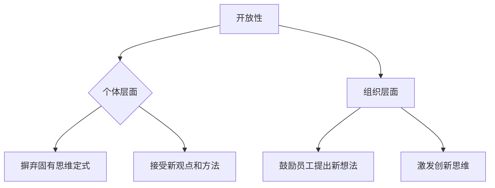
```mermaid
graph TD
    A[开放性] --> B{个体层面}
    B --> C[摒弃固有思维定式]
    B --> D[接受新观点和方法]
    A --> E[组织层面]
    E --> F[鼓励员工提出新想法]
    E --> G[激发创新思维]
```

#### 灵活性

灵活性是指思维的灵活和多变，它要求我们在面对变化时，能够迅速适应并找到新的解决方案。灵活的思维有助于应对复杂多变的环境，提高创新能力。

**Mermaid 流程图：**
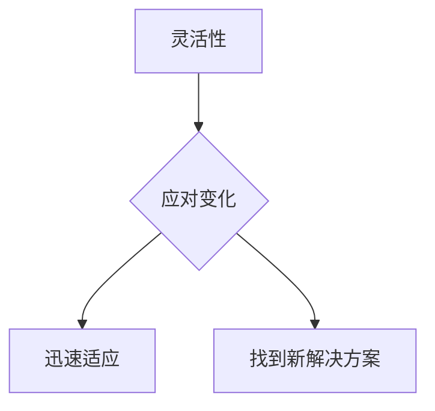
```mermaid
graph TD
    A[灵活性] --> B{应对变化}
    B --> C[迅速适应]
    B --> D[找到新解决方案]
```

#### 前瞻性

前瞻性是指思维的预见性和远见，它要求我们能够预见未来的趋势和挑战，从而提前做好准备。前瞻性思维有助于在竞争中占据优势，实现持续创新。

**Mermaid 流程图：**
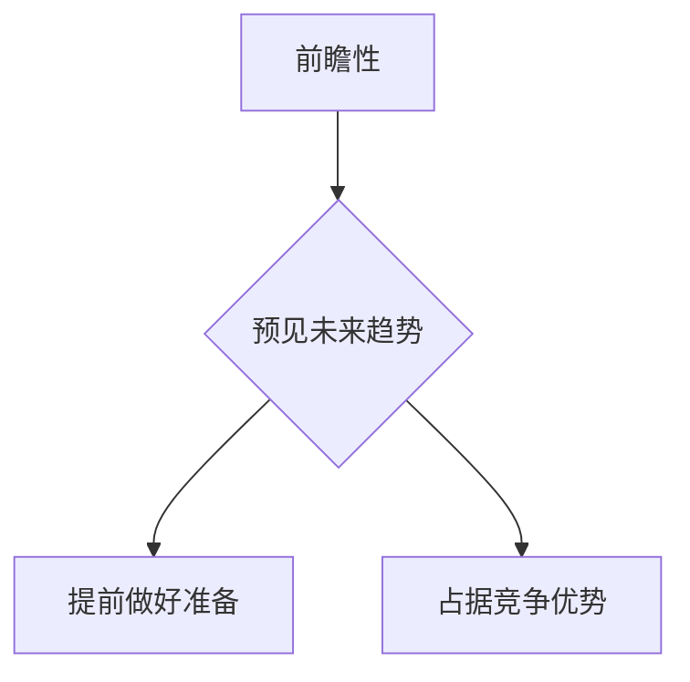
```mermaid
graph TD
    A[前瞻性] --> B{预见未来趋势}
    B --> C[提前做好准备]
    B --> D[占据竞争优势]
```

#### 批判性

批判性是指思维的批判性和分析力，它要求我们能够对现有知识和方法进行深入分析，找出不足和改进的空间。批判性思维有助于在创新过程中不断优化和改进。

**Mermaid 流程图：**
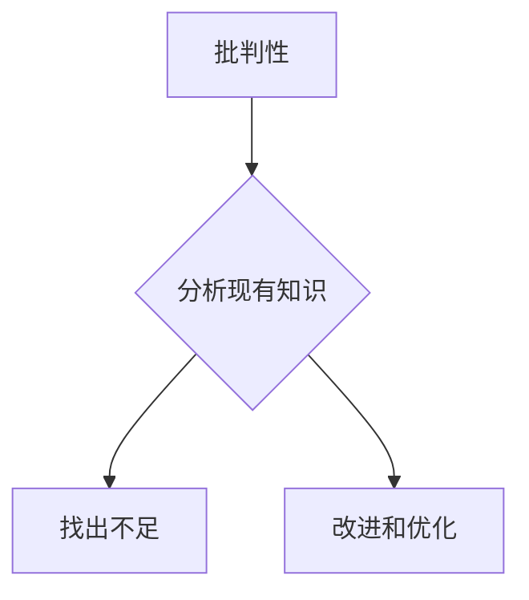
```mermaid
graph TD
    A[批判性] --> B{分析现有知识}
    B --> C[找出不足]
    B --> D[改进和优化]
```

#### 合作性

合作性是指思维的协同和合作，它要求我们在创新过程中，能够与他人共同努力，实现资源共享和知识互补。合作性思维有助于团队协作，实现创新突破。

**Mermaid 流程图：**
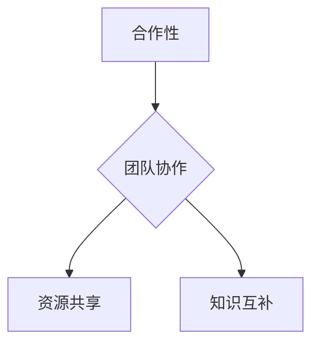
```mermaid
graph TD
    A[合作性] --> B{团队协作}
    B --> C[资源共享]
    B --> D[知识互补]
```

### 2.3 创新思维的发展历程

#### 历史背景

创新思维的概念起源于20世纪初，当时心理学家开始研究人类的思维过程和创造力。以下是一些关键阶段：

1. **20世纪20年代**：美国心理学家罗伯特·伍德沃斯（Robert S. Woodworth）提出了“创造性思维”的概念，强调创造性思维是一种独立的思维过程。
2. **20世纪40年代**：库尔特·勒温（Kurt Lewin）提出了“场理论”，揭示了创新思维的心理机制，为后来的研究奠定了基础。
3. **20世纪60年代**：约翰·弗伦奇（John French）和伯特兰·罗素（Bertrand Russell）提出了“平行思维”理论，强调思维的多维度和多样性。
4. **20世纪80年代**：托马斯·哈里森（Thomas J. Harrington）提出了“思维流程图”方法，通过图形化的方式帮助人们更好地进行创新思维。

#### 现代发展

随着科技的进步和社会的变革，创新思维的理论和实践也在不断演进。以下是一些现代发展：

1. **多样化**：现代创新思维理论强调多样性和包容性，认为不同文化背景和经验的人能够带来不同的视角和解决方案。
2. **跨学科**：现代创新思维不仅涉及心理学、经济学、社会学等领域，还涉及到计算机科学、设计思维等新兴领域。
3. **工具化**：现代科技为创新思维提供了各种工具和方法，如人工智能、大数据分析、设计思维工具等，提高了创新效率。
4. **实践性**：现代创新思维理论更加注重实践应用，强调将创新思维融入实际工作和生活中，实现创新成果的转化。

### 2.4 创新思维与领导力的关系

#### 关键要素

创新思维与领导力之间存在密切的关系。以下是一些关键要素：

1. **领导者角色**：领导者不仅是组织的决策者和管理者，更是创新思维的倡导者和推动者。领导者需要具备创新思维，才能激发团队的创新潜力。
2. **决策能力**：创新思维有助于领导者做出更明智的决策。通过创新思维，领导者能够预见未来趋势，评估潜在风险，并找到最佳解决方案。
3. **团队协作**：创新思维强调团队合作和知识共享。领导者需要通过创新思维，建立高效团队，促进团队成员之间的协作和创新。
4. **组织变革**：创新思维是组织变革的重要驱动力。领导者需要运用创新思维，推动组织的变革和发展，以适应不断变化的环境。

#### 实践应用

以下是一些创新思维在领导力中的具体实践应用：

1. **战略规划**：领导者可以通过创新思维，制定具有前瞻性和创新性的战略规划，为组织的发展指明方向。
2. **团队建设**：领导者可以通过创新思维，建立具有活力和创新精神的团队，激发团队成员的潜力，提高团队绩效。
3. **问题解决**：领导者可以通过创新思维，识别和解决组织面临的各种问题，提高组织的应变能力和竞争力。
4. **人才培养**：领导者可以通过创新思维，发现和培养具有创新能力和潜力的人才，为组织的未来发展奠定基础。

### 总结

创新思维是现代领导者必备的能力之一。通过理解创新思维的基本理论，领导者可以更好地发挥创新潜力，推动组织的变革和发展。在接下来的部分，我们将进一步探讨如何打破固有模式，培养创新思维，以及创新思维在领导力中的具体应用。

## 第三部分：打破固有模式的策略

### 3.1 挑战固有思维模式

#### 传统管理思维模式的弊端

传统管理思维模式往往以控制为导向，注重流程的规范化和标准化，这在一定程度上提高了组织的效率和稳定性。然而，这种模式也存在显著的弊端：

1. **僵化的组织结构**：过于固化的组织结构和职责分工限制了不同部门之间的协作和创新，导致组织难以适应外部环境的变化。
2. **抑制员工创造力**：以控制为导向的管理模式往往导致员工思维的僵化，限制了他们的创造力和创新能力。
3. **风险规避**：传统管理模式倾向于维持现状，对失败的恐惧使许多组织不愿承担创新带来的风险，从而抑制了创新思维的发展。

#### 挑战传统思维模式的重要性

为了打破这些固有模式，领导者需要主动挑战传统思维模式，培养开放、灵活和前瞻性的思维方式。挑战传统思维模式的重要性体现在以下几个方面：

1. **提高应变能力**：面对快速变化的外部环境，领导者需要具备灵活的思维方式，以适应不断变化的形势。
2. **激发员工创造力**：通过挑战传统思维模式，领导者可以激发员工的创造力和创新能力，提高组织的整体竞争力。
3. **推动组织变革**：挑战传统思维模式是组织变革的重要驱动力，有助于组织实现创新和可持续发展。

#### 实践策略

以下是一些具体的实践策略，帮助领导者挑战传统思维模式，培养创新思维：

1. **鼓励多样性**：建立多元化的团队，引入不同的文化背景、经验和观点，促进思维碰撞和创新。
2. **打破部门壁垒**：通过流程再造和扁平化管理，打破部门之间的壁垒，促进知识共享和跨部门协作。
3. **激励创新**：建立创新的激励机制，鼓励员工提出新的想法和解决方案，并对成功案例进行奖励。
4. **提供培训和学习机会**：为员工提供创新思维相关的培训和学习机会，提高他们的创新能力和思维方式。

### 3.2 创新思维的培养方法

#### 开放性思维的培养

开放性思维是创新思维的重要基础，它要求领导者具备广泛的知识面和包容的心态，能够接受不同的观点和方法。以下是几种培养开放性思维的方法：

1. **多角度思考**：在面对问题时，领导者应从多个角度进行分析和思考，避免局限于单一视角。
2. **跨界学习**：通过跨界学习，领导者可以拓宽自己的知识面，了解不同领域的知识和方法，从而激发创新思维。
3. **鼓励多样性**：在团队中鼓励多样性，尊重不同的观点和意见，促进思维的碰撞和融合。

**Mermaid 流�程图：**
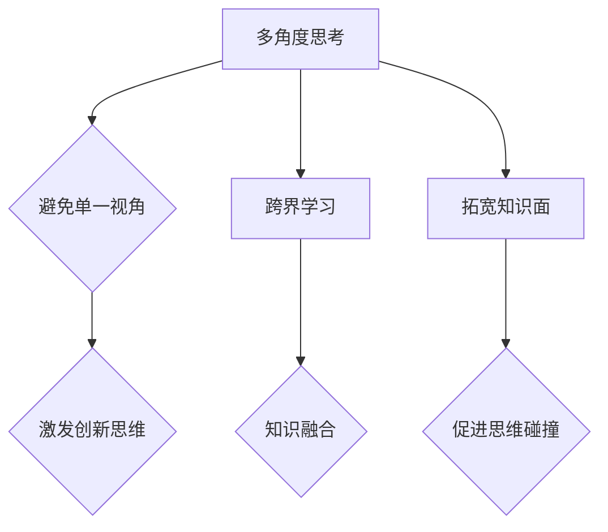
```mermaid
graph TD
    A[多角度思考] --> B{避免单一视角}
    A --> C[跨界学习]
    A --> D[拓宽知识面]
    B --> E{激发创新思维}
    C --> F{知识融合}
    D --> G{促进思维碰撞}
```

#### 灵活性思维的培养

灵活性思维要求领导者具备迅速适应环境和变化的能力，能够在不同情境中灵活调整自己的思维方式。以下是几种培养灵活性思维的方法：

1. **情境模拟**：通过情境模拟，领导者可以锻炼在不确定环境中做出决策和调整的能力。
2. **反思与总结**：定期进行反思和总结，分析成功和失败的原因，从中吸取经验教训，提高灵活性思维。
3. **拥抱变化**：鼓励领导者积极拥抱变化，将变化视为发展的机会，而不是威胁。

**Mermaid 流程图：**
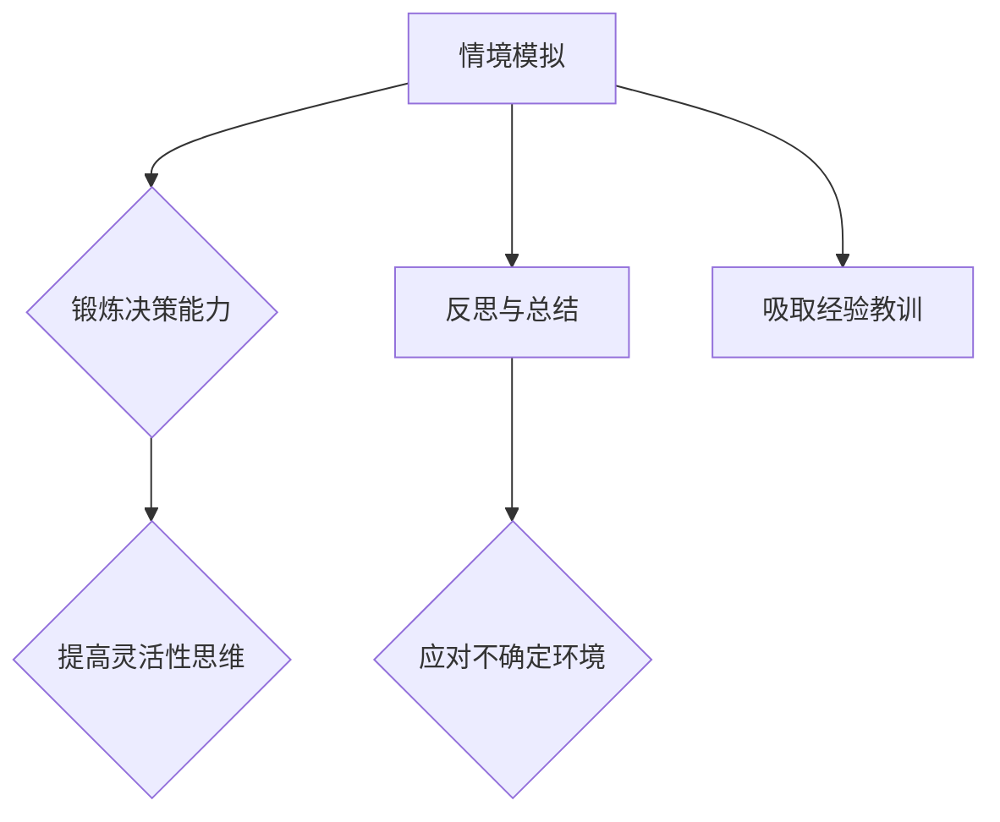
```mermaid
graph TD
    A[情境模拟] --> B{锻炼决策能力}
    A --> C[反思与总结]
    A --> D[吸取经验教训]
    B --> E{提高灵活性思维}
    C --> F{应对不确定环境}
```

#### 前瞻性思维的培养

前瞻性思维要求领导者具备预见未来趋势和挑战的能力，从而提前做好准备。以下是几种培养前瞻性思维的方法：

1. **关注趋势**：通过关注行业动态和趋势，领导者可以预见未来的发展方向，为组织制定长远的战略规划。
2. **跨界合作**：通过跨界合作，领导者可以借鉴其他领域的经验和知识，提高对未来的预见能力。
3. **人才培养**：通过培养具有前瞻性思维的员工，领导者可以为组织的未来发展提供有力的支持。

**Mermaid 流程图：**
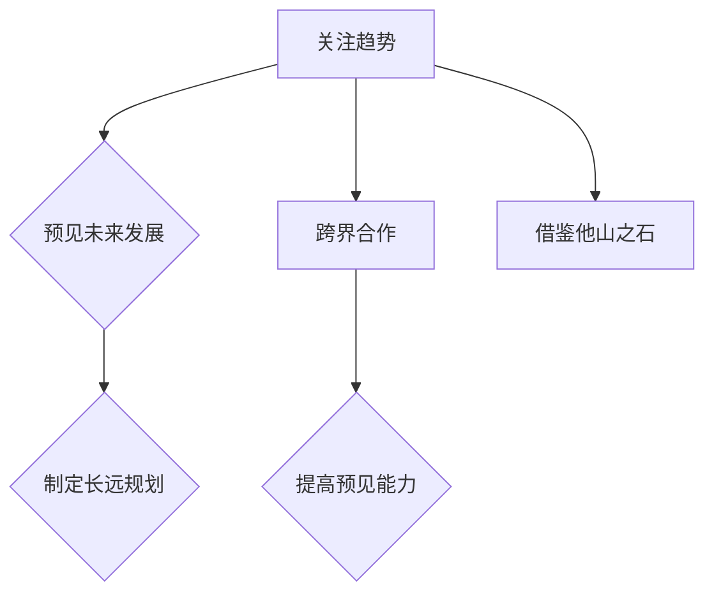
```mermaid
graph TD
    A[关注趋势] --> B{预见未来发展}
    A --> C[跨界合作]
    A --> D[借鉴他山之石]
    B --> E{制定长远规划}
    C --> F{提高预见能力}
```

#### 批判性思维的培养

批判性思维要求领导者具备对现有知识和方法进行深入分析的能力，从而找出不足和改进的空间。以下是几种培养批判性思维的方法：

1. **质疑与反思**：鼓励领导者对现有的观点和方法进行质疑和反思，找出其中的问题和不足。
2. **跨学科学习**：通过跨学科学习，领导者可以拓宽自己的知识面，从而更好地分析和评估各种观点和方法。
3. **案例研究**：通过案例研究，领导者可以深入了解其他领域和行业中的成功经验和失败教训，提高批判性思维的能力。

**Mermaid 流程图：**
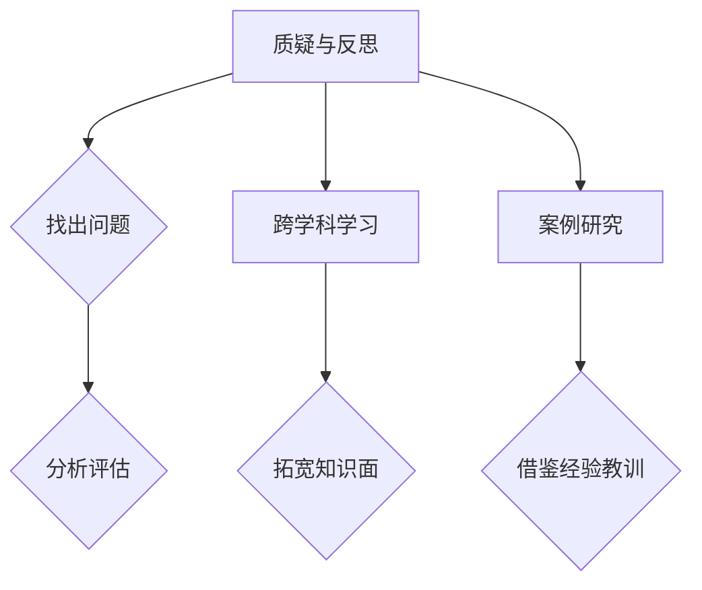
```mermaid
graph TD
    A[质疑与反思] --> B{找出问题}
    A --> C[跨学科学习]
    A --> D[案例研究]
    B --> E{分析评估}
    C --> F{拓宽知识面}
    D --> G{借鉴经验教训}
```

#### 合作性思维的培养

合作性思维强调团队合作和知识共享，要求领导者具备与他人共同努力、实现资源共享和知识互补的能力。以下是几种培养合作性思维的方法：

1. **团队建设**：通过团队建设活动，增强团队成员之间的信任和协作，提高合作性思维能力。
2. **知识共享**：建立知识共享平台，鼓励员工分享知识和经验，促进知识的传播和融合。
3. **跨部门协作**：通过跨部门协作项目，促进不同部门之间的交流和合作，提高整体组织的合作性思维能力。

**Mermaid 流程图：**
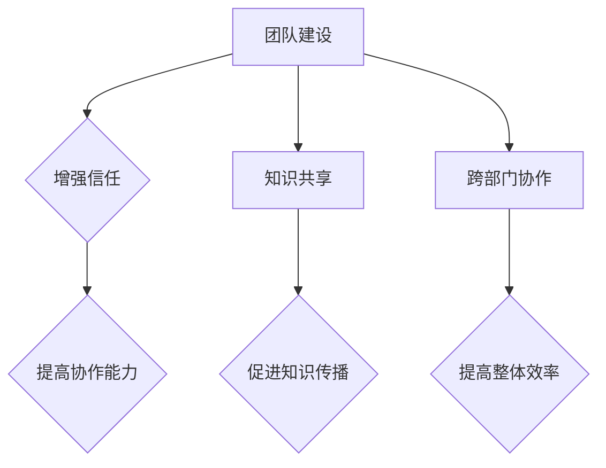
```mermaid
graph TD
    A[团队建设] --> B{增强信任}
    A --> C[知识共享]
    A --> D[跨部门协作]
    B --> E{提高协作能力}
    C --> F{促进知识传播}
    D --> G{提高整体效率}
```

### 3.3 团队创新思维的培养

#### 团队创新思维的重要性

团队创新思维是组织创新能力的核心。一个具备创新思维的团队，能够在面对挑战时迅速找到解决方案，实现组织的创新和突破。以下是团队创新思维的重要性：

1. **提升组织竞争力**：团队创新思维能够帮助组织开发新产品、新服务，提高市场竞争力。
2. **激发员工潜力**：团队创新思维能够激发员工的创造力和潜力，提高员工的满意度和忠诚度。
3. **实现组织目标**：团队创新思维有助于实现组织的战略目标和愿景，推动组织的持续发展。

#### 培养团队创新思维的方法

以下是一些培养团队创新思维的方法：

1. **建立创新文化**：建立鼓励创新的企业文化，让员工感受到创新的价值和意义，从而激发他们的创新热情。
2. **提供培训和学习机会**：为团队成员提供创新思维相关的培训和学习机会，提高他们的创新能力和思维方式。
3. **设立创新激励机制**：通过设立创新激励机制，鼓励团队成员提出新的想法和解决方案，并对成功案例进行奖励。
4. **促进知识共享**：建立知识共享平台，鼓励团队成员分享知识和经验，促进知识的传播和融合。
5. **开展团队建设活动**：通过团队建设活动，增强团队成员之间的信任和协作，提高团队的创新能力。

**Mermaid 流程图：**
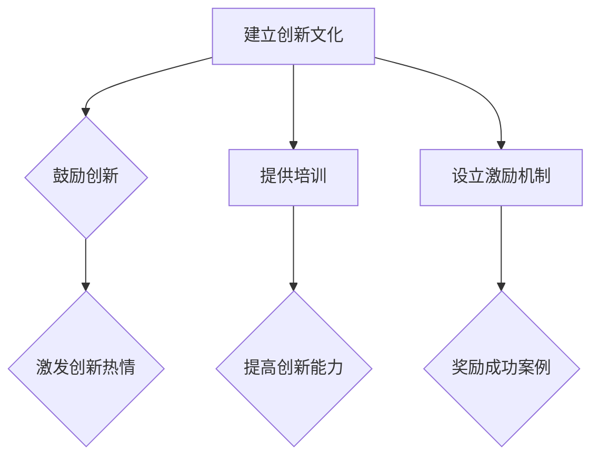
```mermaid
graph TD
    A[建立创新文化] --> B{鼓励创新}
    A --> C[提供培训]
    A --> D[设立激励机制]
    B --> E{激发创新热情}
    C --> F{提高创新能力}
    D --> G{奖励成功案例}
```

#### 团队协作中的挑战与解决方案

在团队协作中，创新思维的培养往往面临一些挑战，如沟通不畅、协作困难、资源分配不均等。以下是这些挑战及相应的解决方案：

1. **沟通不畅**：建立高效的沟通机制，如定期召开团队会议、利用项目管理工具等，确保团队成员之间的信息传递和交流。
2. **协作困难**：通过明确团队成员的角色和职责，建立协作流程和规范，提高团队的协作效率。
3. **资源分配不均**：通过公平的资源分配机制，确保团队成员能够获得足够的资源和支持，从而提高创新效果。

**Mermaid 流程图：**
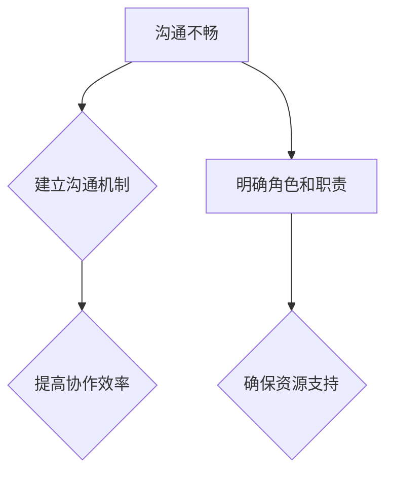
```mermaid
graph TD
    A[沟通不畅] --> B{建立沟通机制}
    A --> C[明确角色和职责]
    B --> D{提高协作效率}
    C --> E{确保资源支持}
```

### 3.4 创新思维的实践应用

#### 创新思维在实际工作中的应用

创新思维不仅是一种思维方式，更是一种实际应用能力。以下是创新思维在实际工作中的几种应用：

1. **问题解决**：在面对复杂问题时，领导者可以通过创新思维，寻找新的解决方案，提高问题的解决效率。
2. **产品开发**：在产品开发过程中，领导者可以通过创新思维，设计出满足市场需求的新产品，提高产品的竞争力。
3. **战略规划**：在制定战略规划时，领导者可以通过创新思维，预见未来的发展趋势，制定具有前瞻性和创新性的战略。

**Mermaid 流程图：**
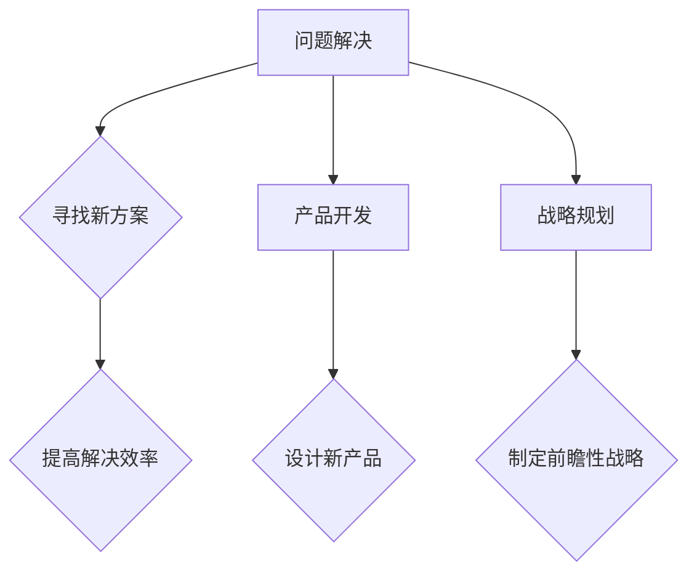
```mermaid
graph TD
    A[问题解决] --> B{寻找新方案}
    A --> C[产品开发]
    A --> D[战略规划]
    B --> E{提高解决效率}
    C --> F{设计新产品}
    D --> G{制定前瞻性战略}
```

#### 创新思维在不同领域的应用

创新思维在各个领域都有广泛的应用。以下是创新思维在几个不同领域的应用：

1. **科技领域**：科技领域的创新思维有助于推动科技的进步和突破，如人工智能、大数据等新兴技术的应用。
2. **商业领域**：商业领域的创新思维有助于企业开发新产品、拓展市场，提高竞争力。
3. **公共管理领域**：公共管理领域的创新思维有助于解决社会问题，提高公共服务的效率和质量。

**Mermaid 流程图：**
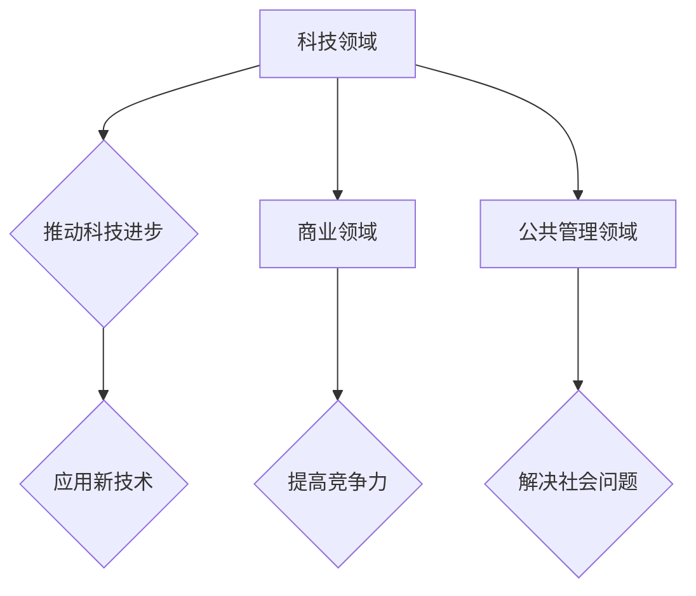
```mermaid
graph TD
    A[科技领域] --> B{推动科技进步}
    A --> C[商业领域]
    A --> D[公共管理领域]
    B --> E{应用新技术}
    C --> F{提高竞争力}
    D --> G{解决社会问题}
```

#### 创新思维的实践案例分析

以下是一些创新思维的实践案例分析，展示了创新思维在实际应用中的效果和启示：

1. **案例分析1**：一家传统制造业企业通过引入智能化生产线，实现了生产效率的提升和成本的降低，从而在激烈的市场竞争中脱颖而出。
2. **案例分析2**：一家互联网公司通过大数据分析和人工智能技术，成功开发了个性化推荐系统，提高了用户满意度和市场份额。
3. **案例分析3**：一家初创公司通过创新思维，开发了一种新型环保材料，成功解决了传统材料对环境造成的污染问题，获得了市场认可。

**Mermaid 流程图：**
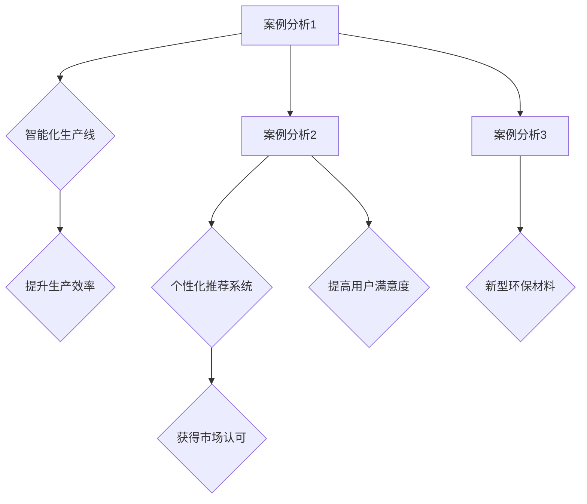
```mermaid
graph TD
    A[案例分析1] --> B{智能化生产线}
    A --> C[案例分析2] --> D{个性化推荐系统}
    A --> E[案例分析3] --> F{新型环保材料}
    B --> G{提升生产效率}
    C --> H{提高用户满意度}
    D --> I{获得市场认可}
```

通过以上案例分析，我们可以看到创新思维在实际工作中的广泛应用和显著效果。在接下来的部分，我们将进一步探讨创新思维在领导力中的应用，帮助领导者更好地发挥创新潜力，推动组织的变革和发展。

### 4.1 领导者的创新思维培养

#### 创新思维对领导者的重要性

在快速变化的时代，领导者不仅需要具备传统的管理能力，更需要具备创新思维。创新思维是领导者引领组织变革、实现持续发展的关键能力。以下是创新思维对领导者的重要性：

1. **预见未来趋势**：创新思维使领导者能够预见未来的发展趋势，为组织制定长远的战略规划。
2. **激发团队活力**：创新思维能够激发团队成员的创造力和潜力，提高团队的活力和竞争力。
3. **解决复杂问题**：创新思维帮助领导者识别和解决复杂问题，提高组织的应变能力和抗风险能力。
4. **推动组织变革**：创新思维是推动组织变革的重要驱动力，帮助领导者引领组织应对外部环境的变革。

#### 培养创新思维的步骤

以下是一些建议，帮助领导者培养创新思维：

1. **持续学习**：领导者需要不断学习新知识、新技能，保持对行业的敏锐洞察力和前瞻性思维。
2. **鼓励多样性**：领导者应鼓励团队成员提出不同的观点和解决方案，促进思维的多样性和创新。
3. **实践应用**：通过实际项目和案例研究，将创新思维应用于实际工作中，提高创新能力的实际应用能力。
4. **反思与总结**：定期进行反思和总结，分析成功和失败的原因，从中吸取经验教训，不断优化和创新思维。

**Mermaid 流程图：**
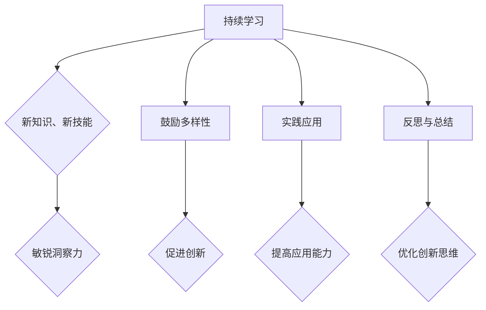
```mermaid
graph TD
    A[持续学习] --> B{新知识、新技能}
    A --> C[鼓励多样性]
    A --> D[实践应用]
    A --> E[反思与总结]
    B --> F{敏锐洞察力}
    C --> G{促进创新}
    D --> H{提高应用能力}
    E --> I{优化创新思维}
```

#### 创新思维在决策中的应用

创新思维在领导者的决策过程中起着至关重要的作用。以下是创新思维在决策中的应用：

1. **多角度分析**：领导者应从多个角度对问题进行分析，避免单一视角的局限，从而找到更全面的解决方案。
2. **寻求多样观点**：领导者应鼓励团队成员提出不同的观点和解决方案，从而激发创新思维，提高决策的质量。
3. **情境模拟**：通过情境模拟，领导者可以预测不同决策结果的可能影响，从而做出更明智的决策。
4. **风险评估**：领导者应进行充分的风险评估，考虑创新的潜在风险和收益，从而做出合理的决策。

**Mermaid 流程图：**
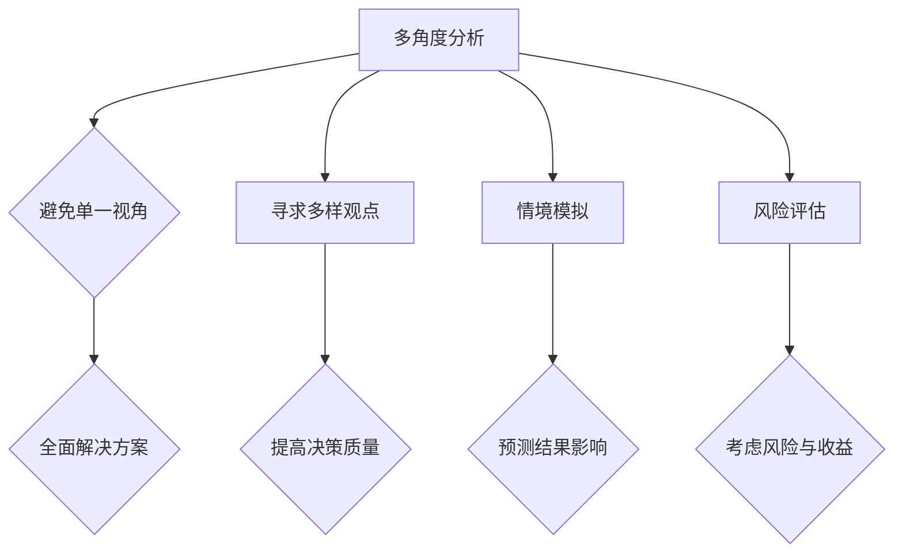
```mermaid
graph TD
    A[多角度分析] --> B{避免单一视角}
    A --> C[寻求多样观点]
    A --> D[情境模拟]
    A --> E[风险评估]
    B --> F{全面解决方案}
    C --> G{提高决策质量}
    D --> H{预测结果影响}
    E --> I{考虑风险与收益}
```

#### 创新思维在团队管理中的应用

创新思维在团队管理中同样至关重要。以下是创新思维在团队管理中的应用：

1. **建立创新文化**：领导者应建立鼓励创新的企业文化，激发团队成员的创新热情，提高团队的创新能力。
2. **提供培训和学习机会**：领导者应提供创新思维相关的培训和学习机会，提高团队成员的创新能力和思维方式。
3. **设立创新激励机制**：领导者应设立创新激励机制，鼓励团队成员提出新的想法和解决方案，并对成功案例进行奖励。
4. **促进知识共享**：领导者应建立知识共享平台，鼓励团队成员分享知识和经验，促进知识的传播和融合。

**Mermaid 流程图：**
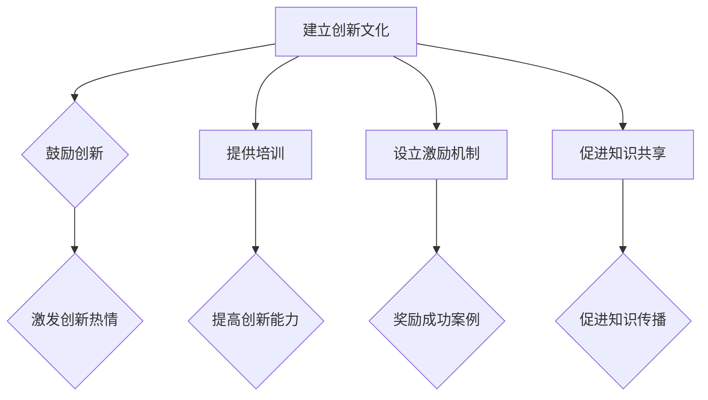
```mermaid
graph TD
    A[建立创新文化] --> B{鼓励创新}
    A --> C[提供培训]
    A --> D[设立激励机制]
    A --> E[促进知识共享]
    B --> F{激发创新热情}
    C --> G{提高创新能力}
    D --> H{奖励成功案例}
    E --> I{促进知识传播}
```

#### 创新思维在组织变革中的应用

创新思维在组织变革中起着关键作用。以下是创新思维在组织变革中的应用：

1. **制定变革策略**：领导者应运用创新思维，制定具有前瞻性和创新性的变革策略，为组织变革指明方向。
2. **激发员工参与**：领导者应鼓励员工积极参与组织变革，激发他们的创新热情和潜力。
3. **优化组织结构**：领导者应运用创新思维，优化组织结构，建立适应外部环境变化的组织形态。
4. **推进变革实施**：领导者应通过创新思维，推动组织变革的实施，确保变革目标的达成。

**Mermaid 流程图：**
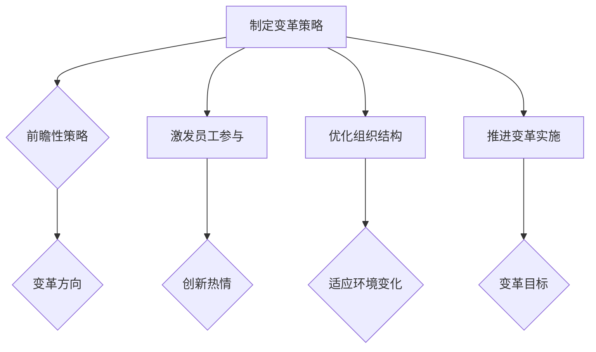
```mermaid
graph TD
    A[制定变革策略] --> B{前瞻性策略}
    A --> C[激发员工参与]
    A --> D[优化组织结构]
    A --> E[推进变革实施]
    B --> F{变革方向}
    C --> G{创新热情}
    D --> H{适应环境变化}
    E --> I{变革目标}
```

通过以上策略，领导者可以更好地培养创新思维，在决策、团队管理和组织变革中发挥创新思维的作用，推动组织的持续发展和创新。

### 4.2 创新思维在决策中的应用

#### 创新思维在战略决策中的应用

在战略决策中，创新思维可以帮助领导者识别新的市场机会、制定有竞争力的战略规划。以下是创新思维在战略决策中的应用：

1. **前瞻性分析**：通过创新思维，领导者可以预见未来的发展趋势和变化，为战略决策提供前瞻性分析。
2. **情景模拟**：利用创新思维，领导者可以构建不同的情景模拟，评估不同战略方案的可能影响。
3. **多样化观点**：鼓励团队成员提出多样化的观点和解决方案，通过创新思维筛选和优化。
4. **跨学科融合**：结合不同领域的知识和方法，实现跨学科的创新，为战略决策提供更多元化的视角。

**Mermaid 流程图：**
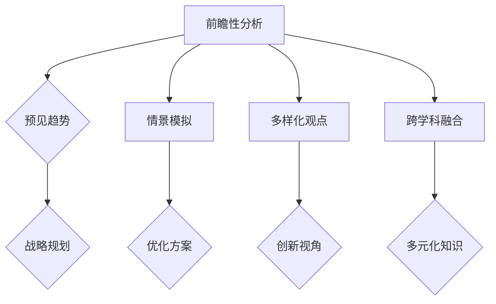
```mermaid
graph TD
    A[前瞻性分析] --> B{预见趋势}
    A --> C[情景模拟]
    A --> D[多样化观点]
    A --> E[跨学科融合]
    B --> F{战略规划}
    C --> G{优化方案}
    D --> H{创新视角}
    E --> I{多元化知识}
```

#### 创新思维在战术决策中的应用

在战术决策中，创新思维可以帮助领导者快速响应市场变化、调整运营策略。以下是创新思维在战术决策中的应用：

1. **快速迭代**：通过创新思维，领导者可以采用快速迭代的方法，不断优化产品和服务。
2. **实验与验证**：利用创新思维，领导者可以设计实验和验证方案，快速验证假设。
3. **敏捷管理**：运用创新思维，领导者可以实施敏捷管理，提高组织的响应速度和灵活性。
4. **风险管理**：通过创新思维，领导者可以识别和管理创新项目中的潜在风险，确保决策的稳健性。

**Mermaid 流程图：**
```mermaid
graph TD
    A[快速迭代] --> B{优化产品}
    A --> C[实验与验证]
    A --> D[敏捷管理]
    A --> E[风险管理]
    B --> F{持续改进}
    C --> G{验证假设}
    D --> H{提高灵活性}
    E --> I{确保稳健性}
```

#### 创新思维在决策过程中的挑战与应对

在决策过程中，创新思维的应用可能会面临一些挑战，如资源限制、时间紧迫、团队协作困难等。以下是应对这些挑战的策略：

1. **资源优化**：通过合理配置资源，确保创新项目的顺利进行。可以采用敏捷开发方法，灵活调整资源分配。
2. **时间管理**：运用创新思维，合理安排时间，提高决策效率。可以通过情景模拟和快速迭代，缩短决策周期。
3. **团队协作**：建立高效的团队协作机制，通过定期沟通和知识共享，促进团队成员之间的协作。
4. **风险管理**：在决策过程中，通过评估潜在风险，制定应对策略，确保决策的稳健性。

**Mermaid 流程图：**
```mermaid
graph TD
    A[资源优化] --> B{合理配置资源}
    A --> C[时间管理]
    A --> D[团队协作]
    A --> E[风险管理]
    B --> F{项目顺利进行}
    C --> G{提高决策效率}
    D --> H{促进协作}
    E --> I{确保决策稳健性}
```

通过以上策略，领导者可以在决策过程中更好地应用创新思维，提高决策的质量和效率，从而推动组织的持续发展和创新。

### 4.3 创新思维在团队管理中的应用

#### 创新思维在团队组建和成员选拔中的应用

在团队组建和成员选拔过程中，创新思维可以帮助领导者构建具有高绩效和创新能力的团队。以下是创新思维在团队组建和成员选拔中的应用：

1. **多样化选拔**：通过创新思维，领导者可以选拔具有不同背景、技能和观点的成员，促进团队思维的多样性和创新。
2. **潜力评估**：利用创新思维，领导者可以评估候选人的潜力，选拔那些具备创新能力和成长潜力的成员。
3. **跨学科组合**：通过跨学科组合，领导者可以构建具有多元化知识和技能的团队，提高团队的整体创新能力。

**Mermaid 流程图：**
```mermaid
graph TD
    A[多样化选拔] --> B{思维多样性}
    A --> C[潜力评估]
    A --> D[跨学科组合]
    B --> E{创新能力}
    C --> F{成长潜力}
    D --> G{多元化知识}
```

#### 创新思维在团队沟通和协作中的应用

在团队沟通和协作中，创新思维有助于提高团队的工作效率和创新能力。以下是创新思维在团队沟通和协作中的应用：

1. **开放性沟通**：通过创新思维，领导者可以建立开放性的沟通机制，鼓励团队成员自由表达观点，促进思维的碰撞。
2. **跨部门协作**：利用创新思维，领导者可以打破部门壁垒，促进跨部门之间的协作，实现资源的最大化利用。
3. **情境模拟**：通过情境模拟，领导者可以提前预测和解决团队协作中可能出现的问题，提高团队的协作效率。

**Mermaid 流程图：**
```mermaid
graph TD
    A[开放性沟通] --> B{思维碰撞}
    A --> C[跨部门协作]
    A --> D[情境模拟]
    B --> E{沟通效率}
    C --> F{资源最大化利用}
    D --> G{问题预测解决}
```

#### 创新思维在团队激励和人才培养中的应用

在团队激励和人才培养中，创新思维可以帮助领导者激发团队成员的潜力，培养创新型人才。以下是创新思维在团队激励和人才培养中的应用：

1. **个性化激励**：通过创新思维，领导者可以设计个性化的激励机制，激发团队成员的积极性和创新精神。
2. **创新培训**：利用创新思维，领导者可以开展多样化的创新培训，提高团队成员的创新能力和思维方式。
3. **实践机会**：通过提供实践机会，领导者可以让团队成员在实际工作中锻炼创新能力，积累经验。
4. **知识共享**：通过建立知识共享平台，领导者可以促进团队成员之间的知识交流和共享，提高团队的整体创新能力。

**Mermaid 流流程图：**
```mermaid
graph TD
    A[个性化激励] --> B{积极性}
    A --> C[创新培训]
    A --> D[实践机会]
    A --> E[知识共享]
    B --> F{创新精神}
    C --> G{创新能力}
    D --> H{经验积累}
    E --> I{知识交流}
```

#### 创新思维在团队冲突和问题解决中的应用

在团队管理和协作中，冲突和问题是难免的。创新思维可以帮助领导者有效应对和解决这些问题。以下是创新思维在团队冲突和问题解决中的应用：

1. **多元视角**：通过创新思维，领导者可以鼓励团队成员从不同角度思考问题，找到最佳的解决方案。
2. **快速响应**：利用创新思维，领导者可以迅速识别和解决团队中的问题，避免问题的扩大化。
3. **实验验证**：通过实验验证，领导者可以验证不同方案的可行性，找到最有效的解决方案。
4. **跨部门协作**：通过跨部门协作，领导者可以调动不同部门的专业知识和资源，共同解决复杂问题。

**Mermaid 流程图：**
```mermaid
graph TD
    A[多元视角] --> B{最佳方案}
    A --> C[快速响应]
    A --> D[实验验证]
    A --> E[跨部门协作]
    B --> F{解决方案}
    C --> G{避免问题扩大化}
    D --> H{验证可行性}
    E --> I{调动资源}
```

通过以上策略，领导者可以在团队管理中有效应用创新思维，提高团队的工作效率和创新能力，从而实现组织的持续发展和成功。

### 4.4 创新思维在组织变革中的应用

#### 创新思维在组织变革中的关键角色

在当今快速变化的环境中，组织变革成为维持竞争力和持续发展的关键。创新思维在组织变革中扮演着至关重要的角色，它不仅能够帮助企业适应外部环境的变化，还能激发内部的创新动力。以下是创新思维在组织变革中的关键角色：

1. **引领变革方向**：创新思维能够帮助领导者预见未来的发展趋势，制定符合时代潮流的变革战略。
2. **激发组织活力**：通过创新思维，领导者可以激发员工的积极性和创造力，使组织充满活力和动力。
3. **优化变革方案**：创新思维可以帮助领导者从多个角度分析和评估变革方案，选择最佳路径。
4. **应对变革阻力**：创新思维能够提供新的视角和方法，帮助领导者有效应对变革过程中的各种挑战和阻力。

#### 创新思维在组织变革策略中的应用

在组织变革中，创新思维的应用贯穿于整个变革过程，以下是一些具体的策略：

1. **情境模拟与预测**：通过情境模拟和预测，领导者可以预见变革带来的潜在影响，制定相应的应对策略。
2. **多元参与与协作**：鼓励员工和不同部门参与变革，通过跨部门协作，形成合力，提高变革的效率和质量。
3. **实验与验证**：通过实验和验证，领导者可以不断优化变革方案，确保变革的可行性和效果。
4. **文化变革**：创新思维不仅涉及技术和管理层面的变革，还包括文化层面的变革。领导者需要通过创新思维，建立适应新环境的企业文化。

**Mermaid 流程图：**
```mermaid
graph TD
    A[情境模拟与预测] --> B{预见影响}
    A --> C[多元参与与协作]
    A --> D[实验与验证]
    A --> E[文化变革]
    B --> F{应对策略}
    C --> G{提高效率}
    D --> H{优化方案}
    E --> I{适应新环境}
```

#### 创新思维在组织变革中的实施步骤

以下是一些建议，帮助组织有效实施变革：

1. **明确变革目标**：领导者需要明确变革的目标和愿景，确保变革的方向一致。
2. **评估变革需求**：通过调研和分析，评估组织在变革中的需求和潜在挑战。
3. **制定变革计划**：根据变革目标和需求，制定详细的变革计划，包括时间表、责任人、关键里程碑等。
4. **沟通与共识**：通过有效的沟通，确保员工理解变革的意义和目标，达成共识。
5. **实施与监控**：按照变革计划实施变革，同时持续监控变革的进展和效果，及时调整策略。
6. **总结与反馈**：在变革完成后，进行总结和反馈，评估变革成果，并为未来的变革积累经验。

**Mermaid 流程图：**
```mermaid
graph TD
    A[明确目标] --> B{一致方向}
    A --> C[评估需求]
    A --> D[制定计划]
    A --> E[沟通共识]
    A --> F[实施监控]
    A --> G[总结反馈]
    B --> H{确保一致}
    C --> I{评估挑战}
    D --> J{详细计划}
    E --> K{达成共识}
    F --> L{及时调整}
    G --> M{评估成果}
```

通过以上步骤，组织可以更好地实施变革，借助创新思维的力量，实现组织的持续发展和成功。

### 5.1 国内外企业创新思维成功案例

#### 亚马逊的“创新实验室”

亚马逊通过设立“创新实验室”（Amazon Lab126），致力于研发创新产品和新技术。这些实验室不仅孵化了Kindle电子书阅读器、Alexa语音助手等知名产品，还推动了亚马逊在云计算、人工智能等领域的突破。通过创新实验室，亚马逊能够快速验证新产品的市场潜力，并将创新思维融入企业的研发流程中。

**案例解析：**

- **多学科协作**：创新实验室吸引了来自不同领域的专家，如计算机科学、机械工程、产品设计等，通过多学科协作，实现了技术创新和产品突破。
- **快速迭代**：创新实验室采用敏捷开发方法，快速迭代产品，缩短了产品从概念到市场的周期。
- **持续投资**：亚马逊持续投资于创新实验室，确保其能够保持创新活力和竞争力。

#### 苹果公司的“创意空间”

苹果公司在其总部园区内设立了多个“创意空间”（Innovation Spaces），为员工提供了一个自由开放的交流和工作环境。这些创意空间配备了先进的科技设备和舒适的座椅，鼓励员工在此进行自由讨论、头脑风暴和协作创新。通过创意空间，苹果公司成功激发了员工的创造力和创新思维，推动了多个知名产品的诞生，如iPhone、iPad等。

**案例解析：**

- **开放性环境**：创意空间提供了一个开放、自由的环境，促进了员工之间的交流与合作。
- **跨部门协作**：创意空间打破了部门壁垒，促进了不同部门之间的知识共享和协作。
- **鼓励探索**：苹果公司鼓励员工在创意空间中进行自由探索，提出新的想法和解决方案。

#### 罗氏制药的创新孵化器

罗氏制药（Roche）设立了创新孵化器（Roche Innovation Hub），专注于新药研发和生物技术领域的创新。孵化器通过与初创企业的合作、投资和技术转让，实现了与外部创新力量的紧密结合。通过创新孵化器，罗氏制药不仅加快了新药的研发速度，还拓展了其技术创新的边界。

**案例解析：**

- **合作与投资**：创新孵化器通过与初创企业和研究机构的合作，实现了资源的整合和共享。
- **风险共担**：通过投资和合作，罗氏制药与初创企业共同承担创新风险，提高了创新的成功率。
- **人才培养**：创新孵化器为员工提供了与外部创新力量合作的机会，促进了人才培养和创新能力的提升。

#### 爱奇艺的“内容创新实验室”

爱奇艺通过设立“内容创新实验室”（iQIYI Content Innovation Lab），致力于探索和开发新的内容创作和分发模式。实验室通过大数据分析、人工智能等技术，实现了对用户需求的精准洞察，推动了内容创新和个性化推荐。通过内容创新实验室，爱奇艺成功推出了多个热门剧集和综艺，提升了用户满意度和市场竞争力。

**案例解析：**

- **数据驱动**：内容创新实验室通过大数据分析，实现了对用户行为的精准洞察，为内容创新提供了数据支持。
- **技术创新**：实验室利用人工智能、VR/AR等新技术，推动了内容创作和分发方式的创新。
- **市场导向**：内容创新实验室紧密结合市场需求，实现了内容创新的商业化落地。

#### 沃尔玛的“数字创新实验室”

沃尔玛通过设立“数字创新实验室”（Walmart Labs），专注于电子商务、人工智能、大数据等领域的创新。实验室通过与外部初创企业和科技公司的合作，实现了技术的快速应用和商业模式的创新。通过数字创新实验室，沃尔玛成功提升了其电子商务能力，推动了企业的数字化转型。

**案例解析：**

- **开放合作**：数字创新实验室通过与外部合作伙伴的开放合作，实现了技术的跨界融合和应用。
- **快速迭代**：实验室采用敏捷开发方法，快速迭代产品，缩短了新技术的商业化周期。
- **用户导向**：数字创新实验室始终以用户需求为导向，通过技术创新提升用户体验和满意度。

通过以上国内外企业的成功案例，我们可以看到创新思维在推动组织变革、提升竞争力和实现持续发展中的重要作用。在接下来的部分，我们将进一步探讨创新思维在公共管理中的应用。

### 5.2 创新思维在公共管理中的应用

#### 创新思维在公共管理中的重要性

创新思维在公共管理中扮演着至关重要的角色。随着社会的不断变化和复杂性增加，公共管理面临着越来越多的挑战，如资源分配、公共服务效率、社会治理等。创新思维能够帮助公共管理者识别和解决这些问题，提升公共管理的效能和响应能力。以下是创新思维在公共管理中的重要性：

1. **提升治理效能**：创新思维能够帮助公共管理者预见社会问题，制定更有效的治理策略，提升公共管理的整体效能。
2. **应对复杂挑战**：创新思维能够帮助公共管理者应对复杂的社会问题，如气候变化、人口老龄化等，提供创新的解决方案。
3. **增强服务能力**：创新思维能够推动公共服务模式的创新，提高公共服务的质量和效率，满足公众的需求。
4. **促进社会进步**：创新思维能够推动公共管理领域的变革，促进社会的可持续发展，提高公众的幸福感。

#### 创新思维在公共管理中的应用案例

以下是一些创新思维在公共管理中的应用案例，展示了创新思维在提升公共管理效能方面的具体实践：

**1. 案例一：新加坡的“智慧国”计划**

新加坡政府通过实施“智慧国”计划（Smart Nation Plan），利用大数据、人工智能、物联网等创新技术，推动公共管理的数字化转型。通过智慧国的建设，新加坡实现了城市管理的智能化，提升了公共服务效率，改善了市民的生活质量。

**案例解析：**

- **数据驱动**：新加坡政府通过大数据分析，实现了对城市运行状况的实时监控和预测，为公共管理提供了数据支持。
- **智能应用**：智慧国计划中，人工智能技术在交通管理、医疗保健、教育等领域得到了广泛应用，提升了公共服务的智能化水平。
- **市民参与**：智慧国计划鼓励市民参与城市管理，通过移动应用和在线平台，市民可以方便地反馈问题和建议，增强了公共管理的透明度和参与度。

**2. 案例二：杭州的“城市大脑”项目**

杭州市政府通过实施“城市大脑”项目，利用大数据和人工智能技术，实现了城市交通管理的智能化和高效化。通过城市大脑，杭州实现了对交通流量、空气质量、公共服务等数据的实时监控和分析，提高了城市管理的科学性和精准性。

**案例解析：**

- **实时监控**：城市大脑项目通过传感器和摄像头收集海量数据，实现了对城市运行状况的实时监控，为交通管理和公共服务的优化提供了数据基础。
- **智能调度**：基于大数据分析，城市大脑能够智能调度交通资源，优化交通流量，减少交通拥堵，提高交通效率。
- **公共服务优化**：城市大脑项目还帮助政府优化公共服务，如智慧医疗、智慧教育等，提升了市民的满意度。

**3. 案例三：深圳的“互联网+”政务服务**

深圳市政府通过实施“互联网+”政务服务，利用互联网和大数据技术，简化了政务服务的流程，提高了政务服务的效率。通过“互联网+”政务服务，深圳实现了政务服务的一站式办理、网上审批和在线咨询，大大便利了企业和市民。

**案例解析：**

- **一站式服务**：通过“互联网+”政务服务，深圳将各类政务服务整合到一个平台上，实现了政务服务的一站式办理，提高了办事效率。
- **网上审批**：通过网上审批，深圳简化了审批流程，减少了审批时间，降低了企业和市民的办事成本。
- **在线咨询**：通过在线咨询，深圳提供了24小时不间断的政务服务咨询，方便了市民的办事需求。

**4. 案例四：瑞典的“社会创新实验区”

瑞典政府通过设立“社会创新实验区”（Social Innovation Zones），鼓励地方政府和民间组织进行社会创新实验，推动公共管理的变革。通过社会创新实验区，瑞典实现了对社会问题的新解决方案的探索和推广。

**案例解析：**

- **多方合作**：社会创新实验区通过政府、企业、非营利组织等多方合作，实现了资源的整合和优势互补，推动了社会创新的实施。
- **试点推广**：社会创新实验区通过试点推广，将成功的社会创新解决方案在更大范围内应用，提高了公共管理的整体效能。
- **公众参与**：社会创新实验区鼓励公众参与，通过公众参与，提高了社会创新的透明度和公信力。

通过以上案例，我们可以看到创新思维在公共管理中的应用如何有效地提升了公共管理的效能和服务质量。在未来的公共管理中，创新思维将继续发挥重要作用，推动公共管理领域的持续变革和发展。

### 5.3 创新思维在教育领域中的应用

#### 创新思维在教育改革中的重要性

在教育领域，创新思维的应用正逐渐成为教育改革的重要驱动力。传统教育模式往往以知识传授为主，学生被动接受知识，缺乏主动探索和创新能力。而创新思维教育则强调培养学生的创造性思维、问题解决能力和自主学习能力，使其能够适应快速变化的社会环境。以下是创新思维在教育改革中的重要性：

1. **培养创造性人才**：创新思维教育有助于培养学生的创造力，使其能够独立思考、发现问题和提出解决方案。
2. **提升综合素质**：创新思维教育不仅关注学生的学术成绩，还注重培养其沟通能力、团队合作精神和批判性思维。
3. **适应未来社会**：创新思维教育能够帮助学生适应未来社会的需求，培养其适应变化、应对挑战的能力。
4. **推动教育创新**：创新思维教育有助于推动教育模式的变革，提高教育质量和效率。

#### 创新思维教育的方法与实践

以下是一些创新思维教育的方法和实践：

**1. 设计思维（Design Thinking）**

设计思维是一种以用户为中心的创新方法，它强调通过观察、访谈、原型设计和迭代优化，解决实际问题。设计思维在教育中的应用包括：

- **项目式学习（Project-Based Learning）**：通过项目式学习，学生可以亲身体验问题解决的全过程，培养创新思维。
- **问题导向学习（Problem-Based Learning）**：通过问题导向学习，学生可以主动探索问题、提出假设并验证，培养创新思维。

**Mermaid 流程图：**
```mermaid
graph TD
    A[设计思维] --> B{观察}
    A --> C{访谈}
    A --> D{原型设计}
    A --> E{迭代优化}
    B --> F{体验问题解决}
    C --> G{主动探索}
    D --> H{提出假设}
    E --> I{验证方案}
```

**2. 思维导图（Mind Mapping）**

思维导图是一种图形化的思维工具，它通过节点和连线，将思维过程和思路可视化。思维导图在教育中的应用包括：

- **课堂笔记**：教师可以使用思维导图整理课程内容，帮助学生更好地理解和记忆。
- **创意构思**：学生可以使用思维导图进行创意构思，探索解决问题的多种可能性。

**Mermaid 流程图：**
```mermaid
graph TD
    A[思维导图] --> B{课堂笔记}
    A --> C{创意构思}
    B --> D{理解记忆}
    C --> E{探索可能性}
```

**3. 问题解决学习（Problem-Solving Learning）**

问题解决学习是一种以问题为导向的学习方法，它强调学生在实际情境中解决问题，培养创新思维和批判性思维。问题解决学习的方法包括：

- **案例学习**：通过案例学习，学生可以了解现实世界中的问题解决过程，培养问题解决能力。
- **模拟演练**：通过模拟演练，学生可以在模拟环境中练习问题解决，提高实践能力。

**Mermaid 流程图：**
```mermaid
graph TD
    A[问题解决学习] --> B{案例学习}
    A --> C{模拟演练}
    B --> D{了解问题解决过程}
    C --> E{提高实践能力}
```

**4. 项目导向学习（Project-Oriented Learning）**

项目导向学习是一种以项目为导向的学习方法，它强调学生在实际项目中应用知识，培养创新思维和团队合作能力。项目导向学习的方法包括：

- **跨学科项目**：通过跨学科项目，学生可以结合不同学科的知识，解决复杂问题。
- **团队合作**：通过团队合作，学生可以学会与他人合作，提高沟通和协作能力。

**Mermaid 流程图：**
```mermaid
graph TD
    A[项目导向学习] --> B{跨学科项目}
    A --> C{团队合作}
    B --> D{综合应用知识}
    C --> E{提高协作能力}
```

#### 创新思维教育的实施步骤

以下是一些建议，帮助教育者实施创新思维教育：

1. **设定明确的目标**：教育者应明确创新思维教育的目标，如培养创造力、问题解决能力等。
2. **创建支持环境**：教育者应创建一个支持创新思维的环境，如提供必要的资源、鼓励自由表达等。
3. **引入创新方法**：教育者可以引入设计思维、思维导图、问题解决学习等方法，帮助学生培养创新思维。
4. **鼓励实践应用**：教育者应鼓励学生在实际情境中应用创新思维，如项目式学习、模拟演练等。
5. **持续评估与反馈**：教育者应持续评估学生的学习成果，提供反馈和指导，帮助学生不断改进。

**Mermaid 流程图：**
```mermaid
graph TD
    A[设定目标] --> B{明确目标}
    A --> C[创建支持环境]
    A --> D[引入创新方法]
    A --> E[鼓励实践应用]
    A --> F[持续评估与反馈]
    B --> G{确保目标达成}
    C --> H{提供资源}
    D --> I{培养创新思维}
    E --> J{提高实践能力}
    F --> K{不断改进}
```

通过以上方法和实施步骤，教育者可以有效地培养学生的创新思维，推动教育改革，为未来社会培养具有创新能力的人才。

### 第六部分：总结与展望

#### 创新思维培养的难点与对策

在创新思维培养过程中，领导者和管理者可能会面临一系列挑战。以下是这些难点及相应的对策：

1. **文化障碍**：传统企业文化往往抑制创新思维的发展。对策：建立鼓励创新的企业文化，通过培训和宣传活动，提升员工对创新思维的认识和接受度。
2. **资源限制**：创新需要时间和资源投入。对策：合理配置资源，优先支持创新项目，并利用外部合作伙伴的资源。
3. **激励机制不足**：缺乏有效的激励机制可能导致员工对创新的热情不高。对策：建立创新激励机制，对成功案例进行奖励，激发员工的创新动力。
4. **风险规避**：领导者对失败的恐惧可能抑制创新尝试。对策：建立风险容忍机制，鼓励员工尝试新方法，从失败中学习。
5. **跨部门协作困难**：部门壁垒可能导致信息不畅和协作困难。对策：通过扁平化管理、跨部门项目等，促进团队协作和知识共享。

**Mermaid 流程图：**
```mermaid
graph TD
    A[文化障碍] --> B{建立创新文化}
    A --> C[资源限制] --> D{合理配置资源}
    A --> E[激励机制不足] --> F{建立激励机制}
    A --> G[风险规避] --> H{建立风险容忍机制}
    A --> I[跨部门协作困难] --> J{促进跨部门协作}
    B --> K{提升认知和接受度}
    D --> L{优先支持创新}
    F --> M{奖励成功案例}
    H --> N{鼓励尝试新方法}
    J --> O{信息共享和协作}
```

#### 创新思维培养的未来发展趋势

随着科技的进步和社会的变化，创新思维培养将呈现出以下发展趋势：

1. **智能化**：人工智能和大数据技术将应用于创新思维的培养和评估，提高创新效率和质量。
2. **个性化**：创新思维培养将更加注重个性化，根据个体差异提供定制化的培养方案。
3. **全球化**：全球化背景下的跨文化交流将促进创新思维的多元化，提高创新思维的国际竞争力。
4. **终身学习**：随着知识更新的加速，终身学习将成为创新思维培养的重要途径。
5. **跨学科融合**：创新思维培养将更加注重跨学科知识的整合，促进不同领域的知识融合和互补。

**Mermaid 流程图：**
```mermaid
graph TD
    A[智能化] --> B{AI和大数据应用}
    A --> C[个性化] --> D{定制化培养方案}
    A --> E[全球化] --> F{跨文化交流}
    A --> G[终身学习] --> H{知识更新}
    A --> I[跨学科融合] --> J{知识整合和互补}
    B --> K{提高效率和质量}
    D --> L{满足个体差异}
    F --> M{多元化发展}
    H --> N{适应社会变化}
    I --> O{促进创新}
```

#### 创新思维培养对领导力的启示

创新思维培养不仅对个人发展具有重要意义，也对领导力提出了新的要求。以下是创新思维培养对领导力的启示：

1. **领导者角色转变**：领导者需要从传统的管理者转变为创新思维的倡导者和推动者。
2. **重视人才发展**：领导者应注重培养员工的创新思维，提升团队的整体创新能力。
3. **持续学习和自我提升**：领导者需要不断学习和更新知识，保持对创新思维的前瞻性和敏感性。
4. **建立支持环境**：领导者应创建一个支持创新思维的环境，鼓励员工自由探索和尝试。
5. **跨部门协作**：领导者应促进跨部门协作，打破部门壁垒，实现资源的最大化利用。

**Mermaid 流程图：**
```mermaid
graph TD
    A[领导者角色转变] --> B{倡导者和推动者}
    A --> C[重视人才发展] --> D{提升创新能力}
    A --> E[持续学习和自我提升] --> F{知识更新}
    A --> G[建立支持环境] --> H{鼓励自由探索}
    A --> I[跨部门协作] --> J{资源最大化利用}
    B --> K{引领创新思维发展}
    D --> L{培养创新型人才}
    F --> M{保持前瞻性}
    H --> N{支持创新环境}
    I --> O{提高组织效能}
```

通过创新思维培养，领导者可以提升自身的领导力，推动组织的持续发展和创新。

### 附录

#### A.1 参考文献

1. 克莱顿·克里斯滕森（Clayton M. Christensen）. 《创新者的窘境》[M]. 机械工业出版社，2016.
2. 艾瑞克·冯· Hippel（Eric von Hippel）. 《民主的创新》[M]. 机械工业出版社，2014.
3. 威廉·布拉顿（William J. Branson）. 《创新思维》[M]. 中国人民大学出版社，2018.
4. 丹娜·博伊尔（Dana Boyd）. 《思维的架构》[M]. 中信出版社，2019.
5. 斯蒂芬·罗宾斯（Stephen P. Robbins）. 《领导力》[M]. 机械工业出版社，2015.

#### A.2 相关资源与拓展阅读

1. TED演讲：https://www.ted.com/topics/innovation
2. 创新思维培训课程：https://www.coursera.org/courses?query=innovation+thinking
3. 创新思维书籍推荐：https://www.goodreads.com/shelf/show/innovation-thinking
4. 创新思维博客：https://www.innosight.com/innovation-thinking/
5. 创新思维论坛：https://www.innovationwiki.org/

通过以上参考文献和相关资源，读者可以进一步深入了解创新思维的原理和实践，提升自身的创新思维能力。作者：AI天才研究院/AI Genius Institute & 禅与计算机程序设计艺术/Zen And The Art of Computer Programming

### 文章小结

本文围绕“创新思维培养：打破固有模式的领导力”这一主题，深入探讨了创新思维的定义、类型、核心要素及其在领导力中的应用。通过分析创新思维与领导力的关系，文章提出了挑战传统思维模式、培养创新思维的策略，并详细介绍了团队创新思维的培养方法。同时，文章通过国内外企业及公共管理的成功案例，展示了创新思维在实际应用中的效果和启示。最后，文章总结了创新思维培养的难点与对策，并对未来发展趋势进行了展望，为领导者和管理者提供了有价值的参考和指导。

### 注意事项

1. **文化适应**：在推广创新思维时，领导者需要考虑组织的文化背景，确保创新思维的融入与组织文化的适应性。
2. **资源投入**：创新思维培养需要充足的资源支持，领导者应合理配置资源，优先支持创新项目。
3. **风险容忍**：创新过程中难免会遇到失败，领导者应建立风险容忍机制，鼓励员工勇于尝试新方法。
4. **持续学习**：创新思维是一个持续发展的过程，领导者需要不断学习和更新知识，以保持对创新思维的前瞻性。

### 拓展阅读

1. 《创新者的窘境》[M]. 克莱顿·克里斯滕森，机械工业出版社，2016.
2. 《创意思维》[M]. 罗伯特·埃文斯，人民邮电出版社，2018.
3. 《设计思维》[M]. 托尼·巴赫，电子工业出版社，2019.
4. 《领导力的五项修炼》[M]. 史蒂芬·柯维，中国青年出版社，2014.
5. 《创新的基因》[M]. 詹姆斯·穆尔，机械工业出版社，2017.

通过拓展阅读，读者可以进一步深入了解创新思维的理论和实践，提升自身的创新能力和领导力。作者：AI天才研究院/AI Genius Institute & 禅与计算机程序设计艺术/Zen And The Art of Computer Programming

