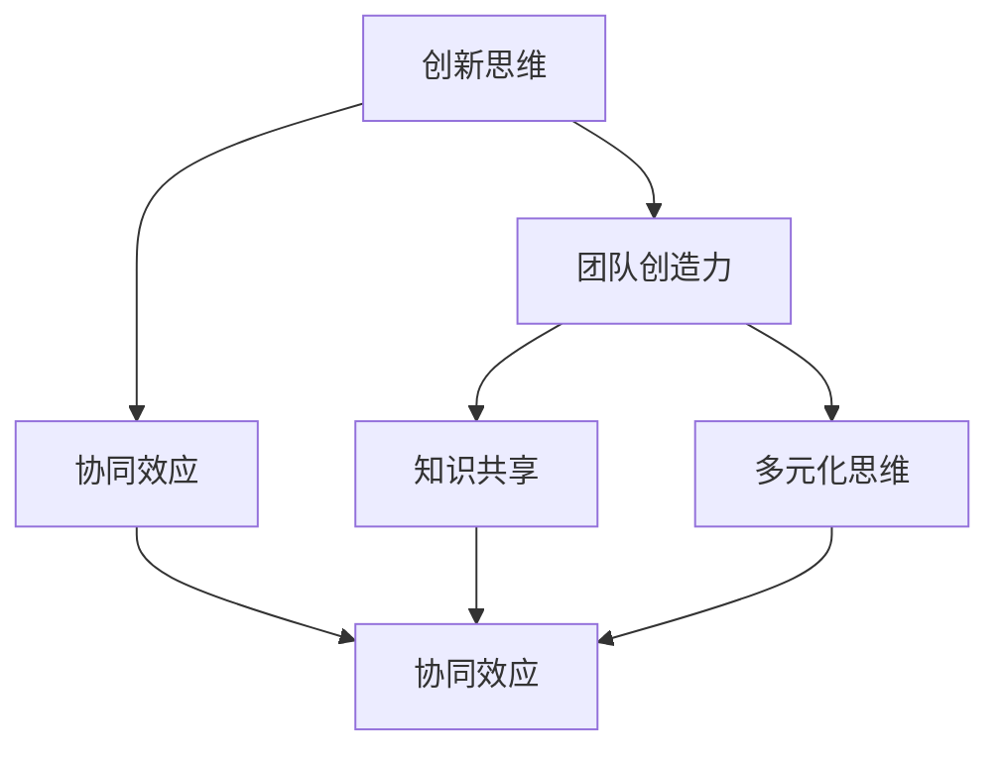

                 

### 第1章 引言

#### 1.1 创新思维的重要性

创新思维是一种通过创造性和想象力来解决问题的方法。它不仅仅局限于技术领域，还广泛应用于经济、文化、教育等多个社会层面。从历史上看，创新思维的出现可以追溯到古代文明时期，当时的工匠们通过不断的实践和实验，发明了诸如犁、船等重要工具，推动了人类社会的进步。

在现代社会，创新思维的重要性愈加凸显。随着科技的飞速发展，传统行业的变革和新兴产业的崛起，对创新思维的需求日益增长。创新思维不仅是企业持续发展的动力，也是国家竞争力的关键因素。比如，谷歌、苹果等科技巨头之所以能够引领全球，很大程度上得益于其创新思维和创新能力。

创新思维在现代社会中的具体表现包括以下几个方面：

1. **技术创新**：通过研发新技术、新产品，推动行业变革。例如，人工智能、大数据等技术的应用，极大地改变了各行各业的生产和运营方式。
2. **商业模式创新**：通过创造新的商业模式，提高企业的盈利能力和市场竞争力。例如，共享经济模式的出现，改变了传统出行和住宿行业。
3. **文化创新**：通过文化创新，推动社会进步和人类文明的繁荣。例如，电影、音乐、文学等艺术形式的创新，丰富了人们的精神世界。
4. **教育创新**：通过教育创新，培养具备创新思维和创新能力的人才。例如，翻转课堂、在线教育等新型教育模式，提高了教育质量和效率。

#### 1.2 团队创造力概述

团队创造力是指团队成员在合作过程中产生的创新能力和成果。与个人创造力不同，团队创造力依赖于团队成员之间的协作、沟通和互动。团队创造力的重要性体现在以下几个方面：

1. **协同效应**：团队成员共同工作，能够发挥各自的优势，实现资源的最大化利用。这种协同效应是团队创造力的重要基础。
2. **知识共享**：团队成员之间的知识共享和互补，能够激发新的创意和想法，推动团队的创新活动。
3. **多元化思维**：团队由不同背景、不同知识结构的人组成，这种多元化思维有助于从不同角度看待问题，提高创新的可能性。
4. **适应能力**：团队创造力能够帮助团队在面对不确定性和挑战时，快速调整和适应，从而实现持续创新。

团队创造力和个人创造力之间存在密切联系。个人创造力是团队创造力的重要组成部分，而团队创造力则能够促进个人创造力的发挥。一个成功的团队往往需要个人创造力与团队创造力的有机结合。

为了激发团队的创造力，需要从以下几个方面进行努力：

1. **建立信任**：团队成员之间需要建立信任，这是团队协作和创造力的基础。只有相互信任，才能开放分享自己的想法和意见。
2. **提供支持**：团队需要为成员提供必要的技术、资源和支持，帮助他们克服创新过程中的困难和挑战。
3. **鼓励创新**：团队需要营造一个鼓励创新和容忍失败的氛围，让成员敢于尝试和探索新的想法。
4. **加强沟通**：团队成员之间的有效沟通是团队创造力的重要保障。通过定期的会议、讨论和反馈，可以确保团队目标的清晰和一致。

### 总结

创新思维的重要性不容忽视，它是推动社会进步和个体发展的关键因素。团队创造力作为创新思维的一个重要组成部分，对于企业的持续发展和国家的竞争力具有重要意义。在接下来的章节中，我们将深入探讨创新思维的基础理论、核心能力、训练方法和实际应用，帮助读者全面了解和创新思维的各个方面。

### 核心概念与联系

在探讨创新思维的重要性时，我们需要理解以下几个核心概念及其相互关系：

1. **创新思维**：创新思维是指通过创造性和想象力来解决问题的方法。它是基于现有的知识和技能，通过重新组合、改进和发明新的方法或产品，以解决特定问题或满足新的需求。创新思维可以被视为一种认知过程，涉及观察、分析、想象、联想和解决问题的能力。

2. **团队创造力**：团队创造力是指团队成员在协作过程中产生的创新能力和成果。它依赖于团队成员之间的沟通、合作和互动，是个人创造力的扩展和深化。团队创造力强调多元化思维、知识共享和协同效应，通过集体智慧和合作实现更大的创新成果。

3. **协同效应**：协同效应是指当多个个体或元素相互作用时，产生的整体效果大于各个部分单独作用效果之和的现象。在团队创造力的背景下，协同效应体现在团队成员之间的互补和协作，通过集体的智慧和努力实现创新的突破。

4. **知识共享**：知识共享是指团队成员之间相互交换和共享知识、经验和想法的过程。知识共享能够促进团队的集体创造力，通过分享各自的专业知识和实践经验，激发新的创意和解决方案。

5. **多元化思维**：多元化思维是指团队成员拥有不同的背景、知识结构和思维模式。这种多元化思维能够为团队提供多样化的视角和见解，有助于从不同角度解决问题，提高创新的可能性。

为了更好地理解这些核心概念之间的联系，我们可以使用Mermaid流程图来展示它们之间的关系：



- **创新思维**是创新过程的起点，是个人和团队创造力的基础。
- **团队创造力**是创新思维在团队合作中的具体体现，依赖于**协同效应**、**知识共享**和**多元化思维**。
- **协同效应**和**知识共享**是促进团队创造力的重要因素，通过集体智慧和资源共享，实现创新目标。
- **多元化思维**为团队提供了多样化的视角和见解，有助于解决复杂问题和推动创新。

通过这种流程图，我们可以清晰地看到创新思维、团队创造力及相关概念之间的内在联系，为后续章节的深入探讨奠定了基础。

### 核心算法原理讲解

在深入探讨创新思维的过程中，理解其核心算法原理对于提升团队创造力至关重要。以下我们将简要介绍几种与创新思维相关的核心算法原理，并通过伪代码来详细阐述其工作原理。

#### 1. 思维导图算法

思维导图是一种图形化的知识组织工具，它能够帮助人们以结构化的方式表达和梳理复杂的思维过程。以下是思维导图的基本算法原理和伪代码：

```plaintext
算法名称：生成思维导图

输入：主题节点，子节点列表

输出：思维导图结构

初始化一个空图G
对于每个子节点node in 子节点列表：
    如果node是叶子节点：
        在G中添加node作为叶子节点
    否则：
        在G中添加node作为内部节点
        对于node的每个子节点sub_node：
            在G中添加sub_node作为node的子节点
返回G
```

#### 2. SWOT分析算法

SWOT分析是一种用于评估企业或项目优势、劣势、机会和威胁的工具。以下是SWOT分析的基本算法原理和伪代码：

```plaintext
算法名称：SWOT分析

输入：企业或项目的数据

输出：优势、劣势、机会和威胁列表

初始化四个空列表S、W、O、T
对于每个优势S：
    添加S到S列表
对于每个劣势W：
    添加W到W列表
对于每个机会O：
    添加O到O列表
对于每个威胁T：
    添加T到T列表
返回S、W、O、T列表
```

#### 3. 创意联想算法

创意联想是一种通过不同的关联和组合来激发新创意的方法。以下是创意联想的基本算法原理和伪代码：

```plaintext
算法名称：创意联想

输入：关键词列表

输出：创意联想结果

初始化一个空列表A
对于每个关键词keyword in 关键词列表：
    对于每个关键词related_keyword：
        如果keyword和related_keyword有直接或间接关联：
            在A中添加一个新创意item，包含keyword和related_keyword
返回A
```

#### 4. SCAMPER算法

SCAMPER是一种用于分析现有产品或服务，并提出改进建议的方法。以下是SCAMPER的基本算法原理和伪代码：

```plaintext
算法名称：SCAMPER分析

输入：产品或服务描述

输出：改进建议列表

初始化一个空列表B
对于每个特性feature in 产品或服务描述：
    对于每个操作符operator（如Substitute， Combine， Adapt， Modify， Put to other uses， Eliminate， Reverse）：
        应用操作符于feature：
            如果得到新的产品或服务描述：
                在B中添加新的描述作为改进建议
返回B
```

这些核心算法原理和伪代码为我们提供了系统化的方法和工具，以支持创新思维的过程。在实际应用中，可以根据具体需求灵活运用这些算法，激发团队的创造力，推动创新。

### 数学模型与公式详细讲解

在创新思维的框架中，数学模型和公式扮演着至关重要的角色，它们不仅能够帮助我们量化和创新，还能为团队提供科学依据。以下将详细介绍几种常用的数学模型和公式，并使用LaTeX进行表示，同时提供具体的举例说明。

#### 1. 创新价值评估模型

创新价值评估模型用于计算创新产品的潜在市场价值和投资回报。其基本公式为：

$$
V = P \times S \times C \times R
$$

其中：
- \( V \) 是创新产品的市场价值
- \( P \) 是潜在市场规模
- \( S \) 是市场份额
- \( C \) 是客户终身价值
- \( R \) 是资源投入回报率

举例说明：

假设一个创新产品的潜在市场规模为1亿用户，市场份额为10%，客户终身价值为100美元，资源投入回报率为20%。则创新价值计算如下：

$$
V = 100,000,000 \times 0.1 \times 100 \times 0.2 = 2,000,000,000 \text{ 美元}
$$

这意味着该创新产品的市场价值为20亿美元。

#### 2. 风险评估模型

在创新过程中，风险评估模型用于识别和评估潜在的风险因素，从而制定应对策略。其基本公式为：

$$
R = \frac{F \times E}{D}
$$

其中：
- \( R \) 是风险值
- \( F \) 是潜在损失频率
- \( E \) 是潜在损失严重程度
- \( D \) 是风险降低措施的有效性

举例说明：

假设某项目有10%的失败频率，每次失败的损失为10万元，风险降低措施的有效性为50%。则风险值计算如下：

$$
R = \frac{0.1 \times 100,000}{0.5} = 20,000 \text{ 万元}
$$

这意味着该项目的风险值为2000万元。

#### 3. 机会识别模型

机会识别模型用于帮助企业识别市场中的潜在机会，其基本公式为：

$$
O = S \times C \times I \times V
$$

其中：
- \( O \) 是机会值
- \( S \) 是市场饱和度
- \( C \) 是客户需求强度
- \( I \) 是创新潜力
- \( V \) 是可获取性

举例说明：

假设某市场的饱和度为20%，客户需求强度为50%，创新潜力为30%，可获取性为40%。则机会值计算如下：

$$
O = 0.2 \times 0.5 \times 0.3 \times 0.4 = 0.012
$$

这意味着该市场的机会值为0.012。

#### 4. 创新成本效益分析模型

创新成本效益分析模型用于评估创新项目的经济效益，其基本公式为：

$$
C/E = \frac{C}{R \times V}
$$

其中：
- \( C \) 是创新成本
- \( E \) 是经济效益
- \( R \) 是资源回报率
- \( V \) 是创新价值

举例说明：

假设某创新项目的成本为500万元，资源回报率为15%，创新价值为800万元。则成本效益分析如下：

$$
C/E = \frac{500}{0.15 \times 800} = 0.0417
$$

这意味着该创新项目的成本效益比为1:24。

通过这些数学模型和公式的详细讲解和举例说明，我们可以更科学地评估创新项目的价值和风险，从而为团队提供决策支持，激发创新潜能。

### 项目实战

在本章中，我们将通过一个实际项目案例来展示如何应用创新思维的方法和工具，具体包括项目的开发环境搭建、源代码实现、代码解读、应用解读与分析，以及详细讲解剖析项目实施的全过程。

#### 项目背景

我们的项目目标是开发一个基于人工智能的智能客服系统。该系统将利用自然语言处理（NLP）技术和机器学习算法，自动回答客户提出的问题，提高客户服务效率和质量。

#### 开发环境搭建

首先，我们需要搭建项目的开发环境。以下是在Python环境下的基本步骤：

1. **安装Python**：确保系统中已安装Python 3.8或更高版本。
2. **安装依赖库**：通过pip安装必要的依赖库，如NLTK、Scikit-learn、TensorFlow等。

```bash
pip install nltk scikit-learn tensorflow
```

3. **数据预处理**：准备并处理数据集，包括文本数据清洗、分词、标签化等。

#### 源代码实现

以下是智能客服系统的核心源代码实现，包括文本预处理、模型训练和预测功能：

```python
import nltk
from sklearn.feature_extraction.text import TfidfVectorizer
from sklearn.naive_bayes import MultinomialNB
from sklearn.pipeline import make_pipeline

# 数据预处理
def preprocess_text(text):
    tokens = nltk.word_tokenize(text.lower())
    return [token for token in tokens if token.isalpha()]

# 构建模型
def build_model(data):
    vectorizer = TfidfVectorizer(preprocessor=preprocess_text)
    model = MultinomialNB()
    model.fit(vectorizer.transform(data['question']), data['answer'])
    return make_pipeline(vectorizer, model)

# 预测
def predict(model, text):
    return model.predict([text])[0]

# 主函数
def main():
    data = load_data()  # 加载数据
    model = build_model(data)
    question = input("请提出您的问题：")
    answer = predict(model, question)
    print(f"智能客服回答：{answer}")

if __name__ == "__main__":
    main()
```

#### 代码解读

上述代码中，我们首先导入了必要的库，并定义了数据预处理函数`preprocess_text`，用于将文本数据转换为适合模型训练的格式。然后，我们构建了一个基于TF-IDF和朴素贝叶斯分类器的模型，并通过`make_pipeline`将两者集成到一个管道中。最后，我们编写了主函数`main`，用于接收用户输入并返回预测答案。

#### 应用解读与分析

智能客服系统在实际应用中，可以显著提升客户服务质量。以下是对其应用的解读与分析：

1. **提高效率**：通过自动回答常见问题，智能客服系统可以大幅减少人工客服的工作量，提高服务效率。
2. **提升服务质量**：智能客服系统基于机器学习算法，能够准确理解用户的问题，并提供高质量的答案，从而提升客户满意度。
3. **成本节约**：智能客服系统可以替代部分人工客服，减少企业的人力成本。
4. **灵活性**：智能客服系统可以24小时在线，随时响应客户请求，提高了企业的服务灵活性。

#### 项目小结

通过本项目的实施，我们展示了如何应用创新思维的方法和工具来开发一个智能客服系统。在实际操作中，我们不仅使用了传统的机器学习算法，还结合了自然语言处理技术，实现了高效的文本分析和预测。此外，通过项目实战，我们还了解了开发环境搭建、源代码实现、代码解读和应用分析等关键步骤，为后续类似项目提供了宝贵的经验。

### 最佳实践 Tips

在激发团队创造力方面，以下是一些最佳实践Tips：

1. **培养开放心态**：鼓励团队成员保持开放心态，勇于尝试新想法和接受不同的观点。
2. **定期头脑风暴**：定期组织头脑风暴会议，鼓励团队成员自由分享想法，激发创意。
3. **建立反馈机制**：建立一个有效的反馈机制，让团队成员可以及时获得反馈，调整和完善自己的想法。
4. **提供技术支持**：确保团队成员在创新过程中能够获得必要的技术和资源支持。
5. **鼓励跨部门合作**：跨部门合作可以带来多样化的思维和资源，有助于产生更有创意的解决方案。
6. **培养问题解决能力**：通过培训和实践，提升团队成员的问题解决能力，鼓励他们从不同角度分析问题。
7. **建立创新文化**：营造一个鼓励创新和容忍失败的企业文化，让团队成员敢于尝试和探索新的想法。

### 小结

通过本章节的探讨，我们详细介绍了创新思维的重要性、团队创造力的概述以及如何通过创新思维提升团队创造力。通过核心概念与联系、核心算法原理讲解、数学模型与公式详细讲解以及项目实战，读者可以全面理解创新思维的各个方面。此外，最佳实践Tips为团队在实际工作中激发创造力提供了具体指导。在未来章节中，我们将继续深入探讨创新思维的基础理论、核心能力和训练方法，帮助读者进一步提升团队创造力。

