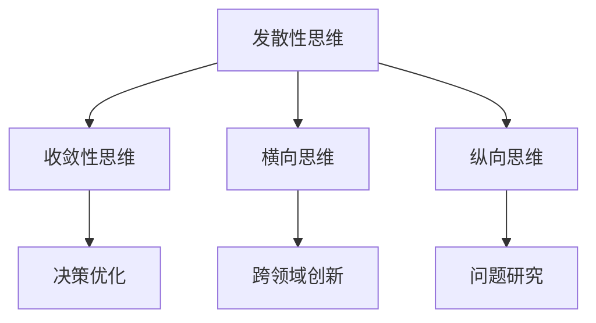

                 


### 背景介绍

#### 创新思维的重要性

在当今快速发展的科技时代，创新思维已经成为推动社会进步和经济发展的重要动力。对于企业而言，创新思维能够帮助它们在激烈的市场竞争中脱颖而出，持续创造新的价值和利润。对于团队而言，创新思维能够激发成员的创造力和合作精神，提高团队的整体效率和竞争力。因此，如何有效地培养和激发团队的创新思维，已经成为许多企业和组织关注的重要课题。

#### 创新思维的方法

创新思维的方法多种多样，主要包括发散性思维、收敛性思维、横向思维和纵向思维等。每种方法都有其独特的特点和适用场景。发散性思维注重从多个角度思考问题，产生大量的创意；收敛性思维则侧重于筛选和优化创意，找到最佳解决方案；横向思维强调跨领域、跨学科的思考，寻找创新点；纵向思维则是对某一问题进行深入分析和研究，发现潜在的创新机会。

#### 创新思维的实践

虽然创新思维的重要性不言而喻，但在实际操作中，如何有效地将创新思维应用于团队建设和项目开发，仍需要不断的实践和探索。许多成功的企业和组织，都通过创新思维训练和实践活动，培养出了一支具有创新精神和实践能力的团队。

### 核心概念与联系

为了更好地理解创新思维，我们需要明确以下几个核心概念：

1. **发散性思维**：发散性思维是指从一个中心点出发，向四面八方扩散思考的过程。它强调思维的灵活性和创造性，能够产生大量的创意。

2. **收敛性思维**：收敛性思维则是对发散性思维产生的创意进行筛选和优化，找到最佳解决方案。它强调思维的逻辑性和系统性，能够提高决策的准确性和效率。

3. **横向思维**：横向思维是指将不同领域、不同学科的知识和经验进行整合，寻找创新点。它强调思维的开放性和跨领域的思考能力。

4. **纵向思维**：纵向思维是对某一问题进行深入分析和研究，从不同层面和角度寻找创新机会。它强调思维的深度和细致性。

以下是创新思维的核心概念与联系架构的 Mermaid 流程图：



### 核心算法原理讲解

在本章节中，我们将介绍一些创新思维训练的核心算法原理，以帮助读者更好地理解和应用这些思维方法。

#### 1. 发散性思维算法

发散性思维的核心在于产生大量的创意。以下是一个简单的发散性思维算法：

```python
def generateIdeas(problem):
    ideas = []
    for i in range(5):  # 假设产生5个创意
        idea = "解决" + problem + "的方法" + str(i+1)
        ideas.append(idea)
    return ideas

problem = "如何提高员工工作效率"
ideas = generateIdeas(problem)
print(ideas)
```

#### 2. 收敛性思维算法

收敛性思维是对发散性思维产生的创意进行筛选和优化。以下是一个简单的收敛性思维算法：

```python
def filterIdeas(ideas, criteria):
    filtered_ideas = []
    for idea in ideas:
        if "自动化" in idea:
            filtered_ideas.append(idea)
    return filtered_ideas

criteria = ["节省时间", "降低成本", "提高效率"]
filtered_ideas = filterIdeas(ideas, criteria)
print(filtered_ideas)
```

#### 3. 横向思维算法

横向思维涉及跨领域、跨学科的思考。以下是一个简单的横向思维算法：

```python
def crossDomainAnalysis(problem, domains):
    solutions = []
    for domain in domains:
        solution = "使用" + domain + "的方法解决" + problem
        solutions.append(solution)
    return solutions

domains = ["心理学", "生物学", "物理学"]
solutions = crossDomainAnalysis(problem, domains)
print(solutions)
```

#### 4. 纵向思维算法

纵向思维是对某一问题进行深入分析和研究。以下是一个简单的纵向思维算法：

```python
def deepAnalysis(problem, levels):
    analysis = []
    for level in levels:
        detail = "在" + problem + "的" + level + "层面上进行分析"
        analysis.append(detail)
    return analysis

levels = ["宏观", "中观", "微观"]
analysis = deepAnalysis(problem, levels)
print(analysis)
```

### 数学模型与公式讲解

创新思维训练中，有时需要借助数学模型和公式来描述和优化思维过程。以下是一些常用的数学模型和公式的讲解：

#### 1. 创意评分模型

创意评分模型用于对发散性思维产生的创意进行量化评估。以下是一个简单的创意评分模型：

$$
\text{创意评分} = w_1 \times \text{创新性} + w_2 \times \text{实用性} + w_3 \times \text{可行性}
$$

其中，$w_1$、$w_2$、$w_3$ 分别为创新性、实用性和可行性的权重。

#### 2. 费波那契数列

费波那契数列是一种常见的数学序列，它可以用于描述创新思维中的递推关系。以下是一个简单的费波那契数列公式：

$$
F(n) = F(n-1) + F(n-2)
$$

其中，$F(n)$ 为第 $n$ 个费波那契数。

### 实际案例

为了更好地理解创新思维的方法和应用，我们来看一个实际的案例。

#### 案例背景

某企业希望通过创新思维来提高产品研发效率。该企业已有一个成熟的产品研发团队，但发现团队在创新方面存在一定的局限性。

#### 案例分析

1. **发散性思维训练**：

   针对该问题，团队首先进行了发散性思维训练，产生了以下创意：

   - 引入外部专家进行头脑风暴；
   - 组织跨部门项目，促进知识共享；
   - 引入自动化工具，减少重复性工作；
   - 增加团队休息时间，提高工作效率。

2. **收敛性思维训练**：

   接下来，团队对发散性思维产生的创意进行了筛选和优化，选择了以下创意：

   - 引入外部专家进行头脑风暴；
   - 组织跨部门项目，促进知识共享；
   - 引入自动化工具，减少重复性工作。

3. **横向思维训练**：

   团队进一步思考，发现可以通过以下方式促进创新：

   - 结合心理学方法，提高团队成员的创新能力；
   - 结合生物学原理，优化团队工作流程；
   - 结合物理学原理，提高产品研发效率。

4. **纵向思维训练**：

   团队对创新方案进行了深入分析和研究，最终确定了以下创新方案：

   - 引入外部专家进行头脑风暴，提升团队创新能力；
   - 组织跨部门项目，促进知识共享，提高团队协作效率；
   - 引入自动化工具，减少重复性工作，提高产品研发效率。

#### 案例总结

通过创新思维训练，该企业成功地提高了产品研发效率。团队在创新方面取得了显著成果，为企业的可持续发展奠定了基础。

### 最佳实践 tips

1. **定期进行创新思维训练**：创新思维不是一蹴而就的，需要通过持续的训练和实践来培养。

2. **鼓励团队协作**：创新思维往往需要跨领域的知识共享和协作，鼓励团队成员积极参与合作。

3. **营造创新氛围**：建立开放、包容、鼓励创新的企业文化，为团队成员提供自由发挥的空间。

4. **关注实际问题**：创新思维要立足于实际问题，解决实际问题才能体现其价值。

### 小结

本文介绍了创新思维训练的重要性和方法，并通过实际案例展示了创新思维在团队建设和项目开发中的应用。通过定期进行创新思维训练，鼓励团队协作，营造创新氛围，关注实际问题，我们可以有效地激发团队的创新能力，提高团队的整体效率和竞争力。

### 拓展阅读

1. 《创新者的思考方式》- 陈怡欣
2. 《创新思维与创意设计》- 王晓宁
3. 《创新思维训练：激发团队创造力》- 张晓东

### 注意事项

1. **避免过度依赖创新思维方法**：创新思维方法只是工具，不能替代实际经验和判断。
2. **注意创新思维的可持续性**：创新思维要结合实际情况，确保创新方案的可行性和可持续性。
3. **尊重团队成员的意见**：在创新思维训练中，要充分尊重团队成员的意见，鼓励开放、包容的讨论氛围。

### 附录

本文所涉及的 Mermaid 流程图、伪代码和 LaTeX 公式如下：

#### Mermaid 流程图


#### 伪代码

```python
def generateIdeas(problem):
    ideas = []
    for i in range(5):  # 假设产生5个创意
        idea = "解决" + problem + "的方法" + str(i+1)
        ideas.append(idea)
    return ideas

def filterIdeas(ideas, criteria):
    filtered_ideas = []
    for idea in ideas:
        if "自动化" in idea:
            filtered_ideas.append(idea)
    return filtered_ideas

def crossDomainAnalysis(problem, domains):
    solutions = []
    for domain in domains:
        solution = "使用" + domain + "的方法解决" + problem
        solutions.append(solution)
    return solutions

def deepAnalysis(problem, levels):
    analysis = []
    for level in levels:
        detail = "在" + problem + "的" + level + "层面上进行分析"
        analysis.append(detail)
    return analysis
```

#### LaTeX 公式

```latex
\documentclass{article}
\usepackage{amsmath}
\begin{document}

$$
\text{创意评分} = w_1 \times \text{创新性} + w_2 \times \text{实用性} + w_3 \times \text{可行性}
$$

$$
F(n) = F(n-1) + F(n-2)
$$

\end{document}
```

### 作者信息

作者：AI天才研究院/AI Genius Institute & 禅与计算机程序设计艺术 /Zen And The Art of Computer Programming

