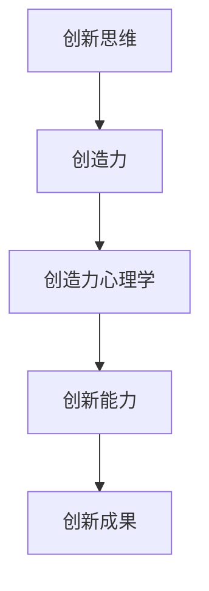

                 

### 文章标题：创新思维训练：激发团队创造力的实践方法

#### 关键词：创新思维，团队创造力，实践方法，创造力心理学，项目管理，产品设计与创新

> 摘要：本文旨在探讨创新思维训练在激发团队创造力中的关键作用。通过深入分析创新思维的基础理论、实践应用和实战案例，本文提出了一系列有效的实践方法，帮助团队提升创新能力，实现商业突破。文章将围绕创新思维的类型、核心原理、工具与方法、团队创新培养、项目管理中的应用、产品设计与创新以及商业创新战略等方面展开讨论，旨在为读者提供全面而实用的指导。

## 第一部分：创新思维的基础理论

### 第1章：创新思维概述

#### 1.1 创新思维的定义与重要性

创新思维是推动社会进步和商业成功的核心动力。它不仅是一种思维模式，也是一种能力。创新思维的定义可以概括为：在现有知识和资源的基础上，通过独特的视角和思路，发现新问题、提出新观点、创造新价值的能力。创新思维的重要性体现在以下几个方面：

1. **提升竞争力：** 在竞争激烈的市场环境中，创新能力是企业脱颖而出的关键因素。创新思维可以帮助企业不断优化产品和服务，满足客户需求，赢得市场份额。

2. **推动社会发展：** 创新思维是科技进步的重要源泉。通过创新，我们可以解决现实问题，提升生活质量，推动社会向前发展。

3. **激发个人潜能：** 创新思维不仅对企业有益，对个人发展同样重要。通过创新思维，个人可以不断挑战自我，实现自我价值。

#### 1.2 创新思维的类型

创新思维可以分为以下几种类型：

1. **发散思维：** 也称为横向思维，是一种从多个角度和层面思考问题的方法。发散思维有助于发现新的关联和可能性。

2. **收敛思维：** 也称为纵向思维，是在已知信息的基础上，逐步深入分析问题，找出最佳解决方案。

3. **逆向思维：** 是从相反的角度思考问题，颠覆传统思维模式，寻找新的解决方案。

4. **系统性思维：** 是从整体和系统的角度看待问题，考虑各个部分之间的相互作用和影响。

#### 1.3 创新思维与创造力的关系

创新思维和创造力密切相关。创新思维是创造力的一种表现形式，而创造力则是创新思维的源泉。二者之间的关系可以用以下流程图表示：

通过创新思维训练，可以提升个人的创造力，进而实现更多的创新成果。

## 第二部分：创新思维的实践应用

### 第2章：创新思维的核心原理

#### 2.1 创造力心理学

创造力心理学是研究创造力产生和发挥的心理学分支。它包括以下几个关键概念：

1. **思维定式：** 思维定式是人们长期形成的固定思维模式，限制了创新思维的发挥。打破思维定式是实现创新思维的关键。

2. **原型启发：** 原型启发是指从其他事物中获得灵感，应用于新问题的解决。

3. **思维启发：** 思维启发是指通过特定的方法和工具，激发思维活力，促进创新思维的产生。

#### 2.2 创新思维的四个阶段

创新思维可以分为以下四个阶段：

1. **准备阶段：** 准备阶段是创新思维的起点，包括问题的定义、信息的收集和储备。

2. **孕育阶段：** 孕育阶段是创新思维的酝酿阶段，新想法在头脑中逐渐形成。

3. **明朗阶段：** 明朗阶段是创新思维的突破阶段，新想法逐渐清晰，并开始形成具体的解决方案。

4. **验证阶段：** 验证阶段是对创新思维的验证和优化阶段，通过实践和反馈，不断完善创新方案。

#### 2.3 创新思维的障碍与克服策略

创新思维过程中，可能会遇到以下障碍：

1. **心理障碍：** 包括恐惧失败、缺乏自信等。

2. **环境障碍：** 包括资源有限、制度限制等。

3. **技术障碍：** 包括技术瓶颈、技术限制等。

针对这些障碍，可以采取以下策略：

1. **心理调适：** 培养积极的心态，增强自信心。

2. **环境优化：** 创造有利于创新的环境，提供必要的资源和制度支持。

3. **技术突破：** 通过技术创新，克服技术障碍。

## 第三部分：创新思维的实战案例与解析

### 第3章：创新思维的工具与方法

#### 3.1 常见的创新方法

创新思维的工具和方法多种多样，以下是几种常见的创新方法：

1. **头脑风暴：** 头脑风暴是一种集体创意活动，通过快速产生大量想法，激发创新思维。

2. **思维导图：** 思维导图是一种图形化的思维工具，可以帮助整理思路，发现关联和灵感。

3. **六顶思考帽：** 六顶思考帽是一种思考模式，通过不同颜色的帽子代表不同的思考角度，促进创新思维的多元性。

#### 3.2 如何进行头脑风暴

进行头脑风暴的步骤如下：

1. **确定主题：** 明确头脑风暴的主题和目标。

2. **准备环境：** 创造轻松、自由的环境，让参与者放松心情。

3. **自由讨论：** 鼓励参与者自由发言，不受限制地提出自己的想法。

4. **记录想法：** 记录所有提出的想法，无论是否合理。

5. **筛选优化：** 对记录的想法进行筛选和优化，找出具有潜力的创新点。

#### 3.3 如何进行思维导图制作

制作思维导图的步骤如下：

1. **确定中心主题：** 在纸或电脑上绘制一个中心圆圈，写上主题。

2. **绘制分支：** 从中心主题延伸出多个分支，每个分支代表一个主要想法或方向。

3. **添加细节：** 在每个分支下继续延伸出子分支，添加更多的细节和想法。

4. **优化美化：** 对思维导图进行美化，使用颜色、图标等元素，使其更加生动。

### 第4章：团队创新思维的培养

#### 4.1 建立创新文化

建立创新文化是激发团队创新思维的关键。以下是建立创新文化的步骤：

1. **明确愿景和价值观：** 确定团队的愿景和价值观，使团队成员明确创新的方向和目标。

2. **提供资源和支持：** 为团队成员提供必要的资源和支持，包括技术、时间和资金等。

3. **鼓励尝试和失败：** 鼓励团队成员勇于尝试，接受失败，从失败中汲取经验。

4. **建立反馈机制：** 建立有效的反馈机制，及时收集和反馈团队成员的创新成果和问题。

#### 4.2 提高团队成员的创新能力

提高团队成员的创新能力可以从以下几个方面入手：

1. **培训和教育：** 为团队成员提供创新思维和技能的培训和教育。

2. **实践和经验：** 鼓励团队成员参与创新实践，积累经验。

3. **交流和合作：** 建立良好的交流和合作机制，促进团队成员之间的知识共享和思维碰撞。

4. **激励和奖励：** 设立创新激励和奖励制度，激励团队成员积极参与创新活动。

#### 4.3 创新思维培训与实践

创新思维培训和实践是培养团队创新能力的重要手段。以下是创新思维培训和实践的步骤：

1. **培训课程设计：** 设计适合团队的创新思维培训课程，包括理论讲解、实践操作和案例分析。

2. **培训实施：** 按照培训课程进行培训，确保团队成员掌握创新思维的方法和技巧。

3. **实践操作：** 组织团队成员进行创新实践，包括头脑风暴、思维导图制作、原型设计等。

4. **反馈和改进：** 收集团队成员的反馈，对培训和实践进行改进，提高培训效果。

### 第5章：项目管理中的创新思维

#### 5.1 项目创新规划

项目创新规划是项目管理的核心环节。以下是项目创新规划的步骤：

1. **确定项目目标和范围：** 明确项目的目标和范围，为创新规划提供方向。

2. **收集需求和资源：** 收集项目相关的需求和资源，为创新提供素材。

3. **制定创新策略：** 根据需求和资源，制定项目的创新策略，包括技术路线、市场策略等。

4. **规划项目进度：** 制定项目进度计划，确保创新规划的顺利实施。

#### 5.2 项目风险管理与创新

项目风险管理与创新是确保项目成功的重要保障。以下是项目风险管理与创新的步骤：

1. **识别风险：** 识别项目可能面临的风险，包括技术风险、市场风险、资源风险等。

2. **评估风险：** 对识别出的风险进行评估，确定风险的概率和影响。

3. **制定风险管理计划：** 根据风险评估结果，制定风险管理计划，包括风险规避、风险转移、风险接受等策略。

4. **实施风险管理：** 按照风险管理计划，实施风险控制措施，确保项目顺利进行。

5. **创新应对风险：** 利用创新思维，寻找创新解决方案，降低风险影响。

#### 5.3 项目创新成果的转化

项目创新成果的转化是将创新思维应用到实际项目中的关键。以下是项目创新成果转化的步骤：

1. **评估创新成果：** 对项目创新成果进行评估，确定其价值和可行性。

2. **制定转化计划：** 根据评估结果，制定创新成果的转化计划，包括技术转移、市场推广等。

3. **实施转化计划：** 按照转化计划，实施创新成果的转化，确保创新价值的实现。

4. **反馈和改进：** 收集转化过程中的反馈，对创新成果进行改进，提高转化效果。

### 第6章：产品设计与创新

#### 6.1 产品设计思维

产品设计思维是产品创新的关键。以下是产品设计思维的步骤：

1. **用户研究：** 通过用户调研，了解用户需求和行为，为产品设计提供依据。

2. **需求分析：** 分析用户需求，确定产品功能和特点。

3. **原型设计：** 制作产品原型，进行用户测试和反馈。

4. **迭代优化：** 根据用户反馈，对产品原型进行迭代优化，提高用户体验。

#### 6.2 用户需求分析

用户需求分析是产品设计的重要环节。以下是用户需求分析的步骤：

1. **需求收集：** 通过问卷、访谈、观察等方式，收集用户需求。

2. **需求筛选：** 对收集的需求进行筛选，确定核心需求。

3. **需求优先级排序：** 根据需求的重要性和紧急性，对需求进行优先级排序。

4. **需求文档编写：** 编写需求文档，明确产品功能和需求。

#### 6.3 产品创新案例研究

以下是几个产品创新案例的研究：

1. **苹果iPhone：** 苹果iPhone的成功在于其创新的设计、用户体验和市场策略。

2. **特斯拉汽车：** 特斯拉汽车的创新在于其电动汽车技术、充电网络和智能化服务。

3. **亚马逊AWS：** 亚马逊AWS的创新在于其云计算技术、服务模式和全球布局。

### 第7章：商业创新战略

#### 7.1 商业模式的创新

商业模式的创新是商业成功的关键。以下是商业模式创新的步骤：

1. **分析现有商业模式：** 分析现有商业模式的优势和劣势，确定创新方向。

2. **寻找创新机会：** 通过市场调研、技术趋势分析等手段，寻找创新机会。

3. **设计新商业模式：** 设计新的商业模式，包括价值主张、盈利模式、合作伙伴关系等。

4. **评估和优化：** 对新商业模式进行评估和优化，确保其可行性和竞争力。

#### 7.2 市场创新策略

市场创新策略是市场竞争的关键。以下是市场创新策略的步骤：

1. **市场调研：** 通过市场调研，了解市场需求和竞争态势。

2. **定位策略：** 根据市场调研结果，确定产品定位和目标市场。

3. **差异化策略：** 通过差异化策略，使产品在市场中脱颖而出。

4. **营销策略：** 设计有效的营销策略，提高品牌知名度和市场占有率。

#### 7.3 创新战略的执行与评估

创新战略的执行与评估是确保创新成果实现的关键。以下是创新战略的执行与评估步骤：

1. **制定执行计划：** 制定详细的执行计划，明确责任人和时间表。

2. **资源配置：** 确保充足的资源支持，包括资金、人力、技术等。

3. **执行监控：** 对执行过程进行监控，确保计划按部就班地进行。

4. **评估效果：** 对创新成果进行评估，包括经济效益、社会效益等。

5. **持续改进：** 根据评估结果，对创新战略进行持续改进，提高创新效果。

### 第8章：成功创新案例分析

#### 8.1 案例一：苹果公司创新策略分析

苹果公司的成功离不开其创新策略。以下是苹果公司创新策略的分析：

1. **设计思维：** 苹果公司的设计思维以其简洁、美观、用户体验为核心。

2. **技术驱动：** 苹果公司不断推动技术创新，使其产品保持领先地位。

3. **生态系统：** 苹果公司通过构建完整的生态系统，提升用户粘性和品牌价值。

#### 8.2 案例二：谷歌创新案例研究

谷歌的成功在于其创新文化和商业模式。以下是谷歌创新案例的研究：

1. **创新文化：** 谷歌倡导“不作恶”的理念，鼓励员工自由探索和创新。

2. **商业模式创新：** 谷歌通过广告商业模式，实现了持续增长和盈利。

3. **技术创新：** 谷歌在搜索引擎、云计算等领域不断创新，保持竞争优势。

#### 8.3 案例三：特斯拉的创新之路

特斯拉的创新之路是其成功的关键。以下是特斯拉创新之路的分析：

1. **电动汽车技术：** 特斯拉通过电动汽车技术的创新，引领了新能源汽车的发展。

2. **充电网络：** 特斯拉建立了全球最大的充电网络，提升了用户体验。

3. **智能化服务：** 特斯拉通过智能化服务，提升了用户粘性和品牌价值。

### 第9章：创新思维实战演练

#### 9.1 实战演练一：创意思维训练

创意思维训练是培养创新思维的重要手段。以下是创意思维训练的步骤：

1. **确定训练目标：** 明确训练的目标和内容。

2. **准备训练材料：** 准备相关的训练材料，包括案例、工具等。

3. **进行训练：** 按照训练内容，进行创意思维训练。

4. **评估效果：** 对训练效果进行评估，总结经验教训。

#### 9.2 实战演练二：团队创新竞赛

团队创新竞赛是激发团队创新思维的有效方法。以下是团队创新竞赛的步骤：

1. **确定竞赛主题：** 明确竞赛的主题和规则。

2. **组建团队：** 组织团队，确保每个团队成员都能发挥自己的优势。

3. **进行竞赛：** 按照竞赛规则，进行创新竞赛。

4. **评选结果：** 对竞赛结果进行评选，给予奖励和激励。

#### 9.3 实战演练三：个人创新项目实践

个人创新项目实践是提升个人创新能力的重要途径。以下是个人创新项目实践的步骤：

1. **确定项目主题：** 明确项目主题和目标。

2. **准备项目资源：** 准备项目所需的资源和工具。

3. **进行项目实践：** 按照项目计划，进行项目实践。

4. **项目总结：** 对项目实践进行总结，分享经验和教训。

### 附录：创新思维训练工具与资源

#### A.1 创新思维工具介绍

创新思维工具是培养创新思维的重要手段。以下是几种常见的创新思维工具的介绍：

1. **头脑风暴：** 头脑风暴是一种集体创意活动，通过快速产生大量想法，激发创新思维。

2. **思维导图：** 思维导图是一种图形化的思维工具，可以帮助整理思路，发现关联和灵感。

3. **六顶思考帽：** 六顶思考帽是一种思考模式，通过不同颜色的帽子代表不同的思考角度，促进创新思维的多元性。

#### A.2 创新思维资源推荐

以下是几个创新思维资源的推荐：

1. **创新思维书籍：《创新者的思考方式》**

2. **创新思维网站：TED、Innosight**

3. **创新思维工具：Miro、Mural**

## 作者信息

作者：AI天才研究院/AI Genius Institute & 禅与计算机程序设计艺术 /Zen And The Art of Computer Programming

### 结语

创新思维是推动社会进步和商业成功的核心动力。通过本文的深入探讨，我们了解到创新思维的定义、类型、核心原理、工具与方法，以及其在团队、项目、产品设计和商业创新中的应用。通过实践演练和案例分析，我们可以进一步提升创新思维，激发团队创造力，实现商业突破。让我们共同拥抱创新思维，开启无限可能的新篇章。

