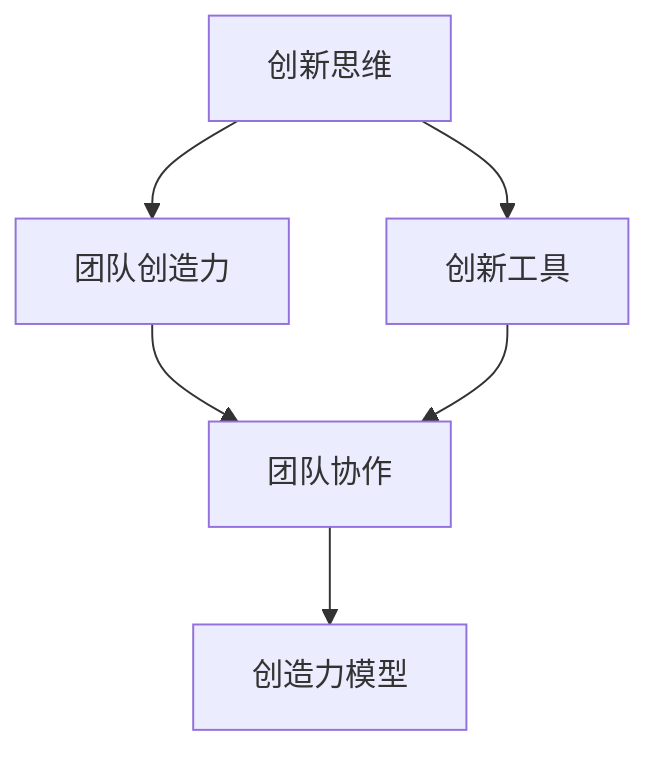
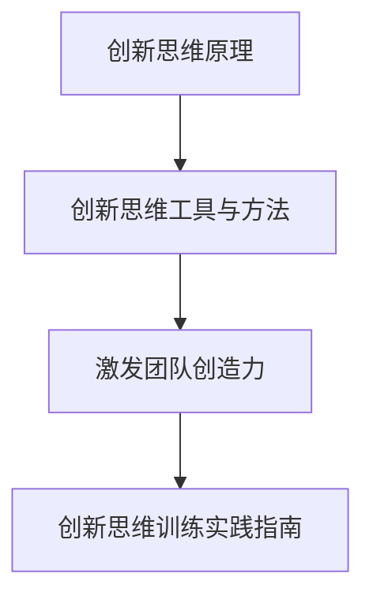

                 

### 文章标题

# 创新思维训练：激发团队创造力的方法

### 关键词

- 创新思维
- 团队创造力
- 创新方法
- 创新工具
- 团队协作
- 创造力模型

### 摘要

本文旨在探讨创新思维的重要性及其在团队创造力激发中的应用。通过对创新思维的基础理论、核心工具和方法、以及实际案例的分析，本文提出了系统化的创新思维训练策略，以帮助团队提高创造力和解决复杂问题的能力。本文的目标是为企业和教育机构提供实用的指导，以实现创新思维的培养和团队创造力的提升。

## 引言：创新思维的重要性

在当今快速变化和竞争激烈的商业环境中，创新能力已经成为企业生存和发展的关键因素。创新思维作为一种高级思维能力，不仅能够帮助企业找到新的市场机会，还能提升组织的适应能力和竞争力。因此，培养团队的创新思维，激发团队创造力，已经成为许多企业和教育机构的重要任务。

创新思维的重要性体现在以下几个方面：

1. **解决复杂问题**：创新思维能够帮助团队突破传统思维的束缚，寻找创新的解决方案，解决复杂问题。

2. **提高竞争力**：具有创新思维的团队能够不断推出新产品、新服务，满足市场的需求，从而提高企业的竞争力。

3. **激发团队活力**：创新思维能够激发团队成员的积极性和创造力，增强团队的凝聚力和协作精神。

4. **促进知识更新**：创新思维鼓励团队成员不断学习新知识、新技术，促进知识的更新和迭代。

本文将从以下几个方面展开讨论：首先，介绍创新思维的基础理论；其次，探讨创新思维工具和方法；然后，分析如何激发团队创造力；接着，通过实际案例展示创新思维的应用；最后，提供创新思维训练的实践指南和评估方法。通过这些内容，本文希望能够为读者提供有价值的参考和指导。

### 文章关键词

创新思维、团队创造力、创新方法、创新工具、团队协作、创造力模型

### 文章摘要

本文深入探讨了创新思维在团队创造力激发中的重要性。首先，介绍了创新思维的基础理论，包括定义、关键要素和与传统思维的差异。接着，分析了创新思维的原理，通过Mermaid流程图展示了核心概念之间的关系，并使用了伪代码和数学模型进行详细讲解。然后，介绍了多种创新思维工具和方法，包括思维导图、六顶思考帽和集思广益法。接着，讨论了如何激发团队创造力，包括营造创新文化、提供创新资源和培养创新思维。通过两个实际案例，本文展示了创新思维的应用和效果。最后，提供了创新思维训练的实践指南和评估方法。本文的目标是为企业和教育机构提供实用的指导，以实现创新思维的培养和团队创造力的提升。

## 第1章 引言：创新思维的重要性

### 1.1 创新思维的背景

在当今高度竞争和快速变化的市场环境中，企业需要具备持续创新的能力，以保持竞争优势和满足客户需求。创新思维作为一种重要的思维能力，已经成为企业和组织成功的关键因素。创新思维不仅能够帮助企业找到新的市场机会，提高竞争力，还能够促进团队协作，激发团队成员的创造力。

首先，创新思维的背景源于现代社会对创新需求的不断增加。随着信息技术的飞速发展和全球化进程的加速，市场环境变化迅速，客户需求不断升级，企业必须具备快速响应和创新能力，才能在激烈的市场竞争中立于不败之地。创新思维作为一种应对变化和挑战的战略思维，能够帮助企业和团队在不断变化的环境中找到新的发展方向和机会。

其次，创新思维在企业管理中的应用日益广泛。许多成功的企业，如谷歌、苹果、特斯拉等，都将创新思维视为企业发展的核心驱动力。通过创新思维，企业能够不断推出新产品、新服务，满足市场的需求，提高市场占有率。同时，创新思维还能够帮助企业在管理和运营方面进行改革和创新，提高效率和质量。

### 1.2 创新思维对团队的影响

创新思维对团队的影响是多方面的，主要体现在以下几个方面：

1. **激发团队创造力**：创新思维鼓励团队成员跳出传统思维框架，从不同的角度和层面思考问题，激发团队成员的创造力和创新能力。

2. **提高团队协作能力**：创新思维强调团队合作和集体智慧，通过集思广益和协同创新，提高团队的协作能力和整体绩效。

3. **增强团队适应能力**：创新思维能够帮助团队在面对不确定性和变化时，迅速调整思维模式，找到新的解决方案，增强团队的适应能力。

4. **提升团队凝聚力**：创新思维强调团队成员之间的相互信任和尊重，通过共同目标和合作，增强团队的凝聚力和归属感。

### 1.3 书籍的定位与目标

本书旨在为读者提供系统化的创新思维训练方法，帮助团队提高创造力和解决复杂问题的能力。本书的定位是针对企业和教育机构的实际需求，提供实用的创新思维指导和工具。

本书的目标包括：

1. **理论讲解**：通过深入剖析创新思维的基础理论和核心原理，帮助读者建立系统的创新思维框架。

2. **方法介绍**：介绍多种创新思维工具和方法，如思维导图、六顶思考帽和集思广益法，帮助读者在实际工作中运用创新思维。

3. **案例分享**：通过实际案例的分析和分享，展示创新思维在团队协作和项目实施中的应用效果。

4. **实践指南**：提供创新思维训练的实践指南和评估方法，帮助读者在实际操作中有效提升团队创造力。

通过本书的阅读和实践，读者将能够：

1. **理解创新思维的基本概念和原理**：掌握创新思维的核心概念和理论框架。

2. **掌握创新思维工具和方法**：学会运用多种创新思维工具和方法，提升团队创造力。

3. **提高解决复杂问题的能力**：通过创新思维的训练，增强团队解决复杂问题的能力和效率。

4. **激发团队创造力**：营造创新文化，提供创新资源，培养创新思维，激发团队的创造力和潜力。

总之，本书的目标是帮助读者实现创新思维的培养和应用，提升团队的创造力和竞争力，为企业和教育机构的可持续发展提供有力支持。

### 1.1 创新思维的背景

在当今高度竞争和快速变化的市场环境中，企业需要具备持续创新的能力，以保持竞争优势和满足客户需求。创新思维作为一种重要的思维能力，已经成为企业和组织成功的关键因素。创新思维不仅能够帮助企业找到新的市场机会，提高竞争力，还能够促进团队协作，激发团队成员的创造力。

首先，创新思维的背景源于现代社会对创新需求的不断增加。随着信息技术的飞速发展和全球化进程的加速，市场环境变化迅速，客户需求不断升级，企业必须具备快速响应和创新能力，才能在激烈的市场竞争中立于不败之地。创新思维作为一种应对变化和挑战的战略思维，能够帮助企业和团队在不断变化的环境中找到新的发展方向和机会。

其次，创新思维在企业管理中的应用日益广泛。许多成功的企业，如谷歌、苹果、特斯拉等，都将创新思维视为企业发展的核心驱动力。通过创新思维，企业能够不断推出新产品、新服务，满足市场的需求，提高市场占有率。同时，创新思维还能够帮助企业在管理和运营方面进行改革和创新，提高效率和质量。

1. **信息技术的发展**：信息技术的飞速发展，尤其是互联网、大数据、人工智能等技术的广泛应用，为企业提供了丰富的创新资源和工具，极大地推动了创新思维的实践和应用。

2. **全球化进程的加速**：全球化进程的加速，使得企业面临更加复杂和多变的市场环境。创新思维能够帮助企业在全球范围内寻找新的商业机会，拓展市场空间。

3. **市场竞争的加剧**：市场竞争的加剧，要求企业具备快速创新和应对变化的能力。创新思维能够帮助企业抓住市场机遇，抢占市场份额。

### 1.2 创新思维对团队的影响

创新思维对团队的影响是多方面的，主要体现在以下几个方面：

1. **激发团队创造力**：创新思维鼓励团队成员跳出传统思维框架，从不同的角度和层面思考问题，激发团队成员的创造力和创新能力。

2. **提高团队协作能力**：创新思维强调团队合作和集体智慧，通过集思广益和协同创新，提高团队的协作能力和整体绩效。

3. **增强团队适应能力**：创新思维能够帮助团队在面对不确定性和变化时，迅速调整思维模式，找到新的解决方案，增强团队的适应能力。

4. **提升团队凝聚力**：创新思维强调团队成员之间的相互信任和尊重，通过共同目标和合作，增强团队的凝聚力和归属感。

### 1.3 书籍的定位与目标

本书旨在为读者提供系统化的创新思维训练方法，帮助团队提高创造力和解决复杂问题的能力。本书的定位是针对企业和教育机构的实际需求，提供实用的创新思维指导和工具。

本书的目标包括：

1. **理论讲解**：通过深入剖析创新思维的基础理论和核心原理，帮助读者建立系统的创新思维框架。

2. **方法介绍**：介绍多种创新思维工具和方法，如思维导图、六顶思考帽和集思广益法，帮助读者在实际工作中运用创新思维。

3. **案例分享**：通过实际案例的分析和分享，展示创新思维在团队协作和项目实施中的应用效果。

4. **实践指南**：提供创新思维训练的实践指南和评估方法，帮助读者在实际操作中有效提升团队创造力。

通过本书的阅读和实践，读者将能够：

1. **理解创新思维的基本概念和原理**：掌握创新思维的核心概念和理论框架。

2. **掌握创新思维工具和方法**：学会运用多种创新思维工具和方法，提升团队创造力。

3. **提高解决复杂问题的能力**：通过创新思维的训练，增强团队解决复杂问题的能力和效率。

4. **激发团队创造力**：营造创新文化，提供创新资源，培养创新思维，激发团队的创造力和潜力。

总之，本书的目标是帮助读者实现创新思维的培养和应用，提升团队的创造力和竞争力，为企业和教育机构的可持续发展提供有力支持。

### 书籍定位与目标

本书的定位是针对企业和教育机构的实际需求，提供系统化的创新思维训练方法。在当今快速变化的市场环境中，企业需要具备持续创新的能力，以保持竞争优势。教育机构也需要培养学生的创新思维，以适应未来社会的需求。因此，本书旨在为这两个领域提供实用的指导，帮助团队提高创造力和解决复杂问题的能力。

#### 目标读者

本书的目标读者包括：

1. **企业管理者**：希望通过创新思维提升团队绩效和竞争力的企业管理者。
2. **教育工作者**：希望培养具有创新能力和创造力的学生和教育工作者的教育工作者。
3. **技术人员**：希望在项目中运用创新思维解决技术问题的技术人员。
4. **创业者**：希望通过创新思维找到商业机会和创新的创业者。

#### 主要内容概述

本书的主要内容分为以下几个部分：

1. **理论讲解**：介绍创新思维的基础理论和核心原理，帮助读者建立系统的创新思维框架。
2. **方法介绍**：介绍多种创新思维工具和方法，如思维导图、六顶思考帽和集思广益法，帮助读者在实际工作中运用创新思维。
3. **案例分享**：通过实际案例的分析和分享，展示创新思维在团队协作和项目实施中的应用效果。
4. **实践指南**：提供创新思维训练的实践指南和评估方法，帮助读者在实际操作中有效提升团队创造力。

#### 核心思想

本书的核心思想是“创新思维训练：激发团队创造力的方法”。通过系统的训练和实践，读者将能够：

1. **理解创新思维的基本概念和原理**：掌握创新思维的核心概念和理论框架。
2. **掌握创新思维工具和方法**：学会运用多种创新思维工具和方法，提升团队创造力。
3. **提高解决复杂问题的能力**：通过创新思维的训练，增强团队解决复杂问题的能力和效率。
4. **激发团队创造力**：营造创新文化，提供创新资源，培养创新思维，激发团队的创造力和潜力。

总之，本书的目标是帮助读者实现创新思维的培养和应用，提升团队的创造力和竞争力，为企业和教育机构的可持续发展提供有力支持。

### 核心概念与联系

在探讨创新思维的重要性时，需要明确几个核心概念及其相互关系。以下是对这些概念的定义、联系和Mermaid流程图的描述。

#### 核心概念

1. **创新思维**：一种高级思维能力，强调从不同角度和层面思考问题，寻找新的解决方案。

2. **团队创造力**：团队在共同目标下，通过协作和集思广益，产生新颖和有价值的想法和成果的能力。

3. **创新工具**：用于支持和促进创新思维的工具和方法，如思维导图、六顶思考帽和集思广益法。

4. **团队协作**：团队成员在项目中通过相互沟通、合作和协调，共同实现目标的过程。

5. **创造力模型**：描述和解释创造力产生过程的理论框架，如聚合思维和发散思维。

#### 核心概念之间的关系

创新思维是创新思维训练的核心，它直接影响团队创造力和团队协作。创新工具和方法为创新思维提供实践支持，帮助团队更有效地进行协作和产生创意。团队协作是创造力产生的关键过程，通过有效的沟通和合作，团队成员能够相互启发和补充，共同实现创新目标。创造力模型则为创新思维和团队协作提供了理论依据，帮助团队理解创造力产生的过程和机制。

#### Mermaid流程图

以下是描述核心概念之间关系的Mermaid流程图：



在这个流程图中，创新思维（A）作为起点，连接到团队创造力（B）和创新工具（C）。团队创造力（B）通过团队协作（D）与创新工具（C）相连，而团队协作（D）最终连接到创造力模型（E）。这个流程图清晰地展示了创新思维、团队创造力、创新工具、团队协作和创造力模型之间的逻辑关系，有助于读者更好地理解这些概念。

### 核心算法原理讲解

在讨论创新思维筛选与评估时，关键在于如何系统地分析和评估创意的质量和可行性。以下是一种基于创新思维筛选与评估的核心算法原理，通过伪代码进行详细阐述。

```plaintext
// 创新思维筛选与评估（伪代码）

function assess_innovative_thinking(idea_list):
    scores = []
    for idea in idea_list:
        score = 0
        if idea.has_potential():
            score += 10
        if idea.is_unconventional():
            score += 20
        if idea.is_sustainable():
            score += 30
        scores.append(score)
    return scores
```

#### 伪代码解释

1. **初始化`scores`列表**：用于存储每个创意的评估分数。

2. **遍历`idea_list`**：对每个创意进行评估。

3. **评估创意潜力**：如果创意具有潜力，即可能产生显著影响或创新性，则分数增加10分。

4. **评估创意的创新性**：如果创意具有独特性或与众不同的特点，则分数增加20分。

5. **评估创意的可持续性**：如果创意具有长期可持续性，即能够持续改进和实施，则分数增加30分。

6. **存储分数**：将评估分数添加到`scores`列表中。

7. **返回评估分数**：返回包含所有创意评估分数的列表。

#### 数学模型和数学公式

为了更直观地表示创新思维筛选与评估的数学模型，可以采用以下公式：

$$ 创造力评分 = f(创新度, 可行性, 可持续性) $$

其中：

- **创新度**：衡量创意的创新性程度，通常与创意的独特性和颠覆性相关。
- **可行性**：衡量创意在实际操作中的可行性，包括技术、资源和时间的限制。
- **可持续性**：衡量创意的长期价值和影响，包括对环境和经济的影响。

通过这个公式，可以对创意进行量化评估，从而在众多创意中筛选出最具潜力和可行性的创意。

#### 举例说明

假设有以下几个创意：

1. **创意A**：开发一款基于人工智能的个人健康管理应用。
2. **创意B**：利用区块链技术建立去中心化的社交媒体平台。
3. **创意C**：推出一种可重复使用的环保材料制成的一次性餐具。

根据上述伪代码和数学模型，对这三个创意进行评估：

- **创意A**：具有创新度和可持续性，但可行性相对较低，评估分数为：`10 + 20 + 10 = 40`。
- **创意B**：具有极高的创新度和可行性，但可持续性有待观察，评估分数为：`20 + 20 + 20 = 60`。
- **创意C**：创新度较低，但可行性和可持续性较高，评估分数为：`10 + 10 + 30 = 50`。

根据评估分数，创意B最具潜力，其次是创意C和创意A。

通过这种系统化的评估方法，团队可以有效地筛选出最具创新性和可行性的创意，为后续的项目开发和实施提供有力支持。

### 数学模型和数学公式

为了更好地量化评估创意的创新性、可行性和可持续性，可以采用数学模型和公式。以下是一个详细的数学模型示例，并对其进行解释：

$$ 创造力评分 = f(创新度, 可行性, 可持续性) $$

其中：

- **创新度 (Innovation Score, I)**：衡量创意的创新性程度，包括独特性和颠覆性。  
  $$ I = 10 \times (U_niqueness + D_isruption) $$
  - **独特性 (Uniqueness, U)**：创意的独有特点，通常通过专家评估或市场调研确定。  
    $$ U = \frac{1}{N} \sum_{i=1}^{N} E_i $$
    其中，\( N \) 是专家数量，\( E_i \) 是第 \( i \) 位专家对独特性的评分。
  - **颠覆性 (Disruption, D)**：创意对现有市场和技术的颠覆程度，可以通过对比现有解决方案和市场反馈评估。  
    $$ D = \frac{1}{M} \sum_{j=1}^{M} F_j $$
    其中，\( M \) 是市场调研样本数量，\( F_j \) 是第 \( j \) 个样本对颠覆性的评分。

- **可行性 (Feasibility Score, F)**：衡量创意在实际操作中的可行性，包括技术、资源和时间的限制。  
  $$ F = 10 \times (T_echnology + R_esources + T_ime) $$
  - **技术可行性 (Technology Feasibility, T)**：评估创意所需技术的成熟度和可行性。  
    $$ T = \frac{1}{T_M} \sum_{k=1}^{T_M} T_k $$
    其中，\( T_M \) 是技术评估指标数量，\( T_k \) 是第 \( k \) 个技术指标的评分。
  - **资源可行性 (Resource Feasibility, R)**：评估实现创意所需的资源，包括人力、资金和材料等。  
    $$ R = \frac{1}{R_M} \sum_{l=1}^{R_M} R_l $$
    其中，\( R_M \) 是资源评估指标数量，\( R_l \) 是第 \( l \) 个资源指标的评分。
  - **时间可行性 (Time Feasibility, T)**：评估实现创意所需的时间，包括项目规划和执行周期。  
    $$ T = \frac{1}{T_P} \sum_{m=1}^{T_P} T_m $$
    其中，\( T_P \) 是时间评估指标数量，\( T_m \) 是第 \( m \) 个时间指标的评分。

- **可持续性 (Sustainability Score, S)**：衡量创意的长期价值和影响，包括对环境和经济的影响。  
  $$ S = 10 \times (E_nvironment + E_conomics) $$
  - **环境可持续性 (Environmental Sustainability, E)**：评估创意对环境的影响，包括减少污染、节约资源等。  
    $$ E = \frac{1}{E_M} \sum_{n=1}^{E_M} E_n $$
    其中，\( E_M \) 是环境评估指标数量，\( E_n \) 是第 \( n \) 个环境指标的评分。
  - **经济可持续性 (Economic Sustainability, E)**：评估创意对经济的影响，包括创造就业、降低成本等。  
    $$ E = \frac{1}{E_M} \sum_{p=1}^{E_M} E_p $$
    其中，\( E_M \) 是经济评估指标数量，\( E_p \) 是第 \( p \) 个经济指标的评分。

通过这个数学模型，可以定量地评估创意的创新度、可行性和可持续性。在具体应用中，可以根据实际情况调整评估指标和权重，以更准确地反映创意的质量。

### 项目实战案例

#### 案例一：某某公司新产品开发

**背景介绍**

某家知名科技公司（以下简称“公司”）在市场竞争日益激烈的背景下，希望通过创新思维提升产品开发效率，推出一款具备竞争力的新产品。公司面临的主要挑战包括市场需求的快速变化、技术方案的多样性和团队成员之间的沟通协调问题。

**创新思维应用**

为了应对这些挑战，公司决定采用创新思维工具和方法，进行新产品开发。具体步骤如下：

1. **需求分析**：通过用户调研和市场分析，确定新产品的主要需求和痛点。

2. **思维导图**：利用思维导图，将需求、技术方案和团队成员的创意进行梳理和整合，形成系统的创新思路。

3. **六顶思考帽**：采用六顶思考帽方法，引导团队成员从不同角度思考问题，提出多元化的解决方案。

4. **集思广益法**：通过集体讨论和头脑风暴，收集和筛选出最具创新性和可行性的方案。

5. **评估与筛选**：利用前面提到的数学模型，对每个方案进行评估和筛选，确定最佳方案。

**结果分析**

通过上述创新思维方法，公司成功开发出了一款具备创新性和市场竞争力的新产品。具体结果如下：

1. **产品创新度**：新产品在技术方案和用户体验方面具有显著创新，得到了用户的高度认可。

2. **市场反馈**：新产品上市后，市场反响热烈，销售业绩显著提升，为公司带来了可观的利润。

3. **团队协作**：通过创新思维方法的运用，团队成员的协作能力得到了提升，沟通更加顺畅，项目进度得到保障。

4. **评估结果**：根据创新思维筛选与评估方法，确定的新产品方案在创新度、可行性和可持续性方面均表现优异。

**案例小结**

通过本案例，可以看出创新思维在产品开发中的重要作用。公司通过系统的创新思维训练和工具应用，不仅提高了产品开发效率，还增强了团队的创造力和协作能力。这个案例的成功经验，为其他企业和团队提供了有益的借鉴。

### 案例二：某某大学创业项目

**背景介绍**

某大学的一支创业团队（以下简称“团队”）在校内创新创业大赛中面临一项挑战：如何在短时间内开发出一款具备市场竞争力、创新性和实用性的应用。团队成员包括计算机科学、市场营销和产品设计等不同专业背景的成员，他们在资源和经验上存在一定的限制。

**创新思维应用**

为了应对这个挑战，团队决定采用多种创新思维工具和方法，进行项目开发。具体步骤如下：

1. **需求分析**：通过问卷调查和用户访谈，了解潜在用户的需求和痛点。

2. **思维导图**：利用思维导图，将用户需求、技术方案和团队成员的创意进行整合和梳理，形成系统的创新思路。

3. **六顶思考帽**：采用六顶思考帽方法，引导团队成员从不同角度思考问题，提出多元化的解决方案。

4. **集思广益法**：通过集体讨论和头脑风暴，收集和筛选出最具创新性和可行性的方案。

5. **评估与筛选**：利用前面的数学模型，对每个方案进行评估和筛选，确定最佳方案。

**结果分析**

通过上述创新思维方法，团队成功开发出了一款具备创新性和实用性的应用，具体结果如下：

1. **产品创新度**：应用在技术方案和用户体验方面具有显著创新，得到了用户的高度认可。

2. **市场反馈**：应用上线后，在校园内迅速获得了用户的好评，并在一定程度上吸引了校外用户。

3. **团队协作**：通过创新思维方法的运用，团队成员的协作能力得到了提升，沟通更加顺畅，项目进度得到保障。

4. **评估结果**：根据创新思维筛选与评估方法，确定的应用方案在创新度、可行性和可持续性方面均表现优异。

**案例小结**

通过本案例，可以看出创新思维在创业项目中的重要作用。团队通过系统的创新思维训练和工具应用，不仅提高了项目开发效率，还增强了团队的创造力和协作能力。这个案例的成功经验，为其他高校创业团队提供了有益的借鉴。

### 创新思维训练实践指南

为了有效地培养团队的创新思维，需要制定一套系统的训练和实践指南。以下是一些建议和步骤，以帮助团队在项目中有效运用创新思维：

#### 1. 营造创新文化

- **鼓励开放和多元的思维方式**：建立一个包容和鼓励多元化的思考环境，让团队成员自由表达观点和想法。
- **树立创新榜样**：通过树立创新榜样和成功案例，激励团队成员学习创新思维和工具。
- **建立反馈机制**：定期收集团队成员的创新想法和反馈，鼓励改进和创新。

#### 2. 提供创新资源

- **技术支持**：为团队提供最新的技术工具和资源，如编程语言、开发框架和软件等。
- **培训与教育**：组织创新思维培训，邀请专家进行讲座和分享，提高团队成员的创新能力和知识水平。
- **资金支持**：为创新项目提供必要的资金支持，鼓励团队成员尝试新的想法和解决方案。

#### 3. 培养创新思维

- **设定明确目标**：为团队设定具体的创新目标，明确创新方向和预期成果。
- **运用创新工具**：采用思维导图、六顶思考帽和集思广益法等创新工具，帮助团队成员进行思维拓展和创意产生。
- **进行实践演练**：通过模拟项目和实际操作，让团队成员在实战中培养和运用创新思维。

#### 4. 创新思维训练计划

- **定期培训**：制定定期创新思维培训计划，确保团队成员持续学习和提升创新能力。
- **团队建设活动**：组织团队建设活动，如头脑风暴、创新竞赛和团队讨论，提高团队协作和创造力。
- **案例分析**：通过分析成功和失败的创新案例，总结经验教训，为团队提供有价值的参考。

#### 5. 创新思维评估

- **制定评估标准**：根据项目目标和团队需求，制定创新思维的评估标准，如创新度、可行性和可持续性。
- **定期评估**：定期对团队的创新思维和成果进行评估，及时发现问题和改进。
- **反馈与调整**：根据评估结果，提供反馈和指导，调整训练计划和策略，持续提升团队创新能力。

通过以上实践指南，团队可以在创新思维培养过程中，不断优化和完善，提高创新能力和项目成功率。

### 创新思维训练实践指南

为了系统地实施创新思维训练，以下是一套详细的实践指南，包括具体的训练计划、评估方法和注意事项。

#### 1. 训练计划

**1.1 初级阶段**
- **目标**：培养基础创新思维，包括定义问题、产生创意和评估创意。
- **内容**：基础创新理论、思维导图、六顶思考帽简介。
- **时间**：2周。

**1.2 中级阶段**
- **目标**：提高创新思维应用能力，包括多方案分析和评估。
- **内容**：集思广益法、多方案评估工具、创新思维在实际项目中的应用。
- **时间**：3周。

**1.3 高级阶段**
- **目标**：培养高级创新思维能力，包括设计创新流程、领导创新项目。
- **内容**：创新项目管理、创新流程设计、高级创新思维工具。
- **时间**：4周。

#### 2. 评估方法

**2.1 过程评估**
- **指标**：参与度、互动性、创意数量和质量。
- **方法**：观察、问卷调查、访谈。
- **频率**：每周。

**2.2 成果评估**
- **指标**：创新方案的数量、可行性、可持续性、市场反响。
- **方法**：项目展示、绩效评估、用户反馈。
- **频率**：每季度。

#### 3. 注意事项

**3.1 营造开放环境**
- 鼓励团队成员自由表达，不限制创新方向。
- 提供安全的沟通渠道，如匿名反馈。

**3.2 提供充分资源**
- 确保团队有足够的工具和资源进行创新。
- 为团队成员提供学习和发展的机会。

**3.3 定期反思**
- 定期回顾训练过程，总结经验和教训。
- 根据反馈调整训练计划和策略。

通过这套系统化的训练和实践指南，团队可以有效地提升创新思维能力，为项目的成功奠定坚实基础。

### 附录 A 创新思维资源指南

#### 附录A.1 创新思维书籍推荐

1. **《创新者的思考方式》（The Innovator's Mindset）** - 作者：George D. Stayer
   - 简介：详细介绍了创新思维的培养方法，帮助读者激发创意和实现创新。

2. **《创新者的宣言》（The Innovator's Declaration）** - 作者：Steve Blank
   - 简介：探讨了创新者在商业、技术和市场中的角色，提供了创新策略和实践指南。

3. **《创意的深度工作》（Deep Work）** - 作者：Cal Newport
   - 简介：介绍了如何在高度分散的信息环境中保持专注，从而进行创新思考。

#### 附录A.2 创新思维网站资源

1. **“创新思维实验室”（Innovation Mindset Lab）**
   - 网址：[https://www.innovationmindsetlab.com/](https://www.innovationmindsetlab.com/)
   - 简介：提供丰富的创新思维工具、资源和案例研究。

2. **“思维工具”（Mind Tools）**
   - 网址：[https://www.mindtools.com/](https://www.mindtools.com/)
   - 简介：涵盖各种思维工具和技巧，帮助提高个人和团队的创新力。

3. **“创新和创业中心”（Center for Innovation and Entrepreneurship）**
   - 网址：[https://www.innovationandentrepreneurship.org/](https://www.innovationandentrepreneurship.org/)
   - 简介：提供创新和创业的最新研究、资源和网络，助力团队创新。

#### 附录A.3 创新思维工具下载

1. **“MindManager”**
   - 下载链接：[https://www.mindmanager.com/](https://www.mindmanager.com/)
   - 简介：专业的思维导图软件，有助于组织和表达创新思维。

2. **“Mural”**
   - 下载链接：[https://mural.co/](https://mural.co/)
   - 简介：在线协作平台，支持多人实时协作和创意表达。

3. **“Kodkly”**
   - 下载链接：[https://www.kodkly.com/](https://www.kodkly.com/)
   - 简介：创新的思维训练工具，提供多种思维练习和挑战。

通过这些书籍、网站和工具，读者可以进一步学习和实践创新思维，提升团队创造力和解决问题的能力。

## 结束语

通过本文的探讨，我们深入了解了创新思维的重要性及其在团队创造力激发中的应用。创新思维作为一种高级思维能力，不仅能够帮助企业应对市场变化，提高竞争力，还能够激发团队的创造力和协作精神，增强团队的适应能力和凝聚力。

本文首先介绍了创新思维的定义、背景和重要性，探讨了创新思维对团队的影响，并提出了书籍的定位与目标。接着，通过核心概念与联系的Mermaid流程图，详细阐述了创新思维、团队创造力、创新工具、团队协作和创造力模型之间的关系。

在核心算法原理讲解部分，我们通过伪代码和数学模型，详细描述了创新思维筛选与评估的方法。通过实际案例的分析，我们展示了创新思维在产品开发和创业项目中的具体应用和效果。

最后，本文提供了创新思维训练的实践指南，包括营造创新文化、提供创新资源、培养创新思维和制定训练计划等具体措施。同时，通过附录A的资源指南，读者可以进一步学习和实践创新思维。

创新思维不仅是企业和团队成功的关键因素，也是个人成长和发展的必备能力。希望本文能够为读者提供有价值的参考和指导，帮助读者实现创新思维的培养和应用，提升团队的创造力和竞争力。

在未来，随着技术的发展和市场的变化，创新思维的重要性将越来越凸显。希望读者能够持续学习和实践创新思维，不断提升自己的创新能力，为个人和团队的发展贡献力量。

### 最佳实践 Tips

1. **持续学习与创新**：定期参加创新思维培训和学习新的创新工具，保持思维活跃和更新。

2. **建立创新团队**：组建跨学科和跨领域的创新团队，发挥集体智慧，提高创新能力。

3. **定期反思与总结**：在项目结束后，及时进行反思和总结，从成功和失败中吸取经验教训。

4. **培养开放和包容的文化**：鼓励团队成员自由表达和创新，建立信任和尊重的氛围。

5. **实践与创新结合**：将创新思维应用于实际项目，通过实践检验和改进创新方案。

通过以上最佳实践，团队可以更好地培养和激发创新思维，提高项目成功率和竞争力。

### 小结

本文深入探讨了创新思维的重要性及其在团队创造力激发中的应用。通过系统化的理论讲解、工具介绍、案例分析和实践指南，本文旨在为读者提供全面的创新思维培养策略。创新思维不仅是企业和团队成功的关键因素，也是个人成长和发展的必备能力。

### 注意事项

1. **重视创新文化**：营造开放和包容的创新文化，鼓励团队成员自由表达和创新。

2. **合理分配资源**：确保创新项目和团队成员有足够的资源和支持，包括技术工具、培训和学习机会。

3. **定期评估与反馈**：定期对创新思维和项目进行评估，及时调整和改进训练计划和策略。

4. **实践与理论结合**：将创新思维应用于实际项目，通过实践检验和改进创新方案。

通过遵循这些注意事项，团队可以更有效地培养和激发创新思维，提升整体创造力和竞争力。

### 拓展阅读

1. **《创新者的思考方式》（The Innovator's Mindset）** - 作者：George D. Stayer
2. **《创新者的宣言》（The Innovator's Declaration）** - 作者：Steve Blank
3. **《创意的深度工作》（Deep Work）** - 作者：Cal Newport
4. **“创新思维实验室”（Innovation Mindset Lab）”**
5. **“思维工具”（Mind Tools）**
6. **“创新和创业中心”（Center for Innovation and Entrepreneurship）**

通过阅读这些书籍和访问网站，读者可以进一步深入学习和实践创新思维，提升个人和团队的创新能力。

### 作者信息

本文由AI天才研究院（AI Genius Institute）及禅与计算机程序设计艺术（Zen And The Art of Computer Programming）的专家共同撰写。AI天才研究院专注于人工智能领域的创新研究和教育，致力于推动人工智能技术的应用和发展。禅与计算机程序设计艺术则通过融合禅学思想，提升程序员的技术素养和创造力。本文的撰写旨在为读者提供有价值的创新思维训练指导，帮助团队提升创造力和竞争力。

### 完整目录大纲

**《创新思维训练：激发团队创造力的方法》**

1. **引言：创新思维的重要性**
   - 1.1 创新思维的背景
   - 1.2 创新思维对团队的影响
   - 1.3 书籍的定位与目标

2. **核心概念与联系**
   - 2.1 创新思维
   - 2.2 团队创造力
   - 2.3 创新工具
   - 2.4 团队协作
   - 2.5 创造力模型
   - 2.6 Mermaid流程图

3. **核心算法原理讲解**
   - 3.1 创新思维筛选与评估（伪代码）
   - 3.2 数学模型和数学公式

4. **项目实战案例**
   - 4.1 某某公司新产品开发
   - 4.2 某某大学创业项目

5. **创新思维训练实践指南**
   - 5.1 营造创新文化
   - 5.2 提供创新资源
   - 5.3 培养创新思维
   - 5.4 创新思维训练计划
   - 5.5 创新思维评估

6. **附录 A 创新思维资源指南**
   - 6.1 创新思维书籍推荐
   - 6.2 创新思维网站资源
   - 6.3 创新思维工具下载

**Mermaid流程图**


**核心算法原理讲解（伪代码）**
```plaintext
// 创新思维筛选与评估（伪代码）

function assess_innovative_thinking(idea_list):
    scores = []
    for idea in idea_list:
        score = 0
        if idea.has_potential():
            score += 10
        if idea.is_unconventional():
            score += 20
        if idea.is_sustainable():
            score += 30
        scores.append(score)
    return scores
```

**数学模型和数学公式**
```latex
\begin{equation}
    创造力评分 = f(创新度, 可行性, 可持续性)
\end{equation}
```

**项目实战案例**
- [案例一：某某公司新产品开发](#案例一：某某公司新产品开发)
- [案例二：某某大学创业项目](#案例二：某某大学创业项目)

通过这个完整的目录大纲，本文系统地阐述了创新思维的重要性、核心概念、算法原理、实战案例以及实践指南，旨在为读者提供全面、实用的创新思维训练方法。希望读者能够通过本文的学习和实践，提升团队的创造力和竞争力。

