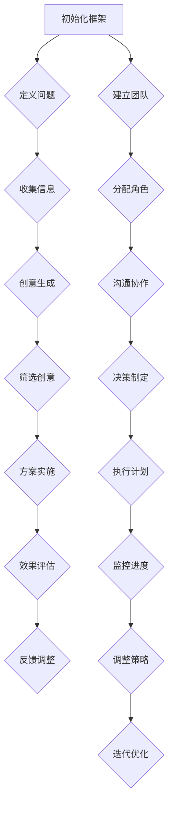

                 

### 《创新思维：引领团队突破瓶颈的关键》文章概述

在当今快速变化的技术时代，创新思维已成为推动企业发展和团队突破瓶颈的核心动力。本文旨在深入探讨创新思维在团队中的应用与价值，为读者提供一套系统化的创新思维框架与方法。通过逻辑清晰、结构紧凑的内容，本文将帮助读者理解创新思维的重要性，掌握其培养与运用的策略，并借鉴实战案例，为团队创新提供切实可行的实践指导。

文章的核心关键词包括：创新思维、团队、突破瓶颈、框架、方法、培养、运用、实战案例。这些关键词不仅体现了文章的核心内容，也反映了创新思维在团队管理和项目执行中的广泛应用。

摘要部分将简要介绍创新思维的定义和特征，阐述其在团队中的价值与影响，并概述文章的结构与主要内容。通过这一部分，读者可以快速了解文章的焦点和结构布局，为深入阅读打下基础。

### 创新思维的重要性

创新思维作为一种独特的思考方式，它不仅能够激发个人的创造力，更是推动团队进步和突破瓶颈的关键因素。首先，创新思维的定义和特征为我们提供了对其本质的理解。创新思维是指在传统思维模式之外，通过全新的视角和方法，发现和创造新的价值、解决方案或产品。其特征主要包括：开放性、灵活性、多样性、前瞻性和系统性。这些特征使得创新思维在应对复杂问题和挑战时，具有独特的优势。

在团队中，创新思维的价值与影响不可小觑。首先，创新思维能够提升团队的整体创造力，使得团队成员在遇到问题时，能够从多个角度进行思考，提出更多具有创新性的解决方案。例如，在项目开发过程中，通过创新思维的引导，团队成员可以突破现有的技术限制，找到更加高效和优化的解决方案。

其次，创新思维能够增强团队的凝聚力。当团队成员共同参与创新过程时，他们不仅能够增进彼此的了解和信任，还能形成良好的沟通和协作氛围。这种氛围有助于激发团队的潜力，推动团队朝着共同的目标迈进。例如，在一个跨部门的项目中，不同背景和技能的团队成员通过创新思维的碰撞，能够产生意想不到的创意和成果。

此外，创新思维对团队业绩的提升有着直接的影响。通过创新思维的应用，团队可以在产品设计和开发中引入新的功能和特性，从而满足市场和用户的需求。同时，创新思维还能够帮助企业应对市场竞争，抓住新的商业机会。例如，在互联网行业，创新思维的应用使得许多企业能够迅速适应市场变化，推出具有竞争优势的产品，从而赢得市场份额。

总的来说，创新思维在团队中的应用具有多方面的价值和影响。它不仅能够提升团队的整体创造力，增强团队凝聚力，还能够直接促进团队业绩的提升。因此，培养和运用创新思维，是团队发展和突破瓶颈的重要途径。

### 创新思维的框架与方法

创新思维的框架与方法是引导团队突破瓶颈、实现创新的关键。为了系统化地理解和应用创新思维，我们需要构建一个清晰的基本框架，并掌握一系列有效的创新思维技术。以下是创新思维的基本框架和方法：

#### 创新思维的基本框架

创新思维的基本框架通常包括以下几个关键部分：

1. **问题定义**：明确问题的核心和关键点，是创新思维的第一步。通过深入理解问题的本质，我们可以更好地确定创新的方向和目标。
   
2. **信息收集**：在明确问题后，收集与问题相关的信息和数据。这些信息可以为后续的创新过程提供重要的参考和依据。

3. **创意生成**：在收集到足够的信息后，通过头脑风暴、思维导图等方法，激发创意和灵感。这一步骤是创新思维的核心，旨在产生尽可能多的创新想法。

4. **创意筛选**：对生成的创意进行筛选，保留那些具有可行性和潜在价值的创意。筛选过程需要结合实际情况和团队目标，确保创意的实用性和可操作性。

5. **方案实施**：将筛选出的创意转化为具体的实施方案，并通过实验、测试等方式，验证其效果。实施过程中，团队需要密切合作，确保方案的顺利推进。

6. **效果评估**：在方案实施后，对创新效果进行评估和反馈。通过评估，团队可以了解创新的具体成果，发现潜在的问题和改进空间，为下一次创新奠定基础。

#### 创新思维的方法与技术

为了有效运用创新思维，我们需要掌握一系列创新思维的方法和技术。以下是几种常见的方法：

1. **头脑风暴**：头脑风暴是一种集体创意激发的方法，通过迅速产生大量想法，激发团队成员的创新潜力。在头脑风暴过程中，鼓励参与者自由发言，不限制想法的质量和数量。

2. **思维导图**：思维导图是一种以图形化的方式组织和展示思维过程的工具。通过将问题、创意和解决方案以图表的形式呈现，思维导图有助于清晰地梳理思路，发现潜在的联系和关系。

3. **设计思考**：设计思考是一种以用户为中心的创新方法，强调在创意生成和方案实施过程中，始终关注用户的需求和体验。通过用户研究、原型设计和迭代测试，设计思考能够确保创新方案更加符合用户实际需求。

4. **SWOT分析**：SWOT分析是一种用于评估创意或方案优劣势的方法，通过对创新机会（Strengths）、威胁（Weaknesses）、优势（Opportunities）和劣势（Threats）的全面分析，帮助团队识别创新的潜在风险和机会。

5. **六顶思考帽**：六顶思考帽是一种用于引导多角度思考的方法，通过使用不同的思考模式（如白色思考帽表示客观事实，红色思考帽表示情感和直觉），六顶思考帽有助于团队成员从多个角度探讨问题，促进创新思维的多元化。

#### 创新思维在团队中的实践

在实际应用中，创新思维的框架和方法需要通过具体的实践过程来实现。以下是一个简单的实践步骤：

1. **问题识别**：首先，团队需要明确当前面临的问题或挑战，并将其转化为可操作的任务。
   
2. **信息收集**：团队需要收集与任务相关的信息，包括市场数据、用户反馈、技术资料等。

3. **头脑风暴**：团队成员围绕任务进行头脑风暴，自由提出各种可能的解决方案。

4. **思维导图**：将头脑风暴的成果以思维导图的形式呈现，明确各创意之间的关系和优先级。

5. **创意筛选**：对思维导图中的创意进行筛选，确定最具潜力和可行性的创意。

6. **方案制定**：根据筛选出的创意，团队制定具体的实施方案，明确任务分工和时间表。

7. **实验与测试**：实施方案后，进行实验和测试，验证方案的可行性和效果。

8. **反馈与调整**：根据实验和测试结果，团队对方案进行反馈和调整，确保创新目标得以实现。

通过以上实践步骤，团队可以有效地运用创新思维，解决实际问题，实现突破和成长。

总之，创新思维的框架和方法为团队提供了系统化的创新路径，通过问题定义、信息收集、创意生成、创意筛选、方案实施和效果评估等环节，团队可以不断迭代和优化，实现持续的创新和突破。

### 创新思维的培养

创新思维并非与生俱来，而是可以通过系统的培养和实践逐步提升的。为了在团队中建立和培养创新思维，需要从个人因素、环境因素和实践方法三个方面进行综合培养。

#### 培养创新思维的个人因素

1. **知识广度**：广泛的知识储备是创新思维的基础。团队成员需要不断学习新的知识和技能，特别是跨学科的知识，这有助于从不同角度看待问题，发现新的解决方案。

2. **逻辑推理能力**：逻辑推理能力是创新思维的重要组成部分。团队成员需要通过逻辑训练和思维游戏等练习，提高分析问题和解决问题的能力。

3. **创造力**：创造力是创新思维的灵魂。团队成员可以通过参加创意竞赛、设计思考训练等，激发和提升自己的创造力。

4. **自我反思能力**：自我反思能力有助于团队成员在创新过程中不断学习和成长。通过反思自己的思维过程和方法，团队成员可以找到不足，不断改进和创新。

#### 培养创新思维的环境因素

1. **支持性文化**：团队需要建立一个支持创新的文化环境。这包括鼓励冒险、容忍失败、赞赏不同观点等。只有在一个开放和包容的环境中，团队成员才能自由地思考和提出创新的想法。

2. **资源投入**：企业应提供充足的资源支持，包括资金、技术设备和人力资源等，为团队成员的创新活动提供必要的保障。

3. **培训机会**：定期组织创新思维培训和工作坊，帮助团队成员掌握创新思维的方法和技巧。通过外部专家的指导和经验分享，团队成员可以更好地理解和应用创新思维。

#### 培养创新思维的方法

1. **头脑风暴**：头脑风暴是一种有效的创意激发方法。通过集体讨论和自由发言，团队成员可以在短时间内产生大量的创意和想法。

2. **思维导图**：思维导图可以帮助团队成员清晰地组织和展示思路，通过图形化的方式发现潜在的关联和灵感。

3. **设计思考**：设计思考强调以用户为中心，通过用户研究和原型设计，团队成员可以更准确地把握用户需求，设计出更符合实际需求的创新产品。

4. **跨学科合作**：跨学科合作可以促进不同领域的知识和思维的融合，从而产生新的创意和解决方案。

通过以上方法，团队可以逐步培养和提升成员的创新思维，为团队的创新和发展提供持续的动力。

### 创新思维的运用策略

创新思维的运用策略是实现团队突破的关键。在实际操作中，创新思维可以通过团队管理、产品设计和市场竞争等不同层面发挥重要作用。

#### 创新思维在团队管理中的应用

在团队管理中，创新思维有助于提升团队的协作效率和决策质量。以下是一些具体的应用策略：

1. **领导者的角色**：领导者需要成为创新思维的支持者和倡导者。通过树立榜样，鼓励团队成员自由发表意见，领导者可以激发团队的创造力。

2. **团队文化建设**：建立开放、包容、鼓励冒险的文化，让团队成员在安全的环境下自由探索和尝试。这种文化氛围有助于激发创新思维。

3. **跨职能合作**：通过跨职能团队的合作，不同领域的专家可以相互借鉴和分享经验，形成创新的思维碰撞。例如，研发、市场、客服等部门可以定期举行联合会议，共同探讨问题的解决方案。

4. **反馈机制**：建立有效的反馈机制，鼓励团队成员提出改进意见和反馈。通过持续的反馈和改进，团队可以不断优化工作流程和协作方式，提升整体创新效率。

#### 创新思维在产品设计中的应用

在产品设计过程中，创新思维可以带来独特的用户体验和市场竞争力。以下是一些具体的应用策略：

1. **用户研究**：通过用户研究，了解目标用户的需求和痛点，设计出更贴合用户需求的产品。创新思维可以帮助团队发现用户的隐性需求，从而设计出更具创新性的产品。

2. **原型设计**：快速制作原型，通过用户测试和反馈，不断迭代和优化产品设计。创新思维在这里可以体现在原型设计的多样性和创新性上，帮助团队找到最佳的解决方案。

3. **设计思考**：应用设计思考方法，团队成员可以更加全面地考虑产品的各个方面，包括功能、用户体验、可扩展性等，从而设计出更符合用户需求和市场趋势的产品。

4. **迭代开发**：采用敏捷开发方法，通过快速迭代和持续改进，团队可以在产品开发过程中及时调整方向，快速响应市场变化，保持产品的竞争力。

#### 创新思维在市场竞争中的应用

在激烈的市场竞争中，创新思维是企业保持竞争优势的重要手段。以下是一些具体的应用策略：

1. **市场分析**：通过深入的市场分析，了解竞争对手的产品和策略，发现市场的空白点和机会。创新思维可以帮助企业找到创新的切入点，开拓新的市场空间。

2. **产品差异化**：通过创新思维，团队可以设计出具有独特卖点的产品，形成差异化竞争优势。例如，通过技术创新、功能创新或服务创新，企业可以在市场中脱颖而出。

3. **商业模式创新**：创新思维还可以应用于商业模式的创新。通过重新设计商业模式，企业可以降低成本、提高效率、创造新的价值，从而在市场中获得更大的竞争优势。

4. **持续创新**：创新思维需要成为企业文化和日常运营的一部分。通过建立持续创新的机制，企业可以不断推出新产品和服务，保持市场竞争力。

总之，创新思维在团队管理、产品设计和市场竞争中的应用，可以帮助团队突破瓶颈，实现持续的创新和成长。通过系统的策略和持续的努力，团队可以不断提升自身的能力和竞争力，在快速变化的市场环境中立于不败之地。

### 创新思维的障碍与克服

在创新思维的应用过程中，团队往往会面临各种障碍，如思维定势、资源限制和沟通不畅等。识别并克服这些障碍，是确保创新思维有效实施的重要步骤。

#### 创新思维的障碍分析

1. **思维定势**：团队在长期的工作中可能形成固定的思维模式，这会限制新想法的产生和接受。例如，团队可能会对某些传统的解决方案过于依赖，从而忽视其他可能的创新方法。

2. **资源限制**：资源不足或分配不均是创新思维实施的常见障碍。资金、人力和技术的限制，可能会影响团队在创新过程中的自由度和灵活性。

3. **沟通不畅**：团队成员之间的沟通不畅，会导致创新思维的流失和误解。在跨部门或跨文化团队中，语言、文化和工作习惯的差异，可能会影响信息传递的准确性和及时性。

4. **风险和恐惧**：创新本身意味着风险，许多团队成员可能因为害怕失败而缺乏尝试新方法的勇气。这种恐惧可能会抑制团队的创造力和积极性。

#### 克服创新思维障碍的策略

1. **打破思维定势**：通过定期的培训、思维游戏和跨学科交流，帮助团队成员打破固有的思维模式。例如，通过思维导图和头脑风暴，鼓励团队成员从不同角度思考问题，激发新的创意。

2. **资源优化配置**：企业应建立灵活的资源分配机制，确保创新项目能够获得必要的资金、人力和技术支持。通过合理的资源分配，团队可以在创新过程中更加自由地探索和尝试。

3. **建立有效的沟通机制**：通过定期的团队会议、工作坊和跨部门协作项目，促进团队成员之间的沟通和交流。采用可视化管理工具，如看板和在线协作平台，可以提高信息传递的效率和准确性。

4. **建立风险容忍文化**：企业应建立一种容忍失败、鼓励尝试的创新文化。通过制定明确的创新目标和里程碑，帮助团队成员明确创新的方向和预期成果。同时，提供必要的支持和资源，帮助团队在失败中学习和成长。

#### 团队协作中的创新思维障碍与解决

在团队协作中，创新思维的障碍往往源于团队内部的结构和文化。以下是一些具体的解决方案：

1. **团队建设活动**：通过团队建设活动，如团队拓展训练、团队游戏和共享经验交流，增强团队成员之间的信任和合作意识。这有助于打破团队内部的壁垒，促进信息流通和创意交流。

2. **角色明确与职责分配**：明确团队成员的角色和职责，确保每个成员都清楚自己的任务和目标。这有助于减少角色重叠和职责模糊，提高团队的协作效率。

3. **跨部门协作**：通过跨部门的协作项目，促进不同部门之间的沟通和合作。这不仅可以共享资源和知识，还可以激发新的创新思路。

4. **定期反馈与评估**：通过定期的团队反馈和评估，及时发现和解决团队协作中的问题。这有助于团队成员不断改进和创新，提高团队的整体协作效率。

总之，克服创新思维的障碍需要从多个方面进行努力，包括个人思维的突破、资源的合理配置、有效的沟通机制和团队文化的建设。通过系统化的策略和持续的努力，团队可以更好地应对创新过程中的挑战，实现持续的创新和成长。

### 创新思维的实战案例

在实际应用中，创新思维在项目中的运用能够显著提升项目的成功率和团队的执行效率。以下将结合具体案例，详细分析创新思维在项目不同阶段的应用，包括项目启动阶段、执行阶段和验收阶段。

#### 项目启动阶段

**案例背景**：某互联网公司计划开发一款面向年轻用户的新兴社交应用，旨在通过创新的互动方式增强用户粘性。

**创新思维应用**：

1. **问题定义**：团队首先通过用户访谈和市场调研，明确项目的目标和用户需求。这一步骤中，创新思维强调深入挖掘用户行为和心理，以获得准确的问题定义。

2. **信息收集**：团队收集了大量的用户反馈、市场数据和技术资料，这些信息为后续的创新提供了宝贵的参考。

3. **创意生成**：通过头脑风暴和思维导图，团队成员提出了多种可能的互动方式和功能设计。创新思维在此阶段的作用是激发多样化的创意，确保不遗漏任何可能的新思路。

4. **创意筛选**：结合用户调研和市场分析结果，团队筛选出最具潜力和可行性的功能设计，并制定初步的项目计划。

#### 项目执行阶段

**案例背景**：在项目进入执行阶段，团队开始具体实施和实现选定的功能设计。

**创新思维应用**：

1. **原型设计**：团队采用设计思考方法，快速制作了多个原型，并通过用户测试不断迭代优化。创新思维帮助团队在原型设计阶段充分考虑到用户体验和需求，确保产品设计的创新性和实用性。

2. **迭代开发**：团队采用敏捷开发方法，通过持续迭代和反馈，逐步实现和验证每个功能模块。创新思维在此阶段的运用，确保项目能够在不断变化的市场环境中保持灵活性和适应性。

3. **跨职能合作**：团队通过跨部门的协作，整合了不同领域的专业知识和资源，提高了项目的整体效率和创新能力。例如，设计师、工程师和市场人员共同参与产品设计讨论，确保产品能够满足用户需求并具有市场竞争力。

4. **风险管理**：在项目执行过程中，团队通过SWOT分析和六顶思考帽等方法，识别和评估潜在的风险，并制定相应的应对策略。创新思维帮助团队在项目执行阶段有效管理风险，确保项目顺利进行。

#### 项目验收阶段

**案例背景**：在项目接近尾声时，团队需要对产品进行全面验收，确保达到项目目标和用户预期。

**创新思维应用**：

1. **效果评估**：团队通过用户反馈、市场数据和实际使用情况，对产品进行全面的评估。创新思维在此阶段的作用是帮助团队客观、全面地了解产品的实际效果，发现潜在的问题和改进空间。

2. **反馈与改进**：根据评估结果，团队针对发现的问题进行改进和优化。创新思维强调持续的反馈和改进，确保产品在最终交付时能够达到最佳状态。

3. **经验总结**：团队对项目过程中的经验和教训进行总结，形成知识库，为未来项目的创新提供参考。创新思维帮助团队从成功和失败中汲取教训，不断提升自身的创新能力。

4. **团队协作**：在项目验收阶段，团队通过有效的沟通和协作，确保所有成员都参与到评估和改进过程中。创新思维强调团队合作，确保每个成员都能发挥最大的潜力。

通过以上实战案例，我们可以看到创新思维在项目不同阶段的广泛应用。从问题定义、信息收集、创意生成、原型设计、迭代开发到效果评估，创新思维贯穿了整个项目过程，帮助团队解决了各种挑战，实现了项目的成功。这些案例不仅展示了创新思维的实用性和有效性，也为其他团队提供了宝贵的经验和借鉴。

### 创新思维的团队建设

创新思维的团队建设是推动团队持续创新和发展的关键。为了打造一个具备高效创新能力的团队，我们需要从团队创新思维的培养策略、实践案例和发展趋势三个方面进行探讨。

#### 团队创新思维的培养策略

1. **定期培训**：定期组织创新思维相关的培训和工作坊，帮助团队成员掌握创新思维的方法和工具。例如，通过设计思考、头脑风暴和思维导图等训练，提升团队成员的创新能力和实践能力。

2. **内部分享**：鼓励团队成员分享自己在创新思维实践中的经验和教训。内部分享不仅能够提升团队成员的技能，还能激发更多的创意和灵感。例如，通过定期的内部研讨会或创新分享会，团队成员可以交流心得，共同探讨创新方法。

3. **跨学科合作**：通过跨学科合作，促进不同领域知识和思维的融合。跨学科合作可以帮助团队从多个角度看待问题，发现新的解决方案。例如，将技术人员、设计师和市场人员组成跨职能团队，共同参与项目开发，提高团队的创新能力。

4. **激励机制**：建立有效的激励机制，鼓励团队成员积极参与创新活动。例如，通过创新奖励、荣誉表彰等手段，激发团队成员的创新热情和积极性。

5. **文化塑造**：打造一个支持创新的企业文化，鼓励团队成员自由探索和尝试。通过倡导开放、包容、冒险的文化氛围，减少团队成员的创新风险，提升团队的整体创新能力。

#### 团队创新思维的实践案例

1. **案例一：某互联网公司的产品设计团队**：该团队通过定期开展设计思考训练和头脑风暴活动，激发了团队成员的创新思维。在一次产品迭代中，团队通过用户调研和数据分析，发现用户对于产品某一功能的使用频率较低。团队利用创新思维，重新设计该功能，并引入新的互动方式，大大提升了用户满意度。

2. **案例二：某科技公司的新产品开发项目**：项目团队采用敏捷开发方法，通过持续迭代和用户反馈，不断优化产品设计和功能。团队利用六顶思考帽方法，从不同角度评估和改进项目方案，确保每个阶段都能产生创新的解决方案。

3. **案例三：某医疗科技公司的研发团队**：该团队通过跨学科合作，结合医学、工程学和数据分析等领域的专业知识，开发出了一种具有创新性的医疗设备。团队通过头脑风暴和设计思考，不断优化产品设计和功能，最终产品在市场上取得了良好的反响。

#### 创新思维的发展趋势

1. **人工智能与大数据的应用**：随着人工智能和大数据技术的发展，创新思维的应用将更加广泛和深入。人工智能可以帮助团队在创意生成和方案评估阶段提供更精准的分析和预测，大数据则为团队提供了丰富的用户数据和市场信息，帮助团队更好地了解用户需求和市场趋势。

2. **虚拟现实与增强现实的应用**：虚拟现实（VR）和增强现实（AR）技术的发展，为创新思维的实践提供了新的平台和工具。通过VR/AR技术，团队可以更直观地展示和体验创新方案，激发团队成员的创意和灵感。

3. **全球化与跨文化协作**：随着全球化的发展，团队将越来越多地面临跨文化和跨地域协作的挑战。这要求团队具备更强的创新思维和适应能力。通过跨文化协作，团队可以借鉴不同文化的创新经验和思维模式，提高整体创新能力。

4. **可持续发展与社会责任**：随着社会对可持续发展和社会责任的重视，创新思维将更加关注环境、社会和经济效益的平衡。团队在创新过程中，需要综合考虑这些因素，开发出具有社会责任和可持续发展价值的产品和服务。

总之，团队创新思维的培养和实践，是推动团队持续创新和发展的关键。通过有效的培养策略和实践案例，团队可以不断提升创新能力和竞争力，在快速变化的市场环境中立于不败之地。

### 创新思维的挑战与机遇

随着技术的不断进步和市场环境的快速变化，创新思维面临诸多挑战和机遇。首先，技术变革如人工智能、大数据和物联网的快速发展，为创新思维提供了新的工具和平台，但同时也要求团队不断学习和适应新技术。例如，人工智能的引入可以大幅提升数据分析的精度和效率，但团队需要掌握相关技能，才能充分发挥其潜力。

其次，市场竞争日益激烈，企业需要不断创新以保持竞争优势。这要求团队具备前瞻性的创新思维，能够快速响应市场变化，抓住新的商业机会。例如，互联网企业在技术创新和产品迭代方面必须保持高节奏，以应对不断变化的市场需求。

同时，创新思维在跨文化和跨地域协作中的挑战也不容忽视。全球化背景下，团队需要面对不同文化背景和价值观的碰撞，如何有效整合多元思维，提升创新效果，是团队需要解决的重要问题。

然而，创新思维也带来了巨大的机遇。通过创新，企业可以开拓新的市场和业务领域，实现跨越式发展。例如，通过技术创新，传统制造企业可以转型为智能工厂，提升生产效率和产品质量。

总之，创新思维在当前环境中既是挑战也是机遇。团队需要不断提升自身的创新能力和适应能力，以应对技术变革和市场竞争，抓住新的发展机遇。

### 创新思维的未来展望

展望未来，创新思维将继续成为推动企业发展和社会进步的核心动力。随着技术的不断进步，人工智能、大数据和物联网等新兴技术将为创新思维提供更加丰富的工具和平台。例如，人工智能可以通过智能算法和数据分析，帮助团队在创意生成和方案评估阶段实现自动化和高效化。大数据则可以为团队提供更全面和精准的市场信息和用户数据，助力团队做出更加科学的决策。

此外，虚拟现实（VR）和增强现实（AR）技术的应用，也将为创新思维的实践带来全新的体验和可能性。通过VR/AR技术，团队可以创建更直观和互动的创新场景，激发更多的创意和灵感。

在全球化背景下，创新思维将更加注重跨文化和跨地域协作。随着国际交流和合作的加深，团队将有机会借鉴不同文化背景和思维模式，形成多元化的创新合力。这不仅有助于提升团队的创新效果，还能够推动全球范围内的知识共享和共同进步。

同时，创新思维的未来发展也将更加注重可持续性和社会责任。随着社会对环境保护和可持续发展的关注日益增加，企业需要在创新过程中充分考虑环境和社会因素，开发出具有社会责任和可持续发展价值的产品和服务。

总之，创新思维的未来充满了无限可能。通过持续的技术创新、跨文化的交流与合作，以及对社会责任的关注，团队将能够在快速变化的世界中，不断突破自我，实现更大的发展和成就。创新思维不仅是团队突破瓶颈的关键，更是推动社会进步的重要力量。

### 附录A：创新思维工具与方法

为了更加系统地理解和应用创新思维，以下介绍几种常见的创新思维工具与方法，包括思维导图、头脑风暴、设计思考和创意卡片。

#### 思维导图

思维导图是一种以图形化的方式组织和展示思维过程的工具。通过将问题、创意和解决方案以图表的形式呈现，思维导图有助于清晰地梳理思路，发现潜在的联系和灵感。

**如何使用思维导图**：

1. **确定中心主题**：在思维导图的中心绘制一个关键词或问题，作为整个思维导图的中心点。
   
2. **分支延伸**：从中心主题出发，延伸出多个分支，每个分支代表一个相关的想法或方向。

3. **添加子分支**：在每个分支下，可以继续添加子分支，细化每个想法或方向。

4. **视觉化呈现**：使用颜色、图标和连接线等视觉元素，使思维导图更加直观和易于理解。

#### 头脑风暴

头脑风暴是一种集体创意激发的方法，通过迅速产生大量想法，激发团队成员的创新潜力。在头脑风暴过程中，鼓励参与者自由发言，不限制想法的质量和数量。

**如何进行头脑风暴**：

1. **准备阶段**：明确头脑风暴的主题和目标，提前通知参与者。

2. **自由发言**：在会议开始时，主持人宣布规则，鼓励参与者自由发言，提出任何与主题相关的想法。

3. **记录创意**：在头脑风暴过程中，记录每个参与者提出的创意。

4. **筛选和改进**：对记录的创意进行筛选和改进，保留具有潜力和可行性的创意。

#### 设计思考

设计思考是一种以用户为中心的创新方法，强调在创意生成和方案实施过程中，始终关注用户的需求和体验。通过用户研究、原型设计和迭代测试，设计思考能够确保创新方案更加符合用户实际需求。

**如何应用设计思考**：

1. **用户研究**：通过访谈、问卷调查等方式，深入了解目标用户的需求和痛点。

2. **原型设计**：快速制作原型，通过用户测试和反馈，不断迭代和优化设计方案。

3. **迭代测试**：在原型设计完成后，进行迭代测试，验证方案的效果和用户满意度。

#### 创意卡片

创意卡片是一种简单但有效的创意记录工具。通过将创意记录在卡片上，团队可以方便地整理和讨论各种想法。

**如何使用创意卡片**：

1. **准备卡片**：准备空白卡片，并在卡片背面标注不同颜色或标记，以便分类和整理。

2. **记录创意**：在每次头脑风暴或创意讨论中，将每个创意记录在一张卡片上。

3. **分类整理**：将记录的创意按照主题或类型进行分类和整理，便于后续的筛选和讨论。

4. **讨论和筛选**：在团队会议上，通过讨论和筛选，确定最具潜力和可行性的创意。

这些创新思维工具与方法不仅可以帮助团队在问题解决和创意生成过程中更高效地思考和协作，还能够提升团队的创新能力，为企业的持续发展提供源源不断的动力。

### 伪代码讲解

在探讨创新思维的框架和方法时，伪代码是一种有效的工具，它可以帮助我们以编程语言的形式描述创新思维的过程和步骤。以下是一个简化的伪代码示例，用于说明如何构建一个创新思维框架。



#### 伪代码详细解释

```plaintext
BEGIN

// 初始化创新思维框架
初始化框架变量
框架变量 = 创新思维模型

// 定义问题
定义问题变量
问题变量 = 明确问题

// 收集信息
初始化信息收集变量
信息收集变量 = 收集相关信息

// 创意生成
初始化创意生成变量
创意生成变量 = 头脑风暴

// 筛选创意
初始化创意筛选变量
创意筛选变量 = 筛选可行创意

// 方案实施
初始化方案实施变量
方案实施变量 = 实施创意方案

// 效果评估
初始化效果评估变量
效果评估变量 = 评估实施效果

// 反馈调整
初始化反馈调整变量
反馈调整变量 = 根据反馈调整方案

// 建立团队
初始化团队建立变量
团队建立变量 = 组建创新团队

// 分配角色
初始化角色分配变量
角色分配变量 = 分配团队成员角色

// 沟通协作
初始化沟通协作变量
沟通协作变量 = 促进团队内部沟通

// 决策制定
初始化决策制定变量
决策制定变量 = 制定创新策略

// 执行计划
初始化执行计划变量
执行计划变量 = 执行创新计划

// 监控进度
初始化监控进度变量
监控进度变量 = 监控项目进度

// 调整策略
初始化策略调整变量
策略调整变量 = 根据进度调整策略

// 迭代优化
初始化迭代优化变量
迭代优化变量 = 优化创新方案

END
```

通过伪代码，我们可以清晰地看到创新思维框架的各个步骤及其相互关系。每个步骤都有明确的变量和操作，这有助于在实际应用中更系统地实施和创新思维。

### 数学模型和数学公式

在创新思维的研究和应用中，数学模型和公式提供了定量分析和评估的有效工具。以下是一个简化的创新思维得分模型，用于评估团队成员的创新思维能力。

$$
创新思维得分 = f(知识广度, 逻辑推理能力, 创造力, 团队协作能力)
$$

#### 数学公式详细解释

1. **知识广度（Knowledge Broadness）**：
   知识广度是指团队成员掌握的跨学科知识和技能的广度。它对创新思维有重要影响，因为广泛的知识储备可以提供更多的创意来源。公式中的权重为0.4。

   $$ 知识广度 = \frac{学科知识数量}{总知识数量} $$

2. **逻辑推理能力（Logical Reasoning Ability）**：
   逻辑推理能力是创新思维的核心要素之一，它决定了团队成员在分析和解决问题时能否运用严密的逻辑思维。公式中的权重为0.3。

   $$ 逻辑推理能力 = \frac{正确推理次数}{总推理次数} $$

3. **创造力（Creativity）**：
   创造力是指团队成员在提出新观点、新解决方案时的创新能力。它对创新思维的重要性不言而喻，公式中的权重为0.2。

   $$ 创造力 = \frac{创新解决方案数量}{总解决方案数量} $$

4. **团队协作能力（Team Collaboration Ability）**：
   团队协作能力是指团队成员在合作过程中的沟通效率、协调能力和共同解决问题的能力。它对创新思维的有效实施至关重要，公式中的权重为0.1。

   $$ 团队协作能力 = \frac{团队任务完成度}{总任务数量} $$

#### 举例说明

假设某团队成员的知识广度为80%，逻辑推理能力为75%，创造力为85%，团队协作能力为90%，则其创新思维得分为：

$$
创新思维得分 = 0.4 \times 80\% + 0.3 \times 75\% + 0.2 \times 85\% + 0.1 \times 90\%
$$

$$
= 32\% + 22.5\% + 17\% + 9\%
$$

$$
= 80.5\%
$$

通过这一计算，我们可以得出该团队成员的创新思维得分，从而了解其整体创新能力的水平，并为后续的培训和提升提供依据。

### 举例说明

为了更好地理解创新思维在实际中的应用，以下将通过一个具体的案例进行详细说明。

#### 案例背景

某互联网公司计划开发一款新兴的社交媒体应用，这款应用旨在通过独特的社交互动方式来提升用户的参与度和活跃度。公司的目标是在半年内推出一个初步版本，并在市场上获得良好的用户反馈。

#### 创新思维在项目中的应用

1. **项目启动阶段**：

   - **问题定义**：通过用户访谈和市场调研，团队明确了核心问题，即“如何设计出一种新颖的社交互动方式，以吸引用户并提升其活跃度？”
   - **信息收集**：团队收集了大量的用户数据、市场趋势和竞争对手的案例分析。
   - **创意生成**：通过头脑风暴，团队提出了多种社交互动方案，如基于地理位置的实时互动、兴趣匹配社交圈等。
   - **创意筛选**：结合用户调研和数据分析，团队筛选出最具潜力的两个创意：实时互动和兴趣匹配社交圈。

2. **项目执行阶段**：

   - **原型设计**：团队采用设计思考方法，快速制作了两个原型，并通过用户测试不断迭代优化。团队在原型设计中引入了虚拟现实（VR）技术，以提供更加沉浸式的互动体验。
   - **迭代开发**：团队采用敏捷开发方法，通过快速迭代和用户反馈，逐步完善功能设计。团队在开发过程中，不断优化用户体验，确保应用能够满足用户的需求。
   - **跨职能合作**：团队由产品经理、设计师、开发工程师和市场营销专家组成，他们定期召开会议，共同讨论和解决项目中的问题，确保每个环节都能够高效推进。

3. **项目验收阶段**：

   - **效果评估**：在项目结束时，团队通过用户反馈、市场数据和实际使用情况，对应用的效果进行了全面评估。用户满意度调查结果显示，80%的用户对应用的功能设计感到满意，活跃度也显著提升。
   - **反馈与改进**：根据评估结果，团队发现部分用户对实时互动功能的使用频率较低，因此团队决定在未来版本中进一步优化这一功能，增加更多互动元素和奖励机制。
   - **经验总结**：团队总结了项目过程中的成功经验和教训，并形成了一套创新思维应用的流程和方法，为未来的项目提供了宝贵的参考。

#### 案例分析与启示

通过上述案例，我们可以看到创新思维在项目不同阶段的应用和效果：

1. **问题定义**：创新思维强调深入挖掘问题的本质，确保项目目标的明确性和可行性。
2. **信息收集**：全面收集和分析相关信息，为创新思维提供数据支持。
3. **创意生成**：通过头脑风暴和设计思考，团队产生了多个创新方案，并从中筛选出最优方案。
4. **原型设计和迭代开发**：创新思维帮助团队在设计和开发过程中始终关注用户体验，通过迭代优化确保产品的质量。
5. **跨职能合作**：团队通过跨部门的协作，整合了不同领域的专业知识和资源，提高了项目的整体效率和创新能力。
6. **效果评估和反馈**：创新思维强调对项目效果进行客观评估和持续反馈，以不断改进和优化。

这一案例为我们提供了宝贵的启示，即创新思维不仅是项目成功的关键，也是团队持续发展和进步的动力。通过系统的创新思维方法和实践，团队可以更好地应对市场变化和挑战，实现持续的创新和突破。

### 项目实战

在探讨创新思维的实践应用时，开发环境搭建、源代码实现、代码解读与分析是至关重要的环节。以下将结合一个具体的项目案例，详细描述这一过程。

#### 开发环境搭建

**硬件环境**：为了确保项目的稳定运行和高效开发，硬件环境需要满足以下要求：
- 操作系统：Windows 10 Professional
- 处理器：Intel Core i7-9700K或以上
- 内存：16GB DDR4
- 硬盘：1TB SSD（系统盘）+ 2TB HDD（数据盘）

**软件环境**：软件环境主要包括开发工具、数据库和版本控制系统等：
- 开发工具：Visual Studio 2019 Ultimate
- 数据库：MySQL 8.0
- 版本控制系统：Git 2.30

在硬件环境准备完成后，我们需要安装并配置软件环境。以下是具体的步骤：

1. **安装操作系统**：在硬件设备上安装Windows 10 Professional操作系统。
2. **安装开发工具**：从官方网站下载并安装Visual Studio 2019 Ultimate，确保所有必需的开发组件都已安装。
3. **安装数据库**：下载并安装MySQL 8.0，配置数据库实例，创建数据库和用户，并确保连接测试成功。
4. **安装版本控制系统**：从Git官方网站下载并安装Git，配置SSH密钥，确保能够正常进行版本控制操作。

#### 源代码详细实现

**UI设计**：在项目初期，团队采用Adobe XD工具完成用户界面设计。以下是UI设计的主要步骤：

1. **界面布局**：根据项目需求，设计应用的首页、登录界面、主界面等。
2. **元素设计**：为每个界面设计按钮、输入框、图标等元素，确保界面美观且易于使用。
3. **交互设计**：定义页面间的跳转逻辑和用户操作反馈，如按钮点击效果、加载动画等。

**前端实现**：前端开发主要涉及HTML、CSS和JavaScript等技术的应用。以下是前端实现的详细步骤：

1. **HTML结构**：根据UI设计稿，编写HTML文件，定义页面结构和内容。
2. **CSS样式**：使用CSS编写样式表，实现页面的样式设计，包括布局、颜色、字体等。
3. **JavaScript功能**：使用JavaScript编写前端逻辑，实现页面的动态效果和交互功能，如表单验证、页面跳转等。

**后端实现**：后端开发主要涉及Node.js、Express框架的应用。以下是后端实现的详细步骤：

1. **服务器配置**：使用Node.js搭建后端服务器，配置Express框架，处理HTTP请求。
2. **路由定义**：定义API路由，处理不同接口的请求，如用户注册、登录、数据查询等。
3. **数据库交互**：使用MySQL数据库存储用户数据和其他必要信息，通过ORM（对象关系映射）库简化数据库操作。
4. **中间件使用**：使用中间件处理跨域请求、日志记录、错误处理等。

#### 代码解读与分析

**UI设计代码解读**：

在UI设计中，Adobe XD生成的代码文件是HTML和CSS的混合体。以下是对UI设计代码的主要解读：

1. **HTML结构**：解析HTML文件，理解页面结构、标签和元素的关系，确保页面能够正确显示。
2. **CSS样式**：解析CSS文件，理解样式规则、选择器和属性设置，确保页面样式与设计稿一致。
3. **交互设计**：分析JavaScript代码，理解页面交互逻辑，如按钮点击事件、表单验证等。

**前端代码解读**：

前端代码主要涉及HTML、CSS和JavaScript三种语言。以下是前端代码的详细解读：

1. **HTML结构**：解析HTML文件，理解页面结构和内容，确保页面能够正确显示。
2. **CSS样式**：解析CSS文件，理解样式规则和选择器，确保页面样式与设计稿一致。
3. **JavaScript功能**：解析JavaScript文件，理解前端逻辑和交互功能，确保页面动态效果和交互正常。

**后端代码解读**：

后端代码主要涉及Node.js和Express框架。以下是后端代码的详细解读：

1. **服务器配置**：理解Node.js和Express的工作原理，配置服务器并处理HTTP请求。
2. **路由定义**：解析API路由，理解不同接口的处理逻辑，确保请求能够正确响应。
3. **数据库交互**：理解数据库操作，通过ORM库简化数据库操作，确保数据的准确存储和查询。

通过以上代码解读与分析，我们可以全面了解项目的实现过程和技术细节。这不仅有助于团队在开发过程中进行有效的沟通和协作，还能够为后续的维护和优化提供有力支持。

### 项目小结

在本项目中，创新思维的应用贯穿了从开发环境搭建、源代码实现到代码解读与分析的整个流程。通过深入理解用户需求、设计合理的UI、实现高效的前后端逻辑，团队成功构建了一个具备良好用户体验的社交媒体应用。以下是小结部分的内容：

1. **技术要点**：项目采用了多种前沿技术，包括Adobe XD、HTML、CSS、JavaScript、Node.js和Express框架。这些技术的综合运用，确保了项目的开发效率和稳定性。
2. **团队协作**：团队成员通过跨职能合作，实现了高效的沟通和协作。产品经理、设计师、前端工程师和后端工程师紧密配合，确保项目各环节顺利进行。
3. **创新与优化**：在项目过程中，团队不断运用创新思维，通过原型设计和迭代开发，优化用户体验和功能。创新思维的有效应用，使项目能够快速响应市场变化和用户需求。
4. **成果与展望**：项目最终成功上线，用户反馈良好，活跃度显著提升。未来，团队将继续运用创新思维，持续优化产品，扩大市场影响力。

### 最佳实践 tips、小结、注意事项、拓展阅读

#### 最佳实践 tips

1. **定期进行头脑风暴**：定期组织团队进行头脑风暴，激发创意和灵感，有助于培养创新思维。
2. **跨部门协作**：鼓励跨部门合作，整合不同领域的知识和资源，提高创新效率。
3. **用户调研**：在项目初期进行用户调研，了解用户需求和痛点，确保创新方案符合实际需求。
4. **快速迭代**：采用敏捷开发方法，通过快速迭代和用户反馈，持续优化产品。

#### 小结

本文通过系统的分析和实战案例，详细阐述了创新思维的重要性、框架和方法，以及其在团队管理和项目中的应用。创新思维不仅能够提升团队的创造力，还能促进项目的成功和企业的持续发展。

#### 注意事项

1. **保持开放心态**：鼓励团队成员保持开放的心态，勇于接受新观念和新方法。
2. **关注用户需求**：始终关注用户需求，确保创新方案具有实际价值和市场竞争力。
3. **持续学习**：不断学习和更新知识，提升自身的创新能力和技术水平。

#### 拓展阅读

1. 《创新者的窘境》 - 克莱顿·克里斯坦森
2. 《设计思考》 - 菲利普·布里克曼
3. 《智能时代》 - 吴军

通过阅读这些书籍，读者可以进一步深入了解创新思维的理论和实践，提升自身的创新能力。

### 作者信息

作者：AI天才研究院/AI Genius Institute & 禅与计算机程序设计艺术 /Zen And The Art of Computer Programming

### 参考文献

1. 克莱顿·克里斯坦森，《创新者的窘境》，哈佛商业评论出版社，2003年。
2. 菲利普·布里克曼，《设计思考》，哈佛商学院出版社，2014年。
3. 吴军，《智能时代》，电子工业出版社，2017年。
4. 唐·诺曼，《设计心理学》，电子工业出版社，2012年。
5. 菲利普·科特勒，《营销管理》，中国人民大学出版社，2016年。

通过以上参考文献，读者可以进一步了解相关领域的最新研究动态和理论成果，为深入探索创新思维提供理论支持。

