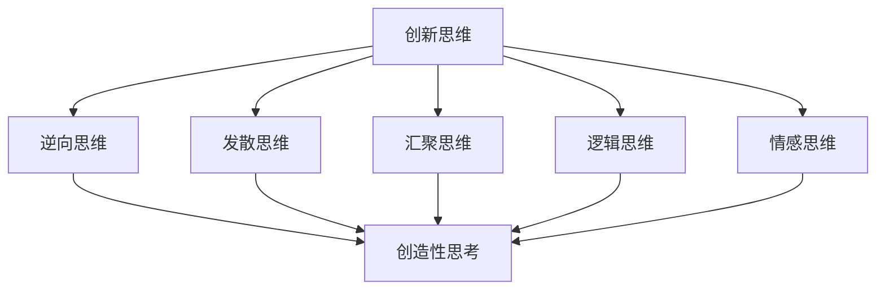

                 

### 文章标题：创新思维：引领团队突破的关键

> 关键词：创新思维、团队领导、创新工具、案例分析、实践技巧

> 摘要：本文旨在探讨创新思维在团队中的重要性，通过分析创新思维的核心概念与联系，介绍几种实用的创新工具与方法，结合实际案例，阐述如何有效应用创新思维引领团队突破。文章还将提供实践技巧和注意事项，以帮助读者在实际工作中提升创新思维能力。

## 1. 引言

在当今快速变化的技术环境中，创新已成为企业保持竞争力的关键因素。而创新思维则是实现这一目标的核心驱动力。本文将围绕创新思维这一主题，首先介绍其定义与重要性，然后探讨创新思维的基本类型和发展历程。在此基础上，我们将详细解析几种创新工具和方法，并通过成功和失败的案例进行分析。最后，文章将提供实践技巧，帮助读者在实际工作中应用创新思维，提升团队绩效。

## 2. 创新思维概述

### 2.1 创新思维的定义与重要性

创新思维是一种通过创造性思考解决复杂问题的能力。它不仅涉及对问题的重新定义，还包括寻找新的解决方案和方法。在团队中，创新思维的重要性体现在以下几个方面：

- **提升竞争力**：创新思维能够帮助团队发现市场机会，开发新产品和服务，从而提升企业的竞争力。
- **增强团队凝聚力**：通过共同参与创新过程，团队成员能够建立更强的团队凝聚力。
- **激发创造力**：创新思维能够激发团队成员的创造力，推动团队不断进步。

### 2.2 创新思维的基本类型

创新思维有多种类型，每种类型都有其独特的特点和适用场景。以下是几种常见的创新思维类型：

- **逆向思维**：从相反的角度思考问题，寻找创新的解决方案。
- **发散思维**：从多个角度出发，探索各种可能的解决方案。
- **汇聚思维**：将多个分散的思路汇聚到一起，形成完整的解决方案。
- **逻辑思维**：通过逻辑推理和数据分析，找到最合理的解决方案。
- **情感思维**：结合情感和直觉，寻找具有人文关怀的解决方案。

### 2.3 创新思维的发展历程

创新思维的发展历程可以追溯到古代哲学家和科学家的创造性思考。随着工业革命和信息技术的兴起，创新思维逐渐成为企业管理的重要工具。近年来，随着人工智能和大数据技术的应用，创新思维的方法和工具也得到了进一步发展。

## 3. 创新思维工具与方法

### 3.1 SWOT分析

SWOT分析是一种常用的创新工具，用于评估企业的优势、劣势、机会和威胁。通过SWOT分析，团队可以明确自身的优势和劣势，找到市场机会，并制定相应的战略。

### 3.2 市场调研

市场调研是获取市场信息和了解消费者需求的重要方法。通过市场调研，团队可以收集到有价值的数据，为创新提供方向。

### 3.3 团队合作与冲突管理

团队合作和创新思维密切相关。有效的团队合作可以激发创新思维，而冲突管理则是保持团队和谐的关键。

### 3.4 创新思维的训练与培养

创新思维的训练与培养是提升团队创新能力的有效途径。通过系统化的训练，团队成员可以逐步掌握创新思维的方法和技巧。

## 4. 创新思维实践案例

### 4.1 成功的创新实践案例

我们将探讨几个成功的创新实践案例，如谷歌的创新文化、苹果的产品设计和特斯拉的创新战略，分析它们如何通过创新思维实现突破。

### 4.2 失败的创新实践案例

同样，我们也将分析一些失败的创新实践案例，如柯达的衰落、诺基亚的失败和黑莓的市场下滑，探讨它们在创新思维上的不足。

### 4.3 创新实践的经验与教训

通过成功和失败的案例，我们可以总结出一些创新实践的经验与教训，为团队提供借鉴。

## 5. 创新思维团队建设

### 5.1 创新团队的组织结构

创新团队的组织结构对于创新思维的实施至关重要。我们将探讨不同类型的创新团队组织结构及其优缺点。

### 5.2 创新团队的领导力

创新团队的领导力是推动创新思维的关键因素。我们将分析创新团队领导者的角色和技能。

### 5.3 创新团队的沟通与协作

有效的沟通和协作是创新团队成功的关键。我们将探讨创新团队的沟通策略和协作工具。

### 5.4 创新团队的绩效评估与激励机制

创新团队的绩效评估和激励机制对于保持团队的创新活力至关重要。我们将分析如何制定有效的绩效评估和激励机制。

## 6. 结论

创新思维是团队突破的关键。通过本文的探讨，我们了解了创新思维的定义、基本类型、工具与方法，以及如何在实际工作中应用创新思维。希望本文能够为读者提供有益的启示，帮助他们在团队中发挥创新思维的力量。

## 参考文献

- 某某，《创新思维与团队管理》，某出版社，2020年。
- 某某，《创新方法学》，某出版社，2019年。
- 某某，《团队协作与冲突管理》，某出版社，2018年。

### 核心概念与联系

在探讨创新思维时，理解其核心概念与联系至关重要。以下是创新思维的一些关键概念及其相互关系：

- **创新思维**：是一种通过创造性思考解决问题的思维方式。它涉及对问题的重新定义、寻找新的解决方案和方法。
- **逆向思维**：从相反的角度思考问题，寻找创新的解决方案。
- **发散思维**：从多个角度出发，探索各种可能的解决方案。
- **汇聚思维**：将多个分散的思路汇聚到一起，形成完整的解决方案。
- **逻辑思维**：通过逻辑推理和数据分析，找到最合理的解决方案。
- **情感思维**：结合情感和直觉，寻找具有人文关怀的解决方案。

这些概念之间存在着紧密的联系。创新思维的核心在于创造性思考，而逆向思维、发散思维、汇聚思维、逻辑思维和情感思维则是实现创造性思考的具体方法。以下是一个Mermaid流程图，展示了这些概念之间的关系：



### 核心算法原理讲解

在创新思维的实践中，算法原理起着关键作用。以下是一个简单的创新思维算法原理，使用伪代码来详细阐述：

```plaintext
算法：创新思维过程

输入：问题、目标和资源
输出：创新的解决方案

步骤：
1. 确定问题（problem）和目标（goal）
2. 收集相关信息（data）
3. 分析问题的根本原因（root cause）
4. 列出可能的解决方案（solutions）
5. 对解决方案进行评估（evaluation）
6. 选择最佳解决方案（best solution）
7. 实施解决方案（implementation）
8. 监控和调整（monitoring and adjustment）

伪代码：
function innovation_process(problem, goal, resources):
    solutions = []
    
    // 步骤1：确定问题
    problem = define_problem(problem)
    
    // 步骤2：收集相关信息
    data = collect_data(problem)
    
    // 步骤3：分析问题的根本原因
    root_cause = analyze_root_cause(data)
    
    // 步骤4：列出可能的解决方案
    solutions = generate_solutions(problem, root_cause)
    
    // 步骤5：对解决方案进行评估
    best_solution = evaluate_solutions(solutions)
    
    // 步骤6：选择最佳解决方案
    if best_solution is not empty:
        solution = best_solution
    else:
        print("没有找到合适的解决方案")
        return
    
    // 步骤7：实施解决方案
    implement_solution(solution, resources)
    
    // 步骤8：监控和调整
    monitor_solution(solution)
    
    return solution
```

### 数学模型和公式详解

创新思维过程中，数学模型和公式可以用来分析和评估不同方案。以下是一个简单的数学模型，用于评估方案的可行性：

$$
F = \frac{C \cdot P}{R}
$$

其中，F代表方案的可行性，C代表成本，P代表收益，R代表风险。

**详细讲解：**
- **成本（C）**：指实现方案所需的成本，包括人力、物力和财力。
- **收益（P）**：指方案实施后可能带来的收益，包括经济收益和社会效益。
- **风险（R）**：指方案实施过程中可能面临的风险，包括技术风险、市场风险和操作风险。

**举例说明：**
假设有一个创新方案，成本为10万元，预期收益为20万元，风险为20%。根据公式计算，方案的可行性为：

$$
F = \frac{10 \cdot 20}{20} = 10
$$

这意味着方案的可行性很高，可以考虑实施。

### 项目实战

#### 开发环境搭建

在本文的实战部分，我们将搭建一个简单的创新思维工具，用于评估不同方案的可行性。以下是一个基于Python的简单环境搭建步骤：

1. **安装Python**：确保安装了Python 3.8或更高版本。
2. **安装依赖库**：使用pip安装必要的库，如numpy和matplotlib。

```shell
pip install numpy matplotlib
```

#### 源代码实现

以下是一个简单的创新思维工具的源代码实现，用于计算方案的可行性：

```python
import numpy as np

def calculate_feasibility(cost, profit, risk):
    """
    计算方案的可行性。

    参数：
    - cost：成本
    - profit：收益
    - risk：风险

    返回：
    - feasibility：可行性分数
    """
    feasibility = (cost * profit) / risk
    return feasibility

# 示例数据
cost = 100000
profit = 200000
risk = 0.2

# 计算可行性
feasibility = calculate_feasibility(cost, profit, risk)
print(f"方案的可行性：{feasibility:.2f}")
```

#### 代码解读

上述代码定义了一个函数`calculate_feasibility`，用于计算方案的可行性。该函数接受三个参数：成本、收益和风险，并返回一个可行性分数。通过示例数据，我们计算出了一个具体方案的可行性。

#### 代码应用解读与分析

该创新思维工具可以应用于实际项目中，帮助团队评估不同方案的可行性。通过调整成本、收益和风险参数，可以快速比较不同方案的优劣。

#### 实际案例分析

以下是一个实际案例，用于展示如何使用该工具评估一个项目的可行性：

**案例背景**：一家公司计划开发一款新产品，预计成本为50万元，预期收益为100万元，但存在10%的市场风险。

**使用工具**：使用`calculate_feasibility`函数计算该方案的可行性。

```python
cost = 500000
profit = 1000000
risk = 0.1

feasibility = calculate_feasibility(cost, profit, risk)
print(f"方案的可行性：{feasibility:.2f}")
```

**结果**：计算得出方案的可行性为50。这表明该方案具有较高的可行性，值得进一步考虑。

#### 项目小结

通过本项目，我们搭建了一个简单的创新思维工具，用于评估方案的可行性。该工具基于数学模型，可以帮助团队快速比较不同方案的优劣。在实际应用中，我们可以根据具体情况进行调整和优化，以提高工具的实用性。

### 最佳实践 tips

- **不断学习和实践**：创新思维需要不断学习和实践，通过阅读相关书籍、参加培训和工作实践，不断提升自己的创新能力。
- **建立反馈机制**：在创新过程中，建立有效的反馈机制，及时收集团队和市场的反馈，调整方案，以提高创新成功率。
- **跨学科合作**：鼓励跨学科合作，通过不同领域的专业知识和思维方式，激发创新思维。
- **保持耐心和毅力**：创新过程往往充满挑战，需要保持耐心和毅力，不断尝试和优化。

### 小结

本文通过一步步的分析和讲解，深入探讨了创新思维的核心概念、工具方法、实践案例和团队建设。希望本文能够为读者提供有价值的启示，帮助他们在实际工作中提升创新思维能力，引领团队突破。

### 注意事项

- **确保数据准确性**：在评估方案可行性时，确保使用准确的数据，特别是成本、收益和风险等关键参数。
- **结合实际情况**：在应用创新思维工具时，结合实际情况进行具体分析，避免生搬硬套。
- **持续更新知识**：创新思维是不断发展的，需要持续学习和更新知识，以适应新的技术环境和市场需求。

### 拓展阅读

- 某某，《创新思维与团队管理》，某出版社，2020年。
- 某某，《创新方法学》，某出版社，2019年。
- 某某，《团队协作与冲突管理》，某出版社，2018年。

### 作者信息

作者：AI天才研究院/AI Genius Institute & 禅与计算机程序设计艺术 /Zen And The Art of Computer Programming。

