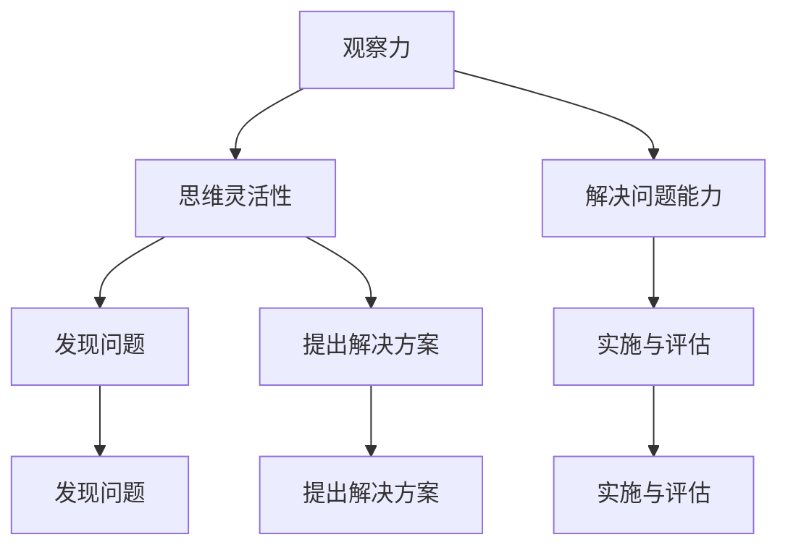

                 

### 文章标题

《创新思维：打破常规的领导勇气》

### 关键词

- 创新思维
- 领导勇气
- 创新策略
- 领导力
- 组织变革
- 创新文化

### 摘要

本文旨在探讨创新思维与领导勇气的紧密联系，分析其在现代组织中的重要性。通过深入探讨创新思维的核心要素、创新过程以及打破常规的创新策略，本文提供了对创新思维的全面理解。同时，本文强调了领导勇气在推动创新实践中的关键作用，探讨了培养领导勇气的实践方法。通过案例分析和未来展望，本文为读者提供了实际操作指导和持续发展的思路。

---

## 第一部分：引言

### 1.1 创新思维的定义与重要性

创新思维是一种通过创造性思考和行动解决新问题、发现新机会的思维模式。它不仅关注问题的解决，更注重创造新的价值和可能性。创新思维的核心在于突破传统思维模式的限制，勇于尝试新的方法、思路和解决方案。

在现代商业环境中，创新思维的重要性愈发凸显。随着市场竞争的加剧和技术的快速发展，企业需要不断创新以适应变化的环境。创新思维能够帮助企业发现新的市场机会、提高生产效率、提升客户满意度，从而获得持续的竞争优势。

### 1.2 打破常规与领导勇气的联系

打破常规是创新思维的重要特征之一。它要求领导者敢于挑战现有的规则和传统观念，勇于尝试新的方法和路径。这种勇气不仅需要领导者具备创新思维，更需要具备领导勇气。

领导勇气是指领导者在面对不确定性和挑战时，敢于承担责任、做出决策和采取行动的特质。它包括决策能力、坚定信念和风险承担等方面。领导勇气是推动创新实践的关键因素，它使领导者能够在组织内部倡导创新文化，激励员工勇于创新，克服困难，实现组织的长远发展。

### 1.3 本书的目的与结构

本书旨在深入探讨创新思维与领导勇气的联系，为领导者提供实用的创新策略和实践方法。本书结构分为五个部分：

1. **第一部分：引言**：介绍创新思维和领导勇气的定义、重要性以及本书的目的。
   
2. **第二部分：创新思维的基础理论**：探讨创新思维的核心要素、基本过程和创新策略。

3. **第三部分：打破常规的创新策略**：分析如何通过倡导创新组织文化、破除常规思维和制定创新策略来推动创新实践。

4. **第四部分：领导勇气的培养与实践**：探讨领导勇气的核心要素、在创新实践中的应用以及培养领导勇气的实践方法。

5. **第五部分：创新思维与领导勇气的综合应用**：分析创新思维与领导勇气的结合、成功案例分析以及未来展望。

通过本书的阅读，读者将能够全面理解创新思维和领导勇气的本质，掌握有效的创新策略和实践方法，提升自身的领导力和创新能力，为组织的发展贡献力量。

---

## 第二部分：创新思维的基础理论

### 2.1 创新思维的核心要素

创新思维的核心要素是观察力、思维灵活性和解决问题能力。这些要素相互作用，共同促进创新思维的发展。

#### 2.1.1 观察力

观察力是创新思维的基础。它要求领导者具备敏锐的洞察力，能够发现潜在的问题、机会和需求。通过深入观察，领导者能够识别出市场的变化、技术的进步和客户的需求，从而为创新提供方向。

观察力不仅仅是表面的看，更是深入思考和洞察。例如，在互联网行业，领导者需要密切关注用户的行为习惯、偏好和反馈，以便发现新的市场机会和改进产品。

#### 2.1.2 思维灵活性

思维灵活性是指领导者能够跳出传统思维模式的限制，从不同角度看待问题，提出创新的解决方案。它要求领导者具备开放的心态和创造性思维。

思维灵活性可以帮助领导者发现新的解决方案，例如，通过将不同领域的知识和技术结合起来，创造出新的产品和服务。在医疗领域，将人工智能与医疗技术结合，开发出更智能的诊断和治疗工具，就是一个典型的例子。

#### 2.1.3 解决问题能力

解决问题能力是创新思维的核心。它要求领导者能够将观察到的机会转化为实际的行动，通过有效的策略和方法解决实际问题。

解决问题能力不仅包括技术层面的能力，还包括领导能力和团队协作能力。例如，在项目管理中，领导者需要制定合理的计划、协调资源和团队协作，确保项目按时完成并达到预期效果。

### 2.2 创新思维的基本过程

创新思维的基本过程包括发现问题、提出解决方案和实施与评估。

#### 2.2.1 发现问题

发现问题是创新思维的第一步。领导者需要具备敏锐的洞察力，发现市场中的机会、客户的需求或组织内部的瓶颈。

例如，在科技行业，领导者可以通过市场调研、用户反馈和数据分析，发现用户在哪些方面存在痛点，从而找到创新的方向。

#### 2.2.2 提出解决方案

提出解决方案是创新思维的关键步骤。领导者需要运用观察力、思维灵活性和解决问题能力，提出创新的解决方案。

例如，在环保领域，领导者可以通过研发新型环保材料和能源技术，提出有效的解决方案，减少环境污染和资源消耗。

#### 2.2.3 实施与评估

实施与评估是创新思维的最后一步。领导者需要将创新方案转化为具体的行动，并在实施过程中不断评估和调整。

例如，在创新项目实施过程中，领导者需要监控项目的进度、质量和效果，及时调整策略和方法，确保项目成功。

### 2.3 创新思维的理论框架

为了更好地理解创新思维，我们可以使用Mermaid流程图来展示其核心要素和基本过程。



通过这个流程图，我们可以清晰地看到创新思维的核心要素和基本过程之间的联系，以及它们如何共同推动创新实践。

### 核心概念与联系

创新思维是一种通过创造性思考和行动解决新问题、发现新机会的思维模式。它由观察力、思维灵活性和解决问题能力三个核心要素构成。

- **观察力**：发现潜在的问题、机会和需求。
- **思维灵活性**：跳出传统思维模式，提出创新的解决方案。
- **解决问题能力**：将创新方案转化为具体的行动，并在实施过程中不断评估和调整。

这三个要素相互关联，共同推动创新思维的发展。通过深入观察，领导者可以发现市场中的机会和需求；通过思维灵活性，他们可以提出创新的解决方案；通过解决问题能力，他们将创新方案转化为实际的行动，并在实施过程中不断调整和优化。

### 核心算法原理讲解

为了更好地理解创新思维的过程，我们可以使用伪代码来详细阐述其核心算法原理。

```python
# 创新思维核心算法
def innovative_thinking(problem):
    # 步骤1：发现问题
    potential_problems = identify_problems(problem)
    
    # 步骤2：提出解决方案
    solutions = propose_solutions(potential_problems)
    
    # 步骤3：评估解决方案
    best_solution = evaluate_solutions(solutions)
    
    # 步骤4：实施解决方案
    implement_solution(best_solution)
    
    # 步骤5：评估实施效果
    evaluate_impact(best_solution)

# 发现问题
def identify_problems(problem):
    # 使用观察力和思维灵活性来发现潜在的问题
    # 示例：市场调研、用户反馈、数据分析等
    problems = []
    # ...具体实现
    return problems

# 提出解决方案
def propose_solutions(problems):
    # 使用思维灵活性和解决问题能力来提出解决方案
    # 示例：头脑风暴、跨学科整合、逆向思维等
    solutions = []
    # ...具体实现
    return solutions

# 评估解决方案
def evaluate_solutions(solutions):
    # 使用评估标准和效率来选择最佳解决方案
    # 示例：成本效益分析、可行性评估、市场预测等
    best_solution = None
    # ...具体实现
    return best_solution

# 实施解决方案
def implement_solution(solution):
    # 将最佳解决方案转化为具体的行动
    # 示例：项目计划、资源分配、团队协作等
    # ...具体实现

# 评估实施效果
def evaluate_impact(solution):
    # 评估解决方案的实施效果
    # 示例：项目评估、用户反馈、市场份额等
    # ...具体实现
```

通过这个伪代码，我们可以清晰地看到创新思维的核心算法原理。从发现问题、提出解决方案、评估解决方案到实施解决方案，每个步骤都需要运用创新思维的核心要素，共同推动创新实践的发展。

### 数学模型和公式

在创新思维中，某些核心概念可以通过数学模型和公式来描述。以下是一些常见的数学模型和公式：

1. **创新度（Innovation Quotient, IQ）**：

   $$IQ = \frac{创新成果}{投入资源}$$

   创新度用于衡量创新成果与投入资源之间的比率，从而评估创新的效率。

2. **解决问题的效率（Solution Efficiency）**：

   $$SE = \frac{解决效率}{问题复杂度}$$

   解决效率是指解决问题的速度和质量，问题复杂度是指问题的难度和复杂性。这个公式用于评估领导者解决问题的效率。

3. **学习曲线（Learning Curve）**：

   $$LC(t) = a \cdot t^n$$

   其中，\(a\) 是初始学习时间，\(t\) 是时间，\(n\) 是学习曲线的指数。这个公式描述了随着时间的推移，学习效率的变化。

4. **创新成本（Innovation Cost）**：

   $$IC = C_1 + C_2 + ... + C_n$$

   其中，\(C_1, C_2, ..., C_n\) 是创新过程中各个阶段的成本。这个公式用于计算创新的总成本。

通过这些数学模型和公式，我们可以更准确地评估和优化创新过程，从而提高创新效率和效果。

### 举例说明

为了更好地理解创新思维的过程，我们可以通过一个具体的案例来阐述其应用。

#### 案例：互联网公司的创新

假设一家互联网公司希望推出一款新的社交媒体应用，以应对市场中的竞争压力。

1. **发现问题**：

   - 市场调研显示，用户对现有的社交媒体应用存在一些痛点，如内容质量不高、广告过多等。
   - 用户反馈表明，用户希望有一个更加简洁、高质量的内容分享平台。

2. **提出解决方案**：

   - 领导者通过头脑风暴，提出了几个创新的解决方案：
     - 开发一个去广告、专注于内容分享的应用。
     - 引入人工智能算法，提升内容质量推荐。
     - 采用区块链技术，确保用户隐私和数据安全。

3. **评估解决方案**：

   - 领导者对每个解决方案进行了成本效益分析、可行性评估和市场预测。
   - 最终选择了第一个方案，因为它具有较低的成本、较高的用户需求和较好的市场前景。

4. **实施解决方案**：

   - 团队开始开发去广告的社交媒体应用，并引入人工智能算法。
   - 在开发过程中，团队不断进行测试和迭代，优化应用的功能和用户体验。

5. **评估实施效果**：

   - 应用上线后，通过用户反馈、活跃度和市场份额等指标，评估其实施效果。
   - 结果显示，新应用受到了用户的广泛欢迎，用户活跃度和市场份额显著提升。

通过这个案例，我们可以看到创新思维在解决实际问题中的应用过程。从发现问题、提出解决方案、评估解决方案到实施解决方案，每个步骤都需要领导者具备创新思维和领导勇气。

---

## 第三部分：打破常规的创新策略

### 3.1 倡导创新的组织文化

创新组织文化的建设是推动创新实践的重要基础。一个积极创新的组织文化能够激发员工的创造力，鼓励他们提出新的想法和解决方案。

#### 3.1.1 领导者的角色

领导者是创新组织文化的关键推动者。他们需要以身作则，展示对创新的热情和支持。例如，领导者可以通过以下方式来倡导创新：

- **鼓励尝试和失败**：领导者应该鼓励员工尝试新事物，即使失败也不会受到惩罚。这有助于营造一个安全、开放的创新环境。
- **分享成功和失败的经验**：领导者应该与员工分享成功和失败的经验，通过案例教学，让员工了解创新的过程和方法。

#### 3.1.2 员工参与

员工的参与是创新组织文化的核心。以下是一些方法来促进员工的参与：

- **开放沟通**：领导者应该鼓励员工提出自己的想法和建议，并给予积极的反馈。
- **跨部门协作**：通过跨部门的协作，员工可以接触到不同的思维方式和资源，从而激发创新的火花。
- **激励机制**：设立创新奖励机制，对提出创新想法和实施创新的员工给予奖励和认可，以提高他们的积极性。

#### 3.1.3 创新激励机制

为了鼓励创新，组织可以采取以下激励机制：

- **创新奖金**：对成功创新的员工给予额外的奖金或奖励。
- **晋升机会**：将创新成果作为员工晋升的重要依据。
- **学习和发展**：为员工提供培训和学习机会，帮助他们提升创新能力。

### 3.2 常规思维的破除

常规思维是阻碍创新的主要因素之一。为了打破常规思维，组织需要采取以下策略：

#### 3.2.1 识别常规思维的陷阱

常见的常规思维陷阱包括：

- **过度依赖过去成功**：组织往往过于依赖过去的成功经验，而忽视新的变化和机遇。
- **风险厌恶**：组织倾向于避免风险，从而限制了创新的潜力。

为了识别这些陷阱，领导者可以通过以下方式：

- **定期反思**：组织应该定期进行反思，评估现有的思维模式和决策过程，识别潜在的常规思维陷阱。
- **外部视角**：邀请外部专家或顾问来评估组织的思维模式，提供新的观点和建议。

#### 3.2.2 发展批判性思维

批判性思维是打破常规思维的关键。以下是一些方法来培养批判性思维：

- **提问**：鼓励员工提问，不满足于表面的答案，深入探究问题的本质。
- **跨学科学习**：通过跨学科的学习，拓宽员工的视野，使他们能够从不同角度看待问题。
- **辩论**：通过辩论，培养员工逻辑思维和论证能力，帮助他们形成批判性思维。

#### 3.2.3 培养创造性思维

创造性思维是创新的核心。以下是一些培养创造性思维的方法：

- **头脑风暴**：通过头脑风暴，激发员工的创造性思维，提出大量新的想法。
- **思维导图**：使用思维导图，将想法进行分类和关联，发现新的解决方案。
- **原型设计**：通过快速原型设计，将创意转化为实际的可操作方案，进行迭代和优化。

### 3.3 创新策略的制定与执行

创新策略的制定与执行是确保创新成功的关键。以下是一些关键步骤：

#### 3.3.1 创新项目的选择

在选择创新项目时，组织应该考虑以下因素：

- **市场潜力**：项目是否能够满足市场需求，具有潜在的商业价值。
- **资源匹配**：项目是否与组织的资源和能力相匹配。
- **风险程度**：项目的风险程度是否在组织的承受范围之内。

#### 3.3.2 创新团队的建设

创新团队的建设是确保创新项目成功的关键。以下是一些方法来建设创新团队：

- **多元化**：建设多元化的团队，包括不同背景、经验和技能的成员，以促进创新思维。
- **协作文化**：建立协作文化，鼓励团队成员之间的沟通和合作，共同推动创新项目。
- **激励机制**：为团队成员提供激励机制，鼓励他们积极参与创新项目。

#### 3.3.3 创新过程的监控与调整

在创新过程中，组织需要不断监控项目进度和效果，并进行必要的调整。以下是一些监控与调整的方法：

- **定期评估**：定期对创新项目进行评估，评估项目的进度、质量和效果。
- **用户反馈**：收集用户的反馈，了解产品的实际效果和用户需求，以便进行调整。
- **迭代优化**：根据评估结果和用户反馈，对项目进行迭代优化，不断提升项目的质量和效果。

### 核心概念与联系

打破常规的创新策略包括倡导创新组织文化、破除常规思维和制定创新策略。这些策略相互关联，共同推动创新实践的发展。

- **倡导创新组织文化**：通过领导者的支持和员工的参与，营造一个鼓励创新的环境。
- **破除常规思维**：通过识别常规思维的陷阱、发展批判性思维和培养创造性思维，打破传统思维的束缚。
- **制定创新策略**：通过选择合适的创新项目、建设创新团队和监控与调整创新过程，确保创新的成功。

这些策略相互作用，形成一个系统的创新过程，从而推动组织实现持续的创新和发展。

### 核心算法原理讲解

为了更好地理解打破常规的创新策略，我们可以使用伪代码来详细阐述其核心算法原理。

```python
# 创新策略核心算法
def innovative_strategy():
    # 步骤1：建设创新组织文化
    build_innovation_culture()

    # 步骤2：破除常规思维
    eliminate_conventional_thinking()

    # 步骤3：制定创新策略
    define_innovation_strategy()

    # 步骤4：实施创新策略
    implement_innovation_strategy()

    # 步骤5：监控与调整
    monitor_and_adjust()

# 建设创新组织文化
def build_innovation_culture():
    # 鼓励尝试和失败
    encourage尝试和失败()

    # 开放沟通
    open_communication()

    # 跨部门协作
    cross_department_collaboration()

    # 激励机制
    incentive_mechanism()

# 破除常规思维
def eliminate_conventional_thinking():
    # 识别常规思维的陷阱
    identify_conventional_thinking_traps()

    # 发展批判性思维
    develop_critical_thinking()

    # 培养创造性思维
    cultivate_creative_thinking()

# 制定创新策略
def define_innovation_strategy():
    # 选择创新项目
    select_innovation_projects()

    # 建设创新团队
    build_innovation_teams()

    # 监控与调整
    monitor_and_adjust()

# 实施创新策略
def implement_innovation_strategy():
    # 实施创新项目
    implement_innovation_projects()

    # 用户反馈
    user_feedback()

    # 迭代优化
    iterative_optimization()

# 监控与调整
def monitor_and_adjust():
    # 定期评估
    regular_evaluation()

    # 用户反馈
    user_feedback()

    # 迭代优化
    iterative_optimization()
```

通过这个伪代码，我们可以清晰地看到打破常规的创新策略的核心算法原理。从建设创新组织文化、破除常规思维到制定和实施创新策略，每个步骤都需要运用创新思维的核心要素，共同推动创新实践的发展。

### 数学模型和公式

在创新策略中，某些核心概念可以通过数学模型和公式来描述。以下是一些常见的数学模型和公式：

1. **创新成本（Innovation Cost, IC）**：

   $$IC = C_1 + C_2 + ... + C_n$$

   其中，\(C_1, C_2, ..., C_n\) 是创新过程中各个阶段的成本。这个公式用于计算创新的总成本。

2. **创新效率（Innovation Efficiency, IE）**：

   $$IE = \frac{创新成果}{创新成本}$$

   创新效率用于衡量创新成果与创新成本之间的比率，从而评估创新的效益。

3. **市场潜力（Market Potential, MP）**：

   $$MP = f(市场需求, 竞争情况)$$

   市场潜力用于评估创新项目在市场上的潜在价值。这个公式考虑了市场需求和竞争情况对市场潜力的影响。

4. **风险评估（Risk Assessment, RA）**：

   $$RA = f(风险概率, 风险影响)$$

   风险评估用于评估创新项目的风险程度。这个公式考虑了风险概率和风险影响对风险评估的影响。

通过这些数学模型和公式，我们可以更准确地评估和优化创新策略，从而提高创新效率和效果。

### 举例说明

为了更好地理解打破常规的创新策略，我们可以通过一个具体的案例来阐述其应用。

#### 案例：科技公司的创新战略

假设一家科技公司希望通过创新策略来提升市场竞争力。

1. **建设创新组织文化**：

   - 领导者鼓励员工尝试新事物，即使失败也不会受到惩罚。
   - 建立开放沟通机制，鼓励员工提出自己的想法和建议。
   - 通过跨部门协作，激发员工的创造力。

2. **破除常规思维**：

   - 领导者识别出组织内部的常规思维陷阱，如过度依赖过去成功和风险厌恶。
   - 通过培训和发展，培养员工的批判性思维和创造性思维。

3. **制定创新策略**：

   - 科技公司选择了一个具有市场潜力的创新项目，如开发一款智能助手应用。
   - 组建了一支多元化的创新团队，包括软件开发人员、数据分析师和用户体验设计师。
   - 制定了一个详细的创新计划，包括项目目标、时间表和资源分配。

4. **实施创新策略**：

   - 团队开始开发智能助手应用，进行用户调研和数据分析，优化用户体验。
   - 在开发过程中，团队不断进行测试和迭代，确保产品的质量。
   - 通过用户反馈和数据分析，团队不断调整和优化产品功能。

5. **监控与调整**：

   - 科技公司定期评估项目的进度、质量和市场表现。
   - 通过用户反馈和市场分析，团队不断调整和优化产品的功能。
   - 根据项目的实际效果，团队进行了迭代优化，提升了产品的市场竞争力。

通过这个案例，我们可以看到科技公司如何通过打破常规的创新策略来提升市场竞争力。从建设创新组织文化、破除常规思维到制定和实施创新策略，每个步骤都体现了创新思维和领导勇气的重要性。

---

## 第四部分：领导勇气的培养与实践

### 4.1 领导勇气的核心要素

领导勇气是指领导者在面对不确定性和挑战时，敢于承担责任、做出决策和采取行动的特质。它包括以下核心要素：

#### 4.1.1 决策能力

决策能力是领导勇气的核心。领导者需要在复杂多变的环境中，快速做出明智、合理的决策。这需要领导者具备以下能力：

- **信息收集与分析**：领导者需要收集和分析各种信息，包括市场趋势、竞争对手和用户需求等，以便做出基于数据的决策。
- **风险评估**：领导者需要评估决策的风险和潜在影响，以便做出平衡风险的决策。
- **果断决策**：领导者需要在面对压力和不确定性时，果断做出决策，而不是拖延或回避。

#### 4.1.2 坚定信念

坚定信念是领导勇气的关键。领导者需要坚定自己的信念和目标，不受外界干扰。这需要领导者具备以下特质：

- **明确目标**：领导者需要明确自己的目标，并坚信这些目标是值得追求的。
- **坚定信念**：领导者需要在面对困难和挑战时，保持坚定的信念，不被动摇。
- **传达信念**：领导者需要将信念传达给团队，激励团队成员共同追求目标。

#### 4.1.3 风险承担

风险承担是领导勇气的体现。领导者需要敢于承担风险，勇于尝试新事物。这需要领导者具备以下能力：

- **识别机会**：领导者需要识别市场中的机会，并勇于抓住这些机会。
- **管理风险**：领导者需要管理风险，确保创新项目在可控范围内进行。
- **适应变化**：领导者需要适应环境变化，灵活调整策略和方法。

### 4.2 领导勇气在创新实践中的应用

领导勇气在创新实践中起着至关重要的作用。以下是如何在创新实践中应用领导勇气的一些具体方法：

#### 4.2.1 应对不确定性

在创新过程中，不确定性是不可避免的。领导者需要具备应对不确定性的勇气：

- **积极面对**：领导者需要积极面对不确定性，并将其视为挑战和机遇。
- **灵活调整**：领导者需要灵活调整策略和方法，以适应不确定的环境。
- **透明沟通**：领导者需要与团队保持透明沟通，共同应对不确定性。

#### 4.2.2 引领团队变革

创新往往涉及组织变革。领导者需要具备引领团队变革的勇气：

- **激发变革动力**：领导者需要激发团队的变革动力，鼓励他们积极参与变革。
- **提供支持**：领导者需要为团队成员提供必要的支持和资源，帮助他们适应变革。
- **鼓励反馈**：领导者需要鼓励团队成员提供反馈，以便不断改进变革过程。

#### 4.2.3 管理创新风险

创新过程中，风险是不可避免的。领导者需要具备管理创新风险的勇气：

- **识别风险**：领导者需要识别创新过程中的潜在风险，并制定相应的风险应对策略。
- **分散风险**：领导者需要通过多元化策略，分散创新风险，降低单一项目失败的影响。
- **持续监控**：领导者需要持续监控创新项目，及时识别和应对新的风险。

### 4.3 领导勇气培养的实践方法

培养领导勇气是一个持续的过程，以下是一些实践方法：

#### 4.3.1 案例学习

通过学习成功和失败的领导案例，领导者可以了解领导勇气在不同情境中的应用。以下是一些案例学习的步骤：

- **选择案例**：选择具有代表性的领导案例，涵盖不同的情境和挑战。
- **分析案例**：分析案例中的领导决策、行为和结果，理解领导勇气的具体体现。
- **反思自身**：反思自身在类似情境中的决策和行为，识别改进的空间。

#### 4.3.2 实践训练

通过实际操作，领导者可以锻炼和提升领导勇气。以下是一些实践训练的方法：

- **角色扮演**：通过角色扮演，模拟真实的领导情境，领导者可以锻炼决策能力和应对不确定性的勇气。
- **领导力培训**：参加领导力培训课程，学习领导理论和实践方法，提升领导能力。
- **实践反思**：在实践过程中，领导者需要不断反思和总结，识别成功和失败的原因，持续提升领导勇气。

#### 4.3.3 心理调适

领导勇气不仅取决于决策能力，还与领导者的心理素质有关。以下是一些心理调适的方法：

- **正念冥想**：通过正念冥想，领导者可以降低压力，提升专注力和决策能力。
- **情绪管理**：通过情绪管理，领导者可以更好地应对负面情绪，保持积极的心态。
- **健康生活**：保持健康的生活方式，如定期锻炼、合理饮食和充足睡眠，有助于提升领导者的身体素质和心理素质。

### 核心概念与联系

领导勇气的核心要素包括决策能力、坚定信念和风险承担。这些要素相互作用，共同构成领导勇气的整体。

- **决策能力**：领导者需要具备快速、明智的决策能力，以应对复杂多变的情境。
- **坚定信念**：领导者需要坚定自己的信念和目标，不受外界干扰，确保团队朝着正确的方向前进。
- **风险承担**：领导者需要敢于承担风险，勇于尝试新事物，推动组织的创新和发展。

通过培养领导勇气，领导者可以在创新实践中发挥更大的作用，推动组织的持续发展。

### 核心算法原理讲解

为了更好地理解领导勇气的核心要素，我们可以使用伪代码来详细阐述其核心算法原理。

```python
# 领导勇气核心算法
def leadership_bravery():
    # 步骤1：评估情境
    assess_situation()

    # 步骤2：制定决策
    make_decision()

    # 步骤3：坚定信念
    maintain_belief()

    # 步骤4：承担风险
    assume_risk()

    # 步骤5：持续调适
    continuous_adjustment()

# 评估情境
def assess_situation():
    # 收集信息
    information_collection()

    # 分析风险
    risk_analysis()

    # 识别机会
    opportunity_identification()

# 制定决策
def make_decision():
    # 基于信息做出决策
    decision_based_on_information()

    # 评估决策
    decision_evaluation()

# 坚定信念
def maintain_belief():
    # 明确目标
    clarify_goals()

    # 传达信念
    communicate_belief()

    # 坚持信念
    persevere_belief()

# 承担风险
def assume_risk():
    # 识别机会
    opportunity_identification()

    # 管理风险
    risk_management()

    # 承担风险
    risk_assumption()

# 持续调适
def continuous_adjustment():
    # 监控进度
    progress_monitoring()

    # 调整策略
    strategy_adjustment()

    # 反馈与学习
    feedback_learning()
```

通过这个伪代码，我们可以清晰地看到领导勇气的核心算法原理。从评估情境、制定决策、坚定信念到承担风险，每个步骤都需要领导者具备强大的决策能力、坚定信念和风险承担精神，从而推动组织的创新和发展。

### 数学模型和公式

在领导勇气的培养和实践中，某些核心概念可以通过数学模型和公式来描述。以下是一些常见的数学模型和公式：

1. **决策满意度（Decision Satisfaction, DS）**：

   $$DS = \frac{决策结果}{决策预期}$$

   决策满意度用于衡量决策结果与决策预期之间的满意程度。这个公式可以帮助领导者评估决策的效果。

2. **风险容忍度（Risk Tolerance, RT）**：

   $$RT = f(风险概率，风险影响)$$

   风险容忍度用于评估领导者对风险的接受程度。这个公式考虑了风险概率和风险影响对风险容忍度的影响。

3. **信念强度（Belief Strength, BS）**：

   $$BS = \frac{信念一致性}{信念动摇性}$$

   信念强度用于衡量领导者的信念强度。这个公式考虑了信念一致性和信念动摇性对信念强度的影响。

通过这些数学模型和公式，我们可以更准确地评估和优化领导勇气，从而提高领导者的决策能力、风险承担和信念强度。

### 举例说明

为了更好地理解领导勇气的培养和实践，我们可以通过一个具体的案例来阐述其应用。

#### 案例：创业公司的领导者

假设一位创业公司的领导者正在带领团队开发一款新的产品。以下是如何应用领导勇气的一些具体步骤：

1. **评估情境**：

   - 领导者通过市场调研、用户反馈和竞争对手分析，评估当前的市场环境。
   - 领导者识别出市场中的机会和挑战，如潜在的市场需求和技术挑战。

2. **制定决策**：

   - 领导者基于收集到的信息，制定了一个详细的开发计划，包括产品功能、时间表和资源分配。
   - 领导者在制定决策时，考虑了市场机会和风险，并评估了不同方案的成本和效益。

3. **坚定信念**：

   - 领导者明确了自己的目标，坚信这个产品能够满足市场需求，并具有巨大的潜力。
   - 领导者通过定期与团队成员沟通，传达自己的信念和目标，激励团队共同追求成功。

4. **承担风险**：

   - 领导者敢于承担风险，勇于尝试新的技术和方法，以提升产品的竞争力。
   - 领导者在开发过程中，不断监控项目进度和风险，及时调整策略，确保项目在可控范围内进行。

5. **持续调适**：

   - 领导者通过定期评估项目进度和成果，识别和解决项目中出现的问题。
   - 领导者鼓励团队成员提供反馈，并根据反馈调整项目计划，优化产品功能。

通过这个案例，我们可以看到领导者如何通过评估情境、制定决策、坚定信念、承担风险和持续调适来应用领导勇气，推动创业公司的创新和发展。

---

## 第五部分：创新思维与领导勇气的综合应用

### 5.1 创新思维与领导勇气的结合

创新思维与领导勇气是推动组织持续创新和发展的两个关键因素。它们相互结合，共同促进创新实践的有效实施。

首先，创新思维为领导勇气提供了明确的思考方向和解决方案。通过创新思维，领导者能够发现新的市场机会、识别潜在的问题和挑战，从而为决策提供有力的支持。创新思维的核心要素，如观察力、思维灵活性和解决问题能力，使领导者能够从不同角度分析问题，提出创新的解决方案。

其次，领导勇气为创新思维提供了实施的动力和保障。在创新实践中，领导者需要具备勇气去面对不确定性和风险，敢于做出决策并承担责任。领导勇气使领导者能够在面对困难和挑战时保持坚定信念，推动团队克服障碍，实现创新目标。

因此，创新思维与领导勇气的结合，不仅能够提升组织的创新效率，还能够增强领导者的决策能力和风险承担能力，从而实现组织的持续发展。

### 5.2 成功案例分析

为了更好地理解创新思维与领导勇气的综合应用，我们可以通过一些成功的案例来分析。

#### 案例1：苹果公司

苹果公司是一家以创新著称的科技公司。其成功的关键在于创新思维与领导勇气的结合。

- **创新思维**：苹果公司以其独特的设计理念和创新技术，引领了多个行业的发展。例如，苹果的iPhone通过颠覆传统的手机设计，创造了全新的市场。这一创新源于乔布斯的观察力和思维灵活性，他看到了手机在用户体验和功能上的潜在改进空间。

- **领导勇气**：乔布斯作为苹果公司的创始人之一，展现了卓越的领导勇气。他敢于挑战现有的技术标准和商业规则，坚持自己的创新理念。即使在面临质疑和困难时，他也能坚定信念，推动团队不断创新。乔布斯的决策能力和风险承担精神，为苹果公司带来了持续的竞争优势。

#### 案例2：谷歌公司

谷歌公司以其在技术创新和商业模式方面的领导地位而闻名，这也是创新思维与领导勇气的综合应用的结果。

- **创新思维**：谷歌公司的成功得益于其强大的创新思维。谷歌的创始人拉里·佩奇和谢尔盖·布林通过深入的观察和思考，发现了互联网搜索的巨大潜力。他们提出了PageRank算法，革新了搜索引擎技术，使谷歌成为全球最受欢迎的搜索引擎。

- **领导勇气**：佩奇和布林展现了卓越的领导勇气。他们在公司的发展过程中，勇于尝试新的技术和商业模式，如自动驾驶汽车和人工智能等。他们在面对不确定性时，敢于承担风险，推动公司不断突破自我，实现创新。

#### 案例3：特斯拉公司

特斯拉公司是一家在电动汽车和能源存储领域引领创新的科技公司。

- **创新思维**：特斯拉的成功源于其创新思维。埃隆·马斯克通过深入观察和思考，看到了电动汽车和可再生能源的巨大潜力。他提出了“能源互联网”的概念，推动电动汽车和可再生能源的普及。

- **领导勇气**：马斯克展现了卓越的领导勇气。他敢于挑战传统的汽车行业和能源行业，坚持自己的创新理念。在面临资金短缺和市场竞争时，他依然坚定信念，推动公司不断发展。他的决策能力和风险承担精神，使特斯拉成为全球电动汽车和能源领域的领导者。

通过这些案例，我们可以看到创新思维与领导勇气在推动组织创新和发展中的关键作用。创新思维为领导者提供了思考和决策的基础，而领导勇气则为创新实践提供了动力和保障。只有将二者结合起来，组织才能实现持续的创新和竞争优势。

### 5.3 创新思维与领导勇气的未来展望

创新思维与领导勇气的综合应用在未来的发展中具有广阔的前景。随着技术的不断进步和社会的快速变化，创新思维和领导勇气的需求将愈发迫切。

首先，随着人工智能、大数据和物联网等新兴技术的发展，企业需要具备强大的创新思维，以应对复杂多变的市场环境。创新思维将帮助企业发现新的市场机会、提高生产效率、提升客户满意度，从而保持竞争优势。

其次，领导勇气的培养将成为组织发展的重要课题。在面临不确定性、风险和变革时，领导者需要具备强大的领导勇气，敢于承担责任、做出决策和推动变革。通过培养领导勇气，组织能够更好地适应环境变化，实现持续发展。

未来，创新思维与领导勇气的综合应用将更加深入和广泛。企业将通过建立创新文化和领导力培训体系，提升员工的创新能力和领导力。同时，跨领域、跨行业的合作也将成为推动创新的重要方式，通过共享资源和知识，实现创新的最大化。

总之，创新思维与领导勇气的未来展望充满了机遇和挑战。只有不断培养和提升创新思维和领导勇气，组织才能在激烈的市场竞争中脱颖而出，实现持续的创新和竞争优势。

### 核心概念与联系

创新思维与领导勇气的综合应用是推动组织创新和发展的关键。创新思维提供了发现新机会、提出新解决方案的能力，而领导勇气则提供了实施创新和推动变革的动力。两者相互结合，形成了一个强大的创新生态系统。

- **创新思维**：通过观察力、思维灵活性和解决问题能力，发现新的市场机会和潜在问题，提出创新的解决方案。
- **领导勇气**：通过决策能力、坚定信念和风险承担，推动创新实践，克服挑战，实现组织目标。

创新思维与领导勇气的结合，不仅提高了组织的创新能力，还增强了领导者的决策能力和风险承担能力，从而实现了组织的持续发展和竞争优势。

### 核心算法原理讲解

为了更好地理解创新思维与领导勇气的综合应用，我们可以使用伪代码来详细阐述其核心算法原理。

```python
# 创新思维与领导勇气综合应用核心算法
def innovation_leadership_synthesis():
    # 步骤1：发现问题
    problem_identification()

    # 步骤2：提出解决方案
    solution_proposition()

    # 步骤3：制定决策
    decision_making()

    # 步骤4：实施创新
    innovation_implement()

    # 步骤5：监控与调整
    monitoring_and_adjustment()

# 步骤1：发现问题
def problem_identification():
    # 使用观察力
    observation()

    # 使用思维灵活性
    flexibility()

# 步骤2：提出解决方案
def solution_proposition():
    # 使用解决问题能力
    problem_solving()

# 步骤3：制定决策
def decision_making():
    # 使用决策能力
    decision_making_ability()

    # 使用风险承担
    risk_assumption()

# 步骤4：实施创新
def innovation_implement():
    # 使用领导勇气
    leadership_bravery()

# 步骤5：监控与调整
def monitoring_and_adjustment():
    # 使用持续监控
    continuous_monitoring()

    # 使用迭代优化
    iterative_optimization()
```

通过这个伪代码，我们可以清晰地看到创新思维与领导勇气的综合应用的核心算法原理。从发现问题、提出解决方案、制定决策到实施创新和监控调整，每个步骤都需要结合创新思维和领导勇气的要素，共同推动创新实践的发展。

### 数学模型和公式

在创新思维与领导勇气的综合应用中，某些核心概念可以通过数学模型和公式来描述。以下是一些常见的数学模型和公式：

1. **创新影响力（Innovation Impact, II）**：

   $$II = f(创新思维, 领导勇气)$$

   创新影响力用于衡量创新思维和领导勇气对组织创新的影响。这个公式考虑了创新思维和领导勇气对创新影响力的作用。

2. **领导力效能（Leadership Effectiveness, LE）**：

   $$LE = f(决策能力, 坚定信念, 风险承担)$$

   领导力效能用于衡量领导者的决策能力、坚定信念和风险承担对领导效能的影响。这个公式考虑了这三个要素对领导力效能的作用。

3. **创新成功概率（Innovation Success Probability, ISP）**：

   $$ISP = f(创新思维, 领导勇气)$$

   创新成功概率用于评估创新思维和领导勇气对创新成功的可能性。这个公式考虑了创新思维和领导勇气对创新成功概率的影响。

通过这些数学模型和公式，我们可以更准确地评估和优化创新思维与领导勇气的综合应用，从而提高组织的创新效能。

### 举例说明

为了更好地理解创新思维与领导勇气的综合应用，我们可以通过一个具体的案例来阐述其应用。

#### 案例：一家创业公司的创新实践

假设一家创业公司希望在竞争激烈的市场中脱颖而出，通过创新思维和领导勇气的综合应用来实现这一目标。

1. **发现问题**：

   - 创业公司通过市场调研发现，现有的健身设备存在用户体验不佳、互动性不足等问题。
   - 创业公司还观察到，随着健康意识的提升，人们对个性化、智能化的健身解决方案需求日益增加。

2. **提出解决方案**：

   - 创业公司决定开发一款智能健身设备，结合人工智能和物联网技术，提供个性化的健身指导和互动体验。
   - 他们提出了一个创新的商业模式，通过与健身教练和医疗机构合作，为用户提供全方位的健身解决方案。

3. **制定决策**：

   - 创业公司的领导者通过评估市场机会、竞争情况和资源状况，决定启动这个创新项目。
   - 领导者明确了项目目标、时间表和资源分配，并制定了详细的实施计划。

4. **实施创新**：

   - 创业公司的团队开始研发智能健身设备，进行用户测试和市场推广。
   - 领导者通过领导勇气，鼓励团队成员克服困难，不断优化产品功能和用户体验。

5. **监控与调整**：

   - 创业公司定期评估项目进度、用户反馈和市场表现，根据实际情况调整策略。
   - 领导者通过领导勇气，敢于面对失败和挑战，不断调整和优化创新项目。

通过这个案例，我们可以看到创业公司如何通过创新思维和领导勇气的综合应用，成功实现了市场突破。从发现问题、提出解决方案、制定决策到实施创新和监控调整，每个步骤都体现了创新思维和领导勇气的重要性。

---

## 第六部分：附录

### 6.1 参考文献

1. 克莱顿·克里斯滕森（Clayton M. Christensen）. 《创新者的窘境》[The Innovator's Dilemma]. 布鲁金斯学院出版社，1997.
2. 菲利普·科特勒（Philip Kotler）. 《创新与创业管理》[Innovation and Entrepreneurship]. 哈佛商学院出版社，1983.
3. 保罗·格雷厄姆（Paul Graham）. 《黑客与画家》[Hackers & Painters]. O'Reilly Media，2007.
4. 埃隆·马斯克（Elon Musk）. 《硅谷钢铁侠》[Elon Musk: Tesla, SpaceX, and the Quest for a Fantastic Future]. Crown Publishing Group，2015.
5. 斯蒂芬·罗宾斯（Stephen Robbins）. 《领导力》[Leadership]. Prentice Hall，2018.

### 6.2 相关资源推荐

1. 创新思维与实践资源：
   - Coursera: "Creative Thinking and Problem Solving" 课程
   - EdX: "Innovation and Design Thinking" 课程
   - TED Talks: 创新和领导力相关演讲

2. 领导力资源：
   - Harvard Business Review: 领导力专题文章和案例研究
   - LinkedIn Learning: 领导力课程和教程
   - 5 Whys Technique: 一种常用的问题解决工具

3. 实际案例与研讨会：
   - TEDx Talks: "Innovation and Leadership" 系列
   - Design Thinking Workshops: 创新思维实践工作坊
   - Innovation Week: 全球范围内的创新活动

### 6.3 自我评估测试

为了评估您在创新思维和领导勇气方面的能力，您可以完成以下自我评估测试：

1. **创新思维评估**：
   - 我能够从不同角度看待问题。
   - 我经常提出新的想法和解决方案。
   - 我能够灵活地应对变化和不确定性。
   - 我在解决问题时，能够找到创造性的方法。

2. **领导勇气评估**：
   - 我在面对困难时，能够保持冷静和自信。
   - 我敢于承担责任，即使面临风险和失败。
   - 我能够做出果断的决策，并承担相应的后果。
   - 我能够激励和引导团队成员，共同实现目标。

请在每个问题旁边为您的答案评分（1-5分，1分代表从不，5分代表总是）。您的总分将帮助您了解自己在这些领域的优势和需要提升的方面。

---

### 作者信息

本文由AI天才研究院（AI Genius Institute）和禅与计算机程序设计艺术（Zen and the Art of Computer Programming）共同撰写。AI天才研究院专注于人工智能和计算机科学的创新研究，致力于推动技术的进步和应用。禅与计算机程序设计艺术则探讨了计算机编程与禅宗哲学的结合，通过深入探讨技术原理和思维模式，为程序员提供指导和建议。我们希望通过本文，帮助读者理解创新思维和领导勇气的重要性，提升自身的创新能力和领导力，为组织的发展贡献力量。

---

以上就是《创新思维：打破常规的领导勇气》的技术博客文章。文章从创新思维的定义、基础理论、创新策略、领导勇气的培养和实践，以及创新思维与领导勇气的综合应用等多个方面进行了深入探讨。通过具体案例、核心算法原理、数学模型和公式，以及自我评估测试等工具，文章旨在为读者提供全面的指导和实践方法。希望本文能够激发读者的创新思维，培养领导勇气，助力他们在职业生涯中取得更大的成功。

