                 


### 文章标题：创新文化培育：打造鼓励创新的团队氛围

#### 关键词：
- 创新文化
- 团队氛围
- 鼓励创新
- 领导力
- 组织结构
- 资源支持
- 团队合作
- 持续学习

#### 摘要：
本文旨在探讨如何在团队中培育创新文化，打造一个鼓励创新的氛围。我们将从背景介绍、核心概念、核心算法原理、数学模型、项目实战等方面进行详细阐述，为读者提供实用的指导和建议。

### 引言

#### 创新的重要性

创新是推动社会进步和企业发展的关键驱动力。在当今快速变化的全球环境中，创新尤为重要。一个具有创新能力的团队可以更快地适应市场变化，抓住机遇，提高竞争力。然而，创新并非易事，它需要团队具备特定的素质和氛围。

#### 创新文化的定义

创新文化是一种价值观和行为模式，它鼓励团队成员勇于尝试新事物，接受失败，并在团队中建立信任和合作。创新文化包括开放性、风险容忍、团队合作和持续学习等核心要素。

### 第1章 创新文化的核心要素

#### 1.1 开放性

##### 1.1.1 开放性的概念

开放性是指团队愿意接受新思想、新方法和新技术，并对不同观点持包容态度。开放性是创新文化的重要基础，因为它能够激发团队成员的创造力。

##### 1.1.2 开放性的体现

开放性的体现包括：

- 愿意接受外部意见和建议
- 鼓励内部沟通和知识共享
- 对新技术的尝试和采纳

##### 1.1.3 开放性对创新文化的影响

开放性有助于：

- 提高团队的适应能力
- 激发团队成员的创造力
- 促进团队内部的协作和创新

#### 1.2 风险容忍

##### 1.2.1 风险容忍的概念

风险容忍是指团队对失败的接受程度。在一个具有风险容忍的文化中，团队成员可以勇于尝试新事物，即使失败也不会受到惩罚。

##### 1.2.2 风险容忍的体现

风险容忍的体现包括：

- 对失败的宽容
- 对尝试新方法的支持
- 对失败的学习和总结

##### 1.2.3 风险容忍对创新文化的影响

风险容忍有助于：

- 减少团队成员的风险规避行为
- 提高团队的创新能力
- 促进团队的创新氛围

#### 1.3 团队合作

##### 1.3.1 团队合作的概念

团队合作是指团队成员为了共同的目标而协同工作。团队合作是创新文化的重要组成部分，因为它能够提高团队的整体创新能力。

##### 1.3.2 团队合作的体现

团队合作的体现包括：

- 明确的团队目标和角色分工
- 沟通和协作的有效性
- 成果共享和相互支持

##### 1.3.3 团队合作对创新文化的影响

团队合作有助于：

- 提高团队的协同创新能力
- 减少内部分歧
- 促进团队的凝聚力和归属感

#### 1.4 持续学习

##### 1.4.1 持续学习的概念

持续学习是指团队成员不断更新知识和技能，以适应不断变化的环境。持续学习是创新文化的重要组成部分，因为它能够提高团队成员的创新能力。

##### 1.4.2 持续学习的方法与工具

持续学习的方法与工具包括：

- 在线学习平台
- 内部培训课程
- 实践项目和案例研究

##### 1.4.3 持续学习对创新文化的影响

持续学习有助于：

- 提高团队成员的专业能力
- 拓展团队成员的视野
- 促进团队的持续创新和发展

### 第2章 打造鼓励创新的环境

#### 2.1 领导力

##### 2.1.1 领导者在创新文化培育中的角色

领导者在创新文化培育中扮演着关键角色。他们需要：

- 建立并传达创新价值观
- 鼓励团队成员尝试新事物
- 提供必要的支持和资源

##### 2.1.2 如何提升领导力以促进创新

提升领导力以促进创新的策略包括：

- 培养开放和包容的领导风格
- 建立鼓励失败和尝试的组织文化
- 提供必要的培训和资源支持

#### 2.2 组织结构

##### 2.2.1 组织结构对创新文化的影响

组织结构对创新文化有重要影响。适当的组织结构可以：

- 提高团队协作效率
- 促进知识共享和沟通
- 减少冗余和障碍

##### 2.2.2 如何调整组织结构以支持创新

调整组织结构以支持创新的策略包括：

- 灵活和扁平化的组织结构
- 促进跨部门合作和知识共享
- 建立创新团队和项目组

#### 2.3 资源支持

##### 2.3.1 创新所需的资源类型

创新所需的资源类型包括：

- 人力资源
- 财务资源
- 硬件设施
- 技术支持

##### 2.3.2 如何有效配置资源以支持创新

有效配置资源以支持创新的策略包括：

- 优先考虑创新项目的资源需求
- 建立跨部门的资源协调机制
- 提供持续的资金支持和预算保障

### 第3章 创新型团队的培养

#### 3.1 团队成员的选拔

##### 3.1.1 创新型团队成员的选拔标准

创新型团队成员的选拔标准包括：

- 创造力和创新能力
- 沟通和协作能力
- 学习和适应能力
- 专业技能和经验

##### 3.1.2 如何进行团队成员的选拔

进行团队成员选拔的方法包括：

- 竞争招聘
- 内部选拔和晋升
- 外部推荐和引进

#### 3.2 团队成员的培养

##### 3.2.1 创新型团队成员的培养策略

创新型团队成员的培养策略包括：

- 提供专业培训和技能提升机会
- 鼓励跨部门和跨领域的交流与合作
- 提供实践项目和案例研究

##### 3.2.2 如何进行团队成员的培养

进行团队成员培养的方法包括：

- 制定个性化的培训计划
- 建立内部导师制度
- 提供实践项目和挑战机会

#### 3.3 团队成员的激励

##### 3.3.1 创新型团队成员的激励方式

创新型团队成员的激励方式包括：

- 薪酬和福利激励
- 职业发展机会
- 公开认可和奖励

##### 3.3.2 如何进行团队成员的激励

进行团队成员激励的方法包括：

- 设定明确的目标和考核标准
- 提供竞争性的薪酬和福利待遇
- 定期组织团队活动和奖励仪式

### 第4章 创新项目的管理与实施

#### 4.1 创新项目的定义与分类

##### 4.1.1 创新项目的定义

创新项目是指以创新为核心目标的特定任务或活动。

##### 4.1.2 创新项目的分类

创新项目可以分为以下几类：

- 产品创新
- 过程创新
- 管理创新
- 服务创新

#### 4.2 创新项目的管理

##### 4.2.1 创新项目管理的原则

创新项目管理的原则包括：

- 目标导向
- 团队协作
- 风险管理
- 持续改进

##### 4.2.2 创新项目管理的流程

创新项目管理的流程包括：

- 项目规划
- 项目执行
- 项目监控
- 项目收尾

#### 4.3 创新项目的实施

##### 4.3.1 创新项目实施的方法

创新项目实施的方法包括：

- 团队协作
- 模块化开发
- 快速迭代
- 用户反馈

##### 4.3.2 创新项目实施的关键因素

创新项目实施的关键因素包括：

- 人才队伍
- 技术支持
- 资源保障
- 管理机制

### 第5章 创新文化的评估与改进

#### 5.1 创新文化的评估

##### 5.1.1 创新文化评估的方法

创新文化评估的方法包括：

- 问卷调查
- 专家评审
- 员工访谈
- 数据分析

##### 5.1.2 创新文化评估的工具

创新文化评估的工具包括：

- 创新文化量表
- 组织绩效指标
- 团队协作指标
- 员工满意度调查

#### 5.2 创新文化的改进

##### 5.2.1 创新文化改进的原则

创新文化改进的原则包括：

- 以员工为中心
- 持续改进
- 鼓励创新
- 资源保障

##### 5.2.2 创新文化改进的策略

创新文化改进的策略包括：

- 提供培训和学习机会
- 建立内部创新竞赛
- 设立创新奖励机制
- 优化组织结构

### 参考文献

- <https://www.ibm.com/docs/en/dw/8.0.0?topic=devTeams-creating-culture-collaboration-innovation>
- <https://hbr.org/2018/05/how-to-build-a-culture-of-innovation>
- <https://www.mckinsey.com/business-functions/organization/our-insights/five-steps-to-building-a-culture-of-innovation>

### 附录

#### 附录A 创新文化培育相关案例

- 案例一：谷歌的创新文化
- 案例二：3M公司的创新文化
- 案例三：苹果公司的创新文化

#### 附录B 创新文化培育常用工具

- 敏捷开发工具
- 情感分析工具
- 团队协作工具
- 创新思维工具

#### 附录C 创新文化培育相关资源

- 创新文化相关书籍
- 创新文化研究论文
- 创新文化培训课程
- 创新文化案例库

### 作者

作者：AI天才研究院/AI Genius Institute & 禅与计算机程序设计艺术 /Zen And The Art of Computer Programming

-----------------------------------------------------------------

### 文章标题：创新文化培育：打造鼓励创新的团队氛围

### 关键词：
- 创新文化
- 团队氛围
- 鼓励创新
- 领导力
- 组织结构
- 资源支持
- 团队合作
- 持续学习

### 摘要：
本文旨在探讨如何在团队中培育创新文化，打造一个鼓励创新的氛围。我们将从背景介绍、核心概念、核心算法原理、数学模型、项目实战等方面进行详细阐述，为读者提供实用的指导和建议。

----------------------------------------------------------------

### 引言

#### 创新的重要性

创新是推动社会进步和企业发展的关键驱动力。在当今快速变化的全球环境中，创新尤为重要。一个具有创新能力的团队可以更快地适应市场变化，抓住机遇，提高竞争力。然而，创新并非易事，它需要团队具备特定的素质和氛围。

#### 创新文化的定义

创新文化是一种价值观和行为模式，它鼓励团队成员勇于尝试新事物，接受失败，并在团队中建立信任和合作。创新文化包括开放性、风险容忍、团队合作和持续学习等核心要素。

----------------------------------------------------------------

### 第1章 创新文化的核心要素

#### 1.1 开放性

##### 1.1.1 开放性的概念

开放性是指团队愿意接受新思想、新方法和新技术，并对不同观点持包容态度。开放性是创新文化的重要基础，因为它能够激发团队成员的创造力。

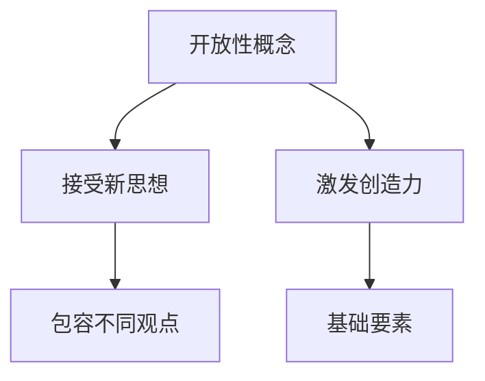

##### 1.1.2 开放性的体现

开放性的体现包括：

- 愿意接受外部意见和建议：团队成员积极参与外部培训和研讨会，吸收外部先进的思想和经验。
- 鼓励内部沟通和知识共享：团队内部建立开放的沟通渠道，鼓励成员分享知识和经验，提高整体创新能力。
- 对新技术的尝试和采纳：团队对新技术的态度积极，愿意投入时间和资源进行尝试和采纳，以推动团队的创新发展。

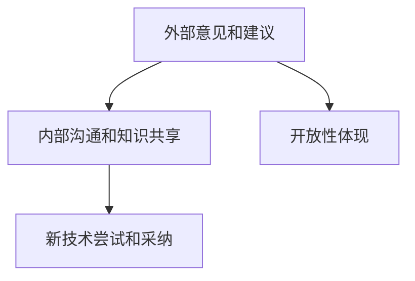

##### 1.1.3 开放性对创新文化的影响

开放性有助于：

- 提高团队的适应能力：开放性使团队能够快速适应外部环境的变化，抓住机遇。
- 激发团队成员的创造力：开放性鼓励团队成员提出新的想法和解决方案，提高团队的创新能力。
- 促进团队内部的协作和创新：开放性使团队成员更加愿意合作，共同面对挑战，实现创新。

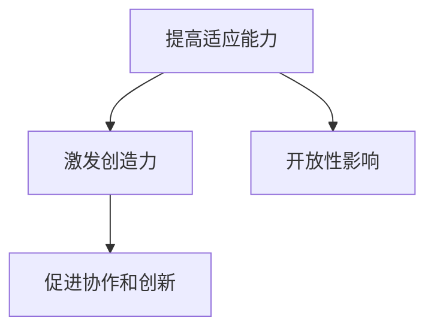

#### 1.2 风险容忍

##### 1.2.1 风险容忍的概念

风险容忍是指团队对失败的接受程度。在一个具有风险容忍的文化中，团队成员可以勇于尝试新事物，即使失败也不会受到惩罚。

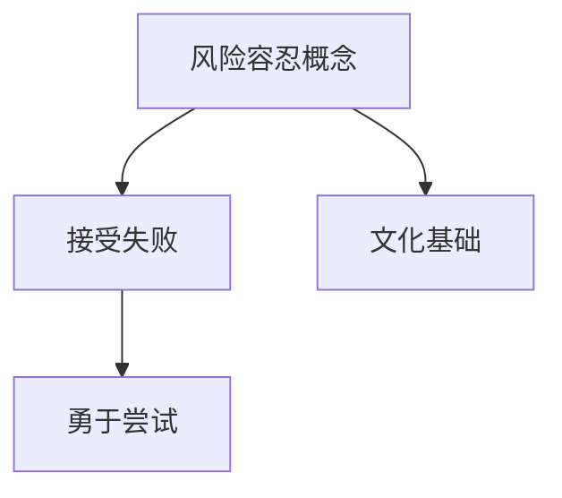

##### 1.2.2 风险容忍的体现

风险容忍的体现包括：

- 对失败的宽容：团队对失败持宽容态度，鼓励成员从失败中学习和成长。
- 对尝试新方法的支持：团队支持成员尝试新的方法和策略，即使结果不确定。
- 对失败的学习和总结：团队将失败视为宝贵的学习机会，通过总结失败的原因和经验教训，为未来的创新提供指导。

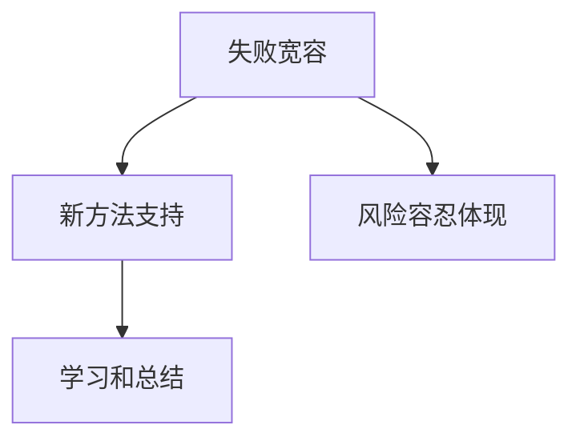

##### 1.2.3 风险容忍对创新文化的影响

风险容忍有助于：

- 减少团队成员的风险规避行为：风险容忍鼓励团队成员勇于尝试新事物，降低风险规避的现象。
- 提高团队的创新能力：风险容忍使团队能够更加自由地尝试和创新，提高整体的创新能力。
- 促进团队的创新氛围：风险容忍营造了一种鼓励尝试和接受失败的氛围，有助于团队的持续创新和发展。

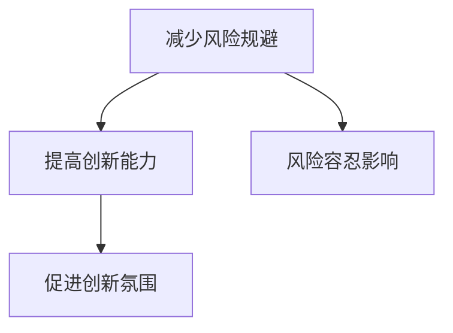

#### 1.3 团队合作

##### 1.3.1 团队合作的概念

团队合作是指团队成员为了共同的目标而协同工作。团队合作是创新文化的重要组成部分，因为它能够提高团队的整体创新能力。

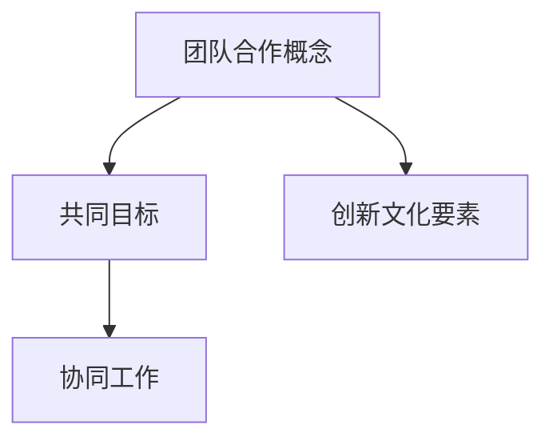

##### 1.3.2 团队合作的体现

团队合作的体现包括：

- 明确的团队目标和角色分工：团队成员明确自己的目标和职责，共同努力实现团队目标。
- 沟通和协作的有效性：团队成员之间保持良好的沟通，共享信息，协同工作，提高工作效率。
- 成果共享和相互支持：团队成员分享自己的成果和经验，相互支持，共同成长。

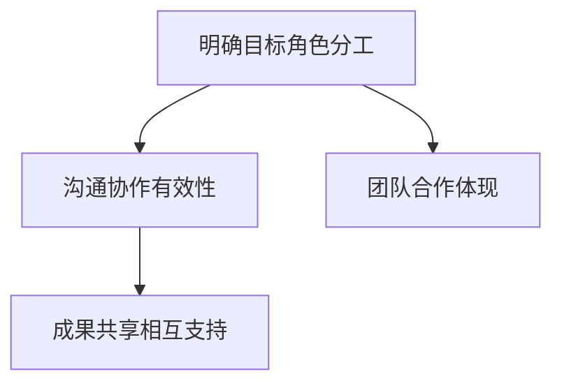

##### 1.3.3 团队合作对创新文化的影响

团队合作有助于：

- 提高团队的协同创新能力：团队合作使团队成员能够共同面对挑战，发挥各自的优势，实现创新的突破。
- 减少内部分歧：团队合作促进团队成员之间的沟通和理解，减少冲突和分歧，提高团队的凝聚力。
- 促进团队的持续创新和发展：团队合作使团队能够持续分享和积累知识，不断改进和创新，推动团队的长期发展。

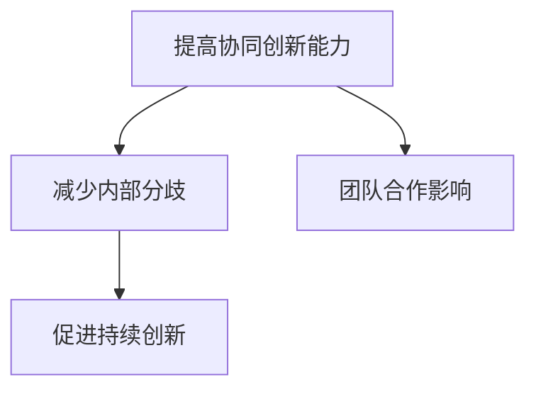

#### 1.4 持续学习

##### 1.4.1 持续学习的概念

持续学习是指团队成员不断更新知识和技能，以适应不断变化的环境。持续学习是创新文化的重要组成部分，因为它能够提高团队成员的创新能力。

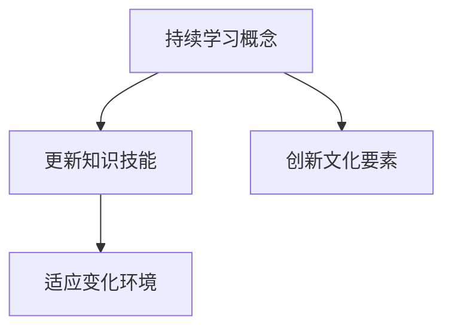

##### 1.4.2 持续学习的方法与工具

持续学习的方法与工具包括：

- 在线学习平台：团队成员可以通过在线学习平台获取最新的知识和技能，提高自身的能力水平。
- 内部培训课程：团队可以组织内部培训课程，分享经验和知识，促进团队成员的共同进步。
- 实践项目和案例研究：通过实践项目和案例研究，团队成员可以将所学知识应用到实际工作中，提高实践能力和解决问题的能力。

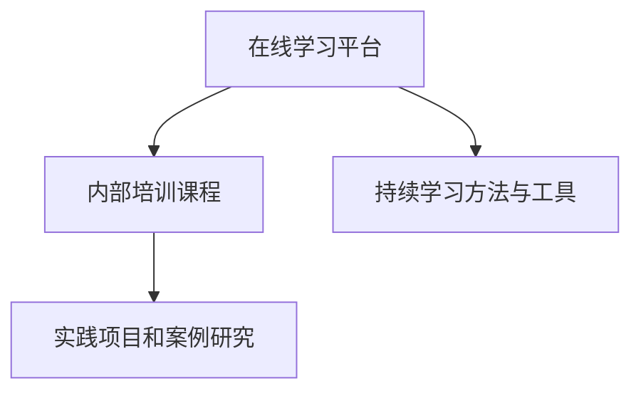

##### 1.4.3 持续学习对创新文化的影响

持续学习有助于：

- 提高团队成员的专业能力：持续学习使团队成员能够不断更新知识和技能，提高自身的专业水平。
- 拓展团队成员的视野：持续学习使团队成员能够了解最新的行业动态和技术趋势，拓宽视野，提高创新能力。
- 促进团队的持续创新和发展：持续学习使团队能够不断积累和更新知识，推动团队的持续创新和发展。

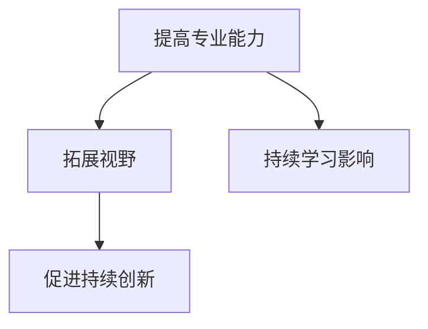

----------------------------------------------------------------

### 第2章 打造鼓励创新的环境

#### 2.1 领导力

##### 2.1.1 领导者在创新文化培育中的角色

领导者在创新文化培育中扮演着关键角色。他们需要：

- 建立并传达创新价值观：领导者需要明确创新的重要性，并将其传达给团队成员，激发团队成员的创新意识。
- 鼓励团队成员尝试新事物：领导者需要鼓励团队成员勇于尝试新事物，支持他们进行创新实践。
- 提供必要的支持和资源：领导者需要为团队成员提供必要的支持和资源，帮助他们克服创新过程中的困难和挑战。

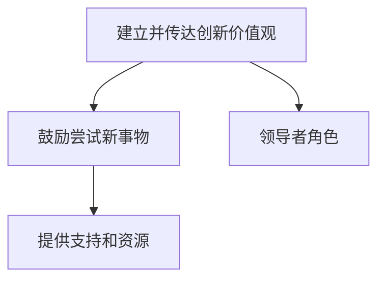

##### 2.1.2 如何提升领导力以促进创新

提升领导力以促进创新的策略包括：

- 培养开放和包容的领导风格：领导者需要培养开放和包容的领导风格，鼓励团队成员提出新的想法和意见，并给予充分的尊重和支持。
- 建立鼓励失败和尝试的组织文化：领导者需要建立鼓励失败和尝试的组织文化，使团队成员敢于冒险和创新，从失败中学习和成长。
- 提供必要的培训和资源支持：领导者需要为团队成员提供必要的培训和资源支持，帮助他们提升创新能力和实践能力。

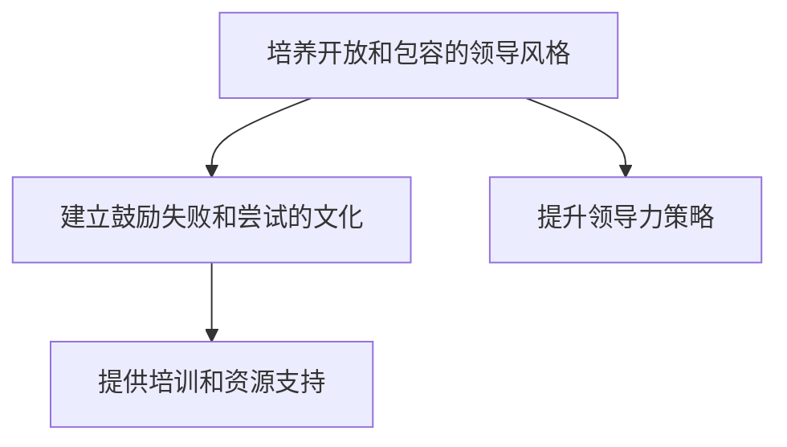

#### 2.2 组织结构

##### 2.2.1 组织结构对创新文化的影响

组织结构对创新文化有重要影响。适当的组织结构可以：

- 提高团队协作效率：扁平化的组织结构有助于提高团队协作效率，减少沟通成本，促进信息共享和知识传递。
- 促进知识共享和沟通：组织结构的设计应有利于团队成员之间的沟通和知识共享，使创新思想得以快速传播和实施。
- 减少冗余和障碍：合理的组织结构可以减少冗余和障碍，提高组织的灵活性和响应速度，为创新提供良好的环境。

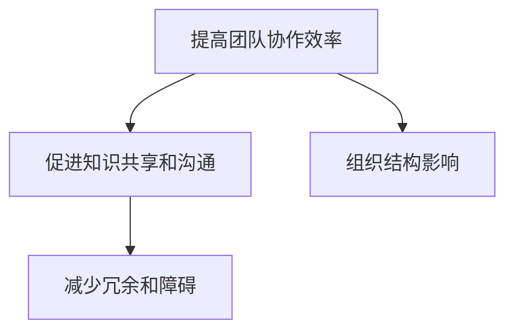

##### 2.2.2 如何调整组织结构以支持创新

调整组织结构以支持创新的策略包括：

- 实施敏捷开发模式：敏捷开发模式强调团队的灵活性和快速响应，有助于团队成员协作和知识共享，提高创新效率。
- 建立跨部门项目组：跨部门项目组有助于打破部门壁垒，促进知识共享和协作，提高创新项目的成功率。
- 设立创新实验室：创新实验室为团队成员提供独立的创新空间和资源支持，鼓励他们进行创新实践和探索。

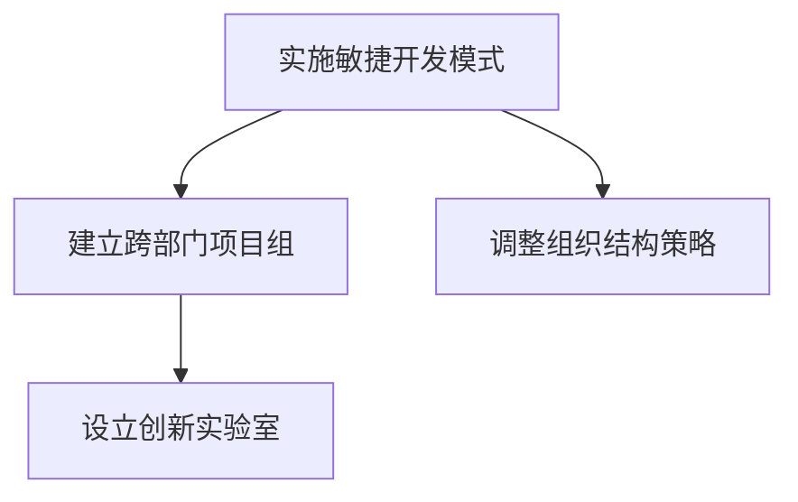

#### 2.3 资源支持

##### 2.3.1 创新所需的资源类型

创新所需的资源类型包括：

- 人力资源：包括创新团队成员的选拔、培养和激励，确保团队成员具备创新能力和实践经验。
- 财务资源：包括创新项目的资金支持，确保创新项目的顺利进行。
- 硬件设施：包括实验室、设备、工具等，为创新提供必要的硬件支持。
- 技术支持：包括软件工具、数据库、云计算等，为创新提供技术保障。

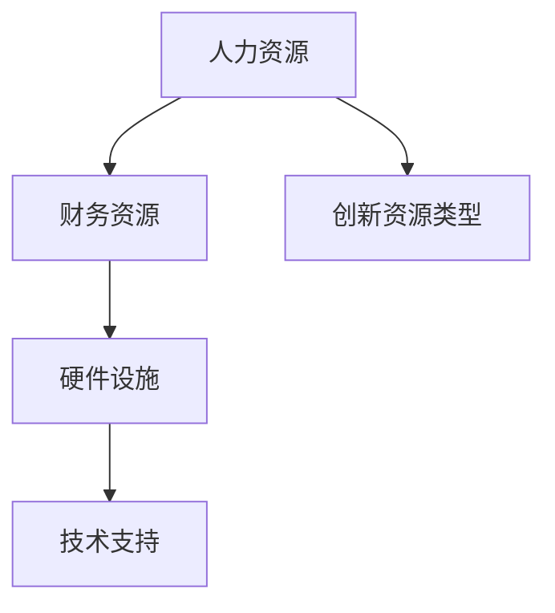

##### 2.3.2 如何有效配置资源以支持创新

有效配置资源以支持创新的策略包括：

- 优先考虑创新项目的资源需求：在资源配置过程中，应优先考虑创新项目的需求，确保创新项目的顺利实施。
- 建立跨部门的资源协调机制：建立跨部门的资源协调机制，促进资源的高效利用和共享，提高创新效率。
- 提供持续的资金支持和预算保障：为创新项目提供持续的资金支持和预算保障，确保创新项目的可持续发展。

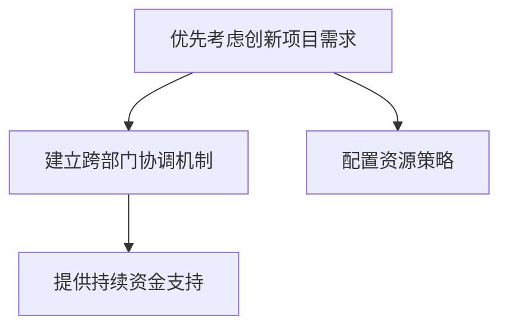

----------------------------------------------------------------

### 第3章 创新型团队的培养

#### 3.1 团队成员的选拔

##### 3.1.1 创新型团队成员的选拔标准

创新型团队成员的选拔标准包括：

- 创造力和创新能力：成员具备独立思考和解决问题的能力，能够提出新的想法和解决方案。
- 沟通和协作能力：成员具备良好的沟通和协作能力，能够与团队成员和外部合作伙伴有效沟通，协同工作。
- 学习和适应能力：成员具备快速学习和适应新环境的能力，能够不断更新知识和技能，适应创新的需求。
- 专业技能和经验：成员具备相关的专业技能和经验，能够为创新项目提供有效的技术支持和解决方案。

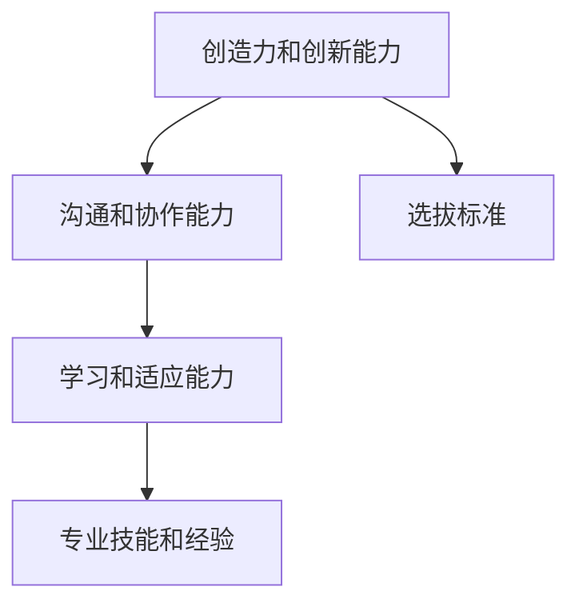

##### 3.1.2 如何进行团队成员的选拔

进行团队成员选拔的方法包括：

- 竞争招聘：通过竞争招聘选拔具有创新能力和专业能力的团队成员，提高团队的整体素质。
- 内部选拔和晋升：通过内部选拔和晋升选拔具有潜力和经验的团队成员，激励员工积极进取，提高团队的创新能力。
- 外部推荐和引进：通过外部推荐和引进选拔具有丰富经验和专业知识的团队成员，为团队注入新的活力和创新思维。

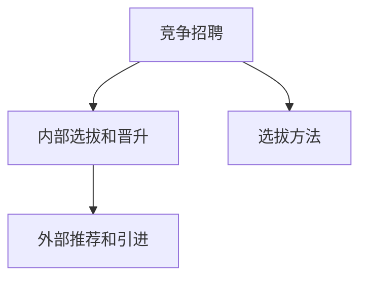

#### 3.2 团队成员的培养

##### 3.2.1 创新型团队成员的培养策略

创新型团队成员的培养策略包括：

- 提供专业培训和技能提升机会：通过专业培训和技能提升机会，帮助团队成员提升专业能力和创新能力。
- 鼓励跨部门和跨领域的交流与合作：通过跨部门和跨领域的交流与合作，拓宽团队成员的视野，提高团队的创新能力。
- 提供实践项目和案例研究：通过实践项目和案例研究，帮助团队成员将所学知识应用到实际工作中，提高实践能力和解决问题的能力。

```mermaid
graph TD
A[提供专业培训和技能提升] --> B[鼓励跨部门和跨领域交流]
B --> C[提供实践项目和案例研究]
A --> D[培养策略]
```

##### 3.2.2 如何进行团队成员的培养

进行团队成员培养的方法包括：

- 制定个性化的培训计划：根据团队成员的实际情况和需求，制定个性化的培训计划，提高培训效果。
- 建立内部导师制度：建立内部导师制度，为团队成员提供指导和帮助，促进团队成员的成长和发展。
- 提供实践项目和挑战机会：通过实践项目和挑战机会，帮助团队成员将所学知识应用到实际工作中，提高实践能力和创新能力。

```mermaid
graph TD
A[制定个性化培训计划] --> B[建立内部导师制度]
B --> C[提供实践项目和挑战机会]
A --> D[培养方法]
```

#### 3.3 团队成员的激励

##### 3.3.1 创新型团队成员的激励方式

创新型团队成员的激励方式包括：

- 薪酬和福利激励：通过具有竞争力的薪酬和福利待遇，激励团队成员的积极性和创新能力。
- 职业发展机会：为团队成员提供职业发展机会，激励他们不断提升自身能力和价值。
- 公开认可和奖励：通过公开认可和奖励，激励团队成员的积极性和创新精神。

```mermaid
graph TD
A[薪酬和福利激励] --> B[职业发展机会]
B --> C[公开认可和奖励]
A --> D[激励方式]
```

##### 3.3.2 如何进行团队成员的激励

进行团队成员激励的方法包括：

- 设定明确的目标和考核标准：通过设定明确的目标和考核标准，激励团队成员努力工作，实现创新目标。
- 提供竞争性的薪酬和福利待遇：通过提供竞争性的薪酬和福利待遇，激励团队成员的积极性和创新能力。
- 定期组织团队活动和奖励仪式：通过定期组织团队活动和奖励仪式，激发团队成员的团队凝聚力和创新精神。

```mermaid
graph TD
A[设定目标和考核标准] --> B[提供薪酬和福利待遇]
B --> C[组织团队活动和奖励仪式]
A --> D[激励方法]
```

----------------------------------------------------------------

### 第4章 创新项目的管理与实施

#### 4.1 创新项目的定义与分类

##### 4.1.1 创新项目的定义

创新项目是指以创新为核心目标的特定任务或活动。创新项目可以是全新的产品、服务或流程，也可以是对现有产品、服务或流程的改进和优化。

##### 4.1.2 创新项目的分类

创新项目可以分为以下几类：

- 产品创新：指开发全新产品或改进现有产品的创新项目。
- 过程创新：指改进或优化现有业务流程的创新项目。
- 管理创新：指改进或优化企业管理方法和策略的创新项目。
- 服务创新：指开发全新服务或改进现有服务的创新项目。

```mermaid
graph TD
A[产品创新] --> B[过程创新]
B --> C[管理创新]
C --> D[服务创新]
A --> E[创新项目分类]
```

#### 4.2 创新项目的管理

##### 4.2.1 创新项目管理的原则

创新项目管理的原则包括：

- 目标导向：明确创新项目的目标和预期成果，确保项目始终围绕目标进行。
- 团队协作：建立有效的团队协作机制，确保团队成员之间的沟通和协作顺畅。
- 风险管理：识别和评估项目风险，制定相应的风险应对策略，降低项目风险。
- 持续改进：通过持续改进和优化项目过程，提高项目的成功率和效率。

```mermaid
graph TD
A[目标导向] --> B[团队协作]
B --> C[风险管理]
C --> D[持续改进]
A --> E[创新项目管理原则]
```

##### 4.2.2 创新项目管理的流程

创新项目管理的流程包括：

- 项目规划：明确项目目标、范围、时间表和资源需求，制定项目计划。
- 项目执行：按照项目计划开展项目工作，确保项目进度和质量。
- 项目监控：监控项目进度、成本和质量，及时调整项目计划，确保项目按计划进行。
- 项目收尾：项目完成后进行总结和评估，分享项目经验和教训，为后续项目提供参考。

```mermaid
graph TD
A[项目规划] --> B[项目执行]
B --> C[项目监控]
C --> D[项目收尾]
A --> E[创新项目管理流程]
```

#### 4.3 创新项目的实施

##### 4.3.1 创新项目实施的方法

创新项目实施的方法包括：

- 团队协作：通过团队协作，确保项目目标的实现，提高项目的成功率和效率。
- 模块化开发：将项目划分为多个模块，逐步实施，降低项目风险和复杂性。
- 快速迭代：通过快速迭代，及时调整和优化项目方案，提高项目的灵活性和适应性。
- 用户反馈：收集用户反馈，根据用户需求调整项目方案，提高项目的实用性和用户体验。

```mermaid
graph TD
A[团队协作] --> B[模块化开发]
B --> C[快速迭代]
C --> D[用户反馈]
A --> E[创新项目实施方法]
```

##### 4.3.2 创新项目实施的关键因素

创新项目实施的关键因素包括：

- 人才队伍：具备创新能力和实践经验的人才队伍是实现创新项目成功的关键。
- 技术支持：先进的技

