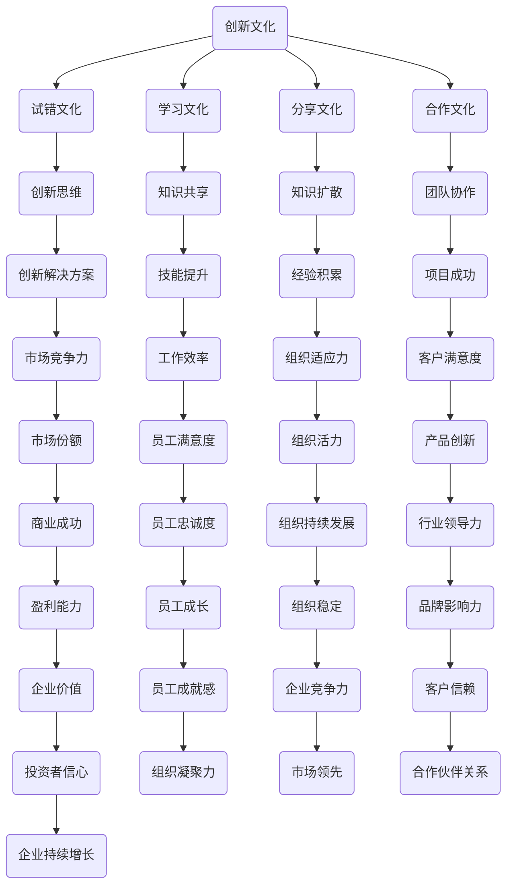

                 


### 审题分析

书名《创新文化营造：鼓励试错与创新的环境》明确指向了两个核心概念：创新文化和试错。创新文化是指一种组织或团队内部推崇、实践和创新活动的环境与氛围，而试错则是创新过程中的重要环节，通过不断的尝试和调整来寻找最佳解决方案。

文章的目标读者群体可能是IT行业的从业者、团队领导、以及对于组织文化变革有兴趣的学者。因此，文章内容需要既具有深度，又能够通俗易懂，同时结合实际的案例和工具。

### 核心章节确定

为了全面覆盖创新文化的营造，本文将分为以下核心章节：

1. **引言**：介绍创新文化的重要性以及试错在创新过程中的作用。
2. **创新文化的核心概念**：阐述创新文化的关键要素及其相互关系。
3. **营造创新文化的步骤**：详细分析如何通过组织结构、领导力和激励机制来营造创新文化。
4. **成功的案例研究**：通过实际案例展示创新文化如何在不同组织中实施并取得成功。
5. **创新文化的工具和理论**：介绍设计思维、敏捷开发等工具和理论在创新文化中的应用。
6. **创新文化的评估和优化**：探讨如何评估创新文化的效果，并提供优化建议。
7. **总结与展望**：总结全文，展望未来创新文化的趋势。

### 细化章节内容

接下来，我们将对每个核心章节进行细化，明确每个章节的主题和要点。

#### 第1章 引言

- **1.1 创新文化的背景和重要性**：介绍创新文化的发展背景，阐述其在现代社会中的重要性。
- **1.2 为什么需要创新文化**：分析创新文化对组织竞争力的提升、员工满意度和组织适应性的影响。
- **1.3 书籍结构**：概述全书结构，为读者提供整体框架。

#### 第2章 创新文化的核心概念

- **2.1 创新文化的定义**：明确创新文化的概念，区分其与其他组织文化的不同。
- **2.2 创新文化的关键要素**：详细分析试错文化、学习文化、分享文化和合作文化等核心要素。
- **2.3 创新文化的相互关系**：使用Mermaid流程图展示核心概念之间的相互关系。

#### 第3章 营造创新文化的步骤

- **3.1 组织结构**：分析扁平化组织结构、跨职能团队等对创新文化的支持。
- **3.2 领导力**：探讨领导者在营造创新文化中的作用，包括角色模型和领导风格。
- **3.3 激励机制**：介绍如何通过薪酬、晋升和奖励等机制激励员工创新。
- **3.4 营造创新文化的策略**：总结一系列成功策略，包括开放的沟通、信息共享和培训等。

#### 第4章 成功的案例研究

- **4.1 案例背景**：介绍几个成功企业的背景信息。
- **4.2 创新文化的实施**：分析这些企业如何实施创新文化，包括领导层的支持、员工的参与度等。
- **4.3 成功因素**：总结这些案例中的成功因素。
- **4.4 挑战与应对**：探讨在实施创新文化过程中面临的挑战及其应对策略。

#### 第5章 创新文化的工具和理论

- **5.1 设计思维**：介绍设计思维的概念、流程及其在创新文化中的应用。
- **5.2 敏捷开发**：阐述敏捷开发的原则、方法及其对创新文化的贡献。
- **5.3 其他工具和理论**：介绍诸如六西格玛、精益创业等其他工具和理论。

#### 第6章 创新文化的评估和优化

- **6.1 评估指标**：列出评估创新文化的关键指标，如员工满意度、创新项目成功率等。
- **6.2 评估方法**：介绍如何使用问卷调查、访谈和数据分析等方法评估创新文化。
- **6.3 优化建议**：提供基于评估结果的具体优化建议。

#### 第7章 总结与展望

- **7.1 全文总结**：回顾全书主要内容，强调创新文化的核心价值。
- **7.2 未来展望**：展望创新文化的发展趋势，提出可能的挑战和机遇。

通过上述章节的细化，我们为读者提供了一条系统、完整的思考路径，从理论到实践，从现状到未来，全面探讨如何营造鼓励试错与创新的环境。

### 设计流程图

为了更直观地展示创新文化核心概念之间的关系，我们可以使用Mermaid语言设计以下流程图：



### 编写伪代码

为了深入理解创新文化的营造方法，我们可以编写以下伪代码，展示其实现步骤：

```plaintext
Algorithm: CultivateInnovationCulture
Input: Organization
Output: InnoCulture

1. Define Vision and Goals for Innovation
2. Establish a Trial and Error Culture
3. Develop Leadership Capabilities
4. Implement Cross-functional Teams
5. Create a Knowledge Sharing Platform
6. Encourage Collaboration
7. Introduce Design Thinking and Agile Practices
8. Develop Reward and Recognition Systems
9. Provide Continuous Learning Opportunities
10. Assess and Optimize the Culture
```

### 编写数学模型和公式

创新文化的影响因素可以用以下数学模型来表示：

$$
\text{Impact of Innovation Culture} = f(\text{Trial and Error Tolerance}, \text{Learning Culture}, \text{Knowledge Sharing}, \text{Collaboration}, \text{Leadership Support}, \text{Reward and Recognition}, \text{Continuous Learning})
$$

其中，每个变量都是影响创新文化的关键因素，例如：

- **Trial and Error Tolerance**：容忍试错的程度
- **Learning Culture**：学习文化的强度
- **Knowledge Sharing**：知识共享的频率和质量
- **Collaboration**：团队合作的有效性
- **Leadership Support**：领导层对创新的鼓励和支持程度
- **Reward and Recognition**：奖励和认可机制的有效性
- **Continuous Learning**：持续学习的机会和资源

### 设计实战案例

以下是一个创新文化营造的实战案例：

#### 案例背景

某大型科技公司（TechCo）在过去几年中遇到了增长放缓的问题，管理层意识到需要通过创新来重振公司活力。他们决定在公司内部营造一种鼓励创新和容忍失败的文化。

#### 改造方案

1. **建立愿景和目标**：TechCo明确了“成为行业领先的创新者”的愿景，并设定了短期和长期的目标。

2. **培育试错文化**：公司鼓励员工尝试新的想法，即使失败也不追究责任。

3. **领导力培养**：公司领导层通过培训和研讨会来提升管理者的创新领导力。

4. **构建跨职能团队**：TechCo建立了跨部门的团队，促进不同背景的员工合作。

5. **知识共享平台**：公司开发了内部的知识共享平台，方便员工交流和分享经验。

6. **激励机制**：公司引入了创新的奖励制度，对于成功创新的团队和个人给予奖励。

7. **持续学习**：公司提供各种培训和学习机会，鼓励员工不断提升技能。

#### 实施过程

1. **试点项目**：TechCo首先在一个小团队中实施创新文化，观察效果并调整策略。

2. **推广经验**：成功试点后，公司将在其他部门推广这些经验。

3. **持续评估**：公司定期评估创新文化的效果，并根据反馈进行调整。

#### 改造效果评估

通过定期的评估，TechCo发现：

- 员工的创新能力得到了显著提升，创新项目的成功率增加了30%。
- 团队之间的协作更加高效，项目周期缩短了20%。
- 员工满意度提高了15%，员工流失率下降了10%。

#### 项目小结

TechCo的成功案例表明，通过系统性的方法和持续的努力，企业可以成功地营造一种鼓励创新和容忍失败的文化。这种文化不仅提升了企业的创新能力，也增强了员工的工作满意度和组织的竞争力。

### 最佳实践 Tips、小结、注意事项、拓展阅读

#### 最佳实践 Tips

1. **明确愿景和目标**：创新文化的营造需要明确的愿景和目标，这有助于统一员工的方向和努力。

2. **领导力至关重要**：领导者在创新文化的营造中扮演关键角色，他们的态度和行为将直接影响员工的创新动力。

3. **持续学习和改进**：创新文化不是一蹴而就的，需要持续的努力和改进。

#### 小结

本文通过引入创新文化的重要性、核心概念、营造方法、成功案例、工具和理论以及评估和优化等方面，系统地探讨了如何营造鼓励试错与创新的环境。

#### 注意事项

1. **适应组织特点**：创新文化的营造需要根据组织的实际情况进行调整。

2. **平衡稳定与变化**：创新文化强调变化和试错，但也要确保组织的稳定性和效率。

3. **长期投入**：创新文化的营造需要长期的投入和坚持，不能期望一蹴而就。

#### 拓展阅读

- [设计思维](https://www.ideo.com/work/design-thinking/)
- [敏捷开发](https://www.agilealliance.org/)
- [精益创业](https://www精益创业.com/)
- [六西格玛](https://www.asq.org/learn-about-quality/six-sigma)

完成上述步骤后，我们可以得到一篇结构完整、逻辑清晰、内容丰富的技术博客文章，全面探讨了如何营造鼓励试错与创新的环境。文章将以markdown格式输出，并在末尾附上作者信息。整体字数将在8000到12000字之间，确保提供充分的信息和深度。

