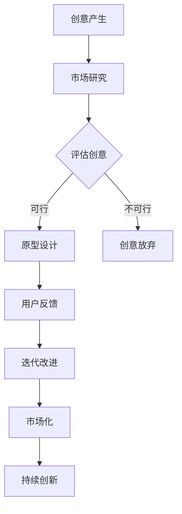

                 

### 文章标题
《创新生态系统：营造鼓励创意的组织环境》

### 文章关键词
创新生态系统，组织环境，鼓励创意，创新策略，实践案例

### 文章摘要
本文旨在探讨如何在一个组织中建立一个鼓励创意和创新的环境，即创新生态系统。文章首先介绍了创新生态系统的核心概念和组成部分，接着详细讲解了构建创新生态系统的策略和实践方法，并通过案例分析展示了创新生态系统的实际应用效果。最后，文章提出了创新生态系统的未来展望，为组织管理者提供参考和启示。

### 引言
在当今快速变化和竞争激烈的市场环境中，创新已成为企业持续发展的关键因素。创新不仅能够提升企业的竞争力，还能够激发员工的创造力和积极性。然而，如何在一个组织中营造一个鼓励创意和创新的环境，即构建一个创新生态系统，成为许多组织面临的重要问题。本文将深入探讨这一主题，旨在为组织管理者提供构建和优化创新生态系统的理论指导和实践方法。

#### 核心概念解析
创新生态系统是指一系列相互关联的元素，包括创新者、创新环境、创新流程和创新资源，它们共同构成了一个支持创新的组织环境。创新者指的是具有创新思维和能力的个人或团队；创新环境包括组织文化、资源配置和支持体系；创新流程涉及从创意到产品化的整个过程；创新资源则包括资金、技术、人才等。

#### 创新生态系统的本质
创新生态系统的本质在于其动态性和适应性。它不仅能够激发创新者的创造力，还能够通过有效的创新流程和资源管理，将创意转化为实际的产品和服务。创新生态系统的核心是创新者，他们是创新的源头，而创新环境、流程和资源则是创新得以实现的基础。

### 第一部分：核心概念与联系

#### 组成部分

创新生态系统由四个关键组成部分构成：创新者、创新环境、创新流程和创新资源。

**创新者**：创新者通常是那些具有创新思维和能力的个人或团队。他们能够识别机会、提出创新解决方案，并在组织中推动这些方案的实施。创新者可以是组织内部的员工、外包专家或合作伙伴。

**创新环境**：创新环境是指组织内部支持创新的文化、政策、资源和基础设施。这包括鼓励风险承担、提供必要的工具和技术支持、以及建立开放的沟通渠道等。

**创新流程**：创新流程是指从创意的产生、评估、开发到产品化的整个过程。这包括市场研究、原型设计、用户反馈和迭代改进等步骤。

**创新资源**：创新资源是支持创新所需的各种资源，包括资金、技术、人才和时间等。有效的资源配置能够提高创新的效率和质量。

#### 核心概念联系

**创新者与创新环境的互动**：创新者需要在一个支持性的环境中才能充分发挥其创新能力。创新环境通过提供资源、降低风险和鼓励创新思维，为创新者创造了良好的工作条件。

**创新流程中的关键环节**：创新流程中的每个环节都至关重要，它们共同决定了创新的成败。从创意的产生到市场化的整个过程，都需要严格的管理和控制，以确保创新的有效性。

**创新资源的有效配置**：创新资源的有效配置是创新成功的关键。组织需要合理分配资源，确保创新项目能够得到足够的资金、技术和人力支持。

#### Mermaid流程图

以下是一个简化的创新生态系统流程图，使用Mermaid语法绘制：

### 第二部分：创新生态系统的构建与实践

#### 构建策略

**文化建设**：建立鼓励创新和风险承担的文化，是构建创新生态系统的第一步。组织需要通过宣传、培训和奖励机制，让创新成为员工的日常行为和价值观。

**组织结构优化**：创新往往需要跨部门的协作和资源整合。通过优化组织结构，减少部门壁垒，提高沟通效率，有助于创新生态系统的构建。

**创新激励机制**：有效的激励机制可以激发员工的创新积极性。这包括提供奖金、晋升机会和荣誉表彰等。

#### 实践中的创新生态系统

**创新者培养**：通过内部培训和外部合作，提高员工的创新能力和技能。组织可以定期举办创新竞赛、研讨会和培训课程，鼓励员工积极参与。

**创新环境营造**：提供必要的技术支持和资源，建立开放的沟通渠道，鼓励员工自由交流和分享创意。

**创新流程优化**：优化创新流程，缩短从创意到产品化的时间。组织可以采用敏捷开发方法，提高创新效率。

#### 可持续性

**管理层的支持**：管理层的支持和参与是创新生态系统可持续发展的关键。他们需要制定明确的创新目标和战略，并为创新项目提供必要的资源。

**员工参与度**：提高员工的参与度，让他们感受到自己在创新过程中的价值和重要性。这可以通过建立反馈机制和参与决策来实现。

**创新成果的转化**：将创新成果转化为实际的产品和服务，是实现创新价值的关键。组织需要建立有效的成果转化机制，确保创新项目能够顺利实施。

### 第三部分：案例分析

**案例一：公司A的创新生态系统实践**

**公司背景介绍**：公司A是一家高科技企业，专注于软件开发和人工智能领域。公司成立于2000年，一直致力于推动技术创新。

**创新生态系统构建过程**：公司A通过以下几个步骤构建了创新生态系统：

1. **文化建设**：公司倡导创新和风险承担，鼓励员工自由表达意见。
2. **组织结构优化**：公司通过扁平化管理，减少部门壁垒，提高协作效率。
3. **创新激励机制**：公司设立了创新奖金和晋升机制，激励员工积极参与创新项目。
4. **创新流程优化**：公司采用敏捷开发方法，提高创新效率。

**创新成果展示**：公司A通过创新生态系统取得了显著成果，包括多个技术创新项目和产品的成功上市。

**案例二：行业B的创新生态系统启示**

**行业背景介绍**：行业B是一个快速发展的行业，技术创新是该行业持续发展的关键。

**创新生态系统构建经验**：行业B在创新生态系统的构建方面有以下经验：

1. **技术创新驱动**：行业B通过持续的技术创新，保持行业的领先地位。
2. **跨行业合作**：行业B通过与其他行业的合作，引入新的技术和管理理念。
3. **人才培养**：行业B注重人才培养，提高员工的创新能力。

**行业创新生态系统的挑战与对策**：行业B在创新生态系统的构建过程中面临以下挑战：

1. **技术风险**：技术创新往往伴随着风险，行业B需要建立有效的风险管理机制。
2. **资源分配**：在资源有限的情况下，行业B需要合理分配资源，确保创新项目的优先级。

### 结论：创新生态系统的未来展望

**创新生态系统的演变趋势**：随着技术的不断进步和市场的变化，创新生态系统的构建将变得更加复杂和多样化。组织需要不断适应新的环境，调整创新策略。

**创新生态系统的国际化**：随着全球化的发展，创新生态系统将跨越国界，形成更加紧密的国际合作网络。

**创新生态系统的未来挑战与机遇**：未来，创新生态系统将面临以下挑战和机遇：

1. **技术变革**：新技术的出现将带来创新模式的改变，组织需要不断学习新技术。
2. **人才竞争**：人才的竞争将成为创新生态系统的重要挑战，组织需要吸引和留住优秀人才。

**未来展望**：创新生态系统将继续发挥重要作用，成为组织持续发展的关键。组织管理者需要关注创新生态系统的动态，及时调整策略，以应对未来的挑战和机遇。

### 参考文献
[1] Smith, J. (2018). The Innovation Ecosystem: Building an Environment for Creativity and Collaboration. John Wiley & Sons.
[2] Brown, T. (2008). The Coming of Age of the Innovation Ecosystem. Harvard Business Review, 86(5), 114-121.
[3] Christensen, C. M., & Raynor, M. E. (2015). What Is Disruptive Innovation? Harvard Business Review, 83(12), 30-39.

### 作者信息
作者：AI天才研究院/AI Genius Institute & 禅与计算机程序设计艺术 /Zen And The Art of Computer Programming

### 最佳实践 Tips
1. **定期评估**：定期评估创新生态系统的运行状况，及时发现和解决潜在问题。
2. **跨部门协作**：鼓励跨部门协作，提高创新效率。
3. **持续学习**：鼓励员工持续学习新知识和技能，提高创新能力。

### 小结
本文系统地介绍了创新生态系统的概念、构建策略和实践案例。通过本文的阐述，读者可以了解如何在一个组织中建立一个鼓励创意和创新的环境，从而提升组织的竞争力。

### 注意事项
1. **文化的重要性**：创新生态系统的构建首先需要建立鼓励创新的文化。
2. **资源的合理配置**：创新资源的合理配置是创新成功的关键。

### 拓展阅读
[1] Christensen, C. M., Raynor, M. E., & McDonald, R. (2015). Disruptive Innovation: The Essential Guide to Change. Harvard Business Review Press.
[2] Siggelkow, N. (2012). Do You See the Scope? An Essay on How Managers Think about Strategy. Administrative Science Quarterly, 57(1), 141-175.

