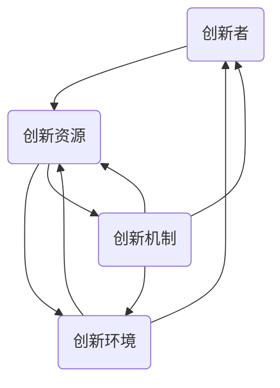
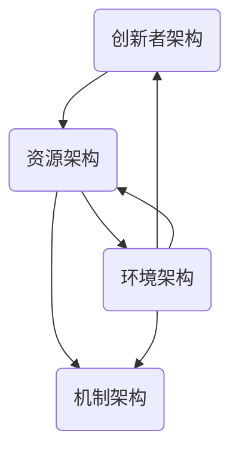

                 

## 文章标题

### 《创新生态：打造鼓励创意与冒险的环境》

### 关键词

- 创新生态
- 创意激励
- 冒险管理
- 组织文化
- 案例分析

### 摘要

本文深入探讨了创新生态的构建，分析了其重要性以及如何为企业营造一个鼓励创意与冒险的环境。通过理论阐述、实战案例以及最佳实践，本文提供了全面的方法论，帮助企业提升创新能力，实现可持续发展。

## 引言

在当今竞争激烈的市场环境中，创新能力已成为企业生存与发展的关键。然而，许多企业在尝试推动创新时，常常面临一系列挑战，如内部阻力、资源不足、激励机制缺失等。为了克服这些障碍，企业需要构建一个完善的创新生态，激发员工的创意思维和冒险精神。

创新生态不仅仅是一个物理空间，它更是一种组织文化、管理机制和资源整合的综合体现。一个良好的创新生态能够促进知识共享、激发团队协作，并为企业提供源源不断的创新动力。

本文将首先介绍创新生态的概念与理论，然后分析创意与冒险的激励机制，接着通过实战案例分析，探讨成功经验与教训。最后，本文将讨论组织与文化对创新生态的支持，并总结出最佳实践和注意事项。

### 创新生态的概念与理论

创新生态是一个复杂而多维的系统，涉及多个核心概念和理论。首先，我们需要理解创新生态的基本组成元素，包括创新者、创新资源、创新环境以及创新机制。

#### 核心概念与联系

创新者：创新生态中的核心角色，包括企业员工、合作伙伴、外部专家等。创新者是创意的源泉，他们的思维和技能是推动创新的重要力量。

创新资源：包括资金、技术、信息、人才等。这些资源是创新活动的物质基础，为创新者提供了必要的支持。

创新环境：包括企业文化、政策环境、市场环境等。创新环境直接影响创新者的工作状态和创造力。

创新机制：包括激励机制、评估机制、反馈机制等。创新机制确保创新活动的有序进行，激励创新者的积极性。

下面，我们可以使用Mermaid流程图来展示这些核心概念之间的联系：

#### 创新生态的理论基础与发展历程

创新生态的理论基础可以追溯到经济学和管理学的相关理论。例如，熊彼特的“创新理论”强调了创新在经济增长中的关键作用。而近年来，随着信息技术的发展，创新生态的理论体系也在不断丰富和完善。

创新生态的发展历程可以分为几个阶段：

1. **萌芽阶段**：20世纪80年代，创新生态的概念开始萌芽，主要关注内部创新机制的构建。

2. **发展阶段**：20世纪90年代，随着互联网的兴起，创新生态开始重视外部资源的整合和协同创新。

3. **成熟阶段**：21世纪初，创新生态理论逐渐成熟，开始探讨如何通过创新环境和文化塑造来提升整体创新能力。

4. **演进阶段**：近年来，随着大数据、人工智能等新兴技术的应用，创新生态的理论体系也在不断演进，更加强调跨界合作和智能化管理。

#### 创新生态的架构设计

为了构建一个有效的创新生态，企业需要从以下几个方面进行架构设计：

1. **创新者架构**：明确创新者的角色和职责，建立多层次的创新团队，鼓励不同背景和技能的人才参与创新活动。

2. **资源架构**：整合内外部资源，建立资源池，确保创新者能够随时随地获取所需资源。

3. **环境架构**：优化创新环境，包括提供舒适的工作空间、制定有利于创新的规章制度、营造积极的企业文化等。

4. **机制架构**：建立完善的创新机制，包括激励机制、评估机制、反馈机制等，确保创新活动有序进行。

同样，我们可以使用Mermaid流程图来展示创新生态的架构设计：

### 创意与冒险的激励机制

在创新生态中，激励机制是激发员工创意思维和冒险精神的重要手段。一个有效的激励机制能够提高员工的积极性和创造力，从而推动整个创新生态的发展。

#### 激励创意的激励机制设计

1. **目标明确**：明确创新目标和预期成果，让员工了解创新的重要性和具体要求。

2. **奖励机制**：设立创新奖励，包括奖金、晋升、荣誉等，激励员工积极参与创新活动。

3. **反馈机制**：建立有效的反馈机制，及时反馈员工创新成果，增强员工的成就感。

4. **权益保障**：保障员工在创新过程中的权益，包括知识产权保护、职业发展等。

#### 冒险风险的评估与管理

1. **风险评估**：对创新项目进行风险评估，识别潜在风险，制定应对策略。

2. **风险管理**：建立风险管理机制，包括风险预警、风险控制、风险转移等。

3. **适应能力**：提高企业的适应能力，灵活调整创新策略，应对外部环境变化。

### 实战案例分析

为了更好地理解如何构建和创新生态，我们可以通过一些成功的案例进行分析。

#### 案例一：谷歌的创新生态

谷歌以其独特的创新文化著称，其成功的关键在于以下方面：

1. **开放式创新**：谷歌鼓励员工跨部门合作，开放资源，实现知识共享。

2. **激励机制**：谷歌设立了一系列创新奖励，包括谷歌创新奖、杰出创新奖等，激励员工积极参与创新活动。

3. **员工权益**：谷歌提供良好的工作环境和职业发展机会，保障员工在创新过程中的权益。

通过这些措施，谷歌成功地构建了一个充满活力和创造力的创新生态，推动了公司的持续发展。

#### 案例二：苹果的创新生态

苹果以其极致的产品设计和创新技术闻名于世，其成功经验主要体现在以下几个方面：

1. **专注核心**：苹果始终专注于其核心业务，不断推陈出新，提升产品竞争力。

2. **高风险投资**：苹果在创新过程中勇于承担风险，投资于具有颠覆性的技术项目。

3. **用户体验**：苹果注重用户体验，将创新与用户体验紧密结合，提升用户满意度。

通过这些实践，苹果成功地构建了一个高效的创新生态，持续引领全球科技潮流。

### 组织与文化的支持

创新生态的构建离不开组织与文化的支持。一个积极向上的组织文化和有效的组织结构能够为创新生态提供强大的支撑。

#### 组织结构对创新生态的影响

1. **扁平化组织**：扁平化的组织结构能够减少层级障碍，促进信息流通和团队合作。

2. **跨部门协作**：跨部门协作能够整合不同领域的资源和知识，推动创新。

3. **敏捷组织**：敏捷组织能够快速响应市场变化，灵活调整创新策略。

#### 企业文化的塑造与传承

1. **创新文化**：企业需要塑造一种鼓励创新、容忍失败的文化氛围，激发员工的创造力。

2. **学习文化**：企业需要鼓励员工不断学习和成长，提升整体创新能力。

3. **共享文化**：企业需要建立知识共享机制，促进员工之间的交流与合作。

#### 创新生态与员工个人发展

1. **职业发展**：企业应为员工提供清晰的职业发展路径，激励员工不断提升自身能力。

2. **技能培训**：企业应定期组织技能培训和知识分享活动，提升员工的专业水平。

3. **激励机制**：企业应设立激励机制，激励员工积极参与创新活动，分享创新成果。

### 总结

创新生态是企业持续发展的关键，通过构建一个鼓励创意与冒险的环境，企业能够激发员工的创新潜力，推动技术的进步和市场的拓展。本文从理论阐述、实战案例和最佳实践三个方面，全面探讨了创新生态的构建方法。企业应根据自身情况，灵活运用这些方法，打造一个高效的创新生态，实现持续创新和可持续发展。

### 最佳实践 Tips

1. **明确创新目标**：确保创新活动与企业的长期战略目标一致，提高创新活动的有效性。

2. **激励机制合理**：根据员工的特点和需求，设计合理的激励机制，激发员工的创新动力。

3. **风险管理**：建立完善的风险评估和风险管理机制，确保创新项目的顺利实施。

4. **知识共享**：鼓励员工跨部门合作，建立知识共享平台，提升整体创新能力。

5. **持续改进**：不断创新和完善创新生态，适应市场和环境的变化，保持企业的竞争力。

### 注意事项

1. **尊重知识产权**：在创新过程中，尊重知识产权，避免侵犯他人的合法权益。

2. **保障员工权益**：确保员工在创新过程中的权益，提升员工的工作积极性和创造力。

3. **避免盲目创新**：根据企业的实际情况，合理规划创新项目，避免盲目跟风。

### 拓展阅读

1. **《创新者的窘境》**：克莱顿·克里斯滕森著，深入探讨了企业在创新过程中的挑战和应对策略。

2. **《创意的源泉》**：大卫·凯斯著，介绍了激发创意思维的方法和技巧。

3. **《创新者的基因》**：杰夫·德威特著，分析了成功创新者的思维模式和习惯。

### 作者信息

- 作者：AI天才研究院/AI Genius Institute & 禅与计算机程序设计艺术 /Zen And The Art of Computer Programming

本文由AI天才研究院与禅与计算机程序设计艺术共同撰写，旨在为读者提供有关创新生态的深入见解和实践指导。希望本文能够帮助您构建一个高效的创新生态，推动企业的持续发展。

