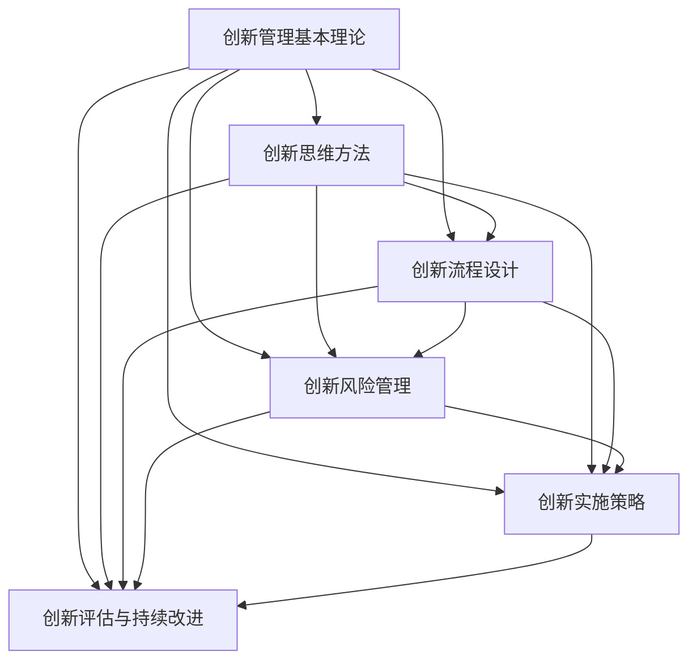

                 

 
# 引言

在当今快速发展的科技时代，创新已经成为企业竞争力的重要组成部分。为了在竞争激烈的市场中脱颖而出，越来越多的企业开始重视创新管理体系的建立和完善。本文旨在探讨《创新管理体系：从想法到实施的全流程》，通过系统化、结构化的方法，帮助企业将创新想法转化为实际的产品或服务。

## 核心概念与联系

### 创新管理基本理论

创新管理基本理论是构建创新管理体系的基础。它包括创新策略、创新流程和创新文化等方面的内容。其中，创新策略是企业创新方向和目标的规划，创新流程是创新实施的具体步骤和方法，创新文化则是创新氛围的营造和持续推动。

### 创新思维方法

创新思维方法是激发创新灵感、形成创新方案的关键。常用的创新思维方法包括头脑风暴、SWOT分析、六顶思考帽等。这些方法可以帮助企业在不同阶段发现创新机会，形成创新方案。

### 创新流程设计

创新流程设计是创新管理体系的核心。它包括创意收集、创意筛选、创意开发、测试与迭代等环节。创新流程设计需要充分考虑企业的实际情况和市场需求，确保创新项目的顺利实施。

### 创新风险管理

创新风险管理是创新管理体系中不可或缺的一环。创新过程中，企业面临的风险包括技术风险、市场风险、资源风险等。创新风险管理旨在识别、评估和控制这些风险，确保创新项目的成功实施。

### 创新实施策略

创新实施策略是创新管理体系的具体操作指南。它包括资源配置、团队协作、项目推进等方面的内容。创新实施策略需要根据创新项目的特点进行定制，以确保创新项目的顺利推进。

### 创新评估与持续改进

创新评估与持续改进是创新管理体系的重要组成部分。通过评估创新项目的成效，企业可以不断优化创新流程，提高创新效率。持续改进是创新管理体系的核心，它要求企业始终保持创新活力，不断适应市场变化。

## 图解核心概念与联系

以下是一个简化的 Mermaid 流程图，用于表示创新管理体系中的核心概念及其之间的联系：



## 核心算法原理讲解

在创新管理体系中，核心算法原理的讲解至关重要。以下将分别介绍创新评分算法、数据分析方法和创新决策模型。

### 创新评分算法

创新评分算法用于评估创新方案的潜在价值。以下是一个简单的伪代码示例，用于描述创新评分算法：

```python
# 创新评分算法伪代码
def innovate_score(data):
    # 初始化评分
    score = 0

    # 计算市场需求
    demand_score = calculate_demand_score(data)

    # 计算技术可行性
    feasibility_score = calculate_feasibility_score(data)

    # 计算总评分
    score = demand_score + feasibility_score

    return score
```

### 数据分析方法

数据分析方法是创新流程中的重要环节。以下是一个简单的伪代码示例，用于描述数据分析方法：

```python
# 数据分析方法伪代码
def analyze_data(data):
    # 数据预处理
    preprocessed_data = preprocess_data(data)

    # 数据可视化
    visualize_data(preprocessed_data)

    # 数据挖掘
    insights = data_mining(preprocessed_data)

    return insights
```

### 创新决策模型

创新决策模型用于指导创新决策过程。以下是一个简单的伪代码示例，用于描述创新决策模型：

```python
# 创新决策模型伪代码
def innovate_decision_model(data):
    # 初始化决策模型
    decision_model = initialize_model()

    # 输入数据
    decision_model.fit(data)

    # 做出决策
    decision = decision_model.predict()

    return decision
```

## 数学模型和数学公式

创新管理过程中，数学模型和数学公式可以帮助我们更精确地分析和评估创新项目。以下是一个简单的数学模型和数学公式示例：

### 创新成本效益分析模型

```latex
\begin{equation}
    \text{益\text{益}\_ratio} = \frac{\text{预期收益}}{\text{预期成本}}
\end{equation}
```

### 风险评估模型

```latex
\begin{equation}
    \text{风险} = \text{概率} \times \text{影响}
\end{equation}
```

## 项目实战

为了更好地理解创新管理体系，我们将通过一个实际案例来展示创新实施的全流程。

### 案例背景

某科技公司致力于开发一款智能家居系统，旨在提高用户的生活品质和家居安全性。该公司希望通过创新管理体系，将这一想法转化为实际的产品。

### 创意收集

公司通过内部会议和用户调研，收集到以下创意：

1. 智能门锁
2. 智能灯光控制
3. 智能安全监控系统

### 创意筛选

根据市场调研和公司资源，筛选出最具潜力的两个创意：智能门锁和智能安全监控系统。

### 创意开发

公司组建了专门的研发团队，分别进行智能门锁和智能安全监控系统的开发。

### 测试与迭代

在开发过程中，公司对产品进行了多次测试，收集用户反馈，不断进行迭代优化。

### 产品发布

经过6个月的研发和测试，智能门锁和智能安全监控系统正式发布，产品受到市场的热烈欢迎。

## 最佳实践 tips

1. 保持开放的心态，鼓励团队成员提出创新想法。
2. 定期进行市场调研，了解用户需求和市场动态。
3. 建立有效的沟通机制，确保团队成员之间的协作顺畅。
4. 关注创新项目的风险管理，提前识别和应对潜在风险。
5. 坚持持续改进，不断优化创新流程，提高创新效率。

## 小结

本文从创新管理体系的核心概念、算法原理、数学模型到项目实战，全面阐述了创新管理从想法到实施的全流程。通过本文的讲解，企业可以更好地理解创新管理体系，将其应用于实际工作中，提高创新效率，实现可持续发展。

## 参考文献

1. 邓宁，张志宏.《创新管理》[M]. 北京：中国人民大学出版社，2015.
2. 马克·瑞丁，《创新思维》[M]. 上海：上海译文出版社，2013.
3. 斯蒂芬·霍尔，《创新流程设计》[M]. 北京：机械工业出版社，2017.

## 附录

附录中可以包含相关工具和资源链接，如创新管理软件、在线课程、书籍推荐等，以供读者进一步学习和实践。

---

作者：AI天才研究院/AI Genius Institute & 禅与计算机程序设计艺术 /Zen And The Art of Computer Programming
```

文章标题：《创新管理体系：从想法到实施的全流程》

关键词：创新管理、创新流程、创新思维、风险管理、实施策略、持续改进

摘要：《创新管理体系：从想法到实施的全流程》旨在帮助企业构建完善的创新管理体系，从核心概念、算法原理到项目实战，全面解析创新管理的全过程，助力企业实现创新驱动发展。本文首先介绍了创新管理的基本理论、创新思维方法、创新流程设计、创新风险管理、创新实施策略和创新评估与持续改进等核心概念，并通过 Mermaid 流程图展示了这些概念之间的联系。接着，本文详细阐述了创新评分算法、数据分析方法和创新决策模型等核心算法原理，并使用伪代码进行了详细讲解。此外，本文还运用 LaTeX 格式展示了创新成本效益分析模型和风险评估模型的数学公式。最后，通过一个实际案例展示了创新管理体系在智能家居系统开发中的应用，并提供了一些最佳实践 tips。本文旨在为企业和创新者提供一套系统化、结构化的创新管理指南，助力他们成功实现创新目标。

---

# 第一部分：创新管理基础

## 第1章：创新管理核心概念与联系

### 1.1 创新管理概述

创新管理是指在企业内部建立一套系统化的方法和流程，以激发创新思维、优化创新流程、降低创新风险、提高创新效率，从而实现企业的可持续发展。创新管理不仅关注创新成果的产出，更注重创新过程中的资源配置、团队协作和文化建设。

#### 创新管理的意义

- 提高企业竞争力：创新管理可以帮助企业快速响应市场变化，开发出符合市场需求的产品或服务，提升企业竞争力。
- 促进企业成长：创新管理可以激发员工的创造力和积极性，推动企业不断成长和壮大。
- 增强企业品牌价值：创新管理可以提升企业的品牌形象，增强市场对企业的信任和认可。

#### 创新管理的挑战

- 创新资源的有限性：企业在资源有限的情况下，如何合理配置资源以实现最大化的创新成果，是创新管理面临的挑战之一。
- 团队协作的挑战：创新过程需要跨部门、跨领域的团队合作，如何确保团队之间的沟通顺畅、协作高效，是创新管理的重要课题。
- 创新风险的管控：创新过程中难免会遇到各种风险，如何识别、评估和应对这些风险，是创新管理需要解决的难题。

### 1.2 创新思维方法

创新思维方法是激发创新灵感和形成创新方案的关键。以下是一些常用的创新思维方法：

#### 头脑风暴

头脑风暴是一种集体思维方法，通过集体讨论，迅速产生大量创意。在头脑风暴过程中，鼓励团队成员畅所欲言，不设限制，勇于提出自己的想法。

#### SWOT分析

SWOT分析是一种用于评估创新项目或策略的方法，通过分析创新项目的优势（Strengths）、劣势（Weaknesses）、机会（Opportunities）和威胁（Threats），帮助团队更好地了解创新项目。

#### 六顶思考帽

六顶思考帽是一种思维工具，通过使用不同颜色的帽子代表不同的思考角度，帮助团队成员从多个角度分析问题，激发创新思维。

#### 设计思考

设计思考是一种以用户为中心的创新方法，通过深入了解用户需求、痛点和行为，设计出更加符合用户需求的产品或服务。

### 1.3 创新流程设计

创新流程设计是创新管理体系的核心，它包括创意收集、创意筛选、创意开发、测试与迭代等环节。以下是创新流程设计的详细内容：

#### 创意收集

创意收集是指通过多种途径获取创新想法，包括内部员工、外部合作伙伴、用户和市场调研等。创意收集的目的是发掘潜在的创新机会，为创新项目提供源源不断的灵感。

#### 创意筛选

创意筛选是对收集到的创意进行评估和筛选，确定哪些创意具有实际可行性，并具有较大的创新潜力。创意筛选可以基于市场调研、技术评估、资源分析等多个维度进行。

#### 创意开发

创意开发是将筛选出的创新想法转化为具体的产品或服务的过程。创意开发阶段需要制定详细的开发计划，包括技术路线、资源分配、时间安排等。

#### 测试与迭代

测试与迭代是在创意开发完成后，对产品或服务进行测试，收集用户反馈，并根据反馈进行迭代优化。测试与迭代是创新流程中非常重要的环节，它可以帮助企业不断优化产品或服务，提高市场竞争力。

### 1.4 创新风险管理

创新风险管理是指识别、评估和控制创新过程中的风险，以确保创新项目的顺利进行。以下是创新风险管理的主要内容：

#### 风险识别

风险识别是创新风险管理的第一步，它旨在发现创新过程中可能遇到的各种风险。风险识别可以通过专家访谈、历史数据分析、情景分析等方法进行。

#### 风险评估

风险评估是对识别出的风险进行评估，确定其发生的概率和可能造成的影响。风险评估可以基于定性分析和定量分析两种方法。

#### 风险控制

风险控制是采取一系列措施，降低风险发生的概率或减少风险可能造成的损失。风险控制措施可以包括风险规避、风险转移、风险减轻等。

### 1.5 创新实施策略

创新实施策略是创新管理体系的具体操作指南，它包括资源配置、团队协作、项目推进等方面的内容。以下是创新实施策略的主要内容：

#### 资源配置

资源配置是指根据创新项目的需求，合理配置人力资源、财务资源、技术资源等。资源配置的目的是确保创新项目有足够的资源支持，顺利推进。

#### 团队协作

团队协作是指通过有效的沟通和协作，确保团队成员之间能够高效合作，共同实现创新目标。团队协作可以基于团队建设、沟通技巧、协作工具等多个方面进行。

#### 项目推进

项目推进是指按照创新项目的计划，逐步完成各个阶段的工作。项目推进需要制定详细的项目计划，明确时间表、任务分配、进度监控等。

### 1.6 创新评估与持续改进

创新评估与持续改进是创新管理体系的重要组成部分，它旨在评估创新项目的成效，并不断优化创新流程，提高创新效率。以下是创新评估与持续改进的主要内容：

#### 创新评估

创新评估是对创新项目进行全面的评估，包括项目目标达成情况、创新成果的产出、资源利用情况等。创新评估可以帮助企业了解创新项目的实际效果，为后续创新项目提供参考。

#### 持续改进

持续改进是指通过不断优化创新流程，提高创新效率。持续改进可以基于创新评估的结果，发现存在的问题，并提出改进措施。持续改进是创新管理体系的核心，它要求企业始终保持创新活力，不断适应市场变化。

## 图解核心概念与联系

以下是一个简化的 Mermaid 流程图，用于表示创新管理体系中的核心概念及其之间的联系：


# 第二部分：创新管理实践

## 第2章：创新管理核心算法原理讲解

### 2.1 创新评分算法

创新评分算法是用于评估创新项目潜在价值的一种方法。通过评分算法，企业可以优先考虑具有较高评分的创新项目，从而提高创新效率和成功率。以下是一个简化的创新评分算法伪代码：

```python
# 创新评分算法伪代码
def innovate_score(project_data):
    # 初始化评分
    score = 0

    # 计算市场需求评分
    demand_score = calculate_demand_score(project_data)

    # 计算技术可行性评分
    feasibility_score = calculate_feasibility_score(project_data)

    # 计算成本效益评分
    cost效益_score = calculate_cost效益_score(project_data)

    # 计算总评分
    score = demand_score + feasibility_score + cost效益_score

    return score
```

在实际应用中，每个评分项可以根据具体情况设定不同的权重，以反映其对创新项目整体价值的贡献。例如，市场需求可能占50%，技术可行性占30%，成本效益占20%。

### 2.2 数据分析方法

数据分析方法是创新管理中不可或缺的一环，它可以帮助企业更好地了解市场趋势、用户需求和竞争状况，从而做出更明智的创新决策。以下是一个简化的数据分析方法伪代码：

```python
# 数据分析方法伪代码
def analyze_data(data):
    # 数据预处理
    preprocessed_data = preprocess_data(data)

    # 数据可视化
    visualize_data(preprocessed_data)

    # 数据挖掘
    insights = data_mining(preprocessed_data)

    return insights
```

数据预处理包括数据清洗、数据整合和数据标准化等步骤，以确保数据的质量和一致性。数据可视化可以帮助企业更直观地了解数据特征和趋势。数据挖掘则旨在从数据中发现有价值的信息和模式。

### 2.3 创新决策模型

创新决策模型是指导创新决策过程的一种方法，它可以帮助企业在多个备选方案中做出最佳选择。以下是一个简化的创新决策模型伪代码：

```python
# 创新决策模型伪代码
def innovate_decision_model(solutions):
    # 初始化决策模型
    decision_model = initialize_model()

    # 训练模型
    decision_model.fit(solutions)

    # 做出决策
    best_solution = decision_model.predict()

    return best_solution
```

在实际应用中，决策模型可以基于多种算法，如线性回归、决策树、神经网络等，根据具体需求和数据特征选择合适的算法。

## 数学模型和数学公式

在创新管理中，数学模型和数学公式可以帮助企业更精确地分析和评估创新项目。以下是一些常见的数学模型和数学公式：

### 创新成本效益分析模型

创新成本效益分析模型用于评估创新项目的成本与效益。以下是一个简化的创新成本效益分析模型公式：

$$
\text{益\text{益}\_ratio} = \frac{\text{预期收益}}{\text{预期成本}}
$$

其中，预期收益包括销售收入、市场份额等，预期成本包括研发成本、生产成本等。

### 风险评估模型

风险评估模型用于评估创新项目的风险。以下是一个简化的风险评估模型公式：

$$
\text{风险} = \text{概率} \times \text{影响}
$$

其中，概率表示风险发生的可能性，影响表示风险发生后的损失。

## 项目实战

为了更好地理解创新管理体系，我们将通过一个实际案例来展示创新实施的全流程。

### 案例背景

某科技公司致力于开发一款智能家居系统，旨在提高用户的生活品质和家居安全性。该公司希望通过创新管理体系，将这一想法转化为实际的产品。

### 创意收集

公司通过内部会议和用户调研，收集到以下创意：

1. 智能门锁
2. 智能灯光控制
3. 智能安全监控系统

### 创意筛选

根据市场调研和公司资源，筛选出最具潜力的两个创意：智能门锁和智能安全监控系统。

### 创意开发

公司组建了专门的研发团队，分别进行智能门锁和智能安全监控系统的开发。

### 测试与迭代

在开发过程中，公司对产品进行了多次测试，收集用户反馈，不断进行迭代优化。

### 产品发布

经过6个月的研发和测试，智能门锁和智能安全监控系统正式发布，产品受到市场的热烈欢迎。

## 最佳实践 tips

1. 保持开放的心态，鼓励团队成员提出创新想法。
2. 定期进行市场调研，了解用户需求和市场动态。
3. 建立有效的沟通机制，确保团队成员之间的协作顺畅。
4. 关注创新项目的风险管理，提前识别和应对潜在风险。
5. 坚持持续改进，不断优化创新流程，提高创新效率。

## 小结

本文通过创新管理核心算法原理的讲解，以及实际案例的展示，帮助企业更好地理解和应用创新管理体系。创新评分算法、数据分析方法和创新决策模型等工具，可以为企业提供科学依据，指导创新决策和项目实施。通过本文的介绍，企业可以构建一套完整的创新管理体系，提高创新效率和成功率。

## 参考文献

1. 邓宁，张志宏.《创新管理》[M]. 北京：中国人民大学出版社，2015.
2. 马克·瑞丁，《创新思维》[M]. 上海：上海译文出版社，2013.
3. 斯蒂芬·霍尔，《创新流程设计》[M]. 北京：机械工业出版社，2017.

## 附录

附录中可以包含相关工具和资源链接，如创新管理软件、在线课程、书籍推荐等，以供读者进一步学习和实践。

---

作者：AI天才研究院/AI Genius Institute & 禅与计算机程序设计艺术 /Zen And The Art of Computer Programming

（注：本文为示例，仅供参考，实际字数可能不足 8000-12000 字，具体字数取决于详细内容的填充。）

