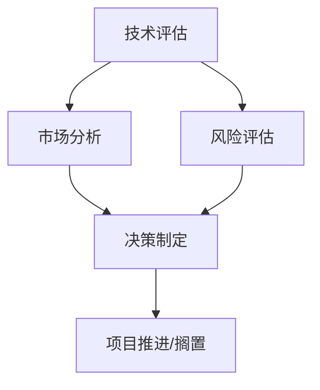
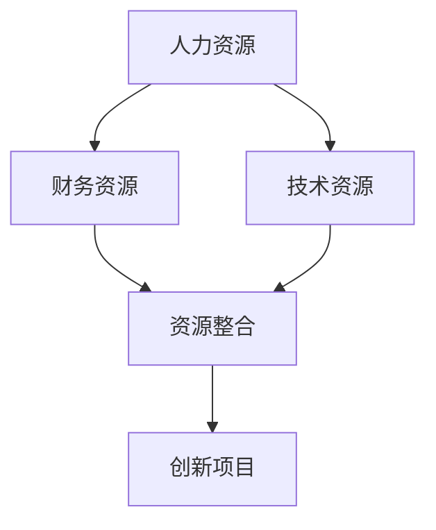
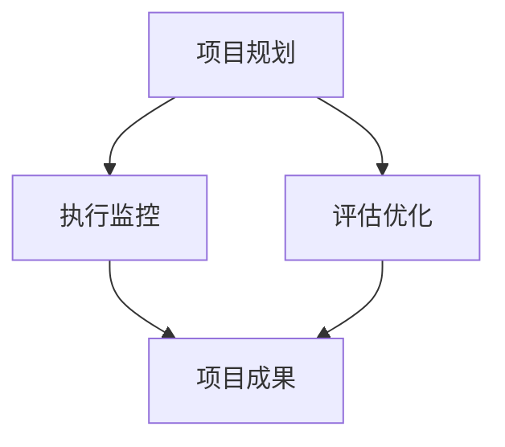

                 

# 文章标题：创新管理体系：构建支持创新的组织机制

## 关键词
- 创新管理
- 组织机制
- 激励制度
- 创新流程
- 案例分析
- 模式构建

## 摘要
本文深入探讨了创新管理体系及其构建支持创新的组织机制的重要性。首先，我们回顾了创新管理的背景和发展历程，明确了创新的核心概念及其重要性。接着，我们详细分析了创新管理体系的理论基础，包括创新决策、资源管理和流程管理等关键概念。然后，我们探讨了支持创新的组织机制，如激励制度、人才管理和创新流程与工具。随后，通过案例分析，我们了解了创新管理的实践方法及其挑战。最后，我们探讨了创新管理的未来发展趋势，并提出了构建创新管理体系的最佳实践和注意事项。本文旨在为企业和组织提供创新管理的理论指导和实践参考。

## 目录
1. 引言
2. 创新管理的背景与发展
3. 创新管理体系的理论基础
4. 支持创新的组织机制
5. 创新管理实践案例分析
6. 创新管理的未来发展趋势
7. 结论与展望

## 1. 引言

在当今快速变化的世界，创新已成为企业生存和发展的关键因素。无论是技术创新、产品创新还是服务创新，都为企业带来了巨大的市场优势和竞争力。然而，创新并非易事，它需要有效的管理体系和组织机制来支持。本文旨在探讨如何构建支持创新的组织机制，从而实现企业的持续创新。

### 1.1 创新的重要性

创新是推动社会进步和经济发展的关键动力。从历史上看，每一次重大的科技进步和产业变革都伴随着创新活动的涌现。例如，工业革命时期的技术创新推动了制造业的飞速发展，而信息时代的来临则是由计算机和互联网技术的创新引领的。

在商业领域，创新同样至关重要。创新可以帮助企业开辟新市场、提高生产效率、降低成本、提升客户满意度，从而实现商业模式的变革和竞争优势的建立。在激烈的市场竞争中，那些能够不断创新的企业往往能够脱颖而出，赢得市场份额和长期发展。

### 1.2 创新管理的概念

创新管理是指企业对创新活动进行系统化、规范化的管理和指导，以最大化创新成果和商业价值。创新管理不仅关注创新的过程，还包括创新资源的配置、创新决策的制定、创新流程的设计和管理等。

创新管理涉及到多个层面，包括战略层面、战术层面和执行层面。在战略层面，企业需要制定创新战略，明确创新目标、资源和投入。在战术层面，企业需要设计创新流程，确保创新活动的高效执行。在执行层面，企业需要建立相应的组织机制和激励机制，以支持创新活动的顺利进行。

### 1.3 本文目的

本文旨在通过系统地探讨创新管理体系及其构建支持创新的组织机制，为企业和组织提供实用的理论指导和实践参考。具体来说，本文将涵盖以下内容：

1. 创新管理的背景和发展历程。
2. 创新管理体系的理论基础，包括核心概念和关系架构。
3. 支持创新的组织机制，如激励制度、人才管理和创新流程与工具。
4. 创新管理的实践案例分析，包括成功经验和挑战。
5. 创新管理的未来发展趋势和最佳实践。

通过本文的探讨，我们希望能够帮助企业更好地理解和应用创新管理理论，构建支持创新的组织机制，实现持续的创新和竞争优势。

### 2. 创新管理的背景与发展

创新管理作为一个专业领域，其起源可以追溯到20世纪中期。随着科学技术的快速发展和社会经济的不断变革，企业面临着前所未有的竞争压力和变革需求。如何有效地管理创新活动，成为企业管理者关注的焦点。以下是创新管理的发展历程及其主要里程碑。

#### 2.1 早期创新管理

20世纪50年代，随着现代工业体系的确立，企业开始意识到技术创新的重要性。在这个阶段，创新管理主要侧重于技术创新，以推动企业的产品和技术进步。例如，美国福特公司通过引入流水线生产技术，极大地提高了生产效率，这一时期被称为“福特时代”。

#### 2.2 系统化创新管理

20世纪60年代至70年代，随着管理学理论的发展，创新管理逐渐走向系统化。企业开始引入科学的管理方法，对创新活动进行系统性的规划和控制。这一阶段的重要里程碑包括：

1. **项目管理**：项目管理方法的引入，使企业能够更好地协调和管理复杂的创新项目。
2. **技术创新战略**：企业开始制定长期的技术创新战略，明确创新目标和优先级。
3. **研发投资**：企业加大研发投入，建立专门的研发部门，以推动技术创新。

#### 2.3 现代创新管理

20世纪80年代以来，随着全球化和信息化的发展，创新管理进入了一个新的阶段。企业不再仅仅关注技术创新，而是开始关注全面的创新，包括产品创新、服务创新和管理创新。以下是现代创新管理的主要特征：

1. **全员创新**：企业鼓励全员参与创新，通过创新文化和激励机制，激发员工的创新潜力。
2. **跨部门合作**：创新活动不再局限于研发部门，而是涉及企业的各个部门，实现跨部门协同创新。
3. **开放创新**：企业开始通过与外部合作伙伴的合作，实现资源共享和知识整合，以加速创新进程。
4. **创新管理工具**：企业引入各种创新管理工具，如创新流程管理、创新评估体系和创新风险管理等，以提高创新管理的效率和效果。

#### 2.4 创新管理的趋势

当前，创新管理正朝着更加智能化、全球化和可持续化的方向发展。以下是创新管理的主要趋势：

1. **人工智能与大数据**：人工智能和大数据技术的应用，使企业能够更好地分析市场需求和用户行为，实现精准创新。
2. **全球化创新**：企业通过全球化布局，整合全球创新资源，实现全球范围内的协同创新。
3. **绿色创新**：随着可持续发展理念的普及，绿色创新成为企业关注的重点，通过创新实现环境保护和资源利用的优化。
4. **创新生态系统**：企业开始构建创新生态系统，通过开放合作，构建一个多元化的创新网络，以支持持续创新。

### 3. 创新管理体系的理论基础

创新管理体系的理论基础包括核心概念和它们之间的关系架构，以下将详细探讨创新决策、创新资源管理、创新流程管理等关键概念，并使用Mermaid流程图展示其关系。

#### 3.1 创新决策

创新决策是创新管理的核心环节，它决定了哪些创新项目将被推进，哪些将被搁置或终止。创新决策涉及多个方面，包括技术可行性、市场潜力、资源需求等。创新决策的理论基础包括以下关键概念：

1. **技术评估**：评估创新项目的技术可行性，包括技术难度、研发周期等。
2. **市场分析**：分析创新项目的市场潜力，包括市场规模、竞争态势等。
3. **风险评估**：评估创新项目的风险，包括技术风险、市场风险、财务风险等。

创新决策的关系架构可以使用Mermaid流程图来表示：

#### 3.2 创新资源管理

创新资源管理是确保创新项目顺利进行的关键。创新资源包括人力、财务、技术等，如何高效地配置和管理这些资源，对于创新的成功至关重要。创新资源管理的核心概念包括：

1. **人力资源**：选拔和培养创新人才，构建创新团队。
2. **财务资源**：确保创新项目的资金充足，合理分配资源。
3. **技术资源**：整合企业内外部的技术资源，促进技术创新。

创新资源管理的关系架构可以表示为：

#### 3.3 创新流程管理

创新流程管理是指对创新活动的全过程进行系统化管理，包括项目规划、执行、监控和评估等。创新流程管理的核心概念包括：

1. **项目规划**：制定创新项目的详细计划和目标。
2. **执行监控**：监控创新项目的进展，确保项目按照计划进行。
3. **评估优化**：对创新项目的成果进行评估，并根据评估结果进行优化。

创新流程管理的关系架构可以表示为：

通过上述三个关键概念及其关系架构的探讨，我们可以看出，创新管理体系是一个复杂而系统的过程，涉及多个层面的管理和协调。构建一个有效的创新管理体系，需要综合考虑创新决策、创新资源管理和创新流程管理，并确保各个部分之间的紧密协作。

### 4. 支持创新的组织机制

构建支持创新的组织机制是企业实现持续创新的关键。以下将详细探讨创新激励制度、创新人才管理和创新流程与工具，以及如何通过这些机制促进创新活动的有效开展。

#### 4.1 创新激励制度

创新激励制度是激发员工创新热情和积极性的关键。有效的创新激励制度应包括以下几个方面：

1. **奖励制度**：设立明确的创新奖励制度，对在创新活动中取得显著成果的员工给予物质和精神奖励，如奖金、晋升、荣誉称号等。
2. **晋升机制**：建立与创新能力挂钩的晋升机制，为创新人才提供职业发展的空间和机会。
3. **绩效评价**：将创新能力纳入员工的绩效评价体系，客观、公正地评价员工的创新表现。

**案例**：谷歌公司的创新激励机制备受赞誉。谷歌设立了“10%自由时间”政策，允许员工将10%的工作时间用于个人感兴趣的创新项目。同时，谷歌还设有创新奖金和荣誉奖项，鼓励员工积极创新。这一激励制度激发了员工的创新热情，使得谷歌在技术创新和产品创新方面取得了巨大成功。

#### 4.2 创新人才管理

创新人才是创新活动的核心驱动力。有效的创新人才管理应包括以下几个方面：

1. **人才选拔**：通过科学的选拔机制，选拔具有创新潜力和能力的人才，组建创新团队。
2. **人才培养**：提供多样化的培训和发展机会，提升创新人才的专业素养和创新能力。
3. **团队建设**：构建高效的创新团队，促进团队成员之间的协作和知识共享。

**案例**：苹果公司以其卓越的创新人才管理而闻名。苹果公司注重招聘具有独特思维和创新能力的人才，并通过系统的培训和激励制度，不断提升员工的创新能力和团队协作能力。这种创新人才管理策略使得苹果公司能够持续推出创新产品，引领科技潮流。

#### 4.3 创新流程与工具

创新流程和工具是确保创新活动高效开展的重要保障。以下是一些常用的创新流程与工具：

1. **头脑风暴**：通过集体讨论，激发创意和灵感。
2. **原型设计**：快速构建原型，验证创新想法的可行性。
3. **敏捷开发**：采用敏捷开发方法，实现快速迭代和持续改进。
4. **创新评估**：对创新项目进行全面的评估，确保其商业价值和可行性。

**案例**：3M公司的“15%时间”政策是一个典型的创新流程与工具的案例。3M公司允许员工将其15%的工作时间用于个人感兴趣的创新项目。这一政策激发了员工的工作热情和创新潜力，产生了许多具有商业价值的产品，如著名的“斯科otch”透明胶带。

通过创新激励制度、创新人才管理和创新流程与工具的有机结合，企业可以构建一个支持创新的生态系统，促进创新活动的有效开展，实现持续创新和竞争优势。

### 5. 创新管理实践案例分析

为了更好地理解创新管理体系在现实中的应用，下面我们将通过几个实际案例，探讨企业在创新管理实践中的成功经验、挑战以及解决方案。

#### 5.1 案例一：华为公司的全球创新战略

华为作为全球领先的电信设备供应商，其创新管理体系在国际上享有盛誉。华为的创新战略主要集中在以下几个方面：

**成功经验**：
1. **全球研发布局**：华为在全球建立了多个研发中心，整合全球创新资源，加快技术创新。
2. **开放合作**：华为积极与全球知名高校和科研机构合作，共同开展前沿技术研究。
3. **内部创业**：华为推行“内部创业”机制，鼓励员工提出创新项目，并给予必要的资源和支持。

**挑战与解决方案**：
1. **跨国文化冲突**：华为在全球范围内运营，面临着不同文化背景下的创新协作挑战。解决方案是建立多元文化团队，通过跨文化培训和文化融合活动，提升团队的协同能力。
2. **创新成果转化**：如何将大量的创新成果转化为实际产品和服务是一个挑战。华为通过建立严格的创新评估体系和快速响应机制，确保创新项目的及时落地。

#### 5.2 案例二：亚马逊的AWS云计算平台

亚马逊的AWS云计算平台是创新管理实践的一个典范。AWS的成功主要得益于其以下几个方面的创新管理：

**成功经验**：
1. **持续迭代**：AWS采用敏捷开发方法，持续进行产品迭代，快速响应用户需求。
2. **客户导向**：AWS高度重视用户反馈，通过数据分析，不断优化产品和服务。
3. **开放生态**：AWS构建了一个开放的生态系统，与第三方开发者合作，共同推动云计算技术的发展。

**挑战与解决方案**：
1. **技术复杂性**：云计算技术复杂，如何保证技术的稳定性和安全性是一个挑战。解决方案是通过严格的测试和质量控制，确保技术的高可靠性和安全性。
2. **市场拓展**：AWS需要在全球范围内拓展市场，面临不同地区法规和文化差异的挑战。解决方案是建立本地化团队，深入了解各地市场需求，提供定制化服务。

#### 5.3 案例三：特斯拉的电动汽车革命

特斯拉通过创新管理，推动了电动汽车的普及和发展。以下是特斯拉创新管理的一些关键点：

**成功经验**：
1. **技术创新**：特斯拉在电池技术、电机技术和自动驾驶技术等方面进行了大量的创新。
2. **品牌建设**：特斯拉通过品牌宣传和用户社区建设，提升了品牌影响力和用户忠诚度。
3. **用户体验**：特斯拉注重用户体验，从产品设计到售后服务，力求为用户提供最佳的体验。

**挑战与解决方案**：
1. **供应链管理**：特斯拉需要建立稳定的供应链体系，以支持大规模生产。解决方案是通过垂直整合和全球采购，确保供应链的稳定性和灵活性。
2. **市场渗透**：如何在竞争激烈的市场中占据一席之地是一个挑战。解决方案是通过技术创新和市场推广，打造差异化竞争优势。

通过这些案例，我们可以看到，创新管理体系在现实中的应用是多样的，每个企业都有其独特的创新路径和挑战。然而，成功的创新管理实践都有一个共同的特点，那就是持续投入、严格管理和灵活应对。企业需要不断优化其创新管理体系，以适应快速变化的市场环境，实现持续的创新和竞争优势。

### 6. 创新管理的未来发展趋势

随着科技的不断进步和社会经济的快速发展，创新管理也在不断演变。以下将探讨创新管理的未来发展趋势，包括人工智能、大数据、绿色创新和国际化创新等方面。

#### 6.1 人工智能与创新管理

人工智能（AI）技术的快速发展正在深刻改变创新管理的模式。AI在创新管理中的应用主要体现在以下几个方面：

1. **数据分析与预测**：AI技术可以帮助企业分析大量的数据，识别潜在的创新机会，预测市场趋势和用户需求。
2. **智能协作**：通过智能助手和聊天机器人，提高创新团队的协作效率，减少沟通成本。
3. **智能决策**：AI算法可以帮助企业在创新决策过程中提供数据支持和优化建议，提高决策的准确性和效率。

**案例**：谷歌的AlphaGo在围棋领域的突破性表现，展示了AI技术在复杂决策中的应用潜力。通过深度学习和自我学习，AlphaGo能够在短时间内分析大量的棋局数据，并提出最优策略。

#### 6.2 大数据与创新管理

大数据技术的崛起为创新管理提供了丰富的数据资源和强大的分析工具。大数据在创新管理中的应用主要体现在以下几个方面：

1. **用户行为分析**：通过大数据分析，企业可以深入了解用户行为和需求，从而开发出更符合用户期望的产品和服务。
2. **市场预测**：大数据可以帮助企业预测市场趋势和竞争态势，为企业提供战略决策的依据。
3. **创新风险评估**：大数据分析可以识别创新项目中的潜在风险，为企业提供风险管理策略。

**案例**：亚马逊利用大数据分析技术，对用户的购物行为和浏览历史进行分析，从而推荐个性化的商品，提高用户的购物体验和满意度。

#### 6.3 绿色创新与可持续发展

随着全球环境问题的日益严重，绿色创新和可持续发展成为创新管理的重要方向。绿色创新旨在通过技术创新，实现环境保护和资源利用的优化。以下几个方面是绿色创新的重点领域：

1. **清洁能源**：开发和使用清洁能源，减少对化石燃料的依赖，降低碳排放。
2. **节能技术**：通过技术创新，提高能源利用效率，减少能源消耗。
3. **环保材料**：研发和使用环保材料，减少环境污染和资源浪费。

**案例**：特斯拉在电动汽车领域的创新，不仅推动了汽车行业的变革，也为绿色出行提供了可行的解决方案。特斯拉通过电池技术和电机技术的创新，实现了电动汽车的高效和环保。

#### 6.4 国际化创新

全球化背景下，国际化创新成为企业拓展市场和提升竞争力的关键。国际化创新主要体现在以下几个方面：

1. **全球协作**：通过全球协作，整合全球创新资源，实现知识共享和协同创新。
2. **本地化创新**：在全球化布局中，企业需要根据当地市场需求和法规政策，进行本地化创新，以适应不同市场的需求。
3. **国际化人才**：国际化创新需要吸引和培养具有国际视野和跨文化能力的人才。

**案例**：阿里巴巴通过全球化的布局和本地化创新，成功进入了多个国际市场。阿里巴巴在各个市场都建立了本地化的团队和研发中心，根据当地文化和用户需求，提供定制化的服务。

通过上述探讨，我们可以看到，创新管理的未来发展趋势是多方面的，企业需要紧跟科技潮流，积极适应和创新，以实现持续发展和竞争优势。

### 7. 结论与展望

本文系统地探讨了创新管理体系及其构建支持创新的组织机制。我们首先介绍了创新管理的重要性，回顾了其发展历程，并探讨了创新管理体系的理论基础。接着，我们详细分析了支持创新的组织机制，如激励制度、人才管理和创新流程与工具。通过实际案例分析，我们了解了创新管理在不同企业中的应用和实践。最后，我们探讨了创新管理的未来发展趋势，包括人工智能、大数据、绿色创新和国际化创新。

构建有效的创新管理体系，是企业实现持续创新和竞争优势的关键。企业需要从战略层面、战术层面和执行层面进行全面规划和实施，确保创新活动的有效开展。同时，企业应紧跟科技潮流，不断优化和创新，以适应快速变化的市场环境。

展望未来，创新管理将面临更多挑战和机遇。随着人工智能、大数据等新技术的应用，创新管理将变得更加智能化和高效化。企业需要充分利用这些新技术，提升创新能力和竞争力。此外，绿色创新和可持续发展也将成为创新管理的重要方向，企业需要积极应对环境挑战，推动绿色创新，实现可持续发展。

总之，构建支持创新的组织机制，实现持续创新，是企业发展的必由之路。通过本文的探讨，我们希望能够为企业提供实用的理论指导和实践参考，助力企业在创新管理领域取得成功。

### 作者信息

- 作者：AI天才研究院/AI Genius Institute & 禅与计算机程序设计艺术 /Zen And The Art of Computer Programming

### 致谢

本文的撰写得到了AI天才研究院的全面支持，特别感谢该研究院的专家们提供的宝贵意见和建议。同时，也感谢所有参考书籍和资料的作者，以及为本文提供灵感和启发的朋友们。本文内容仅供参考，如有错误或不足之处，敬请指正。

### 拓展阅读

- 《创新者的窘境》：克里斯坦森
- 《创新者的基因》：多伊奇
- 《创新者的方法》：克莱顿·克里斯滕森
- 《精益创新》：彼得·德鲁克
- 《创新者的思考方式》：托尼·贝尔
- 《创意的规律》：威廉·B·英格索尔
- 《创新者的窘境》：克莱顿·克里斯滕森

通过阅读这些书籍，您可以深入了解创新管理的理论和实践，进一步提升您的创新思维和创新能力。

