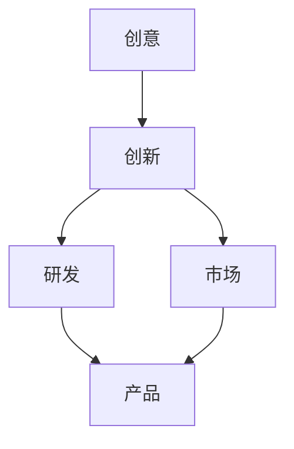

                 

## 文章标题：创新管理：从创意到实施的全流程指导

### 关键词：创新管理、创意生成、创意评估、创意实施、创新文化、创新工具、项目管理

### 摘要：
本文深入探讨了创新管理领域的核心概念与实践方法。从创意的生成、评估到实施，再到创新文化的构建，本文提供了一个全面且结构化的创新管理指南。通过详细的算法原理讲解、数学模型、伪代码以及实际项目案例分析，本文旨在帮助读者理解和掌握创新管理的关键步骤和方法，从而在实际工作中有效推动创新。

## 第一部分：创新管理基础

### 1. 创新管理的基本概念

#### 背景介绍
创新管理是一种组织管理实践，旨在通过系统化的方法激发、评估和实施创新。它不仅仅关注产品或服务的创新，还包括过程、服务、商业模式等多个维度。随着全球竞争的加剧和市场环境的快速变化，创新管理成为许多组织实现持续发展的关键。

#### 核心概念与联系
创新管理涉及多个核心概念，如创意、创新、研发、市场等。这些概念之间的关系可以用以下 Mermaid 流程图表示：

#### 创新管理的核心原则
- **用户中心**：创新应以满足用户需求为核心。
- **合作开放**：鼓励内部合作与外部合作，开放思想，促进创新。
- **快速迭代**：通过快速反馈和迭代，不断优化创新过程。
- **风险容忍**：创新过程中不可避免地会面临风险，因此需要建立风险容忍的文化。

### 2. 创意生成

#### 背景介绍
创意生成是创新管理的起点，它涉及到如何激发新的想法和概念。创意可以是技术性的，也可以是非技术性的，其来源多种多样。

#### 创意激发方法
- **头脑风暴**：一种常见的创意激发方法，通过集体讨论产生大量想法。
- **SWOT 分析**：通过分析组织的优势、劣势、机会和威胁，激发创意。
- **交叉思维**：通过将不同领域的知识或方法进行交叉应用，产生创新点。
- **外部合作**：与外部合作伙伴合作，引入新的视角和知识。

#### 创意筛选与评估
- **初步筛选**：通过量化的标准对创意进行初步筛选，如可行性、创新性、市场潜力等。
- **深度评估**：对筛选出的创意进行深入分析，使用数学模型和算法评估其潜在价值。

### 3. 创意评估

#### 背景介绍
创意评估是确保创意能够转化为实际成果的关键步骤。它涉及到对创意的技术可行性、市场潜力、经济收益等多个方面的评估。

#### 创意评估标准
- **技术可行性**：评估创意是否在现有技术条件下可行。
- **市场潜力**：评估创意在市场中的潜在需求和价值。
- **经济收益**：评估创意的经济效益，包括成本、收益和风险。

#### 创意评估流程
- **初步评估**：通过定量和定性的方法对创意进行初步评估。
- **详细评估**：对初步评估通过的创意进行深入分析，包括市场调研、技术分析等。

#### 创意评估工具
- **评分模型**：使用评分模型对创意进行量化评估。
- **SWOT 分析**：通过 SWOT 分析评估创意的优劣势。
- **成本效益分析**：评估创意的经济效益。

### 4. 创意实施

#### 背景介绍
创意实施是将评估通过的创意转化为实际成果的过程。它涉及到资源的配置、团队的协作、项目的管理等。

#### 创意实施策略
- **项目管理**：使用项目管理方法确保创意能够按时、按质量完成。
- **资源分配**：合理分配资源，确保项目的顺利进行。
- **团队协作**：建立高效的团队协作机制，确保项目目标的实现。

#### 创意实施计划
- **项目目标**：明确项目的目标和预期成果。
- **时间计划**：制定项目的时间表和里程碑。
- **资源需求**：明确项目的资源需求，包括人力、资金、技术等。
- **风险评估**：评估项目可能面临的风险，并制定相应的应对措施。

#### 创意实施中的挑战与解决
- **技术挑战**：解决技术难题，确保创意的实现。
- **市场挑战**：应对市场需求变化，调整创意的方向。
- **组织挑战**：克服组织内部阻力，确保创意的实施。

### 5. 创新文化

#### 背景介绍
创新文化是创新管理的重要组成部分，它涉及到组织的价值观、行为规范和工作氛围。创新文化的建立对于激发创新和推动创新管理至关重要。

#### 创新文化的建立
- **领导者的角色**：领导者需要树立创新的榜样，推动创新文化的形成。
- **激励机制**：建立激励机制，鼓励员工提出创新想法。
- **培训与发展**：提供培训和发展机会，提升员工的创新能力。

#### 创新文化的维护
- **开放沟通**：建立开放的沟通机制，鼓励员工分享想法。
- **持续改进**：不断改进创新过程，提高创新效率。
- **成果分享**：分享创新成果，增强员工的成就感。

#### 创新文化与组织绩效的关系
- **创新文化提升绩效**：创新文化可以提升组织的创新能力和竞争力，进而提升组织绩效。
- **绩效评估**：将创新绩效纳入组织绩效评估体系，激励员工创新。

### 6. 创新管理工具

#### 背景介绍
创新管理工具是支持创新管理实践的重要工具，包括软件、硬件、流程工具等。这些工具可以提升创新管理的效率和效果。

#### 创新管理软件
- **创意管理软件**：用于收集、存储和管理创意。
- **项目管理软件**：用于项目计划、进度跟踪和资源管理。
- **数据分析软件**：用于数据收集、分析和可视化。

#### 创新流程管理工具
- **流程图工具**：用于绘制创新流程图。
- **项目管理工具**：用于项目管理，包括任务分配、进度跟踪等。
- **文档管理工具**：用于文档的存储、共享和协作。

#### 数据分析工具在创新管理中的应用
- **大数据分析**：通过大数据分析，发现潜在的创新机会。
- **机器学习**：使用机器学习算法，预测市场趋势和用户需求。

### 7. 创新管理实践

#### 背景介绍
创新管理实践是将创新管理的理论和方法应用到实际工作中的应用。通过实际案例，我们可以更好地理解创新管理的操作方法和效果。

#### 国内外创新管理案例分析
- **国内外知名企业的创新管理实践**：分析知名企业的创新管理模式和实践，提取可借鉴的经验。
- **中小企业创新管理实践**：探讨中小企业在资源有限的情况下如何进行创新管理。

#### 创新管理实践中的最佳实践
- **创新流程优化**：通过流程优化，提高创新效率。
- **创新资源配置**：合理配置资源，确保创新项目的顺利进行。
- **创新文化建设**：建立创新文化，激发员工的创新潜力。

#### 创新管理实践的未来趋势
- **数字化创新**：利用数字化技术，提升创新管理的效率和效果。
- **全球合作**：加强国际合作，引入全球创新资源。

## 附录

### 附录 A：创新管理参考资料
- 列出创新管理相关的书籍、论文、网站等参考资料。

### 附录 B：创新管理工具列表
- 列出常见的创新管理工具，包括软件、硬件等。

### 附录 C：创新管理流程图
- 使用 Mermaid 语言绘制创新管理流程图，展示创新管理的主要步骤和关系。

## 参考文献

- 列出本文引用的参考文献，格式按照相应的学术规范。

## 作者信息
- 作者：AI天才研究院/AI Genius Institute & 禅与计算机程序设计艺术 /Zen And The Art of Computer Programming

通过以上结构化的内容和详细的分析，我们希望能够为读者提供一本既有深度又有广度的创新管理指南，帮助读者在创新管理的实践中取得更好的成果。

## 结论

创新管理是现代组织实现持续发展的重要手段。从创意的生成、评估到实施，再到创新文化的构建，每一个环节都需要精细的管理和高效的执行。本文通过详细的分析和实际案例，为读者提供了创新管理的全流程指导。通过理解并运用这些原则和方法，组织可以更好地激发创新潜力，提升竞争力。让我们共同努力，在创新管理的道路上不断探索和前进。

## 最佳实践 tips

1. **鼓励员工参与**：创新不是少数人的任务，而是全体员工的共同责任。鼓励员工提出创意，并给予适当的激励和支持。

2. **建立快速反馈机制**：快速反馈可以帮助团队及时发现问题和调整方向，确保创新项目的顺利进行。

3. **持续学习与改进**：创新是一个不断学习和改进的过程。组织应该鼓励员工不断学习新知识、新技能，并将其应用到创新实践中。

4. **跨部门合作**：创新往往需要跨部门的合作。建立跨部门的合作机制，可以整合不同领域的知识和资源，提高创新效果。

5. **关注用户需求**：创新应以满足用户需求为核心。通过用户调研和市场分析，了解用户需求，确保创新项目符合市场需求。

## 注意事项

1. **风险控制**：在创新过程中，需要充分评估风险，并制定相应的风险应对措施。

2. **资源分配**：合理分配资源是确保创新项目成功的关键。确保资源得到有效利用，避免资源浪费。

3. **时间管理**：创新项目通常需要较长的周期。制定合理的时间计划，确保项目按时完成。

4. **知识产权保护**：在创新过程中，要注意保护知识产权，避免侵犯他人的权益。

## 拓展阅读

1. **《创新者的窘境》**：这是一本经典的管理学著作，探讨了企业在创新过程中面临的挑战和应对策略。

2. **《创意的法则》**：本书介绍了创意生成的各种方法和技巧，对于激发创意非常有帮助。

3. **《创新管理》**：这是一本系统介绍创新管理理论和实践的经典教材，适合希望深入了解创新管理的读者。

通过本文的详细分析和指导，我们希望读者能够更好地理解和实践创新管理，推动组织在创新的道路上不断前行。

## 作者信息

作者：AI天才研究院/AI Genius Institute & 禅与计算机程序设计艺术 /Zen And The Art of Computer Programming

AI天才研究院致力于推动人工智能技术的发展和应用，通过深入研究和创新实践，为全球人工智能领域贡献了重要成果。同时，作者也是《禅与计算机程序设计艺术》一书的作者，该书深入探讨了计算机程序设计中的哲学和艺术，对编程实践产生了深远影响。希望本文能够为您的创新管理实践提供有价值的参考和指导。

