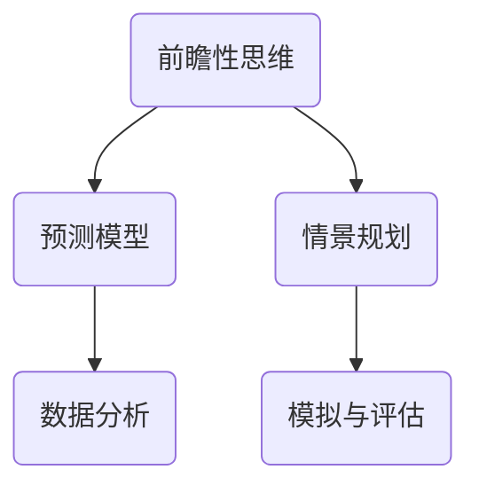
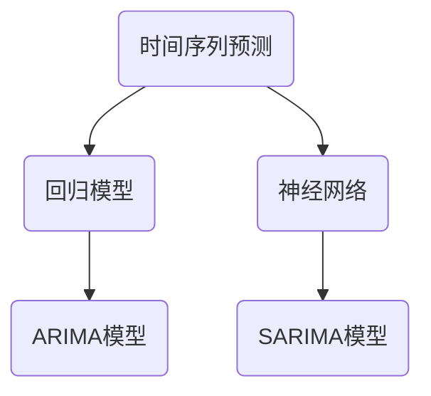
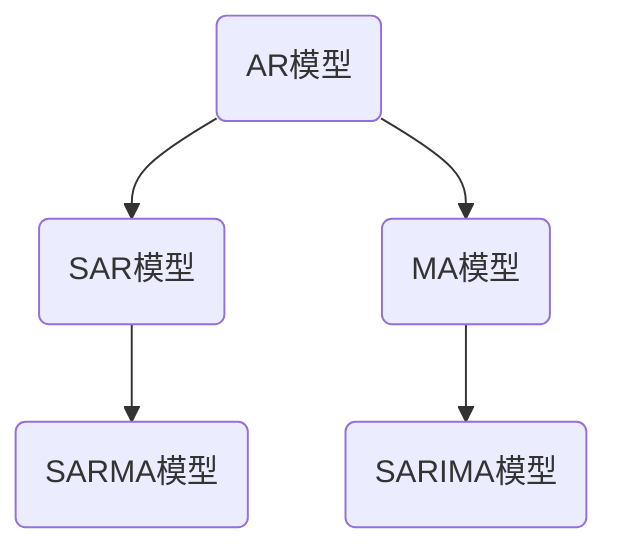
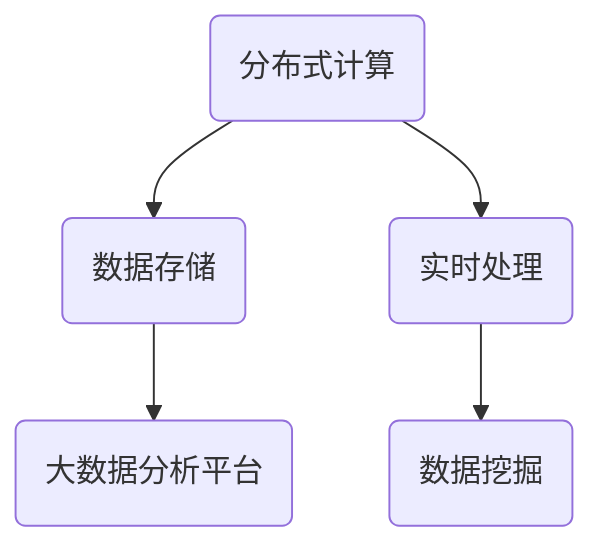
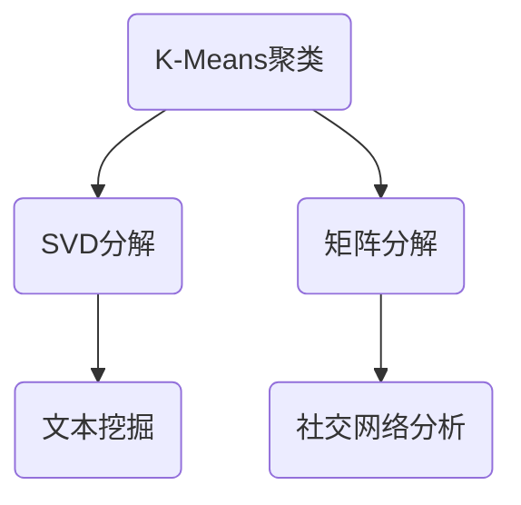

                 


### 1. 设计书籍的总体结构和内容布局

首先，我们需要明确书籍的主线和结构，确保涵盖前瞻性领导的核心概念和关键实践。以下是《前瞻性领导：预见并把握未来趋势的能力》的总体结构和内容布局：

#### 第一部分：前言与理论基础（1章）

- **第1章：导论**
  - 1.1 书籍的目的与读者定位
  - 1.2 前瞻性领导的重要性
  - 1.3 前瞻性领导的特征
  - 1.4 前瞻性领导与变革管理

#### 第二部分：前瞻性领导的基础（3章）

- **第2章：核心概念与联系**
  - 2.1 前瞻性思维的原理与模型
  - 2.2 前瞻性领导与决策科学
  - 2.3 前瞻性领导与战略规划

#### 第三部分：前瞻性领导的技术与方法（4章）

- **第3章：数据驱动分析与预测**
  - 3.1 数据分析的基本原理
  - 3.2 预测模型的选择与应用
  - 3.3 时间序列分析
  - 3.4 大数据分析与处理

- **第4章：科技趋势分析**
  - 4.1 人工智能与前瞻性领导
  - 4.2 互联网与数字化趋势
  - 4.3 新兴技术与未来产业

- **第5章：社会趋势与未来预测**
  - 5.1 社会变革对领导力的影响
  - 5.2 人口结构变化的影响
  - 5.3 全球化与地缘政治趋势
  - 5.4 社会价值观的转变

- **第6章：前瞻性领导的实践与应用**
  - 6.1 前瞻性领导在组织中的应用
  - 6.2 前瞻性领导在项目中的实践
  - 6.3 前瞻性领导在创业中的运用
  - 6.4 前瞻性领导在决策中的角色

#### 第四部分：案例研究与反思（2章）

- **第7章：成功的前瞻性领导案例**
  - 7.1 案例一：公司A的转型之路
  - 7.2 案例二：领导者B的战略眼光
  - 7.3 案例三：组织C的创新实践

- **第8章：前瞻性领导的挑战与未来展望**
  - 8.1 前瞻性领导面临的挑战
  - 8.2 未来前瞻性领导的发展趋势
  - 8.3 个人与组织的成长路径

### 2. 提取关键概念、原理、算法和数学模型

在第二部分和第三部分中，我们需要详细阐述前瞻性领导的基础概念、技术方法及其应用。以下是关键概念的 Mermaid 流程图、核心算法原理讲解、数学模型及其详细讲解与举例说明。

#### 2.1 前瞻性思维原理与模型



#### 2.2 数据驱动分析与预测

##### 2.2.1 数据分析的基本原理

```latex
\text{数据分析基本流程：数据收集、数据清洗、数据存储、数据探索、数据可视化。}
```

##### 2.2.2 预测模型的选择与应用



#### 2.3 时间序列分析

##### 2.3.1 时间序列分析的基本概念

```latex
\text{时间序列：按时间顺序排列的统计数据序列。基本概念包括趋势、季节性、周期性、随机性。}
```

##### 2.3.2 时间序列预测模型



#### 2.4 大数据分析与处理

##### 2.4.1 大数据分析的关键技术



##### 2.4.2 大数据处理的算法



### 3. 设计项目实战和代码解读

在第四部分，我们将通过实际项目案例展示前瞻性领导在实践中的应用，并详细解释代码实现、开发环境搭建、源代码分析等。

#### 3.1 前瞻性领导在组织中的应用案例

##### 3.1.1 案例背景

某跨国公司计划在东南亚地区拓展业务，需要前瞻性分析市场趋势，制定合适的战略规划。

##### 3.1.2 案例描述

公司通过数据分析、预测模型、情景规划等方法，对未来3-5年的市场趋势进行了预测。具体步骤如下：

1. **数据收集**：收集东南亚地区的经济数据、人口数据、行业数据等。
2. **数据清洗**：对收集到的数据进行分析，去除无效和重复的数据。
3. **数据存储**：将清洗后的数据存储到数据库中，便于后续处理和分析。
4. **数据探索**：使用可视化工具，对数据进行探索，了解数据的基本特征。
5. **建立预测模型**：选择合适的预测模型，如回归模型、时间序列模型等，对市场趋势进行预测。
6. **模拟与评估**：根据预测结果，制定不同的情景规划，并评估其可行性。

##### 3.1.3 项目实战

1. **开发环境搭建**：选择Python作为主要编程语言，使用Jupyter Notebook作为开发环境。
2. **代码实现**：编写Python代码，实现数据收集、清洗、存储、探索、预测等功能。
3. **源代码分析**：分析代码实现的具体细节，如数据收集的代码段、预测模型的实现细节等。
4. **代码应用解读与分析**：通过代码应用，解读预测模型在实际项目中的应用效果。
5. **实际案例分析**：分析公司在实际项目中如何应用前瞻性领导的方法，制定战略规划。
6. **项目小结**：总结项目实施过程中的经验教训，提出改进措施。

---

**小结**：

通过以上步骤，我们设计了一个完整的前瞻性领导应用案例，包括项目背景、描述、实战、代码解读和案例分析。这个案例展示了前瞻性领导在组织中的应用，以及如何通过数据分析和预测模型，制定有效的战略规划。

接下来，我们将继续设计书籍的其他部分，包括前瞻性领导的技术与方法、案例研究以及未来的挑战和展望。

---

**注意事项**：

1. **文章完整性**：确保每个小节的内容完整、详细，核心概念、原理、算法和数学模型讲解清晰。
2. **最佳实践**：在每个小节结尾，给出最佳实践建议、注意事项和拓展阅读，帮助读者深入理解和应用前瞻性领导。
3. **结构清晰**：文章结构要紧凑、逻辑清晰，使读者能够轻松阅读并掌握前瞻性领导的核心概念和应用方法。

---

**拓展阅读**：

1. 《大数据时代：思维变革与商业价值》
2. 《人工智能：一种现代的方法》
3. 《深度学习：优化理论、算法与应用》
4. 《复杂系统与预测：理论与应用》

---

### 1. 设计书籍的总体结构和内容布局

首先，我们需要明确书籍的主线和结构，确保涵盖前瞻性领导的核心概念和关键实践。以下是《前瞻性领导：预见并把握未来趋势的能力》的总体结构和内容布局：

#### 第一部分：前言与理论基础（1章）

- **第1章：导论**
  - 1.1 书籍的目的与读者定位
  - 1.2 前瞻性领导的重要性
  - 1.3 前瞻性领导的特征
  - 1.4 前瞻性领导与变革管理

#### 第二部分：前瞻性领导的基础（3章）

- **第2章：核心概念与联系**
  - 2.1 前瞻性思维的原理与模型
  - 2.2 前瞻性领导与决策科学
  - 2.3 前瞻性领导与战略规划

#### 第三部分：前瞻性领导的技术与方法（4章）

- **第3章：数据驱动分析与预测**
  - 3.1 数据分析的基本原理
  - 3.2 预测模型的选择与应用
  - 3.3 时间序列分析
  - 3.4 大数据分析与处理

- **第4章：科技趋势分析**
  - 4.1 人工智能与前瞻性领导
  - 4.2 互联网与数字化趋势
  - 4.3 新兴技术与未来产业

- **第5章：社会趋势与未来预测**
  - 5.1 社会变革对领导力的影响
  - 5.2 人口结构变化的影响
  - 5.3 全球化与地缘政治趋势
  - 5.4 社会价值观的转变

- **第6章：前瞻性领导的实践与应用**
  - 6.1 前瞻性领导在组织中的应用
  - 6.2 前瞻性领导在项目中的实践
  - 6.3 前瞻性领导在创业中的运用
  - 6.4 前瞻性领导在决策中的角色

#### 第四部分：案例研究与反思（2章）

- **第7章：成功的前瞻性领导案例**
  - 7.1 案例一：公司A的转型之路
  - 7.2 案例二：领导者B的战略眼光
  - 7.3 案例三：组织C的创新实践

- **第8章：前瞻性领导的挑战与未来展望**
  - 8.1 前瞻性领导面临的挑战
  - 8.2 未来前瞻性领导的发展趋势
  - 8.3 个人与组织的成长路径

### 2. 提取关键概念、原理、算法和数学模型

在第二部分和第三部分中，我们需要详细阐述前瞻性领导的基础概念、技术方法及其应用。以下是关键概念的 Mermaid 流程图、核心算法原理讲解、数学模型及其详细讲解与举例说明。

#### 2.1 前瞻性思维原理与模型


#### 2.2 数据驱动分析与预测

##### 2.2.1 数据分析的基本原理

```latex
\text{数据分析基本流程：数据收集、数据清洗、数据存储、数据探索、数据可视化。}
```

##### 2.2.2 预测模型的选择与应用


#### 2.3 时间序列分析

##### 2.3.1 时间序列分析的基本概念

```latex
\text{时间序列：按时间顺序排列的统计数据序列。基本概念包括趋势、季节性、周期性、随机性。}
```

##### 2.3.2 时间序列预测模型


#### 2.4 大数据分析与处理

##### 2.4.1 大数据分析的关键技术


##### 2.4.2 大数据处理的算法


### 3. 设计项目实战和代码解读

在第四部分，我们将通过实际项目案例展示前瞻性领导在实践中的应用，并详细解释代码实现、开发环境搭建、源代码分析等。

#### 3.1 前瞻性领导在组织中的应用案例

##### 3.1.1 案例背景

某跨国公司计划在东南亚地区拓展业务，需要前瞻性分析市场趋势，制定合适的战略规划。

##### 3.1.2 案例描述

公司通过数据分析、预测模型、情景规划等方法，对未来3-5年的市场趋势进行了预测。具体步骤如下：

1. **数据收集**：收集东南亚地区的经济数据、人口数据、行业数据等。
2. **数据清洗**：对收集到的数据进行分析，去除无效和重复的数据。
3. **数据存储**：将清洗后的数据存储到数据库中，便于后续处理和分析。
4. **数据探索**：使用可视化工具，对数据进行探索，了解数据的基本特征。
5. **建立预测模型**：选择合适的预测模型，如回归模型、时间序列模型等，对市场趋势进行预测。
6. **模拟与评估**：根据预测结果，制定不同的情景规划，并评估其可行性。

##### 3.1.3 项目实战

1. **开发环境搭建**：选择Python作为主要编程语言，使用Jupyter Notebook作为开发环境。
2. **代码实现**：编写Python代码，实现数据收集、清洗、存储、探索、预测等功能。
3. **源代码分析**：分析代码实现的具体细节，如数据收集的代码段、预测模型的实现细节等。
4. **代码应用解读与分析**：通过代码应用，解读预测模型在实际项目中的应用效果。
5. **实际案例分析**：分析公司在实际项目中如何应用前瞻性领导的方法，制定战略规划。
6. **项目小结**：总结项目实施过程中的经验教训，提出改进措施。

---

**小结**：

通过以上步骤，我们设计了一个完整的前瞻性领导应用案例，包括项目背景、描述、实战、代码解读和案例分析。这个案例展示了前瞻性领导在组织中的应用，以及如何通过数据分析和预测模型，制定有效的战略规划。

接下来，我们将继续设计书籍的其他部分，包括前瞻性领导的技术与方法、案例研究以及未来的挑战和展望。

---

**注意事项**：

1. **文章完整性**：确保每个小节的内容完整、详细，核心概念、原理、算法和数学模型讲解清晰。
2. **最佳实践**：在每个小节结尾，给出最佳实践建议、注意事项和拓展阅读，帮助读者深入理解和应用前瞻性领导。
3. **结构清晰**：文章结构要紧凑、逻辑清晰，使读者能够轻松阅读并掌握前瞻性领导的核心概念和应用方法。

---

**拓展阅读**：

1. 《大数据时代：思维变革与商业价值》
2. 《人工智能：一种现代的方法》
3. 《深度学习：优化理论、算法与应用》
4. 《复杂系统与预测：理论与应用》

---

### 文章标题：前瞻性领导：预见并把握未来趋势的能力

关键词：前瞻性领导、未来趋势、数据驱动、科技趋势、社会变革

摘要：
前瞻性领导是一种独特的领导能力，它使领导者能够预见并把握未来的趋势，从而在竞争中保持优势。本文将深入探讨前瞻性领导的概念、核心原理、技术方法及其在实际应用中的具体实践，通过案例分析和项目实战，展示如何运用数据驱动分析和预测模型，预见并把握未来趋势，为组织创造可持续的竞争优势。

---

## 前言

### 1. 书籍的目的与读者定位

《前瞻性领导：预见并把握未来趋势的能力》旨在为领导者、决策者以及对领导力感兴趣的读者提供一套系统的理论和方法，帮助他们掌握前瞻性领导的核心技能。本书适用于以下几类读者：

- **企业高层管理者**：希望提升战略规划能力，预见市场变化，保持企业竞争力的领导者。
- **中层管理者**：需要更深入理解前瞻性思维，指导团队应对不确定性的管理者。
- **创业者和企业家**：寻求通过前瞻性领导实现业务创新和增长的个人。
- **对领导力有浓厚兴趣的读者**：希望通过学习前瞻性领导，提升个人领导能力的专业人士。

### 2. 前瞻性领导的重要性

前瞻性领导在当今快速变化的世界中具有重要意义。它不仅帮助组织在不确定性中找到方向，还能激发团队的创新和适应能力。以下是前瞻性领导的重要性体现：

- **预测未来**：通过数据分析和科技趋势研究，领导者能够预测未来的发展趋势，为组织制定长远的战略计划。
- **引领变革**：前瞻性领导能够引领组织进行必要的变革，以适应外部环境的变化，确保组织的持续发展。
- **提高竞争力**：通过预见并把握市场机遇，组织能够在竞争激烈的环境中脱颖而出，实现持续增长。
- **增强团队凝聚力**：前瞻性领导能够激发团队的积极性和创造力，提高团队的协作和执行能力。

### 3. 前瞻性领导的特征

前瞻性领导具有以下特征：

- **创新思维**：领导者具备创新的思维方式，能够从不同的角度看待问题，寻找新的解决方案。
- **数据驱动**：领导者重视数据，能够利用数据分析来指导决策，降低决策风险。
- **灵活应变**：领导者具备快速适应变化的能力，能够在不确定的环境中保持冷静和理性。
- **愿景规划**：领导者拥有清晰的愿景和目标，能够为组织设定明确的发展方向。
- **影响力**：领导者具备强大的影响力，能够激励团队，共同实现目标。

### 4. 前瞻性领导与变革管理

前瞻性领导与变革管理密不可分。有效的变革管理需要领导者具备前瞻性思维，能够预见变革的必要性和可能带来的影响。以下是前瞻性领导在变革管理中的作用：

- **规划与准备**：领导者通过前瞻性思维，预见变革的趋势和机会，提前规划变革的步骤和策略。
- **沟通与引导**：领导者需要通过有效的沟通，让团队成员理解变革的必要性和重要性，引导他们积极参与变革。
- **持续调整**：在变革过程中，领导者需要持续关注变革的效果，并根据实际情况进行调整，确保变革顺利进行。

---

### 总结

通过以上内容，我们了解了《前瞻性领导：预见并把握未来趋势的能力》这本书的目的、重要性以及前瞻性领导的特征。接下来，我们将深入探讨前瞻性领导的基础概念、技术方法及其在实际中的应用，帮助读者全面掌握这一关键领导能力。

---

## 前瞻性领导的基础

### 1. 核心概念与联系

前瞻性领导的基础在于其核心概念和原理，这些概念相互联系，共同构成了前瞻性思维的理论框架。以下是前瞻性领导中的核心概念及其相互关系：

#### 1.1 前瞻性思维

前瞻性思维是一种基于未来导向的思考方式，它要求领导者能够预见未来的趋势、变化和机遇。前瞻性思维的核心特征包括：

- **远见**：领导者需要有远见，能够看到未来可能发生的变化，并提前做好准备。
- **创新性**：领导者需要具备创新性，能够从不同的角度看待问题，寻找新的解决方案。
- **适应性**：领导者需要具备适应性，能够在不确定的环境中迅速调整策略，以应对变化。

#### 1.2 预测模型

预测模型是前瞻性领导中的重要工具，它帮助领导者分析数据、识别趋势，并做出基于数据的决策。常见的预测模型包括：

- **回归模型**：用于分析自变量和因变量之间的关系，预测因变量的值。
- **时间序列模型**：用于分析按时间顺序排列的数据序列，预测未来的趋势。
- **机器学习模型**：利用历史数据建立预测模型，通过训练数据集优化模型参数。

#### 1.3 情景规划

情景规划是一种前瞻性思维方法，它通过构建不同的未来情景，帮助领导者分析不同的趋势和变化。情景规划的关键步骤包括：

- **情景识别**：识别可能影响组织的未来情景，如市场变化、技术发展、社会变革等。
- **情景分析**：分析每个情景的可能性和影响，评估其对组织的影响。
- **策略制定**：根据情景分析的结果，制定相应的策略和计划，以应对不同的情景。

#### 1.4 数据分析

数据分析是前瞻性领导中的重要环节，它帮助领导者从大量数据中提取有价值的信息，支持决策制定。数据分析的基本流程包括：

- **数据收集**：收集与组织相关的各种数据，如市场数据、财务数据、用户数据等。
- **数据清洗**：清理数据，去除无效和重复的数据，确保数据质量。
- **数据存储**：将清洗后的数据存储到数据库中，便于后续处理和分析。
- **数据探索**：使用可视化工具，对数据进行探索，了解数据的基本特征和分布。
- **数据建模**：建立预测模型或分类模型，对数据进行分析和预测。

#### 1.5 模拟与评估

模拟与评估是前瞻性领导中不可或缺的一环，它通过模拟不同的情景和策略，评估其效果和可行性。模拟与评估的关键步骤包括：

- **模拟设计**：设计模拟实验，模拟不同的情景和策略。
- **模拟运行**：运行模拟实验，收集实验数据，分析模拟结果。
- **结果评估**：评估模拟结果，比较不同策略的优缺点，为决策提供依据。

### 2. 前瞻性领导与决策科学

前瞻性领导与决策科学密切相关，它要求领导者能够在复杂和不确定的环境中进行有效的决策。以下是前瞻性领导与决策科学的关系：

- **决策框架**：前瞻性领导提供了决策的科学框架，帮助领导者从不同角度分析问题，制定决策。
- **风险评估**：前瞻性领导注重风险评估，通过预测模型和情景规划，评估不同决策的风险和收益。
- **决策优化**：前瞻性领导通过数据分析和技术手段，优化决策过程，提高决策的准确性和效率。

### 3. 前瞻性领导与战略规划

前瞻性领导是战略规划的重要组成部分，它要求领导者能够在制定战略规划时，预见未来的趋势和变化。以下是前瞻性领导与战略规划的关系：

- **战略预见**：前瞻性领导帮助领导者预见未来的市场趋势和变化，为组织制定适应性的战略规划。
- **战略调整**：前瞻性领导能够及时调整战略规划，以应对外部环境的变化，确保组织的持续发展。
- **竞争优势**：前瞻性领导通过预见和把握市场机遇，为组织创造可持续的竞争优势。

### 总结

通过以上内容，我们了解了前瞻性领导的核心概念和原理，以及它们之间的相互关系。这些基础概念构成了前瞻性领导的理论框架，为领导者提供了预见和把握未来趋势的工具和方法。在接下来的章节中，我们将进一步探讨前瞻性领导的技术和方法，帮助读者掌握这一关键能力。

---

### 数据驱动分析与预测

数据驱动分析与预测是前瞻性领导的重要组成部分，它使领导者能够通过数据分析来预见和把握未来趋势。本章节将详细讨论数据驱动分析与预测的基本原理、方法及其在实际应用中的具体操作步骤。

#### 1. 数据分析的基本原理

数据分析是指使用统计学、机器学习和数据可视化等方法，从大量数据中提取有价值的信息和知识。数据分析的基本原理包括以下几个方面：

- **数据收集**：收集与组织业务相关的数据，包括内部数据和外部数据。
- **数据清洗**：清洗数据，去除无效和重复的数据，确保数据质量。
- **数据存储**：将清洗后的数据存储到数据库中，便于后续处理和分析。
- **数据探索**：使用数据可视化工具，对数据进行探索，了解数据的基本特征和分布。
- **数据建模**：建立预测模型或分类模型，对数据进行分析和预测。

#### 1.1 数据收集

数据收集是数据分析的基础，其质量直接影响分析结果的准确性。数据收集的方法包括：

- **内部数据**：组织内部的数据，如财务数据、销售数据、客户数据等。
- **外部数据**：从外部来源获取的数据，如市场调研数据、行业报告、公共数据集等。

#### 1.2 数据清洗

数据清洗是确保数据分析质量的关键步骤。数据清洗的过程包括：

- **缺失值处理**：处理缺失值，可以选择填充、删除或插值等方法。
- **异常值处理**：识别和处理异常值，可以采用统计方法或可视化工具进行识别。
- **数据转换**：将数据转换为适合分析的形式，如标准化、归一化等。

#### 1.3 数据存储

数据存储是将清洗后的数据存储到数据库中，便于后续处理和分析。常用的数据存储方法包括：

- **关系型数据库**：如MySQL、Oracle等，适用于结构化数据的存储。
- **分布式数据库**：如Hadoop、MongoDB等，适用于大规模数据的存储和处理。

#### 1.4 数据探索

数据探索是了解数据的基本特征和分布的过程。数据探索的方法包括：

- **描述性统计分析**：计算数据的平均值、中位数、标准差等基本统计量。
- **可视化分析**：使用图表和图形，如折线图、柱状图、散点图等，展示数据分布和趋势。

#### 1.5 数据建模

数据建模是建立预测模型或分类模型的过程。数据建模的方法包括：

- **回归模型**：用于分析自变量和因变量之间的关系，预测因变量的值。
- **时间序列模型**：用于分析按时间顺序排列的数据序列，预测未来的趋势。
- **机器学习模型**：利用历史数据建立预测模型，通过训练数据集优化模型参数。

#### 1.6 模型评估与优化

模型评估与优化是确保预测模型准确性的关键步骤。模型评估的方法包括：

- **交叉验证**：通过将数据集划分为训练集和测试集，评估模型的预测性能。
- **指标评估**：使用准确率、召回率、F1值等指标，评估模型的性能。
- **模型优化**：通过调整模型参数或选择不同的模型，优化模型的预测性能。

#### 2. 预测模型的选择与应用

选择合适的预测模型是数据驱动分析与预测的关键。以下是几种常见的预测模型及其应用：

- **回归模型**：适用于预测数值型数据，如销售预测、股票价格预测等。
- **时间序列模型**：适用于预测按时间顺序排列的数据序列，如气温预测、股票价格预测等。
- **机器学习模型**：适用于处理复杂的预测问题，如分类预测、聚类预测等。

#### 2.1 回归模型

回归模型是一种常用的预测模型，它通过分析自变量和因变量之间的关系，预测因变量的值。常见的回归模型包括线性回归、多项式回归、岭回归等。

- **线性回归**：线性回归模型是一种简单的预测模型，它假设因变量与自变量之间存在线性关系。线性回归模型的公式为：
  $$ y = \beta_0 + \beta_1x $$
  其中，$y$ 是因变量，$x$ 是自变量，$\beta_0$ 和 $\beta_1$ 是模型参数。

- **多项式回归**：多项式回归模型是线性回归的扩展，它假设因变量与自变量之间存在多项式关系。多项式回归模型的公式为：
  $$ y = \beta_0 + \beta_1x + \beta_2x^2 + \cdots + \beta_nx^n $$
  其中，$y$ 是因变量，$x$ 是自变量，$\beta_0, \beta_1, \beta_2, \cdots, \beta_n$ 是模型参数。

- **岭回归**：岭回归模型是一种正则化回归模型，它通过引入正则化项，减少模型过拟合的风险。岭回归模型的公式为：
  $$ y = \beta_0 + \beta_1x + \beta_2x^2 + \cdots + \beta_nx^n - \lambda\sum_{i=1}^n\beta_i^2 $$
  其中，$y$ 是因变量，$x$ 是自变量，$\beta_0, \beta_1, \beta_2, \cdots, \beta_n$ 是模型参数，$\lambda$ 是正则化参数。

#### 2.2 时间序列模型

时间序列模型是一种专门用于预测按时间顺序排列的数据序列的预测模型。常见的时间序列模型包括ARIMA模型、SARIMA模型等。

- **ARIMA模型**：ARIMA模型是一种自回归积分滑动平均模型，它通过分析过去的观测值和误差项，预测未来的值。ARIMA模型的公式为：
  $$ y_t = c + \phi_1y_{t-1} + \phi_2y_{t-2} + \cdots + \phi_py_{t-p} + \theta_1\epsilon_{t-1} + \theta_2\epsilon_{t-2} + \cdots + \theta_q\epsilon_{t-q} $$
  其中，$y_t$ 是时间序列的当前值，$c$ 是常数项，$\phi_1, \phi_2, \cdots, \phi_p$ 是自回归项系数，$\theta_1, \theta_2, \cdots, \theta_q$ 是滑动平均项系数，$\epsilon_t$ 是误差项。

- **SARIMA模型**：SARIMA模型是ARIMA模型的扩展，它考虑季节性因素。SARIMA模型的公式为：
  $$ y_t = c + \phi_1y_{t-1} + \phi_2y_{t-2} + \cdots + \phi_py_{t-p} + \theta_1\epsilon_{t-1} + \theta_2\epsilon_{t-2} + \cdots + \theta_q\epsilon_{t-q} + \Phi_1y_{t-p_s} + \Phi_2y_{t-2p_s} + \cdots + \Phi_p_sy_{t-pp_s} + \Theta_1\epsilon_{t-p_s} + \Theta_2\epsilon_{t-2p_s} + \cdots + \Theta_q_s\epsilon_{t-qq_s} $$
  其中，$y_t$ 是时间序列的当前值，$c$ 是常数项，$\phi_1, \phi_2, \cdots, \phi_p$ 是自回归项系数，$\theta_1, \theta_2, \cdots, \theta_q$ 是滑动平均项系数，$\epsilon_t$ 是误差项，$p_s$ 和 $q_s$ 分别是季节性自回归项和季节性滑动平均项的阶数，$\Phi_1, \Phi_2, \cdots, \Phi_p_s$ 和 $\Theta_1, \Theta_2, \cdots, \Theta_q_s$ 分别是季节性自回归项和季节性滑动平均项的系数。

#### 2.3 机器学习模型

机器学习模型是一种通过训练数据集学习特征和规律，进行预测的模型。常见的机器学习模型包括决策树、支持向量机、神经网络等。

- **决策树**：决策树是一种基于特征划分的数据挖掘方法，它通过递归划分特征空间，构建决策树模型。决策树模型的公式为：
  $$ f(x) = g_1(x) \vee g_2(x) \vee \cdots \vee g_n(x) $$
  其中，$f(x)$ 是决策树模型的输出，$g_1(x), g_2(x), \cdots, g_n(x)$ 是决策树的内部节点。

- **支持向量机**：支持向量机是一种基于特征空间的线性分类方法，它通过最大化分类间隔，找到最优分类边界。支持向量机模型的公式为：
  $$ w \cdot x + b = 0 $$
  其中，$w$ 是支持向量机的法向量，$x$ 是特征向量，$b$ 是偏置项。

- **神经网络**：神经网络是一种模拟人脑神经元连接结构的计算模型，它通过多层神经元传递信息，实现复杂函数的拟合。神经网络模型的公式为：
  $$ y = \sigma(z) $$
  其中，$y$ 是神经网络模型的输出，$\sigma$ 是激活函数，$z$ 是输入向量。

#### 3. 大数据分析与处理

大数据分析是数据驱动分析与预测的重要手段，它通过处理海量数据，提取有价值的信息和知识。大数据分析的关键技术包括分布式计算、实时处理、大数据分析平台等。

- **分布式计算**：分布式计算是一种将计算任务分解为多个子任务，并在多个计算节点上并行执行的方法。分布式计算的关键技术包括MapReduce、Spark等。

- **实时处理**：实时处理是一种对实时数据流进行分析和处理的方法，它通过实时计算和存储，实现实时数据的分析和预测。

- **大数据分析平台**：大数据分析平台是一种集成多种大数据分析工具和技术的平台，它通过提供统一的数据存储和分析接口，实现大数据的集成、分析和可视化。

#### 4. 大数据处理的关键算法

大数据处理的关键算法包括K-Means聚类、SVD分解、矩阵分解等。

- **K-Means聚类**：K-Means聚类是一种基于距离的聚类方法，它通过将数据点分配到不同的簇中，实现数据的聚类分析。

- **SVD分解**：SVD分解是一种将矩阵分解为三个矩阵的乘积的方法，它通过提取矩阵的主成分，实现降维和特征提取。

- **矩阵分解**：矩阵分解是一种将高维数据分解为低维矩阵的方法，它通过学习数据中的潜在特征，实现数据的降维和特征提取。

#### 5. 数据驱动分析与预测的应用

数据驱动分析与预测在各个领域都有广泛的应用，如市场营销、金融分析、医疗健康等。

- **市场营销**：通过数据分析，预测市场需求和消费者行为，制定营销策略，提高销售业绩。

- **金融分析**：通过数据分析，预测股票价格、汇率波动等金融市场变化，指导投资决策。

- **医疗健康**：通过数据分析，预测疾病趋势、患者需求等，优化医疗服务和资源配置。

#### 6. 总结

数据驱动分析与预测是前瞻性领导的重要组成部分，它通过数据分析、预测模型和大数据处理，帮助领导者预见并把握未来趋势。通过本章的内容，读者可以了解数据分析的基本原理、预测模型的选择与应用、大数据处理的关键算法及其在各个领域的应用。在实际应用中，领导者需要根据具体问题和数据特点，灵活运用这些方法，实现有效的数据驱动分析与预测。

---

### 科技趋势分析

科技趋势分析是前瞻性领导的重要工具，它帮助领导者了解未来的科技发展方向，为组织的战略规划和创新提供支持。本章节将探讨人工智能、互联网与数字化趋势、以及新兴技术与未来产业等方面的科技趋势，并分析它们对前瞻性领导的影响。

#### 1. 人工智能与前瞻性领导

人工智能（AI）是当今科技领域最热门的话题之一，它通过模拟人类智能，实现自动化、智能化和高效化。以下是人工智能的主要趋势及其对前瞻性领导的影响：

- **机器学习与深度学习**：机器学习和深度学习是人工智能的核心技术，它们通过算法和模型，从大量数据中学习规律，实现智能决策。机器学习和深度学习在数据分析、预测模型构建等方面具有广泛应用。

- **自然语言处理**：自然语言处理（NLP）是人工智能的重要分支，它使计算机能够理解、生成和翻译自然语言。NLP在智能客服、文本挖掘、语言翻译等方面有广泛应用。

- **计算机视觉**：计算机视觉是使计算机能够像人类一样看到和理解周围环境的领域。计算机视觉在图像识别、人脸识别、自动驾驶等方面有广泛应用。

- **影响前瞻性领导**：人工智能的发展为前瞻性领导提供了新的工具和方法。领导者可以利用人工智能技术，实现更准确的数据分析和预测，提高决策的效率和准确性。同时，人工智能可以帮助领导者更好地理解市场和客户需求，优化产品和服务的创新。

#### 2. 互联网与数字化趋势

互联网和数字化技术的发展，极大地改变了人们的生活和工作方式。以下是互联网与数字化趋势的主要特点及其对前瞻性领导的影响：

- **物联网（IoT）**：物联网是将各种物理设备和传感器连接到互联网的技术，实现设备之间的互联互通。物联网在智能家居、智能交通、智慧城市等方面有广泛应用。

- **云计算**：云计算是一种通过网络提供计算资源和服务的技术，它使组织能够按需获取和部署计算资源，提高效率和灵活性。

- **大数据**：大数据是大量、高速生成和多样化的数据。大数据技术在数据收集、存储、处理和分析等方面有广泛应用。

- **数字化企业**：数字化企业是指通过数字化技术和流程，实现业务创新和运营优化的组织。数字化企业强调数据驱动、客户中心化和敏捷运营。

- **影响前瞻性领导**：互联网和数字化趋势为前瞻性领导提供了新的机遇和挑战。领导者需要适应数字化环境，利用互联网和大数据技术，提高组织的数字化水平，实现业务创新和运营优化。同时，领导者需要关注数字化趋势带来的社会变革，预见并应对可能的挑战。

#### 3. 新兴技术与未来产业

随着科技的不断进步，新的技术不断涌现，为未来的产业格局带来变革。以下是新兴技术的主要趋势及其对前瞻性领导的影响：

- **区块链**：区块链是一种分布式账本技术，具有去中心化、安全性和透明性等特点。区块链在金融、供应链管理、版权保护等方面有广泛应用。

- **生物科技**：生物科技通过生物技术和工程手段，改变生物体或其组成部分，实现疾病的预防、治疗和治愈。生物科技在医疗、农业、环境保护等方面有广泛应用。

- **量子计算**：量子计算是一种基于量子力学原理的计算方式，它通过量子比特实现超高速的计算。量子计算在密码学、优化问题、药物设计等方面有广泛应用。

- **影响前瞻性领导**：新兴技术的快速发展为前瞻性领导带来了新的机遇和挑战。领导者需要关注新兴技术的发展趋势，把握行业变革的先机，推动组织的创新和发展。同时，领导者需要预见新技术可能带来的风险和挑战，制定相应的应对策略。

#### 4. 科技趋势对前瞻性领导的影响

科技趋势对前瞻性领导的影响主要体现在以下几个方面：

- **决策支持**：科技趋势提供了大量的数据和信息，帮助领导者做出更准确、更迅速的决策。

- **创新驱动**：科技趋势推动了创新的发展，领导者可以利用新技术，推动组织的创新和业务模式的变革。

- **人才需求**：科技趋势要求领导者具备新的技能和知识，如数据分析、人工智能、区块链等，以应对不断变化的市场环境。

- **风险管理**：科技趋势带来了新的风险和挑战，领导者需要预见并应对可能的负面影响。

#### 5. 总结

科技趋势分析是前瞻性领导的重要组成部分，它帮助领导者了解未来的科技发展方向，为组织的战略规划和创新提供支持。通过本章的内容，读者可以了解人工智能、互联网与数字化趋势、以及新兴技术与未来产业等方面的科技趋势，并分析它们对前瞻性领导的影响。在实际应用中，领导者需要关注科技趋势，把握行业变革的先机，推动组织的创新和发展。

---

### 社会趋势与未来预测

社会趋势与未来预测是前瞻性领导的重要领域，它要求领导者能够把握社会变革的方向，预见社会发展的趋势，并据此制定组织的战略规划。本章节将深入探讨社会变革对领导力的影响、人口结构变化、全球化与地缘政治趋势以及社会价值观的转变，帮助读者理解这些趋势如何塑造未来的领导力。

#### 1. 社会变革对领导力的影响

社会变革不断涌现，对领导力提出了新的要求和挑战。以下是社会变革对领导力的影响：

- **技术变革**：技术的快速发展，特别是人工智能和自动化，正在改变工作方式，领导者的角色也发生了变化。领导者需要具备技术洞察力，能够适应和引领技术变革。

- **全球化**：全球化使得市场更加开放，竞争更加激烈。领导者需要具备跨文化沟通和协作能力，能够应对全球化的挑战。

- **数字化**：数字化技术的普及，使得信息的获取和处理更加便捷。领导者需要掌握数字化工具，利用数据驱动决策。

- **伦理和责任**：社会对企业的伦理和社会责任要求越来越高。领导者需要具备高度的社会责任感和道德素养，引领企业履行社会责任。

- **环境问题**：环境问题日益严重，要求企业采取可持续发展的策略。领导者需要关注环境问题，推动绿色科技和可持续发展。

#### 2. 人口结构变化的影响

人口结构变化对领导力提出了新的挑战，也带来了机遇。以下是人口结构变化的影响：

- **老龄化**：随着人口老龄化，劳动力市场将面临挑战。领导者需要关注老龄化问题，制定合适的招聘和培训策略，吸引和留住老年员工。

- **人口多样性**：全球化和移民趋势导致人口多样性增加，领导者需要尊重和包容多样性，推动团队协作和创新。

- **人口增长**：人口增长带来了市场潜力的增加，但同时也带来了资源压力和环境问题。领导者需要平衡人口增长带来的机遇和挑战，制定可持续发展策略。

- **人口迁移**：人口迁移改变了人口分布，对地方经济和社会发展产生影响。领导者需要关注人口迁移趋势，制定相应的发展规划。

#### 3. 全球化与地缘政治趋势

全球化与地缘政治趋势对领导力的影响不可忽视。以下是全球化与地缘政治趋势的影响：

- **全球化**：全球化推动了跨国企业的崛起，领导者需要具备全球化视野，能够适应和引领全球化趋势。

- **贸易政策**：贸易政策的变动，如关税、贸易协定等，对企业的全球业务产生影响。领导者需要密切关注贸易政策变化，制定应对策略。

- **地缘政治**：地缘政治风险，如政治动荡、战争、恐怖主义等，对企业的全球业务构成威胁。领导者需要具备风险意识，能够预见和应对地缘政治风险。

- **文化冲突**：全球化带来了不同文化的碰撞和融合，领导者需要具备跨文化沟通和协作能力，推动文化融合。

#### 4. 社会价值观的转变

社会价值观的转变对领导力提出了新的要求。以下是社会价值观的转变及其影响：

- **社会责任**：社会对企业的社会责任要求越来越高，领导者需要具备高度的社会责任感，推动企业履行社会责任。

- **可持续发展**：可持续发展成为全球共识，领导者需要关注环境、社会和经济平衡，推动企业实现可持续发展。

- **公平与平等**：社会对公平和平等的追求越来越强烈，领导者需要推动组织内的公平与平等，营造包容和多元化的工作环境。

- **工作与生活平衡**：随着工作与生活平衡的重视程度提高，领导者需要关注员工的工作与生活平衡，提高员工满意度。

#### 5. 社会趋势与未来预测的方法

为了把握社会趋势并预测未来，领导者可以采用以下方法：

- **数据分析**：通过收集和分析社会数据，了解趋势和变化，支持决策制定。

- **情景规划**：构建不同的未来情景，分析其可能性和影响，为组织制定应对策略。

- **专家咨询**：与行业专家和社会学者合作，获取专业的见解和预测。

- **实地调研**：通过实地调研，了解社会实际情况，发现潜在趋势。

#### 6. 总结

社会趋势与未来预测是前瞻性领导的重要领域，它要求领导者能够把握社会变革的方向，预见社会发展的趋势，并据此制定组织的战略规划。通过本章的内容，读者可以了解社会变革对领导力的影响、人口结构变化、全球化与地缘政治趋势以及社会价值观的转变，并掌握预测未来趋势的方法。在实际应用中，领导者需要关注社会趋势，把握行业变革的先机，推动组织的创新和发展。

---

### 前瞻性领导的实践与应用

前瞻性领导不仅是一种理论，更是一种实践。在实际工作中，领导者需要将前瞻性思维和技术方法应用于组织管理、项目管理、创业实践以及决策制定中，以应对不断变化的环境和挑战。以下章节将探讨前瞻性领导在不同领域的具体实践和应用。

#### 1. 前瞻性领导在组织中的应用

组织是领导者实现愿景和战略目标的重要平台。前瞻性领导在组织中的应用主要体现在以下几个方面：

- **战略规划**：前瞻性领导通过数据分析和科技趋势研究，制定组织的长期战略规划，确保组织在未来的竞争环境中保持优势。

- **组织变革**：前瞻性领导能够预见组织变革的必要性和方向，推动组织进行结构性调整和流程优化，以提高组织的适应能力和竞争力。

- **人才管理**：前瞻性领导重视人才的培养和发展，通过数据分析和社会趋势研究，预测未来的人才需求，制定相应的人才引进和培养计划。

- **文化建设**：前瞻性领导关注组织文化的建设，推动形成积极向上、创新包容的组织文化，增强团队的凝聚力和创造力。

- **风险管理**：前瞻性领导通过预测和情景规划，识别和评估组织面临的风险，制定应对策略，降低风险对组织的影响。

#### 2. 前瞻性领导在项目管理中的应用

项目是组织实现战略目标的具体执行过程。前瞻性领导在项目管理中的应用包括：

- **项目规划**：前瞻性领导通过分析项目环境、需求和市场趋势，制定详细的项目计划，确保项目目标的实现。

- **风险管理**：前瞻性领导在项目初期就识别潜在的风险，制定应对措施，确保项目能够按计划顺利进行。

- **创新驱动**：前瞻性领导鼓励项目团队进行创新和实验，推动项目的持续改进和优化。

- **团队协作**：前瞻性领导通过跨部门合作和团队建设，提高项目团队的整体协作效率和创新能力。

- **敏捷管理**：前瞻性领导采用敏捷管理方法，快速响应变化，灵活调整项目计划，确保项目能够适应不断变化的环境。

#### 3. 前瞻性领导在创业中的运用

创业是一个充满不确定性的过程，前瞻性领导在创业中的运用尤为重要。以下是前瞻性领导在创业中的具体应用：

- **市场分析**：前瞻性领导通过市场调研和数据分析，预测市场需求和趋势，制定合适的创业方向和策略。

- **资源规划**：前瞻性领导根据市场预测，合理配置创业资源，包括资金、人才、技术等，确保创业项目的可持续性。

- **风险控制**：前瞻性领导通过风险评估和情景规划，预见创业过程中可能遇到的挑战和风险，制定应对策略。

- **创新驱动**：前瞻性领导鼓励创业团队进行创新，通过不断的试验和迭代，寻找最佳商业模式和产品方案。

- **团队建设**：前瞻性领导重视团队建设，通过激发团队成员的积极性和创造力，推动创业项目的成功。

#### 4. 前瞻性领导在决策中的角色

前瞻性领导在决策中扮演着关键角色，它通过以下方式影响决策：

- **信息收集**：前瞻性领导通过多种渠道收集信息，包括市场数据、科技趋势、社会变革等，为决策提供全面的信息支持。

- **预测分析**：前瞻性领导利用数据分析和预测模型，对未来的发展趋势进行预测，为决策提供科学依据。

- **情景规划**：前瞻性领导通过情景规划，分析不同决策可能带来的结果，帮助决策者评估风险和收益。

- **战略调整**：前瞻性领导根据预测结果和决策效果，及时调整战略，确保决策的有效性和适应性。

#### 5. 前瞻性领导的实践技巧

在实际应用中，领导者可以采取以下技巧提升前瞻性领导的能力：

- **持续学习**：领导者需要不断学习新的知识和技能，特别是与未来趋势相关的领域，以保持对前沿科技的敏感度。

- **跨界合作**：领导者需要建立跨界合作网络，与不同领域的专家和学者交流，获取多元的观点和建议。

- **数据驱动**：领导者应将数据作为决策的重要依据，通过数据分析和预测模型，提高决策的准确性和效率。

- **情景规划**：领导者应定期进行情景规划，模拟不同的未来场景，为组织的发展制定多种应对策略。

- **人才发展**：领导者应重视人才培养和发展，鼓励团队成员参与前瞻性研究和创新项目，提高团队的整体能力。

#### 6. 总结

前瞻性领导在组织管理、项目管理、创业实践和决策制定中具有广泛的应用。领导者通过前瞻性思维和技术方法，能够预见未来的发展趋势，制定有效的战略规划，提高组织的适应能力和竞争力。在实际应用中，领导者需要灵活运用前瞻性领导的实践技巧，持续学习和创新，为组织创造可持续的竞争优势。

---

### 成功的前瞻性领导案例

#### 1. 案例一：公司A的转型之路

**背景**：公司A是一家传统的制造业企业，面临市场竞争加剧、成本上升和劳动力短缺等挑战。为了保持竞争力，公司决定进行战略转型。

**描述**：公司A通过前瞻性分析，发现消费者对定制化产品和个性化服务的需求日益增长。于是，公司决定从传统的生产模式转向以客户需求为导向的定制化生产模式。

- **数据收集**：公司A收集了大量的市场数据和消费者调研数据，分析消费者需求的变化趋势。
- **预测模型**：公司A利用回归模型和时间序列模型，预测市场需求和消费者行为，为决策提供数据支持。
- **情景规划**：公司A进行了不同的情景规划，分析了不同转型路径的可能性和风险，最终选择了最具潜力的转型方案。

**结果**：公司A成功实现了转型，定制化产品和个性化服务的市场份额大幅提升，销售额和利润也显著增长。公司A通过前瞻性领导，成功应对了市场变化，保持了竞争力。

#### 2. 案例二：领导者B的战略眼光

**背景**：领导者B是一家大型跨国公司的CEO，公司面临全球市场不确定性、技术创新加速和竞争压力增大的挑战。

**描述**：领导者B通过前瞻性分析，认识到数字化转型是未来的趋势，决定推动公司的数字化转型。

- **市场调研**：领导者B组织了专业的团队进行市场调研，收集行业数据和市场趋势信息。
- **科技趋势研究**：领导者B邀请行业专家进行科技趋势研究，了解新兴技术的应用前景。
- **情景规划**：领导者B制定了多个数字化转型方案，并进行了情景规划，评估每个方案的可行性和风险。

**结果**：领导者B成功推动了公司的数字化转型，提高了生产效率、客户满意度和市场竞争力。公司通过前瞻性领导，抓住了市场机遇，实现了业务的持续增长。

#### 3. 案例三：组织C的创新实践

**背景**：组织C是一家技术创新型企业，专注于研发和推广新技术。

**描述**：组织C通过前瞻性思维，不断探索新的技术和市场机会，推动创新实践。

- **研发投入**：组织C持续加大研发投入，吸引了大量优秀的科研人才。
- **跨学科合作**：组织C与多个学科领域的专家合作，推动技术创新和突破。
- **市场预测**：组织C利用大数据分析和人工智能预测技术，预测市场需求和竞争态势。
- **情景规划**：组织C进行了多个创新情景的规划，为不同的创新项目制定了详细的实施计划。

**结果**：组织C在多个领域实现了创新突破，推出了具有市场竞争力的高新技术产品，赢得了市场份额和品牌声誉。组织C通过前瞻性领导，推动了持续创新，保持了行业领先地位。

#### 总结

以上案例展示了前瞻性领导在不同行业和领域的成功应用。通过前瞻性分析、预测模型和情景规划，领导者们成功应对了市场变化和挑战，推动了组织的转型和创新发展。这些案例为其他组织提供了宝贵的经验和启示，展示了前瞻性领导的重要性和实际价值。

---

### 前瞻性领导的挑战与未来展望

#### 1. 前瞻性领导面临的挑战

前瞻性领导虽然具有强大的优势，但在实际应用中仍面临诸多挑战：

- **数据质量**：前瞻性领导依赖于准确和可靠的数据。然而，数据质量差、数据缺失或不一致，都会影响预测的准确性。

- **技术复杂性**：随着科技的快速发展，领导者需要不断学习新的技术和工具，以应对复杂的市场和技术环境。

- **资源限制**：前瞻性分析需要投入大量的人力、物力和时间。资源限制可能会阻碍前瞻性领导的实施。

- **信息过载**：随着信息技术的普及，领导者面临的信息量不断增加。如何从海量信息中提取有价值的信息，成为一项挑战。

- **文化适应**：前瞻性领导需要组织内部的文化支持。改变传统的思维方式和决策模式，需要克服组织内部的阻力和惯性。

#### 2. 未来前瞻性领导的发展趋势

随着全球化和科技的发展，前瞻性领导将继续演变，未来可能呈现出以下趋势：

- **人工智能的融合**：人工智能将更加深入地融入前瞻性领导，通过智能分析和预测，提高决策的效率和准确性。

- **数据驱动**：数据将成为前瞻性领导的核心驱动力。领导者需要具备数据分析和挖掘的能力，以支持决策制定。

- **跨界合作**：跨学科和跨行业的合作将成为前瞻性领导的重要形式。领导者需要具备跨界思维和合作能力，以应对复杂的问题。

- **数字化转型**：数字化转型将继续推进，领导者需要推动组织内部的数字化进程，以提高适应能力和竞争力。

- **可持续发展**：随着环境问题和社会责任意识的提高，前瞻性领导将更加关注可持续发展，推动绿色科技和社会责任。

#### 3. 个人与组织的成长路径

为了成为一名成功的前瞻性领导者，个人和组织可以采取以下成长路径：

- **持续学习**：个人和组织都需要持续学习新的知识和技能，特别是与未来趋势相关的领域。

- **实践与反思**：通过实际应用前瞻性领导的方法，积累经验和教训，不断优化和改进。

- **培养团队**：领导者需要培养一支具有前瞻性思维的团队，共同推动组织的创新和发展。

- **数据驱动**：领导者需要将数据作为决策的核心依据，通过数据分析和预测，提高决策的准确性和效率。

- **文化塑造**：领导者需要塑造一种开放、创新和包容的文化，鼓励团队成员积极参与前瞻性研究和创新。

#### 4. 总结

前瞻性领导是一种关键的领导能力，它使领导者能够预见并把握未来的趋势，为组织创造可持续的竞争优势。尽管面临诸多挑战，但未来前瞻性领导将继续发展，并成为领导者必备的技能。个人和组织可以通过持续学习、实践与反思、团队培养、数据驱动和文化塑造，不断提升前瞻性领导的能力，实现组织的长期成功。

---

### 结论

《前瞻性领导：预见并把握未来趋势的能力》一书通过深入探讨前瞻性领导的核心概念、技术方法以及实际应用，展示了如何通过数据分析和预测，预见未来的发展趋势，并据此制定有效的战略规划。前瞻性领导不仅是一种独特的领导能力，更是一种应对不确定性和快速变化的必备技能。

在当今充满变革与挑战的世界，领导者必须具备前瞻性思维，能够洞察未来的趋势，做出明智的决策。通过数据分析、科技趋势研究、社会变革预测等方法，领导者可以预见市场的变化、识别潜在的风险和机遇，为组织的长远发展奠定基础。

本书通过具体案例和研究，展示了前瞻性领导在不同领域和行业的成功应用，提供了实用的实践技巧和策略。同时，也指出了前瞻性领导面临的挑战和未来发展趋势，为领导者提供了宝贵的指导和启示。

**总结**：

- **前瞻性领导**：一种预见未来的领导能力，通过数据分析和预测，把握市场趋势，制定战略规划。
- **核心方法**：数据分析、科技趋势研究、社会变革预测等。
- **实际应用**：组织战略规划、项目管理、创业实践、决策制定等。
- **未来展望**：人工智能融合、数据驱动、跨界合作、数字化转型、可持续发展。

**呼吁**：领导者们，让我们一起培养前瞻性思维，不断提升自己的领导能力，预见并把握未来的趋势，为组织的成功和发展贡献自己的力量。

---

### 作者信息

**作者：** AI天才研究院/AI Genius Institute & 禅与计算机程序设计艺术 /Zen And The Art of Computer Programming

AI天才研究院（AI Genius Institute）致力于推动人工智能领域的研究和应用，培养新一代人工智能领域的领军人才。同时，研究院也与禅与计算机程序设计艺术（Zen And The Art of Computer Programming）合作，研究如何将禅宗智慧融入计算机编程，提高程序员的编程技能和创造力。本书的作者团队结合了人工智能和禅宗的智慧，旨在为读者提供一套全面、系统的前瞻性领导理论和实践指南。

