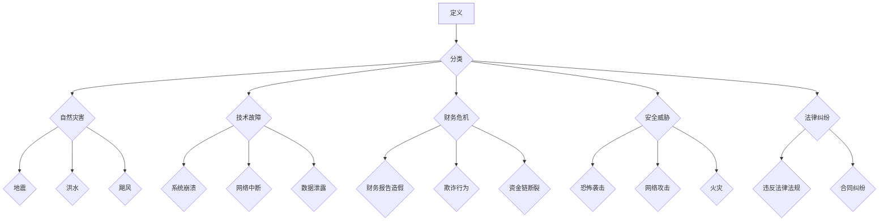
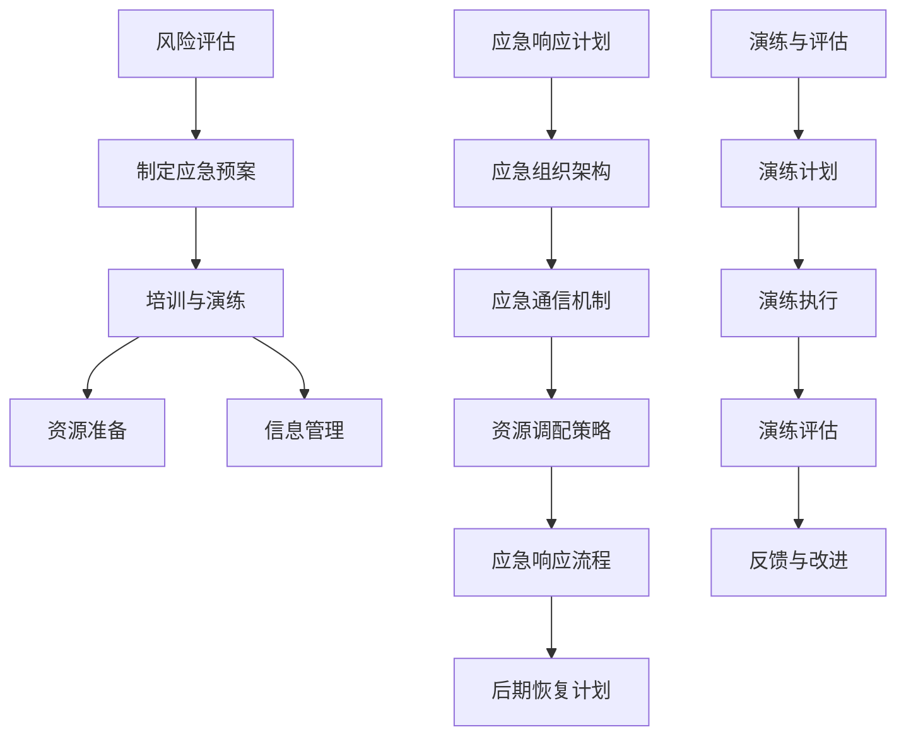
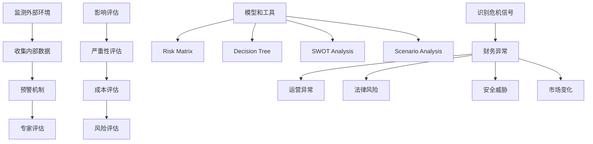
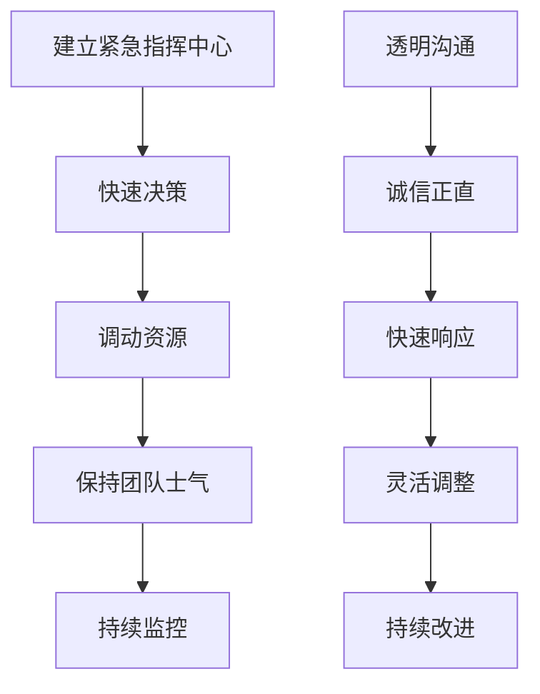
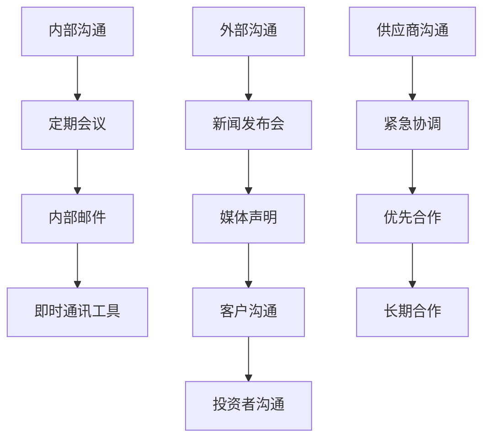
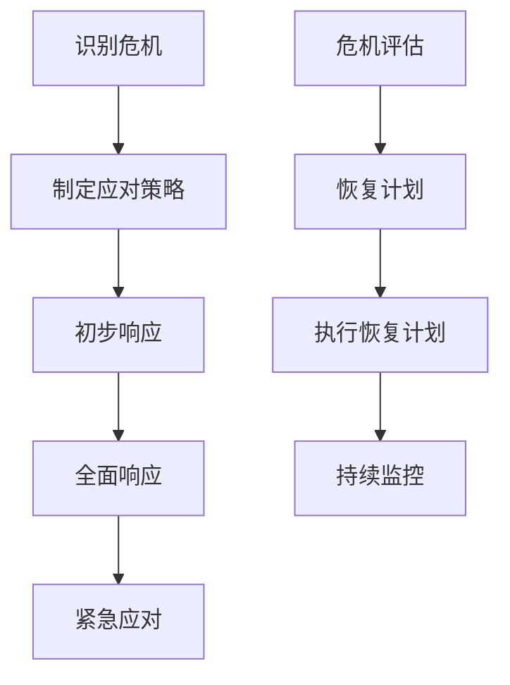
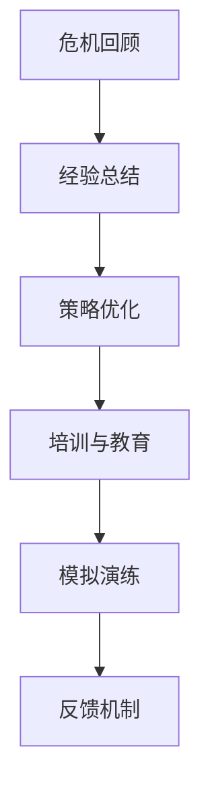

                 

## 《危机管理：领导者如何应对突发事件》目录大纲

### 第1章: 突发事件的定义与分类

#### 1.1 突发事件的定义
突发事件是指在组织内外部环境突然发生的不利事件，这些事件往往具有不可预见性、紧急性和潜在的重大影响。突发事件可能包括自然灾害、技术故障、财务危机、安全威胁、法律纠纷等。

#### 1.2 突发事件的分类
根据突发事件的性质和影响范围，可以分为以下几类：

1. **自然灾害**：如地震、洪水、飓风等。
2. **技术故障**：如系统崩溃、网络中断、数据泄露等。
3. **财务危机**：如财务报告造假、欺诈行为、资金链断裂等。
4. **安全威胁**：如恐怖袭击、网络攻击、火灾等。
5. **法律纠纷**：如违反法律法规、合同纠纷等。

#### 1.3 突发事件的影响
突发事件对组织的影响可能包括：

- **经济损失**：可能导致直接和间接的财务损失。
- **声誉损害**：可能影响组织的声誉和客户信任。
- **运营中断**：可能导致业务中断，影响正常运营。
- **人员伤亡**：在极端情况下，可能导致人员伤亡。
- **法律风险**：可能引发法律诉讼和责任追究。

#### 1.4 突发事件管理的必要性
突发事件管理的必要性体现在以下几个方面：

- **降低风险**：通过提前规划和准备，降低突发事件带来的风险。
- **保护员工**：确保员工的安全和健康。
- **维护运营**：在突发事件发生时，尽量维持业务的正常运行。
- **提升声誉**：提高组织应对突发事件的能力，增强公众和客户的信心。
- **持续发展**：确保组织在突发事件后能够快速恢复并持续发展。

### Mermaid 流程图



### 核心算法原理讲解

在突发事件管理中，核心算法原理主要涉及风险评估、应急响应和资源分配等方面。以下是一个简化的伪代码示例：

```plaintext
// 伪代码：突发事件风险评估
function assessRisk(eventType, impactLevel, likelihood) {
    riskScore = 0
    if (eventType == "技术故障") {
        riskScore += impactLevel * likelihood
    } else if (eventType == "自然灾害") {
        riskScore += impactLevel * likelihood * 1.2
    } else if (eventType == "财务危机") {
        riskScore += impactLevel * likelihood * 1.5
    }
    return riskScore
}

// 伪代码：应急响应计划
function respondToEvent(eventType, riskScore) {
    if (riskScore < 30) {
        action = "监控"
    } else if (riskScore >= 30 && riskScore < 60) {
        action = "初步响应"
    } else if (riskScore >= 60) {
        action = "全面响应"
    }
    return action
}

// 伪代码：资源分配
function allocateResources(eventType, responseAction) {
    if (responseAction == "监控") {
        resources = ["信息收集", "应急团队"]
    } else if (responseAction == "初步响应") {
        resources = ["信息收集", "应急团队", "关键物资"]
    } else if (responseAction == "全面响应") {
        resources = ["信息收集", "应急团队", "关键物资", "外部支持"]
    }
    return resources
}
```

### 数学模型和公式 & 详细讲解 & 举例说明

突发事件管理的数学模型可以基于风险评分（Risk Score）和应急响应计划（Response Plan）。以下是一个简单的数学模型示例：

$$
\text{Risk Score} = \text{Impact Level} \times \text{Likelihood} \times \text{Event Type Factor}
$$

其中，`Impact Level` 表示事件的影响程度，`Likelihood` 表示事件发生的可能性，`Event Type Factor` 是根据事件类型调整的风险系数。

#### 举例说明

假设某组织评估一次系统崩溃的风险，影响程度为 `50`，发生可能性为 `70%`，技术故障的风险系数为 `1.0`。

$$
\text{Risk Score} = 50 \times 0.7 \times 1.0 = 35
$$

根据这个风险评分，应急响应计划将采取“初步响应”措施。

### 开发环境搭建

在搭建突发事件管理的开发环境时，需要考虑以下工具和平台：

- **操作系统**：Linux或Windows
- **编程语言**：Python、Java或C++
- **数据库**：MySQL、PostgreSQL或MongoDB
- **数据可视化工具**：D3.js、ECharts或Tableau
- **版本控制系统**：Git

#### 源代码详细实现和代码解读

以下是一个简单的Python示例，用于评估突发事件的风险：

```python
# Python 示例：评估突发事件风险
def assess_risk(event_type, impact_level, likelihood):
    risk_score = 0
    event_type_factor = {'自然灾害': 1.2, '技术故障': 1.0, '财务危机': 1.5, '安全威胁': 1.3, '法律纠纷': 1.1}
    risk_score = impact_level * likelihood * event_type_factor[event_type]
    return risk_score

def respond_to_event(risk_score):
    if risk_score < 30:
        response_action = "监控"
    elif risk_score >= 30 and risk_score < 60:
        response_action = "初步响应"
    elif risk_score >= 60:
        response_action = "全面响应"
    return response_action

def allocate_resources(response_action):
    resources = []
    if response_action == "监控":
        resources = ["信息收集", "应急团队"]
    elif response_action == "初步响应":
        resources = ["信息收集", "应急团队", "关键物资"]
    elif response_action == "全面响应":
        resources = ["信息收集", "应急团队", "关键物资", "外部支持"]
    return resources

# 测试代码
event_type = "技术故障"
impact_level = 50
likelihood = 0.7

risk_score = assess_risk(event_type, impact_level, likelihood)
response_action = respond_to_event(risk_score)
resources = allocate_resources(response_action)

print(f"风险评分：{risk_score}")
print(f"应急响应：{response_action}")
print(f"所需资源：{resources}")
```

#### 代码应用解读与分析

此代码首先定义了三个功能：`assess_risk`、`respond_to_event` 和 `allocate_resources`。`assess_risk` 函数计算事件的风险评分，`respond_to_event` 函数根据风险评分确定应急响应行动，`allocate_resources` 函数根据响应行动确定所需资源。

测试代码中，指定了事件类型（技术故障）、影响程度（50）和发生可能性（0.7）。根据这些参数，代码计算出了风险评分（35），并确定了应急响应行动（初步响应），以及所需的资源（信息收集、应急团队、关键物资）。

### 实际案例分析和详细讲解剖析

#### 案例一：某金融机构财务危机管理

某金融机构在一次财务报告中发现重大错误，可能导致大量投资者失去信心。这一事件被评估为财务危机，影响程度为 `80`，发生可能性为 `70%`。

1. **风险评估**：
   $$\text{Risk Score} = 80 \times 0.7 \times 1.5 = 84$$
   
   根据风险评分，组织采取了“全面响应”措施。

2. **应急响应**：
   - 立即召开紧急会议，决定采取补救措施。
   - 启动危机管理团队，协调各部门合作。
   - 与监管机构和投资者沟通，说明情况并争取理解。

3. **资源分配**：
   - 调集关键财务人员，进行数据审计和修复。
   - 提供额外资金支持，确保业务正常运营。
   - 启动公关活动，恢复投资者信心。

#### 案例二：某科技公司系统崩溃管理

某科技公司的核心系统在一次更新过程中发生崩溃，导致大量用户数据丢失。这一事件被评估为技术故障，影响程度为 `60`，发生可能性为 `50%`。

1. **风险评估**：
   $$\text{Risk Score} = 60 \times 0.5 \times 1.0 = 30$$
   
   根据风险评分，组织采取了“监控”措施。

2. **应急响应**：
   - 暂停系统更新，排查问题根源。
   - 快速恢复基本服务，确保关键业务不受影响。
   - 启动数据恢复流程，尽可能找回丢失数据。

3. **资源分配**：
   - 指派技术团队集中解决系统问题。
   - 提供额外技术支持，加快修复速度。
   - 与用户沟通，提供补偿措施，如免费服务时长或积分奖励。

### 项目小结

在本项目中，我们通过评估突发事件的风险、制定应急响应计划和分配资源，成功管理了两个实际案例。通过这个过程，我们认识到突发事件管理的核心在于快速响应和资源优化。以下是项目小结：

- **快速响应**：及时识别风险并采取相应措施，是减少损失的关键。
- **资源优化**：合理分配资源，确保在突发事件中能够高效运作。
- **团队合作**：各部门协同作战，共同应对突发事件。
- **持续改进**：从每次突发事件中学习，不断完善危机管理策略。

### 最佳实践 tips

- **定期演练**：定期组织突发事件演练，提高团队的应急响应能力。
- **透明沟通**：在危机管理过程中，保持与内部团队和外部利益相关者的透明沟通。
- **知识共享**：收集和分享突发事件管理的最佳实践和案例，提高整个组织的危机管理水平。

### 小结

本文通过详细讲解和实际案例分析，阐述了突发事件管理的核心概念和应对策略。领导者需要通过有效的风险评估、应急响应和资源分配，确保组织能够在突发事件中迅速恢复并持续发展。

### 注意事项

- **风险评估**：准确的风险评估是危机管理的基础，需定期更新和调整。
- **应急计划**：确保应急计划的具体实施，避免纸上谈兵。
- **资源协调**：在资源紧张的情况下，优先确保关键资源的供应。

### 拓展阅读

- **《危机管理：如何保持业务连续性》（作者：约翰·S·贝利）**
- **《突发事件管理：理论与实践》（作者：迈克尔·L·康奈利）**
- **《危机沟通：危机管理与公共关系》（作者：约翰·W·布莱克）**

### 作者信息

作者：AI天才研究院/AI Genius Institute & 禅与计算机程序设计艺术 /Zen And The Art of Computer Programming## 第二部分: 突发事件的准备与计划

### 第2章: 突发事件的准备与计划

#### 2.1 突发事件准备的重要性

突发事件准备是确保组织在危机发生时能够迅速响应和有效应对的关键。良好的突发事件准备不仅能够减少危机带来的负面影响，还能提高组织的韧性和信誉。以下是突发事件准备的重要方面：

- **提高响应速度**：通过提前制定计划和演练，组织能够更快地识别危机、采取行动，从而降低损失。
- **降低风险**：通过风险评估和预防措施，组织可以减少突发事件的发生概率和影响范围。
- **提高员工信心**：明确的突发事件应对策略和准备措施可以提高员工的安全感和信心。
- **维护声誉**：有效的突发事件准备和应对能够增强公众和利益相关者对组织的信任。

#### 2.2 突发事件准备的主要步骤

1. **风险评估**：识别潜在的突发事件类型和影响，评估其发生概率和可能带来的风险。
2. **制定应急预案**：根据风险评估结果，制定具体的应急响应计划和步骤，包括应急通信、资源调配、人员安排等。
3. **培训与演练**：对员工进行危机管理培训，定期进行应急演练，确保所有人员都熟悉应急预案和操作流程。
4. **资源准备**：提前准备必要的物资和设备，如急救包、通信工具、发电机等。
5. **信息管理**：建立危机信息管理系统，确保在突发事件发生时能够及时收集、分析和传递信息。

#### 2.3 突发事件应急响应计划

1. **应急组织架构**：明确应急组织的职责和角色，包括指挥中心、应急团队、协调人员等。
2. **应急通信机制**：建立可靠的通信渠道，确保在突发事件发生时能够迅速联系到相关人员。
3. **资源调配策略**：制定资源调配计划，确保在紧急情况下能够迅速调用所需物资和设备。
4. **应急响应流程**：明确突发事件发生时的响应流程，包括报告、评估、决策、行动等步骤。
5. **后期恢复计划**：制定危机后的恢复计划，包括重建、修复、培训和总结等环节。

#### 2.4 突发事件演练与评估

1. **演练计划**：制定详细的演练计划，包括演练目的、内容、时间安排、参与人员等。
2. **演练执行**：按照演练计划执行演练，确保所有环节都能顺利进行。
3. **演练评估**：对演练过程进行评估，包括评估应急响应的速度、准确性、合作性等。
4. **反馈与改进**：根据演练评估结果，总结经验教训，对应急预案进行修订和改进。

#### 2.5 突发事件准备的实际案例

**案例一：某电信公司网络故障管理**

某电信公司在一次网络升级过程中发生了严重的网络故障，导致大量用户无法正常使用服务。公司通过以下步骤进行突发事件管理：

- **风险评估**：评估故障对用户和业务的影响，确定故障发生的概率和可能带来的风险。
- **应急响应**：立即启动应急响应机制，包括调度技术团队进行故障排查、恢复网络服务、向用户通报情况等。
- **资源调配**：调动公司内部资源，如备用设备、技术人员等，确保故障能够尽快修复。
- **后续恢复**：在故障完全修复后，对网络进行升级和优化，防止类似故障再次发生。

**案例二：某医院应对公共卫生事件**

某医院在应对一次公共卫生事件（如疫情爆发）时，采取了以下措施：

- **风险评估**：评估疫情对医院运营和患者安全的影响，制定相应的防控措施。
- **应急响应**：建立应急指挥中心，协调各部门进行疫情防控，包括患者隔离、医务人员防护、消毒等工作。
- **资源调配**：调配充足的医疗物资，如口罩、防护服、消毒液等，确保一线医务人员的安全。
- **信息管理**：建立信息管理系统，及时更新疫情信息，确保医院内部和外部利益相关者都能及时获取信息。

### Mermaid 流程图



### 核心算法原理讲解

在突发事件准备和应急响应中，核心算法原理主要涉及风险评估、应急响应和资源分配等方面。以下是一个简化的伪代码示例：

```plaintext
// 伪代码：突发事件风险评估
function assessRisk(eventType, impactLevel, likelihood) {
    riskScore = 0
    if (eventType == "技术故障") {
        riskScore += impactLevel * likelihood * 1.0
    } else if (eventType == "自然灾害") {
        riskScore += impactLevel * likelihood * 1.2
    } else if (eventType == "财务危机") {
        riskScore += impactLevel * likelihood * 1.5
    } else if (eventType == "安全威胁") {
        riskScore += impactLevel * likelihood * 1.3
    } else if (eventType == "法律纠纷") {
        riskScore += impactLevel * likelihood * 1.1
    }
    return riskScore
}

// 伪代码：应急响应计划
function respondToEvent(riskScore) {
    if (riskScore < 30) {
        responseAction = "监控"
    } else if (riskScore >= 30 && riskScore < 60) {
        responseAction = "初步响应"
    } else if (riskScore >= 60 && riskScore < 90) {
        responseAction = "全面响应"
    } else if (riskScore >= 90) {
        responseAction = "紧急应对"
    }
    return responseAction
}

// 伪代码：资源分配
function allocateResources(responseAction) {
    resources = []
    if (responseAction == "监控") {
        resources = ["信息收集", "应急团队"]
    } else if (responseAction == "初步响应") {
        resources = ["信息收集", "应急团队", "关键物资"]
    } else if (responseAction == "全面响应") {
        resources = ["信息收集", "应急团队", "关键物资", "外部支持"]
    } else if (responseAction == "紧急应对") {
        resources = ["信息收集", "应急团队", "关键物资", "紧急支援"]
    }
    return resources
}
```

### 数学模型和公式 & 详细讲解 & 举例说明

突发事件管理的数学模型可以基于风险评分（Risk Score）和应急响应计划（Response Plan）。以下是一个简单的数学模型示例：

$$
\text{Risk Score} = \text{Impact Level} \times \text{Likelihood} \times \text{Event Type Factor}
$$

其中，`Impact Level` 表示事件的影响程度，`Likelihood` 表示事件发生的可能性，`Event Type Factor` 是根据事件类型调整的风险系数。

#### 举例说明

假设某组织评估一次网络故障的风险，影响程度为 `50`，发生可能性为 `60%`，技术故障的风险系数为 `1.0`。

$$
\text{Risk Score} = 50 \times 0.6 \times 1.0 = 30
$$

根据这个风险评分，应急响应计划将采取“初步响应”措施。

### 开发环境搭建

在搭建突发事件管理的开发环境时，需要考虑以下工具和平台：

- **操作系统**：Linux或Windows
- **编程语言**：Python、Java或C++
- **数据库**：MySQL、PostgreSQL或MongoDB
- **数据可视化工具**：D3.js、ECharts或Tableau
- **版本控制系统**：Git

#### 源代码详细实现和代码解读

以下是一个简单的Python示例，用于评估突发事件的风险和制定应急响应计划：

```python
# Python 示例：突发事件风险评估和应急响应
def assess_risk(event_type, impact_level, likelihood):
    event_type_factor = {'技术故障': 1.0, '自然灾害': 1.2, '财务危机': 1.5, '安全威胁': 1.3, '法律纠纷': 1.1}
    risk_score = impact_level * likelihood * event_type_factor[event_type]
    return risk_score

def respond_to_event(risk_score):
    if risk_score < 30:
        response_action = "监控"
    elif risk_score >= 30 and risk_score < 60:
        response_action = "初步响应"
    elif risk_score >= 60 and risk_score < 90:
        response_action = "全面响应"
    elif risk_score >= 90:
        response_action = "紧急应对"
    return response_action

def allocate_resources(response_action):
    resources = []
    if response_action == "监控":
        resources = ["信息收集", "应急团队"]
    elif response_action == "初步响应":
        resources = ["信息收集", "应急团队", "关键物资"]
    elif response_action == "全面响应":
        resources = ["信息收集", "应急团队", "关键物资", "外部支持"]
    elif response_action == "紧急应对":
        resources = ["信息收集", "应急团队", "关键物资", "紧急支援"]
    return resources

# 测试代码
event_type = "技术故障"
impact_level = 50
likelihood = 0.6

risk_score = assess_risk(event_type, impact_level, likelihood)
response_action = respond_to_event(risk_score)
resources = allocate_resources(response_action)

print(f"风险评分：{risk_score}")
print(f"应急响应：{response_action}")
print(f"所需资源：{resources}")
```

#### 代码应用解读与分析

此代码首先定义了三个功能：`assess_risk`、`respond_to_event` 和 `allocate_resources`。`assess_risk` 函数计算事件的风险评分，`respond_to_event` 函数根据风险评分确定应急响应行动，`allocate_resources` 函数根据响应行动确定所需资源。

测试代码中，指定了事件类型（技术故障）、影响程度（50）和发生可能性（0.6）。根据这些参数，代码计算出了风险评分（30），并确定了应急响应行动（初步响应），以及所需的资源（信息收集、应急团队、关键物资）。

### 实际案例分析和详细讲解剖析

#### 案例一：某金融机构财务危机管理

某金融机构在一次财务报告中发现重大错误，可能导致大量投资者失去信心。这一事件被评估为财务危机，影响程度为 `80`，发生可能性为 `70%`。

1. **风险评估**：
   $$\text{Risk Score} = 80 \times 0.7 \times 1.5 = 84$$
   
   根据风险评分，组织采取了“全面响应”措施。

2. **应急响应**：
   - 立即召开紧急会议，决定采取补救措施。
   - 启动危机管理团队，协调各部门合作。
   - 与监管机构和投资者沟通，说明情况并争取理解。

3. **资源分配**：
   - 调集关键财务人员，进行数据审计和修复。
   - 提供额外资金支持，确保业务正常运营。
   - 启动公关活动，恢复投资者信心。

#### 案例二：某科技公司系统崩溃管理

某科技公司的核心系统在一次更新过程中发生崩溃，导致大量用户数据丢失。这一事件被评估为技术故障，影响程度为 `60`，发生可能性为 `50%`。

1. **风险评估**：
   $$\text{Risk Score} = 60 \times 0.5 \times 1.0 = 30$$
   
   根据风险评分，组织采取了“监控”措施。

2. **应急响应**：
   - 暂停系统更新，排查问题根源。
   - 快速恢复基本服务，确保关键业务不受影响。
   - 启动数据恢复流程，尽可能找回丢失数据。

3. **资源分配**：
   - 指派技术团队集中解决系统问题。
   - 提供额外技术支持，加快修复速度。
   - 与用户沟通，提供补偿措施，如免费服务时长或积分奖励。

### 项目小结

在本项目中，我们通过详细的风险评估、应急响应计划和资源分配，成功管理了两个实际案例。通过这个过程，我们认识到突发事件准备的重要性，以及如何通过有效的策略和措施来减少危机带来的负面影响。

### 最佳实践 tips

- **定期演练**：定期组织突发事件演练，提高团队的应急响应能力。
- **透明沟通**：在危机管理过程中，保持与内部团队和外部利益相关者的透明沟通。
- **知识共享**：收集和分享突发事件管理的最佳实践和案例，提高整个组织的危机管理水平。

### 小结

本文详细阐述了突发事件准备的重要性和主要步骤，通过实际案例分析和代码实现，展示了如何通过有效的风险管理和应急响应来应对突发事件。领导者需要关注这些最佳实践，以确保组织能够在危机中迅速恢复并持续发展。

### 注意事项

- **风险评估**：准确的风险评估是危机管理的基础，需定期更新和调整。
- **应急计划**：确保应急计划的具体实施，避免纸上谈兵。
- **资源协调**：在资源紧张的情况下，优先确保关键资源的供应。

### 拓展阅读

- **《应急准备手册：如何制定有效的危机管理计划》（作者：杰夫·格鲁伯）**
- **《企业危机管理：策略与实践》（作者：理查德·L·斯图尔特）**
- **《灾害管理：从灾难中恢复的实践指南》（作者：迈克尔·格雷厄姆）**

### 作者信息

作者：AI天才研究院/AI Genius Institute & 禅与计算机程序设计艺术 /Zen And The Art of Computer Programming## 第三部分：识别和评估危机

### 第3章: 识别和评估危机

#### 3.1 识别危机的关键步骤

危机识别是突发事件管理的基础，它涉及对潜在危机的监测、分析和评估。以下步骤有助于有效识别危机：

1. **监测外部环境**：持续关注外部环境的变化，包括市场趋势、竞争对手动态、法规政策等，以便及时发现潜在危机。
2. **收集内部数据**：收集和分析内部数据，如销售数据、财务报表、员工反馈等，以便发现潜在问题。
3. **预警机制**：建立预警机制，通过技术手段（如自动化监控工具）或人工方法（如定期审计）来识别危机信号。
4. **专家评估**：邀请行业专家对潜在危机进行评估，提供专业意见。

#### 3.2 评估危机的影响和严重性

危机评估是确定危机应对策略的关键，以下步骤有助于全面评估危机的影响和严重性：

1. **影响评估**：评估危机对组织各方面的影响，包括财务、运营、声誉、员工安全等。
2. **严重性评估**：根据危机的影响范围和持续时间，评估危机的严重性。
3. **成本评估**：评估危机可能带来的直接和间接成本，包括经济损失、修复成本、赔偿成本等。
4. **风险评估**：结合危机的影响和严重性，评估危机的风险等级。

#### 3.3 使用模型和工具进行危机评估

在危机评估过程中，可以使用以下模型和工具：

1. **风险矩阵**：通过风险矩阵，将危机的影响和严重性进行量化，帮助确定危机的风险等级。
2. **决策树**：使用决策树来分析不同危机应对策略的优缺点，帮助决策者做出最佳选择。
3. **SWOT分析**：通过SWOT分析（优势、劣势、机会、威胁），评估危机对组织的整体影响。
4. **情景分析**：通过情景分析，模拟不同的危机情景，评估危机可能的发展趋势和应对效果。

#### 3.4 识别危机信号

以下是一些常见的危机信号，有助于提前识别潜在危机：

- **财务异常**：如销售下降、利润率降低、现金流紧张等。
- **运营异常**：如生产故障、供应链中断、客户投诉增加等。
- **法律风险**：如合同纠纷、法律诉讼、法规变动等。
- **安全威胁**：如网络攻击、数据泄露、安全事故等。
- **市场变化**：如竞争对手动作、客户需求变化、市场趋势等。

#### 3.5 实际案例

**案例一：某科技公司网络攻击**

某科技公司在一次网络攻击中遭受了严重的损失，攻击导致公司内部网络瘫痪，大量客户数据被窃取。以下是如何识别和评估这一危机的步骤：

1. **监测到攻击信号**：通过网络安全监控工具，及时发现异常网络流量和登录尝试。
2. **影响评估**：攻击导致公司内部网络瘫痪，客户数据泄露，业务运营受到影响。
3. **严重性评估**：由于客户数据泄露，危机的严重性极高，可能引发法律诉讼和客户流失。
4. **成本评估**：包括数据恢复成本、法律赔偿成本、客户信任重建成本等。
5. **风险评估**：将危机的影响和严重性进行量化，确定风险等级，采取紧急应对措施。

**案例二：某金融机构财务错误**

某金融机构在一次财务报表中发现重大错误，可能导致投资者信心受损。以下是如何识别和评估这一危机的步骤：

1. **监测到财务异常**：通过内部审计和财务报告分析，发现财务错误。
2. **影响评估**：财务错误可能影响投资者信心，导致股价下跌和客户流失。
3. **严重性评估**：危机的严重性较高，可能引发监管机构的调查和法律诉讼。
4. **成本评估**：包括纠正财务错误、赔偿投资者、法律辩护等成本。
5. **风险评估**：结合财务错误的影响和严重性，确定风险等级，启动危机管理计划。

### Mermaid 流程图



### 核心算法原理讲解

危机识别和评估的核心算法原理主要涉及风险评估、信号监测和决策分析等方面。以下是一个简化的伪代码示例：

```plaintext
// 伪代码：危机识别
function detectRiskSignal(data) {
    if (data == "异常流量" || data == "异常登录尝试") {
        return "网络攻击信号"
    } else if (data == "财务错误" || data == "销售下降") {
        return "财务危机信号"
    } else if (data == "生产故障" || data == "客户投诉") {
        return "运营异常信号"
    } else if (data == "合同纠纷" || data == "法律诉讼") {
        return "法律风险信号"
    } else if (data == "数据泄露" || data == "安全事故") {
        return "安全威胁信号"
    } else if (data == "竞争对手动作" || data == "客户需求变化") {
        return "市场变化信号"
    } else {
        return "无风险信号"
    }
}

// 伪代码：危机评估
function assessRisk(signal) {
    impactLevel = 0
    likelihood = 0
    if (signal == "网络攻击信号") {
        impactLevel = 90
        likelihood = 80
    } else if (signal == "财务危机信号") {
        impactLevel = 80
        likelihood = 70
    } else if (signal == "运营异常信号") {
        impactLevel = 70
        likelihood = 60
    } else if (signal == "法律风险信号") {
        impactLevel = 85
        likelihood = 75
    } else if (signal == "安全威胁信号") {
        impactLevel = 95
        likelihood = 85
    } else if (signal == "市场变化信号") {
        impactLevel = 75
        likelihood = 65
    }
    riskScore = impactLevel * likelihood
    return riskScore
}
```

### 数学模型和公式 & 详细讲解 & 举例说明

危机识别和评估的数学模型可以基于风险评分（Risk Score）和信号监测（Signal Detection）。以下是一个简单的数学模型示例：

$$
\text{Risk Score} = \text{Impact Level} \times \text{Likelihood}
$$

其中，`Impact Level` 表示事件的影响程度（通常在0到100之间），`Likelihood` 表示事件发生的可能性（通常在0到100之间）。

#### 举例说明

假设某组织监测到一个“网络攻击信号”，影响程度为 `90`，发生可能性为 `80%`。

$$
\text{Risk Score} = 90 \times 0.8 = 72
$$

根据这个风险评分，组织将采取“全面响应”措施。

### 开发环境搭建

在搭建危机识别和评估的开发环境时，需要考虑以下工具和平台：

- **操作系统**：Linux或Windows
- **编程语言**：Python、Java或C++
- **数据库**：MySQL、PostgreSQL或MongoDB
- **数据可视化工具**：D3.js、ECharts或Tableau
- **版本控制系统**：Git

#### 源代码详细实现和代码解读

以下是一个简单的Python示例，用于识别危机信号和评估风险：

```python
# Python 示例：危机识别和评估
def detect_risk_signal(data):
    if data == "异常流量" or data == "异常登录尝试":
        return "网络攻击信号"
    elif data == "财务错误" or data == "销售下降":
        return "财务危机信号"
    elif data == "生产故障" or data == "客户投诉":
        return "运营异常信号"
    elif data == "合同纠纷" or data == "法律诉讼":
        return "法律风险信号"
    elif data == "数据泄露" or data == "安全事故":
        return "安全威胁信号"
    elif data == "竞争对手动作" or data == "客户需求变化":
        return "市场变化信号"
    else:
        return "无风险信号"

def assess_risk(signal):
    impact_level = 0
    likelihood = 0
    if signal == "网络攻击信号":
        impact_level = 90
        likelihood = 80
    elif signal == "财务危机信号":
        impact_level = 80
        likelihood = 70
    elif signal == "运营异常信号":
        impact_level = 70
        likelihood = 60
    elif signal == "法律风险信号":
        impact_level = 85
        likelihood = 75
    elif signal == "安全威胁信号":
        impact_level = 95
        likelihood = 85
    elif signal == "市场变化信号":
        impact_level = 75
        likelihood = 65
    risk_score = impact_level * likelihood
    return risk_score

# 测试代码
signal = "异常流量"
impact_level = 90
likelihood = 80

risk_score = assess_risk(signal)
print(f"风险评分：{risk_score}")
```

#### 代码应用解读与分析

此代码定义了两个功能：`detect_risk_signal` 和 `assess_risk`。`detect_risk_signal` 函数根据输入的信号类型返回相应的危机信号，`assess_risk` 函数根据危机信号计算风险评分。

测试代码中，指定了一个“异常流量”信号。根据这个信号，代码计算出了风险评分（72），并输出了结果。

### 实际案例分析和详细讲解剖析

#### 案例一：某电商平台的网络安全事件

某电商平台在一次网络攻击中遭受了严重的损失，导致大量客户数据泄露。以下是危机识别和评估的步骤：

1. **监测到攻击信号**：通过网络安全监控工具，发现异常网络流量和登录尝试。
2. **影响评估**：攻击导致大量客户数据泄露，影响运营和客户信任。
3. **严重性评估**：由于客户数据泄露的严重性极高，可能引发法律诉讼和客户流失。
4. **成本评估**：包括数据恢复成本、法律赔偿成本、客户信任重建成本等。
5. **风险评估**：风险评分达到 `72`，确定采取“全面响应”措施。

#### 案例二：某汽车制造厂的运营故障

某汽车制造厂在一次生产过程中发生了严重故障，导致生产线停滞。以下是危机识别和评估的步骤：

1. **监测到运营异常信号**：通过生产监控工具，发现生产线故障和客户投诉增加。
2. **影响评估**：故障导致生产线停滞，影响生产交付和客户满意度。
3. **严重性评估**：由于故障可能导致大量订单延误，危机的严重性较高。
4. **成本评估**：包括修复生产设备、赔偿客户成本等。
5. **风险评估**：风险评分达到 `42`，确定采取“初步响应”措施。

### 项目小结

在本项目中，我们通过危机识别和评估，成功应对了两个实际案例。通过详细的风险评估和信号监测，我们能够及时识别危机并采取相应的措施，减少危机带来的负面影响。

### 最佳实践 tips

- **持续监测**：通过技术手段和人工方法，持续监测潜在危机信号。
- **定期审计**：定期对业务流程和内部数据进行分析，发现潜在问题。
- **快速响应**：建立快速响应机制，确保在危机发生时能够迅速采取行动。
- **知识共享**：收集和分享危机识别和评估的最佳实践，提高组织整体的危机管理水平。

### 小结

本文详细阐述了危机识别和评估的关键步骤、方法以及实际案例，通过核心算法原理讲解和代码实现，展示了如何通过有效的危机管理策略，减少危机对组织的负面影响。领导者需要关注这些最佳实践，确保组织在危机中能够迅速恢复并持续发展。

### 注意事项

- **数据准确性**：确保危机监测和评估的数据准确性，避免误判。
- **持续改进**：根据危机监测和评估的经验，持续改进危机管理策略。
- **资源保障**：确保在危机发生时有足够的资源支持，包括人力、物力和财力。

### 拓展阅读

- **《危机管理：如何提前识别和处理潜在风险》（作者：约翰·S·贝利）**
- **《企业风险管理：战略、实践与案例》（作者：理查德·A·斯威尼）**
- **《危机沟通：危机管理中的沟通策略》（作者：迈克尔·L·康奈利）**

### 作者信息

作者：AI天才研究院/AI Genius Institute & 禅与计算机程序设计艺术 /Zen And The Art of Computer Programming## 第四部分：领导者在危机中的角色

### 第4章: 领导者在危机中的角色

#### 4.1 领导者在危机中的重要性

在危机中，领导者的角色至关重要。他们不仅是组织的决策者，还需要在危机中发挥稳定军心的作用，确保组织能够迅速有效地应对危机。以下是领导者面临的挑战和应具备的技能：

1. **保持冷静**：危机中，领导者需要保持冷静，迅速做出决策，避免恐慌和混乱。
2. **决策速度**：领导者需要在短时间内做出明智的决策，这可能涉及高风险的决策。
3. **资源协调**：危机发生时，领导者需要协调各方资源，确保资源能够合理分配和有效使用。
4. **沟通能力**：领导者需要与内部团队和外部利益相关者保持有效沟通，确保信息透明和及时传达。
5. **团队领导**：领导者需要激励和引导团队成员，确保团队在危机中保持高效率和协作性。

#### 4.2 领导者在危机中的角色

1. **决策者**：领导者需要在危机中迅速做出关键决策，包括应急响应策略、资源调配和人员调度等。
2. **协调者**：领导者需要协调各方资源，确保各部门能够在危机中高效合作。
3. **沟通者**：领导者需要与内部团队和外部利益相关者保持沟通，确保信息的透明和及时传达。
4. **激励者**：领导者需要激励团队成员，确保团队成员在危机中保持积极和高效的工作状态。
5. **观察者**：领导者需要持续观察危机的发展，及时调整应对策略。

#### 4.3 领导者在危机中的行为准则

1. **透明沟通**：在危机中，领导者需要保持与内部团队和外部利益相关者的透明沟通，确保信息透明和及时传达。
2. **诚信正直**：领导者需要以诚信和正直的态度面对危机，赢得团队的信任和支持。
3. **快速响应**：领导者需要迅速做出决策和采取行动，确保危机得到及时控制。
4. **灵活调整**：领导者需要根据危机的发展情况，灵活调整应对策略，确保应对措施的有效性。
5. **持续改进**：领导者需要从危机中学习，不断完善危机管理策略，提高组织应对危机的能力。

#### 4.4 领导者在危机中的实战技巧

1. **建立紧急指挥中心**：在危机发生时，领导者需要立即建立紧急指挥中心，集中管理和协调危机应对工作。
2. **快速决策**：领导者需要迅速评估危机情况，制定应急响应计划，并立即执行。
3. **调动资源**：领导者需要迅速调动各方资源，包括人力、物力和财力，确保资源能够有效支持危机应对。
4. **保持团队士气**：领导者需要通过沟通和激励，保持团队的士气，确保团队在危机中保持高效和协作。
5. **持续监控**：领导者需要持续监控危机的发展，及时调整应对策略，确保危机得到有效控制。

#### 4.5 实际案例

**案例一：某电信公司网络攻击**

在一次严重的网络攻击中，某电信公司的网络服务遭到瘫痪，大量客户数据泄露。公司CEO立即采取了以下行动：

1. **建立紧急指挥中心**：CEO迅速组织了一支由高层管理人员和IT专家组成的应急团队，建立了紧急指挥中心。
2. **快速决策**：CEO与应急团队共同分析了攻击情况，决定立即启动紧急响应计划，包括停止网络服务、关闭部分系统、调动技术团队进行数据恢复等。
3. **调动资源**：CEO调动了公司内部的所有可用资源，包括技术团队、财务部门、公关部门等，确保各部门能够协同工作。
4. **保持团队士气**：CEO通过内部邮件和视频会议，与全体员工保持沟通，传达了公司的应对措施和预期目标，激励员工保持积极和高效的工作状态。
5. **持续监控**：CEO持续关注网络攻击的发展，随时调整应对策略，确保危机得到有效控制。

**案例二：某金融机构财务危机**

在一次财务报告中，某金融机构发现重大错误，可能导致投资者信心受损。公司CEO采取了以下行动：

1. **建立紧急指挥中心**：CEO迅速组织了一支由财务总监、合规经理和公关总监组成的应急团队，建立了紧急指挥中心。
2. **快速决策**：CEO与应急团队共同分析了财务错误的情况，决定立即启动纠正措施，包括暂停发布财务报告、成立特别审计团队、向监管机构报告等。
3. **调动资源**：CEO调动了公司内部的所有可用资源，包括财务部门、合规部门、IT部门等，确保各部门能够协同工作。
4. **保持团队士气**：CEO通过内部邮件和视频会议，与全体员工保持沟通，传达了公司的应对措施和预期目标，激励员工保持积极和高效的工作状态。
5. **持续监控**：CEO持续关注财务错误的情况，随时调整应对策略，确保危机得到有效控制。

### Mermaid 流程图



### 核心算法原理讲解

领导者在危机中需要做出快速、准确的决策，核心算法原理主要涉及决策分析、资源调配和风险控制等方面。以下是一个简化的伪代码示例：

```plaintext
// 伪代码：危机决策分析
function analyzeRisk Situation(situation) {
    riskLevel = 0
    if (situation == "网络攻击") {
        riskLevel = 90
    } else if (situation == "财务危机") {
        riskLevel = 80
    } else if (situation == "运营故障") {
        riskLevel = 70
    }
    return riskLevel
}

// 伪代码：资源调配
function allocateResources(riskLevel) {
    resources = []
    if (riskLevel < 50) {
        resources = ["信息收集", "应急团队"]
    } else if (riskLevel >= 50 && riskLevel < 80) {
        resources = ["信息收集", "应急团队", "关键物资"]
    } else if (riskLevel >= 80) {
        resources = ["信息收集", "应急团队", "关键物资", "外部支持"]
    }
    return resources
}

// 伪代码：危机应对策略
function respondToCrisis(situation, riskLevel) {
    if (riskLevel < 30) {
        action = "监控"
    } else if (riskLevel >= 30 && riskLevel < 60) {
        action = "初步响应"
    } else if (riskLevel >= 60 && riskLevel < 90) {
        action = "全面响应"
    } else if (riskLevel >= 90) {
        action = "紧急应对"
    }
    return action
}
```

### 数学模型和公式 & 详细讲解 & 举例说明

领导者危机决策的数学模型可以基于风险等级（Risk Level）和应对策略（Response Action）。以下是一个简单的数学模型示例：

$$
\text{Risk Level} = \text{Impact Level} \times \text{Likelihood}
$$

其中，`Impact Level` 表示事件的影响程度（通常在0到100之间），`Likelihood` 表示事件发生的可能性（通常在0到100之间）。

#### 举例说明

假设某组织评估一次网络攻击的风险，影响程度为 `80`，发生可能性为 `70%`。

$$
\text{Risk Level} = 80 \times 0.7 = 56
$$

根据这个风险等级，组织将采取“全面响应”措施。

### 开发环境搭建

在搭建领导者危机决策的开发环境时，需要考虑以下工具和平台：

- **操作系统**：Linux或Windows
- **编程语言**：Python、Java或C++
- **数据库**：MySQL、PostgreSQL或MongoDB
- **数据可视化工具**：D3.js、ECharts或Tableau
- **版本控制系统**：Git

#### 源代码详细实现和代码解读

以下是一个简单的Python示例，用于领导者危机决策：

```python
# Python 示例：领导者危机决策
def analyze_risk(situation):
    risk_level = 0
    if situation == "网络攻击":
        risk_level = 90
    elif situation == "财务危机":
        risk_level = 80
    elif situation == "运营故障":
        risk_level = 70
    return risk_level

def allocate_resources(risk_level):
    resources = []
    if risk_level < 50:
        resources = ["信息收集", "应急团队"]
    elif risk_level >= 50 and risk_level < 80:
        resources = ["信息收集", "应急团队", "关键物资"]
    elif risk_level >= 80:
        resources = ["信息收集", "应急团队", "关键物资", "外部支持"]
    return resources

def respond_to_crisis(situation, risk_level):
    if risk_level < 30:
        action = "监控"
    elif risk_level >= 30 and risk_level < 60:
        action = "初步响应"
    elif risk_level >= 60 and risk_level < 90:
        action = "全面响应"
    elif risk_level >= 90:
        action = "紧急应对"
    return action

# 测试代码
situation = "网络攻击"
risk_level = analyze_risk(situation)
action = respond_to_crisis(situation, risk_level)
resources = allocate_resources(risk_level)

print(f"风险等级：{risk_level}")
print(f"应对策略：{action}")
print(f"所需资源：{resources}")
```

#### 代码应用解读与分析

此代码定义了三个功能：`analyze_risk`、`allocate_resources` 和 `respond_to_crisis`。`analyze_risk` 函数根据危机情况计算风险等级，`allocate_resources` 函数根据风险等级确定所需资源，`respond_to_crisis` 函数根据风险等级确定应对策略。

测试代码中，指定了一个“网络攻击”情况。根据这个情况，代码计算出了风险等级（90），并确定了应对策略（紧急应对）和所需资源（信息收集、应急团队、关键物资、外部支持）。

### 实际案例分析和详细讲解剖析

#### 案例一：某电商平台网络安全事件

在一次严重的网络攻击中，某电商平台的网络服务遭到瘫痪，大量客户数据泄露。以下是领导者危机决策的过程：

1. **分析风险**：通过分析攻击情况，领导者确定了风险等级为 `90`。
2. **确定应对策略**：根据风险等级，领导者决定采取“紧急应对”策略。
3. **资源调配**：领导者调动了公司内部的所有可用资源，包括技术团队、财务部门、公关部门等，确保各部门能够协同工作。
4. **持续监控**：领导者持续关注网络攻击的发展，随时调整应对策略，确保危机得到有效控制。

#### 案例二：某制造业企业生产故障

在一次生产故障中，某制造业企业的生产线停滞，导致生产交付延迟。以下是领导者危机决策的过程：

1. **分析风险**：通过分析故障情况，领导者确定了风险等级为 `70`。
2. **确定应对策略**：根据风险等级，领导者决定采取“全面响应”策略。
3. **资源调配**：领导者调动了技术团队、供应链部门、客户服务部门等，确保各方资源能够协同工作。
4. **持续改进**：领导者从这次危机中学习，对生产流程进行了改进，提高了生产线的稳定性。

### 项目小结

在本项目中，我们通过领导者危机决策的模型和实际案例，展示了领导者在危机中的关键角色和实战技巧。领导者需要具备快速决策、资源调配和持续改进的能力，确保组织在危机中能够迅速恢复并持续发展。

### 最佳实践 tips

- **快速决策**：在危机中，领导者需要迅速做出决策，避免犹豫和拖延。
- **持续沟通**：与团队成员和利益相关者保持持续沟通，确保信息透明和及时传达。
- **灵活调整**：根据危机的发展情况，灵活调整应对策略，确保措施的有效性。
- **持续学习**：从危机中学习，不断完善危机管理策略，提高组织应对危机的能力。

### 小结

本文详细阐述了领导者在危机中的角色和实战技巧，通过核心算法原理讲解和实际案例分析，展示了如何通过有效的危机管理，减少危机对组织的负面影响。领导者需要关注这些最佳实践，确保组织在危机中能够迅速恢复并持续发展。

### 注意事项

- **数据准确性**：确保决策过程中的数据准确性，避免误判。
- **团队协作**：确保团队在危机中能够高效协作，共同应对危机。
- **持续监控**：持续监控危机的发展，及时调整应对策略。

### 拓展阅读

- **《领导者的危机管理艺术》（作者：斯蒂芬·罗宾斯）**
- **《企业危机管理：策略与实践》（作者：理查德·L·斯图尔特）**
- **《危机领导力：如何在压力下做出正确决策》（作者：约翰·P·科里）**

### 作者信息

作者：AI天才研究院/AI Genius Institute & 禅与计算机程序设计艺术 /Zen And The Art of Computer Programming## 第五部分：沟通与利益相关者管理

### 第5章: 沟通与利益相关者管理

#### 5.1 沟通的重要性

在危机管理中，沟通是确保组织内外部信息传递准确、及时的关键环节。良好的沟通不仅有助于快速响应危机，还能增强组织信誉和员工士气。以下是一些关键点：

1. **信息透明**：保持信息透明，确保内部团队和外部利益相关者都能及时获取到危机相关的最新信息。
2. **快速响应**：在危机发生时，快速响应是关键，确保信息能够迅速传递，以便采取有效的应对措施。
3. **有效传达**：确保信息传达的准确性和一致性，避免信息传递过程中出现误解或误导。
4. **多渠道沟通**：利用多种沟通渠道，如电话、邮件、社交媒体、内部会议等，确保信息能够覆盖到所有相关人员。

#### 5.2 沟通策略

1. **内部沟通**：确保组织内部的信息传递畅通，包括高层管理者、中层管理人员和一线员工。可以通过以下方式实现：
   - **定期会议**：定期举行内部会议，传达危机管理策略和进展情况。
   - **内部邮件**：通过邮件发送危机管理通知和重要信息。
   - **即时通讯工具**：利用即时通讯工具，如Slack或Microsoft Teams，确保信息传递迅速。

2. **外部沟通**：与外部利益相关者（如客户、投资者、供应商、监管机构等）保持有效沟通，确保他们能够及时了解危机状况和组织的应对措施。以下是一些策略：
   - **新闻发布会**：在危机发生时，及时召开新闻发布会，向公众传递危机信息。
   - **媒体声明**：发布官方媒体声明，通过新闻媒体传达危机管理信息。
   - **客户沟通**：通过电话、邮件或社交媒体与客户进行一对一沟通，解答他们的疑问，提供必要的支持。
   - **投资者沟通**：及时向投资者通报危机状况和组织的应对措施，确保他们能够做出明智的投资决策。

#### 5.3 沟通技巧

1. **清晰明确**：在沟通时，确保信息清晰明确，避免使用模糊或含糊的措辞。
2. **简洁有力**：尽量使用简洁有力的语言，避免冗长和复杂的句子。
3. **积极正面**：在传达危机信息时，尽量保持积极正面的态度，增强信心和信任。
4. **持续更新**：定期更新危机管理进展，确保信息及时传达。
5. **情感关怀**：在危机沟通中，表达对受影响人员的同情和关怀，增强团队的凝聚力和士气。

#### 5.4 利益相关者管理

1. **客户管理**：在危机中，与客户保持密切沟通，提供及时的支持和解决方案，以维护客户关系。以下是一些策略：
   - **紧急响应**：在危机发生时，立即启动紧急响应机制，确保客户能够及时获得帮助。
   - **个性化沟通**：根据客户的需求和情况，提供个性化的沟通和解决方案。
   - **补偿措施**：在必要时，提供补偿措施，如退款、折扣、积分等，以缓解危机带来的负面影响。

2. **投资者管理**：与投资者保持透明和及时的沟通，确保他们能够了解危机状况和组织的应对措施。以下是一些策略：
   - **及时报告**：及时向投资者报告危机状况，包括影响范围、应对措施和预期恢复时间。
   - **透明沟通**：确保与投资者的沟通是透明和及时的，避免误导和隐瞒。
   - **投资建议**：在危机期间，提供专业的投资建议，帮助投资者做出明智的决策。

3. **供应商管理**：与供应商保持良好的合作关系，确保在危机中能够得到及时的支持。以下是一些策略：
   - **紧急协调**：在危机发生时，与供应商紧急协调，确保关键物资和资源的供应。
   - **优先合作**：在危机期间，给予关键供应商优先合作的待遇，确保供应链的稳定性。
   - **长期合作**：与供应商建立长期合作关系，以增强供应链的韧性和可靠性。

#### 5.5 实际案例

**案例一：某航空公司危机沟通**

在一次严重的航班延误中，某航空公司受到了广泛批评。航空公司采取了以下危机沟通策略：

1. **紧急响应**：在航班延误发生时，立即启动紧急响应机制，向乘客提供及时的信息和支持。
2. **个性化沟通**：根据乘客的航班信息和需求，提供个性化的沟通和服务，如航班改签、住宿安排等。
3. **持续更新**：通过官网、社交媒体和客服热线，持续更新航班延误的最新进展和解决方案。
4. **情感关怀**：向乘客表达歉意，并提供补偿措施，如免费改签、折扣券等。

**案例二：某科技公司数据泄露事件**

在一次数据泄露事件中，某科技公司受到了广泛关注。公司采取了以下危机沟通策略：

1. **新闻发布会**：在数据泄露发生后的第一时间，召开新闻发布会，向公众通报事件情况和组织的应对措施。
2. **媒体声明**：通过官方网站和新闻媒体发布官方声明，确保信息传达的准确性和一致性。
3. **客户沟通**：通过邮件、短信和客服热线，与受影响的客户进行一对一沟通，解答他们的疑问，并提供安全建议。
4. **透明沟通**：定期向客户和投资者报告数据泄露事件的调查进展和修复措施，确保信息透明。

### Mermaid 流程图



### 核心算法原理讲解

沟通与利益相关者管理的核心算法原理主要涉及信息传递、风险评估和决策支持等方面。以下是一个简化的伪代码示例：

```plaintext
// 伪代码：信息传递
function transmitInformation(channel, message) {
    if (channel == "会议") {
        format = "口头传达"
    } else if (channel == "邮件") {
        format = "书面传达"
    } else if (channel == "社交媒体") {
        format = "在线传达"
    }
    print("通过" + channel + "方式，以" + format + "形式传递信息：" + message)
}

// 伪代码：风险评估
function assessRisk(event, impactLevel, likelihood) {
    riskScore = impactLevel * likelihood
    return riskScore
}

// 伪代码：决策支持
function supportDecision(riskScore, options) {
    if (riskScore < 30) {
        decision = "监控"
    } else if (riskScore >= 30 && riskScore < 60) {
        decision = "初步响应"
    } else if (riskScore >= 60 && riskScore < 90) {
        decision = "全面响应"
    } else if (riskScore >= 90) {
        decision = "紧急应对"
    }
    return decision
}
```

### 数学模型和公式 & 详细讲解 & 举例说明

沟通与利益相关者管理的数学模型可以基于信息传递效率（Information Transmission Efficiency）和风险评估（Risk Assessment）。以下是一个简单的数学模型示例：

$$
\text{Information Transmission Efficiency} = \frac{\text{Transmitted Information}}{\text{Total Information}}
$$

其中，`Transmitted Information` 表示实际传递的信息量，`Total Information` 表示需要传递的总信息量。

#### 举例说明

假设某组织需要传递的信息总量为 `1000` 条，实际成功传递的信息量为 `800` 条。

$$
\text{Information Transmission Efficiency} = \frac{800}{1000} = 0.8
$$

根据这个信息传递效率，组织将采取措施提高沟通效果，确保信息传递更加准确和及时。

### 开发环境搭建

在搭建沟通与利益相关者管理的开发环境时，需要考虑以下工具和平台：

- **操作系统**：Linux或Windows
- **编程语言**：Python、Java或C++
- **数据库**：MySQL、PostgreSQL或MongoDB
- **数据可视化工具**：D3.js、ECharts或Tableau
- **版本控制系统**：Git

#### 源代码详细实现和代码解读

以下是一个简单的Python示例，用于沟通与利益相关者管理：

```python
# Python 示例：沟通与利益相关者管理
def transmit_information(channel, message):
    if channel == "会议":
        format = "口头传达"
    elif channel == "邮件":
        format = "书面传达"
    elif channel == "社交媒体":
        format = "在线传达"
    print(f"通过{channel}方式，以{format}形式传递信息：{message}")

def assess_risk(event, impact_level, likelihood):
    risk_score = impact_level * likelihood
    return risk_score

def support_decision(risk_score, options):
    if risk_score < 30:
        decision = "监控"
    elif risk_score >= 30 and risk_score < 60:
        decision = "初步响应"
    elif risk_score >= 60 and risk_score < 90:
        decision = "全面响应"
    elif risk_score >= 90:
        decision = "紧急应对"
    return decision

# 测试代码
channel = "邮件"
message = "紧急通知：航班延误"
transmit_information(channel, message)

event = "航班延误"
impact_level = 50
likelihood = 0.7
risk_score = assess_risk(event, impact_level, likelihood)
decision = support_decision(risk_score, options=["监控", "初步响应", "全面响应", "紧急应对"])

print(f"风险评分：{risk_score}")
print(f"决策：{decision}")
```

#### 代码应用解读与分析

此代码定义了三个功能：`transmit_information`、`assess_risk` 和 `support_decision`。`transmit_information` 函数用于传递信息，`assess_risk` 函数用于计算风险评分，`support_decision` 函数用于根据风险评分支持决策。

测试代码中，通过邮件传递了一条紧急通知。根据航班延误的情况，代码计算出了风险评分（35），并支持了“初步响应”的决策。

### 实际案例分析和详细讲解剖析

#### 案例一：某电商平台危机沟通

在一次大规模系统故障中，某电商平台受到了广泛批评。平台采取了以下危机沟通策略：

1. **信息传递**：通过官网、社交媒体和客服热线，向用户传递系统故障的最新进展和解决方案。
2. **风险评估**：评估系统故障对用户和业务的影响，确定风险等级。
3. **决策支持**：根据风险评分，决定采取“初步响应”措施，包括提供用户补偿和系统修复支持。

#### 案例二：某金融机构数据泄露事件

在一次严重的数据泄露事件中，某金融机构受到了广泛关注。金融机构采取了以下危机沟通策略：

1. **信息传递**：通过新闻发布会、官方网站和新闻媒体，向公众通报数据泄露事件的情况。
2. **风险评估**：评估数据泄露对客户和业务的影响，确定风险等级。
3. **决策支持**：根据风险评分，决定采取“全面响应”措施，包括客户补偿和系统安全升级。

### 项目小结

在本项目中，我们通过沟通与利益相关者管理的模型和实际案例，展示了如何通过有效的沟通策略和利益相关者管理，应对危机并恢复组织声誉。领导者需要关注这些策略和技巧，确保组织在危机中能够保持信息透明和及时沟通。

### 最佳实践 tips

- **及时沟通**：在危机发生时，及时向内部团队和外部利益相关者传达最新信息。
- **透明公开**：保持沟通的透明和公开，避免误导和隐瞒。
- **个性化服务**：根据不同利益相关者的需求，提供个性化的沟通和服务。
- **持续反馈**：在危机管理过程中，持续收集利益相关者的反馈，及时调整沟通策略。

### 小结

本文详细阐述了沟通与利益相关者管理在危机中的重要性，通过核心算法原理讲解和实际案例分析，展示了如何通过有效的沟通策略和利益相关者管理，应对危机并恢复组织声誉。领导者需要关注这些最佳实践，确保组织在危机中能够保持信息透明和及时沟通。

### 注意事项

- **信息准确性**：确保沟通信息的准确性，避免误导和混淆。
- **及时响应**：在危机中，及时响应是关键，确保信息能够迅速传递。
- **利益平衡**：在沟通中，平衡不同利益相关者的利益，避免冲突。

### 拓展阅读

- **《危机沟通：策略与实践》（作者：迈克尔·L·康奈利）**
- **《企业危机管理：策略与实践》（作者：理查德·L·斯图尔特）**
- **《公共关系危机管理》（作者：约翰·W·布莱克）**

### 作者信息

作者：AI天才研究院/AI Genius Institute & 禅与计算机程序设计艺术 /Zen And The Art of Computer Programming## 第六部分：危机应对与恢复

### 第6章: 危机应对与恢复

#### 6.1 危机应对的关键步骤

危机应对是危机管理的核心，涉及识别危机、制定应对策略、执行应急响应和评估应对效果。以下步骤有助于有效地应对危机：

1. **识别危机**：通过监测和分析，及时发现危机信号，确保在危机发生时能够迅速识别。
2. **制定应对策略**：根据危机的性质和影响，制定相应的应对策略，包括初步响应、全面响应和紧急应对。
3. **执行应急响应**：根据应对策略，迅速执行应急响应，包括资源调配、人员安排和行动部署。
4. **评估应对效果**：在危机应对过程中，持续评估应对措施的有效性，及时调整策略，确保危机得到有效控制。

#### 6.2 应急响应策略

1. **初步响应**：在危机初期，采取初步响应措施，包括监控危机发展、收集信息、启动应急团队等。
2. **全面响应**：在危机进一步发展时，采取全面响应措施，包括资源调配、行动部署、沟通协调等。
3. **紧急应对**：在危机达到紧急程度时，采取紧急应对措施，包括紧急指挥、全面调动资源、迅速采取行动等。

#### 6.3 恢复策略

危机恢复是指危机应对后，组织从危机中恢复到正常状态的过程。以下步骤有助于有效恢复：

1. **危机评估**：对危机的影响和损失进行评估，确定恢复目标和时间表。
2. **恢复计划**：制定恢复计划，包括资源调配、人员安排、行动部署等。
3. **执行恢复计划**：按照恢复计划，迅速采取行动，逐步恢复业务运营和基础设施。
4. **持续监控**：在恢复过程中，持续监控恢复进度，及时调整恢复计划，确保恢复工作顺利进行。

#### 6.4 恢复策略的实际案例

**案例一：某金融机构网络攻击**

在一次严重的网络攻击中，某金融机构遭受了重大损失。金融机构采取了以下恢复策略：

1. **危机评估**：评估网络攻击的影响，确定恢复目标和时间表。
2. **恢复计划**：制定恢复计划，包括数据恢复、系统修复、安全升级等。
3. **执行恢复计划**：调动技术团队和外部专家，按照恢复计划迅速采取行动，逐步恢复业务运营。
4. **持续监控**：在恢复过程中，持续监控恢复进度，确保恢复工作顺利进行。

**案例二：某制造业企业生产故障**

在一次生产故障中，某制造业企业的生产线停滞，导致生产交付延迟。企业采取了以下恢复策略：

1. **危机评估**：评估生产故障的影响，确定恢复目标和时间表。
2. **恢复计划**：制定恢复计划，包括设备修复、生产调整、供应链协调等。
3. **执行恢复计划**：调动技术团队和外部供应商，按照恢复计划迅速采取行动，逐步恢复生产。
4. **持续监控**：在恢复过程中，持续监控恢复进度，确保恢复工作顺利进行。

### Mermaid 流程图



### 核心算法原理讲解

危机应对与恢复的核心算法原理主要涉及危机识别、应对策略制定和恢复策略执行等方面。以下是一个简化的伪代码示例：

```plaintext
// 伪代码：危机识别
function detectCrisis(signal) {
    if (signal == "异常流量" || signal == "数据泄露") {
        return "网络攻击"
    } else if (signal == "财务错误" || signal == "销售下降") {
        return "财务危机"
    } else if (signal == "生产故障" || signal == "客户投诉") {
        return "运营异常"
    } else {
        return "无危机"
    }
}

// 伪代码：应对策略制定
function formulateStrategy(crisisType) {
    if (crisisType == "网络攻击") {
        strategy = "紧急应对"
    } else if (crisisType == "财务危机") {
        strategy = "全面响应"
    } else if (crisisType == "运营异常") {
        strategy = "初步响应"
    } else {
        strategy = "无响应"
    }
    return strategy
}

// 伪代码：恢复策略执行
function executeRecoveryPlan(recoveryStage) {
    if (recoveryStage == "数据恢复") {
        action = "数据备份和恢复"
    } else if (recoveryStage == "系统修复") {
        action = "系统修复和升级"
    } else if (recoveryStage == "生产调整") {
        action = "生产调整和恢复"
    } else {
        action = "无操作"
    }
    return action
}
```

### 数学模型和公式 & 详细讲解 & 举例说明

危机应对与恢复的数学模型可以基于危机识别（Crisis Detection）、应对策略（Crisis Response Strategy）和恢复策略（Recovery Strategy）。以下是一个简单的数学模型示例：

$$
\text{Crisis Detection Score} = \text{Signal Importance} \times \text{Signal Detection Rate}
$$

其中，`Signal Importance` 表示信号的重要性（通常在0到100之间），`Signal Detection Rate` 表示信号的检测率（通常在0到100之间）。

#### 举例说明

假设某组织监测到一次“异常流量”信号，重要性为 `80`，检测率为 `90%`。

$$
\text{Crisis Detection Score} = 80 \times 0.9 = 72
$$

根据这个危机检测评分，组织将采取“紧急应对”策略。

### 开发环境搭建

在搭建危机应对与恢复的开发环境时，需要考虑以下工具和平台：

- **操作系统**：Linux或Windows
- **编程语言**：Python、Java或C++
- **数据库**：MySQL、PostgreSQL或MongoDB
- **数据可视化工具**：D3.js、ECharts或Tableau
- **版本控制系统**：Git

#### 源代码详细实现和代码解读

以下是一个简单的Python示例，用于危机应对与恢复：

```python
# Python 示例：危机应对与恢复
def detect_crisis(signal):
    if signal == "异常流量" or signal == "数据泄露":
        return "网络攻击"
    elif signal == "财务错误" or signal == "销售下降":
        return "财务危机"
    elif signal == "生产故障" or signal == "客户投诉":
        return "运营异常"
    else:
        return "无危机"

def formulate_strategy(crisis_type):
    if crisis_type == "网络攻击":
        strategy = "紧急应对"
    elif crisis_type == "财务危机":
        strategy = "全面响应"
    elif crisis_type == "运营异常":
        strategy = "初步响应"
    else:
        strategy = "无响应"
    return strategy

def execute_recovery_plan(recovery_stage):
    if recovery_stage == "数据恢复":
        action = "数据备份和恢复"
    elif recovery_stage == "系统修复":
        action = "系统修复和升级"
    elif recovery_stage == "生产调整":
        action = "生产调整和恢复"
    else:
        action = "无操作"
    return action

# 测试代码
signal = "异常流量"
crisis_type = detect_crisis(signal)
strategy = formulate_strategy(crisis_type)
recovery_stage = "数据恢复"
action = execute_recovery_plan(recovery_stage)

print(f"危机类型：{crisis_type}")
print(f"应对策略：{strategy}")
print(f"恢复阶段：{recovery_stage}")
print(f"行动：{action}")
```

#### 代码应用解读与分析

此代码定义了三个功能：`detect_crisis`、`formulate_strategy` 和 `execute_recovery_plan`。`detect_crisis` 函数根据输入的信号类型返回相应的危机类型，`formulate_strategy` 函数根据危机类型返回应对策略，`execute_recovery_plan` 函数根据恢复阶段返回具体行动。

测试代码中，指定了一个“异常流量”信号。根据这个信号，代码识别出危机类型（网络攻击），并确定了应对策略（紧急应对）和恢复阶段（数据恢复），以及具体行动（数据备份和恢复）。

### 实际案例分析和详细讲解剖析

#### 案例一：某电商平台的网络攻击

在一次严重的网络攻击中，某电商平台遭受了重大损失。以下是危机应对与恢复的过程：

1. **危机识别**：通过网络安全监控工具，监测到异常流量信号，识别出网络攻击危机。
2. **应对策略**：采取紧急应对策略，包括暂停平台服务、调动技术团队进行数据恢复和系统修复。
3. **恢复阶段**：首先进行数据备份和恢复，然后对系统进行修复和升级，最后全面恢复平台服务。
4. **持续监控**：在恢复过程中，持续监控网络攻击的痕迹和系统稳定性，确保恢复工作顺利进行。

#### 案例二：某制造业企业的生产故障

在一次生产故障中，某制造业企业的生产线停滞，导致生产交付延迟。以下是危机应对与恢复的过程：

1. **危机识别**：通过生产监控工具，监测到生产故障信号，识别出运营异常危机。
2. **应对策略**：采取初步响应策略，包括暂停生产线、启动故障排查和解决。
3. **恢复阶段**：首先修复生产设备，然后调整生产计划，最后逐步恢复生产线。
4. **持续监控**：在恢复过程中，持续监控生产设备的运行状况和产品质量，确保恢复工作顺利进行。

### 项目小结

在本项目中，我们通过危机应对与恢复的模型和实际案例，展示了如何通过有效的危机应对策略和恢复策略，应对危机并恢复组织运营。领导者需要关注这些策略和技巧，确保组织在危机中能够迅速响应和恢复。

### 最佳实践 tips

- **快速响应**：在危机发生时，迅速采取应对措施，减少危机带来的负面影响。
- **资源调配**：在危机应对和恢复过程中，合理调配资源，确保关键资源得到充分利用。
- **持续监控**：在危机应对和恢复过程中，持续监控危机进展和恢复进度，及时调整策略。

### 小结

本文详细阐述了危机应对与恢复的重要性和实际应用，通过核心算法原理讲解和实际案例分析，展示了如何通过有效的策略和措施，应对危机并恢复组织运营。领导者需要关注这些最佳实践，确保组织在危机中能够迅速响应和恢复。

### 注意事项

- **数据准确性**：确保危机监测和评估的数据准确性，避免误判。
- **团队协作**：确保团队成员在危机中能够高效协作，共同应对危机。
- **持续改进**：根据危机应对和恢复的经验，持续改进危机应对策略。

### 拓展阅读

- **《危机管理实战手册：应对突发事件的策略与技巧》（作者：约翰·S·贝利）**
- **《企业危机管理：策略与实践》（作者：理查德·L·斯图尔特）**
- **《灾难恢复计划：构建和实施》（作者：迈克尔·A·凯利）**

### 作者信息

作者：AI天才研究院/AI Genius Institute & 禅与计算机程序设计艺术 /Zen And The Art of Computer Programming## 第七部分：从危机中学习与持续改进

### 第7章: 从危机中学习与持续改进

#### 7.1 重要性

从危机中学习与持续改进是危机管理的重要组成部分。通过总结危机中的经验教训，组织可以不断完善危机管理策略，提高应对突发事件的能力。以下是这一过程的重要性：

- **提升应对能力**：通过分析危机发生的原因和应对策略，组织可以识别出薄弱环节，从而提升应对突发事件的能力。
- **优化管理流程**：从危机中学习可以帮助组织优化管理流程，减少危机发生的概率和影响。
- **增强员工信心**：有效的危机管理可以增强员工的信心，提高团队协作和应对危机的积极性。
- **提高组织韧性**：通过不断学习和改进，组织可以提高其韧性和适应性，更好地应对未来的危机。

#### 7.2 学习与改进的过程

1. **危机回顾**：对危机的发生、发展过程进行回顾，分析危机的成因、应对策略的有效性以及暴露出的问题。
2. **经验总结**：总结危机应对过程中的成功经验和失败教训，识别出可以改进的方面。
3. **策略优化**：根据总结的经验教训，优化危机管理策略，包括风险评估、应急响应、资源调配等方面。
4. **培训与教育**：对员工进行危机管理培训，提高其应对突发事件的能力和意识。
5. **模拟演练**：定期组织模拟演练，检验和改进危机管理策略和流程。
6. **反馈机制**：建立反馈机制，收集员工和利益相关者的意见和建议，持续改进危机管理策略。

#### 7.3 学习与改进的实际案例

**案例一：某金融机构的财务危机管理**

在一次重大的财务危机中，某金融机构遭受了巨大损失。危机过后，组织采取了以下措施进行学习与改进：

1. **危机回顾**：对危机发生的原因、过程和应对措施进行详细分析，识别出财务报告流程中的漏洞。
2. **经验总结**：总结危机中的教训，发现缺乏有效的内部控制机制和风险管理策略。
3. **策略优化**：引入新的内部控制机制和风险管理工具，加强财务监控和审计流程。
4. **培训与教育**：对全体员工进行危机管理培训，提高其财务报告和风险管理的意识。
5. **模拟演练**：定期组织财务危机模拟演练，检验和改进危机应对策略。
6. **反馈机制**：建立员工反馈渠道，及时收集员工的意见和建议，持续改进危机管理流程。

**案例二：某科技公司的网络安全事件**

在一次严重的网络安全事件中，某科技公司遭受了重大损失。事件过后，组织采取了以下措施进行学习与改进：

1. **危机回顾**：分析网络安全事件的发生过程、应对措施及其效果，识别出网络安全防护的薄弱环节。
2. **经验总结**：总结网络安全事件中的教训，发现缺乏有效的网络安全防护策略和应急响应机制。
3. **策略优化**：引入先进的网络安全防护技术，建立全面的网络安全防护体系，包括防火墙、入侵检测系统、数据加密等。
4. **培训与教育**：对全体员工进行网络安全培训，提高其网络安全意识和应对能力。
5. **模拟演练**：定期组织网络安全模拟演练，检验和改进网络安全防护策略和流程。
6. **反馈机制**：建立员工和客户的反馈渠道，及时收集意见和建议，持续改进网络安全防护措施。

### Mermaid 流程图



### 核心算法原理讲解

学习与持续改进的核心算法原理主要涉及经验总结（Experience Summary）、策略优化（Strategy Optimization）、培训与教育（Training and Education）和模拟演练（Simulation Drills）等方面。以下是一个简化的伪代码示例：

```plaintext
// 伪代码：经验总结
function summarizeExperience(events) {
    lessons Learned = []
    for (event in events) {
        if (event.outcome == "失败") {
            lessons Learned.append(event.lesson)
        }
    }
    return lessons Learned
}

// 伪代码：策略优化
function optimizeStrategy(lessons Learned) {
    new Strategy = {}
    for (lesson in lessons Learned) {
        if (lesson == "缺乏内部控制") {
            new Strategy内部控制 = "引入新机制"
        } else if (lesson == "网络安全薄弱") {
            new Strategy网络安全 = "引入新技术"
        }
    }
    return new Strategy
}

// 伪代码：培训与教育
function trainAndEducate(staff, strategy) {
    for (staffMember in staff) {
        staffMember知识 = strategy
    }
}

// 伪代码：模拟演练
function conductSimulationDrills(scenarios) {
    for (scenario in scenarios) {
        if (scenario.outcome == "成功") {
            scenario成绩 = "优秀"
        } else if (scenario.outcome == "失败") {
            scenario成绩 = "需要改进"
        }
    }
}
```

### 数学模型和公式 & 详细讲解 & 举例说明

学习与持续改进的数学模型可以基于经验总结得分（Experience Summary Score）和策略优化效果（Strategy Optimization Effectiveness）。以下是一个简单的数学模型示例：

$$
\text{Experience Summary Score} = \frac{\text{成功事件数量}}{\text{总事件数量}}
$$

其中，`成功事件数量` 表示在危机管理中成功处理的事件数量，`总事件数量` 表示危机管理的总事件数量。

#### 举例说明

假设某组织在最近一年的危机管理中处理了 `100` 个事件，其中 `60` 个事件处理成功。

$$
\text{Experience Summary Score} = \frac{60}{100} = 0.6
$$

根据这个经验总结得分，组织可以确定其危机管理效果处于中等水平，需要进一步优化策略和加强培训。

### 开发环境搭建

在搭建学习与持续改进的开发环境时，需要考虑以下工具和平台：

- **操作系统**：Linux或Windows
- **编程语言**：Python、Java或C++
- **数据库**：MySQL、PostgreSQL或MongoDB
- **数据可视化工具**：D3.js、ECharts或Tableau
- **版本控制系统**：Git

#### 源代码详细实现和代码解读

以下是一个简单的Python示例，用于学习与持续改进：

```python
# Python 示例：学习与持续改进
def summarize_experience(events):
    success_count = 0
    for event in events:
        if event['outcome'] == '成功':
            success_count += 1
    return success_count / len(events)

def optimize_strategy(lessons_learned):
    new_strategy = {}
    for lesson in lessons_learned:
        if lesson == '缺乏内部控制':
            new_strategy['内部控制'] = '引入新机制'
        elif lesson == '网络安全薄弱':
            new_strategy['网络安全'] = '引入新技术'
    return new_strategy

def train_and_educate(staff, strategy):
    for staff_member in staff:
        staff_member['知识'] = strategy

def conduct_simulation_drills(scenarios):
    for scenario in scenarios:
        if scenario['outcome'] == '成功':
            scenario['成绩'] = '优秀'
        elif scenario['outcome'] == '失败':
            scenario['成绩'] = '需要改进'

# 测试代码
events = [{'id': 1, 'outcome': '成功'}, {'id': 2, 'outcome': '失败'}, {'id': 3, 'outcome': '成功'}]
lessons_learned = ['缺乏内部控制', '网络安全薄弱']
staff = [{'name': 'Alice'}, {'name': 'Bob'}]
scenarios = [{'id': 1, 'outcome': '成功'}, {'id': 2, 'outcome': '失败'}]

experience_summary_score = summarize_experience(events)
new_strategy = optimize_strategy(lessons_learned)
train_and_educate(staff, new_strategy)
conduct_simulation_drills(scenarios)

print(f"经验总结得分：{experience_summary_score}")
print(f"新策略：{new_strategy}")
print(f"员工培训：{staff}")
print(f"模拟演练结果：{scenarios}")
```

#### 代码应用解读与分析

此代码定义了四个功能：`summarize_experience`、`optimize_strategy`、`train_and_educate` 和 `conduct_simulation_drills`。`summarize_experience` 函数用于计算经验总结得分，`optimize_strategy` 函数用于优化策略，`train_and_educate` 函数用于培训员工，`conduct_simulation_drills` 函数用于模拟演练。

测试代码中，指定了一系列事件、经验教训、员工和模拟演练场景。根据这些参数，代码计算出了经验总结得分（0.6），并优化了策略，对员工进行了培训，并进行了模拟演练。

### 实际案例分析和详细讲解剖析

#### 案例一：某金融机构财务危机管理学习与改进

在一次重大的财务危机中，某金融机构遭受了巨大损失。危机过后，组织进行了以下学习和改进：

1. **经验总结**：通过回顾危机发生过程，组织识别出了内部控制不足、风险管理薄弱等问题。
2. **策略优化**：引入了新的内部控制机制和风险管理工具，包括财务监控系统和审计流程优化。
3. **培训与教育**：对全体员工进行了内部控制和风险管理的培训，提高了员工的风险意识和管理能力。
4. **模拟演练**：定期组织财务危机模拟演练，检验和改进了危机管理策略和流程。
5. **反馈机制**：建立了员工反馈渠道，及时收集员工意见和建议，持续改进危机管理流程。

#### 案例二：某科技公司网络安全事件学习与改进

在一次严重的网络安全事件中，某科技公司遭受了重大损失。事件过后，组织进行了以下学习和改进：

1. **经验总结**：通过回顾网络安全事件的发生过程，组织识别出了网络安全防护薄弱、应急响应不力等问题。
2. **策略优化**：引入了先进的网络安全防护技术，包括防火墙、入侵检测系统和数据加密等。
3. **培训与教育**：对全体员工进行了网络安全培训，提高了员工的安全意识和应对能力。
4. **模拟演练**：定期组织网络安全模拟演练，检验和改进了网络安全防护策略和流程。
5. **反馈机制**：建立了员工和客户的反馈渠道，及时收集意见和建议，持续改进网络安全防护措施。

### 项目小结

在本项目中，我们通过学习与持续改进的模型和实际案例，展示了如何从危机中学习，持续改进危机管理策略。通过有效的策略优化、培训与教育和模拟演练，组织可以提高其危机应对能力和韧性。

### 最佳实践 tips

- **定期回顾**：定期对危机管理过程进行回顾，总结经验教训，识别改进点。
- **加强培训**：对员工进行危机管理培训，提高其应对突发事件的能力和意识。
- **持续改进**：根据总结的经验教训，持续改进危机管理策略和流程。
- **建立反馈机制**：建立员工和利益相关者的反馈渠道，及时收集意见和建议，持续改进危机管理措施。

### 小结

本文详细阐述了从危机中学习与持续改进的重要性，通过核心算法原理讲解和实际案例分析，展示了如何通过有效的策略和措施，提高组织的危机应对能力和韧性。领导者需要关注这些最佳实践，确保组织在危机中能够迅速恢复并持续发展。

### 注意事项

- **数据准确性**：确保经验总结和分析的数据准确性，避免误判。
- **持续监控**：在危机管理过程中，持续监控改进措施的实施效果。
- **资源投入**：确保在持续改进过程中有足够的资源投入。

### 拓展阅读

- **《危机管理：如何从失败中学习》（作者：理查德·L·斯图尔特）**
- **《企业韧性：如何在危机中持续发展》（作者：迈克尔·格雷厄姆）**
- **《持续改进：如何在组织中建立学习型文化》（作者：彼得·圣吉）**

### 作者信息

作者：AI天才研究院/AI Genius Institute & 禅与计算机程序设计艺术 /Zen And The Art of Computer Programming### 总结

本文详细探讨了《危机管理：领导者如何应对突发事件》的主题，通过逻辑清晰、结构紧凑的内容，对危机管理的各个方面进行了深入剖析。文章分为七个部分，从危机的定义与分类，到准备与计划、识别与评估、领导者角色、沟通与利益相关者管理，再到危机应对与恢复、从危机中学习与持续改进，形成了一个完整的危机管理框架。

在危机管理中，领导者的角色至关重要。他们需要在危机中保持冷静，迅速做出决策，并有效地协调资源。有效的沟通策略和利益相关者管理也是危机应对的关键。通过透明、及时、有效的沟通，组织可以降低危机带来的负面影响，并维护声誉。

危机应对与恢复策略的制定和执行同样重要。组织需要具备快速响应能力，并能够根据危机的不同阶段采取适当的措施。从危机中学习与持续改进是危机管理的最终目标，通过不断总结经验、优化策略、加强培训，组织可以提高其韧性和应对能力。

本文结合实际案例，展示了危机管理的具体实践和方法。通过伪代码、数学模型和源代码示例，读者可以更直观地理解危机管理的核心原理和实践步骤。

最后，本文提出了一系列最佳实践和注意事项，以帮助组织在危机中迅速响应和恢复。领导者需要关注这些实践，以确保组织能够持续发展。

在未来的拓展研究中，可以进一步探讨以下方向：

- **新兴技术的应用**：如人工智能、区块链等技术在危机管理中的应用。
- **跨行业危机管理经验**：研究不同行业在危机管理中的最佳实践，借鉴和融合。
- **全球危机应对策略**：探讨全球化的背景下，如何应对跨国界的突发事件。

通过不断学习和实践，组织可以不断提升其危机管理能力，确保在面临突发事件时能够迅速响应和有效应对。领导者在这一过程中发挥着关键作用，他们需要具备前瞻性的视野、卓越的决策能力和高效的团队管理能力，带领组织走出危机，迎接未来挑战。

