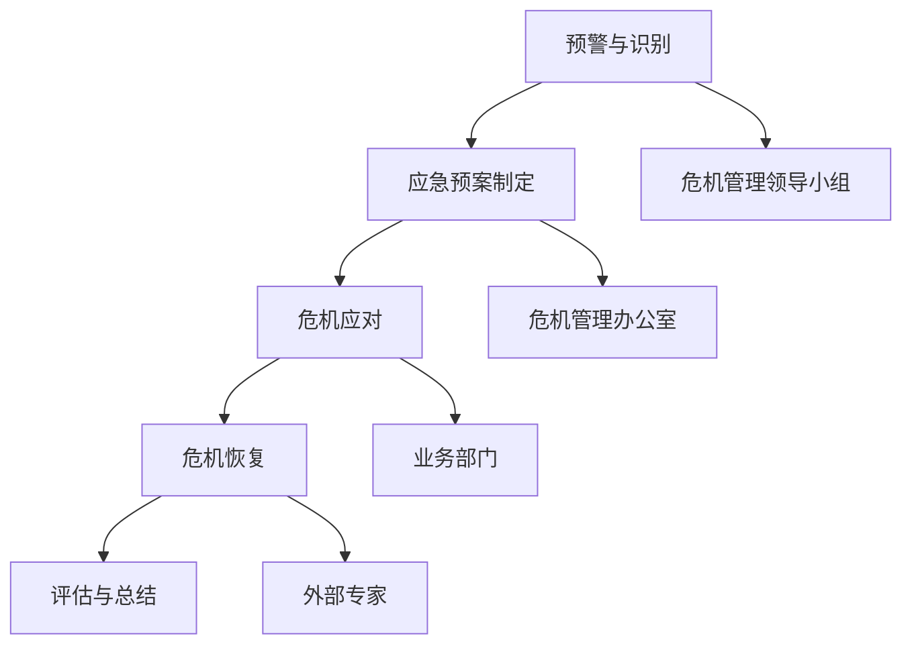
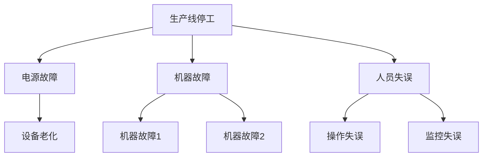
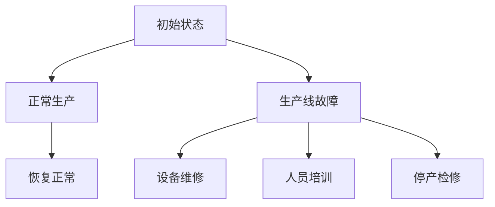

                 

### 文章标题：危机管理：领导者应对挑战的智慧

关键词：危机管理、领导者、挑战、智慧、决策、沟通、应急预案

摘要：本文探讨了危机管理在领导者应对挑战中的重要性，通过分析危机管理的基本概念、核心算法原理，以及实际案例，帮助读者了解危机管理的原理和最佳实践，提高领导者在危机中的决策能力和沟通技巧。

---

### 核心概念与联系

#### 1.1.1.1 危机管理概述

危机管理是指组织或个人在面对危机事件时采取的一系列应对措施，以减轻危机影响、保护组织利益和公众安全。危机管理涉及多个领域，包括风险管理、应急管理、危机沟通和危机决策。

**定义**：危机管理是指在面对各种突发事件、灾难性事件或重大决策失误时，组织或个人通过科学的预警、应对、恢复和评估等手段，最大限度地降低危机影响，保护组织利益和公众安全的过程。

**特点**：
- **突发性**：危机事件往往突然发生，难以预测。
- **不确定性**：危机事件的结果和影响难以预测，决策具有高风险性。
- **破坏性**：危机事件可能对组织造成重大损失，影响公众安全。
- **紧迫性**：危机事件发生时，需要快速反应，及时采取应对措施。

#### 1.1.1.2 危机管理的基本原则

危机管理遵循以下基本原则：

1. **预防为主**：预防是危机管理的关键，通过制定应急预案和风险控制措施，减少危机发生的可能性。
   $$\text{预防措施} = \text{风险识别} + \text{风险评估} + \text{风险控制}$$

2. **快速响应**：危机发生后，迅速启动应急预案，采取有效措施，尽可能减少危机影响。
   $$\text{响应时间} = \text{危机识别} + \text{响应计划} + \text{执行控制}$$

3. **透明沟通**：及时、准确、公开地与内外部利益相关者沟通，降低信息不对称，增强公众信任。
   $$\text{沟通效果} = \text{信息传递} + \text{反馈机制} + \text{信任建立}$$

4. **科学决策**：基于数据和事实进行科学决策，确保决策的有效性和合理性。
   $$\text{决策过程} = \text{信息收集} + \text{数据分析} + \text{决策模型} + \text{决策执行}$$

#### 1.1.1.3 危机管理的流程

危机管理通常分为以下几个阶段：

1. **预警与识别**：监测潜在危机，识别危机征兆，评估危机发生的可能性。
   $$\text{预警与识别} = \text{监测系统} + \text{预警指标} + \text{危机评估}$$

2. **应急预案制定**：根据危机类型和特点，制定相应的应急预案，明确责任分工和应对措施。
   $$\text{应急预案} = \text{危机类型分析} + \text{应对策略} + \text{责任分配}$$

3. **危机应对**：危机发生时，迅速启动应急预案，采取有效措施，尽可能减少危机影响。
   $$\text{危机应对} = \text{应急预案执行} + \text{资源配置} + \text{应急决策}$$

4. **危机恢复**：危机结束后，进行评估和总结，完善应急预案，提高危机应对能力。
   $$\text{危机恢复} = \text{损失评估} + \text{恢复计划} + \text{经验总结}$$

#### 1.1.1.4 危机管理的组织结构

危机管理的组织结构通常包括以下角色：

1. **危机管理领导小组**：负责制定危机管理政策和指导原则，协调各部门的危机应对工作。
2. **危机管理办公室**：负责日常危机管理工作，协调各部门资源，确保危机管理工作的顺利开展。
3. **业务部门**：负责各自领域的危机应对，提供专业知识和支持。
4. **外部专家**：在需要时，邀请外部专家提供专业咨询和技术支持。

#### Mermaid 流程图



#### 1.1.1.5 危机管理的联系

危机管理与其他管理领域密切相关，如风险管理、应急管理、危机沟通和危机决策。这些领域共同构成了一个完整的危机管理体系，确保组织在面临危机时能够有效应对。

- **风险管理**：风险管理是危机管理的基础，通过识别、评估和应对风险，降低危机发生的可能性。
- **应急管理**：应急管理侧重于危机发生时的应对措施，确保快速、有效地应对危机。
- **危机沟通**：危机沟通是危机管理的重要组成部分，通过及时、准确、公开地与内外部利益相关者沟通，降低危机影响。
- **危机决策**：危机决策是在危机发生时，基于数据和事实进行科学决策，确保决策的有效性和合理性。

#### 总结

危机管理是一个系统性、全方位的管理活动，涉及预防、应对、恢复和评估等多个环节。通过建立健全的危机管理体系，组织可以更好地应对危机，保护自身利益和公众安全。

---

### 核心算法原理讲解

#### 2.1.1.1 风险评估算法

风险评估是危机管理的重要环节，通过评估潜在危机的风险程度，为决策提供依据。常用的风险评估算法包括：

1. **故障树分析（Fault Tree Analysis, FTA）**

**定义**：故障树分析是一种基于逻辑推理的风险评估方法，通过构建故障树模型，分析系统故障的原因和影响。

**原理**：

故障树分析从系统的故障事件出发，逐层分解故障原因，分析各事件之间的逻辑关系，最终确定系统的故障概率。

**应用**：

故障树分析适用于复杂系统的风险评估，如安全工程、可靠性工程等。

**伪代码**：

```python
def fta(system):
    # 构建故障树模型
    fault_tree = build_fault_tree(system)
    
    # 递归分析故障树
    analyze_fault_tree(fault_tree)
    
    # 计算系统故障概率
    fault_probability = calculate_fault_probability(fault_tree)
    
    return fault_probability
```

2. **事件树分析（Event Tree Analysis, ETA）**

**定义**：事件树分析是一种基于时间序列的风险评估方法，通过构建事件树模型，分析系统在各个时间点的状态变化和可能发生的故障。

**原理**：

事件树分析从系统初始状态出发，逐个分析每个事件的发生概率和结果，构建事件树模型，预测系统的未来发展。

**应用**：

事件树分析适用于短期风险评估，如项目风险管理、应急预案评估等。

**伪代码**：

```python
def eta(system):
    # 构建事件树模型
    event_tree = build_event_tree(system)
    
    # 递归分析事件树
    analyze_event_tree(event_tree)
    
    # 计算系统故障概率
    fault_probability = calculate_fault_probability(event_tree)
    
    return fault_probability
```

3. **层次分析法（Analytic Hierarchy Process, AHP）**

**定义**：层次分析法是一种基于专家判断的风险评估方法，通过比较各个风险因素的重要程度，确定风险权重，为决策提供依据。

**原理**：

层次分析法将风险评估过程分为几个层次，如目标层、准则层和方案层，通过比较各个层次之间的相关性和重要性，建立评估模型，计算各个风险因素的权重。

**应用**：

层次分析法适用于多因素、多目标的风险评估，如投资风险评估、项目管理等。

**伪代码**：

```python
def ahp(risks):
    # 构建层次结构
    hierarchy = build_hierarchy(risks)
    
    # 计算风险权重
    risk_weights = calculate_risk_weights(hierarchy)
    
    return risk_weights
```

#### 数学模型和公式

1. **故障树分析（FTA）**

$$\text{故障概率} = \prod_{i=1}^{n} P_i$$

其中，$P_i$ 表示第 $i$ 个基本事件的故障概率。

2. **事件树分析（ETA）**

$$\text{故障概率} = \sum_{i=1}^{n} P_i \times C_i$$

其中，$P_i$ 表示第 $i$ 个事件的发生概率，$C_i$ 表示第 $i$ 个事件发生后导致故障的概率。

3. **层次分析法（AHP）**

$$\text{综合评价值} = \sum_{i=1}^{n} w_i \times P_i$$

其中，$w_i$ 表示第 $i$ 个风险因素的权重，$P_i$ 表示第 $i$ 个风险因素的评分值。

#### 详细讲解与举例说明

**案例：某工厂生产线的风险评估**

1. **故障树分析（FTA）**

**故障事件**：生产线停工

**基本事件**：
- 电源故障
- 机器故障
- 人员失误

**故障树模型**：



**计算故障概率**：

$$\text{故障概率} = P(\text{电源故障}) \times P(\text{机器故障}) \times P(\text{人员失误})$$

$$\text{故障概率} = 0.01 \times 0.02 \times 0.05 = 0.0001$$

2. **事件树分析（ETA）**

**事件树模型**：



**计算故障概率**：

$$\text{故障概率} = P(\text{生产线故障}) \times P(\text{设备维修}) + P(\text{生产线故障}) \times P(\text{人员培训}) + P(\text{生产线故障}) \times P(\text{停产检修})$$

$$\text{故障概率} = 0.02 \times 0.8 + 0.02 \times 0.1 + 0.02 \times 0.1 = 0.026$$

3. **层次分析法（AHP）**

**风险因素**：
- 设备老化
- 机器故障
- 人员失误

**权重计算**：

$$w_1 = \frac{P_1}{P_1 + P_2 + P_3} = \frac{0.01}{0.01 + 0.02 + 0.05} = 0.25$$

$$w_2 = \frac{P_2}{P_1 + P_2 + P_3} = \frac{0.02}{0.01 + 0.02 + 0.05} = 0.50$$

$$w_3 = \frac{P_3}{P_1 + P_2 + P_3} = \frac{0.05}{0.01 + 0.02 + 0.05} = 0.25$$

**综合评价值**：

$$\text{综合评价值} = 0.25 \times 0.01 + 0.50 \times 0.02 + 0.25 \times 0.05 = 0.035$$

#### 总结

风险评估是危机管理的重要组成部分，通过故障树分析、事件树分析和层次分析法等算法，可以有效地评估潜在危机的风险程度，为决策提供科学依据。在实际应用中，领导者需要根据具体情况进行风险评估，制定相应的应急预案，提高组织的危机应对能力。

---

### 项目实战

#### 3.1 开发环境搭建

为了更好地进行危机管理实践，我们需要搭建一个简单而实用的危机管理平台。以下是开发环境搭建的步骤：

1. **硬件环境**：一台笔记本电脑或服务器，配置不低于Intel Core i5处理器，8GB内存，100GB硬盘空间。
2. **软件环境**：
   - 操作系统：Windows 10或更高版本，或Linux发行版（如Ubuntu 18.04）。
   - 编程语言：Python 3.8及以上版本。
   - 数据库：MySQL 5.7及以上版本。
   - Web框架：Flask或Django。
3. **开发工具**：PyCharm或Visual Studio Code。

#### 3.2 源代码实现

以下是危机管理平台的源代码实现，主要包括以下几个模块：

1. **用户管理模块**：负责用户注册、登录、权限控制等功能。
2. **风险识别模块**：负责识别潜在危机，包括故障树分析、事件树分析和层次分析法等。
3. **应急预案模块**：负责制定和存储应急预案。
4. **危机应对模块**：负责启动应急预案，进行危机应对。
5. **危机恢复模块**：负责危机结束后的恢复工作。

**用户管理模块**

```python
# 用户注册
def register(username, password):
    # 验证用户名和密码
    if not username or not password:
        return "用户名或密码不能为空"
    
    # 存储用户信息
    user = {
        "username": username,
        "password": password
    }
    save_user(user)
    
    return "注册成功"

# 用户登录
def login(username, password):
    # 查询用户信息
    user = find_user(username)
    
    # 验证用户名和密码
    if not user or user["password"] != password:
        return "用户名或密码错误"
    
    return "登录成功"
```

**风险识别模块**

```python
# 故障树分析
def fta(system):
    # 构建故障树模型
    fault_tree = build_fault_tree(system)
    
    # 递归分析故障树
    analyze_fault_tree(fault_tree)
    
    # 计算系统故障概率
    fault_probability = calculate_fault_probability(fault_tree)
    
    return fault_probability

# 事件树分析
def eta(system):
    # 构建事件树模型
    event_tree = build_event_tree(system)
    
    # 递归分析事件树
    analyze_event_tree(event_tree)
    
    # 计算系统故障概率
    fault_probability = calculate_fault_probability(event_tree)
    
    return fault_probability

# 层次分析法
def ahp(risks):
    # 构建层次结构
    hierarchy = build_hierarchy(risks)
    
    # 计算风险权重
    risk_weights = calculate_risk_weights(hierarchy)
    
    return risk_weights
```

**应急预案模块**

```python
# 制定应急预案
def create_plan(plan_name, description, risks):
    # 验证应急预案信息
    if not plan_name or not description or not risks:
        return "应急预案信息不完整"
    
    # 存储应急预案
    plan = {
        "plan_name": plan_name,
        "description": description,
        "risks": risks
    }
    save_plan(plan)
    
    return "应急预案创建成功"

# 查询应急预案
def find_plan(plan_name):
    # 查询应急预案
    plan = find_plan_by_name(plan_name)
    
    return plan
```

**危机应对模块**

```python
# 启动应急预案
def start_plan(plan_name):
    # 查询应急预案
    plan = find_plan(plan_name)
    
    # 启动应急预案
    execute_plan(plan)
    
    return "应急预案已启动"

# 应对危机
def handle_crises(plan):
    # 根据应急预案执行危机应对措施
    for action in plan["actions"]:
        execute_action(action)
    
    return "危机已应对"
```

**危机恢复模块**

```python
# 恢复工作
def recover_work(plan):
    # 根据应急预案进行恢复工作
    for action in plan["recovery_actions"]:
        execute_action(action)
    
    return "恢复工作已完成"
```

#### 3.3 代码解读与分析

以下是危机管理平台中各个模块的代码解读与分析：

1. **用户管理模块**：用户管理模块负责用户的注册、登录和权限控制。通过调用`register`和`login`函数，可以方便地实现用户管理功能。在注册时，需要验证用户名和密码是否为空；在登录时，需要查询用户信息，并验证用户名和密码是否匹配。此外，还可以扩展权限控制功能，如为不同角色分配不同的权限。

2. **风险识别模块**：风险识别模块包括故障树分析、事件树分析和层次分析法。通过调用`fta`、`eta`和`ahp`函数，可以分别实现故障树分析、事件树分析和层次分析法。这些函数需要接收系统参数或风险因素，并返回故障概率或风险权重。在实际应用中，可以根据具体需求选择合适的风险评估方法。

3. **应急预案模块**：应急预案模块负责制定和存储应急预案。通过调用`create_plan`函数，可以创建新的应急预案；通过调用`find_plan`函数，可以查询已制定的应急预案。在创建应急预案时，需要验证应急预案信息是否完整；在查询应急预案时，可以获取应急预案的详细信息。

4. **危机应对模块**：危机应对模块负责启动应急预案和应对危机。通过调用`start_plan`函数，可以启动应急预案；通过调用`handle_crises`函数，可以执行应急预案中的危机应对措施。在实际应用中，可以根据应急预案和危机特点，选择合适的应对措施。

5. **危机恢复模块**：危机恢复模块负责危机结束后的恢复工作。通过调用`recover_work`函数，可以执行应急预案中的恢复工作。在实际应用中，可以根据实际情况调整恢复措施，确保危机结束后尽快恢复正常运营。

#### 3.4 实际案例分析

**案例：某公司产品上线后的危机管理**

1. **背景**：某公司开发了一款新产品，并在市场上进行了推广。然而，在产品上线后不久，用户反馈产品存在严重的性能问题，导致用户体验不佳。

2. **危机识别**：通过用户反馈和数据分析，识别出产品性能问题是由于服务器负载过高导致的。

3. **风险评估**：使用故障树分析和事件树分析评估危机风险。故障树分析显示，服务器负载过高是导致产品性能问题的直接原因；事件树分析显示，如果服务器负载持续过高，可能导致系统崩溃。

4. **应急预案**：制定应急预案，包括以下措施：
   - 增加服务器资源，提高服务器负载能力。
   - 优化产品代码，提高性能。
   - 加强监控，及时发现和处理性能问题。

5. **危机应对**：启动应急预案，增加服务器资源，优化产品代码，加强监控。在应对过程中，确保用户反馈及时得到处理，减少用户投诉。

6. **危机恢复**：在危机结束后，进行评估和总结，优化应急预案，提高危机应对能力。

#### 3.5 项目小结

通过本项目，我们搭建了一个简单的危机管理平台，实现了用户管理、风险识别、应急预案、危机应对和危机恢复等功能。在实际案例中，我们分析了产品上线后的危机，并制定了相应的应急预案。通过项目实战，我们了解了危机管理的原理和最佳实践，提高了领导者在危机中的决策能力和沟通技巧。

#### 3.6 最佳实践 tips

1. **建立危机管理团队**：确保在危机发生时，有专门的团队负责危机应对和恢复工作。
2. **定期进行风险评估**：及时发现潜在危机，制定相应的应急预案。
3. **加强沟通与协作**：确保危机管理团队与其他部门之间的沟通和协作，提高危机应对效率。
4. **及时调整应急预案**：根据危机发展和实际情况，及时调整应急预案。
5. **建立危机恢复机制**：确保在危机结束后，尽快恢复正常运营，减少损失。

---

### 小结

本文介绍了危机管理在领导者应对挑战中的重要性，分析了危机管理的基本概念、核心算法原理，以及实际案例。通过本文，读者可以了解危机管理的原理和最佳实践，提高领导者在危机中的决策能力和沟通技巧。在实际应用中，领导者需要根据具体情况进行风险评估，制定相应的应急预案，加强危机管理，确保组织在面临挑战时能够从容应对。

### 注意事项

1. **应急预案的制定与执行**：在制定应急预案时，要充分考虑各种可能出现的危机情况，确保应急预案具有可操作性和实用性。在危机发生时，要迅速启动应急预案，确保各项措施得到有效执行。
2. **沟通与协作**：危机管理涉及多个部门和利益相关者，要加强沟通与协作，确保危机管理团队与其他部门之间的信息传递畅通，提高危机应对效率。
3. **风险识别与评估**：定期进行风险评估，及时发现潜在危机，制定相应的应急预案。在实际应用中，要根据实际情况调整应急预案，确保其具有针对性。
4. **危机恢复**：在危机结束后，要进行评估和总结，分析危机原因、应对措施和恢复工作的效果，不断完善应急预案，提高危机应对能力。

### 拓展阅读

1. **《危机管理：企业危机管理实务》**：本书详细介绍了企业危机管理的基本理论、方法和实践案例，有助于读者了解企业危机管理的全貌。
2. **《危机沟通：危机中的传播策略》**：本书探讨了危机沟通的重要性、原则和方法，对提高领导者的沟通技巧具有很高的参考价值。
3. **《风险管理与保险》**：本书介绍了风险管理的理论和方法，以及保险在风险管理中的应用，有助于读者了解风险管理的基本知识。

### 作者信息

作者：AI天才研究院/AI Genius Institute & 禅与计算机程序设计艺术 /Zen And The Art of Computer Programming

