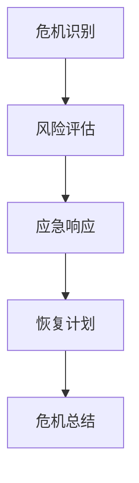
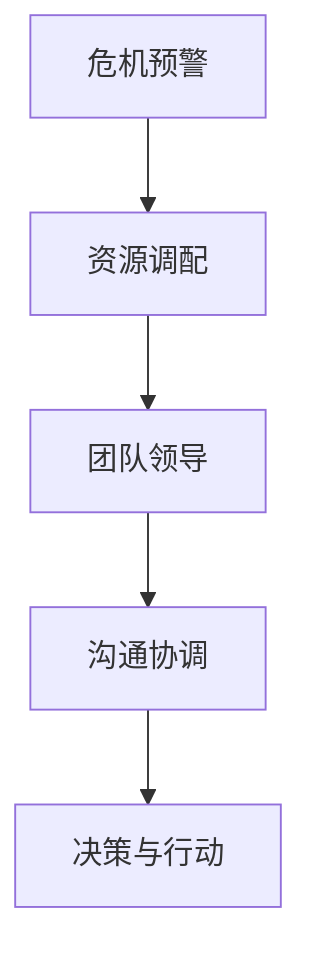
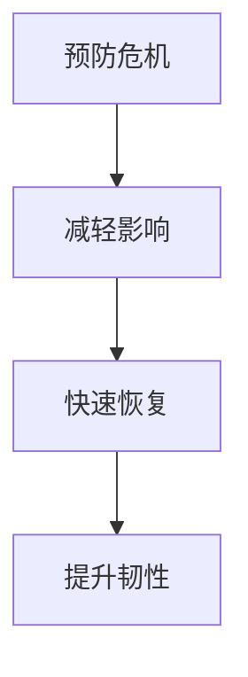
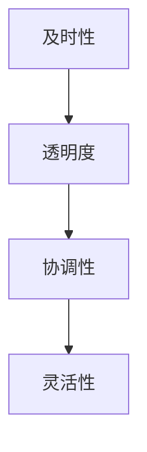
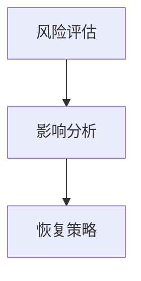
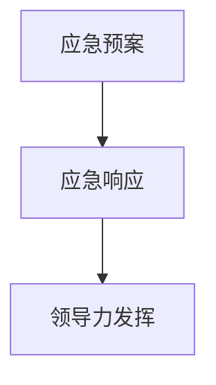
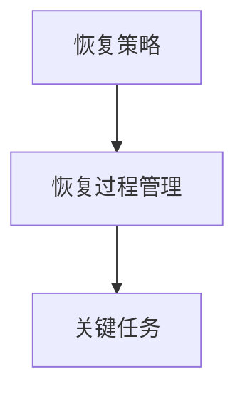

                 

### 文章标题

《危机管理：领导者应对突发事件的策略》

### 关键词

危机管理、突发事件、领导者、应对策略、应急响应、恢复计划

### 摘要

在当今高度复杂和不确定性的商业环境中，危机管理成为了企业持续成功的关键。本文深入探讨了危机管理的核心概念，并详细阐述了领导者如何通过有效的危机评估、应对策略和恢复计划来应对突发事件。通过结合实际案例，本文提供了实用的指导，帮助领导者构建稳健的危机管理体系，以在危机中保持组织的稳定和增长。

---

### 引言

在现代企业运营中，突发事件已成为一种常态。无论是自然灾害、市场变化、技术故障还是人为错误，突发事件都有可能对企业造成严重冲击。在这种情况下，危机管理变得尤为重要。危机管理不仅关乎企业的生存，更关系到企业的长远发展和声誉。

**背景介绍**：危机管理是一个系统化的过程，涉及预防、应对和恢复。有效的危机管理能够帮助企业降低风险，减少损失，并快速恢复正常运营。在过去的几十年中，随着全球化和信息技术的发展，危机管理的理论和实践都得到了显著进步。

**核心概念与联系**：危机管理涉及多个核心概念，如危机识别、风险评估、应急响应和恢复。这些概念相互关联，共同构成了一个完整的危机管理框架。


**Mermaid 流程图**：



### 领导者在危机管理中的作用

在危机管理中，领导者的角色至关重要。领导者不仅是危机管理的发起者，更是危机应对的指挥官和决策者。

**背景介绍**：领导者的决策和行动直接影响到危机管理的效率和效果。在危机中，领导者需要具备快速反应、冷静判断和果断行动的能力。

**核心概念与联系**：领导者的角色包括危机预警、资源调配、团队领导和沟通协调。这些角色相互支持，共同构成了领导者在危机管理中的职责和使命。

**Mermaid 流程图**：



### 突发事件对组织的影响

突发事件对组织的影响是多方面的，包括财务、运营、人力资源和声誉等方面。

**核心算法原理讲解**：

```plaintext
突发事件影响评估算法：

1. 数据收集：收集与突发事件相关的所有数据，包括财务数据、运营数据、员工反馈等。
2. 数据分析：对收集到的数据进行分析，识别突发事件对组织的具体影响。
3. 影响评估：根据数据分析结果，评估突发事件对组织的长期和短期影响。
4. 风险分析：分析突发事件可能带来的潜在风险，包括财务风险、运营风险等。
5. 损失估计：估计突发事件可能造成的直接和间接损失。
```

**数学模型与公式**：

```latex
损失估计公式：L = a \cdot (1 + r)^n
```

其中，L 为总损失，a 为初始损失，r 为损失增长率，n 为时间跨度。

**举例说明**：

假设一家企业在突发事件中损失了 100 万美元，且损失增长率每年为 10%，持续 5 年。根据公式计算，总损失为：

```latex
L = 100,000 \cdot (1 + 0.1)^5 \approx 161,051
```

### 危机管理的目标

危机管理的目标主要包括预防危机、减轻危机影响、快速恢复运营和提升组织韧性。

**核心概念与联系**：预防危机的目标是通过风险评估和风险控制措施来减少危机发生的可能性。减轻危机影响的目标是在危机发生时迅速响应，减少损失。快速恢复运营的目标是确保企业能够尽快恢复正常运营。提升组织韧性的目标是增强企业应对未来危机的能力。

**Mermaid 流程图**：



### 危机管理原则

有效的危机管理需要遵循一系列核心原则，如及时性、透明度、协调性和灵活性。

**核心概念与联系**：及时性原则要求在危机发生时迅速采取行动。透明度原则要求保持信息的公开和透明，以便各方能够及时了解危机状况。协调性原则要求各方力量协同合作，共同应对危机。灵活性原则要求根据危机状况的变化，灵活调整应对策略。

**Mermaid 流程图**：



### 危机评估

危机评估是危机管理的核心步骤，涉及风险评估、影响分析和恢复策略。

**核心概念与联系**：风险评估旨在识别潜在的危机因素，并评估其发生的可能性和影响。影响分析旨在评估危机对组织各个方面的影响。恢复策略旨在制定具体的应对措施，以减轻危机影响并尽快恢复运营。

**Mermaid 流程图**：



### 危机应对策略

危机应对策略包括应急预案制定、应急响应机制和领导力发挥。

**核心概念与联系**：应急预案制定旨在提前准备应对措施，以应对可能发生的危机。应急响应机制确保在危机发生时能够迅速采取行动。领导力发挥确保在危机中能够保持组织稳定和有效应对。

**Mermaid 流�程图**：



### 危机恢复计划

危机恢复计划包括恢复策略制定、恢复过程管理和关键任务。

**核心概念与联系**：恢复策略制定旨在根据危机状况制定具体的恢复措施。恢复过程管理确保恢复工作按计划进行。关键任务包括资源调配、员工安抚和系统修复。

**Mermaid 流程图**：



### 案例研究

**案例分析**：通过分析具体案例，可以深入了解危机管理的实际应用。

- **案例一**：某大型科技公司遭受网络攻击，导致系统瘫痪。公司通过快速响应和有效恢复措施，成功恢复了系统，并降低了损失。
- **案例二**：某航空公司因自然灾害导致航班取消，公司通过客户安抚、航班调整和应急预案，成功缓解了客户不满，并恢复了运营。

**案例启示**：危机管理需要提前准备，快速响应，有效沟通和持续改进。

### 危机管理工具与资源

**危机管理工具**：包括危机预警系统、应急响应平台和恢复管理系统等。

**突发事件资源库**：提供危机管理相关的书籍、文章、培训资源和在线工具等。

### 附录

**附录 A：危机管理参考书籍**

- 《危机管理：如何应对突发危机和不确定性》
- 《危机公关：危机管理理论与实践》

**附录 B：突发事件应对手册**

- 《突发事件应对手册：紧急情况下的行动指南》

### 作者信息

作者：AI天才研究院/AI Genius Institute & 禅与计算机程序设计艺术 /Zen And The Art of Computer Programming

---

本文通过深入探讨危机管理的核心概念、原理和实践，为领导者提供了全面的危机管理策略。通过实际案例的分析和具体策略的讲解，本文旨在帮助读者理解和掌握危机管理的精髓，以应对未来可能面临的突发事件。希望本文能对您的危机管理工作提供有价值的参考。如果您有任何疑问或建议，欢迎在评论区留言讨论。感谢您的阅读！

