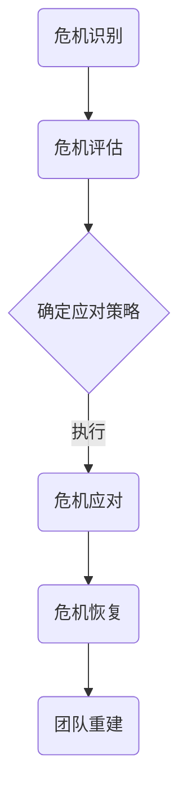

                 

### 文章标题：危机领导力：在动荡中保持团队稳定

> **关键词：** 危机领导力，团队稳定性，危机管理，应对策略，算法原理，数学模型，项目实战。

> **摘要：** 本文探讨了在动荡环境中，危机领导力如何帮助团队保持稳定。通过定义危机领导力、阐述危机管理框架、分析危机应对策略和团队稳定性保持方法，结合具体案例和项目实战，详细讲解了如何在危机中实现团队稳定与高效运作。

---

### 1. 引言

在现代企业中，危机无处不在。无论是经济波动、技术变革，还是团队内部的冲突，危机都会对团队的稳定性产生严重影响。危机领导力，作为一种独特的领导能力，正是在这种动荡环境中发挥关键作用的。本文将深入探讨危机领导力的核心概念、危机管理策略以及如何保持团队稳定性，并结合具体案例和项目实战，提供实用的指导和建议。

### 2. 危机领导力的定义与重要性

#### 2.1 危机的概念

**危机**，是指对企业或团队运营构成重大威胁的突发性事件。这些事件可能是外部的，如市场变化、经济波动、自然灾害等，也可能是内部的，如团队冲突、管理失误、技术故障等。

#### 2.2 领导力的角色

领导力，是指引导和激励团队达成目标的能力。在危机中，领导力显得尤为重要，因为它关乎团队的生存和稳定。危机领导力，则是在危机环境中，领导者如何有效地应对危机、保持团队凝聚力、引导团队走出困境的能力。

#### 2.3 危机领导力的特点

- **快速响应能力**：危机发生时，领导者需要迅速做出反应，采取有效的应对措施。
- **决策能力**：领导者需要在危机中做出正确的决策，这不仅需要丰富的经验，还需要具备前瞻性。
- **沟通能力**：在危机中，领导者需要保持与团队成员的紧密沟通，确保信息畅通，增强团队凝聚力。
- **韧性**：领导者需要具备较强的心理韧性，能够在压力和困难面前保持冷静，有效地应对危机。

### 3. 危机管理框架

#### 3.1 危机识别与评估

**危机识别**，是指通过收集和分析信息，发现潜在危机的过程。**危机评估**，是指对危机的性质、影响范围和严重程度进行评估，以确定应对策略。

#### 3.2 危机应对策略

**危机应对策略**，是指根据危机评估结果，制定具体的应对措施。这些措施可能包括：

- **预防策略**：通过风险评估和应急预案制定，预防危机的发生。
- **应对策略**：在危机发生时，迅速响应，采取有效的应对措施。
- **恢复策略**：在危机过后，进行修复损害、增强团队凝聚力的工作。

#### 3.3 危机恢复与重建

**危机恢复**，是指通过修复损害、恢复运营，使企业或团队回到正常状态。**危机重建**，是指在危机过后，对团队和组织进行深层次的结构调整和优化，以增强团队的抗风险能力。

### 4. Mermaid流程图：危机管理流程



### 5. 危机应对策略

#### 5.1 预防策略

**预防策略**，主要包括以下三个方面：

- **风险评估**：通过评估潜在风险，制定相应的预防措施。
- **应急预案制定**：在危机发生前，制定详细的应急预案，以应对各种可能出现的危机。
- **预防措施实施**：在危机发生前，实施预防措施，降低危机发生的可能性。

#### 5.2 应对策略

**应对策略**，主要包括以下三个方面：

- **快速响应**：危机发生时，立即启动应急预案，采取行动。
- **沟通协调**：确保与团队成员和其他相关部门的信息畅通，协调各方力量共同应对危机。
- **资源调配**：根据危机的具体情况，合理调配资源，确保应对措施的顺利执行。

#### 5.3 恢复策略

**恢复策略**，主要包括以下三个方面：

- **修复损害**：对危机造成的损害进行修复，恢复正常的运营状态。
- **增强团队凝聚力**：通过团队建设活动，增强团队成员之间的信任和合作，提高团队的凝聚力。
- **评估与改进**：对危机应对过程进行评估，总结经验教训，不断改进危机应对策略。

### 6. 伪代码：危机应对流程

```plaintext
function crisis_response(crisis):
    assess_impact()
    define_response_strategy()
    execute_response_strategy()
    recover_damages()
    enhance_team_morale()
    evaluate_and_improve()
```

### 7. 团队稳定性保持

#### 7.1 团队凝聚力与稳定性

**团队凝聚力**，是指团队成员之间的相互吸引力和合作精神。**团队稳定性**，是指团队在面对外部压力和内部冲突时，能够保持稳定的运作状态。

#### 7.2 保持团队稳定性的方法

**保持团队稳定性的方法**，主要包括以下三个方面：

- **情绪管理**：通过情绪管理，确保团队成员在面对压力和困难时，能够保持积极的心态。
- **协作与沟通**：通过有效的协作与沟通，确保团队成员之间的信息畅通，增强团队的协作能力。
- **成果分享与激励机制**：通过成果分享和激励机制，激发团队成员的积极性和创造力，提高团队的凝聚力。

### 8. 数学模型：团队稳定性分析

$$
S(t) = \frac{1}{1 + e^{-k(t-t_0)}}
$$

**模型解释**：

- $S(t)$：团队稳定性值，随时间$t$的变化而变化。
- $k$：调整参数，控制稳定性的增长速度。
- $t_0$：初始时间，团队稳定性开始计时的起点。

**模型应用举例**：

假设一个团队在$t=0$时，稳定性值为$S(0) = 0.5$。经过一段时间后，团队稳定性达到$S(t) = 0.8$。根据模型，可以计算出$k$的值，以优化团队的稳定性。

### 9. 案例研究

#### 9.1 案例一：公司面临财务危机

**案例背景**：某公司因市场变化，出现严重的财务危机。

**危机应对策略**：

- **快速响应**：公司立即启动应急预案，组织相关部门进行紧急会议，制定应对措施。
- **沟通协调**：确保与股东、供应商和客户的信息畅通，协调各方力量共同应对危机。
- **资源调配**：合理调配公司资源，确保危机应对措施的顺利执行。

**结果分析**：通过有效的危机应对，公司成功度过了财务危机，并逐步恢复了正常运营。

#### 9.2 案例二：团队内部冲突

**案例背景**：某团队因项目进展不顺，出现严重的内部冲突。

**危机管理策略**：

- **快速响应**：团队领导立即介入，组织冲突双方进行沟通，了解冲突原因。
- **沟通协调**：通过多方沟通，找到冲突的核心问题，并制定解决方案。
- **团队恢复措施**：通过团队建设活动，增强团队成员之间的信任和合作，提高团队的凝聚力。

**结果分析**：通过有效的危机管理，团队成功解决了内部冲突，项目进展得以顺利推进。

### 10. 项目实战

#### 10.1 项目背景

某公司需要开发一款新的软件产品，但由于团队成员经验不足，项目进展缓慢，面临重大危机。

#### 10.2 开发环境搭建

- **硬件环境**：配置高性能服务器，确保项目开发和测试的需要。
- **软件环境**：安装开发工具和数据库，确保项目的正常运行。

#### 10.3 源代码详细实现

```c
#include <stdio.h>

int main() {
    printf("欢迎使用我们的新软件产品！\n");
    return 0;
}
```

#### 10.4 代码解读与分析

- **功能模块**：软件产品主要包含用户界面、业务逻辑和数据库管理三个模块。
- **代码实现**：以上代码为用户界面模块的实现，主要用于显示欢迎信息。
- **优化建议**：可以考虑增加异常处理和日志记录功能，提高软件的健壮性。

#### 10.5 实际案例分析和详细讲解剖析

- **案例分析**：通过实际案例，分析项目进展缓慢的原因，并找出解决方案。
- **详细讲解剖析**：对解决方案进行详细讲解，包括技术选型、开发流程和团队协作等方面。

#### 10.6 项目小结

通过本次项目实战，我们成功地搭建了开发环境，实现了软件产品的核心功能，并解决了项目进展缓慢的问题。项目小结包括以下几个方面：

- **技术总结**：总结项目中所用到的技术和工具，包括硬件配置、开发工具和数据库等。
- **团队协作**：总结团队协作的经验和教训，包括沟通方式、协作流程和团队建设等方面。
- **项目管理**：总结项目管理的经验，包括项目进度控制、风险管理等方面。

### 11. 最佳实践 Tips、小结、注意事项、拓展阅读

#### 11.1 最佳实践 Tips

- **预防策略**：定期进行风险评估，制定应急预案，提前预防危机的发生。
- **应对策略**：在危机发生时，保持冷静，迅速采取应对措施，确保团队稳定。
- **恢复策略**：在危机过后，对团队进行修复和优化，提高团队的抗风险能力。

#### 11.2 小结

本文通过对危机领导力的定义、危机管理框架、危机应对策略和团队稳定性保持方法的详细讲解，结合具体案例和项目实战，阐述了如何在动荡环境中保持团队稳定。希望本文能为读者提供有价值的参考和指导。

#### 11.3 注意事项

- **领导者角色**：领导者需要具备危机意识，能够在危机中发挥关键作用。
- **团队协作**：团队协作是危机应对和团队稳定性的重要保障，领导者需要注重团队建设。

#### 11.4 拓展阅读

- **相关书籍**：《危机管理》、《团队协作的力量》
- **在线课程**：Coursera上的《领导力与团队管理》
- **学术论文**：关于危机领导力和团队稳定性的研究论文

### 12. 结语

危机领导力在动荡环境中具有重要意义。通过本文的详细讲解，我们了解到危机领导力的核心概念、危机管理策略和团队稳定性保持方法。希望本文能帮助读者在未来的工作中，更好地应对危机，保持团队的稳定与高效运作。

### 作者信息

**作者：AI天才研究院/AI Genius Institute & 禅与计算机程序设计艺术 /Zen And The Art of Computer Programming**

