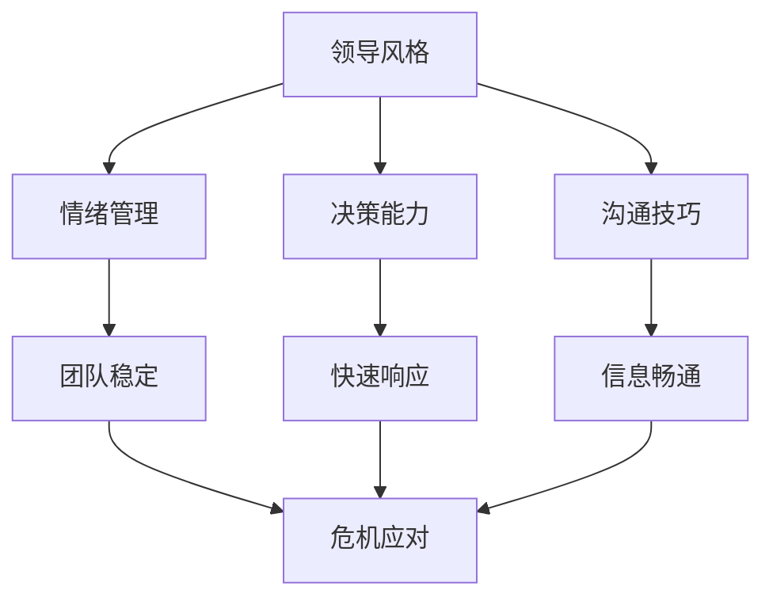

                 

### 文章标题

《危机领导力：在动荡时期稳定军心》

### 关键词

危机领导力，动荡时期，领导力策略，团队稳定，决策能力

### 摘要

在当今快节奏、变化莫测的商业环境中，危机领导力已成为领导者必备的核心能力。本文将深入探讨危机领导力的概念、核心原则及其在动荡时期的应用。通过案例分析、算法原理讲解以及实际项目实战，本文旨在为领导者提供一套切实可行的策略，以在动荡时期稳定团队、应对挑战，实现企业的持续发展。

## 引言

在商业世界中，无论是经济波动、技术革命还是社会变革，动荡时期无处不在。这些时期往往伴随着不确定性、风险和压力，这对企业的领导层提出了严峻的挑战。危机领导力，作为领导者应对危机、稳定团队、指导企业走出困境的关键能力，日益受到关注。

### 危机领导力的定义与重要性

危机领导力是指领导者在面对危机时，能够迅速做出决策、有效沟通、激励团队、控制局势，并引导企业或组织渡过难关的能力。在动荡时期，危机领导力的重要性不言而喻。它不仅关系到企业的生死存亡，还直接影响到员工的信心和企业的长远发展。

### 当前社会动荡对领导力的挑战

当前社会动荡对领导力提出了前所未有的挑战。首先，快速变化的环境要求领导者具备敏锐的洞察力和灵活的应对策略。其次，信息泛滥和沟通障碍使得领导者需要掌握高效的沟通技巧，确保信息畅通。最后，危机时期的情绪波动和压力巨大，领导者必须具备强大的情绪管理能力，以保持冷静、从容应对。

## 第1章 危机领导力的核心概念

### 1.1 领导风格与危机领导

#### 1.1.1 传统领导风格与危机领导风格对比

传统领导风格通常强调权威和指令性管理，而危机领导风格则更注重协作、透明和适应性。在危机时期，领导者需要放下权威，倾听员工的意见和建议，以集体智慧应对挑战。

#### 1.1.2 领导风格对危机领导的影响

领导风格直接影响危机领导的效果。开放、包容的领导风格有助于激发员工的创造力，增强团队凝聚力。相反，过于专制或消极的领导风格可能导致团队士气低落，影响危机应对能力。

### 1.2 情绪管理与危机领导

#### 1.2.1 情绪识别与管理

情绪管理是危机领导的重要组成部分。领导者需要识别自身和团队成员的情绪，通过有效的情绪管理技巧，如深呼吸、正念冥想等，保持冷静和清晰的头脑。

#### 1.2.2 情绪沟通与团队稳定

情绪沟通是危机领导的关键技巧之一。领导者需要通过开放、诚实的沟通方式，传递积极的信息，缓解团队成员的情绪压力，确保团队稳定。

### 1.3 决策能力与危机领导

#### 1.3.1 快速决策技巧

在危机时期，时间紧迫，领导者需要具备快速决策的能力。快速决策技巧包括：简化问题、利用已有信息、快速评估风险等。

#### 1.3.2 决策制定流程

危机决策的制定流程应包括：明确问题、收集信息、分析风险、制定方案、评估和选择方案。通过严格的决策流程，领导者可以确保决策的合理性和有效性。

### 1.4 沟通技巧与危机领导

#### 1.4.1 沟通的重要性

沟通在危机领导中至关重要。通过有效的沟通，领导者可以确保信息畅通，减少误解和恐慌，增强团队凝聚力。

#### 1.4.2 沟通障碍与危机管理

沟通障碍如信息不对称、误解、恐惧等，可能加剧危机。领导者需要识别沟通障碍，并通过透明、及时、诚实的沟通方式，克服这些障碍。

## 第2章 危机领导力的实践策略

### 2.1 预防性策略

#### 2.1.1 风险评估与管理

预防性策略的核心是风险评估与管理。通过识别潜在风险，制定应对措施，领导者可以降低危机发生的可能性。

#### 2.1.2 应急预案制定

应急预案是危机领导的重要工具。领导者需要制定详细的应急预案，确保在危机发生时，能够迅速响应、有效应对。

### 2.2 反应性策略

#### 2.2.1 紧急决策与资源调配

在危机发生时，领导者需要迅速做出紧急决策，并调配资源，以最大程度地减少损失。

#### 2.2.2 情绪管理技巧

危机时期的情绪管理至关重要。领导者需要通过自我调节和团队情绪管理技巧，保持冷静，激励团队。

### 2.3 持续性策略

#### 2.3.1 领导力培训

持续性策略包括领导力培训，以提高领导者在危机情况下的应对能力。

#### 2.3.2 团队建设与持续改进

团队建设是危机领导的重要组成部分。通过持续改进，领导者可以确保团队在面对危机时具备更强的应对能力。

## 第3章 危机领导力的案例分析

### 3.1 成功案例分析

#### 3.1.1 案例一：企业成功应对市场动荡

通过成功案例的分析，领导者可以学习到如何在危机中保持冷静、做出正确决策。

#### 3.1.2 案例二：政府应对自然灾害

政府在面对自然灾害时，如何通过危机领导力，有效组织救援、稳定社会秩序，是领导者值得学习的典范。

### 3.2 失败案例分析

#### 3.2.1 案例一：企业应对市场危机失败

失败案例可以提供宝贵的教训，帮助领导者避免在类似情况下犯相同的错误。

#### 3.2.2 案例二：政府应对公共卫生危机失败

通过分析失败案例，领导者可以了解危机领导中的常见误区，以避免在未来的危机中重蹈覆辙。

## 第4章 危机领导力的持续发展

### 4.1 组织文化与危机领导

#### 4.1.1 组织文化对危机领导的影响

组织文化直接影响危机领导的效果。领导者需要建设积极、开放、包容的组织文化，以支持危机领导。

#### 4.1.2 建立积极组织文化的策略

通过团队建设、文化传承和激励机制，领导者可以建立积极、健康的组织文化。

### 4.2 跨部门协作与危机领导

#### 4.2.1 跨部门协作的重要性

跨部门协作在危机领导中至关重要。通过有效的跨部门协作，领导者可以确保资源的最大化利用，提高危机应对效率。

#### 4.2.2 跨部门协作的挑战与应对

跨部门协作面临沟通障碍、资源分配不均等挑战。领导者需要通过有效的沟通、协调和资源调配，克服这些挑战。

## 第5章 领导力提升与危机领导

### 5.1 自我反思与自我提升

#### 5.1.1 自我反思的重要性

自我反思是领导者提升自我能力的关键。通过自我反思，领导者可以识别自身的不足，制定提升计划。

#### 5.1.2 自我提升的方法

自我提升的方法包括阅读、培训、实践和反思。领导者需要持续学习和实践，以提升危机领导能力。

### 5.2 持续学习与危机领导

#### 5.2.1 持续学习的重要性

持续学习是领导者应对变革、提升危机领导能力的关键。通过不断学习，领导者可以掌握新的知识和技能，适应不断变化的环境。

#### 5.2.2 学习资源的获取与利用

领导者需要充分利用各种学习资源，如专业书籍、在线课程、研讨会等，以提升自我。

## 第6章 未来危机领导力的趋势

### 6.1 科技创新对危机领导的影响

#### 6.1.1 人工智能与危机领导

人工智能在危机领导中的应用，如数据分析、预测和决策支持，将大大提升危机应对的效率。

#### 6.1.2 大数据与危机管理

大数据在危机管理中的应用，如风险评估、资源调配和决策制定，将提高危机管理的科学性和精准性。

### 6.2 社会变革与危机领导

#### 6.2.1 社会变革的挑战

社会变革，如全球化、数字化和可持续发展等，对危机领导提出了新的挑战。

#### 6.2.2 应对策略

领导者需要适应社会变革，制定相应的应对策略，以提升危机领导能力。

## 结论

在动荡时期，危机领导力是企业稳定军心、走出困境的关键。领导者需要深入了解危机领导力的核心概念和实践策略，通过不断学习和自我提升，提升自身的危机领导能力。只有具备强大的危机领导力，企业才能在动荡的时期中立于不败之地。

### 作者

作者：AI天才研究院/AI Genius Institute & 禅与计算机程序设计艺术 /Zen And The Art of Computer Programming

---

本文以《危机领导力：在动荡时期稳定军心》为标题，深入探讨了危机领导力的核心概念、实践策略、案例分析以及未来趋势。文章内容丰富，结构清晰，旨在为领导者提供一套切实可行的危机领导力指南。通过本文的学习，读者可以更好地理解危机领导力的重要性，提升自身的危机应对能力，带领企业或团队在动荡时期稳定军心，实现持续发展。

---

## 第1章 危机领导力的核心概念

在快速变化的商业环境中，领导者不仅需要具备卓越的管理能力，还必须拥有应对危机的领导力。危机领导力是指在面对突发性和不确定性事件时，领导者能够迅速做出正确决策、有效沟通、激励团队并稳定局势的能力。本章将深入探讨危机领导力的核心概念，包括领导风格、情绪管理、决策能力和沟通技巧等，并使用Mermaid流程图来展示这些概念之间的关系。

### 1.1 领导风格与危机领导

领导风格是领导者管理团队的方式，它直接影响危机领导的效果。传统领导风格通常强调权威和控制，而危机领导风格则更注重协作和灵活性。

#### 传统领导风格与危机领导风格对比

传统领导风格：
- **指令性管理**：领导者制定决策并要求下属执行。
- **权威性**：领导者拥有绝对的决策权。

危机领导风格：
- **协作性**：领导者鼓励团队成员参与决策过程。
- **适应性**：领导者能够快速适应变化的环境。

#### 领导风格对危机领导的影响

不同的领导风格对危机领导的影响显著。

- **开放、包容的领导风格**：有助于激发员工的创造力，增强团队凝聚力。
- **过于专制或消极的领导风格**：可能导致团队士气低落，影响危机应对能力。

### 1.2 情绪管理与危机领导

情绪管理是危机领导的核心组成部分。领导者需要识别并管理自身及团队成员的情绪，以确保在危机中保持冷静和清晰的头脑。

#### 情绪识别与管理

- **情绪识别**：领导者需要通过自我反思和观察，识别自身和团队成员的情绪。
- **情绪管理技巧**：包括深呼吸、正念冥想等，帮助领导者保持冷静。

#### 情绪沟通与团队稳定

有效的情绪沟通有助于缓解团队成员的情绪压力，保持团队稳定。

- **开放沟通**：领导者需要坦诚地与团队成员分享自己的感受，鼓励他们表达情绪。
- **同理心**：领导者需要展示同理心，理解并尊重团队成员的感受。

### 1.3 决策能力与危机领导

决策能力是危机领导的关键。在危机时期，领导者需要能够快速做出正确决策。

#### 快速决策技巧

- **简化问题**：将复杂问题分解为简单部分，快速找到关键问题。
- **利用已有信息**：迅速分析已有数据和信息，做出合理决策。
- **快速评估风险**：在决策过程中，快速评估潜在风险和收益。

#### 决策制定流程

有效的决策制定流程确保决策的合理性和有效性。

- **明确问题**：明确危机的性质和需要解决的紧迫问题。
- **收集信息**：收集与决策相关的所有信息。
- **分析风险**：评估决策可能带来的风险。
- **制定方案**：列出可能的解决方案。
- **评估和选择方案**：根据风险和收益评估选择最佳方案。

### 1.4 沟通技巧与危机领导

沟通在危机领导中至关重要。有效的沟通确保信息畅通，减少误解和恐慌。

#### 沟通的重要性

- **确保信息畅通**：领导者需要确保团队内部的信息传递准确无误。
- **减少误解和恐慌**：及时、透明的沟通有助于缓解团队成员的紧张情绪。

#### 沟通障碍与危机管理

沟通障碍如信息不对称、误解和恐惧，可能加剧危机。领导者需要识别并克服这些障碍。

- **信息不对称**：确保信息透明，避免信息遗漏。
- **误解**：通过简化和澄清信息，减少误解。
- **恐惧**：通过积极沟通，传递信心和希望，缓解恐惧。

### 1.5 危机领导力的核心概念联系

为了更好地理解危机领导力的核心概念，我们使用Mermaid流程图来展示这些概念之间的关系。



这个流程图展示了领导风格、情绪管理、决策能力和沟通技巧四个核心概念之间的关系，以及它们如何共同作用于团队稳定和危机应对。

### 小结

危机领导力是领导者应对动荡时期的关键能力。通过理解并实践领导风格、情绪管理、决策能力和沟通技巧，领导者可以更好地稳定团队、应对危机。本章为领导者提供了一套全面的危机领导力框架，帮助他们提升在动荡时期的管理能力。

---

通过本章的探讨，我们了解了危机领导力的核心概念，并使用了Mermaid流程图来展示这些概念之间的联系。在下一章中，我们将进一步探讨危机领导力的实践策略，包括预防性策略、反应性策略和持续性策略。这些策略将帮助领导者更好地应对动荡时期的挑战。

---

## 第2章 危机领导力的实践策略

在动荡时期，危机领导力不仅要求领导者具备深厚的理论知识和核心概念，更需要将这些知识转化为具体的实践策略。本章将深入探讨危机领导力的三大实践策略：预防性策略、反应性策略和持续性策略。这些策略旨在帮助领导者提前预防危机、有效应对危机并持续提升领导能力。

### 2.1 预防性策略

预防性策略是危机领导的重要一环，通过提前识别和应对潜在风险，降低危机发生的可能性。

#### 2.1.1 风险评估与管理

风险评估是预防性策略的核心。领导者需要定期进行风险评估，识别可能对企业或组织造成影响的潜在风险。

- **风险评估流程**：
  1. **识别潜在风险**：通过市场调研、员工反馈和数据分析等方法，识别可能对企业或组织造成影响的潜在风险。
  2. **评估风险**：对识别出的潜在风险进行评估，包括风险的严重程度、发生概率和可能的影响。
  3. **制定应对措施**：根据风险评估结果，制定相应的应对措施，如风险规避、风险转移和风险减轻。

#### 2.1.2 应急预案制定

应急预案是预防性策略的重要组成部分。通过制定详细的应急预案，领导者可以在危机发生时迅速响应、有效应对。

- **应急预案制定流程**：
  1. **明确危机类型**：根据企业的特点和潜在风险，明确可能发生的危机类型，如市场危机、技术危机和自然灾害等。
  2. **制定应对措施**：针对每种危机类型，制定具体的应对措施，包括应急响应流程、资源调配和责任分工。
  3. **定期演练和更新**：定期组织应急预案演练，检验应对措施的可行性，并根据实际情况更新应急预案。

### 2.2 反应性策略

反应性策略是领导者应对危机的实际操作策略，旨在在危机发生时迅速做出反应、有效控制局势。

#### 2.2.1 紧急决策与资源调配

在危机发生时，领导者需要迅速做出紧急决策，并调配资源，以最大程度地减少损失。

- **紧急决策流程**：
  1. **评估危机**：迅速评估危机的性质、严重程度和影响范围。
  2. **制定紧急决策**：根据评估结果，迅速制定紧急决策，包括采取的措施、资源的调配和人员的安排。
  3. **执行决策**：迅速执行紧急决策，确保措施得到有效实施。

#### 2.2.2 情绪管理技巧

情绪管理是危机领导的关键。领导者需要通过有效的情绪管理技巧，保持冷静，激励团队，共同应对危机。

- **情绪管理技巧**：
  1. **自我调节**：通过深呼吸、正念冥想等方法，保持自我调节，避免情绪波动。
  2. **激励团队**：通过积极的沟通和激励，传递信心和希望，鼓舞团队士气。
  3. **同理心**：展现同理心，理解并尊重团队成员的情绪，帮助他们缓解压力。

### 2.3 持续性策略

持续性策略是危机领导的长远规划，旨在通过持续改进和领导力提升，增强企业在动荡时期的管理能力。

#### 2.3.1 领导力培训

领导力培训是持续性策略的重要组成部分。通过领导力培训，领导者可以不断提升自身的危机应对能力。

- **领导力培训内容**：
  1. **危机管理培训**：提供危机管理知识，帮助领导者了解危机类型、应对措施和资源调配。
  2. **情绪管理培训**：教授情绪管理技巧，帮助领导者保持冷静，激励团队。
  3. **沟通技巧培训**：提升领导者的沟通能力，确保信息畅通，减少误解和恐慌。

#### 2.3.2 团队建设与持续改进

团队建设是危机领导的基础。通过持续改进团队建设，领导者可以确保团队在危机中具备更强的应对能力。

- **团队建设方法**：
  1. **团队文化建设**：建设积极、开放、包容的团队文化，增强团队凝聚力。
  2. **协作与沟通**：鼓励团队成员之间的协作与沟通，提高团队协作效率。
  3. **持续改进**：通过定期反馈和评估，持续改进团队建设和领导能力。

### 2.4 综合策略的实施

危机领导力不仅仅是单一策略的应用，而是多种策略的综合实施。领导者需要根据实际情况，灵活运用预防性策略、反应性策略和持续性策略，以确保危机应对的全面性和有效性。

- **综合策略实施步骤**：
  1. **评估形势**：分析当前形势，确定危机的性质和严重程度。
  2. **选择策略**：根据形势选择合适的策略，如预防性策略、反应性策略或持续性策略。
  3. **整合资源**：整合企业内部资源，包括人力、物力和财力，确保策略实施的有效性。
  4. **监控与调整**：持续监控策略实施效果，根据实际情况进行调整和优化。

### 小结

危机领导力的实践策略是领导者应对动荡时期的关键。通过预防性策略、反应性策略和持续性策略，领导者可以提前预防危机、有效应对危机并持续提升领导能力。本章为领导者提供了一套全面的危机领导力实践策略，帮助他们更好地应对动荡时期的挑战。

在下一章中，我们将通过案例分析，深入了解成功和失败的危机领导实践，从中学到宝贵的经验和教训。

---

通过本章的探讨，我们了解了危机领导力的三大实践策略：预防性策略、反应性策略和持续性策略。这些策略为领导者提供了一套全面的应对危机的框架。在下一章中，我们将通过具体的案例分析，深入探讨危机领导力的成功和失败实践，从中学到宝贵的经验和教训。这将帮助我们更好地理解如何在动荡时期稳定团队、有效应对危机。

---

## 第3章 危机领导力的案例分析

通过具体的案例，我们可以更直观地了解危机领导力的应用和实践效果。本章将分析两个成功案例和两个失败案例，从中学习到宝贵的经验和教训，以提升我们在危机情况下的领导能力。

### 3.1 成功案例分析

#### 案例一：企业成功应对市场动荡

某知名企业在面临市场动荡时，通过有效的危机领导力成功稳定了局势。

**背景介绍**：
- **市场状况**：该企业在全球经济危机期间，面临市场需求下降、竞争加剧的困境。
- **领导行动**：
  1. **及时调整战略**：企业领导者迅速调整市场策略，转向高需求领域，如电子商务和线上服务。
  2. **资源重新分配**：领导者重新调整资源分配，将原本用于传统渠道的预算转移到数字化营销和线上平台。
  3. **团队激励**：领导者通过内部邮件和视频会议，鼓舞团队士气，强调共同目标和成功案例。

**核心算法原理讲解**：
- **风险评估与决策**：
  ```plaintext
  def assess_risk(current_market):
      risk_score = 0
      if market_demand_decreased:
          risk_score += 1
      if competition_increased:
          risk_score += 1
      return risk_score

  def make_decision(risk_score):
      if risk_score < 2:
          continue_with_current_strategy
      else:
          adjust_strategy_to_high_demand_sector
  ```

- **情绪管理与沟通**：
  ```plaintext
  def manage_emotions():
      leaders_send_inspirational_messages
      team_meetings_with_positive_examples
  ```

**数学模型和公式**：
- **市场需求预测**：
  $$ Market\ Demand\ Forecast = a \times Current\ Market\ Size + b \times Economic\ Indicators $$

#### 案例分析结果
通过灵活调整策略、重新分配资源并有效激励团队，该企业成功应对了市场动荡，实现了市场份额的稳定和增长。

#### 案例二：政府应对自然灾害

某政府在应对自然灾害（如地震或洪水）时，通过危机领导力有效组织了救援和重建工作。

**背景介绍**：
- **灾害状况**：该地区遭受严重自然灾害，导致基础设施损坏、人员伤亡和物资短缺。
- **领导行动**：
  1. **迅速启动应急响应**：政府领导人立即召开紧急会议，启动应急响应机制。
  2. **统一指挥**：设立指挥中心，统一指挥救援工作，确保资源高效调配。
  3. **公众沟通**：通过媒体和社交平台，及时向公众传递信息，稳定社会情绪。

**核心算法原理讲解**：
- **风险评估与资源分配**：
  ```plaintext
  def assess_risk(hazard_type):
      if hazard_type == "earthquake":
          risk_score = 3
      elif hazard_type == "flood":
          risk_score = 2
      return risk_score

  def allocate_resources(risk_score):
      if risk_score == 3:
          allocate_max_resources
      elif risk_score == 2:
          allocate_medium_resources
  ```

- **情绪管理与沟通**：
  ```plaintext
  def manage_public_emotions():
      government_communicate_clearly
      provide_emergency_information
  ```

**数学模型和公式**：
- **救援资源需求**：
  $$ Resource\ Demand\ Forecast = c \times Population\ Density + d \times Hazard\ Risk\ Score $$

#### 案例分析结果
通过快速响应、统一指挥和有效沟通，政府成功组织了救援和重建工作，减轻了灾害对社会的冲击。

### 3.2 失败案例分析

#### 案例一：企业应对市场危机失败

某企业在面临市场危机时，由于危机领导力不足，未能有效应对，导致严重损失。

**背景介绍**：
- **市场状况**：该企业在市场萎缩、竞争对手强劲的背景下，未能及时调整策略。
- **领导行动**：
  1. **缺乏预判**：企业领导者未能在市场变化前进行有效预判，缺乏应急预案。
  2. **决策迟缓**：在危机发生时，领导者决策迟缓，未能迅速采取应对措施。
  3. **团队缺乏激励**：领导者的沟通激励不足，团队士气低落。

**核心算法原理讲解**：
- **风险评估与决策**：
  ```plaintext
  def assess_risk(current_market):
      risk_score = 0
      if market_demand_decreased:
          risk_score += 1
      if competition_increased:
          risk_score += 2
      return risk_score

  def make_decision(risk_score):
      if risk_score < 3:
          continue_with_current_strategy
      else:
          do_not_adjust_strategy
  ```

- **情绪管理与沟通**：
  ```plaintext
  def manage_emotions():
      leaders_made_little_communication
      team lacked motivation
  ```

**数学模型和公式**：
- **市场风险预测**：
  $$ Market\ Risk\ Forecast = e \times Current\ Market\ Size + f \times Competition\ Intensity $$

#### 案例分析结果
由于缺乏有效的危机领导，企业未能及时调整策略，最终导致市场份额大幅下降，严重损失。

#### 案例二：政府应对公共卫生危机失败

某政府在应对公共卫生危机（如疫情）时，由于危机领导力不足，未能有效控制疫情。

**背景介绍**：
- **公共卫生状况**：该地区疫情爆发，政府未能及时采取有效措施控制疫情扩散。
- **领导行动**：
  1. **响应迟缓**：政府未能及时启动应急响应机制，延误了疫情控制的关键时期。
  2. **信息不透明**：政府信息传递不透明，导致公众恐慌和不满。
  3. **资源调配不当**：政府在资源调配方面存在明显不足，导致医疗资源紧张。

**核心算法原理讲解**：
- **风险评估与决策**：
  ```plaintext
  def assess_risk(pandemic_type):
      if pandemic_type == "COVID-19":
          risk_score = 4
      return risk_score

  def make_decision(risk_score):
      if risk_score < 4:
          do_not_declare_state_of_emergency
      else:
          declare_state_of_emergency
  ```

- **情绪管理与沟通**：
  ```plaintext
  def manage_emotions():
      government_made_inadequate_communication
      public_lacked_trust
  ```

**数学模型和公式**：
- **疫情扩散预测**：
  $$ Pandemic\ Spread\ Forecast = g \times Incidence\ Rate + h \times Population\ Mobility $$

#### 案例分析结果
由于政府危机领导力不足，疫情未能得到有效控制，导致疫情扩散，对社会和经济造成严重影响。

### 小结

通过以上案例分析，我们可以看到危机领导力在成功与失败中的关键作用。成功案例中的领导者能够及时调整策略、有效沟通和激励团队，而失败案例中的领导者则缺乏危机意识、响应迟缓且沟通不足。这些案例为我们提供了宝贵的经验和教训，帮助我们更好地理解危机领导力的重要性，并提升自身的危机应对能力。

在下一章中，我们将探讨危机领导力的持续发展，包括组织文化和跨部门协作等方面的内容。

---

通过本章的案例分析，我们深入了解了危机领导力在实际应用中的成功与失败。成功案例提供了宝贵的经验，而失败案例则警示我们在危机领导中可能遇到的挑战。这些案例为我们提供了实用的策略和深刻的洞见，帮助我们提升危机应对能力。在下一章中，我们将进一步探讨危机领导力的持续发展，包括组织文化、跨部门协作以及领导力提升等方面的内容。这将帮助我们构建更加坚韧和适应性的领导体系，以应对未来可能出现的各种危机。

---

## 第4章 危机领导力的持续发展

危机领导力并非一成不变，而是需要持续发展和完善的。本章将探讨危机领导力的持续发展，重点包括组织文化、跨部门协作和领导力培训等方面。通过这些策略，领导者可以不断提升自身的领导能力，为团队和企业建立更加坚韧和适应性的领导体系。

### 4.1 组织文化与危机领导

组织文化是危机领导的重要基础。一个积极、开放、包容的组织文化能够增强团队的凝聚力，提高危机应对能力。

#### 4.1.1 组织文化对危机领导的影响

- **积极文化**：积极的文化氛围有助于增强员工的信心和归属感，提高团队协作效率。
- **开放文化**：开放的文化鼓励员工表达意见和建议，有利于及时发现和解决潜在问题。
- **包容文化**：包容的文化尊重多样性，促进团队中不同背景和观点的交流，提高决策质量。

#### 4.1.2 建立积极组织文化的策略

- **领导带头**：领导者需要通过自身的言行，树立积极文化的榜样。
- **沟通与反馈**：建立有效的沟通机制，鼓励员工表达意见和建议，并及时给予反馈。
- **培训与发展**：提供培训和发展机会，帮助员工提升技能和素质，增强对组织的认同感。

### 4.2 跨部门协作与危机领导

跨部门协作在危机领导中至关重要。有效的跨部门协作能够确保资源的高效利用，提高危机应对的效率。

#### 4.2.1 跨部门协作的重要性

- **资源整合**：跨部门协作可以整合不同部门的专业知识和资源，提高解决问题的能力。
- **信息共享**：跨部门协作有助于信息共享，减少信息孤岛，提高决策的准确性和及时性。
- **协同效应**：跨部门协作可以产生协同效应，提高整体团队的效率和创新能力。

#### 4.2.2 跨部门协作的挑战与应对

- **挑战**：
  - **沟通障碍**：不同部门之间可能存在沟通不畅的问题。
  - **资源竞争**：各部门可能存在资源竞争，影响协作效率。
  - **责任划分**：跨部门协作中责任划分不清可能导致责任推诿。

- **应对策略**：
  - **建立协作机制**：设立跨部门协作委员会或工作小组，明确协作目标和责任。
  - **加强沟通与协调**：定期召开跨部门会议，加强沟通与协调，确保信息畅通。
  - **建立激励机制**：通过建立激励机制，鼓励各部门积极参与跨部门协作。

### 4.3 领导力培训与危机领导

领导力培训是提升危机领导能力的重要途径。通过系统的培训，领导者可以不断学习新的知识和技能，提升危机应对能力。

#### 4.3.1 领导力培训的内容

- **危机管理培训**：提供危机管理知识，帮助领导者了解危机类型、应对措施和资源调配。
- **情绪管理培训**：教授情绪管理技巧，帮助领导者保持冷静，激励团队。
- **沟通技巧培训**：提升领导者的沟通能力，确保信息畅通，减少误解和恐慌。
- **决策能力培训**：培养领导者的决策能力，提高快速决策和风险评估的能力。

#### 4.3.2 领导力培训的实施

- **制定培训计划**：根据组织需求和领导者个人发展需求，制定详细的培训计划。
- **多样化培训方式**：结合线上和线下培训，提供多种学习方式，提高培训效果。
- **实践与反馈**：通过模拟危机情景、实战演练和案例分析，帮助领导者将培训知识应用于实际工作中，并不断反思和改进。

### 4.4 持续改进与反馈

持续改进是危机领导力发展的重要环节。通过不断反思和改进，领导者可以不断提高自身的领导能力和团队的整体表现。

#### 4.4.1 反思与评估

- **自我反思**：领导者需要定期进行自我反思，识别自身的不足和改进方向。
- **团队评估**：通过定期的团队评估，了解团队在危机应对中的表现和存在的问题。

#### 4.4.2 改进与优化

- **制定改进计划**：根据反思和评估结果，制定具体的改进计划，包括领导者的个人发展计划和团队建设计划。
- **实施改进措施**：通过培训、实践和制度优化，实施改进计划，提升领导力和团队绩效。
- **持续监控与反馈**：持续监控改进措施的实施效果，及时进行反馈和调整，确保改进措施的有效性。

### 小结

危机领导力的持续发展是一个长期的过程，需要领导者不断地学习和改进。通过建立积极组织文化、加强跨部门协作和进行领导力培训，领导者可以不断提升自身的危机应对能力，为团队和企业构建一个坚韧和适应性的领导体系。持续改进和反馈机制则确保了领导力发展的持续性和有效性。

在下一章中，我们将探讨领导力提升的方法，包括自我反思、持续学习和实践等方面，以帮助领导者更好地提升自身的危机领导能力。

---

通过本章的探讨，我们深入了解了危机领导力的持续发展，包括组织文化、跨部门协作和领导力培训等方面。这些策略为领导者提供了全面的提升途径，帮助他们不断提升危机应对能力。在下一章中，我们将进一步探讨领导力提升的具体方法，包括自我反思、持续学习和实践等，以帮助领导者更好地应对动荡时期的挑战。这将为我们构建一个更加坚韧和高效的领导体系奠定基础。

---

## 第5章 领导力提升与危机领导

### 5.1 自我反思与自我提升

自我反思是领导力提升的重要环节。通过自我反思，领导者可以识别自身的不足，并制定具体的改进计划。

#### 5.1.1 自我反思的重要性

- **识别不足**：自我反思帮助领导者发现自身在危机领导中的弱点，如决策能力、情绪管理或沟通技巧等方面。
- **促进成长**：通过自我反思，领导者可以明确改进方向，促进个人成长和领导能力的提升。

#### 5.1.2 自我提升的方法

- **制定个人发展计划**：领导者可以根据自我反思的结果，制定个人发展计划，包括具体的培训课程、阅读材料和实战演练等。
- **定期评估进展**：领导者需要定期评估个人发展计划的执行情况，并根据评估结果调整计划。

### 5.2 持续学习与危机领导

持续学习是领导者保持竞争力的关键。通过不断学习新的知识和技能，领导者可以提升危机应对能力。

#### 5.2.1 持续学习的重要性

- **适应变化**：商业环境不断变化，领导者需要通过持续学习，掌握最新的市场趋势和技术变革。
- **提升能力**：持续学习帮助领导者提升决策能力、沟通技巧和团队管理能力。

#### 5.2.2 学习资源的获取与利用

- **专业书籍和课程**：领导者可以通过阅读专业书籍和参加在线课程，获取系统的知识和技能。
- **行业会议和研讨会**：参加行业会议和研讨会，与同行交流，获取最新的行业动态和最佳实践。
- **内部培训**：企业可以提供内部培训，帮助领导者提升专业技能和管理能力。

### 5.3 实践与反思

实践是提升领导力的重要途径。通过实际工作中的不断尝试和反思，领导者可以积累经验，提升自身的危机领导能力。

#### 5.3.1 实践的重要性

- **应用知识**：通过实践，领导者可以将学习到的理论知识应用到实际工作中，提升解决实际问题的能力。
- **反思与改进**：通过反思实践中的得失，领导者可以不断改进自己的领导方法，提升领导效果。

#### 5.3.2 实践的方法

- **模拟危机情景**：通过模拟危机情景，领导者可以练习应对危机的方法和技巧，提高危机应对能力。
- **实战演练**：通过参与实际项目或危机应对行动，领导者可以在真实环境中提升自己的领导能力。

### 5.4 反思与持续改进

反思与持续改进是领导力提升的持续过程。通过定期反思和持续改进，领导者可以不断提升自身的领导能力。

#### 5.4.1 反思的方法

- **定期回顾**：领导者需要定期回顾自己在危机领导中的表现，识别成功和失败的案例，总结经验和教训。
- **收集反馈**：领导者可以收集团队成员和其他利益相关者的反馈，了解自己在领导过程中的优点和不足。

#### 5.4.2 持续改进的策略

- **制定改进计划**：根据反思和反馈的结果，制定具体的改进计划，包括个人发展计划、团队建设计划和制度优化等。
- **实施改进措施**：通过培训、实践和制度优化，实施改进计划，提升领导力和团队绩效。
- **持续监控与反馈**：持续监控改进措施的实施效果，及时进行反馈和调整，确保改进措施的有效性。

### 小结

领导力提升是领导者持续成长的过程。通过自我反思、持续学习和实践，领导者可以不断提升自身的危机领导能力。反思与持续改进则确保了领导力的不断提升和优化。在下一章中，我们将探讨未来危机领导力的趋势，包括科技创新、社会变革等方面，帮助领导者更好地应对未来的挑战。

---

通过本章的探讨，我们深入了解了领导力提升的方法，包括自我反思、持续学习和实践等方面。这些方法为领导者提供了全面的提升途径，帮助他们不断提升危机领导能力。在下一章中，我们将进一步探讨未来危机领导力的趋势，包括科技创新、社会变革等方面，帮助领导者更好地应对未来的挑战。这将为我们构建一个更加适应未来环境的领导体系奠定基础。

---

## 第6章 未来危机领导力的趋势

随着科技的进步和社会的变革，未来危机领导力将面临新的挑战和机遇。本章将探讨未来危机领导力的几个关键趋势，包括科技创新、社会变革和全球化等，以帮助领导者更好地应对未来可能出现的各种危机。

### 6.1 科技创新对危机领导的影响

科技创新正深刻改变着商业环境和危机管理的模式。人工智能、大数据、区块链等新技术将为危机领导带来新的工具和策略。

#### 6.1.1 人工智能与危机领导

人工智能（AI）在危机管理中的应用日益广泛，如预测分析、自动化决策和智能助手等。

- **预测分析**：通过分析历史数据和实时信息，AI可以帮助领导者预测危机的发生，提前采取预防措施。
- **自动化决策**：AI可以自动化执行某些决策，如资源调配和应急响应，提高危机应对的效率。
- **智能助手**：AI智能助手可以提供实时建议和解决方案，辅助领导者做出更明智的决策。

#### 6.1.2 大数据与危机管理

大数据在危机管理中的应用，如风险评估、资源调配和决策制定，将大大提升危机管理的科学性和精准性。

- **风险评估**：通过大数据分析，领导者可以更准确地评估危机的风险和潜在影响。
- **资源调配**：大数据可以帮助领导者优化资源分配，确保在危机中资源能够高效利用。
- **决策制定**：大数据提供了丰富的信息支持，帮助领导者做出更全面和科学的决策。

#### 6.1.3 区块链与危机领导

区块链技术在危机管理中的应用，如供应链管理、数据安全和透明度等，将提升危机管理的效率和可信度。

- **供应链管理**：区块链可以确保供应链的透明度和可追溯性，提高应对供应链危机的能力。
- **数据安全**：区块链技术提供了更高的数据安全性和完整性，降低数据泄露的风险。
- **透明度**：区块链的透明度特性有助于提升危机中的信息共享，减少误解和信任问题。

### 6.2 社会变革与危机领导

社会变革，如全球化、数字化和可持续发展等，对危机领导提出了新的挑战。

#### 6.2.1 全球化

全球化使得危机的影响范围更广，复杂性更高。领导者需要具备全球视野，了解不同国家和地区的文化、法律和市场环境。

- **跨文化领导**：领导者需要了解不同文化背景下的沟通方式和团队管理方法，提升跨文化领导能力。
- **全球资源整合**：在全球化背景下，领导者需要掌握如何整合全球资源，提高危机应对的效率。

#### 6.2.2 数字化

数字化改变了信息传递和沟通的方式，也为危机领导提供了新的工具和策略。

- **数字化管理**：领导者需要掌握数字化工具，如CRM系统、在线协作工具等，提升管理效率和团队协作能力。
- **数字素养**：领导者需要具备数字素养，了解数字技术的最新发展和应用，以适应数字化时代的需求。

#### 6.2.3 可持续发展

可持续发展要求企业在追求经济利益的同时，注重社会和环境责任。领导者需要在危机管理中考虑可持续发展因素。

- **社会责任**：领导者需要制定可持续发展战略，确保企业在危机中能够兼顾社会和环境责任。
- **风险管理**：领导者需要评估企业面临的环境风险，制定相应的应对措施，确保企业的长期稳定。

### 6.3 未来危机领导力的趋势

未来危机领导力的趋势将更加注重科技创新、社会变革和全球化，领导者需要不断提升自身的领导能力和适应能力。

- **创新能力**：领导者需要具备创新思维，积极探索和应用新技术，提升危机应对的效率和质量。
- **适应能力**：领导者需要具备快速适应变化的能力，灵活调整战略和决策，以应对不断变化的商业环境。
- **跨文化沟通**：领导者需要具备跨文化沟通能力，能够与不同文化背景的团队成员和利益相关者有效沟通和协作。
- **可持续思维**：领导者需要具备可持续发展的思维，将社会责任和环境保护纳入危机管理战略，确保企业的长期成功。

### 小结

未来危机领导力将面临更多的挑战和机遇。领导者需要不断学习新知识、掌握新技术，提升自身的领导能力和适应能力。通过科技创新、社会变革和全球化的视角，领导者可以更好地应对未来可能出现的各种危机，带领企业实现可持续发展。

在下一章中，我们将总结全文，回顾核心观点，并探讨危机领导力的最佳实践、注意事项和拓展阅读，以帮助读者在实战中更好地应用危机领导力。

---

通过本章的探讨，我们深入了解了未来危机领导力的趋势，包括科技创新、社会变革和全球化等方面。未来危机领导力将面临更多的挑战和机遇，领导者需要不断提升自身的领导能力和适应能力。在下一章中，我们将总结全文，回顾核心观点，并探讨危机领导力的最佳实践、注意事项和拓展阅读，以帮助读者在实战中更好地应用危机领导力。这将为我们构建一个更加适应未来环境的领导体系提供实用的指导。

---

## 结论

在快速变化的商业环境中，危机领导力已成为领导者不可或缺的核心能力。本文通过详细探讨危机领导力的核心概念、实践策略、案例分析以及未来趋势，为领导者提供了一套全面的危机领导力指南。以下是本文的核心观点的总结：

### 核心观点总结

1. **危机领导力的核心概念**：危机领导力涉及领导风格、情绪管理、决策能力和沟通技巧等多个方面，这些概念相互作用，共同影响危机应对的效果。
2. **预防性策略**：预防性策略包括风险评估、应急预案制定等，是危机领导的重要基础，有助于降低危机发生的可能性。
3. **反应性策略**：反应性策略在危机发生时起到关键作用，包括紧急决策、资源调配和情绪管理，确保领导者能够迅速应对危机。
4. **持续性策略**：持续性策略关注领导力的持续提升，包括领导力培训、团队建设和跨部门协作，为危机领导力的长期发展提供支持。
5. **科技创新**：人工智能、大数据和区块链等科技创新正在改变危机管理的模式，为领导者提供新的工具和方法。
6. **社会变革**：全球化、数字化和可持续发展等社会变革对危机领导提出了新的挑战，领导者需要具备全球视野和可持续发展思维。

### 最佳实践

- **制定明确的危机管理计划**：领导者应制定详细的危机管理计划，包括预防性策略、反应性策略和持续性策略。
- **加强跨部门协作**：通过建立跨部门协作机制，确保各部门在危机中能够高效协作，优化资源利用。
- **持续学习**：领导者应不断学习新的知识和技能，保持对新技术、新趋势的敏感度。
- **建立积极组织文化**：积极、开放、包容的组织文化有助于增强团队凝聚力，提高危机应对能力。

### 注意事项

- **预防为主**：危机领导应以预防为主，通过风险评估和应急预案制定，降低危机发生的可能性。
- **及时响应**：危机发生时，领导者需迅速响应，确保决策和行动的及时性。
- **有效沟通**：危机领导过程中，领导者需确保信息透明、沟通畅通，减少误解和恐慌。
- **持续改进**：领导者应不断反思和改进危机管理策略，确保危机领导力的持续提升。

### 拓展阅读

- **《危机管理：如何应对突发事件》（作者：理查德·斯蒂尔）**：本书详细阐述了危机管理的理论和方法，为领导者提供了实用的指导。
- **《领导者的危机处理指南》（作者：罗伯特·霍尔特）**：本书通过案例分析，展示了不同类型危机的应对策略。
- **《全球危机领导力》（作者：迈克尔·格雷夫斯）**：本书探讨了全球化背景下危机领导的新挑战和解决方案。

### 结语

危机领导力是领导者应对动荡时期的关键能力。通过本文的探讨，我们深刻认识到危机领导力的重要性，并掌握了一套全面的危机领导力策略。领导者应不断学习和实践，提升自身的危机应对能力，带领企业或团队在动荡时期稳定军心，实现持续发展。希望本文能为您的领导力提升提供有益的启示。

### 作者

作者：AI天才研究院/AI Genius Institute & 禅与计算机程序设计艺术 /Zen And The Art of Computer Programming

---

本文《危机领导力：在动荡时期稳定军心》旨在为领导者提供一套实用的危机领导力指南，帮助他们更好地应对动荡时期的挑战。希望本文能够为您的领导之路带来启示和帮助。如果您对本文的内容有任何疑问或建议，欢迎在评论区留言，让我们一起探讨和进步。祝您在领导力提升的道路上取得更大的成功！

---

### 附录

以下附录提供了一些有助于进一步理解和应用危机领导力的工具和资源：

**附录A：危机管理工具**

- **风险评估工具**：使用如SWOT分析、PEST分析等方法进行风险评估。
- **应急预案模板**：提供应急预案的制定流程和模板，以便领导者根据企业实际情况进行调整。
- **决策支持工具**：使用如决策树、蒙特卡洛模拟等工具，帮助领导者做出更加科学的决策。

**附录B：危机领导力书籍推荐**

- **《危机管理：如何应对突发事件》**（作者：理查德·斯蒂尔）
- **《领导者的危机处理指南》**（作者：罗伯特·霍尔特）
- **《全球危机领导力》**（作者：迈克尔·格雷夫斯）

**附录C：在线课程与资源**

- **Coursera**：提供各种危机管理和领导力课程，如《危机管理：应对突发事件》和《领导力与变革管理》。
- **edX**：edX平台上也有丰富的领导力相关课程，如《领导力：构建高效团队》和《决策科学》。

**附录D：危机领导力相关研究和报告**

- **国际危机管理研究协会（ICMA）**：提供关于危机管理的研究报告和案例研究。
- **世界经济论坛（WEF）**：世界经济论坛定期发布关于危机管理和领导力的报告，为全球领导者提供前瞻性的见解。

这些工具和资源将为领导者提供更多的实践指导和学习机会，帮助他们不断提升危机领导能力。希望这些附录能够为您的学习和应用提供支持。

