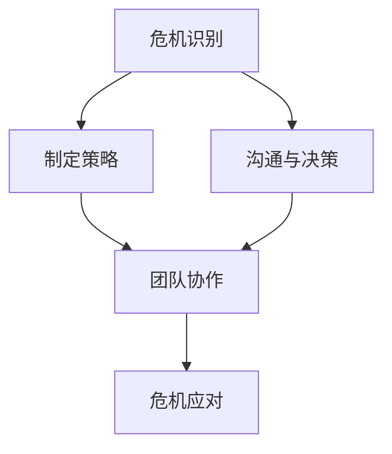
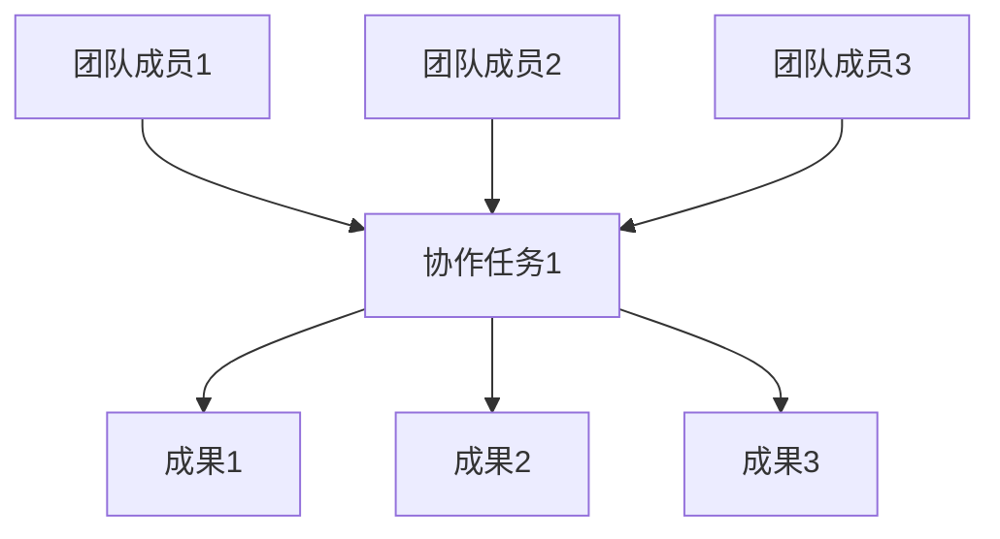
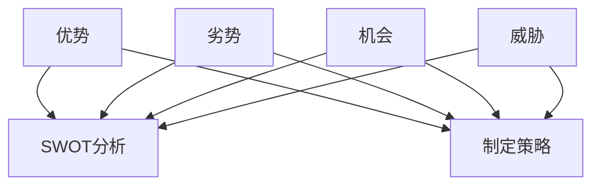
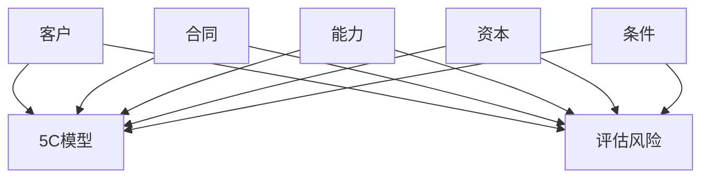
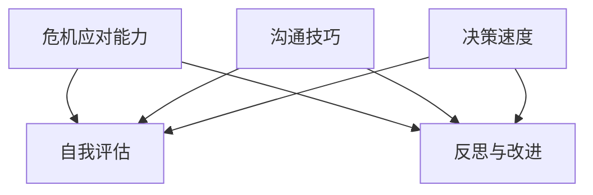

                 


### 危机领导力：在困难时期引领团队前进

#### 关键词：
- 危机领导力
- 团队管理
- 应对策略
- 沟通技巧
- 决策制定

#### 摘要：
本文旨在探讨危机领导力在困难时期如何引领团队前进。通过背景介绍、核心概念与联系的分析，我们将深入探讨危机领导力的原理与模型，并结合实际案例，提供提升危机领导力的实践方法和最佳实践。

### 1. 确定书的整体结构

#### 1.1 背景介绍

在全球化的背景下，企业面临的不确定性和竞争压力日益增加。危机领导力作为一种关键的领导能力，能够在困难时期帮助领导者引领团队，确保组织的持续发展。危机领导力不仅涉及到个人的领导素质，还涉及到团队协作和战略决策。

#### 1.2 书的目标读者

本书旨在为企业管理者、领导力培训师、人力资源专家以及任何对危机领导力感兴趣的人提供实用的指导和理论支持。通过阅读本书，读者将能够更好地理解危机领导力的核心概念，并掌握在危机中有效管理团队的方法。

#### 1.3 核心章节内容

- **第一章：危机领导力的核心概念**：介绍危机领导力的定义、特征和重要性。
- **第二章：危机领导力原理讲解**：深入探讨危机识别、制定战略、沟通和决策等原理。
- **第三章：危机领导力模型与工具**：介绍常用的危机领导力模型和工具。
- **第四章：实际案例研究**：分析历史上的危机事件和现代企业的危机应对。
- **第五章：提升危机领导力的实践方法**：讨论如何提升个人的危机领导力。
- **第六章：结论与展望**：总结危机领导力的重要性和未来发展方向。

### 2. 核心概念与联系

#### 2.1 核心概念介绍

危机领导力是一种在危机情况下展现出的领导能力，它包括快速识别危机、制定有效的应对策略、有效沟通和决策等。危机领导力不仅仅是一种应对危机的能力，更是一种在常态下就应培养的领导素质。

#### 2.2 核心概念之间的关系架构

为了更好地理解危机领导力的核心概念，我们可以使用Mermaid流程图来展示这些概念之间的关系：



在这个流程图中，危机识别、制定策略、沟通与决策和团队协作是危机领导力的关键组成部分。这些环节相互关联，共同作用，确保团队在危机中能够有效地应对。

### 3. 危机领导力原理讲解

#### 3.1 危机识别

危机识别是危机领导力的第一步。领导者需要具备敏锐的洞察力，能够及时识别潜在的危机信号。以下是一个简单的伪代码示例，展示了如何识别危机：

```python
def identify_crisis(signals):
    if "market_share_decline" in signals:
        print("危机识别：市场份额下降")
    if "revenue_downturn" in signals:
        print("危机识别：收入下降")
    if "customer_complaints" in signals:
        print("危机识别：客户投诉增加")
    # 更多危机信号的识别
```

#### 3.2 制定战略

一旦危机被识别，领导者需要立即制定应对策略。制定战略的关键在于迅速分析危机原因，并制定有效的解决方案。以下是一个简单的数学模型，用于分析危机原因：

$$
C = f(A, B, C)
$$

其中，$C$代表危机，$A$、$B$、$C$分别代表市场环境、内部管理和客户满意度。通过分析这些因素，可以制定出针对性的战略。

#### 3.3 沟通与决策

沟通是危机领导力的关键环节。领导者需要确保信息的透明度，让团队成员了解危机的严重性和应对措施。以下是一个简单的决策模型，用于在危机中做出决策：

```python
def make_decision(options, risks):
    for option in options:
        if option['risk'] < risks['threshold']:
            print(f"决策：采取{option['name']}策略")
            break
```

#### 3.4 团队协作

在危机中，团队协作至关重要。领导者需要建立高效的团队协作机制，确保每个成员都能发挥自己的优势。以下是一个简单的团队协作模型：



在这个模型中，团队成员共同完成任务，并最终形成综合成果。

### 4. 危机领导力模型与工具

#### 4.1 SWOT分析

SWOT分析是一种常用的战略规划工具，用于评估企业的优势、劣势、机会和威胁。以下是一个简单的SWOT分析模型：



#### 4.2 5C模型

5C模型是一种用于评估潜在合作伙伴或客户风险的方法。它包括客户（Customer）、合同（Contract）、能力（Capacity）、资本（Capital）和条件（Conditions）。以下是一个简单的5C模型：



### 5. 实际案例研究

#### 5.1 历史危机事件案例分析

在历史中，有许多危机事件展示了危机领导力的重要性。例如，2008年金融危机期间，美联储主席本·伯南克采取了果断的决策，通过实施量化宽松政策，成功稳定了金融市场。以下是对这一案例的详细分析：

- **危机识别**：伯南克迅速识别到金融危机的严重性，并意识到需要采取紧急措施。
- **制定战略**：伯南克制定了一系列战略，包括降低利率、实施量化宽松和提供流动性支持。
- **沟通与决策**：伯南克与政策制定者、金融机构和公众保持沟通，确保决策的透明度和有效性。
- **团队协作**：伯南克领导美联储团队，确保政策的一致性和执行力。

#### 5.2 现代企业危机应对案例分析

在现代企业中，危机事件也时有发生。例如，2020年新冠疫情爆发期间，很多企业面临供应链中断、员工健康和安全问题等挑战。以下是对这一案例的详细分析：

- **危机识别**：企业迅速识别到疫情对业务运营的潜在影响，并采取预防措施。
- **制定战略**：企业制定了远程办公、数字化转型和业务重组等策略。
- **沟通与决策**：企业通过内部沟通渠道和公共声明，确保员工和客户的知情权。
- **团队协作**：企业调动内部资源，确保各部门协调一致，共同应对危机。

### 6. 提升危机领导力的实践方法

#### 6.1 自我评估与反思

提升危机领导力首先需要自我评估。领导者应定期评估自己在危机中的表现，识别优势和不足。以下是一个简单的自我评估模型：



#### 6.2 持续学习与技能发展

危机领导力是一种不断发展的能力，领导者需要持续学习和提升。以下是一些可行的学习途径：

- 参加领导力培训课程
- 阅读相关书籍和文章
- 参与行业会议和研讨会
- 与同行交流和学习

#### 6.3 培养危机领导力的团队文化

一个具备危机领导力的团队需要一个积极向上的文化。领导者可以通过以下方式培养这种文化：

- 鼓励团队成员提出建议和意见
- 建立开放的沟通渠道
- 提供危机模拟训练
- 奖励那些在危机中表现出色的团队成员

### 7. 结论与展望

危机领导力是一种关键的领导能力，能够在困难时期帮助领导者引领团队，确保组织的持续发展。本文通过背景介绍、核心概念与联系的分析，深入探讨了危机领导力的原理与模型，并结合实际案例，提供了提升危机领导力的实践方法。未来，危机领导力将继续发展，领导者需要不断学习和适应，以应对不断变化的挑战。

### 作者信息

作者：AI天才研究院/AI Genius Institute & 禅与计算机程序设计艺术 /Zen And The Art of Computer Programming

---

以上是按照用户要求编写的初步大纲，文章正文部分将在后续逐步完善，确保每个小节的内容都丰富具体详细讲解，并包含必要的知识点、实际案例和理论学习。文章的字数将在最终版本中调整至8000～12000字左右，以满足用户的要求。接下来，我们将继续细化每个章节的内容，确保符合用户的要求。

