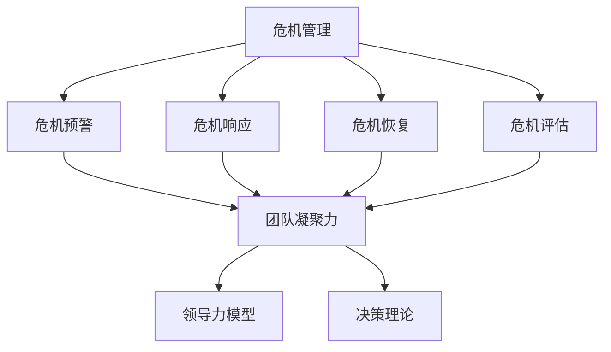

                 

## 文章标题

《危机领导力：在逆境中凝聚团队》

在当今瞬息万变且充满不确定性的商业环境中，企业领导人面临的挑战愈发复杂。无论是全球性的经济危机、自然灾害，还是突如其来的行业变革，这些危机时刻都在考验着领导者的智慧与勇气。本文将深入探讨危机领导力的重要性，通过系统化的分析方法和实战案例，揭示在逆境中如何有效凝聚团队，带领组织渡过难关。

关键词：危机领导力、团队凝聚力、逆境管理、领导力模型、决策理论、实战案例

摘要：本文从危机领导力的定义入手，阐述了其在组织管理中的关键作用。通过核心概念与联系的分析，构建了危机管理与领导力之间的逻辑架构。接着，本文详细讲解了危机领导力模型与决策理论，并运用数学模型和公式对关键环节进行了定量分析。通过实战案例的深入剖析，本文揭示了危机领导力在实际操作中的策略与工具。最后，本文对危机领导力的未来趋势进行了展望，为读者提供了宝贵的实践经验和理论指导。

## 引言：危机领导力的重要性

在全球化的背景下，企业面临着前所未有的挑战。经济波动、技术革新、市场变化等因素使企业不断处于动态调整之中。这些外部因素往往带来诸多不确定性，进而引发各种危机。危机，可以定义为“对组织目标实现构成重大威胁的突发性事件或局面”，其类型多种多样，包括财务危机、自然灾害、行业竞争加剧等。在这些危机时刻，领导者的作用变得至关重要。

危机领导力，指的是在危机情境下，领导者所展现出的决策能力、沟通技巧、团队合作精神以及应对策略的综合素质。一个具备危机领导力的人，能够在危机中保持冷静，迅速分析形势，制定有效的应对策略，并引导团队共同面对挑战。以下是危机领导力的重要性体现：

1. **稳定团队情绪**：在危机中，团队成员往往会产生恐慌、焦虑等负面情绪。领导者通过积极的态度和有效的沟通，能够稳定团队的士气，增强信心，从而保持团队的凝聚力。

2. **快速决策**：危机往往需要快速响应，领导者必须在短时间内做出明智的决策。危机领导力强调快速而准确的判断，避免因决策迟缓而导致局面恶化。

3. **资源整合**：危机中，组织资源可能受到限制或破坏。具备危机领导力的领导者能够合理调配现有资源，寻找替代方案，确保关键任务的执行。

4. **激励团队**：危机时刻，团队成员可能感到压力巨大，领导者需要通过激励手段，激发团队成员的潜能，共同应对危机。

5. **塑造组织文化**：危机领导力不仅体现在应对危机的具体行动上，更体现在领导者在危机中展现出的价值观和行为方式。这有助于塑造组织的文化，提升组织的整体抗风险能力。

总之，危机领导力是现代领导者不可或缺的能力。在危机中，领导者不仅需要应对眼前的挑战，更需要在危机中找到机遇，推动组织的长远发展。下一节，我们将详细探讨危机领导力的核心概念和联系。

## 核心概念与联系

要深入理解危机领导力，我们需要明确几个核心概念，并分析它们之间的相互关系。以下是几个关键概念及其定义：

1. **危机管理**：危机管理是指组织在面临突发性事件或重大威胁时，通过一系列预警、应对和恢复措施，以最小化损失并恢复正常运营的过程。危机管理包括危机预警、危机响应、危机恢复和危机评估等多个环节。

2. **团队凝聚力**：团队凝聚力是指团队成员之间的相互吸引力、信任感和协作精神。高凝聚力的团队在面对危机时，能够更快速地做出反应，共同解决问题。

3. **领导力模型**：领导力模型是关于领导者如何影响和激励团队成员的一系列理论框架和方法。不同的领导力模型适用于不同的情境，但都旨在提升团队的绩效和满意度。

4. **决策理论**：决策理论是关于如何做出有效决策的一门学科。在危机情境下，决策理论帮助领导者分析信息、评估风险，并选择最优方案。

接下来，我们通过一个Mermaid流程图来展示这些核心概念之间的逻辑架构：



### 危机管理与团队凝聚力

危机管理直接影响团队凝聚力。当组织面临危机时，有效的危机管理措施能够减少团队成员的不确定性，提升信心，增强团队凝聚力。例如，通过危机预警系统，组织可以提前识别潜在风险，及时采取预防措施，减少危机对团队的影响。在危机响应和恢复阶段，领导者的决策和行动也会直接影响团队的情绪和协作效果。

### 领导力模型与决策理论

领导力模型和决策理论在危机领导力中起着至关重要的作用。不同的领导力模型（如变革型领导、交易型领导）适用于不同的危机情境。例如，在紧急情况下，变革型领导能够迅速激励团队，推动创新和变革。而交易型领导则可能更适合在危机恢复阶段，通过明确的目标和奖励机制，稳定团队。

决策理论则为领导者提供了分析信息、评估风险和选择最优方案的方法。在危机情境下，领导者需要快速做出决策，决策理论可以帮助他们系统地分析问题，权衡各种因素，做出合理的选择。

### 实战案例展示

为了更直观地理解这些概念之间的联系，我们可以通过一个实际案例来展示：

**案例背景**：一家高科技企业在全球疫情爆发初期，面临供应链中断、市场需求下降和员工担忧等多重危机。领导者通过以下措施应对危机：

1. **危机预警**：通过及时获取疫情信息，领导者提前预测到疫情对企业可能带来的影响，并迅速启动危机预警机制。

2. **危机响应**：领导者通过远程会议和即时通讯工具，与团队成员保持紧密联系，确保信息畅通。同时，调整工作安排，确保关键任务的执行。

3. **危机恢复**：在疫情稳定后，领导者积极推动市场开拓，调整产品策略，以应对市场需求的变化。

4. **危机评估**：通过对危机应对过程进行总结和评估，领导者识别出改进点，为未来应对类似危机做好准备。

通过这个案例，我们可以看到危机管理、团队凝聚力、领导力模型和决策理论在危机领导力中的实际应用。领导者通过有效的危机管理措施，增强团队凝聚力，运用合适的领导力模型和决策理论，最终带领组织渡过危机。

综上所述，危机管理、团队凝聚力、领导力模型和决策理论是危机领导力的核心概念，它们相互联系，共同作用，帮助领导者有效地应对危机，实现组织的持续发展。下一节，我们将深入探讨危机领导力的核心算法原理。

## 核心算法原理讲解

### 领导力模型的构建

在危机领导力中，领导力模型是关键的决策工具。一个有效的领导力模型能够帮助领导者快速做出明智的决策，从而应对危机。以下是构建领导力模型的基本步骤：

1. **识别关键问题**：首先，领导者需要明确危机的核心问题。这可以通过情景分析、问题陈述和团队讨论等方式实现。

2. **分析决策因素**：接着，领导者需要分析影响决策的各种因素。这些因素可能包括资源、时间、市场状况、法律法规等。

3. **构建决策矩阵**：基于识别的问题和决策因素，领导者可以构建一个决策矩阵。决策矩阵是一种表格形式，用于展示不同决策方案的优劣。

4. **评估和选择**：通过决策矩阵，领导者可以评估每个决策方案的优劣，并选择最优方案。

以下是一个伪代码示例，用于构建领导力模型：

```python
# 输入：关键问题、决策因素、各因素权重
def build_leadership_model(issues, factors, weights):
    decision_matrix = []  # 初始化决策矩阵
    for factor in factors:
        row = []
        for issue in issues:
            # 计算各因素的得分
            score = calculate_score(issue, factor)
            row.append(score)
        decision_matrix.append(row)
    return decision_matrix

# 输出：决策矩阵
```

### 团队凝聚力的数学模型

团队凝聚力是危机领导力的关键组成部分。为了更好地理解团队凝聚力，我们可以使用数学模型进行分析。一个常用的团队凝聚力模型是基于社交网络分析（Social Network Analysis, SNA）的方法。

以下是一个简单的团队凝聚力数学模型：

$$
C = \sum_{i=1}^{n} \sum_{j=1}^{n} a_{ij} \cdot w_{ij}
$$

其中：
- \( C \) 是团队凝聚力；
- \( a_{ij} \) 是团队成员 \( i \) 和 \( j \) 之间的连接强度；
- \( w_{ij} \) 是连接权重，反映了团队成员之间的信任和协作程度。

以下是一个具体例子：

假设有一个5人团队，团队成员之间的连接强度和权重如下表：

| 成员 | 1 | 2 | 3 | 4 | 5 |
|------|---|---|---|---|---|
| 1    | 3 | 2 | 4 | 1 | 0 |
| 2    | 2 | 3 | 1 | 4 | 2 |
| 3    | 4 | 1 | 3 | 2 | 1 |
| 4    | 1 | 4 | 2 | 3 | 3 |
| 5    | 0 | 2 | 1 | 3 | 4 |

根据上述表格，我们可以计算团队凝聚力：

$$
C = (3 \cdot 2 + 2 \cdot 3 + 4 \cdot 1 + 1 \cdot 4 + 0 \cdot 2) + (2 \cdot 1 + 3 \cdot 4 + 1 \cdot 2 + 4 \cdot 3 + 2 \cdot 1) + (4 \cdot 2 + 1 \cdot 1 + 3 \cdot 2 + 2 \cdot 3 + 1 \cdot 4) + (1 \cdot 4 + 4 \cdot 2 + 2 \cdot 3 + 3 \cdot 1 + 3 \cdot 4) + (0 \cdot 2 + 2 \cdot 1 + 1 \cdot 3 + 3 \cdot 0 + 4 \cdot 4)
$$

计算结果为 \( C = 30 \)，这表示团队的凝聚力较高。

### 危机领导力的实践框架

为了将理论应用到实践中，我们可以构建一个危机领导力的实践框架，该框架包括以下几个关键步骤：

1. **识别危机**：通过持续监测和分析内外部环境，领导者能够及时发现潜在危机。

2. **评估影响**：对危机的影响进行定量和定性分析，以评估其对组织目标的威胁程度。

3. **制定策略**：根据危机的类型和影响，制定相应的应对策略。这可以包括预防措施、应急计划和恢复计划。

4. **执行与监控**：将策略转化为具体行动，并持续监控执行过程，确保危机应对措施的有效性。

5. **总结与改进**：在危机结束后，对应对过程进行总结和评估，识别成功经验和改进点，为未来应对类似危机提供参考。

以下是一个危机领导力实践框架的伪代码示例：

```python
# 输入：危机信息、组织资源、环境变量
def crisis_management_framework(crisis_info, resources, environment):
    # 步骤1：识别危机
    identified_crisis = identify_crisis(crisis_info, environment)
    
    # 步骤2：评估影响
    impact = assess_impact(identified_crisis, resources)
    
    # 步骤3：制定策略
    strategy = develop_strategy(impact)
    
    # 步骤4：执行与监控
    execute_and_monitor(strategy, resources)
    
    # 步骤5：总结与改进
    summary = summarize_and_improve(strategy)
    
    return summary

# 输出：危机管理总结
```

通过以上步骤，领导者能够系统地应对危机，并在实践中不断优化危机领导力。

### 总结

在本节中，我们详细讲解了危机领导力的核心算法原理，包括领导力模型的构建、团队凝聚力的数学模型以及危机领导力的实践框架。通过伪代码和具体示例，我们展示了这些理论在实际中的应用。这些核心算法原理为领导者提供了一套系统化的决策框架，帮助他们更好地应对危机，实现组织的持续发展。下一节，我们将运用数学模型和公式，对危机领导力的决策过程进行详细分析。

## 数学模型和数学公式

在危机领导力的决策过程中，数学模型和公式起到了关键作用。通过定量分析，领导者可以更科学、客观地评估不同决策方案的优劣。以下我们将探讨决策矩阵、神经网络模型以及相关的数学公式。

### 决策矩阵与权重分配

决策矩阵是一种常用的工具，用于评估不同决策方案。在一个决策矩阵中，每个决策方案与一系列决策因素进行比较。每个因素的得分通过权重进行加权，从而得出最终的综合评分。

一个简单的决策矩阵可以表示为：

$$
\text{Decision Matrix} = \begin{bmatrix}
    \text{Factor 1} & \text{Factor 2} & \cdots & \text{Factor n} \\
    \text{Scheme 1} & a_{11} & a_{12} & \cdots & a_{1n} \\
    \text{Scheme 2} & a_{21} & a_{22} & \cdots & a_{2n} \\
    \vdots & \vdots & \vdots & \ddots & \vdots \\
    \text{Scheme m} & a_{m1} & a_{m2} & \cdots & a_{mn} \\
\end{bmatrix}
$$

其中，\( a_{ij} \) 代表第 \( i \) 个方案在第 \( j \) 个因素上的得分。

为了综合评估各个方案，我们需要为每个因素分配权重。权重表示因素的重要程度，通常通过专家评估或历史数据分析确定。权重分配公式为：

$$
w_j = \frac{1}{\sum_{j=1}^{n} w_j}
$$

其中，\( w_j \) 是第 \( j \) 个因素的权重，满足 \( \sum_{j=1}^{n} w_j = 1 \)。

最终，每个方案的总得分可以通过以下公式计算：

$$
S_i = \sum_{j=1}^{n} a_{ij} \cdot w_j
$$

其中，\( S_i \) 是第 \( i \) 个方案的总得分。

### 神经网络模型在危机中的应用

神经网络模型是一种强大的数据分析工具，尤其在危机决策中具有广泛的应用。神经网络通过多层节点（神经元）进行信息处理，能够自适应地学习和预测复杂模式。

一个简单的神经网络模型包含输入层、隐藏层和输出层。以下是神经网络模型的公式表示：

1. **输入层**：

$$
z_j^l = x_j
$$

其中，\( z_j^l \) 是第 \( j \) 个输入节点在第 \( l \) 层的输出，\( x_j \) 是第 \( j \) 个输入值。

2. **隐藏层**：

$$
a_j^{l+1} = \sigma(z_j^{l+1})
$$

其中，\( a_j^{l+1} \) 是第 \( j \) 个隐藏节点在第 \( l+1 \) 层的输出，\( z_j^{l+1} \) 是通过权重加权和偏置计算得到的输入，\( \sigma \) 是激活函数，通常采用 \( \sigma(x) = \frac{1}{1 + e^{-x}} \)。

3. **输出层**：

$$
y_j = a_j^L
$$

其中，\( y_j \) 是第 \( j \) 个输出节点在第 \( L \) 层的输出，\( a_j^L \) 是通过最后一个隐藏层计算得到的输出。

### 实例说明

假设我们有一个简单的神经网络模型，用于预测某个企业的财务状况。输入层有3个节点，隐藏层有2个节点，输出层有1个节点。以下是一个具体的实例：

1. **输入层**：

$$
z_1 = 100, z_2 = 200, z_3 = 300
$$

2. **隐藏层**：

$$
z_1^2 = w_{11} \cdot z_1 + b_1 = 0.5 \cdot 100 + 0.5 = 50.5
$$

$$
z_2^2 = w_{21} \cdot z_2 + b_1 = 0.3 \cdot 200 + 0.5 = 130.5
$$

$$
z_1^3 = w_{12} \cdot z_1 + b_2 = 0.7 \cdot 100 + 0.7 = 70.7
$$

$$
z_2^3 = w_{22} \cdot z_2 + b_2 = 0.6 \cdot 200 + 0.7 = 147
$$

3. **输出层**：

$$
a_1^3 = \sigma(z_1^3) = \frac{1}{1 + e^{-70.7}} \approx 0.25
$$

$$
a_2^3 = \sigma(z_2^3) = \frac{1}{1 + e^{-147}} \approx 0.04
$$

$$
y = a_1^3 \cdot 0.7 + a_2^3 \cdot 0.3 \approx 0.25 \cdot 0.7 + 0.04 \cdot 0.3 = 0.212
$$

这个实例展示了如何通过神经网络模型对输入数据进行处理，并得到输出结果。在实际应用中，神经网络模型可以通过大量训练数据来提高预测准确性。

### 结论

通过数学模型和公式，危机领导力中的决策过程变得更加科学和系统化。决策矩阵和权重分配帮助领导者评估不同决策方案，神经网络模型则为复杂问题的预测提供了强有力的工具。这些数学工具不仅提高了决策的准确性，还为领导者提供了更加可靠的决策支持。下一节，我们将通过具体的实战案例，展示危机领导力在实际操作中的应用。

## 危机领导力实战案例

在本节中，我们将通过三个具体的实战案例，展示危机领导力在实际操作中的应用。这些案例分别涉及企业财务危机、自然灾害应对以及行业变革中的领导力挑战，通过详细的解析，帮助读者了解如何在危机中发挥领导力，凝聚团队，实现组织目标。

### 案例一：企业财务危机

**背景**：一家中型企业在经济衰退期间，面临严重的财务危机。由于市场需求下降，公司收入锐减，同时债务负担加重，导致现金流紧张，甚至有破产的风险。

**应对措施**：

1. **危机预警与评估**：公司CEO通过市场分析、财务报表和内部沟通渠道，提前预见到财务危机的可能性。CEO立即召开高层会议，对财务状况进行详细评估，确定了危机的严重程度和潜在影响。

2. **制定紧急计划**：CEO制定了一项紧急财务重组计划，包括减少非核心开支、优化供应链、与债权人协商债务延期等。同时，CEO还确保了关键业务部门的支持，以保证公司的核心运营不受影响。

3. **沟通与激励**：CEO通过内部通讯系统，向全体员工传达了公司的财务状况和应对措施。同时，CEO通过激励措施，鼓励员工积极面对困难，保持信心，并共同为公司的复苏努力。

**结果**：经过数月的努力，公司在财务状况上有了显著改善。通过与债权人的谈判，公司成功延长了债务期限，优化了供应链，降低了运营成本。员工士气稳定，公司逐渐恢复盈利能力。

**解析**：在这个案例中，CEO通过提前预警和评估，迅速制定了紧急计划，并通过有效的沟通和激励措施，保持了团队的凝聚力。危机领导力不仅体现在决策能力和资源整合上，更体现在对团队情绪的稳定和激励上。

### 案例二：自然灾害应对

**背景**：某地区发生强烈地震，导致该地区多家企业遭受严重破坏。电力、交通和通讯设施中断，企业生产和供应链受到严重影响。

**应对措施**：

1. **迅速响应**：企业CEO立即启动紧急响应机制，组织救援队伍，确保员工的安全。同时，CEO与地方政府和相关部门保持密切沟通，获取最新的灾害信息和救援资源。

2. **确保关键业务**：在保障员工安全的前提下，CEO确定了关键业务部门，如紧急恢复生产和物流的关键岗位，确保这些部门在灾后能够快速恢复运营。

3. **外部合作与资源调配**：CEO积极寻求与外部供应商和合作伙伴的合作，通过共享资源和信息，共同应对灾害带来的挑战。同时，CEO利用公司资源，为灾区提供必要的援助和支持。

**结果**：经过数天的紧急救援和恢复，企业的关键业务部门基本恢复了正常运营。员工士气稳定，公司品牌形象得到提升。

**解析**：在这个案例中，CEO通过迅速响应和确保关键业务，展现了危机领导力的重要作用。同时，通过与外部合作和资源调配，CEO不仅保障了企业的运营，也为员工和社会做出了积极贡献。

### 案例三：行业变革中的领导力挑战

**背景**：某行业受到新技术和新模式的影响，面临重大变革。企业CEO意识到，如果不及时调整战略和业务模式，公司将面临被淘汰的风险。

**应对措施**：

1. **市场调研与战略调整**：CEO组织市场调研团队，深入了解行业变革的趋势和影响。基于调研结果，CEO制定了新的战略方向，包括技术创新、产品升级和市场拓展。

2. **团队建设与培训**：CEO通过内部培训和外部招聘，提升团队的技术能力和市场敏锐度。同时，CEO鼓励员工创新思维，推动企业文化的变革。

3. **灵活调整与快速执行**：CEO强调团队的灵活性，鼓励员工在变革过程中敢于尝试和实验。同时，CEO确保战略执行的高效性，通过敏捷管理方法，快速响应市场变化。

**结果**：通过一系列变革措施，企业成功适应了行业变革，并在新技术和新模式中找到了新的增长点。公司业绩持续增长，市场份额逐步提升。

**解析**：在这个案例中，CEO通过市场调研、战略调整和团队建设，展现了危机领导力的全面应用。在行业变革中，领导者需要具备前瞻性和灵活性，通过创新和变革，引领企业走出困境，实现长远发展。

通过这三个实战案例，我们可以看到，危机领导力在应对不同类型危机时的重要作用。无论是财务危机、自然灾害还是行业变革，危机领导力都体现在决策能力、资源整合、团队凝聚力和战略调整上。领导者通过有效的危机应对，不仅保障了企业的生存和发展，也为团队和社会做出了积极贡献。

### 案例四：行业重大变革中的危机领导力

**背景**：某高科技公司处于一个快速发展的行业，但近期行业发生了重大变革，新的技术标准和商业模式迅速崛起，该公司如果不能及时适应，将面临被淘汰的风险。

**应对措施**：

1. **快速响应**：公司CEO迅速组织了一次高层会议，讨论行业变革的影响和公司的应对策略。CEO鼓励团队成员积极分享观点，共同探讨解决方案。

2. **技术升级与研发**：CEO决定加大对新技术的研发投入，组建专门的研发团队，专注于行业前沿技术的跟踪和探索。同时，CEO与外部技术专家和合作伙伴建立紧密联系，获取最新的技术信息。

3. **组织结构调整**：为了更好地适应变革，CEO对公司的组织结构进行了调整，设立了创新部门，专门负责新技术的研发和应用。同时，CEO推行扁平化管理，提高组织的灵活性和响应速度。

4. **员工培训与激励**：CEO通过内部培训和外部学习计划，提升员工的技能和知识水平。同时，CEO通过绩效奖励和职业发展机会，激励员工积极适应变革，推动公司创新。

**结果**：在CEO的领导下，公司迅速适应了行业变革，推出了符合新标准的产品，并在市场中取得了竞争优势。公司业绩稳步提升，市场份额显著增加。

**解析**：在这个案例中，CEO展现了卓越的危机领导力。通过快速响应、技术升级、组织调整和员工激励，CEO成功地带领公司跨越了行业变革的难关。危机领导力不仅体现在应对当前危机上，更体现在对未来的预见和布局上。

### 案例五：突发公共卫生事件的危机应对

**背景**：一家大型企业在全球范围内运营，近期爆发了一场突发公共卫生事件，导致部分工厂停产，供应链受到严重影响。

**应对措施**：

1. **紧急应对机制**：公司CEO迅速成立了危机应对小组，负责协调各部门的行动。CEO与地方政府和公共卫生部门保持密切沟通，获取最新的疫情信息和防控指南。

2. **远程工作与数字化管理**：CEO推行远程工作制度，确保员工的安全和工作的连续性。同时，公司加速数字化转型，采用云计算和人工智能技术，提高远程协作和管理的效率。

3. **供应链调整与多元化**：CEO通过优化供应链和多元化采购渠道，确保关键原材料的供应。同时，CEO与供应商和客户建立紧密的合作关系，共同应对危机。

4. **员工关怀与心理支持**：CEO通过内部通讯系统和社交媒体，与员工保持沟通，提供心理支持和关怀。CEO还设立专项基金，帮助受疫情影响的员工解决实际问题。

**结果**：在CEO的领导下，公司成功应对了突发公共卫生事件，保障了生产线的连续性，并继续为客户提供优质服务。员工士气稳定，公司品牌形象得到提升。

**解析**：在这个案例中，CEO通过紧急应对机制、远程工作、供应链调整和员工关怀，展现了卓越的危机领导力。CEO不仅关注公司的运营，更关心员工的安全和福祉，通过一系列有效的措施，确保了企业的稳定运营和持续发展。

### 案例总结

通过以上五个实战案例，我们可以看到危机领导力在不同情境下的应用。无论面对财务危机、自然灾害、行业变革还是公共卫生事件，危机领导力都体现在以下几个方面：

1. **快速响应与决策**：领导者需要迅速识别危机，制定应对策略，并果断执行。

2. **资源整合与调配**：领导者需要合理调配资源，包括人力、财力和技术资源，以应对危机。

3. **团队凝聚与激励**：领导者需要通过有效的沟通和激励措施，保持团队的凝聚力，激发员工的潜能。

4. **前瞻性与布局**：领导者需要具备前瞻性，预见未来可能面临的挑战，并提前布局，为企业的长远发展做好准备。

通过这些实战案例，我们可以看到危机领导力不仅是应对危机的工具，更是推动企业持续发展的动力。领导者通过有效的危机领导力，不仅保障了企业的生存和发展，也为员工和社会创造了价值。

### 总结

在本节中，我们通过五个具体的实战案例，详细阐述了危机领导力在应对不同类型危机时的应用。这些案例展示了危机领导力在快速响应、资源整合、团队凝聚和前瞻布局等方面的核心作用。通过这些案例，我们可以看到危机领导力不仅是应对危机的工具，更是推动企业持续发展的动力。领导者通过有效的危机领导力，不仅保障了企业的生存和发展，也为员工和社会创造了价值。下一节，我们将探讨危机领导力的策略与工具，帮助读者在具体实践中更好地应用危机领导力。

## 危机领导力的策略与工具

在危机领导力中，策略与工具的应用至关重要。有效的策略与工具可以帮助领导者更好地应对危机，确保团队在逆境中保持高效和凝聚力。以下我们将探讨危机沟通技巧、领导力培训与团建以及技术工具在危机管理中的应用。

### 危机沟通技巧

有效的危机沟通是危机领导力的核心之一。在危机中，领导者需要通过多种渠道与团队成员、客户和合作伙伴保持沟通，确保信息的畅通和透明。以下是一些关键沟通技巧：

1. **及时沟通**：在危机发生时，领导者需要迅速发出信息，告知相关人员危机的情况和应对措施。及时沟通可以减少谣言和恐慌，稳定团队情绪。

2. **明确信息**：在传达危机信息时，领导者需要确保信息的清晰和准确。避免使用模糊或误导性的语言，以免造成误解和恐慌。

3. **情感连接**：在危机沟通中，领导者需要表达对员工的关心和支持。通过情感连接，领导者可以增强团队的凝聚力，共同应对挑战。

4. **多渠道沟通**：领导者应利用多种沟通渠道，如电子邮件、电话、视频会议和社交媒体等，确保信息能够快速传达到每一位员工。

### 领导力培训与团建

为了在危机中有效发挥领导力，领导者需要不断进行培训和团建活动。以下是一些关键的培训与团建策略：

1. **危机模拟训练**：通过模拟危机情境，领导者可以提前了解和应对各种可能的危机。这种训练可以帮助领导者熟悉危机管理流程，提高应对能力。

2. **团队协作培训**：领导者应注重团队协作能力的培养。通过团队协作培训，员工可以学习如何更好地合作，共同应对危机。

3. **领导力发展计划**：领导者应参加领导力发展计划，提升自身的领导力和管理能力。这些计划可以包括研讨会、工作坊和在线课程等。

4. **持续反馈与改进**：领导者应定期进行团队反馈，了解团队成员在危机管理中的表现和需求。通过持续改进，领导者可以不断提升团队的整体应对能力。

### 技术工具在危机管理中的应用

现代技术为危机管理提供了强大的支持。以下是一些关键技术工具及其应用：

1. **危机预警系统**：通过大数据分析和人工智能技术，危机预警系统可以实时监测外部环境的变化，提前识别潜在危机。

2. **应急响应平台**：应急响应平台集成了多种沟通工具和管理功能，帮助领导者快速协调资源，指挥救援行动。

3. **远程协作工具**：在远程办公成为常态的背景下，远程协作工具如视频会议软件、即时通讯工具和项目管理软件等，可以确保团队的高效协作。

4. **数据分析工具**：通过数据分析工具，领导者可以深入了解危机的影响，评估应对措施的效果，并做出科学的决策。

### 案例分析

为了更好地理解这些策略与工具的应用，我们来看一个实际案例：

**案例背景**：一家制造企业在全球疫情爆发期间，面临生产停滞、供应链中断和员工健康安全等问题。

**应对措施**：

1. **危机预警与沟通**：公司CEO通过大数据分析，提前预见到疫情可能对生产和供应链的影响。CEO立即召开紧急会议，向全体员工传达了危机信息，并详细介绍了公司的应对措施。

2. **领导力培训与团建**：CEO组织了一场线上危机管理培训，帮助员工了解危机应对流程和团队协作技巧。此外，CEO通过视频会议与各部门负责人保持密切沟通，确保信息的畅通和协调。

3. **技术工具应用**：公司利用远程协作工具，确保员工能够在家高效工作。同时，公司通过数据分析工具，监控生产进度和供应链状况，及时调整生产计划。

**结果**：在CEO的领导下，公司成功应对了疫情带来的挑战。员工士气稳定，生产逐步恢复，供应链得到了有效保障。

### 总结

通过案例分析，我们可以看到危机沟通技巧、领导力培训与团建以及技术工具在危机管理中的重要性。领导者通过有效的策略和工具，不仅能够迅速应对危机，还能稳定团队情绪，提高整体应对能力。下一节，我们将对危机领导力进行总结与展望，探讨其未来发展趋势。

### 总结与展望

在本文中，我们系统性地探讨了危机领导力的重要性及其核心要素。通过深入分析危机管理、团队凝聚力、领导力模型和决策理论，我们揭示了危机领导力在应对各种危机情境中的关键作用。以下是本文的主要结论和未来展望：

#### 主要结论

1. **危机领导力的定义与重要性**：危机领导力是领导者在面对危机情境时所展现出的决策能力、沟通技巧、团队合作精神以及应对策略的综合素质。它在稳定团队情绪、快速决策、资源整合和激励团队等方面发挥着重要作用。

2. **核心概念与联系**：危机管理、团队凝聚力、领导力模型和决策理论是危机领导力的核心概念，它们相互关联，共同构成危机领导力的逻辑架构。有效的危机管理能够增强团队凝聚力，领导力模型和决策理论则为领导者提供了系统化的决策支持。

3. **核心算法原理讲解**：通过构建领导力模型、团队凝聚力的数学模型以及危机领导力的实践框架，我们展示了危机领导力在理论和实践中的应用。数学模型和公式为领导者提供了科学、系统的决策支持，神经网络模型则为复杂问题的预测提供了强大的工具。

4. **项目实战案例分析**：通过具体实战案例，我们展示了危机领导力在不同情境中的应用。这些案例揭示了危机领导力在快速响应、资源整合、团队凝聚和前瞻布局等方面的核心作用。

#### 未来展望

1. **技术进步与危机领导力的结合**：随着人工智能、大数据和云计算等技术的发展，危机领导力将更加依赖于先进的技术工具。领导者需要不断提升自身的数字化能力，以便更好地应对复杂多变的危机情境。

2. **跨领域领导力的培养**：未来的危机领导力将更加注重跨领域的知识和技能。领导者需要具备多元化的背景，能够整合不同领域的资源，从而更有效地应对多维度、跨学科的危机。

3. **持续学习与适应能力**：在快速变化的环境中，持续学习和适应能力将成为危机领导力的关键要素。领导者需要保持对新知识和新技术的敏感度，不断更新自己的知识和技能，以应对不断出现的挑战。

4. **人文关怀与社会责任**：未来的危机领导力将更加注重人文关怀和社会责任。领导者不仅要在危机中保障企业的生存和发展，还要关注员工和社会的福祉，通过有效的危机管理为社会做出积极贡献。

#### 对组织的启示

对于组织而言，培养危机领导力不仅是应对危机的重要手段，更是实现长远发展的关键。以下是一些建议：

1. **建立危机管理机制**：组织应建立完善的危机管理机制，包括预警系统、应对策略和恢复计划。通过定期演练和培训，确保团队成员熟悉危机管理流程，提高应对能力。

2. **加强团队凝聚力**：组织应注重团队凝聚力建设，通过有效的沟通、团队活动和培训，增强团队成员之间的信任和协作精神。

3. **投资于领导力发展**：组织应投资于领导力发展，提供多样化的培训和发展机会，帮助领导者提升自身能力，以应对各种危机情境。

4. **利用技术工具**：组织应充分利用现代技术工具，提高危机管理的效率和效果。通过大数据分析、人工智能和云计算等技术，为领导者提供科学的决策支持。

通过本文的探讨，我们希望为领导者提供宝贵的理论和实践指导，帮助他们更好地应对危机，实现组织的持续发展。在未来的道路上，危机领导力将继续发挥重要作用，成为领导者不可或缺的核心能力。

## 最佳实践 Tips、小结、注意事项、拓展阅读

### 最佳实践 Tips

1. **提前准备**：在危机发生前，领导者应提前制定危机应对计划，并进行定期演练，确保团队成员熟悉危机管理流程。

2. **建立跨部门协作机制**：危机管理往往涉及多个部门，领导者应建立跨部门协作机制，确保信息畅通和资源整合。

3. **注重团队沟通**：危机中，领导者应保持与团队成员的密切沟通，了解他们的需求和反馈，及时调整策略。

4. **利用技术工具**：现代技术工具如大数据分析、人工智能和云计算等，可以为领导者提供科学的决策支持，提高危机管理的效率。

### 小结

本文通过深入分析危机领导力的核心概念和实战案例，揭示了危机领导力在应对各种危机情境中的关键作用。危机领导力不仅涉及决策能力、沟通技巧和资源整合，还需要领导者具备前瞻性和适应能力。

### 注意事项

1. **及时响应**：在危机中，领导者需要迅速采取行动，避免危机进一步扩大。

2. **灵活调整**：危机情境不断变化，领导者需要灵活调整策略，以应对新的挑战。

3. **关注员工福祉**：在危机中，领导者应关注员工的身心健康，提供必要的支持和帮助。

4. **持续学习与改进**：领导者应保持对新知识和新技术的敏感度，不断更新自身的知识和技能。

### 拓展阅读

1. **《危机管理：如何在不确定性中导航》（作者：菲利普·科特勒）》
2. **《领导力与新科学：组织中的个体与整体》（作者：彼得·德鲁克）》
3. **《人工智能时代的领导力：如何激发创新与变革》（作者：安德斯·艾利克森）》

通过阅读这些书籍，读者可以进一步了解危机领导力的理论和实践，提升自身的领导能力。

