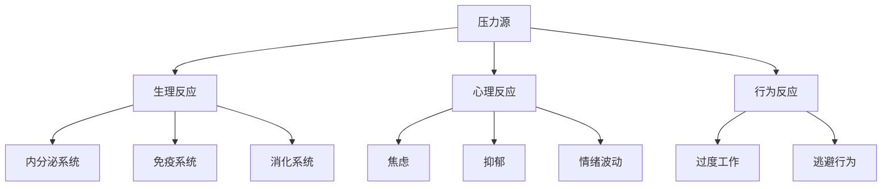

                 

### 文章标题

# 压力管理：帮助团队应对高压环境

### 文章关键词

- 压力管理
- 团队压力
- 高压环境
- 压力反应
- 压力应对策略
- 技术工具

### 文章摘要

在当今快节奏的IT行业，团队面临的压力日益增加。有效的压力管理对于提高团队的生产力和成员的幸福感至关重要。本文将探讨压力管理的核心概念和理论，分析团队高压环境的影响，并提出一系列实用策略，包括认知行为疗法、放松技巧、生活方式调整以及技术工具的应用。通过案例分析和实战指南，帮助团队更好地应对高压环境，实现高效工作与个人成长。

## 引言与背景

在IT行业，特别是在软件开发、数据分析和人工智能等领域，高压环境已成为一个普遍现象。这种高压环境不仅源于项目进度的紧迫性、技术难度的挑战，还受到市场竞争、客户需求变化等因素的驱动。以下是几个关于团队高压环境的例子：

1. **项目交付的压力**：当项目需要在短时间内完成且客户期望很高时，团队成员往往会感到巨大的压力。这种压力可能导致加班、睡眠不足和工作效率下降。

2. **技术挑战**：在新兴领域，如区块链、机器学习等，团队成员需要不断学习新技术，以保持竞争力。这种持续的学习压力可能会导致焦虑和挫败感。

3. **市场竞争**：IT行业的竞争非常激烈，企业为了在市场中保持领先地位，可能会不断推出新项目，这给团队成员带来了额外的压力。

这些高压环境不仅对个人的身心健康造成负面影响，如焦虑、抑郁和身体健康问题，还可能影响团队的整体表现，导致项目延误、质量下降和员工流失。因此，有效的压力管理对于IT团队来说至关重要。

### 压力与健康的联系

压力是指身体或心理上感受到的威胁或挑战，它对健康有着深远的影响。长期的压力会导致一系列生理和心理反应，包括：

1. **生理反应**：长期压力会导致内分泌系统的失调，例如，增加皮质醇的水平，长期高水平的皮质醇会导致免疫系统功能下降、消化系统问题、心血管疾病等。

2. **心理反应**：长期的压力可能导致焦虑、抑郁和情绪波动，影响个人的社交关系和工作效率。

3. **行为反应**：长期压力还可能引发不健康的行为，如过度饮酒、吸烟或暴饮暴食，这些行为进一步加剧健康问题。

### 压力反应的类型

压力反应可以分为三种主要类型：生理反应、心理反应和行为反应。每种反应都有其特定的表现和机制。

1. **生理反应**：
    - **内分泌系统**：压力刺激下，肾上腺素和皮质醇的分泌增加，导致心率加快、血压升高等生理反应。
    - **免疫系统**：长期压力会降低免疫系统的功能，使个体更容易感染疾病。
    - **消化系统**：压力可能导致消化不良、胃痛等问题。

2. **心理反应**：
    - **焦虑和抑郁**：长期的压力会导致焦虑和抑郁情绪，影响个人的心理状态和社交关系。
    - **情绪波动**：压力可能导致情绪不稳定，容易愤怒或情绪低落。

3. **行为反应**：
    - **过度工作**：为了应对压力，一些人可能会过度工作，导致睡眠不足和身体疲劳。
    - **逃避行为**：另一些人可能会选择逃避压力，如沉迷于游戏或社交网络，这虽然短期内缓解压力，但长期来看并无益处。

### 压力管理的基本原则

有效的压力管理需要从多个方面入手，以下是一些核心原则：

1. **认知重构**：通过改变对压力的看法和认知，可以减少压力的负面影响。例如，将“必须立即解决”的压力转化为“可以逐步解决”的任务。

2. **情绪调节**：学习情绪调节技巧，如深呼吸、冥想和正念练习，可以帮助缓解压力和焦虑。

3. **积极应对**：积极应对压力，如设定合理的期望、建立支持系统，可以提高应对能力。

4. **健康生活方式**：保持健康的生活方式，如规律饮食、充足睡眠和适量运动，有助于缓解压力。

### 核心概念与联系

为了更好地理解压力管理的核心概念及其相互关系，我们可以使用Mermaid流程图来展示它们之间的架构。以下是一个简化的流程图示例：



在这个流程图中，压力源（A）是所有反应的起点，它分别引发生理反应（B）、心理反应（C）和行为反应（D）。生理反应进一步影响内分泌系统（E）、免疫系统（F）和消化系统（G），而心理反应则导致焦虑（H）、抑郁（I）和情绪波动（J）。行为反应包括过度工作（K）和逃避行为（L），这些行为可能进一步加剧压力反应。

通过这个流程图，我们可以清晰地看到压力管理的各个核心概念及其相互关系。这种架构有助于我们在实践中更好地理解和应对压力。

### 压力管理的理论基础

压力管理的理论基础涉及多个学科，包括心理学、生理学和社会学。以下是一些关键理论，它们帮助我们理解压力的来源、如何应对压力以及如何通过策略减轻压力。

1. **压力-适应理论**：这是由心理学家霍华德·卡特勒（Howard J. Cutler）提出的，认为压力是身体对环境威胁的反应，目的是维持平衡。当身体感受到威胁时，它会通过生理反应（如心跳加快、呼吸急促）来准备应对威胁。如果威胁持续存在，身体会不断尝试适应，以恢复平衡。

2. **认知行为理论**：由阿尔伯特·艾利斯（Albert Ellis）提出，强调认知在压力中的作用。他认为，压力并非由外部事件直接引起，而是由个人的认知评价和信念系统决定的。通过改变负面认知，可以减轻压力。

3. **积极心理学**：由马丁·塞利格曼（Martin Seligman）提出，专注于如何培养个体的积极特质和应对能力，从而提高抗压能力。积极心理学认为，通过培养乐观、感恩和自我效能感等积极特质，个体可以更好地应对压力。

4. **自我调节理论**：由朱迪思·诺克（Judith N.豪斯）提出，强调个体在应对压力时如何自我调节。自我调节包括设定目标、监控进展、调整策略和维持动力。通过自我调节，个体可以更好地管理压力，提高工作效率。

### 压力管理的核心概念

在理解压力管理的理论基础后，我们需要明确一些核心概念，这些概念构成了压力管理的理论基础，并指导我们在实践中采取有效措施。

1. **压力源**：压力源是指导致压力产生的事件或情境，如工作压力、人际关系问题、财务困境等。识别压力源是压力管理的第一步，因为只有了解压力源，我们才能有针对性地采取措施。

2. **生理反应**：当身体感受到压力时，会产生一系列生理反应，如心跳加快、呼吸急促、肌肉紧张等。这些生理反应是身体准备应对威胁的自然反应，但如果长期存在，可能会对身体健康造成负面影响。

3. **心理反应**：心理反应包括焦虑、抑郁、愤怒等情绪反应。长期的心理压力会导致情绪不稳定，影响个人的心理健康和工作效率。

4. **行为反应**：行为反应是指个体在压力下的行为表现，如过度工作、逃避问题、过度消费等。这些行为可能是应对压力的一种方式，但长期来看可能会加剧压力。

5. **应对策略**：应对策略是指个体采取的减轻压力的措施，如放松技巧、认知重构、情绪调节等。有效的应对策略可以帮助个体更好地管理压力，提高生活质量。

6. **健康生活方式**：健康的生活方式，如规律饮食、充足睡眠、适量运动等，有助于减轻压力。保持健康的生活方式是压力管理的基石。

### 认知行为疗法

认知行为疗法（CBT）是压力管理中广泛应用的一种方法，它通过改变负面思维模式和信念，帮助个体更好地应对压力。以下是一个简化的认知行为疗法流程：

1. **识别负面思维模式**：通过自我反思和日志记录，识别出导致压力的负面思维模式，如“灾难化思考”、“过度概括”等。

2. **评估思维模式的影响**：分析这些负面思维模式如何影响情绪和行为，例如，导致焦虑、愤怒或抑郁。

3. **重构思维模式**：通过认知重构技术，将负面思维模式转化为更积极的思维模式。例如，将“这种情况一定会失败”重构为“这是一个挑战，我有能力应对”。

4. **实践新的思维模式**：在日常生活中实践新的思维模式，并通过反馈不断调整和完善。

5. **监测进展**：记录认知重构的效果，并根据反馈进行调整。

#### 伪代码示例：认知重构过程

```plaintext
function CognitiveReconstruction(thought, belief, emotion, behavior):

    // 步骤1：识别负面思维模式
    negative_thought = IdentifyNegativeThought(thought)

    // 步骤2：评估思维模式的影响
    impact_on_emotion = AssessImpact(negative_thought, emotion)
    impact_on_behavior = AssessImpact(negative_thought, behavior)

    // 步骤3：重构思维模式
    positive_thought = ReconstructThought(negative_thought, belief)

    // 步骤4：实践新的思维模式
    new_behavior = PracticeNewThought(positive_thought, behavior)

    // 步骤5：监测进展
    progress = MonitorProgress(positive_thought, emotion, behavior)

    return progress
```

### 压力管理的放松技巧

放松技巧是压力管理中非常重要的工具，通过放松身体和心灵，可以有效减轻压力。以下是一些常见的放松技巧：

1. **深呼吸**：深呼吸有助于放松身体和减轻焦虑。以下是一个简单的深呼吸练习：

    - 坐或站立在一个舒适的位置。
    - 用鼻子深深吸气，保持几秒钟。
    - 慢慢通过嘴巴呼气，保持几秒钟。
    - 重复几次，直到感到放松。

2. **冥想**：冥想是一种集中注意力的练习，有助于减轻压力和焦虑。以下是一个简单的冥想练习：

    - 找一个安静的地方，坐或站立在一个舒适的位置。
    - 关闭眼睛，将注意力集中在呼吸上。
    - 当你的思绪飘走时，轻轻地将注意力带回呼吸。
    - 保持这个过程几分钟，直到感到放松。

3. **瑜伽**：瑜伽结合了体位、呼吸和冥想，有助于放松身体和心灵。以下是一个简单的瑜伽练习：

    - 山式站立，深呼吸。
    - 轻轻弯曲膝盖，向下蹲，同时保持背部挺直。
    - 用双手触摸地面，保持几秒钟。
    - 逐步回到站立姿势，深呼吸。

通过这些放松技巧，个体可以在高压环境中找到片刻的宁静，从而更好地应对压力。

### 伪代码：冥想步骤

```plaintext
function MediationSteps():
    
    // 步骤1：找到安静的地方
    quiet_location = FindQuietPlace()

    // 步骤2：选择舒适的位置
    comfortable_position = ChooseComfortablePosition()

    // 步骤3：深呼吸
    deep_breathing = PerformDeepBreathing()

    // 步骤4：集中注意力
    focus_on_breath = FocusAttentionOnBreath()

    // 步骤5：冥想
    meditation = PerformMeditation()

    // 步骤6：放松身体和心灵
    body_and_mindRelaxation = RelaxBodyAndMind()

    // 步骤7：结束冥想
    end_meditation = EndMeditation()

    return meditation
```

### 压力管理的生活方式调整

生活方式在压力管理中扮演着至关重要的角色。以下是一些关键的生活方式调整，可以帮助个体更好地应对压力：

1. **规律作息**：保持规律的作息时间有助于身体和大脑的健康。每晚保证7-9小时的睡眠，有助于提高免疫力、情绪稳定性和注意力。

2. **健康饮食**：均衡的饮食有助于维持身体的能量和情绪稳定。减少咖啡因和糖分的摄入，增加蔬菜、水果和全谷物的摄入。

3. **适量运动**：定期进行适量的运动，如散步、瑜伽或跑步，有助于释放压力、提高心情和增强体质。

4. **社交活动**：保持社交活动，与家人、朋友和同事建立良好的关系，有助于减轻压力和提升幸福感。

5. **休息和放松**：定期安排休息时间，进行放松活动，如阅读、听音乐或冥想，有助于缓解压力。

6. **时间管理**：合理规划时间，避免过度工作和拖延，有助于提高工作效率和生活质量。

### 数学模型：能量消耗与恢复

为了更好地理解压力管理中的能量消耗与恢复，我们可以使用一个简单的数学模型来描述这一过程。以下是一个简化的模型：

1. **能量消耗**：个体的能量消耗（E）取决于其活动强度（A）和工作时间（T）。

    \[
    E = A \times T
    \]

2. **能量恢复**：个体的能量恢复（R）取决于其休息时间（R）和恢复效率（E_f）。

    \[
    R = R \times E_f
    \]

3. **能量平衡**：能量平衡（B）是能量消耗（E）和能量恢复（R）之差。

    \[
    B = E - R
    \]

通过这个模型，我们可以看到，当能量消耗大于能量恢复时，个体会感到疲劳和压力。因此，合理规划活动与休息时间，维持能量平衡，是压力管理的关键。

### 合理作息时间表的设计

为了有效管理压力，制定一个合理的作息时间表至关重要。以下是一个示例时间表：

| 时间段 | 活动 |
| --- | --- |
| 06:00-07:00 | 起床，晨间锻炼 |
| 07:00-08:00 | 早餐，阅读 |
| 08:00-12:00 | 工作，专注任务 |
| 12:00-13:00 | 午餐，休息 |
| 13:00-17:00 | 工作，处理事务 |
| 17:00-18:00 | 锻炼，散步 |
| 18:00-19:00 | 晚餐，放松 |
| 19:00-21:00 | 个人时间，学习或娱乐 |
| 21:00-22:00 | 放松，准备睡觉 |
| 22:00-06:00 | 睡眠 |

这个时间表确保了充足的睡眠、休息和锻炼时间，有助于维持能量平衡，减轻压力。

### 压力管理的技术工具

在现代工作环境中，技术工具在压力管理中发挥着越来越重要的作用。以下是一些常用的技术工具：

1. **时间管理应用**：如Trello、Asana和Google Calendar，帮助团队和管理者更好地规划任务和时间，减少因时间管理不当而产生的压力。

2. **压力监测应用**：如Headspace、Calm和Simple Habit，提供冥想、放松音乐和呼吸练习，帮助用户减轻压力。

3. **健康监测设备**：如Fitbit和Apple Watch，监测睡眠质量、心率和其他健康指标，帮助用户了解自己的身体状态。

4. **情绪跟踪应用**：如Moodfit和Daylio，帮助用户记录情绪变化，识别压力源，并采取相应的应对措施。

### 压力管理应用软件介绍

以下是几种常用的压力管理应用软件，它们为用户提供了丰富的功能和便捷的操作方式：

1. **Headspace**：
    - 功能：提供冥想、放松音乐和指导性冥想课程，帮助用户缓解压力。
    - 特色：易于使用的界面、多样化的课程和专业的指导。

2. **Calm**：
    - 功能：包括冥想、放松音乐、呼吸练习和睡眠指导，适合各种需求。
    - 特色：优美的界面、高质量的声音和每日冥想提醒。

3. **Simple Habit**：
    - 功能：提供简短（通常为5分钟）的冥想和放松练习，方便用户在任何时间进行。
    - 特色：简单的操作、多样化的练习和专业的指导。

4. **Moodfit**：
    - 功能：记录用户的情绪变化，提供个性化的情绪跟踪和反馈。
    - 特色：易于使用的情绪跟踪功能、专业的心理健康建议。

这些应用软件不仅方便用户随时随地管理压力，还通过定期的更新和专业的指导，帮助用户不断提升压力管理能力。

### 压力管理智能硬件推荐

以下是一些适用于压力管理的智能硬件，它们能够通过监测和干预来帮助用户更好地管理压力：

1. **Fitbit Charge 5**：
    - 功能：监测心率、睡眠质量和活动量，提供个性化的健康建议。
    - 特色：全天候心率监测、睡眠追踪和运动记录。

2. **Apple Watch Series 6**：
    - 功能：监测心率、睡眠质量、活动量和血氧水平，提供紧急求助和健康通知。
    - 特色：高精度心率监测、睡眠分析功能和紧急SOS功能。

3. **Oura Ring**：
    - 功能：监测心率、睡眠质量、活动量和体温，提供全面的健康数据。
    - 特色：舒适佩戴、全天候监测和个性化健康建议。

4. **Sennheiser PXC 565**：
    - 功能：主动降噪耳机，提供清晰的通话和音乐体验，同时减轻环境噪音引起的压力。
    - 特色：主动降噪技术、高质量的音频和长时间续航。

这些智能硬件通过精确的数据监测和便捷的操作，为用户提供了一种有效的压力管理工具。

### 基于AI的压力监测算法

为了更有效地管理压力，可以开发基于AI的压力监测算法。以下是一个简化的伪代码示例：

```plaintext
function StressMonitoringAlgorithm(data):
    
    // 步骤1：收集数据
    stress_data = CollectData(data)

    // 步骤2：预处理数据
    preprocessed_data = PreprocessData(stress_data)

    // 步骤3：训练模型
    model = TrainModel(preprocessed_data)

    // 步骤4：预测压力水平
    predicted_stress_level = PredictStressLevel(model, preprocessed_data)

    // 步骤5：提供反馈和建议
    if predicted_stress_level > threshold:
        ProvideFeedbackAndRecommendations()
    else:
        NoActionRequired()

    return predicted_stress_level
```

通过这个算法，可以实时监测用户的压力水平，并提供个性化的反馈和干预建议，帮助用户更好地管理压力。

### 项目实战

#### 开发环境搭建

要搭建一个用于压力管理的项目，首先需要配置开发环境。以下是一个简单的步骤指南：

1. **安装Python环境**：下载并安装Python（版本3.8或以上），并配置好pip包管理器。

2. **安装必要的库**：使用pip安装以下库：TensorFlow、Scikit-learn、Matplotlib和Numpy。

    ```bash
    pip install tensorflow scikit-learn matplotlib numpy
    ```

3. **配置Jupyter Notebook**：安装Jupyter Notebook，以便在Web界面中运行Python代码。

    ```bash
    pip install jupyter
    jupyter notebook
    ```

4. **准备数据集**：收集用户数据，包括心率、睡眠质量、活动量和情绪状态等。可以使用公开数据集或自行采集。

#### 源代码详细实现

以下是一个简化的源代码示例，用于实现基于机器学习的压力监测系统：

```python
import numpy as np
import pandas as pd
from sklearn.model_selection import train_test_split
from sklearn.ensemble import RandomForestClassifier
import matplotlib.pyplot as plt

# 步骤1：读取数据
data = pd.read_csv('stress_data.csv')

# 步骤2：预处理数据
X = data.drop('stress_level', axis=1)
y = data['stress_level']

# 步骤3：划分训练集和测试集
X_train, X_test, y_train, y_test = train_test_split(X, y, test_size=0.2, random_state=42)

# 步骤4：训练模型
model = RandomForestClassifier(n_estimators=100, random_state=42)
model.fit(X_train, y_train)

# 步骤5：评估模型
accuracy = model.score(X_test, y_test)
print(f"Model Accuracy: {accuracy:.2f}")

# 步骤6：可视化结果
predictions = model.predict(X_test)
confusion_matrix = pd.crosstab(y_test, predictions, normalize=True)
plt.figure(figsize=(8, 6))
sns.heatmap(confusion_matrix, annot=True, fmt=".2f", cmap="Blues")
plt.title("Confusion Matrix")
plt.xlabel("Predicted")
plt.ylabel("Actual")
plt.show()
```

#### 代码应用解读与分析

上述代码实现了以下功能：

1. **数据读取与预处理**：使用Pandas读取CSV数据，并分离特征和标签。
2. **模型训练**：使用随机森林分类器（RandomForestClassifier）训练模型。
3. **模型评估**：使用测试集评估模型准确性，并生成混淆矩阵。
4. **可视化**：使用Matplotlib可视化混淆矩阵，以了解模型的性能。

通过上述步骤，我们可以构建一个基本的压力监测系统，并通过持续的数据采集和模型优化，提高系统的准确性和可靠性。

### 案例分析

#### 案例一：如何应对突发压力

在一个项目中，团队成员Tom突然接到了一个紧急的任务，需要在短时间内完成一个关键功能。Tom面临巨大的压力，但他采取了以下措施来应对：

1. **分解任务**：Tom将任务分解为若干个小步骤，并为每个步骤设定了明确的目标和时间表。
2. **优先级排序**：Tom确定了任务的优先级，首先解决最关键的部分，以确保项目按时完成。
3. **寻求帮助**：Tom主动与团队成员和经理沟通，寻求帮助和建议，减轻个人负担。
4. **合理安排时间**：Tom调整了作息时间，确保有充足的休息和锻炼时间，维持能量平衡。

通过这些措施，Tom不仅成功完成了任务，还保持了良好的心理状态。

#### 案例二：团队压力管理实践

在一个开发团队中，成员们经常感到工作压力过大。团队领导采取了一系列措施来管理压力：

1. **定期团队会议**：团队每周举行一次会议，讨论工作进展、压力和困难，共同寻找解决方案。
2. **压力培训**：邀请专家进行压力管理培训，教授团队成员放松技巧和应对策略。
3. **弹性工作时间**：实行弹性工作时间，允许团队成员在非高峰时段自由安排工作，减少加班。
4. **团队活动**：定期组织团队活动，如户外运动、聚餐等，增强团队凝聚力和归属感。

这些措施有效缓解了团队的压力，提高了工作效率和团队满意度。

### 实战指南：搭建一个压力管理计划

为了帮助团队有效地管理压力，可以采取以下步骤搭建一个压力管理计划：

1. **需求分析**：了解团队成员的工作压力来源和具体问题，为后续措施提供依据。
2. **制定策略**：根据需求分析结果，制定针对性的压力管理策略，如时间管理、情绪调节和健康生活方式调整。
3. **培训和教育**：为团队成员提供压力管理培训，教授相关技巧和知识，提高他们的应对能力。
4. **实施措施**：将制定的策略和措施具体落实到日常工作中，如调整工作时间表、安排休息时间等。
5. **监督与反馈**：定期监督压力管理计划的执行情况，收集反馈，根据实际情况进行调整。
6. **持续优化**：根据执行情况和反馈，不断优化压力管理计划，以适应团队的变化和需求。

通过以上步骤，团队可以逐步建立起一个有效的压力管理计划，提高整体工作效能和成员的幸福感。

### 附录

#### A. 压力管理资源列表

1. **书籍**：
    - 《压力管理：应对现代生活的挑战》
    - 《情绪智力：如何管理你的情绪》
    - 《时间管理：如何高效地工作和生活》

2. **在线课程**：
    - Coursera上的《压力与情绪管理》
    - Udemy上的《认知行为疗法：压力管理入门》
    - edX上的《时间管理与生产力提升》

3. **应用软件**：
    - Headspace
    - Calm
    - Simple Habit

4. **网站和博客**：
    - HealthLine：提供有关健康和压力管理的最新研究和个人经验
    - MindBodyGreen：关注身心健康和压力管理的资源

#### B. 压力管理常用术语解释

1. **压力源**：导致压力产生的刺激或事件，如工作压力、财务问题等。
2. **生理反应**：身体对压力产生的生理变化，如心跳加速、呼吸急促等。
3. **心理反应**：心理上对压力产生的反应，如焦虑、抑郁等。
4. **行为反应**：行为上对压力产生的反应，如逃避、过度工作等。
5. **认知重构**：通过改变对压力的看法和认知，减少压力的影响。
6. **情绪调节**：通过技巧和方法，控制和管理情绪，减轻压力。
7. **自我调节**：个体在应对压力时，自我调节情绪、行为和认知的过程。
8. **健康生活方式**：包括饮食、运动、休息和社交等健康习惯，有助于缓解压力。

### 小结

本文系统地介绍了压力管理的核心概念、理论基础、实践方法和技术工具，并通过案例分析和实战指南，为团队提供了一套全面的压力管理策略。通过有效的压力管理，团队可以提高工作效率、增强凝聚力，同时提升成员的幸福感。在未来的工作中，持续优化压力管理计划，将是团队持续发展的关键。

### 注意事项

1. **定期评估**：定期评估团队的压力状况，及时调整压力管理策略。
2. **个体差异**：考虑团队成员的个体差异，提供个性化的压力管理方案。
3. **持续培训**：定期组织压力管理培训，提升团队成员的应对能力。
4. **团队合作**：鼓励团队成员之间相互支持和合作，共同应对压力。

### 拓展阅读

- 《积极心理学：如何培养乐观和幸福感》
- 《时间管理：如何高效地工作和生活》
- 《认知行为疗法：理论与实践》

### 作者信息

- 作者：AI天才研究院/AI Genius Institute & 禅与计算机程序设计艺术 /Zen And The Art of Computer Programming

