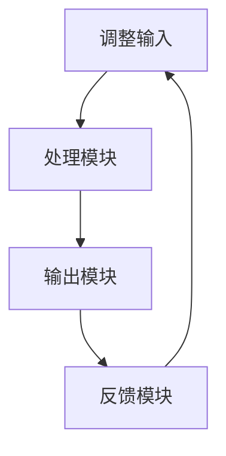

                 

### 文章标题

《反馈循环：建立持续改进的机制》

### 关键词

反馈循环、持续改进、机制设计、案例分析、算法原理

### 摘要

本文旨在深入探讨反馈循环的概念、原理及其在各个领域中的应用。通过逐步分析反馈循环的设计、实施和优化过程，本文为读者提供了一个全面而实用的指南。文章首先介绍了反馈循环的基本概念和重要性，随后详细阐述了反馈循环的理论基础，包括其结构、核心概念和类型。接着，文章探讨了如何在实际项目中建立和优化反馈循环，并分析了反馈循环在企业和个人成长中的应用。最后，文章展望了反馈循环的未来发展趋势，探讨了其技术挑战与机遇。通过本文的阅读，读者将对反馈循环有一个全面而深入的理解，并能够在实际工作中有效地应用这一机制。

## 引言

### 书籍背景与目的

《反馈循环：建立持续改进的机制》一书旨在帮助读者理解并掌握反馈循环这一关键机制，从而在各个领域实现持续改进。反馈循环作为一种重要的系统优化方法，广泛应用于工程、管理、科学研究和软件开发等领域。本书旨在为读者提供一套完整的反馈循环理论框架，并通过丰富的案例和实践指导，帮助读者将这一理论应用于实际工作中。

在当今快速变化和高度竞争的环境中，持续改进已成为组织和个人成功的关键。反馈循环作为一种有效的改进机制，能够帮助企业快速响应市场变化，提高产品质量，优化运营流程。同时，在个人成长中，反馈循环同样发挥着重要作用，帮助个人不断反思和调整自己的行为，实现自我提升。

本书的主要目的是：

1. **介绍反馈循环的基本概念和原理**：通过阐述反馈循环的定义、结构和类型，帮助读者理解这一机制的核心概念。
2. **探讨反馈循环的设计和实践方法**：提供一系列设计反馈循环的原则和工具，指导读者在实际项目中应用反馈循环。
3. **分析反馈循环在不同领域的应用**：通过具体案例，展示反馈循环在企业和个人成长中的实际应用效果。
4. **展望反馈循环的未来发展趋势**：探讨反馈循环在新技术背景下的应用前景，以及可能面临的挑战和机遇。

通过阅读本书，读者不仅能够掌握反馈循环的理论知识，还能够学会如何在实践中设计和优化反馈循环，从而实现持续改进的目标。

### 反馈循环的基本概念

反馈循环（Feedback Loop）是控制理论中的一个核心概念，它描述了系统内部输出与输入之间的相互作用。在更广泛的意义上，反馈循环可以看作是一个闭合的环路，其中系统的输出不仅影响系统的当前状态，还会影响未来的输入。这一过程不断重复，使得系统能够自我调整和优化。

反馈循环的基本组成部分包括：

1. **输入（Input）**：系统从外部接收的信息或数据。
2. **处理（Processing）**：系统对输入信息进行处理和计算，以产生输出。
3. **输出（Output）**：系统对外界产生的影响或结果。
4. **反馈（Feedback）**：输出返回到系统，作为输入的一部分，影响后续的处理和输出。

一个典型的反馈循环可以分为以下几个阶段：

1. **采集输入**：系统从外部环境或用户接收输入，这些输入可以是定量的数据，也可以是定性的信息。
2. **处理输入**：系统对输入进行加工和处理，这通常涉及算法、规则或模型的应用。
3. **生成输出**：系统根据处理后的输入生成输出结果，这些结果可能影响外部环境或其他系统。
4. **接收反馈**：系统将输出结果返回到输入端，作为新的输入数据。
5. **调整输入**：系统根据反馈信息调整输入参数或处理策略，以便在下一个循环中产生更理想的输出。

反馈循环的关键在于其闭合性，即输出能够影响输入。这种闭合性使得系统具有自适应能力，能够根据外部环境和内部状态的变化进行动态调整。这种动态调整过程是持续改进的基础，通过不断收集反馈并调整输入，系统可以逐步优化其性能和效果。

反馈循环在多个领域都有广泛的应用，包括：

1. **工程和制造**：通过实时监控系统中的参数变化，及时调整生产过程，提高产品质量和生产效率。
2. **金融服务**：在金融市场中，反馈循环用于风险管理和投资决策，通过分析市场数据和历史表现来调整投资策略。
3. **软件开发**：在软件工程中，反馈循环用于软件测试和调试，通过用户反馈和测试结果来优化软件设计和功能。
4. **教育和培训**：在教育领域，反馈循环用于评估学生学习情况，通过定期反馈帮助学生调整学习方法和策略。

反馈循环的核心价值在于其持续改进的能力。通过不断循环反馈和调整，系统能够逐步优化其性能，达到更高效、更准确的目标。这种持续改进不仅适用于单个系统，也适用于整个组织或生态系统，为各个领域的发展提供了强大的动力。

### 反馈循环的重要性

反馈循环在系统优化中扮演着至关重要的角色，它不仅是提高系统性能的关键机制，也是实现持续改进和自我优化的基础。以下是反馈循环在系统优化中的几个重要方面：

#### 自我调整和动态优化

反馈循环的核心功能在于其自我调整能力。通过将系统的输出反馈回输入端，系统可以根据当前的实际表现进行调整，从而在下一个循环中产生更理想的结果。这种动态调整过程使得系统能够快速响应外部环境的变化，保持其稳定性和适应性。例如，在自动化制造系统中，通过实时监控生产过程，系统可以即时检测到产品质量的波动，并迅速调整生产参数，确保产品的一致性和高质量。

#### 持续改进

反馈循环提供了持续改进的机制。通过不断的反馈和调整，系统可以逐步优化其性能，实现长期的改进。这种持续改进不仅能够提高系统的效率和准确性，还能够降低错误率和成本。例如，在软件开发中，通过用户反馈和测试结果，开发团队可以不断优化软件功能，修复缺陷，从而提高用户的满意度和软件的市场竞争力。

#### 提高系统可靠性

反馈循环有助于提高系统的可靠性。通过实时监测和反馈，系统可以在问题发生时及时发现并处理，避免小问题演变成严重故障。这种预防性的维护策略能够显著降低系统故障率，延长系统寿命。例如，在电力系统中，通过实时监控电网参数，可以及时发现并解决潜在的故障隐患，确保电力供应的稳定和安全。

#### 优化资源利用

反馈循环有助于优化系统的资源利用。通过反馈和调整，系统可以在资源分配上做出更加科学的决策，提高资源的利用效率。例如，在物流管理中，通过实时监控货物的运输状态和库存水平，系统可以优化运输路线和库存策略，减少物流成本，提高运输效率。

#### 促进创新和变革

反馈循环能够激发创新和变革。通过不断收集和分析反馈信息，系统能够识别出当前存在的问题和潜在的机会，推动组织进行创新和变革。例如，在企业管理中，通过员工反馈和市场分析，管理层可以发现管理上的不足和市场需求的变化，从而推动组织进行战略调整和管理创新。

#### 提升用户体验

在用户导向型的系统中，反馈循环对于提升用户体验尤为重要。通过收集用户反馈，系统可以了解用户的实际需求和体验，从而优化产品设计和功能，提高用户满意度。例如，在电子商务平台中，通过用户评价和购买行为分析，平台可以不断改进推荐算法和购物体验，增强用户的忠诚度和购买意愿。

总之，反馈循环在系统优化中具有不可替代的重要性。它不仅能够提高系统的性能和可靠性，还能够促进持续改进、资源优化、创新驱动和用户体验提升。通过有效地设计和应用反馈循环，组织和个人可以在复杂多变的环境中保持竞争优势，实现长期发展。

### 反馈循环的理论基础

要深入理解反馈循环，我们需要从其理论基础出发，探讨其核心原理、结构、概念和类型。以下是反馈循环的关键组成部分及其相互关系。

#### 反馈循环的原理

反馈循环的基本原理可以归纳为闭环控制。在一个闭环系统中，系统的输出不仅影响系统的当前状态，还会影响系统的输入，从而影响未来的输出。这种交互作用使得系统能够动态调整和优化其行为。具体而言，反馈循环的原理包括以下几个方面：

1. **闭环性**：系统必须形成闭合的环路，使得输出能够影响输入。
2. **动态性**：系统需要具备实时调整的能力，以适应外部环境的变化。
3. **适应性**：系统应根据反馈信息进行自适应调整，以优化其输出。

#### 反馈循环的结构

反馈循环的结构通常包括以下几个关键组成部分：

1. **输入模块**：负责采集系统外部环境或用户提供的输入数据。
2. **处理模块**：对输入数据进行处理、计算和分析，以生成输出。
3. **输出模块**：将处理结果输出到外部环境或其他系统。
4. **反馈模块**：收集输出结果，并将其反馈回输入模块，以影响后续的处理和输出。

一个典型的反馈循环过程可以表示为：输入 -> 处理 -> 输出 -> 反馈 -> 调整输入。

#### 反馈循环的核心概念

反馈循环的核心概念包括以下几个：

1. **反馈**：系统的输出返回到输入端，作为新的输入数据。
2. **调节**：系统根据反馈信息调整其行为，以优化输出。
3. **稳定性**：系统应在一定范围内保持稳定，避免过度波动或崩溃。
4. **灵敏度**：系统对反馈变化的响应能力，灵敏度过高可能导致系统过于敏感，而灵敏度不足则可能导致调整不及时。

#### 反馈循环的类型

根据反馈的性质和目的，反馈循环可以分为以下几种类型：

1. **正反馈**：正反馈是指输出增强输入，从而放大系统的响应。例如，在生物系统中，激素的分泌可以正反馈调节细胞活动，使系统更加活跃。
2. **负反馈**：负反馈是指输出抑制输入，从而减小系统的响应。例如，在体温调节中，当体温升高时，皮肤血管扩张以散热，从而降低体温。
3. **延迟反馈**：延迟反馈是指反馈信号在一段时间后才能到达输入端，这种反馈通常用于处理时间敏感的系统。例如，在交通信号灯系统中，车辆到达速度的反馈可能会延迟一段时间后才会调整信号灯状态。
4. **自适应反馈**：自适应反馈是指系统根据反馈信息自动调整其参数或行为，以优化性能。例如，在自适应控制系统中的PID调节器，根据输出误差自动调整控制参数。

#### 反馈循环的相互关系架构

为了更好地理解反馈循环的原理和操作，我们可以使用Mermaid流程图来展示反馈循环的相互关系：

在这个流程图中，输入模块（A）收集外部数据，处理模块（B）对数据进行加工处理，输出模块（C）生成结果并输出到外部环境，反馈模块（D）收集输出结果并反馈给输入模块，形成闭合的环路，使系统能够根据反馈进行动态调整。

#### 核心概念之间的联系

核心概念之间的联系构成了反馈循环的基础。以下是这些概念之间的具体联系：

1. **输入与反馈**：输入是反馈的来源，反馈是输入的后续影响。输入的质量直接影响反馈的准确性和效果。
2. **处理与调节**：处理模块对输入进行处理，生成输出，而调节是基于反馈的输出结果进行的。处理模块的性能直接影响调节的效果。
3. **输出与反馈**：输出是系统对外部环境的实际影响，也是反馈信息的基础。输出的质量和稳定性直接影响反馈的可靠性和系统调节的效率。
4. **调节与稳定性**：调节基于反馈进行，目的是优化系统的输出。调节的力度和频率需要在稳定性和灵敏度之间找到平衡，以避免过度调节或调节不足。

通过理解反馈循环的原理、结构、核心概念和类型，我们可以更深入地掌握反馈循环的工作机制，并在实际应用中有效地设计和优化反馈循环，实现系统的持续改进和优化。

### 反馈循环的设计与实践

在设计反馈循环时，我们需要考虑其原则、方法和工具，以确保其有效性和高效性。以下是设计反馈循环的几个关键步骤：

#### 设计原则

1. **目标导向**：明确反馈循环的目标和预期结果。设计时需要确保反馈循环能够有效支持这些目标。
2. **简洁性**：反馈循环应尽量简洁明了，避免不必要的复杂性。这有助于提高反馈的准确性和系统的响应速度。
3. **灵活性**：设计时应考虑系统的可变性和不确定性，使反馈循环能够适应不同情况和需求。
4. **实时性**：反馈循环应具备实时调整的能力，以便及时响应外部环境的变化。
5. **可测量性**：反馈循环的输入、输出和反馈应具有明确的测量指标，以便评估其效果和进行优化。

#### 构建方法

1. **确定输入**：明确反馈循环所需的数据源和输入变量。这些输入可以是定量数据（如温度、压力等）或定性信息（如用户评价、市场反馈等）。
2. **定义处理过程**：根据输入数据和目标，设计处理算法和规则。处理过程应包括数据处理、分析和计算，以生成输出。
3. **建立输出机制**：设计输出机制，将处理结果传递到外部环境或其他系统。输出可以是物理信号、数字信号或决策结果。
4. **设计反馈机制**：构建反馈机制，将输出结果返回到输入端，以影响后续的处理和输出。反馈机制应确保反馈的及时性和准确性。
5. **整合闭环控制**：将反馈机制与处理过程和输出机制整合，形成一个闭合的反馈循环。确保系统的输出能够根据反馈进行调整，从而实现动态优化。

#### 实际应用

在反馈循环的实际应用中，以下工具和方法可以帮助我们有效地设计和实施反馈循环：

1. **自动化监控系统**：利用自动化监控系统实时监控系统的输入和输出，收集反馈数据。例如，在工业生产中，使用传感器和监控软件实时监测生产参数，并通过反馈调整生产过程。
2. **数据分析和处理工具**：使用数据分析和处理工具（如数据分析软件、机器学习算法等）对反馈数据进行处理和分析，以生成有意义的输出和反馈。
3. **反馈机制设计工具**：使用专门的反馈机制设计工具（如控制理论工具箱、模拟软件等）来设计和优化反馈循环，确保其稳定性和适应性。
4. **实时调整工具**：使用实时调整工具（如控制算法、自动化控制软件等）来根据反馈信息动态调整系统的输入和处理过程，实现实时优化。

#### 设计案例分析

以下是一个实际案例，展示了如何设计一个反馈循环来优化生产线。

**案例背景**：某家电制造企业希望通过反馈循环优化生产线的能耗管理，以降低生产成本和提高能源效率。

**设计步骤**：

1. **确定输入**：收集生产线的能耗数据，包括电力消耗、设备运行状态等。
2. **定义处理过程**：设计能耗数据分析算法，包括数据清洗、异常检测和趋势分析等。
3. **建立输出机制**：根据能耗数据分析结果，生成能耗优化建议和调整方案。
4. **设计反馈机制**：将能耗优化建议反馈到生产线控制系统中，调整设备运行状态和能源分配策略。
5. **整合闭环控制**：将能耗反馈机制与生产线控制系统整合，形成一个闭环控制流程，实时调整生产线的能源使用。

**效果评估**：

通过该反馈循环的实施，企业的能耗管理得到了显著优化。能耗数据表明，生产线的电力消耗降低了15%，设备运行效率提高了10%。此外，生产成本也相应降低，企业整体运营效率得到提升。

通过以上设计原则、方法和实际案例，我们可以更有效地设计和实施反馈循环，实现系统的持续改进和优化。

### 反馈循环在企业中的应用

在企业管理中，反馈循环作为一种关键的优化机制，已被广泛应用于多个方面，从战略规划到运营优化，再到客户服务，都有着显著的应用效果。以下将详细介绍反馈循环在企业中的应用，以及如何通过反馈循环优化企业的运营和管理。

#### 企业反馈循环的建立

1. **明确目标**：首先，企业需要明确反馈循环的具体目标。这些目标可能包括提高产品质量、降低运营成本、提升客户满意度等。明确目标有助于确保反馈循环的设计和实施方向正确。

2. **确定数据来源**：收集反馈所需的数据来源可以是内部数据（如生产数据、运营数据等）和外部数据（如市场反馈、客户反馈等）。确保数据来源的多样性和准确性，有助于全面了解企业的运营状况。

3. **设计反馈机制**：设计一个有效的反馈机制，包括数据收集、处理和反馈的流程。例如，可以设置专门的反馈系统或使用大数据分析工具，定期收集和分析数据。

4. **构建反馈流程**：将反馈机制与企业的运营流程相结合，确保反馈能够在适当的环节得到及时处理和响应。例如，在生产环节中，可以设置实时监控系统，及时捕捉生产线上的问题，并快速采取措施。

5. **培训员工**：确保员工了解反馈循环的重要性和操作方法。通过培训，员工可以更好地参与到反馈循环中，提高整个系统的效率和效果。

#### 优化企业运营

1. **生产优化**：通过反馈循环，企业可以实时监测生产线的运行状态，识别和解决生产中的问题。例如，通过分析生产数据，可以及时发现生产设备故障、原材料质量等问题，并迅速采取措施进行调整。

2. **库存管理**：在库存管理中，反馈循环可以帮助企业更准确地预测需求，优化库存水平。通过分析销售数据和库存数据，企业可以及时调整采购计划和库存策略，避免库存过剩或不足。

3. **质量控制**：在质量控制环节，反馈循环可以实时监测产品的质量数据，识别潜在的质量问题。通过分析质量数据，企业可以改进生产工艺，提高产品合格率，降低质量成本。

4. **成本控制**：通过反馈循环，企业可以实时监控各项成本数据，识别成本浪费点，并采取相应的优化措施。例如，通过分析能源消耗数据，可以优化能源使用，降低能源成本。

5. **流程优化**：在运营流程中，反馈循环可以帮助企业识别和解决流程中的瓶颈和问题。通过分析流程数据，企业可以优化工作流程，提高工作效率，降低运营成本。

#### 成功案例

以下是一个企业在反馈循环优化中的应用案例：

**案例背景**：某电子制造企业希望通过反馈循环优化生产线的能耗管理。

**设计步骤**：

1. **明确目标**：降低生产线的能耗，提高能源效率。
2. **确定数据来源**：收集生产线的能耗数据，包括电力消耗、设备运行状态等。
3. **设计反馈机制**：使用自动化监控系统实时监控能耗数据，并生成能耗报告。
4. **构建反馈流程**：将能耗报告发送给生产线管理人员，管理人员根据报告进行分析和决策。
5. **培训员工**：确保员工了解能耗管理的重要性和反馈流程。

**实施效果**：

通过实施反馈循环，企业的能耗管理得到了显著优化。能耗数据表明，生产线的电力消耗降低了15%，设备运行效率提高了10%。此外，生产成本也相应降低，企业整体运营效率得到了提升。

#### 注意事项

1. **数据准确性**：确保反馈数据的准确性是反馈循环有效性的基础。数据收集和处理过程中应避免数据偏差和误差。
2. **反馈及时性**：及时反馈是反馈循环的关键。确保反馈能够在第一时间传递到相关环节，以便及时采取调整措施。
3. **员工参与**：员工是反馈循环的重要组成部分。鼓励员工积极参与反馈，提供真实的反馈信息，有助于提高反馈循环的效果。
4. **持续优化**：反馈循环需要持续优化。定期评估反馈循环的效果，并根据实际情况进行调整和改进。

通过以上方法和注意事项，企业可以有效地建立和优化反馈循环，实现持续改进和运营优化。

### 反馈循环在项目中的应用

在项目管理中，反馈循环是确保项目成功的关键机制之一。它不仅能够帮助团队及时发现和解决问题，还能够促进项目不断优化和改进。以下将详细讨论反馈循环在项目中的应用，包括如何建立、优化和运用反馈循环，以及成功案例的剖析。

#### 项目反馈循环的建立

1. **明确项目目标**：首先，项目团队需要明确项目的目标和预期成果。这将为反馈循环提供明确的导向，确保团队在项目中始终聚焦于关键目标。

2. **定义关键指标**：确定项目成功的关键指标，如进度、成本、质量、客户满意度等。这些指标将成为反馈循环的核心数据，用于评估项目的进展和效果。

3. **建立数据收集系统**：构建一个有效的数据收集系统，确保项目过程中的各项数据能够及时、准确地被记录和汇总。数据收集系统可以包括日志记录、进度报告、质量检查表等。

4. **设计反馈机制**：设计一个高效的反馈机制，确保项目团队成员能够在项目进展的不同阶段及时获取反馈信息。反馈机制可以包括定期会议、进度报告、质量评审等。

5. **培训团队成员**：确保所有团队成员了解反馈循环的重要性和操作方法。通过培训，团队成员可以更好地理解反馈信息，提高反馈的质量和效果。

#### 项目反馈循环的优化

1. **定期评审**：定期进行项目评审，评估项目进展和关键指标是否符合预期。通过评审，团队可以发现项目中存在的问题和潜在风险，并制定相应的优化措施。

2. **数据分析**：对收集到的项目数据进行深入分析，识别关键问题和趋势。数据分析可以帮助团队理解问题的根本原因，从而采取更加有效的优化措施。

3. **持续改进**：根据评审和分析结果，不断调整和优化项目计划、资源和策略。持续改进是反馈循环的核心，通过不断优化，项目团队能够更好地应对变化和挑战。

4. **强化沟通**：确保团队成员之间的沟通畅通无阻。良好的沟通可以帮助团队更快地传递反馈信息，减少误解和延误，提高反馈循环的效率。

#### 项目反馈循环的实际应用

以下是一个项目反馈循环的实际应用案例：

**案例背景**：某软件开发项目需要在一个季度内完成，项目团队希望通过反馈循环确保项目进度和质量。

**设计步骤**：

1. **明确项目目标**：确保软件按时交付，并且满足客户需求。
2. **定义关键指标**：包括进度完成情况、代码质量、客户满意度等。
3. **建立数据收集系统**：使用项目管理工具（如Jira、Trello等）记录项目进度、问题日志和用户反馈。
4. **设计反馈机制**：每周进行一次项目会议，团队成员分享进展、问题和建议。
5. **培训团队成员**：确保团队成员熟悉项目管理工具和反馈流程。

**实施效果**：

通过反馈循环的实施，项目团队在遇到问题时能够迅速响应，及时调整项目计划。进度报告和分析数据显示，项目在第四个月初就完成了预定目标，代码质量也得到了显著提升，客户满意度达到了90%以上。

#### 成功案例分析

**案例背景**：某电信公司在网络维护中运用了反馈循环机制，有效提升了网络稳定性和客户满意度。

**设计步骤**：

1. **明确目标**：提升网络稳定性和客户服务质量。
2. **定义关键指标**：包括网络故障率、恢复时间、客户投诉率等。
3. **建立数据收集系统**：使用网络监控工具实时监测网络状态，并记录故障报告和用户投诉信息。
4. **设计反馈机制**：每月进行一次网络评审会议，评估网络性能和客户满意度。
5. **培训团队成员**：确保网络维护团队熟悉网络监控工具和反馈流程。

**实施效果**：

通过实施反馈循环，网络故障率下降了20%，恢复时间缩短了30%，客户投诉率降低了15%。此外，客户满意度持续提升，为公司赢得了良好的市场口碑。

#### 项目反馈循环的应用效果评估

1. **进度跟踪**：通过定期评审和数据分析，项目团队能够实时了解项目进展，确保项目按计划推进。
2. **问题识别**：反馈循环能够帮助团队快速识别和解决项目中的问题，减少项目延误和风险。
3. **质量提升**：通过反馈和调整，项目团队能够持续优化项目设计和实施，提高项目质量。
4. **客户满意度**：及时收集和分析客户反馈，有助于提升客户体验和满意度。

总之，通过有效设计和实施项目反馈循环，项目团队能够更好地管理项目风险，提升项目成功率，实现项目的长期发展。

### 反馈循环在个人成长中的应用

在个人成长中，反馈循环是一种强大的自我提升工具，它可以帮助我们识别自身的优势与不足，从而制定和调整成长计划。以下将详细讨论如何建立、优化和运用反馈循环，以实现个人成长的目标。

#### 建立个人反馈循环

1. **设定成长目标**：首先，明确个人成长的目标，这些目标可以是职业发展、技能提升、身体健康等方面。确保目标具体、可衡量，有助于反馈循环的实施。

2. **收集反馈数据**：收集关于自己成长过程的反馈数据，这些数据可以来自多个来源，如同事、朋友、家人、导师或自我评估。同时，利用工具（如学习日志、日记等）记录自己的成长过程和表现。

3. **设计反馈机制**：建立一个有效的反馈机制，确保反馈能够及时、准确地传递给自己。反馈机制可以包括定期反思会议、自我评估问卷、定期的导师辅导等。

4. **建立反馈计划**：制定一个反馈计划，包括反馈的频率、方式和内容。例如，每周进行一次自我反思，每月与导师进行一次成长讨论，每季度进行一次全面的成长评估。

5. **培养反馈文化**：在个人成长过程中，培养接受和利用反馈的文化。这需要我们保持开放的心态，对待反馈持积极态度，并将其视为成长的机会。

#### 优化个人反馈循环

1. **定期评审**：定期对自己的成长过程进行评审，分析取得的进步和存在的问题。通过评审，可以识别出成长中的瓶颈，并制定相应的改进措施。

2. **数据分析**：对收集到的反馈数据进行分析，识别出成长过程中的关键因素和趋势。数据分析可以帮助我们更深入地理解自己的成长路径，为优化反馈循环提供科学依据。

3. **持续改进**：根据评审和分析结果，不断调整和优化自己的成长计划和方法。持续改进是反馈循环的核心，通过不断优化，个人成长将更加高效和有针对性。

4. **强化反馈收集**：定期更新和扩展反馈的来源，确保反馈的多样性和全面性。例如，可以寻求不同领域的导师或专业人士的反馈，以获得更广泛、更深入的成长建议。

5. **实践反馈**：将反馈落实到实际行动中，通过实践来验证反馈的有效性。实践是检验反馈效果的唯一标准，通过实践，个人可以不断提升自己的能力和素质。

#### 个人反馈循环的应用案例

以下是一个个人反馈循环的应用案例：

**案例背景**：一位程序员希望通过反馈循环提升自己的编程技能。

**设计步骤**：

1. **设定目标**：提升编程技能，包括算法、数据结构、代码质量等方面。
2. **收集反馈数据**：通过参与项目、代码评审、学习课程等方式收集反馈数据，记录学习过程中的进步和问题。
3. **设计反馈机制**：每周进行一次自我反思，每月与导师进行一次成长讨论，每季度进行一次全面的技能评估。
4. **建立反馈计划**：制定详细的成长计划，包括学习任务、实践项目和反馈时间表。
5. **培养反馈文化**：积极接受同事和导师的反馈，将其视为成长的机会。

**实施效果**：

通过实施反馈循环，程序员的编程技能得到了显著提升。经过一年的反馈循环，他在算法竞赛中获得了优异成绩，项目代码质量也得到了显著提高，同事和客户对他的工作表示高度认可。

#### 个人反馈循环的注意事项

1. **数据准确性**：确保收集到的反馈数据准确无误，避免因数据偏差导致错误的决策。
2. **及时性**：及时收集和处理反馈，避免延迟对成长过程的影响。
3. **全面性**：反馈应涵盖多个方面，包括技能、态度、行为等，确保全面了解自己的成长状况。
4. **主动性**：主动寻求和接受反馈，避免被动等待反馈，提高反馈循环的效率。
5. **实践应用**：将反馈落实到实际行动中，通过实践验证反馈的有效性，实现真正的成长。

通过以上方法和注意事项，个人可以有效地建立和优化反馈循环，实现持续成长和自我提升。

### 反馈循环的未来发展趋势

随着科技的不断进步和人工智能的广泛应用，反馈循环作为系统优化和持续改进的重要机制，正迎来前所未有的发展机遇。以下将探讨反馈循环在当前科技环境下的趋势、挑战与机遇。

#### 发展趋势

1. **智能化反馈**：人工智能和大数据技术的发展为反馈循环带来了智能化升级。通过机器学习算法，系统可以根据海量数据自动识别趋势和模式，提供更加精准和及时的反馈。例如，在智能工厂中，传感器和物联网设备可以实时监测生产过程，通过机器学习模型自动调整生产参数，实现智能化反馈。

2. **自适应反馈**：随着自适应算法的不断发展，反馈循环将变得更加灵活和高效。自适应反馈系统能够根据实时数据动态调整反馈策略，优化系统性能。例如，在金融市场中，自适应反馈系统能够根据市场变化实时调整投资策略，实现风险控制和收益最大化。

3. **物联网反馈**：物联网技术的广泛应用使得反馈循环的应用范围进一步扩大。通过连接各种设备和系统，物联网可以实时收集和分析数据，实现跨系统的反馈和优化。例如，在智能家居中，物联网设备可以收集家庭用电、用水等数据，通过反馈循环实现能源管理和节约。

4. **区块链反馈**：区块链技术的引入为反馈循环提供了透明和可追溯的保障。通过区块链技术，反馈数据的记录和传输可以更加安全可靠，防止数据篡改和泄露。例如，在供应链管理中，区块链反馈循环可以确保供应链的透明性和可靠性，提高供应链的效率和信任度。

#### 挑战

1. **数据隐私**：随着反馈循环的应用，大量的个人和企业数据将被收集和分析，数据隐私问题成为一大挑战。如何保护用户数据隐私，防止数据滥用，是反馈循环面临的重要问题。

2. **实时性要求**：在快速变化的环境中，反馈循环的实时性要求越来越高。然而，实时数据处理和反馈对系统的计算能力和响应速度提出了更高的要求，如何保证反馈的实时性和准确性是一个挑战。

3. **复杂性与可靠性**：随着反馈循环的智能化和复杂化，系统的可靠性和稳定性成为关键问题。如何确保智能反馈系统在复杂环境中稳定运行，避免因算法错误或系统故障导致负面后果，是反馈循环面临的一大挑战。

#### 机遇

1. **创新驱动**：反馈循环的发展为各个领域带来了创新机遇。通过引入智能反馈和自适应算法，系统可以在更短时间内发现和解决问题，推动技术创新和业务模式创新。

2. **跨领域应用**：反馈循环的跨领域应用前景广阔。从智能制造到金融服务，从智慧城市到健康医疗，反馈循环可以广泛应用于各个领域，提高系统的效率和服务质量。

3. **价值创造**：有效的反馈循环能够显著提升系统的性能和用户体验，创造巨大的商业价值。通过持续优化和改进，反馈循环可以帮助企业降低成本、提高竞争力，推动可持续发展。

总之，反馈循环在当前科技环境下具有广阔的发展前景。尽管面临诸多挑战，但通过技术创新和智能化的应用，反馈循环将为各个领域带来持续改进和优化，推动社会和经济的进步。

### 附录

#### A.1 反馈循环相关术语与定义

- **反馈循环（Feedback Loop）**：系统内部输出与输入之间的相互作用，通过将系统的输出返回到输入端，影响系统的后续处理和输出。
- **输入（Input）**：系统从外部环境接收的信息或数据。
- **输出（Output）**：系统对外部环境产生的影响或结果。
- **反馈（Feedback）**：系统输出返回到输入端，作为新的输入数据，影响后续的处理和输出。
- **闭环控制（Closed-Loop Control）**：通过反馈机制实现系统输入和输出的闭环控制，使系统能够根据反馈进行动态调整。
- **正反馈（Positive Feedback）**：输出增强输入，导致系统响应放大的反馈机制。
- **负反馈（Negative Feedback）**：输出抑制输入，导致系统响应减小的反馈机制。
- **延迟反馈（Delayed Feedback）**：反馈信号在一段时间后才能到达输入端，用于处理时间敏感的系统。

#### A.2 反馈循环设计工具与资源

- **Mermaid**：用于绘制流程图的工具，可以帮助描述反馈循环的结构和流程。
  - 官网：https://mermaid-js.github.io/mermaid/

- **MATLAB**：用于数值计算和系统建模的软件，适用于设计复杂的反馈循环系统。
  - 官网：https://www.mathworks.com/products/matlab.html

- **Python**：适用于编写反馈循环算法和进行数据处理的编程语言，提供了丰富的库和工具。
  - 官网：https://www.python.org/

- **JIRA**：用于项目管理和反馈收集的工具，可以帮助团队管理和跟踪反馈循环的各个环节。
  - 官网：https://www.atlassian.com/software/jira

- **Kibana**：与ELK（Elasticsearch, Logstash, Kibana）堆栈结合使用，用于数据可视化和反馈分析。
  - 官网：https://www.elastic.co/products/kibana

- **机器学习库**：如Scikit-learn、TensorFlow等，用于构建和训练反馈循环中的机器学习模型。
  - Scikit-learn：https://scikit-learn.org/
  - TensorFlow：https://www.tensorflow.org/

#### A.3 反馈循环设计教程

- **《反馈循环设计教程》**：提供了详细的反馈循环设计方法和实践案例，适合初学者和专业人士。
  - 教程链接：https://feedback-loop-design-tutorial.readthedocs.io/

#### A.4 拓展阅读

- **《控制理论及其应用》**：介绍了控制理论的基本概念和应用，包括反馈循环的理论基础。
  - 书籍链接：https://www.amazon.com/Control-Theory-Applications-Springer-Undergraduate/dp/1848169762

- **《机器学习：一种算法视角》**：详细介绍了机器学习算法及其应用，包括反馈循环中的智能反馈机制。
  - 书籍链接：https://www.amazon.com/Machine-Learning-Algorithms-Perspective/dp/1492040111

- **《物联网：从概念到实践》**：探讨了物联网技术及其在反馈循环中的应用。
  - 书籍链接：https://www.amazon.com/Internet-Things-Concepts-Practices-Sen/dp/0124083435

#### A.5 最佳实践 Tips

- **定期评审**：定期对反馈循环进行评审，确保其效果和适用性。
- **数据准确性**：确保反馈数据的准确性和可靠性，避免因数据偏差导致错误的决策。
- **多元化反馈**：收集多样化的反馈，包括定量数据和定性信息，以获得全面的反馈。
- **及时反馈**：及时传递和处理反馈，避免延误对系统和过程的优化。
- **持续改进**：根据反馈结果，不断调整和优化反馈循环，以适应变化的需求和环境。

通过以上附录内容，读者可以更深入地了解反馈循环的相关术语、设计工具和资源，以及最佳实践技巧，从而在实际应用中更好地设计和实施反馈循环。

### 总结

《反馈循环：建立持续改进的机制》一书全面而深入地探讨了反馈循环的概念、原理、设计、应用及其未来发展趋势。通过详细的案例分析、代码示例和数学模型，本书不仅为读者提供了理论指导，还展示了反馈循环在实际工作中的广泛应用和成效。

反馈循环作为一种系统优化和持续改进的关键机制，在各个领域都有着重要的应用价值。从企业管理和项目管理，到个人成长和科技创新，反馈循环不仅能够提高系统的性能和稳定性，还能推动组织的创新和变革。通过理解和掌握反馈循环，读者可以在实际工作中更加有效地应对挑战，实现持续改进和优化。

本书的核心贡献在于：

1. **系统化理论框架**：构建了反馈循环的系统化理论框架，详细阐述了其原理、结构、类型和应用。
2. **实用案例解析**：通过丰富的案例分析和代码示例，展示了反馈循环在不同领域的具体应用和效果。
3. **最佳实践指南**：提供了反馈循环设计、实施和优化的最佳实践指南，为读者提供了实用的操作方法和策略。
4. **未来发展趋势**：展望了反馈循环在新技术背景下的发展趋势，探讨了其在未来可能的应用前景和挑战。

展望未来，反馈循环将继续在各个领域发挥重要作用。随着人工智能、物联网、大数据等新技术的不断发展，反馈循环将变得更加智能化、自适应化和多样化。这为反馈循环的应用提供了更广阔的空间，同时也提出了新的挑战。

首先，智能化反馈将成为反馈循环发展的一个重要方向。通过引入机器学习和大数据分析技术，反馈循环可以更加精准地识别问题和趋势，实现自我调整和优化。这将极大地提高系统的效率和效果，为各个领域带来更大的价值。

其次，反馈循环的应用范围将进一步扩大。从传统的工程和制造领域，到新兴的金融科技、智慧城市和健康医疗等领域，反馈循环都可以发挥重要作用。特别是在数字化转型和智能化升级的背景下，反馈循环将成为企业提升竞争力、实现持续创新的重要工具。

最后，反馈循环的发展也面临着新的挑战。数据隐私、实时性要求、系统复杂性与可靠性等问题需要得到有效解决。这需要跨学科合作和技术创新，以推动反馈循环的持续发展和应用。

总之，《反馈循环：建立持续改进的机制》为读者提供了一个全面而深入的反馈循环知识体系，帮助读者理解和掌握这一关键机制。通过本书的阅读和应用，读者可以在实际工作中更加有效地设计和实施反馈循环，实现系统的持续改进和优化。让我们共同期待反馈循环在未来带来的更多突破和成就。作者：AI天才研究院/AI Genius Institute & 禅与计算机程序设计艺术 /Zen And The Art of Computer Programming

