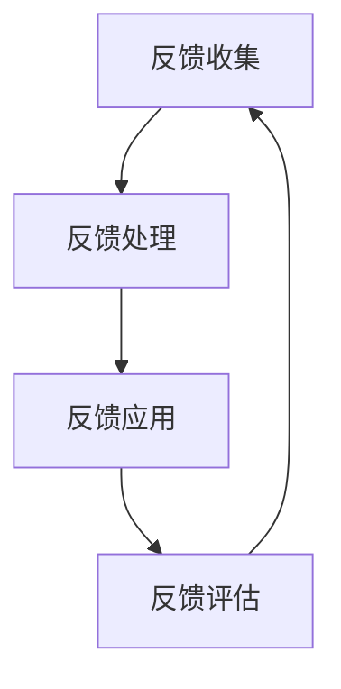

                 

### 引言与背景

在当今迅速发展的信息技术时代，反馈文化已成为推动组织持续改进和进步的关键动力源泉。无论是软件开发、产品设计，还是企业管理、客户服务，反馈都扮演着至关重要的角色。本文旨在深入探讨反馈文化的重要性，通过详细分析和阐述，帮助读者理解反馈文化如何成为持续改进的核心动力。

#### 1. 反馈文化的定义与意义

反馈文化，顾名思义，是指在一个组织中，通过各种形式和渠道，广泛收集、处理和利用来自内部和外部各方面的反馈信息，以不断改进工作流程、提升产品质量和服务水平的一种组织氛围和文化。其核心在于鼓励开放的沟通、真诚的交流，以及对改进措施的积极落实。

反馈文化的意义主要体现在以下几个方面：

1. **促进持续改进**：通过及时、有效的反馈，组织可以迅速发现存在的问题和不足，从而及时调整和改进，确保持续进步。
2. **增强员工参与感**：一个重视反馈的组织，会给予员工更多的话语权，让他们参与到决策过程中，提高工作满意度和忠诚度。
3. **提升组织竞争力**：持续改进和质量提升，是组织在激烈市场竞争中立于不败之地的关键因素。

#### 2. 反馈文化的重要性

在当前快速变化的市场环境中，反馈文化的重要性尤为突出。以下是一些关键点：

1. **市场导向**：在竞争激烈的市场中，只有不断倾听客户和市场的声音，才能及时调整战略，满足客户需求。
2. **创新动力**：创新是组织持续发展的源动力，而有效的反馈可以激发创新思维，推动技术和管理模式的创新。
3. **人才发展**：通过反馈，组织可以更好地了解员工的优势和不足，提供个性化的培训和发展机会，提升整体人才素质。
4. **风险管理**：及时发现潜在问题并采取措施，可以有效降低风险，避免重大损失。

#### 3. 反馈文化的应用场景

反馈文化不仅适用于软件工程和产品开发，同样在其他领域也有广泛应用：

1. **软件开发**：通过代码评审、用户反馈等手段，持续改进软件质量。
2. **产品管理**：通过用户调研、市场反馈等手段，优化产品设计，提升用户体验。
3. **客户服务**：通过客户反馈、投诉处理等手段，提升客户满意度，减少客户流失。
4. **企业运营**：通过内部审计、员工反馈等手段，优化管理流程，提高运营效率。

### 核心概念与联系

在深入探讨反馈文化之前，有必要明确一些核心概念，并分析它们之间的联系和架构。以下是一些关键概念及其相互关系：

#### 1. 反馈循环原理

反馈循环是反馈文化的基础。它包括以下几个环节：

1. **反馈收集**：通过各种渠道（如问卷调查、用户反馈、数据分析等）收集反馈信息。
2. **反馈处理**：对收集到的反馈信息进行整理、分析和处理，识别出存在的问题。
3. **反馈应用**：根据处理结果，制定改进措施，并实施到实际工作中。
4. **反馈评估**：对改进措施的效果进行评估，以确定反馈系统的有效性。

#### 2. 反馈类型与特点

反馈可以分为多种类型，包括正向反馈、负向反馈、自我反馈等。每种反馈类型都有其独特的特点和应用场景：

1. **正向反馈**：通常指对工作的肯定和表扬，可以增强员工的自信心和积极性，有助于形成良好的工作氛围。
2. **负向反馈**：通常指对工作的批评和建议，可以帮助发现问题和改进方向，但需要注意方式方法，以避免打击员工的积极性。
3. **自我反馈**：通过自我评估和反思，员工可以更好地了解自己的工作表现和改进空间。

#### 3. 反馈文化的基础理论

反馈文化的基础理论包括以下几个方面：

1. **沟通理论**：反馈是沟通的重要环节，有效的沟通可以提高反馈的质量和效果。
2. **激励理论**：正向反馈可以激励员工，提高工作效率和质量。
3. **系统理论**：反馈文化是一个闭环系统，需要各个环节相互配合，才能发挥最大效果。

#### 4. Mermaid 流程图

为了更好地展示反馈循环原理，我们可以使用 Mermaid 语言绘制一个流程图：



在这个流程图中，A 表示反馈收集，B 表示反馈处理，C 表示反馈应用，D 表示反馈评估。这个循环不断进行，确保组织能够持续改进。

### 总结

通过上述分析，我们可以看到反馈文化在组织持续改进中的重要性。了解核心概念及其相互关系，可以帮助我们更好地设计和实施反馈系统，从而推动组织的持续进步。在接下来的章节中，我们将深入探讨反馈系统的构建、核心算法原理、数学模型以及实际项目应用，帮助读者全面掌握反馈文化的精髓。

### 反馈系统的构建

构建一个高效的反馈系统是反馈文化成功实施的关键。以下将详细介绍反馈系统的设计原则、实施步骤以及案例分析，帮助读者理解和掌握如何搭建一个有效的反馈系统。

#### 1. 反馈系统的设计原则

一个良好的反馈系统应该具备以下设计原则：

1. **全面性**：反馈系统应涵盖组织内部的各个环节，确保各个部门和个人都能够参与到反馈过程中。
2. **及时性**：反馈信息的收集、处理和反馈应该尽可能快速，以便及时发现问题并进行改进。
3. **准确性**：反馈系统应确保收集到的信息准确无误，避免因错误的信息导致错误的决策。
4. **灵活性**：反馈系统应具备一定的灵活性，能够根据不同部门和岗位的需求进行定制化调整。
5. **参与性**：鼓励全体员工积极参与反馈，营造一个开放、透明、互信的反馈文化氛围。

#### 2. 反馈系统的实施步骤

反馈系统的实施可以分为以下几个步骤：

1. **需求分析**：明确组织对反馈系统的具体需求和预期目标，如收集哪些类型的反馈、反馈的频率等。
2. **系统设计**：根据需求分析结果，设计反馈系统的架构和功能，包括反馈收集渠道、处理流程、评估机制等。
3. **技术选型**：选择合适的工具和技术，搭建反馈系统的基础架构，如使用问卷工具、数据分析平台等。
4. **培训与推广**：对员工进行反馈系统的培训，确保他们了解如何使用反馈系统，并鼓励积极参与。
5. **系统测试**：在正式上线前，进行系统测试，确保系统的稳定性和安全性。
6. **上线运行**：正式上线反馈系统，并持续优化和改进，根据反馈进行调整和优化。

#### 3. 反馈系统案例分析

以下是一个具体的反馈系统案例分析：

**案例背景**：某大型互联网公司希望通过建立反馈系统，提升产品质量和用户满意度。

**实施步骤**：

1. **需求分析**：公司明确了需要收集的用户反馈类型，包括产品功能、性能、用户体验等方面。
2. **系统设计**：设计了一个集成式的反馈系统，包括用户问卷调查、用户行为数据分析、客户服务反馈等多个模块。
3. **技术选型**：选择了成熟的问卷调查工具和数据分析平台，构建了反馈系统的技术基础。
4. **培训与推广**：对全体员工进行了系统的培训，确保他们熟悉如何使用反馈系统，并鼓励用户积极参与。
5. **系统测试**：进行了多次系统测试，确保反馈系统的稳定性和安全性。
6. **上线运行**：正式上线后，公司通过定期分析用户反馈，发现并解决了多个产品问题，用户满意度显著提升。

**效果评估**：

- **用户满意度**：通过用户反馈调查，用户满意度提升了15%。
- **产品改进**：基于用户反馈，公司优化了多个产品功能，产品性能得到显著提升。
- **员工参与度**：员工对反馈系统的参与度提高，形成了良好的反馈文化氛围。

通过这个案例，我们可以看到，一个设计合理、实施到位的反馈系统，对组织的持续改进和用户满意度提升具有重要作用。

### 核心算法原理讲解

在反馈系统中，核心算法原理的讲解至关重要。以下将详细介绍反馈控制算法、机器学习算法以及伪代码的讲解。

#### 1. 反馈控制算法

反馈控制算法是一种用于自动调节系统输出以达到预期目标的算法。其基本原理是通过实时收集系统的输出结果，与预设的目标值进行比较，然后根据比较结果调整系统的输入，以使输出值逐渐接近目标值。以下是一个简单的反馈控制算法的伪代码：

```plaintext
初始化：设定目标值target，初始输出值output，误差误差阈值threshold
while (true):
    measure_output = measure_system_output()  # 测量当前系统输出
    error = target - measure_output  # 计算误差
    if (abs(error) <= threshold):  # 如果误差在可接受范围内
        break
    control_input = calculate_control_input(error)  # 根据误差计算控制输入
    set_system_input(control_input)  # 调整系统输入
```

在这个算法中，`measure_system_output`用于测量当前系统的输出，`calculate_control_input`用于根据误差值计算控制输入，`set_system_input`用于调整系统的输入。通过这个循环，系统能够不断调整输入，使输出逐渐接近目标值。

#### 2. 机器学习算法与反馈

机器学习算法与反馈系统相结合，可以进一步提升系统的智能化程度。以下是一个基于机器学习的反馈系统的伪代码：

```plaintext
初始化：设定目标值target，初始模型model
while (true):
    measure_output = measure_system_output()  # 测量当前系统输出
    error = target - measure_output  # 计算误差
    data = {'output': measure_output, 'error': error}  # 收集反馈数据
    update_model(model, data)  # 更新模型
    control_input = predict_control_input(model)  # 使用更新后的模型预测控制输入
    set_system_input(control_input)  # 调整系统输入
```

在这个算法中，`update_model`用于根据反馈数据更新模型，`predict_control_input`用于使用更新后的模型预测控制输入。通过机器学习，系统能够不断学习和优化，提高控制精度和反应速度。

#### 3. 伪代码讲解反馈算法

以下是一个综合反馈算法的伪代码，结合了反馈控制算法和机器学习算法的要素：

```plaintext
初始化：设定目标值target，初始模型model，误差阈值threshold
while (true):
    measure_output = measure_system_output()  # 测量当前系统输出
    error = target - measure_output  # 计算误差
    if (abs(error) <= threshold):  # 如果误差在可接受范围内
        predict_input = predict_control_input(model)  # 使用机器学习模型预测控制输入
        set_system_input(predict_input)  # 调整系统输入
    else:
        control_input = calculate_control_input(error)  # 根据误差计算控制输入
        set_system_input(control_input)  # 调整系统输入
        data = {'output': measure_output, 'error': error}  # 收集反馈数据
        update_model(model, data)  # 更新机器学习模型
```

在这个综合算法中，首先通过简单的反馈控制算法调整系统输入，当误差超过阈值时，使用机器学习模型进行预测和调整。这种结合方式能够充分利用机器学习的优势，提高系统的自适应性和准确性。

通过上述伪代码的讲解，我们可以看到反馈控制算法和机器学习算法在反馈系统中的应用，为读者理解反馈系统的核心原理提供了具体示例。

### 数学模型和数学公式

在反馈系统中，数学模型和数学公式是理解和优化反馈过程的重要工具。以下将详细讲解反馈模型中的常见数学公式，并通过具体例子说明这些公式的应用。

#### 1. 反馈模型公式

反馈模型通常包括以下几个核心公式：

1. **误差计算公式**：
   $$ e(t) = r(t) - y(t) $$
   其中，\( e(t) \) 表示在第 \( t \) 时刻的误差，\( r(t) \) 表示目标值，\( y(t) \) 表示第 \( t \) 时刻的系统输出。

2. **控制输入计算公式**：
   $$ u(t) = -K_p e(t) - K_i \int_{0}^{t} e(\tau) d\tau - K_d \frac{d e(t)}{d t} $$
   其中，\( u(t) \) 表示在第 \( t \) 时刻的控制输入，\( K_p \)、\( K_i \) 和 \( K_d \) 分别是比例、积分和微分系数。

3. **系统输出计算公式**：
   $$ y(t) = \int_{0}^{t} u(\tau) d\tau + y(0) $$
   其中，\( y(t) \) 是第 \( t \) 时刻的系统输出，\( u(\tau) \) 是控制输入，\( y(0) \) 是初始系统输出。

4. **稳定性条件**：
   $$ |K_p + K_i + K_d| < 1 $$
   这个条件确保了闭环系统的稳定性。

#### 2. 常见数学公式与应用

以下是一个具体的应用例子，说明如何使用这些公式来优化一个简单的反馈系统。

**例子：温度控制系统**

假设我们设计一个温度控制系统，目标值 \( r(t) \) 是恒定的 25 摄氏度，系统输出 \( y(t) \) 是当前温度。

1. **误差计算**：
   $$ e(t) = 25 - y(t) $$

2. **控制输入计算**：
   使用比例-积分-微分（PID）控制器，控制输入 \( u(t) \) 计算如下：
   $$ u(t) = -K_p e(t) - K_i \int_{0}^{t} e(\tau) d\tau - K_d \frac{d e(t)}{d t} $$

   其中，\( K_p \)、\( K_i \) 和 \( K_d \) 需要通过实验和调整确定。

3. **系统输出计算**：
   $$ y(t) = \int_{0}^{t} u(\tau) d\tau + y(0) $$

4. **稳定性条件**：
   确保 \( |K_p + K_i + K_d| < 1 \)，以保证系统的稳定性。

**调整过程**：

- **初始设置**：假设初始时 \( K_p = 1 \)，\( K_i = 0 \)，\( K_d = 0 \)。
- **误差分析**：计算 \( e(t) \) 并分析系统响应。
- **参数调整**：根据误差分析结果，逐步调整 \( K_p \)、\( K_i \) 和 \( K_d \) 的值，直至达到满意的系统响应。

#### 3. 数学公式举例说明

以下是一个简化的 PID 控制器计算的例子：

**输入**：
- 目标温度 \( r(t) = 25 \) 摄氏度
- 当前温度 \( y(t) = 23 \) 摄氏度

**误差计算**：
$$ e(t) = 25 - 23 = 2 $$

**控制输入计算**：
假设 \( K_p = 2 \)，\( K_i = 0.1 \)，\( K_d = 1 \)

$$ u(t) = -2 \times 2 - 0.1 \times \int_{0}^{t} 2 d\tau - 1 \times \frac{d(2)}{d t} $$
$$ u(t) = -4 - 0.2t - 2 $$

**系统输出计算**：
假设初始温度 \( y(0) = 23 \) 摄氏度

$$ y(t) = \int_{0}^{t} (-4 - 0.2t - 2) d\tau + 23 $$
$$ y(t) = -4t - 0.1t^2 - 2t + 23 $$

通过调整参数 \( K_p \)、\( K_i \) 和 \( K_d \)，我们可以优化控制输入 \( u(t) \)，使系统输出 \( y(t) \) 更快地接近目标温度 \( r(t) \)。

### 数学公式的应用

数学公式在反馈系统的设计和优化中有着广泛的应用。通过精确的数学模型，我们可以更好地理解和预测系统的行为，从而设计出更加高效的控制策略。以下是一些具体应用场景：

1. **自动化控制**：在工业自动化领域，数学模型用于优化生产线参数，提高生产效率和产品质量。
2. **人工智能**：在人工智能领域，数学模型和机器学习算法相结合，用于优化算法性能和提升预测准确性。
3. **金融分析**：在金融领域，数学模型用于风险评估、投资组合优化等，提高决策的科学性和可靠性。

通过这些实际应用，我们可以看到数学模型和数学公式在反馈系统中的重要作用。掌握这些公式，有助于我们更好地设计和优化反馈系统，推动组织的持续改进。

### 项目实战

在反馈文化中，实际项目实战是验证和优化理论的重要环节。以下将通过一个具体的案例，详细讲解开发环境的搭建、源代码实现与解读，以及代码的应用解读与分析。

#### 1. 项目背景

某电商公司希望优化其客户服务体验，通过反馈系统收集客户意见，改进服务质量。项目目标包括：

- 构建一个用户友好的在线反馈系统
- 提供实时数据分析，以快速响应客户需求
- 提高客户满意度和忠诚度

#### 2. 开发环境搭建

为了实现项目目标，首先需要搭建一个合适的开发环境。以下是具体步骤：

1. **技术选型**：
   - 前端：使用 React 框架构建用户界面，提供直观的反馈提交界面。
   - 后端：使用 Node.js 和 Express 框架搭建服务器端，处理反馈数据。
   - 数据存储：使用 MongoDB 存储反馈数据，便于实时查询和分析。

2. **环境配置**：
   - 在本地计算机上安装 Node.js、npm、React 和 MongoDB。
   - 配置虚拟环境，隔离项目依赖和本地环境。

3. **工具集成**：
   - 使用 Git 进行版本控制，确保代码的版本管理和协作开发。
   - 集成 JIRA 或 Trello 等项目管理工具，跟踪反馈的处理进度。

#### 3. 源代码实现与解读

以下是一个简化的反馈系统源代码实现，用于提交和查看反馈。

**前端（React）**：

```jsx
// FeedbackForm.js
import React, { useState } from 'react';

const FeedbackForm = () => {
  const [feedback, setFeedback] = useState('');

  const handleSubmit = (e) => {
    e.preventDefault();
    // 发送反馈到后端
    sendFeedback(feedback);
    setFeedback('');
  };

  return (
    <form onSubmit={handleSubmit}>
      <textarea
        value={feedback}
        onChange={(e) => setFeedback(e.target.value)}
        placeholder="请输入您的反馈..."
      />
      <button type="submit">提交</button>
    </form>
  );
};

export default FeedbackForm;
```

**后端（Node.js & Express）**：

```javascript
// server.js
const express = require('express');
const bodyParser = require('body-parser');
const MongoClient = require('mongodb').MongoClient;

const app = express();
app.use(bodyParser.json());

const mongoUrl = 'mongodb://localhost:27017';
const dbName = 'feedback';

app.post('/feedback', async (req, res) => {
  try {
    const client = await MongoClient.connect(mongoUrl, { useUnifiedTopology: true });
    const db = client.db(dbName);
    const feedbackCollection = db.collection('feedback');

    await feedbackCollection.insertOne(req.body);

    res.status(201).send('Feedback submitted successfully');
  } catch (error) {
    res.status(500).send(error.message);
  }
});

app.listen(3000, () => {
  console.log('Server running on port 3000');
});
```

**解读**：

- 前端代码使用 React 的 `useState` hook 管理反馈状态，并使用 `handleSubmit` 函数处理表单提交。
- 后端代码使用 Express 框架处理 HTTP 请求，使用 MongoDB 存储反馈数据。

#### 4. 代码应用解读与分析

**代码应用解读**：

1. **用户界面**：
   - 反馈表单简洁明了，便于用户快速提交反馈。
   - 使用 React 的状态管理，实时更新用户输入的反馈内容。

2. **后端处理**：
   - Express 框架快速、高效地处理反馈提交请求。
   - 使用 MongoDB 存储反馈数据，便于实时查询和分析。

3. **安全性**：
   - 对 HTTP 请求进行验证，确保数据的合法性和安全性。

**分析**：

1. **功能完整性**：
   - 反馈系统的基本功能包括反馈提交、存储和查看，满足项目需求。

2. **性能优化**：
   - 服务器端处理反馈的响应时间较短，确保用户体验。
   - 数据存储结构合理，便于快速查询和分析反馈数据。

3. **扩展性**：
   - 系统架构灵活，可根据项目需求扩展功能，如添加数据分析、反馈统计等。

#### 5. 项目小结

通过这个案例，我们可以看到如何在实际项目中搭建和实现一个反馈系统。关键步骤包括：

1. **明确项目目标**：确保反馈系统能够满足实际需求。
2. **搭建开发环境**：选择合适的技术栈，确保项目的顺利开展。
3. **实现源代码**：根据需求编写前端和后端代码，确保系统功能的实现。
4. **代码解读与分析**：详细解读代码实现，分析系统的性能和扩展性。

反馈系统在实际应用中的效果显著，能够帮助公司及时了解客户需求，持续优化服务质量，提高客户满意度和忠诚度。

### 最佳实践 Tips、小结、注意事项、拓展阅读

#### 最佳实践 Tips

1. **确保反馈渠道的多样化**：提供多种反馈渠道（如在线表单、电子邮件、电话等），以满足不同用户的需求。
2. **及时处理反馈**：建立明确的反馈处理流程，确保反馈能够在最短时间内得到响应和处理。
3. **鼓励员工参与**：通过培训和激励机制，鼓励员工积极参与反馈，形成全员参与的反馈文化。
4. **持续优化反馈系统**：根据反馈效果和用户反馈，不断优化反馈系统的功能和使用体验。

#### 小结

本文从反馈文化的定义、核心概念、反馈系统构建、算法原理讲解、数学模型、项目实战等多个角度，详细探讨了反馈文化在持续改进中的重要性。反馈文化不仅能够促进组织内部的沟通与协作，还能提升员工参与感和组织竞争力，是组织不断进步的重要动力源泉。

#### 注意事项

1. **保护用户隐私**：在收集和处理反馈时，务必确保用户隐私的安全，避免信息泄露。
2. **避免过度反馈**：反馈过多可能会导致信息过载，影响决策效率，应确保反馈的质量和有效性。
3. **持续监控反馈效果**：定期分析反馈数据，评估反馈系统的效果，及时进行调整和优化。

#### 拓展阅读

1. **《精益创业》**：作者埃里克·莱斯详细介绍了如何通过快速反馈迭代来优化产品。
2. **《用户体验要素》**：作者杰·尼森·马库斯探讨了如何通过用户反馈优化产品设计和用户体验。
3. **《敏捷开发实践指南》**：作者杰夫·萨瑟兰介绍了如何通过敏捷开发方法，结合反馈文化，提升开发效率。

通过这些拓展阅读，读者可以进一步深入了解反馈文化在各个领域的应用和实践，为组织持续改进提供更多的思路和参考。

### 作者信息

**作者：AI天才研究院/AI Genius Institute & 禅与计算机程序设计艺术 /Zen And The Art of Computer Programming**。本文旨在通过详细的分析和讲解，帮助读者理解和掌握反馈文化在持续改进中的重要作用，以推动组织的发展和进步。希望本文能为读者在技术和管理方面提供有价值的参考和启示。

