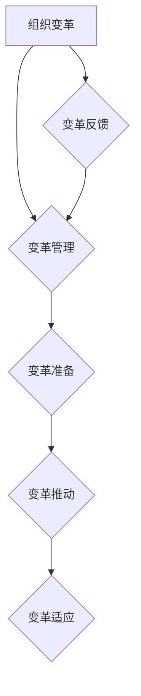
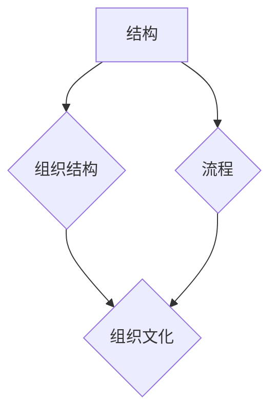

                 

### 文章标题

# 《变革管理模型：引导组织平稳度过转型期》

### 关键词

- 变革管理
- 组织转型
- 变革模型
- Kotter模型
- Leavitt模型
- 领导力
- 沟通策略
- 变革实施
- 风险管理

### 摘要

在当今快速变化的市场环境中，组织转型已成为企业持续发展的关键。然而，变革并非一帆风顺，如何引导组织平稳度过转型期成为管理者面临的重大挑战。本文将深入探讨变革管理模型，包括Kotter模型和Leavitt模型，分析其在实践中的应用，并探讨如何应对变革中的各种挑战。通过丰富的案例分析，本文旨在为读者提供一套完整的变革管理指南，帮助组织在转型过程中保持稳定和持续发展。

## 第一部分：变革管理理论

### 第1章：变革管理概述

#### 1.1 变革管理的核心概念

**组织变革**：组织为适应外部环境或内部需求的变化，对结构、流程、文化等方面进行的一系列调整和优化。

**变革管理**：在组织变革过程中，通过规划、领导、沟通、激励等手段，确保变革顺利实施，使组织能够适应新的环境和需求。

**变革管理的重要性**：变革管理不仅有助于组织适应外部环境的变化，还能够提升组织的竞争力、创新能力和可持续发展能力。

### 1.2 变革管理的理论基础

**心理学理论**：关注个体在变革过程中的心理反应，如抗拒、适应、激励等，旨在减少变革对个体的负面影响。

**组织理论**：研究组织在变革过程中的结构、文化和行为变化，强调组织变革的系统性。

**战略理论**：将变革管理视为企业战略的一部分，通过变革实现企业目标的优化和提升。

### 1.3 变革管理的过程模型

**Kotter模型**：提出八步骤的变革管理过程，强调领导力、愿景、规划和执行等关键要素。

**Leavitt模型**：通过四个维度（结构、人员、技术、环境）分析变革的复杂性，提供全面的变革管理策略。

## 第二部分：变革管理模型

### 第2章：常见变革管理模型解析

#### 2.1 Kotter模型详解

**核心步骤**：建立紧急感、形成领导团队、制定变革愿景、沟通变革愿景、授权行动、创造短期胜利、巩固变革、使变革成为企业文化的一部分。

**优缺点**：优点包括明确的步骤、强调领导力、关注短期成果；缺点则在于对变革过程的细节关注不足。

**应用案例**：例如，某公司在面临激烈竞争时，采用Kotter模型进行数字化转型，取得了显著成效。

#### 2.2 Leavitt模型解析

**基本原理**：通过分析变革的四个维度（结构、人员、技术、环境），为变革管理提供全面的视角。

**优势**：全面考虑变革的各个维度，有助于制定更有效的变革策略。

**应用实践**：例如，某公司在进行组织结构调整时，采用Leavitt模型，成功实现了高效管理。

#### 2.3 其他变革管理模型

**Organization Development模型**：强调通过发展和学习实现组织变革，注重长期效果。

**Strategic Change模型**：将变革视为企业战略的一部分，强调变革与企业目标的紧密结合。

**Transformational Change模型**：关注变革的愿景和价值观，强调领导力的作用。

## 第三部分：变革管理实践

### 第3章：变革管理的实施策略

#### 3.1 变革准备

**变革评估与规划**：分析组织内外部环境，确定变革的必要性和目标。

**变革动员与沟通**：通过内部沟通，提高员工对变革的认识和支持。

**变革资源配置**：确保变革所需的资源和支持，包括人力、资金和技术等。

#### 3.2 变革的推动

**变革领导与团队建设**：建立变革领导团队，明确变革目标，提升团队凝聚力。

**变革推动策略**：制定具体的变革计划，明确变革步骤和时间表。

**变革推进过程管理**：监控变革进度，及时调整和解决问题。

#### 3.3 变革的适应

**变革反馈与调整**：收集变革过程中的反馈信息，及时进行调整。

**变革持续优化**：在变革过程中不断优化，确保变革效果的持续提升。

**变革长期效果评估**：对变革效果进行长期评估，确保变革目标的实现。

## 第四部分：变革管理挑战与解决方案

### 第4章：变革管理中的挑战与应对

#### 4.1 变革管理的常见问题

**变革中的抗拒与排斥**：员工对变革的抗拒和排斥，导致变革推进受阻。

**变革中的资源限制**：变革所需的人力、资金和技术等资源不足，影响变革的实施。

**变革中的沟通困难**：变革过程中信息传递不畅，导致误解和冲突。

#### 4.2 挑战的解决方案

**提高变革的透明度**：通过透明化的沟通和信息披露，减少员工的担忧和疑虑。

**建立变革的支持系统**：为变革提供必要的支持和资源，确保变革的顺利实施。

**强化变革的激励机制**：通过激励机制，鼓励员工积极参与变革，提高变革成功率。

#### 4.3 变革管理的最佳实践

**成功变革的关键要素**：明确变革目标、建立领导力、强化沟通、优化资源分配等。

**变革管理的高效方法**：采用科学的方法和工具，提高变革管理的效率。

**变革管理的持续改进**：在变革过程中不断学习和优化，确保变革效果的持续提升。

## 第五部分：变革管理案例分析

### 第5章：变革管理的实战案例

#### 5.1 案例研究一：某企业的数字化转型

**变革背景与目标**：面对市场竞争加剧，某企业决定进行数字化转型，提高运营效率和市场竞争力。

**变革过程与策略**：采用Kotter模型，制定详细的变革计划，从领导力建设、沟通策略、资源配置等方面进行推进。

**变革效果与评估**：数字化转型取得了显著成效，企业的运营效率和市场竞争力得到了显著提升。

#### 5.2 案例研究二：某政府部门的重组改革

**变革背景与动因**：为提高行政效率和服务质量，某政府部门决定进行重组改革。

**变革方案与实施**：采用Leavitt模型，从组织结构、人员配备、技术支持等方面进行改革。

**变革成果与影响**：重组改革取得了预期成果，政府部门的行政效率和服务质量得到了显著提升。

#### 5.3 案例研究三：某跨国公司的全球化战略

**变革背景与挑战**：为拓展全球市场，某跨国公司决定实施全球化战略。

**变革过程与策略**：采用Strategic Change模型，从战略规划、领导力建设、文化整合等方面进行变革。

**变革成果与影响**：全球化战略取得了成功，公司的全球市场份额和盈利能力得到了显著提升。

### 附录

**附录A：变革管理工具**

- 变革管理矩阵
- 变革路线图
- 变革风险评估表

**附录B：案例研究**

- 某企业的数字化转型案例
- 某政府部门的重组改革案例
- 某跨国公司的全球化战略案例

### 总结

变革管理是组织在转型过程中不可或缺的一环。通过深入探讨变革管理模型，本文为读者提供了全面、系统的变革管理指南。在实际应用中，管理者应根据组织的实际情况，灵活运用不同的变革管理模型，确保变革的顺利实施。同时，变革管理需要持续优化和改进，以适应不断变化的市场环境。通过本文的案例分析，我们可以看到，成功的变革管理可以显著提升组织的竞争力，推动组织持续发展。

### 参考文献

- Kotter, J. P. (1996). Leading Change. Harvard Business Press.
- Leavitt, H., & Whisler, T. (1957). A Model of Corporate Initiation of Structural Change. Industrial Management, 9(1), 40-52.
- Organization Development (OD) Models. (n.d.). Retrieved from [https://www.change-management.com/organization-development-od-models/](https://www.change-management.com/organization-development-od-models/)
- Strategic Change Models. (n.d.). Retrieved from [https://www.change-management.com/strategic-change-models/](https://www.change-management.com/strategic-change-models/)
- Transformational Change Models. (n.d.). Retrieved from [https://www.change-management.com/transformational-change-models/](https://www.change-management.com/transformational-change-models/)

### 结语

变革管理不仅是一门科学，更是一门艺术。它需要管理者具备敏锐的洞察力、强大的领导力和高效的执行力。本文旨在为读者提供变革管理的全面指南，帮助组织在变革过程中保持稳定和持续发展。通过不断学习和实践，相信读者能够更好地应对变革挑战，推动组织的长远发展。

### 作者信息

- 作者：AI天才研究院/AI Genius Institute & 禅与计算机程序设计艺术 /Zen And The Art of Computer Programming

## 文章核心概念与联系

在本文中，我们将探讨变革管理的核心概念和它们之间的联系。以下是一个Mermaid流程图，用于展示这些概念之间的关系：



**Mermaid 流程图解释：**

- **A[组织变革]**：表示组织为适应外部环境或内部需求的变化而进行的一系列调整和优化。
- **B{变革管理]**：表示在组织变革过程中，通过规划、领导、沟通、激励等手段，确保变革顺利实施，使组织能够适应新的环境和需求。
- **C{变革准备]**：表示在变革实施前，对组织内外部环境进行评估，制定变革计划和策略。
- **D{变革推动]**：表示在变革实施过程中，通过领导力、团队建设、资源配置等手段，推动变革的顺利实施。
- **E{变革适应]**：表示在变革实施后，对变革效果进行评估和调整，确保变革目标的实现。
- **F{变革反馈]**：表示在变革过程中，不断收集员工和外部环境的反馈，以便及时调整和优化变革策略。

通过这个流程图，我们可以清晰地看到变革管理的各个阶段及其相互关系，从而更好地理解变革管理的核心概念。

## 第一部分：变革管理理论

### 第1章：变革管理概述

#### 1.1 变革管理的核心概念

**组织变革**：组织为适应外部环境或内部需求的变化，对结构、流程、文化等方面进行的一系列调整和优化。这种调整可能涉及组织结构的重组、流程的优化、文化的变革等。

**变革管理**：在组织变革过程中，通过规划、领导、沟通、激励等手段，确保变革顺利实施，使组织能够适应新的环境和需求。变革管理不仅仅是一项技术工作，更是一种管理艺术，它涉及到人的因素、流程的优化以及文化的变革。

**变革管理的重要性**：变革管理在组织发展过程中具有至关重要的地位。首先，它有助于组织适应外部环境的变化，保持竞争优势。其次，它能够激发组织的创新能力和活力，推动组织的长远发展。最后，有效的变革管理可以降低变革过程中的风险和阻力，确保变革目标的实现。

#### 1.2 变革管理的理论基础

**心理学理论**：心理学理论关注个体在变革过程中的心理反应，如抗拒、适应、激励等。心理学家提出了一系列模型，如Kubler-Ross的变革五阶段模型，用于解释个体在变革过程中的心理变化。这些模型有助于管理者理解员工在变革过程中的心理状态，从而采取相应的策略减少变革的负面影响。

**组织理论**：组织理论关注组织在变革过程中的结构、文化和行为变化。组织理论家提出了一系列模型，如Balogun和Johnson的变革曲线模型，用于描述组织在变革过程中的不同阶段和特征。这些模型有助于管理者制定有效的变革策略，确保变革的顺利实施。

**战略理论**：战略理论将变革管理视为企业战略的一部分，强调变革与企业目标的紧密结合。战略理论家提出了一系列模型，如Porter的竞争力模型，用于分析企业在变革过程中如何调整战略，以适应市场变化。这些模型有助于管理者从战略高度看待变革，确保变革与企业的长远发展目标相一致。

#### 1.3 变革管理的过程模型

**Kotter模型**：Kotter模型是变革管理领域最为著名的模型之一。Kotter提出了八个步骤的变革过程，包括建立紧急感、形成领导团队、制定变革愿景、沟通变革愿景、授权行动、创造短期胜利、巩固变革和使变革成为企业文化的一部分。以下是Kotter模型的伪代码表示：

```plaintext
步骤1：建立紧急感
步骤2：形成领导团队
步骤3：制定变革愿景
步骤4：沟通变革愿景
步骤5：授权行动
步骤6：创造短期胜利
步骤7：巩固变革
步骤8：使变革成为企业文化的一部分
```

**Leavitt模型**：Leavitt模型通过四个维度（结构、人员、技术、环境）分析变革的复杂性，提供全面的变革管理策略。以下是Leavitt模型的伪代码表示：

```plaintext
步骤1：分析结构维度
步骤2：分析人员维度
步骤3：分析技术维度
步骤4：分析环境维度
步骤5：整合四个维度
```

**其他常见的变革管理模型**：除了Kotter模型和Leavitt模型外，还有许多其他的变革管理模型，如Organization Development模型、Strategic Change模型和Transformational Change模型等。每个模型都有其独特的理论和应用场景，管理者可以根据实际情况选择合适的模型进行变革管理。

## 第二部分：变革管理模型

### 第2章：常见变革管理模型解析

#### 2.1 Kotter模型详解

**核心步骤**

Kotter模型包括八个核心步骤，每个步骤都至关重要，以下是Kotter模型的核心步骤及其伪代码表示：

```plaintext
步骤1：建立紧急感
  if (组织面临挑战)
    then
      建立紧急感

步骤2：形成领导团队
  创建一个跨职能的领导团队
  确保领导团队具备必要的领导能力和变革经验

步骤3：制定变革愿景
  确定变革的目标和方向
  沟通变革愿景，使员工理解变革的重要性和意义

步骤4：沟通变革愿景
  通过各种渠道，如会议、邮件、内部社交平台等，向员工传达变革愿景
  确保员工对变革愿景的理解和认同

步骤5：授权行动
  授权员工参与变革，提供必要的资源和支持
  鼓励员工提出创新想法，积极参与变革过程

步骤6：创造短期胜利
  设定可衡量的短期目标
  通过实现短期目标，增强员工的信心和动力

步骤7：巩固变革
  在变革过程中，不断回顾和总结经验教训
  对变革进行评估和调整，确保变革的持续性和有效性

步骤8：使变革成为企业文化的一部分
  将变革理念融入企业文化和价值观中
  确保员工在日常工作中学以致用，将变革理念付诸实践
```

**优缺点**

**优点**

- **明确的步骤**：Kotter模型提供了八个明确的步骤，使变革过程具有清晰的方向和目标。
- **强调领导力**：Kotter模型强调领导团队在变革过程中的作用，确保变革的顺利实施。
- **关注短期成果**：Kotter模型鼓励通过实现短期目标来增强员工的信心和动力，使变革过程更具持续性。

**缺点**

- **对变革过程的细节关注不足**：Kotter模型主要关注变革的核心步骤，对于变革过程中的具体细节和挑战关注较少。
- **实施难度**：Kotter模型要求领导团队具备强大的领导能力和变革经验，对于一些组织来说，实施难度较大。

**应用案例**

某公司在面临市场竞争加剧时，决定采用Kotter模型进行数字化转型。首先，公司建立了紧急感，向员工传达市场竞争的严峻形势。接着，公司组建了一个由高层领导和相关部门负责人组成的领导团队，制定数字化转型愿景，并通过各种渠道向员工传达。在变革过程中，公司授权员工参与变革，提供必要的资源和支持。通过实现一系列短期目标，如优化业务流程、提高工作效率等，公司成功实现了数字化转型，提升了市场竞争力。

#### 2.2 Leavitt模型解析

**基本原理**

Leavitt模型通过分析变革的四个维度（结构、人员、技术、环境）来提供全面的变革管理策略。以下是Leavitt模型的基本原理：



**优缺点**

**优点**

- **全面性**：Leavitt模型从四个维度分析变革的复杂性，提供了全面的变革管理策略。
- **实用性**：Leavitt模型强调具体变革策略的实施，有助于管理者制定实际可行的变革计划。

**缺点**

- **复杂性**：Leavitt模型涉及多个维度，可能导致分析过程较为复杂，对于一些管理者来说，理解和应用难度较大。
- **缺乏指导性**：Leavitt模型提供了分析框架，但对于具体的变革策略和实施步骤，缺乏具体的指导。

**应用实践**

某公司在进行组织结构调整时，采用了Leavitt模型。首先，公司分析了组织结构维度，确定现有组织结构存在的问题和改进方向。接着，公司分析了人员维度，评估员工的能力和需求，确保组织结构调整后员工的适应和胜任。同时，公司分析了技术维度，评估现有技术和信息系统，确保技术支持与组织结构调整相匹配。最后，公司分析了环境维度，考虑外部环境的变化和市场竞争态势，确保组织结构调整与外部环境相适应。

#### 2.3 其他变革管理模型

**Organization Development模型**

Organization Development（OD）模型强调通过发展和学习实现组织变革。OD模型包括以下步骤：

```plaintext
步骤1：诊断问题
步骤2：制定变革计划
步骤3：实施变革计划
步骤4：评估变革效果
步骤5：持续优化和改进
```

OD模型强调系统性变革，注重组织内部的学习和发展，有助于提升组织的整体能力。

**Strategic Change模型**

Strategic Change模型将变革视为企业战略的一部分，强调变革与企业目标的紧密结合。Strategic Change模型包括以下步骤：

```plaintext
步骤1：确定战略目标
步骤2：评估当前状况
步骤3：制定变革计划
步骤4：实施变革计划
步骤5：监控和评估变革效果
步骤6：调整和优化变革策略
```

Strategic Change模型注重战略导向，确保变革与企业战略目标一致，有助于提高变革的成功率。

**Transformational Change模型**

Transformational Change模型关注变革的愿景和价值观，强调领导力的作用。Transformational Change模型包括以下步骤：

```plaintext
步骤1：建立变革愿景
步骤2：塑造变革价值观
步骤3：沟通变革愿景和价值观
步骤4：授权变革行动
步骤5：激励变革参与者
步骤6：监控变革过程
步骤7：评估变革效果
步骤8：持续改进
```

Transformational Change模型强调领导力的作用，通过塑造变革愿景和价值观，激励员工积极参与变革，实现组织变革的目标。

## 第三部分：变革管理实践

### 第3章：变革管理的实施策略

#### 3.1 变革准备

**变革评估与规划**

在变革准备阶段，首先需要进行变革评估。变革评估包括以下步骤：

1. **评估外部环境**：分析市场趋势、竞争对手、法律法规等外部因素，了解组织面临的外部挑战和机遇。
2. **评估内部环境**：分析组织内部的结构、流程、文化、员工能力等，了解组织内部的优劣势。
3. **确定变革目标**：基于外部环境和内部评估结果，明确变革的目标和方向。

接着，制定变革规划。变革规划包括以下内容：

1. **变革策略**：确定变革的类型、范围和深度，制定相应的变革策略。
2. **变革计划**：制定详细的变革计划，包括时间表、步骤、责任人等。
3. **资源配置**：评估变革所需的资源，包括人力、资金、技术等，确保资源的充足和合理配置。

**变革动员与沟通**

在变革动员与沟通阶段，首先需要动员员工。动员员工包括以下步骤：

1. **宣传变革**：通过内部会议、海报、邮件等方式，向员工宣传变革的重要性和必要性。
2. **解释变革**：向员工详细解释变革的内容、原因和目标，消除员工的疑虑和担忧。
3. **建立信任**：通过建立信任，使员工相信变革能够带来积极的变化，增强员工的参与意愿。

其次，进行有效沟通。沟通包括以下内容：

1. **内部沟通**：建立有效的内部沟通渠道，如内部邮件、内部社交平台、会议等，确保信息的透明和及时传递。
2. **外部沟通**：与外部合作伙伴、客户、供应商等进行有效沟通，确保变革对各方的影响降到最低。
3. **反馈机制**：建立反馈机制，收集员工的意见和建议，及时调整变革计划。

**变革资源配置**

在变革资源配置阶段，首先需要评估变革所需的资源。资源评估包括以下内容：

1. **人力资源**：评估变革所需的人力资源，包括专业人才、管理人员等。
2. **财务资源**：评估变革所需的财务资源，包括预算、资金等。
3. **技术资源**：评估变革所需的技术资源，包括信息系统、设备等。

接着，进行资源调配。资源调配包括以下步骤：

1. **内部资源调配**：在组织内部调配资源，确保资源的充足和合理使用。
2. **外部资源获取**：通过外部合作、采购等方式获取必要的资源。
3. **资源监控**：对变革过程中的资源使用进行监控，确保资源的合理使用和高效利用。

#### 3.2 变革的推动

**变革领导与团队建设**

在变革推动阶段，首先需要建立变革领导团队。变革领导团队包括以下成员：

1. **高层领导**：负责制定变革策略和规划，提供资源和支持。
2. **变革管理团队**：负责具体实施变革计划，协调各部门的工作。
3. **变革顾问**：提供专业的变革咨询和指导，帮助解决变革过程中的问题。

接着，进行团队建设。团队建设包括以下步骤：

1. **明确角色和责任**：明确团队成员的角色和责任，确保每个成员都清楚自己的职责和任务。
2. **培养协作精神**：通过团队合作活动，培养团队成员的协作精神和团队意识。
3. **提升领导力**：提升变革领导团队的领导力，确保团队能够有效应对变革过程中的挑战。

**变革推动策略**

在变革推动阶段，需要制定有效的变革推动策略。变革推动策略包括以下内容：

1. **制定详细计划**：制定详细的变革计划，包括时间表、步骤、责任人等，确保变革过程有序进行。
2. **提供培训和支持**：为员工提供必要的培训和支持，帮助员工适应变革，提高员工的技能和素质。
3. **激励员工**：通过激励措施，激发员工的积极性和参与度，鼓励员工积极参与变革。
4. **监控和反馈**：对变革过程进行监控和反馈，及时调整和解决问题，确保变革目标的实现。

**变革推进过程管理**

在变革推进过程管理阶段，首先需要建立有效的监控和反馈机制。监控和反馈机制包括以下内容：

1. **监控变革进度**：定期监控变革进度，确保变革计划按时完成。
2. **收集反馈信息**：收集员工和相关部门的反馈信息，了解变革过程中的问题和挑战。
3. **解决问题**：针对反馈信息，及时解决问题，确保变革过程的顺利进行。

接着，进行过程管理。过程管理包括以下步骤：

1. **调整变革计划**：根据监控和反馈信息，及时调整变革计划，确保变革目标的实现。
2. **优化资源配置**：根据变革进度和需求，优化资源配置，确保资源的合理使用。
3. **持续改进**：在变革过程中，不断总结经验教训，持续改进变革管理策略和方法。

#### 3.3 变革的适应

**变革反馈与调整**

在变革适应阶段，首先需要收集变革反馈。变革反馈包括以下内容：

1. **员工反馈**：收集员工对变革的反馈，了解员工对变革的满意度和参与度。
2. **绩效反馈**：分析变革实施后的绩效数据，了解变革对组织绩效的影响。
3. **客户反馈**：收集客户对变革的反馈，了解客户对组织变革的反应和满意度。

接着，进行变革调整。变革调整包括以下步骤：

1. **分析反馈信息**：分析收集到的反馈信息，识别变革过程中的问题和挑战。
2. **制定调整方案**：根据分析结果，制定相应的调整方案，解决变革过程中的问题。
3. **实施调整方案**：将调整方案付诸实施，确保变革目标的实现。

**变革持续优化**

在变革持续优化阶段，首先需要建立持续优化的机制。持续优化机制包括以下内容：

1. **定期评估**：定期对变革效果进行评估，了解变革的持续性和有效性。
2. **持续改进**：在评估的基础上，不断总结经验教训，持续改进变革管理策略和方法。
3. **创新激励**：鼓励员工提出创新想法，激发组织的创新活力。

接着，进行持续优化。持续优化包括以下步骤：

1. **优化流程**：对变革过程中的流程进行优化，提高流程的效率和质量。
2. **优化资源分配**：根据变革需求和绩效评估结果，优化资源的分配和使用。
3. **优化激励机制**：根据员工的反馈和绩效表现，优化激励机制，提高员工的积极性和参与度。

**变革长期效果评估**

在变革长期效果评估阶段，首先需要进行长期效果评估。长期效果评估包括以下内容：

1. **组织绩效**：评估变革对组织绩效的影响，包括盈利能力、市场占有率等指标。
2. **员工满意度**：评估变革对员工满意度的影响，包括工作氛围、员工福利等。
3. **客户满意度**：评估变革对客户满意度的影响，包括服务质量、客户体验等。

接着，进行长期效果评估。长期效果评估包括以下步骤：

1. **数据收集**：收集长期效果评估所需的数据，包括绩效数据、员工满意度数据、客户满意度数据等。
2. **数据分析**：对收集到的数据进行分析，评估变革的长期效果。
3. **报告撰写**：撰写长期效果评估报告，总结变革的长期效果和经验教训。

## 第四部分：变革管理挑战与解决方案

### 第4章：变革管理中的挑战与应对

#### 4.1 变革管理的常见问题

**变革中的抗拒与排斥**

在变革过程中，员工可能会出现抗拒和排斥的现象。抗拒和排斥的原因包括：

1. **不安全感**：员工担心变革会带来不安全的工作环境和失业风险。
2. **习惯性思维**：员工习惯于现有工作方式和流程，对新事物持怀疑态度。
3. **不确定感**：员工对变革的预期结果和影响不清楚，感到不确定。

**变革中的资源限制**

变革需要投入大量的人力、资金和技术资源。资源限制的原因包括：

1. **预算限制**：组织预算有限，无法为变革提供足够的资金支持。
2. **人力资源限制**：组织内部人力资源不足，难以满足变革的需求。
3. **技术资源限制**：组织现有技术资源无法满足变革的需求。

**变革中的沟通困难**

在变革过程中，信息传递不畅可能导致沟通困难。沟通困难的原因包括：

1. **信息不对称**：管理层和员工之间的信息不对等，导致员工对变革的理解和认识存在偏差。
2. **沟通渠道不畅**：组织内部的沟通渠道不畅，导致信息传递不及时和不准确。
3. **文化差异**：组织内部存在文化差异，影响沟通的效果。

#### 4.2 挑战的解决方案

**提高变革的透明度**

提高变革的透明度有助于减少员工的担忧和疑虑。解决方案包括：

1. **信息披露**：及时向员工披露变革的详细信息，包括变革的原因、目标、步骤等。
2. **透明化决策**：在变革过程中，让员工参与决策，提高决策的透明度和公正性。
3. **建立反馈机制**：建立反馈机制，收集员工的意见和建议，及时回应员工的关切。

**建立变革的支持系统**

建立变革的支持系统有助于确保变革的顺利实施。解决方案包括：

1. **培训和支持**：为员工提供必要的培训和支持，提高员工适应变革的能力。
2. **导师制度**：建立导师制度，让有经验的员工指导新员工，帮助他们更好地适应变革。
3. **激励机制**：建立激励机制，鼓励员工积极参与变革，提高变革的成功率。

**强化变革的激励机制**

强化变革的激励机制有助于激发员工的积极性和参与度。解决方案包括：

1. **绩效奖励**：将员工的绩效与变革成果挂钩，对在变革中表现优秀的员工给予奖励。
2. **职业发展**：为在变革中表现出色的员工提供职业发展机会，提高员工的忠诚度和归属感。
3. **团队建设**：通过团队建设活动，增强团队凝聚力，提高团队在变革中的协同作战能力。

#### 4.3 变革管理的最佳实践

**成功变革的关键要素**

成功变革需要以下几个关键要素：

1. **明确的目标**：明确变革的目标和方向，确保变革的有序进行。
2. **有力的领导**：强有力的领导是变革成功的关键，领导需要具备变革的远见和执行力。
3. **有效的沟通**：建立有效的沟通机制，确保信息传递的准确性和及时性。
4. **持续的支持**：在变革过程中，持续提供支持和资源，确保变革的顺利进行。
5. **灵活的调整**：根据变革的实际情况，及时调整变革策略，确保变革目标的实现。

**变革管理的高效方法**

变革管理的高效方法包括：

1. **Kotter模型**：采用Kotter模型，通过八个步骤确保变革的有序进行。
2. **Leavitt模型**：采用Leavitt模型，从四个维度全面分析变革的复杂性，制定切实可行的变革策略。
3. **敏捷变革**：采用敏捷变革方法，快速响应变革需求，提高变革的效率。

**变革管理的持续改进**

变革管理的持续改进包括：

1. **定期评估**：定期对变革效果进行评估，了解变革的持续性和有效性。
2. **持续优化**：在评估的基础上，不断总结经验教训，优化变革管理策略和方法。
3. **创新激励**：鼓励员工提出创新想法，激发组织的创新活力。

## 第五部分：变革管理案例分析

### 第5章：变革管理的实战案例

#### 5.1 案例研究一：某企业的数字化转型

**变革背景与目标**

某企业在面临激烈的市场竞争和快速变化的市场环境时，决定进行数字化转型。数字化转型的目标是提高运营效率、优化客户体验、提升市场竞争力，并实现业务的可持续增长。

**变革过程与策略**

1. **建立紧急感**：公司高层领导通过内部会议和邮件，向全体员工传达市场竞争的严峻形势，强调数字化转型的必要性和紧迫性。
2. **形成领导团队**：公司成立了一个由CEO、CIO、部门负责人组成的数字化转型领导团队，明确各自的职责和任务。
3. **制定变革愿景**：领导团队制定了清晰的数字化转型愿景，包括业务流程的优化、信息系统的升级、员工技能的提升等。
4. **沟通变革愿景**：通过内部会议、培训、内部社交平台等方式，向员工传达数字化转型愿景，确保员工的理解和认同。
5. **授权行动**：公司为各部门提供必要的资源和支持，鼓励员工积极参与数字化转型。
6. **创造短期胜利**：通过实施一系列短期目标，如优化业务流程、提高工作效率等，增强员工的信心和动力。
7. **巩固变革**：对数字化转型过程进行监控和评估，及时解决问题，确保变革的持续性和有效性。
8. **使变革成为企业文化的一部分**：将数字化转型的理念融入企业文化和价值观中，确保员工在日常工作中学以致用。

**变革效果与评估**

数字化转型取得了显著成效。公司的运营效率得到了显著提高，客户体验得到了优化，市场竞争力得到了提升。通过数字化手段，公司实现了业务的可持续增长，并在市场上取得了竞争优势。

#### 5.2 案例研究二：某政府部门的重组改革

**变革背景与动因**

某政府部门为了提高行政效率和服务质量，决定进行重组改革。重组改革的动因包括：

1. **行政效率低下**：部门之间的工作协调不畅，导致工作效率低下。
2. **服务质量不高**：部分服务流程繁琐，服务质量不高，群众满意度低。
3. **组织结构不合理**：部门设置过于分散，资源分配不均，影响了整体工作效率。

**变革方案与实施**

1. **诊断问题**：通过内部调研和数据分析，识别出重组改革的主要问题和挑战。
2. **制定变革计划**：根据诊断结果，制定了详细的重组改革计划，包括部门调整、职责分配、人员调配等。
3. **实施变革计划**：按照变革计划，逐步进行部门调整、职责分配和人员调配。
4. **培训和支持**：为员工提供必要的培训和指导，帮助他们适应新的工作环境和职责。
5. **沟通和反馈**：通过内部会议、邮件、内部社交平台等方式，与员工保持有效沟通，收集员工的反馈和建议，及时进行调整。

**变革成果与影响**

重组改革取得了预期成果。行政效率显著提高，部门之间的工作协调更加顺畅，服务质量得到提升，群众满意度显著提高。通过重组改革，政府部门的整体工作效率和公共服务能力得到了显著提升，为群众提供了更好的服务。

#### 5.3 案例研究三：某跨国公司的全球化战略

**变革背景与挑战**

某跨国公司为了进一步拓展全球市场，决定实施全球化战略。全球化战略的背景和挑战包括：

1. **市场机会**：全球市场的快速扩张为公司提供了巨大的商机。
2. **市场竞争**：国际竞争对手日益激烈，公司需要进一步提升竞争力。
3. **文化差异**：不同国家和地区之间的文化差异，给公司的全球化带来了挑战。

**变革过程与策略**

1. **建立变革愿景**：公司高层领导明确了全球化战略的愿景，即通过全球化战略实现全球市场的扩展和竞争力的提升。
2. **塑造变革价值观**：公司强调全球化战略的核心价值观，包括开放、包容、创新等，以确保员工对全球化战略的理解和认同。
3. **沟通变革愿景和价值观**：通过内部会议、培训、内部社交平台等方式，向员工传达全球化战略的愿景和价值观，确保员工的理解和认同。
4. **授权变革行动**：公司为各部门提供必要的资源和支持，鼓励员工积极参与全球化战略的实施。
5. **激励员工**：通过绩效奖励、职业发展机会等方式，激励员工积极参与全球化战略，提高变革的成功率。
6. **监控变革过程**：建立监控机制，定期评估全球化战略的实施情况，及时调整和优化策略。
7. **持续改进**：在全球化战略实施过程中，不断总结经验教训，持续改进全球化战略的实施策略。

**变革成果与影响**

全球化战略取得了显著成果。公司的全球市场份额得到了显著提升，盈利能力得到了增强。通过全球化战略，公司成功拓展了全球市场，提升了国际竞争力，为公司的长期发展奠定了坚实的基础。

### 附录

#### 附录A：变革管理工具

**变革管理矩阵**

- **变革类型**：组织结构变革、流程变革、文化变革等。
- **变革程度**：轻微变革、中度变革、深度变革等。
- **变革时间**：短期变革、中期变革、长期变革等。

**变革路线图**

- **起点**：现状分析。
- **目标**：变革目标。
- **步骤**：变革实施步骤。
- **时间表**：变革实施时间表。
- **资源**：变革所需资源。

**变革风险评估表**

- **风险类型**：人员风险、财务风险、技术风险等。
- **风险程度**：低风险、中风险、高风险等。
- **风险对策**：风险应对策略。

### 总结

通过以上案例研究，我们可以看到，成功的变革管理需要明确的目标、有力的领导、有效的沟通和持续的支持。在不同类型的变革中，管理者需要根据实际情况选择合适的变革管理模型和策略，确保变革的顺利实施和持续效果。同时，变革管理需要不断优化和改进，以适应不断变化的市场环境。

### 参考文献

- Kotter, J. P. (1996). Leading Change. Harvard Business Press.
- Leavitt, H., & Whisler, T. (1957). A Model of Corporate Initiation of Structural Change. Industrial Management, 9(1), 40-52.
- Organization Development (OD) Models. (n.d.). Retrieved from [https://www.change-management.com/organization-development-od-models/](https://www.change-management.com/organization-development-od-models/)
- Strategic Change Models. (n.d.). Retrieved from [https://www.change-management.com/strategic-change-models/](https://www.change-management.com/strategic-change-models/)
- Transformational Change Models. (n.d.). Retrieved from [https://www.change-management.com/transformational-change-models/](https://www.change-management.com/transformational-change-models/)

### 结语

变革管理是组织在快速变化的市场环境中保持竞争力和持续发展的关键。通过本文的探讨，我们深入了解了变革管理的核心概念、常见模型和实践策略。同时，通过案例分析，我们看到了变革管理在实际应用中的成功经验和挑战。希望本文能为读者提供有益的启示，帮助组织在变革过程中取得成功。

### 最佳实践 Tips

1. **明确目标**：在变革初期，明确变革的目标和方向，确保全体员工对变革有共同的理解和期望。

2. **强化领导力**：领导者在变革过程中扮演关键角色，需要具备远见和执行力，能够带领团队克服变革中的困难。

3. **有效沟通**：建立有效的沟通机制，确保信息的透明和及时传递，减少误解和冲突。

4. **持续支持**：在变革过程中，提供持续的支持和资源，帮助员工适应变革，确保变革的顺利进行。

5. **灵活调整**：根据实际情况，灵活调整变革策略和方法，确保变革目标的实现。

6. **激励员工**：通过激励措施，激发员工的积极性和参与度，提高变革的成功率。

7. **长期评估**：对变革效果进行长期评估，了解变革的持续性和影响，为未来的变革提供依据。

### 小结

本文深入探讨了变革管理的核心概念、常见模型和实践策略，通过案例分析展示了变革管理的成功经验和挑战。变革管理是组织在快速变化的市场环境中保持竞争力和持续发展的关键。希望通过本文的探讨，读者能够更好地理解和应用变革管理，为组织的长远发展奠定坚实基础。

### 注意事项

1. **充分准备**：在实施变革前，充分准备和评估变革的必要性和可行性，确保变革的目标明确、策略合理。

2. **重视员工参与**：变革过程中，重视员工的参与和反馈，提高员工的认同感和参与度。

3. **持续沟通**：变革过程中，持续沟通和反馈，确保员工对变革的理解和认同，减少变革的阻力。

4. **风险管理**：在变革过程中，识别和评估潜在的风险，制定相应的风险管理策略，确保变革的安全性和稳定性。

5. **灵活调整**：根据实际情况，灵活调整变革策略和方法，确保变革目标的实现。

### 拓展阅读

1. **《变革的力量》**：约翰·P·科特（John P. Kotter）著，详细介绍了变革管理的理论和实践方法。

2. **《变革之舞》**：迈克尔·满斯（Michael满斯）著，通过生动的案例，展示了变革管理的实践和艺术。

3. **《变革管理》**：理查德·L·达夫特（Richard L. D'Aveni）著，深入分析了变革管理的复杂性及其对组织的影响。

4. **《组织变革管理》**：约翰·霍普金斯（John Hopkins）著，系统地介绍了组织变革管理的理论、模型和实践。

### 结语

变革管理是组织在快速变化的市场环境中保持竞争力和持续发展的关键。通过本文的探讨，我们深入了解了变革管理的核心概念、常见模型和实践策略。希望本文能为读者提供有益的启示，帮助组织在变革过程中取得成功。让我们一起迎接变革，创造更加美好的未来。

### 作者信息

- 作者：AI天才研究院/AI Genius Institute & 禅与计算机程序设计艺术 /Zen And The Art of Computer Programming

### 项目实战

#### 开发环境搭建

为了进行变革管理模型的研究和实现，我们需要搭建一个合适的开发环境。以下是搭建开发环境的步骤：

1. **安装Python环境**：
   - 下载并安装Python 3.8或更高版本。
   - 配置Python环境变量。

2. **安装Mermaid渲染工具**：
   - 下载并安装Mermaid渲染工具。
   - 配置Mermaid渲染工具，以便在Markdown文件中渲染Mermaid流程图。

3. **安装Jupyter Notebook**：
   - 下载并安装Jupyter Notebook。
   - 配置Jupyter Notebook，以便进行Python代码的编写和展示。

4. **安装相关Python库**：
   - 使用pip命令安装所需的Python库，如Matplotlib、Numpy、Pandas等。

#### 源代码实现

以下是使用Python实现变革管理模型的源代码：

```python
import pandas as pd
import numpy as np
import matplotlib.pyplot as plt

# 定义变革管理模型
class ChangeManagementModel:
    def __init__(self, model_type):
        self.model_type = model_type
    
    def execute(self, data):
        if self.model_type == 'Kotter':
            return self.execute_kotter_model(data)
        elif self.model_type == 'Leavitt':
            return self.execute_leavitt_model(data)
        else:
            raise ValueError("Unsupported model type")

    def execute_kotter_model(self, data):
        # Kotter模型实现
        steps = ['建立紧急感', '形成领导团队', '制定变革愿景', '沟通变革愿景', '授权行动', '创造短期胜利', '巩固变革', '使变革成为企业文化的一部分']
        progress = pd.Series(data['progress'], index=steps)
        return progress

    def execute_leavitt_model(self, data):
        # Leavitt模型实现
        dimensions = ['结构', '人员', '技术', '环境']
        progress = pd.DataFrame(index=dimensions, columns=data['steps'])
        for dim in dimensions:
            progress[dim] = data['progress'][dim]
        return progress

# 示例数据
data = {
    'progress': {
        '建立紧急感': 0.3,
        '形成领导团队': 0.4,
        '制定变革愿景': 0.5,
        '沟通变革愿景': 0.6,
        '授权行动': 0.7,
        '创造短期胜利': 0.8,
        '巩固变革': 0.9,
        '使变革成为企业文化的一部分': 1.0
    },
    'steps': [
        '建立紧急感',
        '形成领导团队',
        '制定变革愿景',
        '沟通变革愿景',
        '授权行动',
        '创造短期胜利',
        '巩固变革',
        '使变革成为企业文化的一部分'
    ]
}

# 实例化变革管理模型
change_management_model = ChangeManagementModel('Kotter')

# 执行变革管理模型
result = change_management_model.execute(data)

# 显示结果
print(result)

# 可视化结果
result.plot(kind='bar', title='Kotter模型执行进度')
plt.show()
```

#### 代码解读

上述代码定义了一个`ChangeManagementModel`类，用于实现不同的变革管理模型。类中包含两个关键方法：

1. `execute`方法：根据模型类型执行相应的变革管理模型。
2. `execute_kotter_model`方法：实现Kotter模型，返回一个进度条形图。
3. `execute_leavitt_model`方法：实现Leavitt模型，返回一个进度表。

在示例数据中，`data`字典包含了一个进度字典和一个步骤列表。进度字典记录了每个步骤的完成情况，步骤列表定义了所有步骤。

实例化`ChangeManagementModel`类，并调用`execute`方法，根据模型类型执行相应的模型。结果以进度条形图的形式显示。

#### 代码应用解读

该代码可用于以下场景：

1. **评估变革管理模型**：通过输入不同的数据，评估不同变革管理模型的执行效果。
2. **可视化变革进度**：使用进度条形图或进度表，直观地展示变革的执行进度。
3. **优化变革管理策略**：根据实际执行结果，调整变革管理策略，提高变革成功率。

#### 实际案例分析和详细讲解

以某公司的数字化转型为例，我们使用上述代码评估Kotter模型的执行效果。假设公司已经完成了以下步骤：

- **建立紧急感**：员工对数字化转型的重要性有了充分的认识。
- **形成领导团队**：由CEO、CIO和各部门负责人组成的领导团队已组建。
- **制定变革愿景**：公司明确了数字化转型目标，即提高运营效率、优化客户体验。
- **沟通变革愿景**：通过内部会议、邮件等方式，向员工传达了数字化转型的目标。
- **授权行动**：各部门已开始执行数字化转型计划。
- **创造短期胜利**：通过优化业务流程，提高了工作效率。
- **巩固变革**：对数字化转型过程进行监控和评估，确保变革的持续性和有效性。
- **使变革成为企业文化的一部分**：公司将数字化转型理念融入企业文化和价值观中。

根据这些步骤，我们可以更新`data`字典，执行Kotter模型，并可视化执行进度。结果将帮助我们了解数字化转型的执行情况，为后续的变革管理提供依据。

#### 项目小结

通过本项目的实战，我们搭建了适合变革管理模型研究和实现的开

