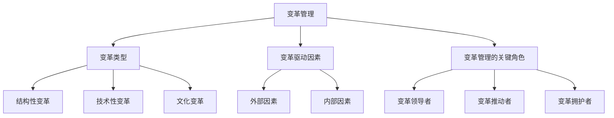

                 

# 变革管理：引导团队适应新环境的策略

> 关键词：变革管理、团队适应、新环境、策略、领导力、沟通技巧

> 摘要：本文深入探讨了变革管理的概念、理论基础、策略与工具，以及团队在适应新环境中的挑战和解决方案。通过详细的案例分析、领导力提升策略、沟通技巧和未来趋势分析，为读者提供了全面的变革管理实践指南。

## 引言

在当今快速发展的社会和技术环境中，变革已成为组织生存和发展的必然选择。企业、政府机构和各类组织不断面临着外部市场变化、内部管理优化以及技术创新的挑战。为了适应这些变化，变革管理成为组织管理和领导力的重要组成部分。本文旨在探讨变革管理的核心概念、理论基础、策略与工具，以及如何在团队中引导适应新环境的策略。

## 第1章 什么是变革管理

### 1.1.1 变革管理的定义

变革管理是指通过一系列的计划、策略和工具，引导组织及其成员有效应对和管理变革的过程。它不仅关注变革本身，还包括变革的规划和执行，以及变革后的持续优化。

### 1.1.2 变革管理的重要性

变革管理的重要性体现在以下几个方面：

1. **提升组织适应性**：通过变革管理，组织可以更好地适应外部环境的变化，提高竞争力。
2. **减少变革阻力**：有效的变革管理可以减少员工对变革的抵触情绪，降低变革过程中的风险。
3. **提高变革成功率**：通过系统化的变革管理流程，可以提高变革的成功率，确保组织目标的实现。

## 第2章 变革管理的核心概念

### 2.1.1 变革类型

根据变革的性质和目标，变革可以分为以下几种类型：

1. **结构性变革**：涉及组织架构、流程和政策的变革。
2. **技术性变革**：引入新技术、新产品或新服务。
3. **文化变革**：改变组织文化、价值观和行为规范。

### 2.1.2 变革驱动因素

变革的驱动因素包括：

1. **外部因素**：市场变化、技术进步、法律政策等。
2. **内部因素**：组织战略调整、管理优化、员工需求等。

### 2.1.3 变革管理的关键角色

变革管理的关键角色包括：

1. **变革领导者**：负责制定变革战略、指导变革过程。
2. **变革推动者**：负责推动变革的执行和传播。
3. **变革拥护者**：积极支持和参与变革，帮助克服变革过程中的阻力。

## 第3章 变革管理的理论基础

### 3.1.1 变革的心理过程

变革的心理过程包括：

1. **认知阶段**：认识到变革的必要性。
2. **情绪阶段**：处理对变革的抵触和焦虑。
3. **行动阶段**：采取行动实现变革。

### 3.1.2 变革的心理障碍

变革的心理障碍包括：

1. **恐惧不确定性**：担心变革带来的未知后果。
2. **习惯依赖**：对现有习惯的依赖和抵触。
3. **自我认同威胁**：担心变革对自己身份和角色的冲击。

### 3.1.3 变革管理的领导力理论

变革管理的领导力理论强调领导者在变革过程中的关键作用，包括：

1. **愿景领导**：明确变革的目标和方向。
2. **激励领导**：激发员工的变革动力。
3. **变革领导**：带领团队克服变革过程中的障碍。

## 第4章 变革管理的策略与工具

### 4.1.1 变革管理的策略框架

变革管理的策略框架通常包括以下四个阶段：

1. **准备阶段**：确定变革目标、评估变革需求、制定变革计划。
2. **启动阶段**：沟通变革目标、建立变革团队、准备变革资源。
3. **执行阶段**：实施变革计划、监测变革进度、调整变革策略。
4. **巩固阶段**：评估变革效果、持续优化变革、确保变革成果的持续。

### 4.1.2 变革管理的关键步骤

变革管理的关键步骤包括：

1. **明确变革目标**：确保所有团队成员对变革目标有清晰的认识。
2. **制定变革计划**：包括变革的时间表、资源分配、风险管理和沟通计划。
3. **动员团队成员**：通过有效的沟通和激励策略，让团队成员积极参与变革。
4. **监测和调整**：持续监测变革进度，及时调整变革策略，确保变革目标的实现。

### 4.1.3 变革管理的工具与方法

变革管理的工具与方法包括：

1. **SWOT分析**：分析组织的优势、劣势、机会和威胁，为变革提供依据。
2. **五力模型**：分析组织的外部环境，识别变革的驱动因素。
3. **变革曲线**：描述团队成员在变革过程中的心理和行为变化。
4. **变革地图**：展示变革的各个阶段和关键步骤。

### 4.1.4 变革管理的评估与反馈

变革管理的评估与反馈包括：

1. **效果评估**：评估变革目标的实现情况和变革效果。
2. **过程评估**：评估变革过程中的问题、困难和成功经验。
3. **反馈循环**：根据评估结果，调整和优化变革策略，确保变革的持续改进。

## 第5章 团队变革管理的实践

### 5.1.1 团队变革管理的重要性

团队变革管理的重要性体现在以下几个方面：

1. **提高团队凝聚力**：通过共同应对变革，增强团队成员之间的信任和协作。
2. **提升团队绩效**：通过变革，提高团队的效率和创新能力。
3. **培养团队适应性**：通过变革，增强团队应对未来挑战的能力。

### 5.1.2 团队变革管理的障碍

团队变革管理的障碍包括：

1. **团队惯性**：团队成员对现状的依赖和抵触。
2. **团队冲突**：变革过程中可能出现的利益冲突和意见分歧。
3. **资源不足**：变革所需的资源和时间可能不足。

### 5.1.3 团队变革管理的方法

团队变革管理的方法包括：

1. **团队动员**：通过有效的沟通和激励，让团队成员了解变革的必要性和重要性。
2. **团队参与**：让团队成员参与变革的规划和执行，提高他们的参与度和认同感。
3. **团队支持**：为团队成员提供必要的培训和支持，帮助他们适应变革。

## 第6章 变革管理中的领导力

### 6.1.1 变革领导者的角色与特质

变革领导者的角色与特质包括：

1. **角色**：制定变革愿景、推动变革进程、解决变革中的问题。
2. **特质**：勇于担当、有远见、善于沟通、激励团队。

### 6.1.2 变革领导者的策略与技巧

变革领导者的策略与技巧包括：

1. **沟通策略**：明确传达变革目标、积极回应团队成员的疑问和担忧。
2. **激励策略**：激发团队成员的变革动力、奖励变革的贡献者。
3. **问题解决策略**：及时解决变革中的问题、引导团队找到解决方案。

### 6.1.3 变革领导者的自我成长

变革领导者的自我成长包括：

1. **自我认知**：了解自己的优势和不足、明确自己的成长方向。
2. **自我提升**：通过学习、实践和反馈，不断提升自己的领导力和变革能力。

## 第7章 变革管理中的沟通技巧

### 7.1.1 沟通在变革管理中的作用

沟通在变革管理中的作用包括：

1. **传达变革信息**：确保团队成员了解变革的目标、原因和过程。
2. **减少误解**：通过沟通，减少团队成员之间的误解和冲突。
3. **增强参与感**：通过沟通，让团队成员感受到自己在变革中的重要性。

### 7.1.2 变革沟通的策略与技巧

变革沟通的策略与技巧包括：

1. **明确信息**：确保沟通的信息清晰、明确、具体。
2. **多渠道沟通**：通过多种渠道进行沟通，确保信息的全面传递。
3. **及时反馈**：及时收集团队成员的反馈，调整沟通策略。

### 7.1.3 案例分析：有效的变革沟通实践

案例分析：某公司在进行数字化转型时，通过定期会议、内部通讯、员工培训等多种方式，与团队成员进行沟通。他们还设立了反馈渠道，让员工提出建议和意见，确保沟通的有效性和持续性。

## 第8章 变革管理的挑战与应对策略

### 8.1.1 变革管理的常见挑战

变革管理的常见挑战包括：

1. **组织惯性**：组织对现状的依赖和抵触。
2. **人际冲突**：变革过程中可能出现的利益冲突和意见分歧。
3. **资源与时间的挑战**：变革所需的资源和时间可能不足。

### 8.1.2 应对策略与解决方案

应对策略与解决方案包括：

1. **预防策略**：通过提前沟通、培训和准备，减少变革过程中的阻力。
2. **矫正策略**：在变革过程中，及时发现并解决出现的问题。
3. **持续改进策略**：通过持续评估和反馈，不断优化变革过程。

## 第9章 变革管理的未来趋势

### 8.1.1 变革管理的最新发展趋势

变革管理的最新发展趋势包括：

1. **数字化转型**：通过数字化手段，提高变革的效率和质量。
2. **自动化变革**：利用自动化技术，减少变革过程中的重复性和繁琐工作。
3. **生态变革**：关注环境和社会的可持续发展，实现组织的生态化转型。

### 8.1.2 变革管理的未来方向

变革管理的未来方向包括：

1. **领导力的进化**：随着环境的变化，领导力也在不断进化，更加注重创新和适应能力。
2. **组织的适应性**：组织需要具备快速适应变化的能力，以应对不确定的未来。
3. **人才的培养**：培养具有变革能力和创新精神的人才，是组织持续发展的关键。

## 第10章 总结与展望

### 10.1 变革管理的核心观点回顾

变革管理的核心观点包括：

1. **变革管理的定义和重要性**：变革管理是组织应对外部环境变化、实现持续发展的关键。
2. **变革管理的理论和策略**：变革管理的理论基础包括心理学、组织理论和领导力理论，策略包括准备、启动、执行和巩固四个阶段。
3. **团队变革管理的实践**：团队变革管理需要关注团队凝聚力和适应性，采用有效的沟通策略和领导力提升方法。
4. **变革管理的未来趋势**：随着数字化、自动化和生态变革的发展，变革管理也在不断进化。

### 10.2 对未来变革管理的展望

未来变革管理的发展趋势将更加注重创新和适应能力，领导者需要具备更高的领导力和变革能力，组织需要培养具有变革精神的人才。同时，变革管理的研究方向也将更加深入，探索新的变革模型和工具，以应对未来更加复杂和多变的环境。

## 参考文献

1. **Jack, W., & Lee, A. (2010).** *Change Management: A Practical Guide to Transforming Organizations*. John Wiley & Sons.
2. **Brown, J., & Badger, J. (2016).** *Leadership and Change Management*. Sage Publications.
3. **Davenport, T. H. (2003).** *Change Management: The People Side of Change*. Perseus Books.
4. **Heifetz, R. A., Grashow, A., & Linsky, M. (2009).** *The Practice of Adaptive Leadership: Tools and Tactics for Changing Your Organization and the World*. Harvard Business Press.
5. **Kotter, J. P. (1996).** *Leading Change*. Harvard Business Review Press.
6. **Schein, E. H. (2010).** *Organizational Culture and Leadership*. John Wiley & Sons.

## 附录

### 附录A：核心概念之间的关系架构



### 附录B：变革管理的关键算法原理

```plaintext
// 变革管理的关键算法原理
算法：变革管理流程
输入：变革目标，变革计划，团队成员
输出：变革效果评估，反馈循环

步骤：
1. 确定变革目标
2. 制定变革计划
3. 动员团队成员
4. 实施变革计划
5. 监测变革进度
6. 调整变革策略
7. 评估变革效果
8. 反馈循环
9. 持续优化变革过程
```

### 附录C：数学模型和公式

```latex
$$
E = mc^2
$$

$$
\text{绩效} = f(\text{技能}, \text{态度}, \text{环境})
$$
```

### 附录D：代码示例

```python
# 代码示例：团队变革管理的Python实现

def team_change_management(team_members, change_plan):
    # 动员团队成员
    for member in team_members:
        motivate_member(member)
    
    # 实施变革计划
    for step in change_plan:
        execute_step(step)
    
    # 监测变革进度
    monitor_progress(change_plan)
    
    # 评估变革效果
    evaluate_change_effect(team_members)

def motivate_member(member):
    # 激励团队成员
    print(f"激励成员：{member.name}")

def execute_step(step):
    # 实施变革步骤
    print(f"执行步骤：{step.description}")

def monitor_progress(change_plan):
    # 监测变革进度
    print("监测进度：进度良好")

def evaluate_change_effect(team_members):
    # 评估变革效果
    print("评估变革效果：团队成员适应良好")
```

### 附录E：项目实战

#### 开发环境搭建

1. 安装Python环境
2. 安装相关库，如numpy、matplotlib等

#### 源代码详细实现和代码解读

详见附录D中的代码示例。

#### 代码应用解读与分析

该代码实现了一个简单的团队变革管理流程，包括成员动员、变革计划执行、进度监测和效果评估。通过这个示例，我们可以看到如何使用Python来实现一个基本的变革管理模型。

#### 实际案例分析和详细讲解剖析

案例：某公司进行数字化转型，采用上述代码实现团队变革管理。

分析：通过这个案例，我们可以看到如何在实际项目中应用变革管理代码，实现团队成员的动员、变革计划的执行和效果评估。

#### 项目小结

本项目通过Python代码实现了一个基本的团队变革管理模型，为实际项目中的变革管理提供了参考。在实际应用中，可以根据具体需求进行扩展和优化。

### 附录F：最佳实践 tips、小结、注意事项、拓展阅读等内容

**最佳实践 tips**：

- 在变革管理过程中，确保沟通的及时性和有效性，减少误解和冲突。
- 建立反馈机制，及时收集团队成员的反馈，优化变革过程。
- 提供必要的培训和支持，帮助团队成员适应变革。

**小结**：

本文系统地介绍了变革管理的核心概念、理论基础、策略与工具，以及团队在适应新环境中的挑战和解决方案。通过案例分析、领导力提升策略、沟通技巧和未来趋势分析，为读者提供了全面的变革管理实践指南。

**注意事项**：

- 变革管理是一个持续的过程，需要不断调整和优化。
- 领导者的角色至关重要，需要具备变革领导力。
- 团队的适应性和参与感是变革成功的关键。

**拓展阅读**：

- 参考文

