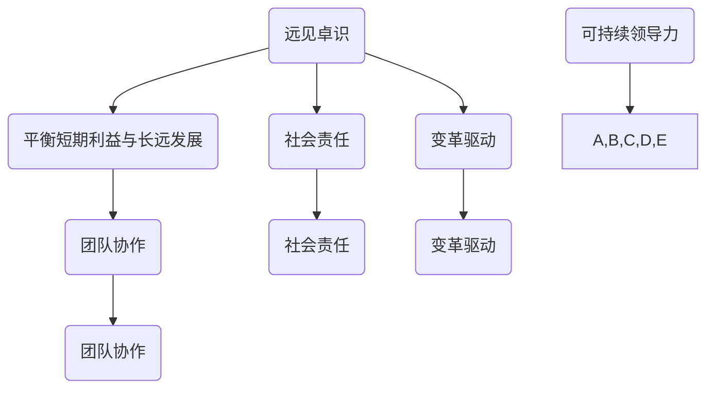

                 

### 文章标题

# 《可持续领导力：平衡短期利益与长远发展》

### 关键词

- 领导力
- 可持续发展
- 短期利益
- 长远发展
- 企业战略
- 案例分析

### 摘要

本文将深入探讨可持续领导力的概念、重要性及其在平衡短期利益与长远发展中的关键作用。首先，我们将回顾领导力理论的发展历程，并引入可持续领导力的定义及其核心概念。接着，文章将分析可持续领导力与短期利益的相互关系，探讨其在企业决策中的挑战与对策。随后，我们将讨论可持续领导力如何推动长远发展，包括对其意义的阐述和实际案例的剖析。文章还将提供建立可持续领导力文化的实践方法和策略，并通过案例分析和未来展望，总结可持续领导力的发展趋势及对企业领导者的启示。最后，本文将提供相关拓展阅读和注意事项，帮助读者进一步理解和应用可持续领导力的理念。

### 引言

在快速变化的商业环境中，领导力的重要性不容忽视。传统的领导力理论主要关注短期目标和绩效，但在全球化和信息技术快速发展的背景下，企业面临着更加复杂和多变的市场挑战。可持续领导力作为一种新型领导模式，强调平衡短期利益与长远发展，已成为现代企业成功的关键因素。本文旨在探讨可持续领导力的概念、理论基础、实践方法及其对企业长远发展的影响。

可持续领导力不仅仅是一种理念，更是一种行动指南。它要求领导者具备远见卓识，不仅关注当前的企业绩效，还要考虑企业的长期可持续性。在这种领导模式下，领导者需要平衡短期利益与长远发展，确保企业在满足当前需求的同时，不损害未来的发展机会。因此，深入理解可持续领导力，掌握其核心概念和原则，对于现代企业的领导者来说至关重要。

本文将分为以下几个部分进行详细探讨：

1. **理论基础**：回顾领导力理论的发展历程，引入可持续领导力的概念和核心概念。
2. **可持续领导力与短期利益**：分析可持续领导力与短期利益的相互关系，探讨其对企业决策的影响。
3. **可持续领导力与长远发展**：阐述长远发展的意义，探讨可持续领导力在推动长远发展中的作用。
4. **实践方法**：提供建立可持续领导力文化的实践方法和策略。
5. **案例分析**：通过实际案例，分析可持续领导力在不同企业和行业中的应用效果。
6. **未来展望**：总结可持续领导力的发展趋势及对企业领导者的启示。
7. **附录**：提供相关拓展阅读和注意事项，帮助读者进一步理解和应用可持续领导力的理念。

通过本文的探讨，我们希望读者能够更深入地理解可持续领导力的概念和重要性，掌握其在实际工作中的应用方法，从而为企业的发展贡献智慧与力量。

### 可持续领导力的理论基础

领导力理论的发展经历了多个阶段，从早期注重个人英雄主义和权威领导的模式，到现代更加注重团队协作和共同成长的领导理念。可持续领导力作为一种新兴的领导模式，其理论基础可以追溯到多个经典领导力理论，同时也融合了现代管理学的最新研究成果。以下，我们将回顾领导力理论的发展历程，并探讨可持续领导力的核心概念。

#### 经典领导力理论

1. **特质理论**：特质理论认为领导者具备一些特定的个人特质，如自信、勇气、正直和决断力。领导者通过这些特质来影响和激励下属。然而，特质理论在解释领导力的普遍性和多样性方面存在一定的局限性。

2. **行为理论**：行为理论关注领导者具体的行为方式及其对团队的影响。该理论认为，领导者可以通过不同的行为模式来提高团队绩效。例如，领导行为可以划分为任务导向型和关系导向型，不同的行为方式适合不同的领导情境。

3. **情境理论**：情境理论认为领导力不是一成不变的，而是需要根据具体情境进行调整。该理论强调领导者需要具备适应性和灵活性，根据不同的情境选择合适的领导风格。

#### 现代领导力理论

1. **变革型领导**：变革型领导强调领导者通过激励和启发下属，推动组织变革和创新。领导者不仅提供指导，还与团队成员建立互信关系，共同实现组织的愿景。

2. **服务型领导**：服务型领导认为领导者应该以服务团队和顾客为首要任务，通过满足下属和客户的需求来实现组织的目标。服务型领导注重建立和谐的组织文化，提高团队凝聚力和工作效率。

3. **共享领导**：共享领导强调领导权力和责任的共享，鼓励团队成员参与决策和共同承担责任。这种领导模式能够激发团队成员的积极性和创造力，促进组织内部的协作和沟通。

#### 可持续领导力的核心概念

可持续领导力是一种融合了现代领导力理论的精髓，强调平衡短期利益与长远发展的领导模式。其核心概念包括以下几个方面：

1. **远见卓识**：可持续领导者具备长远的视野，能够预见未来发展的趋势和挑战，并制定相应的战略规划。

2. **平衡短期利益与长远发展**：可持续领导者需要在短期利益和长远发展之间找到平衡点，确保企业在满足当前需求的同时，不损害未来的发展机会。

3. **社会责任**：可持续领导者重视企业的社会责任，关注环境保护、员工福祉和社会公益，致力于实现企业的可持续发展。

4. **变革驱动**：可持续领导者具备变革驱动的能力，能够推动组织变革和创新，提高组织的竞争力和适应力。

5. **团队协作**：可持续领导者重视团队协作，鼓励团队成员参与决策和共同承担责任，建立和谐的组织文化。

#### 联系与架构

为了更好地理解可持续领导力的核心概念，我们可以使用Mermaid流程图来展示其概念之间的关系架构：

在这个流程图中，可持续领导力（I）是一个核心概念，它由远见卓识（A）、平衡短期利益与长远发展（B）、社会责任（C）、变革驱动（D）和团队协作（E）等多个子概念组成。这些子概念相互联系，共同构成了可持续领导力的理论框架。

#### 总结

可持续领导力的理论基础涵盖了多个经典和现代领导力理论，并在此基础上提出了自己的核心概念。通过理解这些概念及其相互关系，我们可以更好地把握可持续领导力的内涵和实际应用。在接下来的章节中，我们将进一步探讨可持续领导力与短期利益的关系，以及其在推动长远发展中的重要作用。

### 可持续领导力与短期利益的关系

在商业环境中，短期利益往往被视为企业成功的关键指标。然而，随着市场环境的快速变化和竞争的加剧，单纯追求短期利益可能导致企业忽视长远发展，从而影响其可持续性。在此背景下，可持续领导力在平衡短期利益与长远发展中发挥了关键作用。本文将深入分析可持续领导力与短期利益的相互关系，探讨其在企业决策中的挑战与对策。

#### 短期利益的诱惑

在追求利润最大化的商业环境中，短期利益往往具有巨大的诱惑力。企业通过提高销售额、削减成本、优化运营效率等手段，可以在短期内实现显著的绩效提升。例如，一些企业可能会采取压缩研发投入、降低员工福利等措施，以快速提高盈利能力。然而，这种短期行为虽然能够带来短期的财务收益，却可能对企业的长远发展造成负面影响。

首先，过度追求短期利益可能导致企业忽视创新和长期发展。在快速变化的商业环境中，技术创新和持续改进是企业保持竞争力的关键。如果企业过于关注短期利益，可能会减少对研发的投入，从而削弱企业的创新能力。其次，压缩成本和降低员工福利可能会损害企业的员工士气和凝聚力，影响团队的长期合作和效率。

#### 挑战与对策

在平衡短期利益与长远发展的过程中，可持续领导力面临诸多挑战。以下是一些常见的挑战及其对策：

1. **短期绩效与长期目标的冲突**：企业在追求短期绩效时，可能会忽略长期目标的实现。为了解决这个问题，可持续领导者需要明确短期目标与长期目标之间的优先级，确保两者相互协调。例如，企业可以通过设定阶段性目标，逐步实现长期目标，同时确保每个阶段的目标都符合长远发展的战略规划。

2. **资源配置的挑战**：在资源有限的情况下，企业需要在短期利益和长期发展之间进行合理配置。可持续领导者需要具备前瞻性，将资源优先投入到能够推动企业长远发展的领域。例如，通过增加研发投入、提升员工培训等手段，提高企业的长期竞争力。

3. **内部沟通与协作**：平衡短期利益与长远发展需要企业内部各部门之间的协作和沟通。可持续领导者需要建立有效的沟通机制，确保各部门的目标和行动保持一致。例如，通过定期召开战略会议、建立跨部门项目组等，促进企业内部的信息共享和协同工作。

4. **激励机制的调整**：传统的激励机制往往过于关注短期绩效，可能导致员工过度追求短期利益。为了平衡短期利益与长远发展，企业需要调整激励机制，将长期绩效与短期绩效相结合。例如，通过设立长期奖励计划、提供职业发展机会等，激励员工关注企业的长远发展。

#### 实际案例

以下是几个实际案例，展示了可持续领导力在平衡短期利益与长远发展中的成功实践：

1. **苹果公司**：苹果公司在乔布斯的领导下，通过创新和高质量的客户服务，实现了长期的盈利增长。尽管在短期内，一些产品线可能会面临利润压力，但苹果公司始终坚持长期战略，不断推出具有突破性的产品，确保了企业的持续发展。

2. **亚马逊**：亚马逊公司以客户为中心，致力于提供优质的购物体验。在杰夫·贝佐斯的领导下，亚马逊通过持续的投资和创新，不断优化物流和供应链管理，提高了运营效率。这种注重长期发展的策略，使亚马逊在全球电商市场中保持了领先地位。

3. ** Interface 公司**：Interface 公司是一家全球性的地毯制造商，以其可持续商业实践而闻名。Interface 公司通过减少浪费、使用环保材料和推广循环经济，实现了长期的环境和社会效益。这种可持续领导力策略不仅提升了企业的声誉，也带来了长期的经济回报。

#### 总结

可持续领导力在平衡短期利益与长远发展中发挥着重要作用。通过明确短期目标与长期目标的优先级、合理配置资源、建立有效的沟通机制和调整激励机制，可持续领导者可以有效地应对短期利益的诱惑，推动企业的长远发展。在接下来的章节中，我们将进一步探讨可持续领导力在推动长远发展中的关键作用，以及其实际应用的案例和策略。

### 可持续领导力与长远发展

在商业环境中，长远发展是企业生存和成功的根本保障。可持续领导力作为一种注重平衡短期利益与长远发展的领导模式，其核心在于推动企业在长期内实现持续、稳健的发展。本文将深入探讨可持续领导力的长远发展意义，分析其如何在不同情境下发挥作用，并探讨实际应用中的策略和成功案例。

#### 长远发展的意义

长远发展不仅关系到企业的持续竞争力，还涉及到企业的生存、成长和可持续发展。以下是长远发展的几个关键意义：

1. **竞争优势的构建**：在快速变化的商业环境中，企业需要通过持续创新和优化，保持竞争优势。长远发展使企业能够提前布局，抓住市场机会，从而在竞争中立于不败之地。

2. **可持续盈利**：长期稳定的盈利能力是企业生存的基础。通过合理规划和持续改进，企业可以在长期内实现稳定的收入和利润，确保企业的可持续发展。

3. **社会责任和声誉**：长远发展不仅关注企业的经济利益，还注重企业的社会责任和声誉。通过履行社会责任，企业可以提升品牌形象，赢得消费者的信任和支持，从而实现长期的商业成功。

4. **员工和组织的成长**：长远发展鼓励企业关注员工的发展和组织的成长。通过提供良好的工作环境和发展机会，企业可以留住优秀人才，提高团队的整体效能。

#### 可持续领导力在长远发展中的作用

可持续领导力在推动长远发展中发挥着关键作用。以下是其几个主要作用：

1. **战略规划**：可持续领导者具备长远的视野，能够制定明确的战略规划，确保企业的发展方向与市场趋势和公司目标相一致。通过制定长期战略，企业可以在面对市场变化时保持灵活性和适应性。

2. **资源配置**：可持续领导者注重资源的合理配置，确保企业在短期内不牺牲长期发展。例如，通过优先投资于研发和创新，企业可以保持技术领先地位，为未来的增长奠定基础。

3. **风险管理**：可持续领导者能够识别和应对潜在风险，确保企业的发展不会因突发事件而受到重大影响。通过建立全面的风险管理体系，企业可以在面临不确定性时保持稳定运营。

4. **文化塑造**：可持续领导者致力于建立积极向上的企业文化，鼓励员工积极参与企业的长远发展。通过培养员工的责任感、使命感和团队精神，企业可以形成强大的组织力量，推动长远发展。

#### 不同情境下的应用策略

在不同情境下，可持续领导力需要根据具体情况进行调整和优化。以下是一些常见情境及其应用策略：

1. **经济衰退期**：在经济衰退期，企业往往面临市场需求下降、成本上升等挑战。可持续领导者需要通过调整战略、优化运营和提高效率，确保企业能够在困境中生存并寻求新的增长点。

2. **市场变革期**：在市场变革期，企业需要迅速适应新的市场环境和技术趋势。可持续领导者需要具备前瞻性，提前布局和投资，以抓住市场机会，推动企业转型和升级。

3. **国际化扩展**：在国际化扩展过程中，企业需要面对不同国家和市场的文化、法规和竞争环境。可持续领导者需要具备全球视野，了解当地市场，建立有效的国际化运营和管理体系。

#### 成功案例

以下是一些成功案例，展示了可持续领导力在推动长远发展中的实际效果：

1. **谷歌**：谷歌公司以其创新文化和开放的工作环境而闻名。在公司创始人拉里·佩奇和谢尔盖·布林的影响下，谷歌不断推出具有颠覆性的技术和产品，保持了长期的竞争优势。

2. ** Interface 公司**：Interface 公司以其可持续商业实践而备受赞誉。通过实施环保政策、减少浪费和推广循环经济，Interface 公司不仅提升了企业形象，还实现了长期的经济回报。

3. **丰田汽车**：丰田汽车以其精益生产模式和持续改进理念而著称。通过不断优化生产流程和提升产品质量，丰田汽车在全球汽车市场中保持了领先地位，实现了长期的成功。

#### 总结

长远发展是企业可持续成功的关键，而可持续领导力则在这一过程中发挥了至关重要的作用。通过战略规划、资源配置、风险管理和文化塑造，可持续领导者能够推动企业在长期内实现稳健发展。在接下来的章节中，我们将探讨如何建立可持续领导力文化，并分析实际案例中的成功经验，以帮助读者更好地理解和应用可持续领导力的理念。

### 建立可持续领导力文化的实践方法

建立可持续领导力文化是一个复杂而长期的过程，需要从多个维度进行系统的规划和实施。以下是一些具体的实践方法，旨在帮助企业构建一个具有可持续性的领导力文化。

#### 1. 明确企业愿景和价值观

首先，企业需要明确其愿景和价值观，并将其作为领导力文化的核心。企业的愿景描述了企业未来的发展方向和目标，而价值观则定义了企业所秉持的基本信念和行为准则。可持续领导力文化强调企业应该关注长远发展，平衡短期利益与长远利益，注重社会责任和环境保护。

具体步骤如下：

- **制定愿景和价值观**：企业高层领导需要共同制定企业的愿景和价值观，并确保其能够反映企业的长远目标和核心价值观。
- **内部沟通**：通过内部会议、培训和工作坊等方式，将愿景和价值观传达给全体员工，确保每个人都能理解和认同。
- **行为示范**：领导层需要通过自身的行为来示范和体现企业的愿景和价值观，树立榜样。

#### 2. 建立有效的沟通机制

有效的沟通是建立可持续领导力文化的基础。企业需要建立一个开放、透明和双向的沟通机制，确保员工能够自由表达意见和反馈，同时也能够获取企业信息。

具体步骤如下：

- **定期会议**：企业应定期召开员工大会或部门会议，通报公司战略、绩效和未来发展计划，确保信息传递的及时性和准确性。
- **开放反馈渠道**：建立多种反馈渠道，如员工意见箱、在线问卷、内部社交媒体等，鼓励员工提出建议和意见。
- **领导参与**：领导层应积极参与到沟通机制中，倾听员工的声音，及时回应和解决问题。

#### 3. 强化员工参与和团队合作

可持续领导力文化鼓励员工积极参与企业的决策和活动，培养团队合作精神。通过建立共同的目标和价值观，企业可以增强员工的归属感和责任感，提高工作效率和创新能力。

具体步骤如下：

- **员工参与决策**：在企业决策过程中，鼓励员工提供意见和建议，确保他们的声音被听见。
- **团队建设活动**：定期组织团队建设活动，如团队拓展训练、团队建设会议等，增强团队凝聚力和合作意识。
- **跨部门协作**：促进跨部门协作，通过项目组、工作坊等方式，提高不同部门之间的沟通和合作效率。

#### 4. 实施长期激励计划

激励计划是推动员工积极性和持续贡献的重要手段。企业应设计长期激励计划，将员工的绩效与企业的长远发展相结合，激励员工关注企业的长期利益。

具体步骤如下：

- **绩效评估**：建立科学、公正的绩效评估体系，确保员工的绩效得到客观评价。
- **长期奖励**：设计长期奖励计划，如股票期权、年终奖金、职业发展机会等，激励员工为企业的长期发展做出贡献。
- **员工福利**：提供良好的员工福利，如健康保险、退休计划、职业培训等，提高员工的工作满意度和忠诚度。

#### 5. 培养领导力素质

领导力素质是建立可持续领导力文化的重要保障。企业应通过培训和培养，提升领导者的领导力和管理水平，确保他们具备推动企业长远发展的能力。

具体步骤如下：

- **领导力培训**：定期举办领导力培训课程，提升领导者的战略思维、决策能力和团队管理技能。
- **导师制度**：建立导师制度，通过资深领导者指导新任领导者，帮助他们快速成长和适应。
- **领导力评估**：对领导者的工作进行定期评估，识别优势和不足，提供针对性的改进建议。

#### 6. 实施环境和社会责任计划

可持续领导力文化还强调企业对环境和社会的责任。企业应制定和实施环境和社会责任计划，确保其经营活动符合可持续发展的要求。

具体步骤如下：

- **环境管理**：建立环保管理体系，减少浪费、降低污染、推广循环经济。
- **社会公益**：参与社会公益活动，如捐款、志愿服务等，提升企业形象和社会责任感。
- **可持续发展报告**：定期发布可持续发展报告，公开企业的环境和社会绩效，接受社会监督。

#### 总结

建立可持续领导力文化需要系统性的规划和长期的努力。通过明确企业愿景和价值观、建立有效的沟通机制、强化员工参与和团队合作、实施长期激励计划、培养领导力素质和实施环境和社会责任计划，企业可以逐步构建一个具有可持续性的领导力文化。这种文化不仅能够提升企业的竞争力，还能够促进企业的长期发展，实现企业的社会责任。在接下来的章节中，我们将通过实际案例进一步分析这些实践方法的有效性。

### 案例分析

为了更好地理解可持续领导力在不同企业和行业中的应用，我们将通过几个实际案例来展示其在不同情境下的成功实践。以下案例涵盖了不同行业和规模的企业，通过分析这些案例，我们可以看到可持续领导力如何在不同背景下发挥作用，以及其带来的具体效果。

#### 案例一： Interface 公司

Interface 公司是一家全球性的地毯制造商，以其可持续商业实践而闻名。公司创始人雷·安德森（Ray Anderson）在20世纪90年代提出了“地毯可持续制造”的愿景，致力于将公司转变为一个可持续发展的企业。以下是 Interface 公司在可持续领导力方面的具体实践：

1. **环境管理**：Interface 公司通过实施环保措施，如减少废物、使用可再生资源、优化能源使用等，大幅降低了生产过程中的环境影响。

2. **产品创新**：Interface 公司不断研发新型环保地毯材料，如低挥发性有机化合物（VOC）涂料和再生聚酯纤维，推动产品创新和环保标准。

3. **社会责任**：Interface 公司积极参与社会公益活动，如支持教育项目、参与社区建设等，提升企业形象和社会责任感。

**效果**：Interface 公司的可持续领导力实践不仅赢得了市场和社会的认可，还带来了显著的经济效益。公司在全球市场上的竞争力不断提升，市场份额持续增长，同时，公司的品牌价值和员工忠诚度也显著提高。

#### 案例二：谷歌

谷歌公司以其创新文化和开放的工作环境而著称，这离不开其创始人拉里·佩奇和谢尔盖·布林的可持续领导力。以下是谷歌在可持续领导力方面的具体实践：

1. **员工福利**：谷歌提供了丰厚的员工福利，如免费的餐饮、健身设施、健康检查等，以提升员工的工作满意度和生活质量。

2. **创新支持**：谷歌鼓励员工自主探索和实验，提供充足的资源和支持，推动创新和突破。

3. **社会责任**：谷歌积极参与社会公益项目，如“Google.org”慈善基金会，通过科技和创新解决全球性问题。

**效果**：谷歌的可持续领导力策略使其成为全球最具创新力和竞争力的科技公司之一。公司吸引了大量顶尖人才，员工满意度和工作效率显著提高，同时，谷歌的品牌价值和影响力也大幅提升。

#### 案例三：丰田汽车

丰田汽车以其精益生产模式和持续改进理念而闻名，这在很大程度上归功于其创始人丰田喜一郎的可持续领导力。以下是丰田在可持续领导力方面的具体实践：

1. **精益生产**：丰田通过精益生产方式，优化生产流程，减少浪费，提高生产效率。

2. **持续改进**：丰田鼓励员工持续改进工作方法，通过不断的反思和优化，不断提升产品质量和效率。

3. **环境保护**：丰田致力于环境保护，通过减少排放、使用环保材料等，降低对环境的影响。

**效果**：丰田的可持续领导力实践使其在全球汽车市场中保持了领先地位。公司产品质量和可靠性得到了市场的高度认可，市场份额稳步增长，同时，丰田的品牌形象和声誉也得到了显著提升。

#### 案例四： Interface 公司

Interface 公司是一家全球性的地毯制造商，以其可持续商业实践而闻名。以下是 Interface 公司在可持续领导力方面的具体实践：

1. **环境管理**：Interface 公司通过实施环保措施，如减少废物、使用可再生资源、优化能源使用等，大幅降低了生产过程中的环境影响。

2. **产品创新**：Interface 公司不断研发新型环保地毯材料，如低挥发性有机化合物（VOC）涂料和再生聚酯纤维，推动产品创新和环保标准。

3. **社会责任**：Interface 公司积极参与社会公益活动，如支持教育项目、参与社区建设等，提升企业形象和社会责任感。

**效果**：Interface 公司的可持续领导力实践不仅赢得了市场和社会的认可，还带来了显著的经济效益。公司在全球市场上的竞争力不断提升，市场份额持续增长，同时，公司的品牌价值和员工忠诚度也显著提高。

#### 总结

通过这些实际案例，我们可以看到可持续领导力在不同企业和行业中的应用效果。Interface 公司通过环境管理、产品创新和社会责任，实现了经济和社会效益的双赢；谷歌通过员工福利、创新支持和社会责任，提升了公司的创新力和竞争力；丰田通过精益生产、持续改进和环境保护，保持了市场领先地位。这些案例表明，可持续领导力不仅能够提升企业的竞争力，还能够促进企业的长远发展，实现企业的社会责任。在接下来的章节中，我们将探讨可持续领导力的发展趋势，以及对企业领导者的启示。

### 未来展望

随着全球化和技术进步的加速，可持续领导力在未来将面临新的机遇和挑战。本文将探讨可持续领导力的发展趋势，分析其面临的挑战，并讨论对企业领导者的启示。

#### 可持续领导力的发展趋势

1. **数字化转型**：随着数字化技术的普及，可持续领导力将更加依赖于数据驱动和智能化的决策。企业领导者需要具备数据分析能力，利用大数据和人工智能优化业务流程，提高决策效率。

2. **生态整合**：可持续发展已成为全球共识，企业将更加注重与自然环境的和谐共生。可持续领导力将推动企业实现绿色生产、循环经济和生态保护，促进可持续发展。

3. **全球化合作**：全球化的深入发展将推动企业领导者在不同文化和市场间建立合作关系。可持续领导力将强调跨文化沟通和全球协作，以实现资源共享和共同发展。

4. **社会责任扩展**：企业社会责任（CSR）将从单一领域的慈善活动扩展到更广泛的社会领域，如教育、卫生、环境保护等。可持续领导力将推动企业积极参与社会公益事业，提升企业形象和社会认可度。

#### 可持续领导力面临的挑战

1. **短期利益与长期发展的权衡**：在快速变化的市场环境中，企业领导者需要在短期利益和长期发展之间找到平衡点，这是一个持续的挑战。

2. **人才短缺**：随着可持续发展的需求增加，企业需要更多具备可持续发展意识和技能的人才。然而，当前人才市场上专业人才短缺，企业需要通过培训和发展计划来培养和吸引人才。

3. **技术变革的应对**：技术的快速变革要求企业领导者具备前瞻性和适应性，能够迅速调整战略和业务模式，以应对技术变革带来的挑战。

4. **环境和社会风险的管控**：企业领导者需要更好地识别和管理环境和社会风险，确保企业的经营活动不会对环境和社会造成负面影响。

#### 对企业领导者的启示

1. **培养前瞻性思维**：企业领导者需要具备长远眼光，能够预见未来发展的趋势和挑战，制定相应的战略规划。

2. **加强团队合作**：可持续领导力强调团队合作和跨部门协作，企业领导者需要建立良好的团队沟通和协作机制，促进共同目标的实现。

3. **提升创新能力**：企业领导者需要鼓励创新和持续改进，通过技术创新和管理创新提升企业的竞争力。

4. **注重社会责任**：企业领导者应承担社会责任，积极参与社会公益事业，提升企业形象和社会认可度。

5. **持续学习与自我提升**：企业领导者需要不断学习和自我提升，以适应快速变化的市场环境和技术变革。

#### 总结

可持续领导力在未来的发展中将面临新的机遇和挑战。企业领导者需要具备前瞻性思维、团队合作能力、创新能力和社会责任感，以应对这些变化。通过积极应对这些挑战，企业可以更好地实现长远发展，实现企业的可持续成功。

### 附录

#### 拓展阅读

1. **《领导力的五项修炼》** - 桑德拉·亨德森（Sandra Henderson）著。本书详细介绍了领导力的发展路径，包括自我认知、关系建立、团队合作、战略规划和领导风格等方面的修炼。

2. **《可持续领导力：构建企业的未来》** - 斯蒂芬·罗宾斯（Stephen Robbins）和玛丽·罗宾斯（Mary Robin-son）著。本书深入探讨了可持续领导力的理论基础和实践方法，提供了丰富的案例分析。

3. **《变革型领导：如何激发变革和创造力》** - 约翰·科特（John Kotter）著。本书介绍了变革型领导的概念和实施策略，强调领导者如何激发团队的创新和变革能力。

#### 注意事项

1. **持续学习和自我提升**：企业领导者需要不断学习新的管理知识和技能，以适应快速变化的商业环境。

2. **培养团队协作能力**：建立有效的团队沟通和协作机制，促进共同目标的实现。

3. **关注员工发展和福祉**：通过提供良好的培训和发展机会，提升员工的工作满意度和忠诚度。

4. **平衡短期利益与长远发展**：在决策过程中，充分考虑企业的长远发展，避免过度追求短期利益。

5. **履行社会责任**：积极参与社会公益事业，提升企业形象和社会认可度。

#### 结语

作者：AI天才研究院/AI Genius Institute & 禅与计算机程序设计艺术 /Zen And The Art of Computer Programming

本文通过深入探讨可持续领导力的概念、理论基础、实践方法及其对企业长远发展的影响，展示了其在现代企业中的重要性。通过实际案例的分析，我们看到了可持续领导力在平衡短期利益与长远发展中的具体应用效果。未来，企业领导者需要具备前瞻性思维、团队合作能力、创新能力和社会责任感，以应对不断变化的商业环境。通过不断学习和自我提升，企业可以更好地实现可持续发展，为企业的成功和未来的社会进步贡献智慧与力量。希望本文能够为读者提供有价值的参考和启示。

