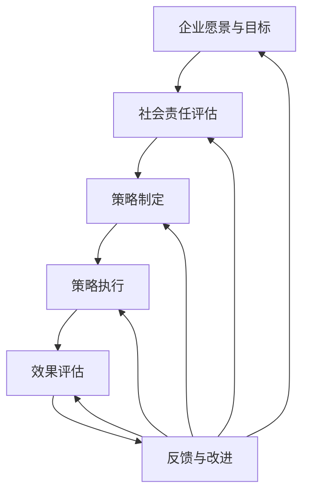

                 

### 文章标题

《可持续领导：为长期成功奠定基础》

可持续领导是一个深具远见和前瞻性的概念，它不仅关注企业当下的业绩，更着眼于企业的长期生存和发展。在这个快速变化的时代，企业领导者需要具备前瞻性的眼光和战略思维，以确保企业在面对未来挑战时能够立于不败之地。本文将围绕“可持续领导”这一核心主题，详细探讨其在现代企业中的重要性，及其如何为长期成功奠定坚实基础。

本文将分为七个主要章节。第一章将定义并探讨可持续领导的基本概念和历史演变。第二章将深入分析可持续领导策略的制定，包括企业愿景与目标的设定、社会责任与可持续发展的策略，并通过伪代码展示领导策略的制定过程。第三章将讨论领导策略的执行，重点关注领导者的角色与职责、团队建设与沟通，并通过伪代码详细阐述领导策略的执行过程。第四章将探讨如何评估可持续领导的效果，介绍定量和定性评估方法以及持续改进的实践。第五章将分析可持续领导在不同行业中的应用案例，从制造业、服务业到科技行业，探讨其具体实践和挑战。第六章将探讨全球视野下的可持续领导，包括全球可持续发展的趋势、跨文化领导和全球治理。最后，第七章将展望可持续领导的发展趋势，探讨新技术应用、社会责任的新维度和领导角色的演变。

通过以上章节的逐一探讨，本文旨在提供一个全面、系统且深入的分析框架，帮助读者理解和实践可持续领导，为企业的长期成功奠定坚实基础。让我们一步步深入分析，探索这一重要课题。在开始之前，我们先简要回顾一下可持续领导的基本概念，以便为后续内容打下坚实的基础。

---

**关键词：** 可持续领导、长期成功、企业愿景、社会责任、领导策略、效果评估、跨文化领导、全球治理。

**摘要：** 本文围绕可持续领导这一核心主题，系统地探讨了其在现代企业中的重要性，及其如何为企业的长期成功奠定基础。文章分为七个章节，分别从定义与核心原则、领导策略的制定与执行、效果评估、行业应用、全球视野和未来展望等方面进行深入分析。通过理论讲解、案例分析、伪代码和实际应用等手段，本文旨在为读者提供一个全面、系统的理解和实践框架。

---

### 可持续领导的基本概念

可持续领导是一个多维度、多层次的概念，其核心在于通过前瞻性的战略思维和行动，确保企业在长期内能够持续发展、适应变化并保持竞争力。在理解可持续领导之前，我们需要明确几个关键概念，包括其定义、历史演变以及与长期成功的关系。

**定义：** 可持续领导是指领导者通过制定并实施可持续的战略和行动，推动企业实现长期目标，同时兼顾经济、社会和环境三方面的利益。这种领导不仅关注企业的短期盈利，更注重企业的长期生存和可持续发展。可持续领导要求领导者具备前瞻性的思维，能够预见未来的趋势，并根据这些趋势调整企业的战略方向。

**历史演变：** 可持续领导的概念并不是一蹴而就的。它起源于20世纪末和21世纪初，随着全球环境问题的加剧、社会意识的提升以及企业社会责任的觉醒，可持续领导逐渐成为一个热门话题。在早期的企业治理中，领导者主要关注的是企业的财务绩效和市场份额。然而，随着可持续发展的理念逐渐被接受，企业领导者开始意识到，只有在确保经济、社会和环境可持续发展的前提下，企业才能实现长期的繁荣和成功。

历史演变可以划分为几个阶段：

1. **初始阶段：** 在这个阶段，企业领导者开始意识到环境保护的重要性，并采取了一些初步的环保措施，如减少废物排放、节约能源等。
2. **成长阶段：** 随着可持续发展理念的进一步推广，企业开始将社会责任纳入其战略规划，不仅仅是关注环境保护，还包括对员工、社区和供应商的关怀。
3. **成熟阶段：** 在这个阶段，可持续领导成为企业战略的重要组成部分，领导者不仅制定并实施可持续战略，还将其融入企业的文化和价值观。
4. **未来阶段：** 可持续领导将进一步深化，成为企业决策的基石，企业将在全球化背景下，更加注重跨文化领导和社会责任。

**与长期成功的关系：** 可持续领导与企业的长期成功密切相关。首先，通过可持续战略的实施，企业能够更好地应对外部环境的变化，提高市场竞争力。其次，可持续领导能够增强企业的社会形象和品牌价值，提升消费者和投资者的信心。最后，可持续领导有助于提升员工的工作满意度和忠诚度，降低人才流失率。

总的来说，可持续领导不仅是一种管理理念，更是一种战略思维和行动，它要求领导者具备前瞻性、责任感和创新精神。通过可持续领导，企业能够在长期内保持稳定的发展势头，实现可持续的成功。在下一章中，我们将深入探讨可持续领导的核心原则和模型，帮助读者更好地理解这一重要概念。

### 可持续领导的核心原则

可持续领导的核心原则是构建在长远目标和全面发展的基础上，通过科学的方法和严谨的策略，确保企业能够在经济、社会和环境三方面取得平衡和进步。以下是可持续领导的主要核心原则：

**1. 长远视角：** 可持续领导要求领导者具备长远的眼光，不仅仅关注短期业绩，更要考虑企业未来的发展方向和可持续性。这意味着领导者需要制定长远的战略规划，并确保这些规划与企业的使命和愿景保持一致。例如，一家制造企业可能会在五年或十年内制定环保目标，减少废物排放和能源消耗，从而实现可持续发展的目标。

**2. 全面发展：** 可持续领导强调企业的全面发展，不仅包括经济上的盈利能力，还涉及社会贡献和环境保护。领导者需要确保企业在追求经济利益的同时，也关注社会问题和环境挑战。这可以通过制定社会责任报告、参与社区活动、支持公益项目等方式实现。例如，一家科技公司可能会通过捐赠技术支持贫困地区的教育项目，提升社会福祉。

**3. 透明度与问责制：** 可持续领导要求企业具备高度透明度，公开其可持续发展目标和进展情况，接受内部和外部审计。此外，企业需要建立问责机制，确保每个层级和部门都明确自己的责任和目标，并对其行为负责。这有助于提升企业的诚信度，增强利益相关者的信任。

**4. 创新思维：** 可持续领导鼓励领导者具备创新思维，不断探索新的发展模式和解决方案，以应对不断变化的市场和环境挑战。这包括引入新技术、开发新产品、改进生产流程等。例如，一家农业企业可能会投资研发新型环保肥料，以减少对土壤和水源的污染。

**5. 跨部门协作：** 可持续领导强调跨部门协作，打破传统的职能壁垒，促进不同部门之间的沟通和合作。领导者需要建立有效的协作机制，确保各个部门能够在可持续发展目标下协同工作。例如，一家零售企业可能会组织跨部门团队，共同制定环保包装策略，减少塑料使用。

**6. 员工参与：** 可持续领导鼓励员工的参与和贡献，通过培训和激励机制，提升员工对可持续发展目标的认知和责任感。这有助于营造一个积极的企业文化，增强员工的归属感和工作满意度。例如，一家制造业公司可能会定期组织员工参加环保培训，鼓励他们提出节能减排的建议。

**7. 风险管理：** 可持续领导需要领导者具备风险管理能力，能够预见并应对潜在的环境、社会和经济风险。这包括制定应急预案，建立风险预警机制，确保企业能够迅速应对突发事件。例如，一家能源企业可能会定期进行安全检查，确保生产设施的安全和稳定。

**核心原则之间的关系：** 这些核心原则并不是孤立的，而是相互关联、相互支持的。长远视角和全面发展是可持续领导的基础，透明度与问责制、创新思维、跨部门协作、员工参与和风险管理则是实现这些基础原则的具体方法和手段。只有将这些原则结合起来，领导者才能在复杂多变的环境中，确保企业的可持续发展。

通过深入理解和实践这些核心原则，企业领导者可以为企业的长期成功奠定坚实基础，实现经济、社会和环境的协调发展。在下一章中，我们将探讨可持续领导模型，进一步揭示这些核心原则在企业战略中的具体应用。

### 可持续领导模型

为了更好地理解和实践可持续领导，我们需要一个清晰的模型来指导我们的思考。可持续领导模型是一个多维度的框架，它包括了核心概念、模型组件以及它们之间的相互关系。通过这个模型，领导者可以系统地制定和执行可持续战略，确保企业长期成功。

**核心概念：** 

1. **企业愿景与目标：** 这是可持续领导模型的基础，它明确了企业的发展方向和长期目标。企业愿景提供了企业的使命和价值观，而目标则是实现愿景的具体步骤和指标。

2. **社会责任与可持续发展：** 这包括企业在经济、社会和环境方面的责任，以及如何通过可持续发展策略实现这些责任。社会责任和可持续发展是可持续领导的重要组成部分，它们确保企业在追求经济利益的同时，也关注社会福祉和环境健康。

3. **领导策略：** 这是指为实现企业愿景和目标所制定的行动计划。领导策略需要结合企业愿景、社会责任和可持续发展目标，形成一套完整的战略框架。

4. **执行与监控：** 这是指领导策略的具体执行过程，以及如何通过监控和评估来确保策略的有效性。执行与监控是领导策略成功的关键，它们确保企业能够按照既定的方向稳步前进。

5. **反馈与改进：** 这是指通过收集反馈信息，不断调整和优化领导策略，以实现更好的效果。反馈与改进是可持续领导模型的一个重要环节，它保证了企业能够灵活应对外部环境的变化。

**模型组件：** 

1. **愿景与目标设定：** 这是领导策略的起点，领导者需要明确企业的愿景和目标，并将其转化为具体的行动计划。

2. **社会责任评估：** 领导者需要对企业社会责任进行全面的评估，确定企业在经济、社会和环境方面的责任，并制定相应的可持续发展策略。

3. **策略制定：** 根据企业愿景、社会责任和目标，领导者需要制定具体的领导策略，包括资源分配、行动步骤和时间表等。

4. **策略执行：** 策略制定后，领导者需要确保其有效执行，通过组织协调、资源管理和绩效监控等手段，推动企业按计划前进。

5. **效果评估：** 策略执行过程中，领导者需要定期评估效果，通过定量和定性方法，分析策略的有效性和影响。

6. **反馈与改进：** 根据效果评估结果，领导者需要调整和优化策略，确保企业能够持续改进和进步。

**模型关系图：**



**关系与作用：**

- **企业愿景与目标：** 这是整个模型的起点，决定了企业的战略方向。通过明确的愿景和目标，企业可以确保所有的行动都朝着同一个方向努力。

- **社会责任评估：** 社会责任评估帮助企业了解其在经济、社会和环境方面的责任，为制定领导策略提供依据。

- **策略制定：** 策略制定是将企业愿景、社会责任和目标转化为具体行动的过程。一个有效的策略能够确保企业目标的实现。

- **策略执行：** 策略执行是将领导策略转化为实际行动的关键。通过有效的执行，企业可以确保策略的有效实施。

- **效果评估：** 效果评估是监控策略执行效果的重要手段，通过定期评估，企业可以了解策略的有效性和影响。

- **反馈与改进：** 反馈与改进是确保企业持续进步的关键。通过收集反馈信息，企业可以不断调整和优化策略，以应对外部环境的变化。

通过以上组件和关系的详细描述，我们可以看到，可持续领导模型是一个系统、全面且动态的框架。它不仅帮助企业明确愿景和目标，还通过社会责任评估、策略制定、执行和评估等环节，确保企业能够持续改进和进步，实现长期的可持续发展。在下一章中，我们将进一步探讨如何通过具体的领导策略实现企业愿景和目标。

### 领导策略的制定

领导策略的制定是可持续领导的关键环节，它决定了企业如何实现愿景和目标，如何在复杂多变的环境中保持竞争优势。有效的领导策略需要结合企业的现状、市场环境、社会责任和可持续发展目标，通过科学的分析和规划，制定出切实可行的行动方案。

**步骤1：收集信息**

在制定领导策略之前，领导者需要全面收集相关数据和信息。这些信息包括企业的财务状况、市场趋势、竞争对手分析、行业动态、客户需求等。此外，领导者还需要关注政策法规的变化，以及社会责任和环境问题。信息收集可以通过以下几种方式进行：

- **内部数据分析：** 通过财务报表、运营数据、员工反馈等内部资料，了解企业的优势和劣势。
- **市场调研：** 通过问卷调查、访谈、市场分析报告等手段，获取外部市场的信息。
- **行业研究：** 通过行业报告、市场分析、竞争对手分析等，了解行业趋势和竞争态势。
- **政策法规研究：** 通过政策法规的研究，确保企业的战略规划符合法律法规的要求。

**步骤2：分析数据**

收集到信息后，领导者需要对数据进行深入分析，识别关键问题和机会。数据分析可以采用以下几种方法：

- **SWOT分析：** 通过分析企业的优势、劣势、机会和威胁，明确企业在市场中的位置和战略方向。
- **PEST分析：** 通过分析政治（Political）、经济（Economic）、社会（Social）和技术（Technological）因素，了解外部环境对企业的影响。
- **关键绩效指标（KPI）：** 通过设定关键绩效指标，衡量企业各项工作的效果和进展。
- **趋势分析：** 通过对历史数据的分析，识别市场趋势和行业变化，为策略制定提供依据。

**步骤3：制定策略**

在数据分析的基础上，领导者需要制定具体的领导策略。制定策略时，应考虑以下关键因素：

- **企业愿景和目标：** 策略应与企业的愿景和目标保持一致，确保所有行动都朝着同一方向努力。
- **社会责任和可持续发展：** 策略应考虑企业的社会责任和可持续发展目标，确保在追求经济利益的同时，也关注社会福祉和环境健康。
- **资源配置：** 策略应明确资源的需求和分配，确保各项行动有足够的资源支持。
- **时间表和里程碑：** 策略应设定明确的时间表和里程碑，确保各项行动按照计划进行。

具体的领导策略包括以下几个方面：

- **市场拓展策略：** 通过市场调研和分析，确定企业的市场定位和目标市场，制定市场拓展计划，如新产品开发、市场营销、渠道建设等。
- **技术创新策略：** 通过技术趋势分析和研发投入，推动技术创新和产品升级，提升企业的核心竞争力。
- **人力资源管理策略：** 通过人才招聘、培训和发展，提升员工素质和创新能力，确保企业有足够的人才支持战略实施。
- **社会责任策略：** 通过社会责任报告、社区参与、环保项目等，提升企业的社会形象和品牌价值。

**伪代码示例：**

以下是一个简化的伪代码示例，用于展示领导策略的制定过程：

```python
# 收集信息
def collect_info():
    internal_data = get_internal_data()
    market_data = get_market_data()
    industry_data = get_industry_data()
    policy_data = get_policy_data()
    return internal_data, market_data, industry_data, policy_data

# 分析数据
def analyze_data(internal_data, market_data, industry_data, policy_data):
    swot_analysis = perform_swot_analysis(internal_data, market_data)
    pest_analysis = perform_pest_analysis(policy_data)
    kpi = set_key_performance_indicators()
    trend_analysis = perform_trend_analysis(market_data, industry_data)
    return swot_analysis, pest_analysis, kpi, trend_analysis

# 制定策略
def create_strategy(swot_analysis, pest_analysis, kpi, trend_analysis):
    vision_and_goals = define_vision_and_goals()
    social_and_sustainable_goals = define_social_and_sustainable_goals()
    resource_allocation = allocate_resources()
    timeline = set_timeline_and_milestones()
    return vision_and_goals, social_and_sustainable_goals, resource_allocation, timeline

# 执行策略
def execute_strategy(vision_and_goals, social_and_sustainable_goals, resource_allocation, timeline):
    market_expansion = execute_market_expansion_strategy()
    technological_innovation = execute_technological_innovation_strategy()
    human_resource_management = execute_human_resource_management_strategy()
    social_responsibility = execute_social_responsibility_strategy()
    return market_expansion, technological_innovation, human_resource_management, social_responsibility

# 整体流程
def leadership_strategy流程():
    internal_data, market_data, industry_data, policy_data = collect_info()
    swot_analysis, pest_analysis, kpi, trend_analysis = analyze_data(internal_data, market_data, industry_data, policy_data)
    vision_and_goals, social_and_sustainable_goals, resource_allocation, timeline = create_strategy(swot_analysis, pest_analysis, kpi, trend_analysis)
    market_expansion, technological_innovation, human_resource_management, social_responsibility = execute_strategy(vision_and_goals, social_and_sustainable_goals, resource_allocation, timeline)
    return vision_and_goals, social_and_sustainable_goals, resource_allocation, timeline, market_expansion, technological_innovation, human_resource_management, social_responsibility
```

通过上述步骤和伪代码示例，我们可以看到，领导策略的制定是一个系统性的过程，需要综合考虑内部和外部因素，通过科学的方法和严谨的分析，制定出切实可行的行动方案。在下一章中，我们将探讨领导策略的执行过程，确保企业能够按照既定方向稳步前进。

### 领导策略的执行

领导策略的执行是可持续领导过程中至关重要的一环。一个再好再全面的策略，如果无法有效执行，最终也将无法实现预期的目标。有效的执行需要领导者具备明确的角色与职责，强大的团队建设与沟通能力，以及科学的项目管理方法。以下是领导策略执行过程中的一些关键要素：

**领导者的角色与职责**

在执行领导策略的过程中，领导者的角色至关重要。领导者需要明确自己的职责，确保策略能够按照计划顺利进行。以下是领导者的一些关键职责：

1. **明确目标与方向：** 领导者需要确保团队成员明确了解策略的目标和方向，避免因理解不一致而导致的执行偏差。领导者可以通过定期会议、公告等形式，向团队传达策略的核心内容和执行要求。

2. **制定详细的行动计划：** 领导者需要制定详细的行动计划，包括具体的任务分配、时间表、资源需求等。这将帮助团队成员明确自己的工作内容和任务，提高工作效率。

3. **提供必要的支持与资源：** 领导者需要确保团队成员能够获得完成任务的必要资源和支持，包括技术支持、财务支持、人力资源等。领导者需要协调各部门的合作，确保资源的合理分配。

4. **监督与指导：** 领导者需要定期监督策略执行的情况，及时发现问题并给出指导。通过定期的检查和反馈，领导者可以确保团队按计划前进，并在遇到困难时提供及时的解决方案。

5. **沟通与协调：** 领导者需要保持与团队成员和相关部门的密切沟通，确保信息畅通，协调各方力量，共同推进策略的执行。

**团队建设与沟通**

团队建设与沟通是领导策略执行成功的关键。一个高效的团队需要具备良好的沟通、协作和合作精神。以下是团队建设与沟通的一些关键要素：

1. **明确团队目标：** 团队成员需要明确团队的目标和期望，了解自己的工作如何对整体目标产生影响。这有助于提高团队成员的凝聚力和工作动力。

2. **建立有效的沟通机制：** 领导者需要建立有效的沟通机制，确保团队成员能够及时、准确地交流信息。这包括定期会议、即时通讯工具、邮件、报告等多种形式。

3. **培养团队合作精神：** 团队合作精神是团队成功的关键。领导者可以通过团队建设活动、跨部门合作项目等方式，培养团队成员之间的信任和合作精神。

4. **激励与奖励：** 领导者需要通过激励和奖励机制，激发团队成员的工作热情和积极性。这可以包括奖金、晋升机会、荣誉表彰等多种形式。

5. **冲突管理：** 团队内部难免会出现冲突，领导者需要及时处理和解决冲突，避免影响团队效率和士气。有效的冲突管理包括倾听各方意见、寻找共同点、制定解决方案等。

**项目管理方法**

在执行领导策略的过程中，科学的项目管理方法至关重要。以下是一些常用的项目管理方法：

1. **关键路径法（Critical Path Method, CPM）：** CPM是一种项目进度管理方法，通过确定项目任务之间的逻辑关系和关键路径，确保项目按计划完成。关键路径上的任务延迟将直接影响项目的总工期。

2. **甘特图（Gantt Chart）：** 甘特图是一种可视化工具，用于展示项目任务的时间安排和进度。通过甘特图，领导者可以直观地了解项目的进展情况，并及时调整计划。

3. **项目管理软件：** 使用项目管理软件可以帮助领导者更高效地管理项目，包括任务分配、进度跟踪、资源管理、风险控制等功能。常见的项目管理软件有Trello、Asana、Microsoft Project等。

4. **风险管理：** 在项目执行过程中，领导者需要识别和评估潜在风险，并制定相应的应对措施。这包括制定应急预案、风险规避策略等。

5. **绩效评估：** 通过定期绩效评估，领导者可以了解项目的实际进展情况，及时发现和解决问题，确保项目按计划进行。

通过以上方法，领导者可以确保领导策略的有效执行，确保项目按计划顺利完成，为企业的长期成功奠定坚实基础。在下一章中，我们将探讨如何评估领导策略的效果，以及如何通过持续改进实现更好的效果。

### 领导效果评估

领导效果评估是可持续领导过程中至关重要的一环，它能够帮助领导者了解策略的实际执行情况，识别优势和不足，从而进行有针对性的改进。评估方法包括定量和定性两大类，每种方法都有其独特的优势和适用场景。通过合理的评估方法，领导者可以确保领导策略的有效性和可持续性。

**定量评估方法：**

定量评估方法主要通过数据和指标来衡量领导效果。这种方法具有客观性、精确性和可比较性，适用于对领导效果进行量化分析。

1. **关键绩效指标（KPI）**：
   - **财务指标：** 如净利润率、收入增长率、投资回报率等。
   - **市场指标：** 如市场份额、客户满意度、品牌知名度等。
   - **运营指标：** 如生产效率、供应链管理效率、员工满意度等。

2. **平衡计分卡（Balanced Scorecard）**：
   - 平衡计分卡是一种综合性的绩效评估方法，从财务、客户、内部业务流程、学习与成长四个维度进行评估，确保领导效果的全面性。

3. **量化调查**：
   - 通过问卷调查、访谈等方式收集数据，对员工满意度、客户满意度、市场反馈等进行量化分析。

**定性评估方法：**

定性评估方法主要通过主观判断和描述来衡量领导效果，适用于对领导效果进行深度分析和理解。

1. **员工反馈**：
   - 通过员工满意度调查、访谈等方式，了解员工对领导风格、管理方式、工作环境的看法和感受。

2. **客户反馈**：
   - 通过客户满意度调查、投诉分析等方式，了解客户对产品和服务的评价，评估领导策略对客户体验的影响。

3. **观察与记录**：
   - 领导者可以通过现场观察、会议记录等方式，收集关于领导效果的质性信息。

**具体评估过程：**

1. **确定评估目标**：
   - 明确评估的目的和需要衡量的关键领域，确保评估内容与领导策略的目标一致。

2. **制定评估计划**：
   - 制定详细的评估计划，包括评估的时间安排、评估方法、数据收集和处理方式等。

3. **数据收集**：
   - 根据评估计划，收集定量和定性的数据，确保数据的可靠性和有效性。

4. **数据分析**：
   - 对收集到的数据进行整理、分析和解释，识别领导效果的优势和不足。

5. **撰写评估报告**：
   - 撰写详细的评估报告，包括评估结果、数据分析、问题识别和改进建议。

6. **反馈与改进**：
   - 将评估结果和改进建议反馈给相关团队和领导者，根据评估结果进行策略调整和改进。

**案例分析：**

以某科技公司为例，该公司通过以下方式评估领导效果：

- **财务指标：** 通过净利润率、收入增长率等指标，衡量公司财务状况的改善情况。
- **市场指标：** 通过市场份额、客户满意度等指标，评估公司市场竞争力。
- **运营指标：** 通过生产效率、供应链管理效率等指标，衡量公司运营效率的提升。
- **员工反馈：** 通过员工满意度调查，了解员工对领导风格的认可程度。
- **客户反馈：** 通过客户满意度调查，评估领导策略对客户体验的影响。

通过这些评估方法，该公司能够全面了解领导效果，及时发现和解决问题，确保领导策略的有效性和可持续性。

总之，领导效果评估是一个系统性、持续性的过程，通过合理的评估方法和科学的评估过程，领导者可以确保领导策略的有效实施，为企业的长期成功奠定坚实基础。

### 持续改进的实践

在可持续领导过程中，持续改进是实现长期成功的关键。通过不断地评估和反馈，企业可以识别不足之处并进行针对性的改进，从而不断提升领导效果。以下是几个关键步骤和实践方法，帮助企业在可持续领导中实现持续改进：

**1. 定期评估与反馈：** 

定期评估是持续改进的基础。企业应设立定期的评估机制，如季度或年度评估，对领导策略的实施效果进行全面评估。评估过程应包括定量和定性的数据分析，以及对员工、客户等利益相关者的反馈收集。通过这些评估，企业可以识别策略实施中的问题和不足，为后续改进提供依据。

**2. 反馈机制的建立：**

建立有效的反馈机制是持续改进的重要保障。企业应鼓励员工、客户和合作伙伴提供反馈意见，通过问卷调查、访谈、反馈会议等多种形式收集反馈信息。这些反馈应被认真记录和分析，以便及时发现潜在问题。

**3. 持续改进的文化：**

持续改进需要一种文化氛围作为支持。企业应倡导持续改进的理念，鼓励员工提出创新建议和改进方案。通过培训和教育，提高员工对改进方法的认知和技能，营造一种积极向上的改进文化。

**4. 制定改进计划：**

在评估和收集反馈后，企业应制定详细的改进计划。改进计划应明确改进的目标、责任人和时间表，确保每一项改进措施都有明确的执行路径。改进计划还应考虑到资源分配和风险控制，确保改进措施能够有效实施。

**5. 实施改进措施：**

根据改进计划，企业应有序推进各项改进措施。在实施过程中，领导者应密切关注进展情况，及时解决遇到的问题，确保改进措施能够按照计划顺利实施。

**6. 监控与评估改进效果：**

改进措施实施后，企业应定期评估改进效果，通过定量和定性方法，分析改进措施带来的实际影响。如果发现改进效果不理想，应及时调整改进计划，确保持续改进的有效性。

**7. 反馈循环：**

持续改进是一个循环过程，企业应不断收集新反馈，进行新一轮的评估和改进。通过不断的反馈循环，企业可以逐步优化领导策略，提升领导效果。

**最佳实践 tips：**

- **建立跨部门协作机制：** 持续改进涉及多个部门和利益相关者，建立跨部门协作机制可以确保改进措施的有效实施。
- **注重员工参与：** 鼓励员工参与改进过程，提高员工的积极性和创造力。
- **利用科技工具：** 利用大数据分析、人工智能等科技工具，提高改进过程的效率和精确性。
- **制定清晰的改进目标和指标：** 确保改进目标具体、可量化，有助于评估改进效果。

通过以上步骤和实践方法，企业可以在可持续领导过程中实现持续改进，不断提升领导效果，为企业的长期成功奠定坚实基础。

### 可持续领导在不同行业中的应用

可持续领导作为一种现代化的管理理念，在各个行业中都得到了广泛的关注和运用。不同行业因其自身特点和挑战，可持续领导的应用方式也有所不同。以下我们将分别探讨制造业、服务业和科技行业中的可持续领导实践，并通过具体案例进行分析和总结。

#### 制造业

制造业是一个高度依赖资源和技术竞争力的行业，可持续领导在制造业中的应用主要体现在以下几个方面：

1. **资源优化：** 制造企业通过采用精益生产、循环经济等理念，优化资源配置，减少浪费。例如，汽车制造巨头丰田公司通过精益生产体系，大幅降低了生产过程中的资源消耗和浪费。

2. **环境保护：** 制造业在环境保护方面面临着较大的压力。企业通过采用清洁生产技术、减少废气排放等措施，降低对环境的负面影响。例如，德国的西门子公司在全球推行“绿色制造”战略，通过技术创新和流程改进，实现环境友好型生产。

3. **供应链管理：** 可持续领导要求企业对其供应链进行优化，确保供应链的可持续性和透明度。企业通过与供应商建立长期合作关系，推动供应商实现可持续发展目标。

**案例：丰田公司的精益生产**

丰田公司的精益生产体系是制造业可持续领导的典范。丰田通过不断优化生产流程、减少浪费、提高生产效率，实现了资源的高效利用和环保目标的实现。例如，丰田在汽车生产过程中，通过“5S”管理方法（整理、整顿、清扫、清洁、素养），使生产现场整洁有序，减少资源浪费。此外，丰田还通过“JIT”（准时制）生产方式，实现了生产与需求的高度匹配，减少了库存和资源浪费。这些措施不仅提升了丰田的生产效率，还显著降低了企业的碳排放和资源消耗。

#### 服务业

服务业的可持续领导主要关注服务质量和客户满意度，同时兼顾社会责任和环境问题。以下是一些服务业中的可持续领导实践：

1. **客户体验优化：** 服务企业通过关注客户体验，提升客户满意度，从而实现可持续发展。例如，酒店行业通过提供绿色客房、个性化服务等方式，提升客户满意度。

2. **社会责任：** 服务企业积极参与社会公益事业，承担社会责任。例如，金融服务公司通过捐助慈善基金、支持环保项目等方式，提升企业形象。

3. **员工福利：** 服务企业注重员工福利，提升员工满意度和忠诚度。通过提供培训机会、优化工作环境等措施，企业能够吸引和保留优秀人才。

**案例：喜达屋酒店的绿色战略**

喜达屋酒店集团是服务业中实施可持续领导的成功案例。喜达屋通过推行“绿色酒店”战略，将可持续发展理念融入酒店运营中。具体措施包括：采用节能设备、减少废物产生、使用可再生资源、提供绿色餐饮等。此外，喜达屋还通过“全球志愿者计划”，鼓励员工参与社会公益活动，提升企业形象。这些举措不仅提升了客户满意度，还实现了环境和社会效益的双赢。

#### 科技行业

科技行业的可持续领导主要体现在技术创新、社会责任和环境保护等方面。以下是一些科技行业中的可持续领导实践：

1. **技术创新：** 科技企业通过不断推动技术创新，开发环保技术、节能产品等，实现可持续发展。例如，谷歌公司通过研发和推广智能搜索、云计算等技术，提高资源利用效率。

2. **环境保护：** 科技企业关注环境保护，通过减少废物排放、回收利用等措施，降低对环境的影响。例如，苹果公司通过“绿色供应链”计划，推动供应商实现环保生产。

3. **社会责任：** 科技企业积极参与社会公益事业，承担社会责任。例如，微软公司通过“公益科技”计划，利用技术支持教育、医疗等领域的公益事业。

**案例：苹果公司的“绿色供应链”计划**

苹果公司是全球科技行业的领军企业，其在可持续领导方面的实践值得借鉴。苹果通过实施“绿色供应链”计划，推动供应商实现环保生产。具体措施包括：要求供应商减少有害物质的使用、提高资源利用效率、降低碳排放等。此外，苹果还通过“产品回收计划”，鼓励消费者回收旧产品，减少电子废物对环境的污染。这些举措不仅提升了苹果的品牌形象，还实现了环境和社会效益的双赢。

#### 总结

不同行业在实施可持续领导时，都面临着独特的挑战和机遇。制造业通过资源优化和环境保护，实现生产效率和环保目标；服务业通过提升客户体验和承担社会责任，实现可持续发展；科技行业通过技术创新和环境保护，推动行业进步和社会责任。通过具体的案例分析和总结，我们可以看到，可持续领导在不同行业中的应用不仅提升了企业的竞争力，还实现了环境和社会效益的双赢。

### 全球视野下的可持续领导

在全球化的背景下，可持续领导不仅局限于单个国家和企业，更成为全球范围内的议题。全球视野下的可持续领导关注的是如何在全球化过程中实现经济、社会和环境的协调发展，同时应对全球化带来的挑战和机遇。以下从全球可持续发展的趋势、跨文化领导和全球治理三个方面进行探讨。

#### 全球可持续发展的趋势

全球可持续发展已成为国际社会的共识，各国政府和国际组织纷纷制定相关政策和目标。以下是一些全球可持续发展的趋势：

1. **可持续发展目标（SDGs）：** 联合国在2015年通过了17个可持续发展目标（SDGs），涵盖了消除贫困、消除不平等、气候变化、环境保护等多个方面。这些目标旨在推动全球可持续发展，各国应根据自身情况制定相应的行动计划。

2. **绿色经济：** 绿色经济是一种以环境友好和资源高效利用为基础的经济模式，通过减少污染、提高资源利用效率，实现经济和环境的双赢。许多国家和地区正在推动绿色经济的发展，如欧盟的绿色新政（Green New Deal）。

3. **循环经济：** 循环经济是一种以资源循环利用为核心的经济模式，通过减少资源消耗和废物产生，实现可持续发展。循环经济要求企业在产品设计、生产和消费环节都考虑资源的循环利用。

4. **碳中和发展：** 随着气候变化问题的加剧，碳中和发展已成为全球热点。各国纷纷设定了碳中和目标，如欧盟提出在2050年前实现碳中和，许多国家也制定了相应的碳中和计划。

#### 跨文化领导

全球化带来了文化的多样性和复杂性，跨文化领导成为可持续领导的重要组成部分。以下是一些关键要素：

1. **文化敏感性和尊重：** 跨文化领导要求领导者具备文化敏感性和尊重，了解不同文化的价值观、习俗和行为规范，避免文化冲突。

2. **跨文化沟通：** 跨文化沟通是跨文化领导的关键，领导者需要掌握有效的跨文化沟通技巧，如清晰表达、倾听和反馈。通过建立有效的沟通机制，可以增强团队凝聚力和合作效率。

3. **文化融合：** 跨文化领导不仅要尊重文化差异，还要推动文化融合，促进不同文化之间的交流和互动。通过文化融合，可以激发创新思维和团队合作精神。

#### 全球治理

全球治理是全球化背景下的重要议题，涉及国际关系的协调、资源的分配和全球问题的解决。以下是一些关键要素：

1. **国际组织：** 国际组织如联合国、世界贸易组织（WTO）、国际货币基金组织（IMF）等在全球治理中发挥着重要作用。通过这些组织，各国可以协调政策、解决争端、推动全球合作。

2. **多边主义：** 多边主义是全球化背景下的重要原则，通过多边合作和协商，各国可以在全球问题上达成共识，共同应对挑战。

3. **全球合作：** 全球治理需要全球合作，各国应加强在可持续发展、气候变化、国际贸易等领域的合作，共同推动全球治理体系的建设。

4. **技术创新：** 技术创新是推动全球治理的重要动力，通过科技创新，可以解决全球性问题，如气候变化、贫困、疾病等。

#### 结论

全球视野下的可持续领导是应对全球化挑战、实现全球发展目标的关键。通过关注全球可持续发展的趋势、推动跨文化领导和加强全球治理，各国和企业可以共同应对全球性挑战，实现经济、社会和环境的协调发展。全球视野下的可持续领导不仅有助于提升企业的竞争力，也为全球的可持续发展做出了积极贡献。

### 未来展望

展望未来，可持续领导将继续在全球化背景下发挥重要作用，迎来新的发展趋势和机遇。以下从新技术应用、社会责任的新维度和领导角色的演变三个方面进行探讨。

#### 新技术应用

随着科技的迅猛发展，新技术将深刻影响可持续领导的方式和实践。以下是几个关键趋势：

1. **人工智能与数据分析：** 人工智能和数据分析技术将为领导者提供更精确的信息和决策支持。通过大数据分析，企业可以更好地了解市场需求、优化供应链、提升生产效率。同时，人工智能可以帮助企业预测市场趋势、识别潜在风险，提高领导决策的准确性和效率。

2. **物联网（IoT）：** 物联网技术的普及将实现设备之间的智能互联，为可持续领导提供新的机会。通过物联网，企业可以实现实时监控和远程管理，提高资源利用效率，减少浪费。例如，智能工厂可以通过物联网技术实现设备之间的数据交换和自动化生产，提升生产效率和产品质量。

3. **区块链技术：** 区块链技术具有去中心化、透明和不可篡改的特点，可以提升企业管理的可信度和效率。在可持续领导中，区块链技术可以用于供应链管理、环保项目跟踪、碳排放记录等方面，确保信息的真实性和透明度。

#### 社会责任的新维度

随着社会意识的提升，可持续领导将面临更多社会责任的新维度。以下是几个关键趋势：

1. **员工福祉：** 在未来，企业将更加注重员工的福祉，包括心理健康、工作与生活平衡、职业发展等方面。企业将通过提供心理健康支持、灵活工作安排、培训和发展机会等，提升员工的满意度和忠诚度。

2. **供应链责任：** 企业将更加关注其供应链的社会责任，确保供应链的可持续性和透明度。通过推动供应商实现可持续发展目标、减少供应链中的不道德行为，企业可以提升品牌形象，增强消费者信任。

3. **环境责任：** 企业将继续加强对环境责任的认识和行动，通过减少碳排放、节约资源、推广环保产品等，实现环境可持续发展。例如，一些企业已经开始实施碳中和发展战略，力争在特定时间内实现碳中和。

#### 领导角色的演变

未来，领导角色的演变将更加注重灵活性和适应性。以下是几个关键趋势：

1. **变革型领导：** 变革型领导强调领导者需要具备前瞻性和创新精神，能够引领企业适应快速变化的环境。在未来，领导者需要具备更强的变革能力和适应能力，以应对不断变化的市场和技术挑战。

2. **合作型领导：** 随着全球化进程的加速，领导者需要具备跨文化沟通和合作能力。未来，合作型领导将更加注重团队合作和跨部门协作，通过建立信任和共同目标，实现企业的可持续发展。

3. **学习型领导：** 学习型领导强调领导者需要具备持续学习和自我提升的能力。在未来，领导者需要不断学习新的知识和技能，以适应不断变化的环境和挑战。

#### 结论

未来，可持续领导将在全球化背景下继续发展，迎来新的机遇和挑战。通过技术应用、社会责任的新维度和领导角色的演变，企业可以更好地应对未来的挑战，实现经济、社会和环境的协调发展。可持续领导不仅有助于提升企业的竞争力，也为全球的可持续发展做出了积极贡献。

### 总结

本文围绕《可持续领导：为长期成功奠定基础》这一主题，系统地探讨了可持续领导的概念、核心原则、领导策略的制定与执行、效果评估、跨行业应用以及全球视野下的可持续领导。通过深入分析，我们得出了以下主要结论：

1. **定义与历史演变：** 可持续领导是指领导者通过前瞻性的战略思维和行动，确保企业经济、社会和环境的协调发展，实现长期成功。这一概念起源于20世纪末，随着全球环境问题和可持续发展理念的兴起，逐渐成为企业领导的重要方向。

2. **核心原则：** 可持续领导的核心原则包括长远视角、全面发展和创新思维等。这些原则共同构成了可持续领导的基础，帮助领导者制定和实施有效的领导策略。

3. **领导策略的制定与执行：** 领导策略的制定与执行是可持续领导的关键环节。通过科学的分析和规划，领导者可以制定出切实可行的策略，并通过有效的执行，确保策略的落地和实施。

4. **效果评估与持续改进：** 领导效果评估是确保策略有效性的重要手段。通过定量和定性的评估方法，领导者可以识别优势和不足，进行持续改进，不断提升领导效果。

5. **跨行业应用：** 制造业、服务业和科技行业都在不同程度上实践了可持续领导。这些行业通过优化资源、提升客户体验、推动技术创新等方式，实现了经济、社会和环境的协调发展。

6. **全球视野下的可持续领导：** 在全球化背景下，可持续领导不仅关注企业内部的协调发展，还涉及跨文化和全球治理。通过关注全球可持续发展的趋势、推动跨文化领导和加强全球合作，企业可以在全球范围内实现可持续发展。

总之，可持续领导不仅是一种管理理念，更是一种战略思维和行动。通过深入理解和实践可持续领导，企业可以在快速变化的市场环境中保持竞争力，实现长期的繁荣和成功。对于未来的领导者而言，理解和应用可持续领导，将为他们提供强有力的支持和指导。

### 注意事项

在实践可持续领导时，企业需要注意以下几个方面：

1. **确保领导策略与企业文化的一致性**：领导策略应与企业的价值观和文化保持一致，否则可能导致执行困难。

2. **注重跨部门协作**：跨部门协作是领导策略成功的关键。领导者应确保各部门之间的沟通和协作顺畅，避免因部门利益冲突而影响策略的执行。

3. **持续关注员工参与**：员工的参与和贡献对于实现可持续领导至关重要。领导者应鼓励员工提出改进建议，并通过培训等方式提升其能力和素质。

4. **及时评估和反馈**：定期评估领导策略的实施效果，及时收集反馈信息，并根据评估结果进行必要的调整和改进。

5. **遵循法律法规**：在实施可持续领导时，企业应确保所有行为符合相关法律法规的要求，避免因违法行为而影响企业的声誉和利益。

### 拓展阅读

对于希望深入了解可持续领导的读者，以下是一些推荐阅读：

1. **《领导力心理学：如何塑造成功领导者》** - 作者：斯蒂芬·罗宾斯
2. **《可持续商业：如何创造长期价值》** - 作者：杰里米·里夫金
3. **《领导者的新角色：如何在全球化环境中取得成功》** - 作者：约翰·P·科特
4. **《企业社会责任：理论与实践》** - 作者：菲利普·库珀
5. **《绿色供应链管理：理论与实践》** - 作者：乔纳森·雷德蒙德

通过阅读这些书籍，读者可以进一步深化对可持续领导的理解，并在实际工作中加以应用。

### 作者信息

作者：AI天才研究院/AI Genius Institute & 禅与计算机程序设计艺术 /Zen And The Art of Computer Programming

