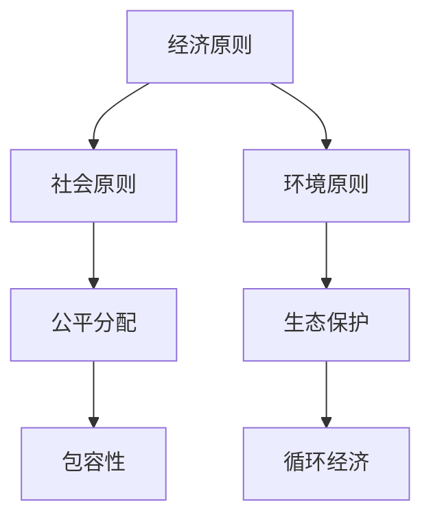
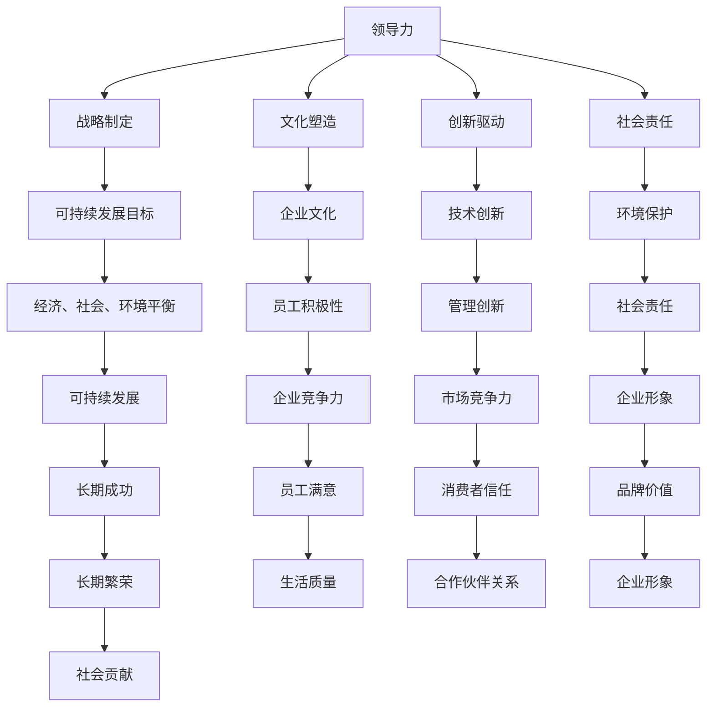
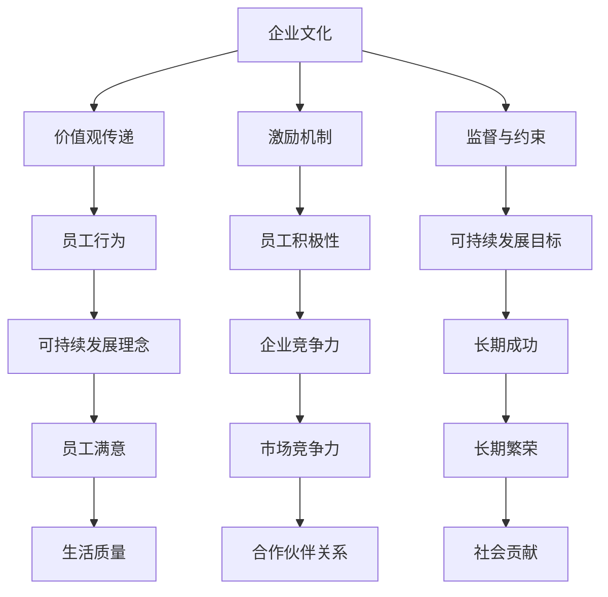

                 

### 文章标题

# 可持续领导：为长期成功奠定基础的方法

### 文章关键词

- 可持续领导
- 长期成功
- 领导力
- 可持续发展
- 企业战略
- 文化变革
- 社会责任
- 创新驱动

### 文章摘要

本文探讨了可持续领导在当代商业环境中的重要性，分析了其核心概念、理论基础和实践方法。通过案例分析，本文展示了可持续领导如何帮助组织实现长期成功。文章还讨论了可持续领导面临的挑战及其未来发展趋势，为领导者提供了有价值的指导。

----------------------------------------------------------------

## 目录

1. 引言
   1.1 可持续领导的重要性
   1.2 长期成功与可持续领导
2. 理论基础
   2.1 可持续发展的原则
   2.2 领导力与可持续发展的结合
   2.3 企业文化与价值观在可持续领导中的作用
3. 实践方法
   3.1 制定可持续发展的战略规划
   3.2 推动组织变革
   3.3 培养和激励可持续发展导向的员工
   3.4 承担社会责任
4. 案例分析
   4.1 国际案例
   4.2 本土案例
5. 挑战与未来
   5.1 面临的挑战
   5.2 未来发展趋势

----------------------------------------------------------------

## 第1章 引言

### 1.1 可持续领导的重要性

在当今快速变化的全球化背景下，可持续发展已成为全球企业和组织的共同追求。环境、社会和经济效益的平衡已经成为企业长期成功的基石。可持续领导作为这一背景下的一种新兴领导模式，逐渐受到广泛关注。

#### 可持续发展的定义

可持续发展是指在满足当前需求的同时，不损害后代满足其需求的能力的发展。这一概念涵盖了环境保护、社会公正和经济增长三个维度。

- **环境保护**：确保自然资源得到合理利用，减少污染和生态破坏。
- **社会公正**：促进公平、平等和包容，减少贫困和社会不公。
- **经济增长**：实现经济繁荣，提高生活质量和就业机会。

#### 可持续领导的作用

可持续领导不仅仅是一种策略，更是一种价值观和生活方式的体现。领导者通过可持续领导，能够引导组织实现经济、社会和环境的平衡，为组织的长期成功奠定基础。

#### 可持续领导的核心要素

- **战略规划**：制定长期可持续发展的战略和目标。
- **文化塑造**：建立与可持续发展相契合的企业文化。
- **创新驱动**：通过技术创新和管理创新推动可持续发展。
- **社会责任**：承担企业社会责任，促进社会公正和环境保护。

#### 可持续领导对长期成功的影响

- **增强竞争力**：通过创新和变革保持企业的市场竞争力。
- **提升品牌价值**：可持续领导能够提升品牌形象，吸引更多的消费者和合作伙伴。
- **减少风险**：关注环境保护和社会责任，降低企业面临的法律和道德风险。

### 1.2 长期成功与可持续领导

长期成功不仅取决于企业的财务表现，更取决于企业在可持续发展方面的贡献。可持续领导能够帮助企业建立长期的竞争优势，吸引和留住人才，提升品牌价值，同时减少风险。

#### 长期成功与可持续领导的关系

- **共同目标**：长期成功和可持续领导都追求企业的长期繁荣和可持续发展。
- **相互促进**：可持续领导有助于实现长期成功，而长期成功又能推动可持续领导的发展。

#### 可持续领导如何推动长期成功

- **战略规划**：通过制定明确的可持续发展目标，确保企业在长期内保持竞争力。
- **文化塑造**：建立与可持续发展相一致的企业文化，激发员工的积极性和创造力。
- **社会责任**：承担社会责任，提升企业形象，赢得消费者的信任和忠诚。

### 1.3 本章小结

本章介绍了可持续领导的重要性及其与长期成功的关系。可持续领导不仅是一种策略，更是一种价值观和生活方式的体现，它有助于企业在长期内实现经济、社会和环境的平衡，从而推动长期成功。接下来，我们将进一步探讨可持续领导的理论基础和实践方法。

----------------------------------------------------------------

## 第2章 理论基础

### 2.1 可持续发展的原则

可持续发展理论的核心在于实现经济、社会和环境三者的平衡。以下是可持续发展的基本原则：

#### 经济原则

- **效率优先**：通过提高资源利用效率，减少浪费，实现经济效益的最大化。
- **公平分配**：确保经济发展成果公平分配，减少贫富差距，促进社会稳定。

#### 社会原则

- **以人为本**：关注人的需求和发展，提高生活质量和幸福感。
- **包容性**：促进社会公平、平等和多样性，消除歧视和偏见。

#### 环境原则

- **生态保护**：保护自然资源和生态环境，防止生态破坏和污染。
- **循环经济**：倡导资源循环利用，减少废物排放，实现绿色发展。

#### 可持续发展的关系架构

可持续发展的经济、社会和环境原则之间相互关联，共同构成一个有机整体。以下是一个简化的Mermaid流程图，展示了这三个原则之间的关系：

### 2.2 领导力与可持续发展的结合

领导力在推动可持续发展中发挥着关键作用。有效的可持续领导能够将可持续发展的理念融入组织战略、文化和实践中。

#### 领导力在可持续发展中的作用

- **战略制定**：领导者通过制定可持续发展战略，明确组织的发展方向和目标。
- **文化塑造**：领导者通过塑造与可持续发展相一致的企业文化，激发员工的积极性和创造力。
- **创新驱动**：领导者鼓励创新，推动新技术和管理方法的应用，以实现可持续发展目标。
- **社会责任**：领导者承担企业社会责任，推动环境保护和社会公正。

#### 领导力与可持续发展的关系架构

以下是一个简化的Mermaid流程图，展示了领导力与可持续发展之间的互动关系：

### 2.3 企业文化与价值观在可持续领导中的作用

企业文化是企业内部共同价值观、信念和行为准则的集合。在可持续领导中，企业文化起着至关重要的作用。

#### 企业文化的作用

- **引导行为**：企业文化塑造员工的行为方式和价值观，使其与可持续发展的理念相一致。
- **增强凝聚力**：共同的企业文化能够增强员工的归属感和团队凝聚力。
- **驱动创新**：企业文化鼓励创新和变革，推动可持续发展。
- **提升竞争力**：健康的企业文化能够提升企业的市场竞争力。

#### 企业文化在可持续领导中的角色

- **价值观传递**：领导者通过企业文化的传递，将可持续发展的价值观融入员工的日常工作和生活中。
- **激励机制**：通过企业文化的激励机制，鼓励员工为实现可持续发展目标做出贡献。
- **监督与约束**：企业文化对员工的行为进行监督和约束，确保可持续发展目标的实现。

#### 企业文化的关系架构

以下是一个简化的Mermaid流程图，展示了企业文化在可持续领导中的角色：

### 2.4 本章小结

本章探讨了可持续发展的基本原则、领导力与可持续发展的结合以及企业文化在可持续领导中的作用。可持续领导不仅需要遵循可持续发展的原则，还需要领导者的正确引导和企业文化的支持。下一章将详细介绍可持续领导的具体实践方法。

----------------------------------------------------------------

## 第3章 实践方法

### 3.1 制定可持续发展的战略规划

制定可持续发展的战略规划是可持续领导的关键步骤。一个有效的战略规划可以帮助企业明确目标、资源分配和实施路径，从而确保可持续发展目标的实现。

#### 制定战略规划的关键步骤

1. **明确目标**：制定可持续发展目标，确保目标与企业的使命、愿景和价值观相一致。这些目标可以是长期的，也可以是分阶段的。
2. **资源分配**：明确为实现可持续发展目标所需的人力、物力和财力资源，并确保资源的有效利用。
3. **风险评估**：评估可能影响可持续发展目标实现的风险，并制定相应的应对措施。
4. **制定实施路径**：明确实现可持续发展目标的步骤和方法，确保各项措施能够顺利实施。

#### 案例分析：华为的可持续发展战略规划

华为作为中国领先的信息与通信技术（ICT）解决方案供应商，其可持续发展战略规划在业界具有代表性。以下是华为可持续发展战略规划的核心要点：

1. **目标明确**：华为的可持续发展目标包括实现业务增长与环境保护的平衡，推动全球数字化发展，促进社会进步等。
2. **资源分配**：华为投入大量资源用于研发、环保技术和社会责任项目，确保可持续发展目标的实现。
3. **风险评估**：华为定期评估业务和运营中的环境、社会和治理（ESG）风险，并制定相应的风险管理策略。
4. **实施路径**：华为通过制定具体的行动计划，如推进绿色制造、加强环保技术研发、支持教育和社会公益等，确保可持续发展目标的实现。

#### 制定战略规划的最佳实践

- **多方参与**：制定战略规划时，应邀请企业内外部的相关利益相关者参与，确保规划的科学性和可操作性。
- **持续更新**：战略规划应根据外部环境和企业内部情况的变化进行定期更新，以确保规划的持续性和有效性。

### 3.2 推动组织变革

推动组织变革是可持续领导的重要任务，因为它有助于企业适应外部环境的变化，提高组织的灵活性和创新能力。

#### 组织变革的关键因素

1. **领导者的角色**：领导者作为变革的推动者，需要发挥榜样作用，激励员工支持和参与变革。
2. **沟通与共识**：确保员工充分理解变革的必要性和目标，建立共识，减少变革过程中的阻力。
3. **培训与发展**：提供必要的培训和发展机会，帮助员工适应新的工作方式和技能要求。
4. **激励机制**：制定激励政策，奖励变革过程中的积极参与者和成功实施者。

#### 案例分析：谷歌的组织变革

谷歌作为全球领先的科技公司，其组织变革在业界备受关注。以下是谷歌组织变革的核心要点：

1. **领导者的角色**：谷歌的创始人拉里·佩奇和谢尔盖·布林在组织变革中发挥了关键作用，他们鼓励员工创新和尝试新事物。
2. **沟通与共识**：谷歌通过定期内部会议和沟通渠道，确保员工了解公司的战略方向和变革目标，建立共识。
3. **培训与发展**：谷歌提供丰富的培训和发展机会，帮助员工提升技能和适应新的工作要求。
4. **激励机制**：谷歌通过股票期权和奖金等激励政策，鼓励员工积极参与变革和创新。

#### 推动组织变革的最佳实践

- **逐步实施**：变革应逐步进行，避免一次性改革带来的冲击和阻力。
- **持续关注**：变革后，领导者应持续关注变革的实施效果，及时调整策略和措施。

### 3.3 培养和激励可持续发展导向的员工

培养和激励可持续发展导向的员工是可持续领导的重要任务，因为这有助于企业实现可持续发展目标，并提升员工的满意度和忠诚度。

#### 培养员工的关键因素

1. **价值观教育**：通过价值观教育，帮助员工树立可持续发展的理念，认同企业的可持续发展目标。
2. **技能培训**：提供与可持续发展相关的技能培训，帮助员工掌握实现可持续发展目标所需的技能。
3. **创新激励**：鼓励员工提出创新想法和解决方案，推动企业的可持续发展。

#### 案例分析：苹果公司的员工培养和激励

苹果公司作为全球领先的科技公司，其在员工培养和激励方面的实践具有代表性。以下是苹果公司员工培养和激励的核心要点：

1. **价值观教育**：苹果公司强调员工的价值观教育，鼓励员工关注可持续发展和环境保护。
2. **技能培训**：苹果公司提供丰富的培训机会，帮助员工提升专业技能和可持续发展相关的知识。
3. **创新激励**：苹果公司鼓励员工创新，提供奖励和荣誉，激励员工为实现可持续发展目标做出贡献。

#### 培养和激励员工的最佳实践

- **个性化发展**：根据员工的兴趣和潜力，提供个性化的发展机会和培训。
- **公平公正**：确保员工在培养和激励过程中得到公平公正的待遇，提升员工的满意度和忠诚度。

### 3.4 承担社会责任

承担社会责任是可持续领导的重要组成部分，它有助于提升企业的社会形象，增强企业的竞争力。

#### 承担社会责任的关键因素

1. **环境保护**：企业应采取环境保护措施，减少环境污染和资源消耗。
2. **社会公益**：企业应积极参与社会公益活动，支持教育事业、扶贫救济等。
3. **员工关怀**：关注员工的身心健康，提供良好的工作环境和福利待遇。

#### 案例分析：微软的社会责任实践

微软作为全球领先的科技公司，其在社会责任方面的实践具有代表性。以下是微软社会责任实践的核心要点：

1. **环境保护**：微软在全球范围内推动绿色办公，减少碳排放，推广可再生能源的使用。
2. **社会公益**：微软积极参与社会公益活动，支持教育、科技和环境保护等领域。
3. **员工关怀**：微软关注员工的职业发展和身心健康，提供灵活的工作时间和福利待遇。

#### 承担社会责任的最佳实践

- **长期投入**：企业应将社会责任作为长期战略，持续投入资源，实现可持续发展。
- **透明公开**：企业应公开社会责任报告，接受公众监督，提升社会责任的透明度和公信力。

### 3.5 本章小结

本章介绍了制定可持续发展战略规划、推动组织变革、培养和激励可持续发展导向的员工以及承担社会责任等实践方法。这些方法有助于企业实现可持续发展目标，提升企业的竞争力和社会形象。下一章将分析可持续领导在不同领域的成功案例。

----------------------------------------------------------------

## 第4章 案例分析

### 4.1 国际案例

在国际范围内，许多知名企业通过可持续领导实现了长期成功。以下介绍两个具有代表性的国际案例。

#### 案例一：亚马逊的可持续领导

亚马逊作为全球最大的电子商务公司，其可持续领导实践在业界具有显著的影响力。以下是亚马逊在可持续领导方面的主要举措：

1. **绿色物流**：亚马逊推出了“Amazon Logistics”计划，通过使用电动汽车和可再生能源，减少物流环节的碳排放。
2. **环保包装**：亚马逊推行环保包装政策，使用可回收和可降解材料，减少塑料污染。
3. **可再生能源使用**：亚马逊在全球范围内投资建设可再生能源项目，以减少对化石燃料的依赖。

#### 案例分析：

- **成功原因**：亚马逊的可持续领导成功在于其对环保理念的深入贯彻和科技创新的驱动。通过绿色物流、环保包装和可再生能源的使用，亚马逊不仅实现了环境效益，还提升了品牌形象，赢得了消费者的信任。
- **借鉴意义**：亚马逊的案例表明，企业可以通过技术创新和环保措施，实现经济、社会和环境的平衡，为长期成功奠定基础。

#### 案例二：谷歌的可持续发展战略

谷歌作为全球领先的科技公司，其可持续发展战略在业界具有典范作用。以下是谷歌在可持续发展方面的主要举措：

1. **绿色办公**：谷歌在全球范围内的办公场所采用节能设计，提高能源利用效率，减少碳排放。
2. **员工福利**：谷歌提供全面的员工福利计划，包括健康体检、心理健康支持、灵活工作时间等，关注员工的身心健康。
3. **社会公益**：谷歌积极参与社会公益活动，支持教育、科技和环境保护等领域。

#### 案例分析：

- **成功原因**：谷歌的可持续发展战略成功在于其对员工福利和社会责任的重视。通过绿色办公、员工福利和社会公益，谷歌不仅提升了员工的满意度和忠诚度，还增强了企业的社会形象，为长期成功奠定了基础。
- **借鉴意义**：谷歌的案例表明，企业可以通过关注员工福利和社会责任，实现可持续发展，提升企业的竞争力和社会影响力。

### 4.2 本土案例

在国内，也有许多企业通过可持续领导实现了长期成功。以下介绍两个具有代表性的本土案例。

#### 案例一：华为的可持续发展战略

华为作为中国领先的信息与通信技术（ICT）解决方案供应商，其可持续发展战略在业界备受关注。以下是华为在可持续发展方面的主要举措：

1. **绿色制造**：华为在全球范围内推行绿色制造政策，通过提高生产效率和减少能源消耗，降低碳排放。
2. **环保创新**：华为积极研发环保技术，如太阳能发电和高效能通信设备，推动产业绿色发展。
3. **社会责任**：华为积极参与社会公益活动，支持教育、扶贫和环境保护等领域。

#### 案例分析：

- **成功原因**：华为的可持续发展战略成功在于其对环保和创新的重视。通过绿色制造、环保创新和社会责任，华为不仅提升了企业的竞争力，还增强了企业的社会形象，为长期成功奠定了基础。
- **借鉴意义**：华为的案例表明，中国企业在可持续发展方面具有巨大潜力，通过技术创新和环保措施，可以实现经济、社会和环境的平衡。

#### 案例二：阿里巴巴的社会责任实践

阿里巴巴作为全球领先的数字经济体，其在社会责任方面的实践具有代表性。以下是阿里巴巴在社会责任方面的主要举措：

1. **扶贫公益**：阿里巴巴通过阿里巴巴公益平台，支持贫困地区的发展，推动社会公平。
2. **绿色物流**：阿里巴巴与物流合作伙伴合作，推广绿色物流，减少碳排放。
3. **员工福利**：阿里巴巴提供全面的员工福利计划，关注员工的身心健康。

#### 案例分析：

- **成功原因**：阿里巴巴的社会责任实践成功在于其对扶贫、环保和员工关怀的重视。通过扶贫公益、绿色物流和员工福利，阿里巴巴不仅提升了企业的社会责任形象，还增强了企业的核心竞争力。
- **借鉴意义**：阿里巴巴的案例表明，中国企业在社会责任方面可以发挥积极作用，通过公益活动和环保措施，推动社会进步。

### 4.3 本章小结

本章通过国际和本土两个层面的案例，分析了可持续领导在不同领域的成功实践。这些案例表明，可持续领导不仅有助于实现企业的长期成功，还能提升企业的社会形象和核心竞争力。下一章将探讨可持续领导面临的挑战及其未来发展趋势。

----------------------------------------------------------------

## 第5章 挑战与未来

### 5.1 面临的挑战

尽管可持续领导在实现企业长期成功方面具有显著优势，但在实践中仍面临一系列挑战。

#### 挑战一：文化与价值观的冲突

企业文化与可持续发展的价值观可能存在冲突。传统企业文化可能更注重短期利益和绩效，而可持续发展则强调长期利益和社会责任。这种冲突可能导致员工对可持续领导的理解和接受程度较低。

#### 挑战二：技术创新的压力

可持续领导要求企业不断创新，推动绿色技术和可持续发展解决方案的应用。然而，技术创新往往需要大量的资金投入和时间，这对企业尤其是中小企业来说是一个巨大的挑战。

#### 挑战三：外部环境的制约

可持续领导受到外部环境的制约，包括政策法规、市场需求和竞争压力等。政策法规的变化可能会影响企业的可持续发展战略，市场需求的不确定性也可能导致企业在可持续发展方面的不确定性。

### 5.2 未来发展趋势

随着全球可持续发展的不断推进，可持续领导在未来将继续发展，并呈现出以下趋势。

#### 发展趋势一：数字化与可持续领导融合

数字化技术的快速发展将推动可持续领导与数字技术的深度融合。通过大数据、人工智能和物联网等数字技术，企业可以更精确地监测和评估可持续发展绩效，实现更高效的资源管理和环境保护。

#### 发展趋势二：社会责任的深化

企业社会责任（CSR）将成为可持续领导的重要组成部分。企业将更加关注员工福利、社区发展和环境保护等领域，通过实施全面的社会责任战略，提升企业的社会形象和核心竞争力。

#### 发展趋势三：全球合作的加强

可持续领导需要全球范围内的合作。企业将加强与国际组织和非政府组织的合作，共同应对全球性挑战，如气候变化、贫困和环境保护等。

#### 发展趋势四：可持续领导标准的建立

未来，可持续领导将逐步形成一套标准化的体系，包括评价体系、管理体系和实践指南等。这将有助于企业更好地实施可持续领导，提升其可持续发展能力。

### 5.3 为未来做好准备

为了应对可持续领导面临的挑战和把握未来发展趋势，企业应采取以下措施：

#### 提高员工意识

企业应加强员工的可持续发展教育，提高员工对可持续领导的理解和接受程度，形成共同的价值观念。

#### 强化技术创新

企业应加大研发投入，培养技术创新能力，推动绿色技术和可持续发展解决方案的应用。

#### 建立评价体系

企业应建立可持续发展的评价体系，定期评估和反馈可持续发展绩效，持续改进和优化可持续发展战略。

#### 加强合作与交流

企业应积极参与国际合作和交流，借鉴先进经验和最佳实践，提升自身的可持续发展能力。

### 5.4 本章小结

本章分析了可持续领导面临的挑战和未来发展趋势。企业应积极应对挑战，把握未来发展趋势，为长期成功奠定基础。通过提高员工意识、强化技术创新、建立评价体系和加强合作与交流，企业可以更好地实施可持续领导，实现可持续发展。

### 总结与展望

可持续领导作为现代企业发展的关键，其在长期成功中的重要作用不容忽视。本文通过理论探讨和实践案例分析，详细介绍了可持续领导的核心概念、理论基础和实践方法。同时，分析了可持续领导面临的挑战和未来发展趋势，为企业提供了有价值的指导。

展望未来，随着全球可持续发展的深入推进，可持续领导将变得更加重要。企业应积极应对挑战，把握发展趋势，通过提高员工意识、强化技术创新、建立评价体系和加强合作与交流，实现可持续发展，为长期成功奠定坚实基础。

### 拓展阅读

- 《可持续发展：从理念到实践》
- 《企业社会责任：战略与案例》
- 《绿色领导力：实现可持续发展之路》
- 《数字化转型：企业可持续发展新引擎》

### 小结与注意事项

- **关键知识点**：本文介绍了可持续领导的核心概念、理论基础和实践方法，以及面临的挑战和未来发展趋势。
- **注意事项**：企业在实施可持续领导时，应注重员工意识、技术创新和合作与交流，确保可持续发展战略的有效实施。

### 作者信息

作者：AI天才研究院/AI Genius Institute & 禅与计算机程序设计艺术 /Zen And The Art of Computer Programming

