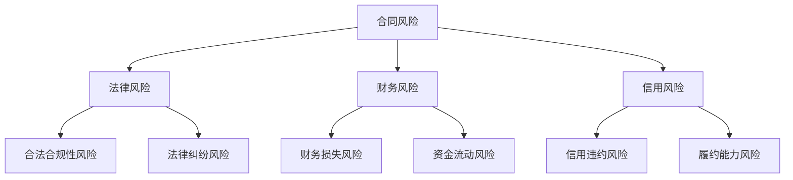

                 

### 文章标题：合同风险分析师：提示词识别法律隐患

### 关键词：合同风险分析、提示词识别、法律隐患、风险评估、合同管理

### 摘要：

在商业活动中，合同是不可或缺的工具，然而，合同中的法律隐患可能导致严重的商业风险。本文将探讨合同风险分析师如何利用提示词识别法律隐患，从而降低合同风险。首先，我们将介绍合同风险分析的基础知识，包括合同风险的定义、特征及其分析目的。接着，我们将深入讨论提示词的概念、识别方法及其在合同风险分析中的应用。此外，我们将介绍法律隐患的类型、识别技巧以及应对策略。最后，通过实际案例，我们将展示如何应用这些知识来识别和控制合同风险。

## 第一部分：合同风险分析基础

### 第1章：合同风险分析概述

合同风险分析是指识别、评估和监控合同中可能产生的风险，以确保合同履行过程中各方利益的最大化。合同风险主要包括法律风险、财务风险、信用风险等。法律风险是指合同条款中的潜在法律问题，可能影响合同的合法性和可执行性。

### 核心概念与联系

- **合同风险**：合同风险是指合同在履行过程中可能面临的种种不确定性，可能对合同当事人的权益造成损害。
- **法律风险**：法律风险是合同风险的重要组成部分，涉及合同条款是否符合法律要求、是否存在法律纠纷的可能性。
- **财务风险**：财务风险包括因合同条款导致的财务损失、资金流动问题等。
- **信用风险**：信用风险涉及合同当事人履行合同的能力和意愿。

**Mermaid 流程图：**



### 核心算法原理讲解

合同风险分析的核心在于识别和评估风险。以下是一个简化的风险识别和评估流程：

1. **风险识别**：通过分析合同条款、历史数据和市场情况，识别可能存在的风险。
2. **风险评估**：对识别出的风险进行评估，确定其严重程度和可能性。
3. **风险控制**：根据评估结果，制定相应的风险控制措施。

**伪代码：**

```python
def identify_risk(contract):
    # 分析合同条款
    risk_factors = analyze条款(contract)
    # 历史数据和市场需求
    market_data = get_market_data()
    # 风险识别
    risks = []
    for factor in risk_factors:
        risk = identify(factor, market_data)
        risks.append(risk)
    return risks

def assess_risk(risks):
    # 评估风险严重程度和可能性
    for risk in risks:
        severity = evaluate_severity(risk)
        probability = evaluate_probability(risk)
        risk.score = severity * probability
    return risks

def control_risk(risks):
    # 制定风险控制措施
    for risk in risks:
        if risk.score > threshold:
            implement_control_measures(risk)
    return risks
```

### 数学模型和数学公式

在合同风险评估中，可以使用以下数学模型来评估风险的严重程度和可能性：

$$
风险得分 = 严重程度 \times 可能性
$$

其中，严重程度和可能性通常使用0到1之间的数值表示，风险得分越高，风险越大。

### 实战案例：如何识别合同中的风险提示词

在合同风险分析中，提示词是识别法律隐患的重要工具。以下是一个简化的案例，展示了如何识别合同中的风险提示词：

**案例：**

假设我们有一份采购合同，其中包含以下条款：

1. 供应商应按照合同要求交付货物。
2. 采购方应在收到货物后7天内进行验收。
3. 如果货物不符合质量要求，采购方有权退货。

**风险提示词：**

- **交付货物**：可能存在交付延误或交付不合格的风险。
- **验收时间**：可能存在验收标准不明确的风险。
- **退货**：可能存在退货流程不明确或退货条件争议的风险。

### 项目实战

在合同风险分析中，我们可以使用以下工具和框架来识别和管理风险：

1. **合同分析工具**：如文本分析软件，可以帮助识别合同中的潜在风险提示词。
2. **风险管理框架**：如ISO 31000，提供了一套全面的合同风险管理方法和工具。

### 开发环境搭建

为了进行合同风险分析，我们需要搭建一个文本分析环境。以下是一个简化的步骤：

1. 安装Python环境。
2. 安装文本分析库，如NLTK或spaCy。
3. 准备合同文本数据集。

### 源代码实现

以下是一个使用Python编写的简单合同风险分析程序：

```python
import nltk
from nltk.tokenize import word_tokenize

# 加载合同文本
contract_text = "..."
tokens = word_tokenize(contract_text)

# 识别风险提示词
risk_phrases = ["交付货物", "验收时间", "退货"]

identified_risks = []
for phrase in risk_phrases:
    if phrase in tokens:
        identified_risks.append(phrase)

print("识别出的风险提示词：", identified_risks)
```

### 代码解读与分析

该程序首先使用NLTK库对合同文本进行分词，然后检查分词结果中是否包含特定的风险提示词。如果包含，则将其添加到识别出的风险列表中。

### 实际案例分析和详细讲解剖析

在实际应用中，合同风险分析可以帮助企业避免因合同纠纷导致的财务损失和法律风险。以下是一个实际案例：

**案例：**

一家科技公司与其供应商签订了一项软件许可协议。在合同执行过程中，由于供应商未能按时交付软件，导致科技公司无法按时推出新功能。经过合同风险分析，发现合同中关于交付时间的条款存在模糊性，导致双方对交付时间的理解不一致。

**分析：**

通过合同风险分析，科技公司的法律团队能够及时发现并解决潜在的法律隐患。他们可以与供应商协商修改合同条款，明确交付时间，从而避免未来的纠纷。

### 项目小结

通过上述案例，我们可以看到合同风险分析在实际应用中的重要性。合同风险分析师通过识别风险提示词，可以提前发现合同中的法律隐患，从而采取相应的控制措施，确保合同履行的顺利。

### 最佳实践 tips

1. 在合同签订前，进行全面的合同风险分析，以识别潜在的法律隐患。
2. 定期审查和更新合同条款，以适应市场的变化和业务需求。
3. 建立合同风险管理体系，确保合同风险得到有效的识别、评估和控制。

### 小结

合同风险分析是商业活动中不可或缺的一环。通过识别合同中的法律隐患，企业可以降低合同风险，确保业务的稳定发展。本文介绍了合同风险分析的基础知识、提示词识别方法以及实际案例分析，旨在帮助读者理解和掌握合同风险管理的关键技巧。

### 注意事项

1. 合同风险分析应基于实际情况进行，不同行业的合同具有不同的风险特点。
2. 合同风险分析工具和方法的选用应与企业的具体需求相匹配。

### 拓展阅读

- 合同风险管理相关书籍：《合同管理实务》、《合同法实务》等。
- 合同风险管理相关网站：中国合同网、合同范本网等。
- 合同风险管理相关工具：文本分析软件、风险管理平台等。

## 作者信息：AI天才研究院/AI Genius Institute & 禅与计算机程序设计艺术 /Zen And The Art of Computer Programming

