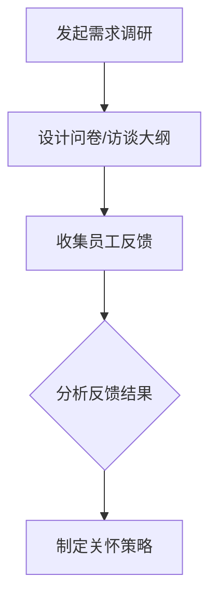
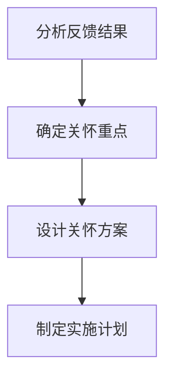
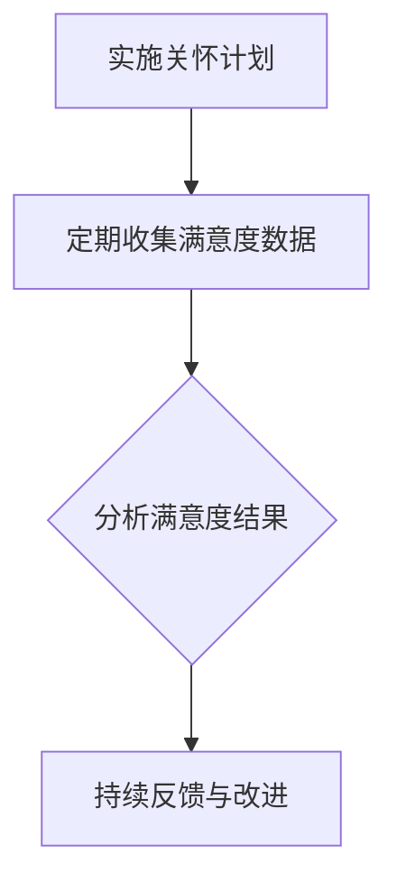
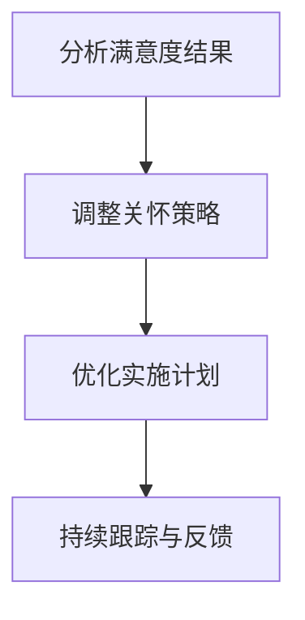

                 

### 员工关怀计划：建立深厚情感纽带

> 关键词：员工关怀、员工满意度、员工忠诚度、数据模型、项目实战

> 摘要：本文将探讨员工关怀计划的重要性，详细解析其核心概念、实施流程以及数据模型构建。通过项目实战案例分析，提供实际操作指导，旨在帮助企业建立深厚的情感纽带，提升员工满意度和忠诚度。

---

# 员工关怀计划：建立深厚情感纽带

在当今竞争激烈的企业环境中，员工关怀计划已成为企业战略的重要组成部分。这不仅关乎员工的福祉，更是企业长期成功的关键。本文将从以下几个方面展开讨论：

1. 员工关怀计划的概念与背景
2. 员工关怀计划的重要性
3. 员工关怀计划的组成部分
4. 员工关怀计划的实施流程
5. 员工关怀模型的数据分析
6. 项目实战案例分析
7. 最佳实践与项目小结

## 1. 员工关怀计划的概念与背景

### 1.1 员工关怀计划的定义

员工关怀计划是指企业通过一系列措施，旨在提升员工的满意度、幸福感和忠诚度，从而增强员工的归属感和工作效率。这些措施包括但不限于福利、培训、职业发展机会、心理健康支持等。

### 1.2 员工关怀计划的背景

随着员工对工作环境和职业发展的需求日益多样化，企业意识到单纯的物质激励已经无法满足员工的深层需求。因此，员工关怀计划应运而生，成为企业吸引和留住人才的重要手段。

## 2. 员工关怀计划的重要性

### 2.1 员工关怀对企业的影响

- **提升员工满意度**：关怀员工能提高员工对企业的认同感和满意度，从而增强员工的积极性和工作效率。
- **降低员工流失率**：良好的员工关怀计划能有效减少员工流失，降低招聘和培训成本。
- **提升企业品牌形象**：关注员工福祉的企业往往拥有良好的社会声誉，有助于吸引更多优秀人才。

### 2.2 员工关怀计划的好处

- **增强团队凝聚力**：通过团队建设活动和培训，增强员工之间的联系和合作。
- **促进员工职业发展**：提供职业规划和培训机会，帮助员工实现个人和职业成长。
- **提高工作效率**：关注员工身心健康，降低因压力和疲劳导致的工作失误。

## 3. 员工关怀计划的组成部分

### 3.1 员工需求调研

通过调查和访谈，了解员工的真实需求和期望，为关怀计划提供数据支持。

### 3.2 制定关怀策略

根据员工需求调研结果，制定具体的关怀措施和策略，确保计划的可行性和有效性。

### 3.3 评估员工满意度

定期收集员工满意度数据，分析员工关怀计划的效果，为持续改进提供依据。

### 3.4 持续反馈与改进

基于员工满意度评估结果，不断调整和优化关怀计划，确保其持续性和有效性。

## 4. 员工关怀计划的实施流程

### 4.1 员工需求调研

首先，企业需要通过问卷调查、访谈等方式，全面了解员工的需求和期望。以下是调研流程的Mermaid流程图：



### 4.2 制定关怀策略

根据员工需求调研结果，制定具体的关怀策略。以下是策略制定的Mermaid流程图：



### 4.3 评估员工满意度

实施关怀计划后，定期收集员工满意度数据，评估计划效果。以下是满意度评估的Mermaid流程图：



### 4.4 持续反馈与改进

基于满意度评估结果，不断调整和优化关怀计划，确保其持续性和有效性。以下是反馈与改进的Mermaid流程图：



## 5. 员工关怀模型的数据分析

### 5.1 员工满意度评分模型

员工满意度评分模型用于衡量员工对企业关怀计划的整体满意度。以下是模型的伪代码：

```python
def calculate_satisfaction(scores):
    total_score = sum(scores)
    average_score = total_score / len(scores)
    return average_score
```

### 5.2 员工忠诚度预测模型

员工忠诚度预测模型用于预测员工在未来一段时间内是否会离职。以下是模型的伪代码：

```python
def predict_loyalty(features):
    # 使用机器学习算法预测员工忠诚度
    # features为输入特征向量
    loyalty_score = model.predict(features)
    return loyalty_score
```

## 6. 项目实战案例分析

### 6.1 需求分析与方案设计

以某知名互联网公司为例，该公司通过问卷调查和访谈，了解到员工在福利、职业发展、工作环境等方面有较高的需求。基于这些需求，公司制定了以下关怀方案：

1. 提供灵活的弹性工作制度，以满足员工对工作与生活的平衡需求。
2. 增设员工培训和发展计划，提升员工的职业技能和职业发展机会。
3. 优化员工福利政策，如提高年假天数、增加医疗保险报销比例等。

### 6.2 实施步骤与注意事项

实施关怀计划时，公司采取了以下步骤：

1. 制定详细的实施计划，明确时间表和责任人。
2. 建立反馈机制，及时收集员工对关怀计划的意见和建议。
3. 定期组织员工满意度调查，评估计划效果。

### 6.3 效果评估与持续改进

通过定期收集员工满意度数据和离职率数据，公司发现：

1. 员工对弹性工作制度和培训计划的满意度较高。
2. 福利政策的优化有效降低了员工流失率。

基于这些反馈，公司决定：

1. 继续优化弹性工作制度，如增加远程办公的灵活性。
2. 拓展员工培训内容，增加心理健康、领导力等方面的培训。
3. 进一步提升员工福利水平，如增加带薪假期和员工福利计划。

## 7. 最佳实践与项目小结

### 7.1 最佳实践 Tips

1. **关注员工个性化需求**：根据员工的个性化需求，提供有针对性的关怀措施。
2. **建立反馈机制**：及时收集员工反馈，持续改进关怀计划。
3. **注重数据驱动**：利用数据分析，量化员工满意度，指导关怀计划的实施。

### 7.2 项目小结

通过项目实战案例分析，我们可以看到，员工关怀计划对企业的发展和员工的福祉具有重要意义。成功的员工关怀计划不仅能够提升员工满意度和忠诚度，还能增强企业的竞争力。企业在实施员工关怀计划时，应关注员工个性化需求，建立反馈机制，并利用数据分析指导实践。

## 结语

员工关怀计划是企业构建深厚情感纽带的重要手段。通过本文的探讨，我们了解到员工关怀计划的核心概念、实施流程以及数据分析方法。希望本文能为企业在实施员工关怀计划时提供有益的参考和指导。

---

**作者：AI天才研究院/AI Genius Institute & 禅与计算机程序设计艺术 /Zen And The Art of Computer Programming**

